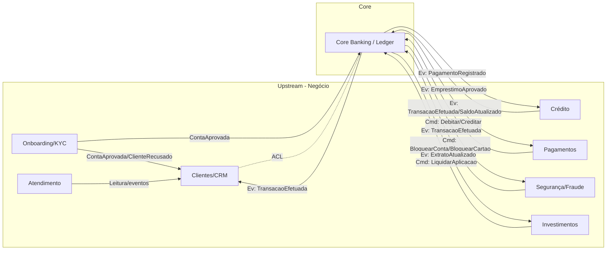

# Caso de Exercício DDD — Banco da Federação Galática (Separação de Domínios e Core Domain)

> Galera, eu sei que em Star Trek não existe o conceito de dinheiro. Vamo brinca. 

## 1) Storytelling: A Jornada do Banco da Federação Galática 
O **Banco da Federação Galática** opera há décadas com um monolito onde “Cliente” é um registro único (CPF/CNPJ) associado a contas e saldos. A chegada do **PIX**, novos produtos e regulações tornou o sistema difícil de evoluir: ciclos longos de entrega, bugs colaterais e pouca clareza entre negócio e tecnologia. A diretoria decide uma transformação com **Domain-Driven Design (DDD)** para reduzir acoplamento, aumentar autonomia de times e permitir escala seletiva (apenas onde o negócio exige).

**Problemas atuais que motivam o DDD:**  
- **Evolução lenta** (qualquer mudança toca tudo).  
- **Efeitos colaterais** em áreas não relacionadas.  
- **Linguagem ambígua** entre times e especialistas.  
- **Picos mal atendidos** (lotes de PIX, fechamento de fatura).  

---

## 2) Principais Features (Escopo do Exercício)

### Portal/App (Clientes)
- **Abertura de Conta Digital**: captura de dados, documentos, aprovação (KYC/AML).
- **Saldo e Extrato**: visão detalhada por conta e período.
- **Transferências**: TED, DOC, **PIX** (envio/recebimento).
- **Pagamentos**: boletos e contas.
- **Cartões**: solicitação, bloqueio/desbloqueio, fatura.
- **Empréstimos**: simulação, contratação, acompanhamento.
- **Investimentos**: aplicação e resgate.

### Backoffice (Funcionários)
- **Gestão de Contas**: abertura/encerramento em casos especiais, bloqueios, ajustes.
- **SAC/Atendimento**: registro de contatos, resolução de problemas.
- **Análise de Crédito**: avaliação de risco para cartões/loans.
- **Fraude/Security**: detecção e resposta.
- **Relatórios/Auditoria**: conformidade regulatória.
- **Gestão de Produtos**: criar/configurar empréstimos e investimentos.

---

## 3) Identificação Inicial de Domínios (para o aluno refinar)
- **Contas / Core Banking**: saldos, lançamentos, razão (ledger), reconciliação.
- **Clientes (Cadastro/CRM)**: dados cadastrais, contatos, preferências.
- **Pagamentos**: PIX, TED, DOC, boletos, liquidação.
- **Crédito**: empréstimos, cartões, risco.
- **Segurança e Fraude**: autenticação, autorização, monitoramento.
- **Investimentos**: produtos e posições do cliente.
- **Atendimento (SAC)**: interações, protocolos, SLA.

**Tarefa do aluno:** ajustar/estender a lista, **agrupar** funcionalidades e justificar fronteiras.

---

## 4) Core Domains (exigir justificativa)
Candidatos a core domain (foco estratégico, diferenciação, risco/receita):  
- **Contas/Core Banking** (integridade financeira, fonte de verdade de saldos).  
- **Crédito** (motor de receita, risco, personalização).  
- **Segurança/Fraude** (confiança, proteção de ativos, reputação).

**Tarefa do aluno:** confirmar o **Core Domain** (um ou mais) e classificar os demais como **suporte** ou **genéricos**, justificando segundo estratégia do Banco Confiança.

---

## 5) Entidades & Agregados (amostras para guiar a modelagem)

### 5.1 Contas/Core Banking (candidato a Core Domain)
- **`ContaBancaria` (Aggregate Root)**  
  Atributos: `contaId`, `numero`, `tipo`, `status`, `clienteRef`  
  Regras: bloqueio/desbloqueio, invariantes de saldo, auditoria de ajustes.  
- **`Lancamento` (Evento/Entidade do Ledger)**  
  Atributos: `lancamentoId`, `contaId`, `tipo` (crédito/débito), `valor`, `dataHora`, `correlacao`  
  Regras: imutabilidade, dupla entrada (balanço zero), idempotência.
- **`Transacao` (Transferência/Movimento)**  
  Atributos: `transacaoId`, `origemId`, `destinoId`, `valor`, `meio` (PIX/TED/etc.), `status`.  
  Regras: atomicidade entre contas, compensações controladas.

### 5.2 Crédito
- **`Emprestimo` (Aggregate Root)**  
  Atributos: `emprestimoId`, `clienteRef`, `valor`, `juros`, `parcelas[]`, `status`.  
  Regras: aprovação, cálculo de juros, amortização, atraso.  
- **`SolicitacaoEmprestimo`**  
  Atributos: `solicitacaoId`, `clienteRef`, `valor`, `prazoMeses`, `renda`, `status`.  
  Regras: triagem, aprovação/recusa com motivo.

### 5.3 Clientes (Cadastro/CRM)
- **`Cliente` (Aggregate Root)**  
  Atributos: `clienteId`, `cpfCnpj`, `nome`, `contatos`, `enderecos[]`, `status`.  
  Regras: atualização validada, status (ativo/bloqueado).

**Tarefa do aluno:** propor **objetos de valor** (ex.: `Dinheiro`, `Documento`, `Endereco`), **invariantes** e **limites transacionais** por agregado.

---

## 6) Bounded Contexts (para mapear linguagem ubíqua e contratos)

1. **Core Banking**  
   Linguagem: `ContaBancaria`, `Lancamento`, `Transacao`.  
   Responsabilidades: razão contábil, saldos, reconciliação, compensações.  
   Contratos: recebe comandos de Pagamentos/Crédito; emite `TransacaoEfetuada`, `SaldoAtualizado`.

2. **Onboarding (KYC/AML)**  
   Linguagem: `SolicitacaoDeConta`, `Documento`, `VerificacaoAML`.  
   Contratos: publica `ContaAprovada`/`ClienteRecusado`; integra com Core Banking e Clientes.

3. **Clientes (Cadastro/CRM)**  
   Linguagem: `Cliente`, `Preferencias`, `HistoricoContato`.  
   Contratos: consome eventos para manter visão de relacionamento; não manipula saldos.

4. **Pagamentos**  
   Linguagem: `Pagamento`, `ChavePix`, `Boleto`.  
   Contratos: comanda débitos/créditos no Core Banking; emite `PagamentoProcessado`.

5. **Crédito**  
   Linguagem: `Emprestimo`, `AnaliseDeCredito`, `Parcela`.  
   Contratos: emite `EmprestimoAprovado` → Core Banking credita; consome `PagamentoRecebido`.

6. **Segurança/Fraude**  
   Linguagem: `EventoFraude`, `Alerta`, `Regra`.  
   Contratos: consome transações; pode comandar bloqueios (Core Banking/Clientes).

7. **Investimentos**  
   Linguagem: `Aplicacao`, `Resgate`, `Produto`.  
   Contratos: liquidações via Core Banking; posições próprias.

8. **Atendimento**  
   Linguagem: `Interacao`, `Protocolo`, `SLA`.  
   Contratos: leitura ampla por eventos; não interfere em saldos.

**Tarefa do aluno:** desenhar **Context Map** (direções, conformidade, ACLs), definir **contratos** (comandos/eventos) e **traduções** entre contextos.

---

## 7) Objetivos do Exercício (o que você deve entregar)
1. **Mapa de Domínios** com justificativa do(s) **Core Domain(s)**.  
2. **Context Map** com **Bounded Contexts**, relações (Upstream/Downstream, Customer/Supplier), **Anti-Corruption Layer** quando necessário.  
3. **Glossário de Linguagem Ubíqua** por contexto (mín. 5 termos/contexto).  
4. **Agregados e Regras**: escolha 3 contextos (inclua o Core Banking) e detalhe **Aggregates**, **objetos de valor**, **invariantes** e **transações**.  
5. **Contratos Assíncronos**: eventos-chave (nomes, payload mínimo) e comandos entre contextos críticos (Pagamentos ↔ Core, Crédito ↔ Core, Fraude ↔ Core).  
6. **Riscos e Trade-offs**: 5 decisões arquiteturais com prós/contras (ex.: projeções eventual-consistentes vs. leitura forte; coreografia vs. orquestração em pagamentos).

---

## 8) Critérios de Aceite (para correção)
- Core Domain **claramente defendido** e alinhado à estratégia do banco.  
- **Fronteiras explícitas** (BCs) com linguagem ubíqua distinta e pouca ambiguidade.  
- **Contratos** coerentes (eventos/comandos) e **dependências** assimétricas bem definidas.  
- **Agregados** com invariantes e limites transacionais plausíveis.  
- Uso de **ACL** onde há tradução semântica forte (ex.: CRM ↔ Core Banking).  
- Consistência, segurança e auditoria refletidas nas decisões.

---

## 9) Pistas & Anti-erros
- Evite “Cliente” universal. **Nomeie** significados: `Candidato` (Onboarding) vs `Cliente` (CRM) vs `Titular` (Core).  
- Não exponha `saldo` no CRM; **consuma eventos** e mantenha somente dados de relacionamento.  
- Em Pagamentos, evite transação distribuída; prefira **comando + evento** com confirmação do Core.  
- **Ledger é imutável**; correções via **compensação**.  
- Para integrações legadas, envolva uma **ACL** para preservar a linguagem do Core.

---

### Flow Map do Negócio

### Tarefa final
Com base neste caso, entregue:
- **(A)** Mapa de domínios e **Core Domain** escolhido (+ justificativa).  
- **(B)** Context Map (como acima), adaptado conforme suas decisões.  
- **(C)** Modelagem detalhada de 3 agregados (incluindo `ContaBancaria`).  
- **(D)** Especificação de 6–10 eventos e 3–5 comandos entre contextos.  
- **(E)** 5 trade-offs discutidos com impacto em **consistência, auditoria e risco**.  

Dica: priorize decisões que **eliminem ambiguidade de linguagem** e **reduzam acoplamento** entre contextos, mantendo o **Core Banking** pequeno, preciso e protegido.
