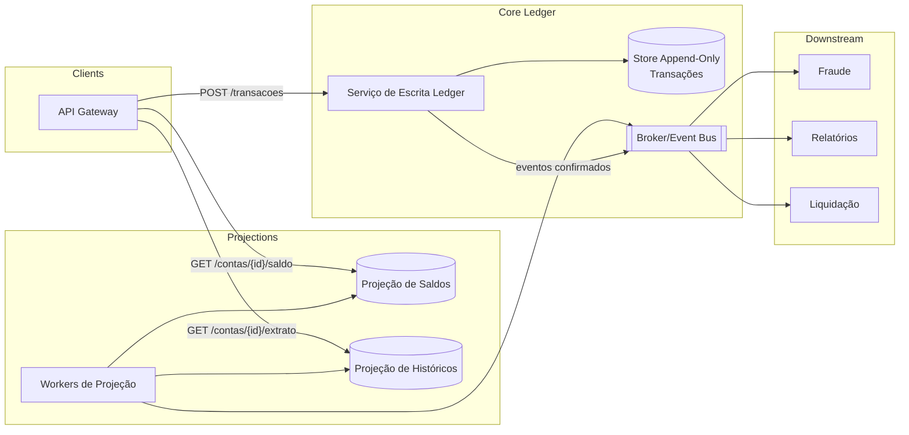

# Ledger Distribuído para Sistema de Pagamentos em Escala

**Nível:** avançado  
**Tema(s):** ledger distribuído, consistência forte, idempotência, particionamento, auditoria, replay de eventos  
**Resumo do problema:**  
Uma fintech precisa implementar um **ledger de transações financeiras** que sirva como **fonte de verdade** para contas correntes e saldos em tempo real. O sistema deve suportar **milhões de transações/dia**, mantendo integridade, auditabilidade e consistência mesmo sob falhas e replicação multirregional. O ledger é imutável (apenas appends), com consultas de saldo e histórico e mecanismos de compensação/estorno.

## Requisitos Funcionais
- **Registrar transações** como eventos imutáveis (débito, crédito, estorno, reversão) com **idempotência**.
- **Consultar saldo** atual por conta (projeção do ledger).
- **Consultar histórico** de uma conta em ordem temporal.
- **Atomicidade multi-conta** (ex.: transferência) com dupla entrada (double-entry).
- **Emitir eventos derivados** para fraude, relatórios e liquidação.
- **Compensações**: transações inversas sem apagar registros.
- APIs:
  - `POST /transacoes` (idempotency key, validações)
  - `GET /contas/{id}/saldo`
  - `GET /contas/{id}/extrato`

## Requisitos Não Funcionais
- **Consistência**: escrita **forte**; projeções de leitura **eventuais** (lag ≤ 5 s).
- **Disponibilidade**: 99,99% para escrita; 99,95% para leitura.
- **Escalabilidade**: 10k TPS por região; preparo para multi-região ativo-ativo.
- **Imutabilidade**: somente append; estornos por compensação.
- **Observabilidade**: trilha de auditoria assinada, métricas de lag de projeção, taxa de estorno, throughput por partição.
- **Segurança**: criptografia em trânsito/repouso, assinatura digital, RBAC/ABAC.
- **Custos**: armazenamento “quente” (últimos N meses) + “frio” para histórico.

## Diagrama Conceitual (Mermaid)

## Detalhes e Pistas de Implementação
- **Idempotência**: `Idempotency-Key` + hash do payload; persistir chave e resultado; retries retornam a mesma resposta.
- **Append-Only Store**: tabela particionada por `account_id` + `event_seq` (ordenável), ou log (ex.: Kafka) + storage durável (ex.: S3+DynamoDB/Cassandra). Garantir ordenação por conta.
- **Double-Entry**: cada transação gera ao menos dois lançamentos (débito/ crédito) com soma zero; validar balanço na mesma unidade de atomicidade.
- **Projeções**: trabalhadores lêem o log e atualizam `BAL` e `HST`. Permitir **replay** integral para recomputar projeções corrompidas.
- **Concorrência**: versão por conta (optimistic concurrency) ou lock fino ao aplicar eventos. Detectar “gap” e forçar reprocessamento.
- **Multi-região**: replicação assíncrona do log; **IDs monotônicos** por partição e **compensações** para resolver conflitos raros; leitura preferencial local, escrita roteada por partição.
- **Auditoria**: assinar eventos (chaves rotacionadas); encadear hashes (Merkle ou hash do evento anterior por conta) para prova de integridade.
- **Resiliência**: DLQ para projeções; backpressure por lag; timeouts e retries com jitter entre serviços.

## Extensões / Perguntas de Reflexão (Opcional)
- Como **particionar**: por `account_id`, por cliente, por região ou por “shard key” sintética? Impacto em hotspots e rebalance?
- Qual política de **consenso/replicação** no store de escrita (raft/consenso vs. quorum KV) equilibra latência e RPO?
- Como projetar **limites e validações** (saldo insuficiente, limites diários) sem bloquear a taxa de escrita?
- Estratégia de **armazenamento frio** (S3/Glacier + Athena/BigQuery) para relatórios longos sem afetar o caminho quente.
- Plano de **rebuild** de projeções online (shadow rebuild + cutover) sem violar SLAs.
- Como expor **provas de integridade** (hash encadeado) para auditorias externas?
