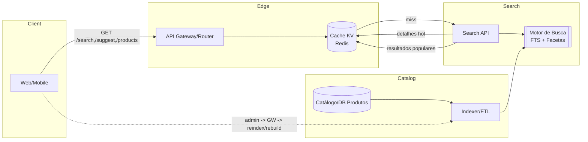

# Busca de Catálogo para Marketplace Local

**Nível:** básico  
**Tema(s):** full-text search, cache, buscas de catálogo, autocomplete  
**Resumo do problema:**  
Um marketplace local de pequenos lojistas precisa de uma busca rápida e relevante sobre um catálogo de ~20 mil produtos. Os usuários devem conseguir pesquisar por nome, descrição e atributos, com **autocomplete**, **filtros (facetas)** e **ordenação** simples. Para reduzir custo e latência, a aplicação deve usar **cache** para resultados populares e detalhamento de produto mais acessado.

## Requisitos Funcionais
- **Indexação** do catálogo (nome, descrição, categoria, marca, preço, atributos chave) com suporte a **sinônimos** e **tolerância a typos**.
- **Busca** por texto livre com **filtros** (categoria, faixa de preço, marca) e **ordenação** (relevância, preço).
- **Autocomplete** (sugestões de termos e produtos) em até 50 ms p95.
- **Detalhes do produto** com dados de estoque e preço atual.
- **Paginação** determinística (limit/offset ou cursor).
- **Admin**: endpoint para **reindexar** produto alterado (parcial) e **rebuild** completo (batch).

## Requisitos Não Funcionais
- **Latência**: p95 < 150 ms para busca; p95 < 50 ms para autocomplete; p95 < 100 ms para detalhes (com cache).
- **Disponibilidade**: 99,5% mensal.
- **Relevância**: ranking básico (BM25 ou similar) + boost por popularidade/categoria.
- **Cache**: resultados de **queries populares** (chave: termo normalizado + filtros) e **detalhes de produto hot** com TTL curto (ex.: 60–180s).
- **Observabilidade**: métricas de taxa de acerto de cache, latência p95/p99 por endpoint, principais queries e erro por índice ausente.
- **Custos**: evitar sobrecarregar o motor de busca com queries repetidas; invalidação de cache por produto atualizado.

## Dicas de Implementação
- **Normalização de termos**: lower-case, remoção de acentos, stopwords; dicionário de **sinônimos** (ex.: “celular” ~ “smartphone”).
- **Typos**: distância de edição (fuzzy) limitada para termos curtos; aplicar só no **último token** da query no autocomplete.
- **Facetas**: armazenar contagens por categoria/marca no índice para computação eficiente.
- **Cache**: camada KV (ex.: Redis) na frente da API:  
  - `GET /search?q=...&facets=...` → cachear corpo da resposta; **invalidação parcial** por `productId` nas queries mais afetadas (ou TTL curto).  
  - `GET /products/{id}` → cache por produto; **invalidação imediata** após atualização de estoque/preço.
- **Indexação**: pipeline simples (ETL do catálogo → motor de busca). Reindexação parcial por webhook quando produto mudar.

## Endpoints (exemplo)
- `GET /search?q=texto&category=...&brand=...&sort=relevance|price_asc&limit=20&cursor=...`
- `GET /suggest?q=tex` (autocomplete de termos e 3–5 produtos)
- `GET /products/{id}`
- `POST /admin/reindex` (parcial por `productId`) e `POST /admin/rebuild` (batch)

## Extensões / Perguntas de Reflexão (Opcional)
- Como desenhar a **chave de cache** para incluir facetas e ordenação sem explosão combinatória?  
- Qual a estratégia de **invalidação** quando preço/estoque muda com frequência? TTL curto, cache stampede protection, ou pub/sub?  
- Onde aplicar **boost** por popularidade (cliques/conversões) sem complicar demais o MVP?  
- Quando migrar de **limit/offset** para **cursor** para reduzir custos em páginas profundas?

