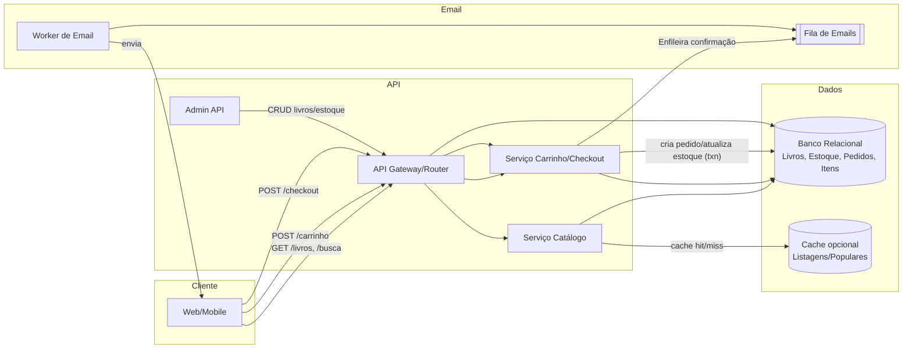

# Catálogo e Checkout de Livraria Independente

**Nível:** básico  
**Tema(s):** APIs REST, catálogo de produtos, carrinho de compras, persistência simples  
**Resumo do problema:**  
Uma livraria de bairro quer vender online um catálogo pequeno (até alguns milhares de livros). O sistema deve listar livros, permitir busca simples, gerenciar carrinho e finalizar pedido com confirmação por e-mail. O pagamento pode ser simulado nesta fase (sem integração real com gateway).

## Requisitos Funcionais
- Expor **catálogo** com listagem e **detalhe** de livro (título, autor, preço, estoque, ISBN).
- **Busca** por título/autor e **filtros** básicos (faixa de preço, disponibilidade).
- **Carrinho**: adicionar/remover itens, alterar quantidade, calcular subtotal e frete simples (fixo por CEP/range).
- **Checkout**: capturar dados do comprador (nome, e-mail, endereço), validar CEP e **criar pedido**.
- **Confirmação** de pedido por e-mail com resumo dos itens.
- **Admin básico**: criar/editar livros e ajustar estoque.

## Requisitos Não Funcionais
- **Latência**: p95 < 200 ms para listagem/busca do catálogo.
- **Disponibilidade**: 99,5% mensal.
- **Consistência**: atualização de estoque ao fechar pedido deve ser **forte** (transação).
- **Observabilidade**: logs de requisições, métricas de erro 4xx/5xx, contagem de pedidos/dia.
- **Segurança**: validação de entrada, limitação de tamanho de payload, autenticação para rotas de admin.
- **Custos**: banco relacional leve (Postgres/MySQL/SQLite) e cache opcional para listagens populares.

## Diagrama Conceitual (Mermaid)

