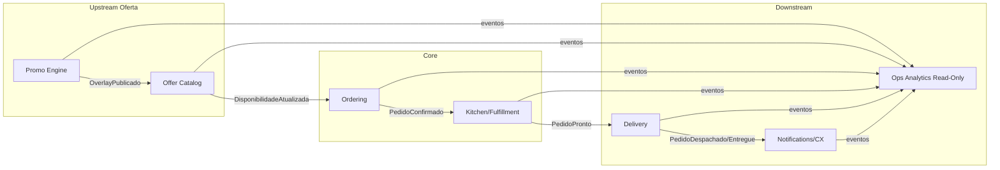

# Caso de Exercício DDD — Foodtech de Delivery Local (Promo Relâmpago)

## 1) Storytelling: A Janela Promocional
Uma **foodtech de delivery local** roda “**Promo Relâmpago**” de 15 minutos para restaurantes parceiros. Nessa janela, consultas de **cardápio** e **preços** disparam (~20×), enquanto **criação de pedidos** cresce ~5×. O sistema atual é acoplado: qualquer mudança em preço, estoque de porções ou status de preparo repercute em toda a aplicação. Há **erros de disponibilidade** (venda de itens esgotados), **delays** nas atualizações de cardápio e **duplicidade** de pedidos sob retry.

A direção decide reestruturar o produto com **Domain-Driven Design (DDD)** para separar responsabilidades, **reduzir acoplamento** e proteger o que é core: **formação de oferta em tempo real**, **integridade de pedidos** e **execução operacional na cozinha** durante a janela da promoção.

---

## 2) Escopo Funcional (recorte para o exercício)
- **Catálogo & Preços**: listagem, filtros, **preço promocional** por restaurante, itens/combos limitados.
- **Promo Engine**: criação/ativação de janelas, regras de elegibilidade, limites por item e por cliente.
- **Pedidos**: criar pedido com **idempotency key**, reservar porções, confirmar/cancelar.
- **Cozinha/Execução**: fila de preparo, tempos estimados, atualização de status.
- **Notificações**: mudanças de status (recebido → preparo → a caminho → entregue).
- **Relato Operacional**: métricas de janela (itens vendidos, quebra de estoque, SLA de preparo).

---

## 3) Domínios (Domains) Iniciais
- **Oferta (Catálogo & Pricing)**: cardápio, disponibilidade, precificação, **promo overlays**.
- **Promoções (Promo Engine)**: janelas, regras, limites (per-store, per-item, per-customer).
- **Pedidos (Ordering)**: intenção de compra, reserva e confirmação.
- **Execução/Cozinha (Fulfillment/Kitchen)**: preparo, capacidade, fila, tempos.
- **Entrega/Logística (Delivery)**: roteamento do pedido ao entregador/operadora (pode ser externo).
- **Experiência do Cliente (CX/Notifications)**: notificações e comunicação.
- **Relato & Métricas (Ops Analytics)**: KPIs de janela, reconciliação leve.

> **Tarefa do aluno:** Consolidar/ajustar a lista e sugerir **subdomínios** quando necessário.

---

## 4) Core Domains (candidatos) e Justificativa
- **Pedidos (Ordering)**: **integridade** de criação/confirmação, **idempotência**, coerência com reservas.
- **Oferta em Janela Promocional (Offer+Promo)**: **latência baixa** e **relevância** na apresentação da oferta (é o “momento da verdade”).
- **Execução/Cozinha (Fulfillment/Kitchen)**: **capacidade** de cumprir o que foi vendido (evitar over-selling e filas inviáveis).

> **Tarefa do aluno:** Escolher **1–2 Core Domains** (ex.: *Ordering* e *Offer+Promo*) e classificar os demais como **Suporte** ou **Genéricos**, com base na estratégia da foodtech.

---

## 5) Bounded Contexts (BCs) propostos

1. **Offer Catalog (Cardápio & Pricing)**
   - Linguagem: `ItemDeCardapio`, `PrecoBase`, `PrecoPromocional`, `Disponibilidade`.
   - Responsabilidades: montar **read model** rápido (cacheável) para busca; aplicar overlays de preço/limite vindos do Promo.
   - Eventos: `ItemAtualizado`, `PrecoAlterado`, `DisponibilidadeAtualizada`.

2. **Promo Engine**
   - Linguagem: `JanelaPromocional`, `Regra`, `Limite`, `Elegibilidade`.
   - Responsabilidades: ativar/desativar janelas; publicar **overlays** de preço/limite; contabilizar saldo de limites.
   - Comandos/Eventos: `AtivarJanela`, `JanelaAtivada`, `OverlayPublicado`, `LimiteEsgotado`.

3. **Ordering**
   - Linguagem: `Carrinho`, `Pedido`, `ReservaDePorcao`, `ConfirmacaoDePedido`.
   - Responsabilidades: idempotência; reservar porções; confirmar/cancelar; **fonte de verdade** do pedido.
   - Eventos: `PedidoCriado`, `ReservaEfetuada`, `PedidoConfirmado`, `PedidoCancelado`.

4. **Kitchen/Fulfillment**
   - Linguagem: `FilaDePreparo`, `Ticket`, `TempoEstimado`, `Capacidade`.
   - Responsabilidades: orquestrar preparo; sinalizar capacidade/backs-pressure para *Ordering* e *Offer*.
   - Eventos: `PreparoIniciado`, `PedidoPronto`, `CapacidadeAtingida`.

5. **Delivery**
   - Linguagem: `Coleta`, `Despacho`, `Rota`.
   - Responsabilidades: integração com parceiros de entrega; estados de rota.
   - Eventos: `PedidoDespachado`, `PedidoEntregue`.

6. **Notifications/CX**
   - Linguagem: `Mensagem`, `Template`, `Preferencia`.
   - Responsabilidades: notificar mudanças de status; respeitar janelas de silêncio.
   - Eventos: `NotificacaoEnfileirada`, `NotificacaoEntregue`.

7. **Ops Analytics**
   - Linguagem: `KPIJanela`, `TaxaConversao`, `QuebraEstoque`, `SLA`.
   - Responsabilidades: métricas materializadas via eventos; leitura apenas.

> **Tarefa do aluno:** desenhar o **Context Map**, apontando relações (Upstream/Downstream, ACLs) e direções de dependência.

---

## 6) Entidades, Agregados e Objetos de Valor (exemplos)

### Offer Catalog
- **Aggregate `ItemDeCardapio`**: `itemId`, `nome`, `categoria`, `precoBase`, `statusDisponibilidade`.
- **VO `Preco`**: `valor`, `moeda`, `fonte` (base|promo).
- **VO `OverlayPromocional`**: `precoPromo`, `limiteJanela`, `inicio`, `fim`.

### Promo Engine
- **Aggregate `JanelaPromocional`**: `janelaId`, `restauranteId`, `inicio`, `fim`, `regras[]`, `limites[]`.
- **VO `Regra`**: `tipo` (ex.: desconto %, item-only), `criterios`.
- **VO `Limite`**: `escopo` (item/cliente/loja), `quantidadeMax`, `consumido`.

### Ordering
- **Aggregate `Pedido`** (AR): `pedidoId`, `clienteId`, `restauranteId`, `itens[] (itemId, qtd, precoAplicado)`, `status`, `idempotencyKey`.
- **Entity `ReservaDePorcao`**: `reservaId`, `itemId`, `qtd`, `ttl`, `estado`.
- **VO `Dinheiro`**: `valor`, `moeda`, invariantes de precisão.

### Kitchen/Fulfillment
- **Aggregate `Ticket`**: `ticketId`, `pedidoId`, `fila`, `prioridade`, `tempoEstimado`, `status`.

> **Tarefa do aluno:** completar invariantes (ex.: reserva não pode exceder limite; `precoAplicado` fixado no momento da criação) e **limites transacionais** por agregado.

---

## 7) Contratos (Comandos/Eventos) — recorte crítico
- **Promo → Offer**: `OverlayPublicado(janelaId, itens[], precoPromo, limite)`  
- **Offer → Ordering**: `DisponibilidadeAtualizada(itemId, qtdDisponivel)`  
- **Ordering (Cmd)**: `CriarPedido(idempotencyKey, itens[], restauranteId)`  
- **Ordering → Kitchen**: `PedidoConfirmado(pedidoId, itens[], tempoEstimadoSLA)`  
- **Kitchen → Delivery**: `PedidoPronto(pedidoId)`  
- **Delivery → CX**: `PedidoDespachado(pedidoId)`, `PedidoEntregue(pedidoId)`  
- **Ordering (falhas)**: `ReservaFalhou(itemId, motivo)`, `PedidoCancelado(pedidoId, motivo)`  

> **Idempotência:** `idempotencyKey` no **Ordering**; deduplicação por `pedidoId` nos consumidores.  
> **Backpressure:** `Kitchen` publica `CapacidadeAtingida(restauranteId)`; `Offer` degrada UI; `Ordering` responde 429 com retry/jitter.

---

## 8) Objetivos do Exercício (o que entregar)
1. **Mapa de Domínios** com **Core Domain(s)** escolhido(s) e justificativa.  
2. **Context Map** com Bounded Contexts e relações (incluindo **ACL** onde necessário, ex.: integração legado de Delivery).  
3. **Glossário de Linguagem Ubíqua** por contexto (mín. 6 termos/contexto).  
4. **Modelagem detalhada** de 3 agregados (inclua `Pedido`), com **invariantes** e **regras de consistência**.  
5. **Especificação de eventos** (min. 8) e **comandos** (min. 5) entre BCs, com payload mínimo.  
6. **5 trade-offs** discutidos (ex.: consistência eventual em catálogo vs. forte em pedido; onde cachear; como aplicar limites; orquestração vs. coreografia).

---

## 9) Critérios de Aceite
- Core Domain(s) **definido(s) e defendido(s)**.  
- Fronteiras (BCs) **claras** e **coesas**, linguagem ubíqua distinta.  
- Contratos **consistentes** (eventos/commands) com ordenação por chave adequada (restaurante/janela/pedido).  
- Agregados com **limites transacionais** reais (ex.: reserva + confirmação).  
- Estratégia explícita para **idempotência**, **limites de janela** e **degradação graciosa**.

---

## 10) Anti-erros
- Não confundir **Disponibilidade (Offer)** com **Reserva (Ordering)** — disponibilidade pode ser eventual; **reserva é transacional**.  
- Não recalcular `precoAplicado` após criação do pedido (fixar VO `Dinheiro`).  
- Evitar “spaghetti de eventos”: documente **quem orquestra** cada fluxo (ex.: *Ordering* orquestra confirmação).

### Tarefa Final
Entregue:  
- **(A)** Core Domain(s) escolhido(s) e mapa de domínios.  
- **(B)** Context Map (como no diagrama), ajustado às suas decisões.  
- **(C)** Agregados `Pedido`, `JanelaPromocional` e `ItemDeCardapio` com invariantes e limites transacionais.  
- **(D)** Lista de 8–12 eventos e 5+ comandos com payload mínimo (campos essenciais).  
- **(E)** Cinco trade-offs profundos envolvendo **consistência, limites e capacidade** durante a janela promocional (inclua plano de degradação graciosa).
