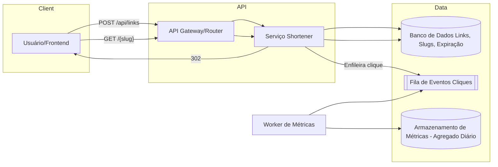

# Mini Encurtador de URLs para Campanhas Locais

**Nível:** básico  
**Tema(s):** APIs REST, persistência simples, redirecionamento HTTP, rate limiting básico  
**Resumo do problema:**  
Uma pequena agência de marketing precisa de um encurtador de URLs para acompanhar cliques de campanhas locais. O produto inicial deve permitir criar links curtos, redirecionar de forma rápida e registrar contagens de cliques por dia. O sistema será usado por poucos clientes (dezenas) e tráfego moderado (centenas a poucos milhares de cliques/dia).

## Requisitos Funcionais
- Permitir **criar** uma URL curta a partir de uma URL longa via API (ex.: `POST /api/links`).
- **Redirecionar** solicitações `GET /{slug}` para a URL longa correspondente, usando HTTP 301/302.
- Registrar **métrica de cliques** por data (ex.: total diário) e expor consulta simples (ex.: `GET /api/links/{slug}/stats?from=YYYY-MM-DD&to=YYYY-MM-DD`).
- Validar **formato** de URL longa (http/https) e rejeitar entradas inválidas.
- Opcional: permitir **expiração** do link (data de validade) e **notas**/rótulos para organização.

## Requisitos Não Funcionais
- **Latência**: redirecionamento abaixo de 100 ms p95 dentro da mesma região.
- **Disponibilidade**: 99,5% mensal é suficiente para o MVP.
- **Consistência**: leitura do redirecionamento deve ser **forte**; métricas podem ser atualizadas de forma **assíncrona** (eventual).
- **Observabilidade**: logs de acesso, métricas de p95/p99 e contador de erros 5xx.
- **Segurança**: validar domínio de destino opcionalmente (lista de bloqueio), limitar criação por **chave de API**.
- **Custos**: preferir componentes gerenciados/básicos de baixo custo (um banco relacional leve ou KV, cache opcional).

## Diagrama Conceitual (Mermaid)

## Desafio

Escalar o sistema para: 

* 100 TPS 
* 1.000 TPS 
* 10.000 TPS
* 100.000 TPS