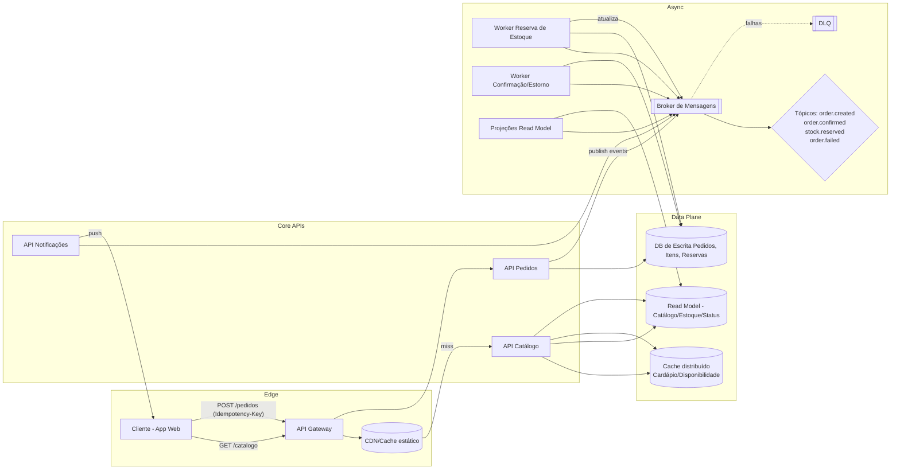

# Promo Relâmpago de Delivery Local

**Nível:** intermediário  
**Tema(s):** mensageria, cache, consistência eventual, backpressure, idempotência, CQRS (read model)  
**Resumo do problema:**  
Uma plataforma de delivery local fará promoções relâmpago (15 minutos) para restaurantes parceiros. Durante a janela, o tráfego de criação/atualização de pedidos e consultas de cardápio cresce 20×. O sistema deve suportar pico repentino, manter experiência fluida de consulta (cardápio e estoque) e processar pedidos com idempotência e resiliência, aceitando consistência eventual em leituras não críticas.

## Requisitos Funcionais
- Endpoint para **listar cardápio** e **preços promocionais** por restaurante, com filtros e paginação.
- **Criação de pedido** (itens, endereço, método de pagamento) com **idempotency key** no header.
- **Reserva de estoque** por item (ex.: número limitado de porções) e confirmação do pedido.
- **Atualização de status** do pedido (recebido → em preparo → a caminho → entregue) com **notificações** ao cliente.
- **Cancelamento** por timeout de preparo ou indisponibilidade de estoque, com estorno simulado.
- Painel **read-only** para restaurante com fila de preparação, tempo estimado e métricas básicas.

## Requisitos Não Funcionais
- **Escalabilidade elástica** para a janela de 15 min: suportar +20× QPS em leitura e +5× em escrita.
- **Latência**: p95 de 120 ms para leitura de cardápio; p95 de 300 ms para confirmação de pedido (exclui entrega de notificações).
- **Disponibilidade**: 99,9% durante janelas promocionais.
- **Consistência**:  
  - Leituras de cardápio e disponibilidade: **eventual** (até 3 s de divergência).  
  - Fluxo de criação/confirm. de pedido/estoque: **forte** (garantia transacional por pedido).
- **Observabilidade**: métricas de taxa de erro, p95/p99, lag de consumidores, DLQ depth, taxa de deduplicação por idempotency key.
- **Resiliência**: políticas de retry com jitter e **circuit breakers** entre serviços críticos; **DLQ** para eventos não processados.
- **Custos**: uso de cache para reduzir leituras no banco e **auto-scaling** baseado em QPS e lag de fila.

## Extensões / Perguntas de Reflexão (Opcional)
- Onde colocar o **ponto de deduplicação** da idempotency key: na borda (API) ou no serviço de pedidos? Como lidar com concorrência?
- Qual estratégia de **particionamento** dos tópicos (por restaurante, por região, por orderId) reduz hotspots durante promoções?
- Como desenhar a **graceful degradation** se o read model atrasar (ex.: colocar “rate limiters", ocultar contagem exata)?
- Que política de **retry** e **timeouts** minimiza storms durante pico? Onde usar **circuit breakers**?
- Se a promoção abrange múltiplas **regiões**, como manter **SLOs** e **consistência** do estoque com latência inter-regiões?
