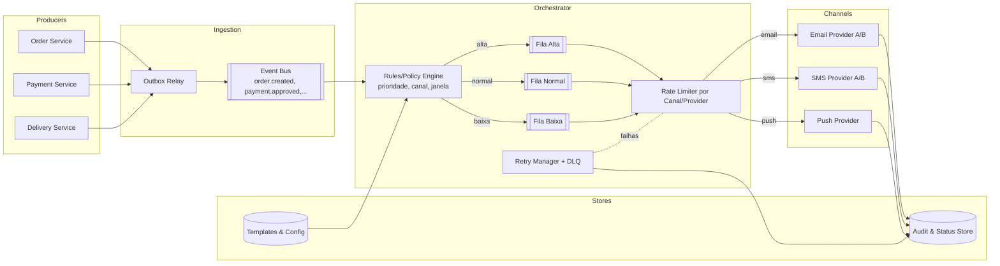

# Orquestrador de Notificações Omnichannel para E-commerce

**Nível:** intermediário  
**Tema(s):** mensageria, idempotência, retries com backoff, rate limiting por canal, outbox pattern  
**Resumo do problema:**  
Um e-commerce precisa de um serviço unificado para enviar notificações de eventos (pedido criado, pagamento aprovado, pedido enviado) via **e-mail, SMS e push**. Cada canal tem **limites de taxa**, **custos** e **janelas de silêncio**. O sistema deve **priorizar** mensagens críticas, **evitar duplicidades** e oferecer **rastreamento ponta a ponta**. Serviços de negócio publicam eventos; o orquestrador decide quando/como entregar e registra resultados para auditoria.

## Requisitos Funcionais
- Receber **eventos de negócio** (ex.: `order.created`, `payment.approved`) e mapear para **templates** por canal.
- Suportar **agendamento** (send-at) e **janelas de silêncio** (ex.: 22h–7h para SMS, com exceções de alta prioridade).
- Implementar **prioridades** (alta, normal, baixa) com filas separadas ou pesos diferentes.
- **Idempotência** por `notification_id` (reentregas não devem duplicar mensagens).
- **Rate limiting** por provedor/canal (e.g., 50 req/s para SMS, 200 req/s para e-mail).
- **Retries** com **exponential backoff + jitter** e **DLQ** após N tentativas.
- Expor **consultas**: status por notificação, histórico por usuário, métricas agregadas.
- Webhook/stream de **entrega e falha** para sistemas interessados (CS, CRM, analytics).

## Requisitos Não Funcionais
- **Latência alvo**: p95 < 300 ms entre evento recebido e enfileiramento da notificação; entrega depende do canal/provedor.
- **Disponibilidade**: 99,9% para ingestão; tolerar degradação por canal isolado.
- **Observabilidade**: tracing distribuído (evento → decisão → provedor), métricas de taxa/hit de rate limit, taxa de erro, idade da fila, tempo até entrega.
- **Segurança/Privacidade**: PII minimizada nos logs, criptografia em trânsito/repouso, segregação por tenant.
- **Custos**: rota **fallback** mais barata quando possível; **circuit breaker** para provedores caros/inestáveis.
- **Escalabilidade**: suportar picos 10× em eventos; auto-scaling por lag da fila e consumo por partição.

## Diagrama Conceitual (Mermaid)

## Detalhes e Pistas de Implementação
- **Outbox pattern**: serviços de negócio gravam evento e mudança de estado na mesma transação; um relay publica no bus garantindo **at-least-once** sem perdas.
- **Chave idempotente**: `notification_id = hash(event_id + user_id + channel + template + send_at)`; persistir decisão/resultado e **short-circuit** em retries.
- **Rate limiting**: token bucket por **(canal, provedor, tenant)**; quando excedido, **requeue** com atraso + jitter.
- **Janela de silêncio**: se `now` ∈ janela e prioridade ≠ alta, reagendar para o próximo slot permitido.
- **Fallback de provedor**: **health + custo** orientam escolha (ex.: failover de Provider A→B acima de X% de erro p95 > limite).
- **DLQ**: mensagens que excederem N tentativas vão para análise; expor reprocessamento manual/automático com backoff ampliado.
- **Templates**: versão por canal/locale; **feature flags** para rollouts seguros (A/B por provedor).

## Extensões / Perguntas de Reflexão (Opcional)
- Como desenhar **particionamento** da fila para evitar hotspots? (por `user_id` hash, por canal, por tenant)
- Em caso de **duplicidade** vinda do upstream (eventos reemitidos), onde colocar a deduplicação: no **ingestor**, no **rules engine** ou no **dispatcher**?
- Qual estratégia de **prioridade**: filas separadas, prioridade ponderada no mesmo tópico, ou **preemptive scheduling** no consumidor?
- Como medir **custo por notificação** e automatizar a rota mais econômica mantendo SLO de entrega?
- Quais **SLIs/SLOs** por canal? (tempo até entrega, taxa de erro por provedor, atraso p99 da fila)
