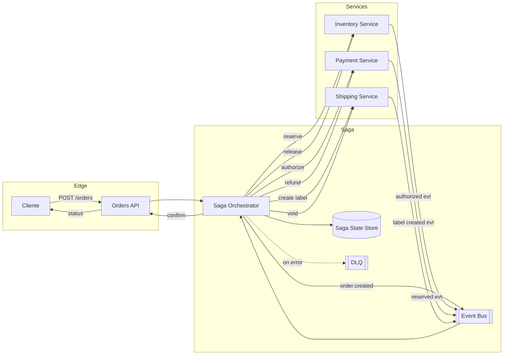

# Checkout Distribuído com Saga (Orquestração)

**Nível:** intermediário  
**Tema(s):** Saga Pattern (orquestração vs. coreografia), compensações, idempotência, outbox, timeouts e retries  
**Resumo do problema:**  
Um e-commerce quer finalizar pedidos de forma distribuída envolvendo **Pedido**, **Pagamento**, **Estoque** e **Envio**. Não há transações distribuídas (2PC). Em vez disso, uma **Saga** coordena passos locais e, em caso de falhas, executa **ações de compensação** (ex.: estornar pagamento, devolver estoque, cancelar pedido). É necessário **idempotência** ponta a ponta, **observabilidade** e **recuperação** após panes parciais.

## Requisitos Funcionais
- **Criar pedido**: `POST /orders` inicia a saga (estado “PENDING”).
- **Reservar estoque** do(s) item(ns).
- **Autorizar pagamento** (cartão ou saldo).
- **Gerar etiqueta** de envio (opcional, quando elegível).
- **Confirmar pedido** ao concluir todos os passos; **cancelar** com compensações se qualquer etapa falhar.
- **Reprocessar** sagas em estado de erro/timeout; permitir **consulta de status** da saga/pedido.
- **Eventos de domínio** (emitidos via outbox): `order.created`, `inventory.reserved`, `payment.authorized`, `shipment.created`, `order.confirmed`, `order.canceled`.

## Requisitos Não Funcionais
- **Consistência**: cada passo é **localmente transacional**; a **consistência global** é alcançada via saga/compensações.
- **Idempotência**: todas as operações externas aceitam **Idempotency-Key**; consumidores deduplicam por **message key**.
- **Latência**: p95 < 1,5 s para conclusão do checkout (sem frete); steps assíncronos podem ser confirmados via webhook/polling.
- **Resiliência**: **retries** com **exponential backoff + jitter**, **timeouts** por passo, **DLQ** para mensagens não processadas.
- **Observabilidade**: **trace distribuído** por `sagaId`, métricas de tempo por etapa e taxa de compensações; **auditoria** do fluxo.
- **Segurança**: PII minimizada nos eventos; criptografia em trânsito/repouso.
- **Evolutividade**: permitir alternar entre **orquestração** (coordenador central) e **coreografia** (eventos puros) por feature flag.

## API/Contratos (exemplos)
- `POST /orders` → `{ orderId, sagaId }` (cria pedido + outbox `order.created`)
- `GET /orders/{orderId}` → status agregado da saga e passos
- Serviços internos (sincronos/assíncronos):
  - Inventory: `POST /reserve` / `POST /release`
  - Payment: `POST /authorize` / `POST /refund`
  - Shipping: `POST /label` / `POST /void-label`

## Compensações (exemplos)
- Falha em **Pagamento** ⇒ compensar **Estoque** (`release`) e **Pedido** (`cancel`).
- Falha em **Envio** após pagamento autorizado ⇒ **refund** no Pagamento + **release** de Estoque + `cancel`.
- **Timeout** em qualquer passo ⇒ iniciar compensação do(s) passo(s) já concluídos.

## Dicas de Implementação
- **Orquestrador de Sagas** com **state store** (ex.: `sagas(sagaId, state, step, retries, lastUpdate)`), direção do fluxo e tabela de **outbox** por serviço.
- **Idempotência**: chave = `sagaId + step` para comandos; persistir decisão/resultado para **short-circuit** em retries.
- **Outbox + Relay**: gravar evento na mesma transação do estado local; relayer publica no **Event Bus** com entrega **at-least-once**.
- **Ordem e deduplicação**: particionar tópicos por `sagaId` (ou `orderId`) para manter ordem; consumidores deduplicam por `messageId`.
- **Backpressure**: auto-scaling por lag de fila; limitar “in-flight steps” por saga.
- **Testes de caos**: inject faults (latência/erros) em cada passo para validar compensações e tolerância a falhas.

## Extensões / Perguntas de Reflexão (Opcional)
- Quando usar **coreografia** (serviços reagem a eventos) em vez de **orquestração**? Quais riscos de **acoplamento indireto** e “spaghetti de eventos”?
- Como modelar **timeouts** por passo sem abortar prematuramente operações lentas mas válidas (ex.: fallback para polling)?
- Qual estratégia de **particionamento** no bus reduz conflitos e preserva ordenação por `sagaId`/`orderId`?
- Como garantir **reexecução segura** (replay) após falhas do orquestrador sem efeitos colaterais?
- Onde e como calcular **métricas de negócio** (taxa de compensação por causa, % de sucesso por transportadora)?
- Quais **SLIs/SLOs** para a saga (tempo médio de conclusão, erro por passo, idade p99 da saga em progresso)?
