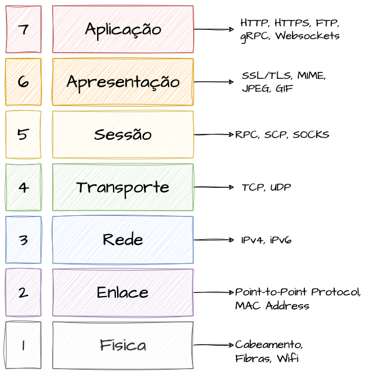
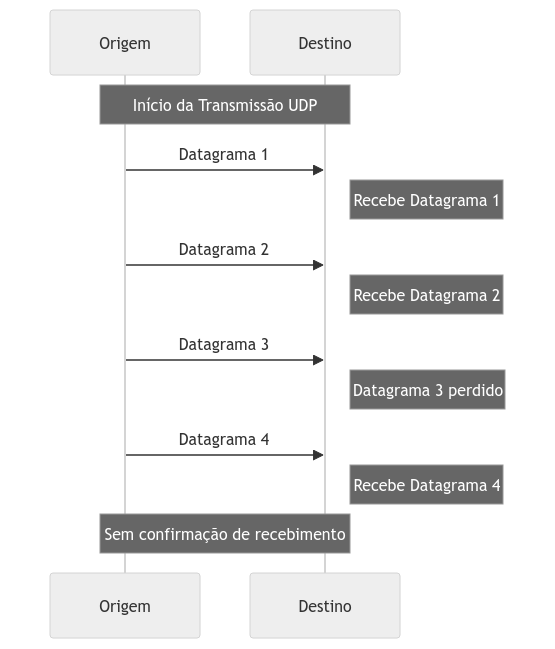
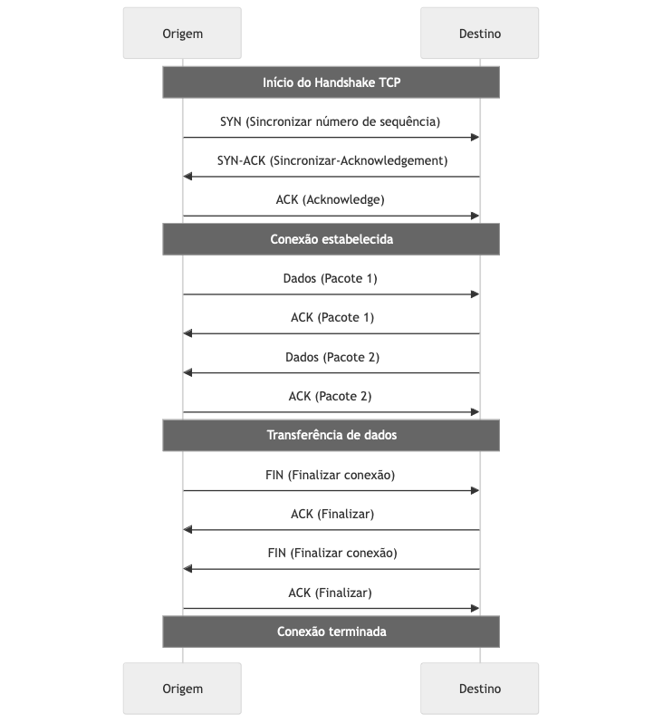
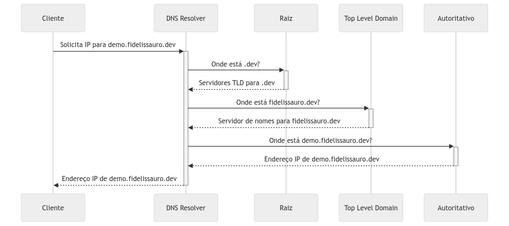
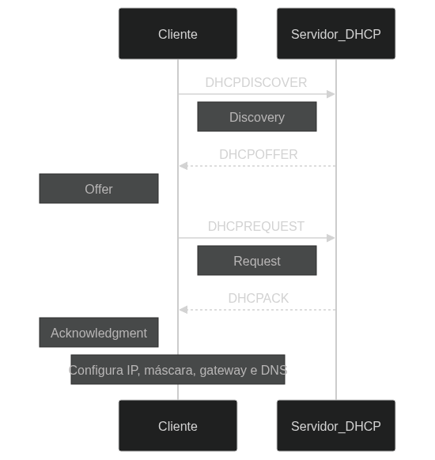
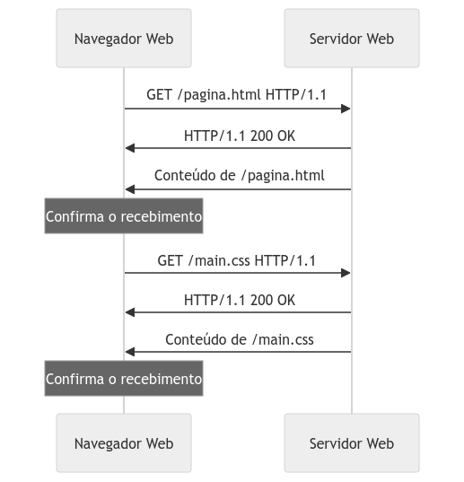
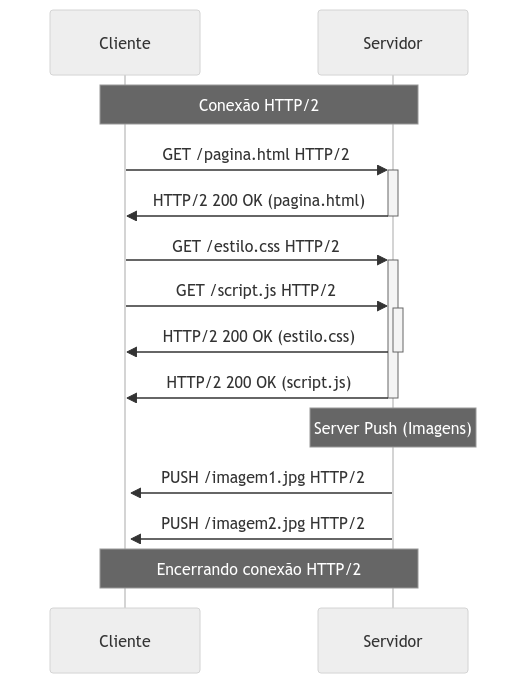
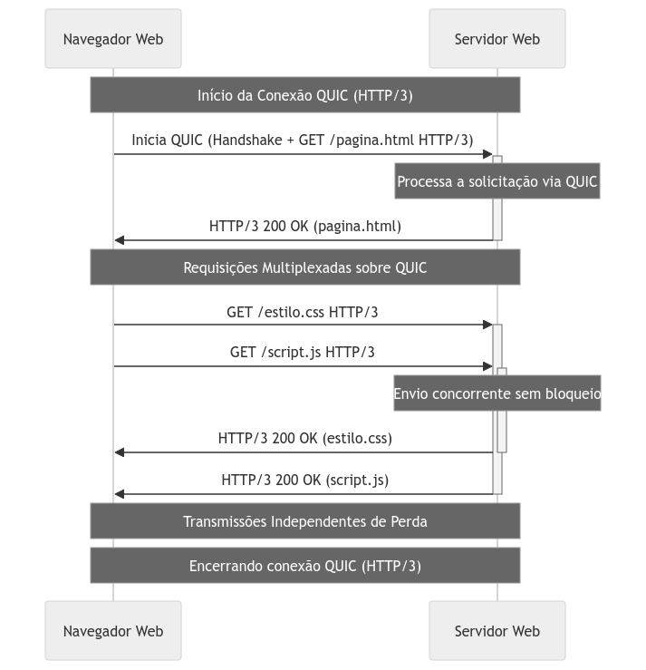

# System Design - Protocolos e Comunicação de Rede

* [System Design - Protocolos e Comunicação de Rede](#system-design---protocolos-e-comunicação-de-rede)
* [Modelo OSI](#modelo-osi)
   * [Camada 1: Física](#camada-1-física)
   * [Camada 2: Enlace](#camada-2-enlace)
   * [Camada 3: Rede](#camada-3-rede)
   * [Camada 4: Transporte](#camada-4-transporte)
   * [Camada 5: Sessão](#camada-5-sessão)
   * [Camada 6: Apresentação](#camada-6-apresentação)
   * [Camada 7: Aplicação](#camada-7-aplicação)
* [Os Protocolos de Comunicação](#os-protocolos-de-comunicação)
   * [Definindo um Protocolo](#definindo-um-protocolo)
   * [Protocolos Base](#protocolos-base)
   * [Protocolo IP, IPv4 e IPv6](#protocolo-ip-ipv4-e-ipv6)
   * [IPv4](#ipv4)
   * [IPv6](#ipv6)
   * [Dual Stack](#dual-stack)
* [UDP - User Datagram Protocol](#udp---user-datagram-protocol)
* [TCP - Transmission Control Protocol](#tcp---transmission-control-protocol)
   * [Escolhendo Entre TCP e UDP para Construção e Uso de Protocolos](#escolhendo-entre-tcp-e-udp-para-construção-e-uso-de-protocolos)
* [SSL/TLS - Transport Layer Security](#ssltls---transport-layer-security)
* [Demais Protocolos e Aplicações de Rede](#demais-protocolos-e-aplicações-de-rede)
* [DNS - Domain Name Service](#dns---domain-name-service)
   * [Funcionamento Lógico do DNS](#funcionamento-lógico-do-dns)
   * [Resolução do DNS na Prática](#resolução-do-dns-na-prática)
* [DHCP - Dynamic Host Configuration Protocol](#dhcp---dynamic-host-configuration-protocol)
* [NTP - Network Time Protocol](#ntp---network-time-protocol)
* [SSH - Secure Shell](#ssh---secure-shell)
* [Telnet](#telnet)
* [Protocolos HTTP/1, HTTP/2 e HTTP/3](#protocolos-http1-http2-e-http3)
   * [Estruturas de Requisições e Respostas HTTP](#estruturas-de-requisições-e-respostas-http)
      * [Body](#body)
      * [Headers](#headers)
      * [Cookies](#cookies)
      * [Status Codes](#status-codes)
* [HTTP/1.x](#http1x)
* [HTTP/2](#http2)
* [HTTP/3 (QUIC)](#http3-quic)

> **Nota:** Este documento é um material de estudo baseado no artigo original
> **"System Design - Protocolos e Comunicação de Rede"**, de **Matheus Fidelis**,
> publicado em [fidelissauro.dev/protocolos-de-rede](https://fidelissauro.dev/protocolos-de-rede/).
> As ilustrações pertencem ao autor original. Recomenda-se a leitura do artigo
> completo na fonte.

---

Este material reúne, de forma resumida, os fundamentos de comunicação de rede vistos
pela ótica de System Design. Dominar como os protocolos funcionam é um diferencial
concreto: influencia diretamente decisões de arquitetura, performance e resiliência.
A partir de bases como TCP e UDP, conseguimos entender protocolos mais sofisticados e
aplicar cada característica no contexto certo.

A motivação do conteúdo é cobrir uma lacuna comum entre engenheiros: a camada de rede
costuma ser um ponto cego na hora de raciocinar sobre a topologia de um sistema. O
objetivo aqui é apresentar teoria e prática de maneira acessível e aplicável no
dia a dia.

# Modelo OSI

O Modelo OSI (Open Systems Interconnection) é uma referência conceitual criada pela ISO
nos anos 1980 para padronizar as funções de redes, componentes e protocolos. Embora seja
uma abstração de origem acadêmica, ele continua sendo a base mental para projetar redes,
especificar componentes e fazer troubleshooting de conexões. Entender esse modelo antes
de mergulhar nas implementações ajuda a classificar mentalmente em qual camada cada
protocolo opera. As camadas mais altas costumam ser implementadas em software.

O modelo se divide em sete camadas, cada uma com responsabilidades próprias.

## Camada 1: Física

Cuida da transmissão dos bits crus sobre um meio físico, definindo características
elétricas, mecânicas e funcionais das conexões. Abrange tudo o que é palpável na rede:
cabos de cobre, fibra óptica, antenas Wi-Fi e demais meios de entrada e saída de sinal.

## Camada 2: Enlace

Garante transferência confiável entre dois nós adjacentes, detectando e corrigindo erros
originados na camada física. É onde vivem o Ethernet (redes LAN), o PPP (ligações ponto a
ponto) e o endereço físico MAC, que identifica unicamente cada dispositivo.

## Camada 3: Rede

Responsável por decidir o caminho dos dados entre redes, usando endereços lógicos e
roteamento. É a camada do protocolo IP (IPv4 e IPv6). O ARP atua aqui resolvendo, via
broadcast, qual endereço MAC corresponde a um IP, o que é essencial para encaminhar
pacotes da camada de rede para a de enlace.

## Camada 4: Transporte

Gerencia a entrega de dados entre os sistemas finais, segmentando-os em pacotes e
controlando o fluxo. Os dois protocolos centrais são o TCP, que entrega de forma confiável
e ordenada, e o UDP, mais rápido porém sem garantias.

## Camada 5: Sessão

Cuida de abrir, manter e encerrar conexões entre aplicações. É bastante usada em serviços
com sessões autenticadas e de longa duração.

## Camada 6: Apresentação

Traduz os dados entre o formato da rede e o formato esperado pelas aplicações, tratando de
criptografia, compressão e conversão. Funciona como uma camada de tradução, abrigando
protocolos como SSL/TLS e formatos como JPEG, GIF e PNG.

## Camada 7: Aplicação

É a camada mais próxima do usuário, servindo de interface entre o software e a rede. Aqui
vivem protocolos como HTTP, HTTPS, WebSockets e gRPC, além de sessões SSH e transferências
FTP.

# Os Protocolos de Comunicação

Entrando nos protocolos propriamente ditos, o foco passa a ser as implementações mais
comuns no cotidiano de quem usa redes — ou seja, praticamente qualquer pessoa conectada à
internet. Existem inúmeras implementações com vantagens e desvantagens distintas, e muitas
delas são construídas sobre protocolos mais básicos. TCP e UDP são justamente essas bases,
e por isso vêm primeiro: entendê-los é pré-requisito para os protocolos mais complexos.

## Definindo um Protocolo

Comunicar dispositivos é o propósito de uma rede, e essa comunicação só funciona graças a
um conjunto de regras chamado protocolo. Conceitualmente, um protocolo é um acordo que
define o formato e a ordem das mensagens trocadas entre sistemas, estabelecendo como os
dados são enviados, recebidos e interpretados para que máquinas e softwares distintos se
entendam.

## Protocolos Base

Antes de explorar tecnologias modernas como HTTP/2, HTTP/3, gRPC e AMQP, é preciso revisar
os protocolos de baixo nível que servem de alicerce. Os mecanismos fundamentais de conexão
— sobretudo TCP e UDP — são o que tornam possível construir essas camadas mais avançadas.

## Protocolo IP, IPv4 e IPv6

O Protocolo de Internet (IP) opera na camada 3 do OSI e é o núcleo da comunicação de dados
na internet, permitindo que dispositivos diferentes troquem informações. Ele atribui
endereços únicos a cada dispositivo, garantindo que os dados cheguem ao destino correto.
Há duas versões principais em uso: IPv4 e IPv6.

## IPv4

O IPv4 é a versão mais antiga e ainda dominante. Usa endereços de 32 bits, o que resulta
em cerca de 4,3 bilhões de endereços possíveis. No início da internet, grandes blocos foram
distribuídos a empresas, universidades e governos; com a explosão de dispositivos
conectados, esse espaço se esgotou. Para mitigar a escassez, surgiram técnicas como NAT
(Network Address Translation) e o uso de faixas de IPs privados em redes locais.

## IPv6

O IPv6 nasceu para resolver a falta de endereços do IPv4. Com endereços de 128 bits,
oferece um espaço praticamente ilimitado (na casa dos 340 undecilhões de endereços). Além
de eliminar a escassez, simplifica o processamento de pacotes nos roteadores e traz
segurança nativa via IPsec, com suporte a criptografia.

## Dual Stack

Como IPv4 e IPv6 são incompatíveis em endereçamento direto, redes que precisam usar os dois
exigem um mecanismo de transição. A estratégia de Dual Stack atende esse cenário de
coexistência.

Com Dual Stack, o mesmo dispositivo fala tanto com redes IPv4 quanto IPv6, escolhendo o
protocolo conforme o destino. É uma das soluções mais simples e eficazes de transição, mas
exige que hardware e software suportem ambos os protocolos.

# UDP - User Datagram Protocol

O UDP é um protocolo da camada de transporte extremamente simples, que transmite dados
entre hosts sem estabelecer conexão prévia e sem garantias de entrega. Ele troca
confiabilidade por performance: dispensa todo o trabalho de abrir, manter e encerrar
conexões, enviando os dados diretamente — porém sem assegurar recebimento ou integridade.

O UDP fragmenta os dados em pacotes chamados datagrams, que são independentes e não
dependem de ordem, prioridade ou confirmação. Isso o torna ideal para aplicações de tempo
real que toleram alguma perda ou corrupção de dados.

Arquiteturas que precisam de comunicação próxima ao tempo real e suportam perdas costumam
ser construídas sobre UDP. Uma boa analogia: é como o entregador que deixa a correspondência
embaixo do portão e segue para a próxima entrega, sem confirmar se alguém recebeu.

# TCP - Transmission Control Protocol

Ao contrário do UDP, o TCP é orientado à conexão. Ele abre, mantém, monitora e encerra a
conexão, garantindo que os dados cheguem íntegros, confiáveis e na ordem correta. Atuando
na camada 4, estabelece a conexão antes de qualquer transmissão e usa controle de erro e
de fluxo para assegurar integridade e ordenação.

O modelo utiliza flags como ACK, SYN, SYN-ACK e FIN para gerenciar o ciclo de vida da
conexão. Existem outras (URG, PSH, RST), mas o foco aqui é um fluxo simplificado.

Todas as ações dentro de uma conexão TCP são confirmadas por ACKs (Acknowledgments).

O início da conexão usa o chamado three-way handshake, uma sequência de três passos (SYN,
SYN-ACK e ACK) que garante sincronização e confiabilidade entre cliente e servidor.

O cliente começa enviando um segmento com a flag SYN, sinalizando a intenção de conectar e
carregando um número de sequência inicial (ISN) usado para sincronização e controle de fluxo.

O servidor responde com SYN e ACK: o ACK confirma o SYN do cliente, e o SYN do servidor
inicia a sincronização no sentido inverso. Esse segmento traz o número de sequência do
servidor e o reconhecimento do ISN do cliente incrementado de um.

Por fim, o cliente devolve um ACK confirmando o SYN-ACK do servidor, com os números de
sequência atualizados. A partir daí a conexão está formalmente estabelecida e os dados
podem fluir.

Durante a transmissão, cada segmento recebe um número sequencial, o que permite ao receptor
reordenar segmentos fora de ordem e identificar perdas. Para cada segmento recebido, o
receptor envia um ACK indicando o próximo número esperado; segmentos não confirmados são
retransmitidos, garantindo entrega confiável.

O encerramento usa o four-way handshake: cada lado fecha sua direção. O cliente envia um
FIN sinalizando que não tem mais dados; após receber o ACK e o FIN do servidor, devolve o
ACK final e a conexão se encerra.

Comparado ao UDP, o TCP é mais confiável, embora essa burocracia possa reduzir a velocidade.
A maioria dos protocolos de comunicação entre serviços é construída sobre TCP, justamente
por essa confiabilidade.

Voltando à analogia: se o UDP é o entregador que deixa a carta sem confirmação, o TCP é o
entregador que só entrega em mãos mediante assinatura, foto e confirmação do destinatário.

## Escolhendo Entre TCP e UDP para Construção e Uso de Protocolos

A escolha entre TCP e UDP depende dos requisitos da aplicação quanto a confiabilidade,
ordenação, integridade e eficiência. O UDP é preferido quando a prioridade é velocidade e
há tolerância à perda de pacotes; o TCP é escolhido quando a entrega precisa ser confiável
e ordenada. Acertar nessa decisão é determinante para soluções que dependem de conexões
de rede eficientes.

# SSL/TLS - Transport Layer Security

O TLS (Transport Layer Security) é o protocolo central de segurança na internet e em redes
corporativas, garantindo comunicação privada e íntegra entre cliente e servidor por meio de
criptografia. Sucessor do SSL, ele assegura que os dados em trânsito permaneçam
inacessíveis a interceptadores.

Seu funcionamento se dá por um handshake: cliente e servidor negociam versão do protocolo e
métodos de criptografia, trocando chaves públicas e privadas. Dessa troca nasce uma chave
de sessão única, usada para cifrar os dados trafegados. Ao final, a sessão é encerrada de
forma segura, podendo renegociar parâmetros para sessões futuras.

Existem várias versões, com aprimoramentos contínuos de segurança e desempenho. As mais
adotadas hoje são TLS 1.2 e TLS 1.3, sendo a 1.3 a mais recente e segura, com um handshake
mais rápido e eficiente.

# Demais Protocolos e Aplicações de Rede

Os protocolos de aplicação são peça importante da arquitetura de redes, permitindo que
sistemas distintos se comuniquem seguindo padrões específicos. Eles definem as regras de
troca de dados entre clientes e servidores numa enorme variedade de contextos e operam na
camada mais alta do OSI, onde o foco deixa de ser a transferência pura e passa a ser como
os dados são solicitados e apresentados.

Quando uma necessidade técnica leva você a criar seu próprio protocolo sobre bases como TCP
ou UDP, esse protocolo é considerado de camada de aplicação. O mesmo vale para protocolos de
mensageria assíncrona construídos sobre TCP. As próximas seções detalham algumas das
tecnologias de aplicação mais presentes no dia a dia da engenharia; muitas delas serão
aprofundadas em capítulos futuros sobre mensageria e comunicações síncronas.

# DNS - Domain Name Service

O DNS (Domain Name Service) é uma peça fundamental da internet, funcionando como a "lista
telefônica" da rede. Sem ele, seria preciso decorar endereços IP — impraticável no IPv4 e
inviável no IPv6. O DNS permite digitar nomes amigáveis, como fidelissauro.dev, e resolver
automaticamente o IP correto para a conexão.

## Funcionamento Lógico do DNS

O processo começa quando uma URL é digitada no navegador, que então consulta um servidor DNS
para descobrir o IP correspondente. As etapas principais são: primeiro a **consulta ao DNS
local**, verificando se o IP já está em cache; caso não esteja, a consulta segue ao DNS
Resolver (geralmente do provedor). Em seguida o **Resolver consulta os servidores raiz**
para descobrir quem gerencia o TLD do domínio (como .com, .net, .org). Por fim, o servidor
TLD aponta para o **servidor autoritativo** do domínio, que conhece o IP final.

## Resolução do DNS na Prática

A clássica pergunta de entrevista "o que acontece quando você digita google.com no
navegador?" virou quase um meme em System Design. Usando o que já vimos sobre DNS, dá para
respondê-la com um caso prático: o que aconteceria ao digitar https://demo.fidelissauro.dev?

**1. Consulta ao Servidor Raiz:** tudo começa nos servidores raiz. Existem 13 conjuntos de
servidores raiz (de a.root-servers.net até m.root-servers.net), que formam a base da
hierarquia e representam o ponto final — abstraído — de todo endereço DNS. O resolver começa
perguntando à raiz quem é responsável pelo TLD .dev.

**2. Consulta ao Servidor TLD do .dev:** a raiz responde com o endereço dos servidores DNS
do TLD .dev. O resolver então pergunta a esses servidores quem controla o domínio
fidelissauro.dev, e recebe o endereço do servidor autoritativo.

**3. Consulta ao Servidor Autoritativo de fidelissauro.dev:** o servidor autoritativo conhece
todos os detalhes do domínio, incluindo os IPs de subdomínios. O resolver pergunta onde está
demo.fidelissauro.dev e recebe o IP final.

**4. Conexão de Fato:** com o IP em mãos, o cliente finalmente se conecta ao serviço. Todo
esse processo é otimizado por cache em vários níveis — resolvers, navegadores e servidores de
nomes guardam respostas anteriores. Em domínios acessados com frequência, a informação já
costuma estar em cache, acelerando muito a resolução.

> O artigo original ilustra cada etapa com diálogos bem-humorados entre o resolver e os
> servidores (raiz, TLD e autoritativo), reforçando didaticamente o vai e vem de perguntas
> e respostas até chegar ao IP do host.

# DHCP - Dynamic Host Configuration Protocol

O DHCP (Dynamic Host Configuration Protocol) permite que servidores atribuam automaticamente
endereços IP e demais configurações aos dispositivos que entram na rede. Ele simplifica a
gestão de IPs em redes de qualquer tamanho, evitando conflitos de endereços duplicados e
dispensando a alocação manual de IPs fixos — especialmente útil onde hosts entram e saem com
frequência.

Quando um cliente DHCP se conecta à rede, ele solicita configuração a um servidor DHCP. O
processo tem quatro etapas conhecidas pela sigla **DORA** (*Discovery, Offer, Request,
Acknowledgment*): no **Discovery** o cliente envia um DHCPDISCOVER procurando servidores;
no **Offer** os servidores respondem com DHCPOFFER oferecendo um IP e configurações; no
**Request** o cliente envia DHCPREQUEST aceitando a oferta de um servidor específico; e no
**Acknowledgment** o servidor confirma com DHCPACK, concluindo a configuração.

O DHCP elimina a configuração manual de cada dispositivo e gerencia dinamicamente o pool de
IPs, reaproveitando endereços de quem saiu da rede. É um protocolo "default", já abstraído
em nuvens públicas, mas relevante ao projetar redes além do software. Em casa, o roteador
Wi-Fi normalmente atua como servidor DHCP — sem ele, seria preciso configurar manualmente
o IP de cada dispositivo.

# NTP - Network Time Protocol

O NTP (Network Time Protocol) sincroniza relógios de computadores através de redes com
latências variáveis. Opera na camada de aplicação, sobre UDP na porta 123, num modelo
cliente-servidor: múltiplos clientes consultam servidores NTP conectados a fontes de tempo
de alta precisão, como relógios atômicos, GPS ou rádio.

A precisão temporal é crítica em diversos cenários: transações financeiras, comunicações
seguras, bancos de dados distribuídos e telecomunicações. O NTP mantém todos os sistemas
"no mesmo tempo", evitando problemas de ordem de operações, logs inconsistentes e falhas de
segurança.

# SSH - Secure Shell

O SSH (Secure Shell) é um protocolo criptográfico para comunicação e operações de rede
seguras. Permite acesso remoto controlado e cifrado a dispositivos, sendo o método padrão de
administração de sistemas Linux/Unix e de inúmeros equipamentos de rede. Além do acesso
remoto, cria túneis seguros para encapsular outros protocolos, viabilizando transferências
de arquivos (SCP, SFTP) e encaminhamento de portas.

É o protocolo mais usado por administradores para configurar e manter servidores, e há
ferramentas de gestão de configuração que se apoiam nele para gerenciar hosts em escala.

O SSH opera na camada de aplicação, sobre TCP, geralmente na porta 22. Combina criptografia
assimétrica (no estabelecimento e troca de chaves) com criptografia simétrica (na sessão),
garantindo confidencialidade, integridade e autenticação. O fluxo passa por três momentos:
**1. Estabelecimento de Conexão**, em que cliente e servidor negociam versão e algoritmo e
trocam chaves públicas; **2. Autenticação**, em que o usuário é validado por senha, chaves
pública/privada ou métodos avançados como Kerberos; e **3. Sessão Segura**, com um canal
cifrado em que comandos e dados trafegam protegidos contra interceptação e alteração.

# Telnet

O Telnet é um protocolo de comunicação textual interativa e bidirecional que permite acessar
e gerenciar dispositivos remotos. Embora largamente substituído pelo SSH, ainda aparece em
ambientes de teste, ensino, sistemas legados e em testes de conectividade de rede.

Opera na camada de aplicação sobre TCP e foi projetado para ser independente de plataforma,
sem limitações de versão ou sistema operacional.

Não é recomendado para manutenções e configurações reais, mas é uma excelente ferramenta de
troubleshooting e verificação de conectividade em portas específicas.

Sua principal limitação é a falta de segurança: não há criptografia, então tudo — inclusive
usuários e senhas — trafega em texto claro. Isso o torna extremamente vulnerável a
interceptação e a ataques *man-in-the-middle*.

# Protocolos HTTP/1, HTTP/2 e HTTP/3

Analisar o **HTTP** (*Hypertext Transfer Protocol*) sob a ótica de System Design significa
entender seu impacto em arquitetura, desempenho, escalabilidade e segurança. Operando na
**Camada 7 do OSI** e apoiado predominantemente em TCP, o HTTP é a espinha dorsal da
internet e da comunicação entre sistemas modernos.

HTTP/2 e HTTP/3 são evoluções voltadas a **melhorar eficiência, reduzir latência e otimizar
desempenho** frente ao HTTP/1.0 e HTTP/1.1, versões que dominaram a web por muitos anos.

O HTTP segue o modelo de **solicitação e resposta** entre cliente e servidor: o cliente pede,
o servidor responde. É um paradigma simples e extensível, compatível com monólitos e
microsserviços, mas sua natureza síncrona pode introduzir latência, exigindo otimizações em
larga escala.

Escolher HTTP costuma fazer sentido em arquiteturas que **precisam de resposta síncrona** das
dependências, em que o dado ou a ação têm de ser entregues no momento da solicitação. Esse
tema, incluindo REST, será aprofundado no capítulo sobre padrões de comunicação.

## Estruturas de Requisições e Respostas HTTP

Compreender a anatomia de uma requisição HTTP é essencial na arquitetura de sistemas. Mesmo
sendo algo rotineiro, conhecer suas partes em detalhe facilita o troubleshooting, melhora a
segurança e otimiza a performance. Os principais componentes são Body, Headers, Cookies e
Status Codes.

### Body

O Body é o corpo da mensagem e carrega os dados trocados entre cliente e servidor. Em
requisições, pode conter dados de formulário, payloads JSON ou arquivos de mídia. Em
respostas, costuma trazer o recurso solicitado — um documento HTML, um objeto JSON ou outros
formatos definidos pelo header Content-Type.

### Headers

Os Headers são metadados presentes em requisições e respostas. Indicam o tipo de conteúdo
(Content-Type), a autenticação (Authorization), diretivas de cache (Cache-Control) e muito
mais. São fundamentais para configurar e controlar a comunicação, enriquecendo a interação
entre cliente e servidor.

A definição de quais headers trafegam fica a cargo da engenharia; não há ordem obrigatória
nem um padrão formal rígido, mas alguns são tão comuns que aparecem na maioria das
aplicações. A tabela abaixo resume os mais frequentes:

| Header | Descrição |
| :--- | :--- |
| **Accept** | Especifica os tipos de mídia que o cliente pode processar. |
| **Authorization** | Contém as credenciais para autenticar o cliente no servidor. |
| **Content-Type** | Indica o tipo de mídia do corpo da requisição ou resposta. |
| **Cache-Control** | Diretivas para mecanismos de cache tanto nas requisições quanto nas respostas. |
| **Cookie** | Envia os cookies armazenados no navegador para o servidor. |
| **Set-Cookie** | Direciona o navegador para armazenar o cookie e enviá-lo em requisições subsequentes ao domínio. |
| **Host** | Especifica o domínio do servidor (e possivelmente a porta) a qual a requisição está sendo enviada. |
| **User-Agent** | Contém uma string característica que permite ao servidor identificar o tipo de cliente (navegador ou bot, por exemplo). |
| **Content-Length** | O tamanho do corpo da requisição ou resposta em bytes. |
| **Location** | Indica o URL para o qual uma navegação deve ser redirecionada. |
| **Referer** | Indica o endereço da página web anterior (origem da solicitação). |
| **Accept-Encoding** | Indica quais codificações de conteúdo (como gzip) o cliente entende. |
| **Content-Encoding** | A codificação usada no corpo da requisição ou resposta. |
| **Transfer-Encoding** | O tipo de codificação de transferência que o corpo da mensagem deve usar. |
| **Access-Control-Allow-Origin** | Especifica os domínios que podem acessar os recursos em uma resposta de origem cruzada. |

### Cookies

Cookies são dados que o servidor envia ao navegador para serem armazenados e reenviados em
requisições futuras ao mesmo servidor. Servem principalmente para manter o estado da sessão
(autenticação, personalização), permitindo preservar o contexto do cliente sem exigir
reautenticação a cada nova solicitação.

### Status Codes

Os Status Codes são números de três dígitos que o servidor devolve indicando o resultado da
requisição. São essenciais para REST, comunicando sucesso ou falha. As classes principais
são:

| Código | Classe | Descrição |
| :--- | :--- | :--- |
| **1xx** | Informativo | Respostas provisórias, indicam que o servidor recebeu a solicitação, e o processo está em andamento. |
| **2xx** | Sucesso | Indicam que a solicitação foi bem-sucedida. |
| **3xx** | Redirecionamento | Ações adicionais são necessárias para completar a solicitação, geralmente envolvendo redirecionamento. |
| **4xx** | Erro do Cliente | Erros de solicitação, indicam problemas como parâmetros inválidos ou requisições não processáveis. |
| **5xx** | Erro do Servidor | Falhas no processamento pelo servidor, indicam problemas internos ou sobrecarga. |

# HTTP/1.x

O HTTP/1.1, lançado em 1997, trouxe avanços importantes sobre o HTTP/1.0 para acompanhar o
crescimento da web. A mudança mais marcante foram as **conexões persistentes**, que
eliminaram a necessidade de abrir uma nova conexão TCP a cada requisição, reduzindo
drasticamente a abertura descontrolada de sockets e aumentando a eficiência de cliente e
servidor.

Essa versão também introduziu o **Pipelining**, permitindo enviar várias requisições em
sequência sem esperar a resposta da anterior, com o objetivo de aproveitar melhor a conexão.

Em performance, melhorias de caching e a gestão de estado com cookies reduziram bastante o
número de requisições repetidas ao servidor.

Ainda assim, o HTTP/1.1 sofria com o **head-of-line blocking**, em que a espera por uma
resposta travava o processamento das requisições seguintes. Esse e outros limites motivaram
as versões posteriores do protocolo.

# HTTP/2

Lançado em 2015, o HTTP/2 surgiu para superar as limitações do HTTP/1.1, aprimorando
formatação, priorização e transporte de dados. Essas otimizações abriram espaço para métodos
de comunicação mais avançados e estratégias mais ricas de System Design.

A inovação central é a **multiplexação**, que permite enviar várias requisições e respostas
simultaneamente pela mesma conexão TCP, eliminando o head-of-line blocking que afligia o
HTTP/1.1.

Outra novidade relevante é a **priorização de requisições**: é possível atribuir prioridades,
permitindo que o servidor otimize a entrega de recursos conforme a importância.

Há ainda o **Server Push**, que permite ao servidor enviar recursos ao navegador antes mesmo
de serem solicitados, melhorando o carregamento das páginas e a experiência do usuário.

# HTTP/3 (QUIC)

O HTTP/3 é a iteração mais avançada do protocolo até o momento, com inovações sobretudo na
camada de transporte ao **substituir o TCP pelo QUIC (Quick UDP Internet Connections)**.
Apoiar-se no UDP em vez do TCP é uma mudança disruptiva na implementação.

Criado originalmente pelo Google e padronizado pela IETF, o QUIC entrega ganhos de latência,
segurança e eficiência sobre o TCP.

Apesar das preocupações iniciais, o QUIC reduz latência mantendo handshakes criptografados e
mecanismos de recuperação de erros comparáveis aos do TCP, porém com comunicação mais
performática.

O QUIC diminui a latência da conexão ao combinar, num único passo, o handshake de transporte
com o do TLS, encurtando o processo que no TCP exige várias trocas para estabelecer uma
conexão segura. A multiplexação, herdada do HTTP/2, é aprimorada e passa a operar sem
bloqueios sobre uma conexão UDP.

O HTTP/3 com QUIC é especialmente vantajoso para aplicações que exigem transmissões rápidas e
seguras, como streaming de vídeo, jogos online e comunicação em tempo real. Um destaque do
QUIC é manter a conexão ativa mesmo ao trocar de rede (por exemplo, de Wi-Fi para dados
móveis), pois identifica a sessão por um connection ID em vez de IP e porta, evitando
interrupções.

# Referências

- **Artigo original:** Matheus Fidelis — *Protocolos e Comunicação de Rede* —
  [https://fidelissauro.dev/protocolos-de-rede/](https://fidelissauro.dev/protocolos-de-rede/)
