# System Design - Storage, RAID e Sistemas de Arquivos

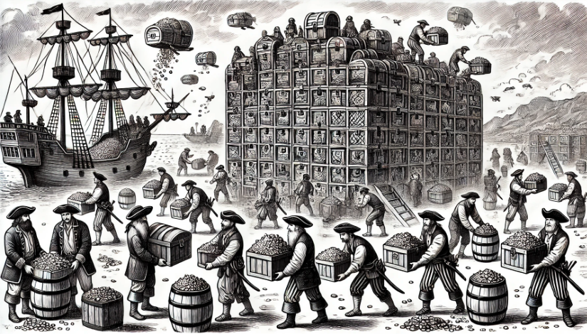

- [System Design - Storage, RAID e Sistemas de Arquivos](#system-design---storage-raid-e-sistemas-de-arquivos)
- [Definindo Storage e Armazenamento](#definindo-storage-e-armazenamento)
- [Dimensões em Storage](#dimensões-em-storage)
  - [Throughput em Storage](#throughput-em-storage)
  - [Bandwidth em Storage](#bandwidth-em-storage)
  - [I/O e IOPS em Storage](#io-e-iops-em-storage)
- [Tipos e Modelos de Storage](#tipos-e-modelos-de-storage)
  - [DAS - Direct-Attached Storage](#das---direct-attached-storage)
  - [NAS - Network Attached Storage](#nas---network-attached-storage)
  - [Block Storage](#block-storage)
  - [File Storage](#file-storage)
  - [Object Storage](#object-storage)
- [RAID - Redundant Array of Independent Disks](#raid---redundant-array-of-independent-disks)
  - [RAID 0 (Striping)](#raid-0-striping)
  - [RAID 1 (Mirroring)](#raid-1-mirroring)
  - [RAID 5 (Striping com Paridade Distribuída)](#raid-5-striping-com-paridade-distribuída)
  - [RAID 6 (Striping com Dupla Paridade)](#raid-6-striping-com-dupla-paridade)
  - [RAID 10 (Combinação de RAID 1 com RAID 0)](#raid-10-combinação-de-raid-1-com-raid-0)

> **Nota:** Este documento é um material de estudo baseado no artigo original **"System Design - Storage, RAID e Sistemas de Arquivos"**, de **Matheus Fidelis**, publicado em [fidelissauro.dev/storage](https://fidelissauro.dev/storage/). As ilustrações pertencem ao autor original. Recomenda-se a leitura do artigo completo na fonte.

---

# Definindo Storage e Armazenamento

Storage (ou armazenamento) é a prática de persistir dados de maneira organizada e escalável, de modo que possam ser recuperados depois com segurança e bom desempenho. Na prática, isso acontece sobre dispositivos variados: discos mecânicos (HDD), unidades de estado sólido (SSD) ou sistemas de armazenamento acessados pela rede, como o NFS.

Em arquitetura de sistemas, pensar em storage vai muito além de "guardar bytes por muito tempo". Envolve trade-offs estratégicos entre **persistência** (manter o dado íntegro mesmo após falhas de hardware), **capacidade de expansão** (crescer ou reduzir partições sem interromper o serviço), **redundância para recuperação** (evitar perda e restaurar rápido após incidentes) e **desempenho/IOPS** (atender à latência e à vazão exigidas nas operações de leitura e escrita).

Sob a ótica de sistemas distribuídos, o ideal é fugir do acoplamento a um único host: dados são espalhados e gerenciados de forma descentralizada, replicados entre vários nós e servidores. Isso traz à mesa conceitos como sharding, replicação, resiliência e disponibilidade — tudo sem sacrificar de forma significativa performance e segurança, temas que o capítulo aprofunda nas seções seguintes.

# Dimensões em Storage

Antes de discutir estratégias de armazenamento, vale fixar as métricas que servem de base para avaliar e dimensionar essas arquiteturas. São elas que ajudam a levantar requisitos e a propor soluções na medida certa — nem subdimensionadas (gerando gargalos) nem superdimensionadas (desperdiçando dinheiro). As próximas subseções cobrem as principais.

## Throughput em Storage

Throughput é o "número de operações que o sistema realiza num intervalo de tempo". Aplicado a storage, representa o volume total de dados transferidos para a unidade de armazenamento em dado período, normalmente expresso em megabytes por segundo (MB/s) ou gigabytes por segundo (GB/s).

Discos com throughput elevado são adequados a cargas com volumes massivos e leitura/escrita intensas, pois conseguem absorver muitas solicitações simultâneas sem gerar enfileiramento ou latência extra.

## Bandwidth em Storage

Bandwidth (largura de banda) é a quantidade máxima de dados que um canal de comunicação consegue trafegar entre componentes. No contexto de storage, funciona como o teto do throughput possível nas operações de leitura e escrita, e é medido na mesma unidade do throughput real: MB/s ou GB/s.

## I/O e IOPS em Storage

Um I/O (Input/Output) é uma operação isolada de leitura ou escrita entre o sistema e o volume. Sempre que a aplicação persiste arquivos ou registros no disco, temos uma operação de entrada (Input); sempre que recupera dados para processar ou exibir, temos uma operação de saída (Output).

Para medir a capacidade dessas operações usamos o IOPS (Input/Output Operations Per Second), ou seja, quantas leituras/escritas ocorrem por segundo. Cada volume tem um teto de IOPS suportado, e é recomendável monitorar o volume real dessas operações para detectar throttling, saturação ou proximidade do limite — insumo essencial para dimensionar a solução corretamente.

# Tipos e Modelos de Storage

A camada de armazenamento pode ser estruturada de várias formas, conforme os requisitos de durabilidade, performance, escalabilidade e segurança do produto. Independentemente do modelo escolhido, alguns conceitos de arquitetura precisam estar claros para se decidir bem sobre a persistência. Esta seção apresenta os principais modelos usados para estruturar e compreender essa camada.

## DAS - Direct-Attached Storage

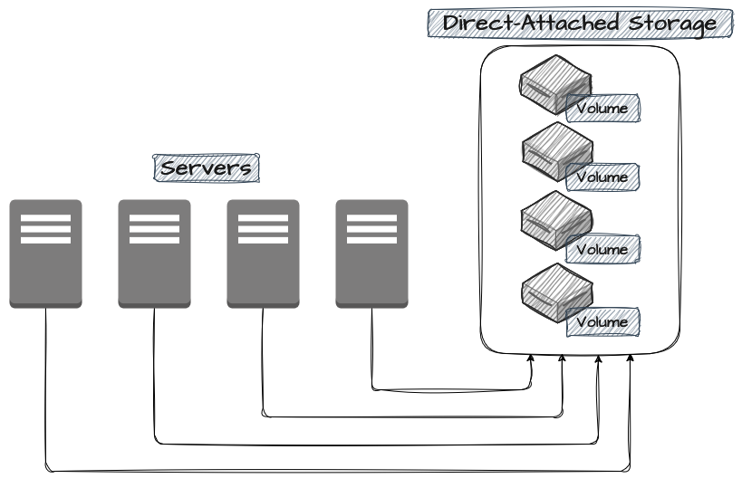

O DAS (Direct-Attached Storage) é o modelo mais tradicional: dispositivos e volumes conectados diretamente a um servidor via interfaces como SATA, USB ou NVMe. É uma das abordagens mais simples e indicada quando desempenho e acesso direto são prioridade.

Como os discos ficam no próprio host, não há latência adicional de rede nem troca de protocolos complexos — ótimo para aplicações sensíveis a acessos frequentes e intensos ao filesystem.

O ponto fraco é a escalabilidade horizontal: o DAS normalmente não suporta montagem em múltiplos servidores e exige adição física de novos volumes para crescer, muitas vezes com migração manual dos dados. Isso complica a operação e impõe limites claros de tamanho e custo.

## NAS - Network Attached Storage

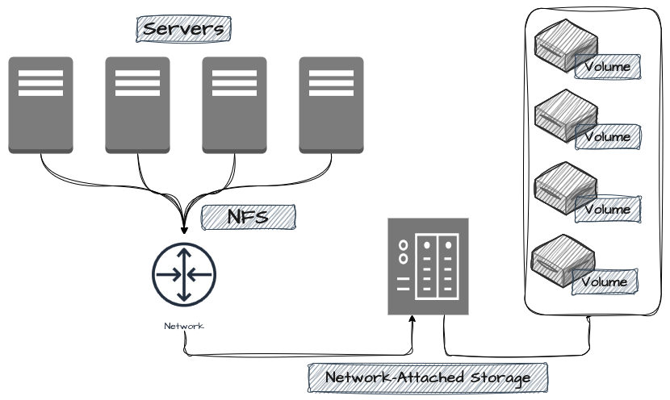

Diferente do DAS, o NAS (Network Attached Storage) disponibiliza seus dados diretamente pela rede local, permitindo que vários clientes acessem e modifiquem o mesmo volume simultaneamente por meio de protocolos como NFS (Network File System) e SMB (Server Message Block). Ele aparece desde redes domésticas e compartilhamento corporativo de diretórios até volumes de aplicações produtivas, sendo valorizado pela facilidade de implementação, gerenciamento centralizado e acesso simples aos dados.

Também ao contrário do DAS, o desempenho do NAS fica limitado à latência da rede e ao bandwidth disponível — algo crítico em cargas com leitura/escrita intensa. Os NAS costumam ser construídos sobre File Storages hierárquicos.

## Block Storage

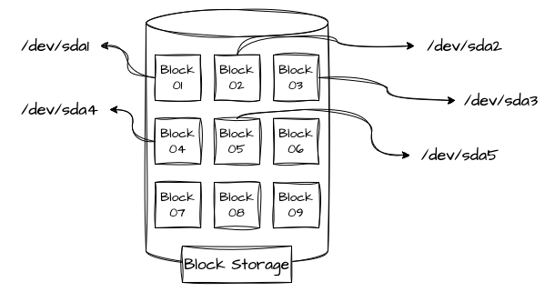

O Block Storage armazena informações em blocos espalhados pelo volume. É o modelo mais próximo do "disco rígido tradicional": representa o próprio disco sob um sistema de arquivos como FAT-32, exFAT ou ext4, podendo ser acessado pelo sistema operacional e montado como um drive. HDDs e SSDs ligados diretamente ao servidor também são Block Storages, e o servidor que gerencia esses blocos pode formatá-los e usá-los como sistema de arquivos.

Cada bloco é endereçado de forma única e tratado individualmente, como se fosse um disco isolado, mas de maneira virtual. Isso permite alocar dados menores onde for mais eficiente e até particionar um volume grande em dois ou mais sistemas de arquivos isolados, fisicamente no mesmo dispositivo. Os blocos têm tamanho fixo (de alguns kilobytes a gigabytes), definido na configuração do particionamento — característica que pode limitar a escalabilidade horizontal.

## File Storage

O File Storage (também file-level ou file-based) organiza os dados em uma estrutura hierárquica de diretórios e arquivos. Arquivos ficam dentro de pastas, que podem conter outras pastas, formando uma "árvore". O identificador único de cada arquivo nasce da combinação do nome com o caminho hierárquico, impedindo que dois arquivos com o mesmo nome coexistam no mesmo nível.

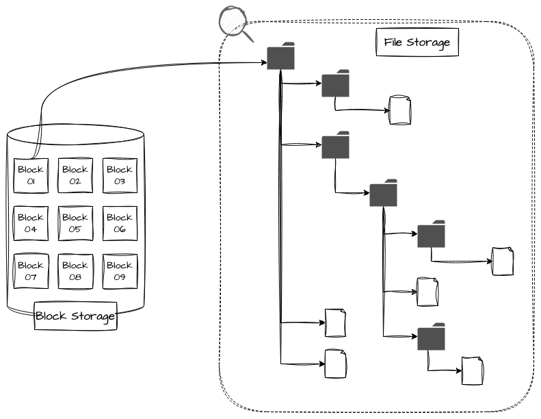

Cada arquivo e pasta carrega metadados relevantes — nome, tamanho, datas de criação e modificação, donos e grupos — vindos do próprio sistema operacional ou de sistemas de autenticação corporativos, o que facilita busca, ordenação e gestão.

Esses sistemas costumam ser pensados para acesso compartilhado e desacoplado entre vários clientes via protocolos de rede como NFS ou SMB. São tipicamente configurados com apoio de RAID e anexados a sistemas NAS, podendo oferecer alta escalabilidade e elasticidade de forma segura, conforme a especificação.

## Object Storage

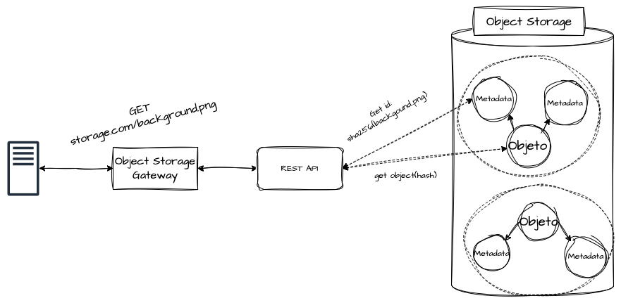

Em nuvens públicas, o modelo que mais aparece é o Object Storage (armazenamento de objetos): uma abordagem altamente escalável, frequentemente exposta por APIs abertas, que permite guardar grandes volumes de dados totalmente desacoplados da aplicação.

Enquanto os file storages tradicionais organizam dados em hierarquias de diretórios, o Object Storage trata cada dado como um objeto individual. Cada objeto reúne seu conteúdo e um conjunto de metadados, e é organizado, recuperado e manipulado por APIs e comandos claros a partir de um identificador único.

Tarefas pesadas de gestão de arquivos — replicação, particionamento, backups e ciclo de vida do dado — acontecem de forma transparente, elevando muito a escalabilidade, a durabilidade e a disponibilidade. Exemplos práticos incluem Amazon S3, Azure Blob Storage e Google Cloud Storage, além de soluções open-source como MinIO e Ceph.

Suas limitações lembram as do NAS, mas com uma diferença: do ponto de vista da aplicação, leitura e escrita não são locais — passam por intermediação cliente-servidor do storage, usando o mínimo de I/O do disco local. Isso o torna ideal para arquiteturas cloud native sensíveis à escalabilidade horizontal e com alto desacoplamento.

# RAID - Redundant Array of Independent Disks

RAID (Redundant Array of Independent Disks) reúne estratégias para combinar múltiplos discos físicos em um único sistema lógico de armazenamento. Cada variante equilibra de forma diferente resiliência, tolerância a falhas, desempenho e integridade dos dados. A seguir, alguns dos modelos mais usados.

## RAID 0 (Striping)

O RAID 0 usa "striping": os dados são distribuídos igualmente entre dois ou mais discos. Sua marca é o ganho expressivo de leitura e escrita, já que as operações ocorrem em paralelo entre todos os discos, somando a taxa de transferência de cada volume. O custo é a fragilidade: a falha de um único disco implica perda de todos os dados, o que o torna inadequado para informações críticas e de longa duração.

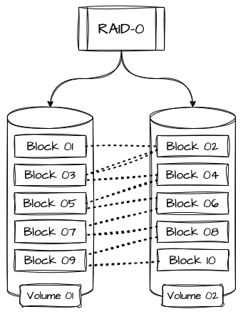

A capacidade total é a soma contínua de todos os volumes anexados. Por exemplo, quatro discos de 10 TB resultam em 40 TB úteis, distribuídos igualmente entre os participantes.

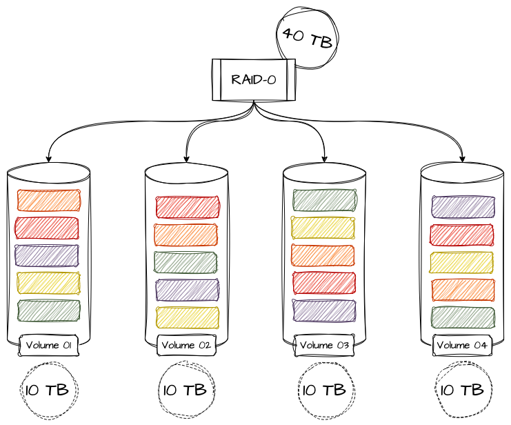

## RAID 1 (Mirroring)

Enquanto o RAID 0 prioriza performance ao custo da disponibilidade, o RAID 1 aplica "mirroring" (espelhamento): cada disco tem uma cópia exata de seus dados em outro disco, replicada continuamente. Se um disco falha, o espelho assume na hora, sem interrupção ou perda.

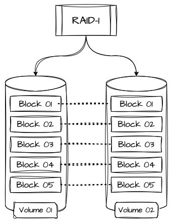

O RAID 1 abre mão de parte da performance em troca de maior confiabilidade. É ideal para volumes que hospedam sistemas operacionais, bancos de dados e outras aplicações críticas, já que o mesmo dado fica armazenado mais de uma vez.

## RAID 5 (Striping com Paridade Distribuída)

O RAID 5 oferece um meio-termo melhor que RAID 0 e RAID 1: bom desempenho de leitura e escrita sem abrir mão de disponibilidade e segurança. Como o RAID 0, distribui as escritas entre os volumes, mas mantém metadados de paridade espalhados por todos eles, de modo que, na falha de um disco, a informação possa ser reconstruída.

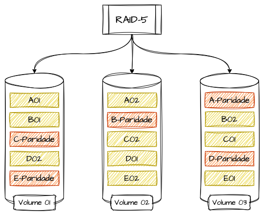

Vale notar que o RAID 5 exige no mínimo 3 discos, e sua capacidade total equivale à soma dos volumes menos a capacidade de um disco — proporção reservada para a paridade (ainda que distribuída entre todos).

Por exemplo, cinco discos de 10 TB resultam em 40 TB úteis. Ele tolera a perda de apenas uma unidade por vez: nesse caso, a paridade reconstrói os dados, mas a performance cai até a reconstrução e a reposição do disco.

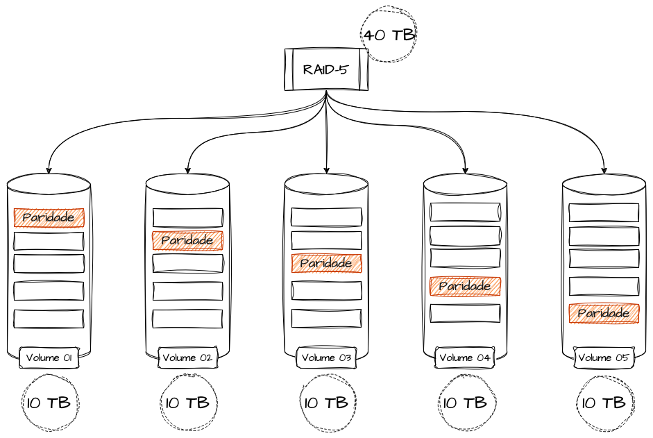

## RAID 6 (Striping com Dupla Paridade)

O RAID 6 funciona como o RAID 5, mas com uma camada adicional de paridade distribuída. Isso permite que dois discos falhem simultaneamente sem perda de dados. O desempenho é um pouco menor por causa dessa camada extra, mas é altamente recomendado para sistemas críticos e com grandes volumes de dados de longo prazo.

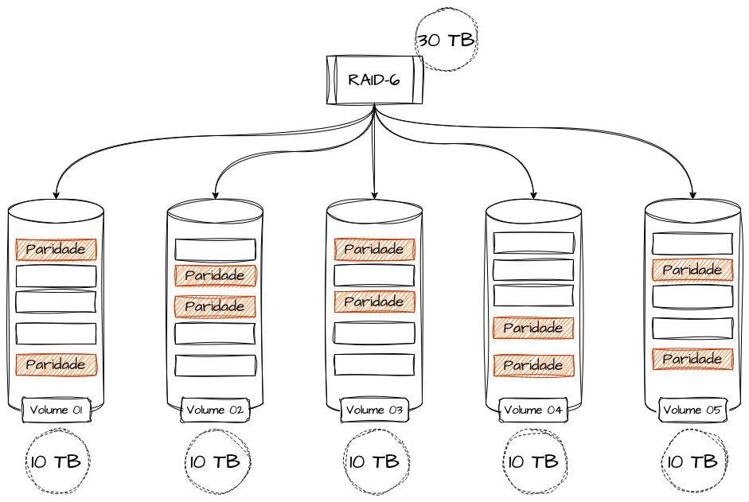

O cálculo de capacidade é semelhante ao do RAID 5, porém o RAID 6 reserva dois volumes em vez de um: a capacidade total é a soma de todos os discos menos a capacidade de dois.

Seguindo o mesmo exemplo, cinco discos de 10 TB resultam em 30 TB úteis, tolerando a falha de até 2 volumes sem perda ou corrupção de dados.

## RAID 10 (Combinação de RAID 1 com RAID 0)

O RAID 10 (ou RAID 1+0) combina o espelhamento do RAID 1 com o striping do RAID 0. Primeiro os dados são distribuídos em blocos entre vários discos (como no RAID 0); em seguida, são replicados para os discos espelho (como no RAID 1).

O resultado é alta disponibilidade e resiliência contra falhas simultâneas, desde que os discos afetados não pertençam ao mesmo par de espelhamento. A desvantagem é o custo: metade da capacidade total é consumida pela redundância.

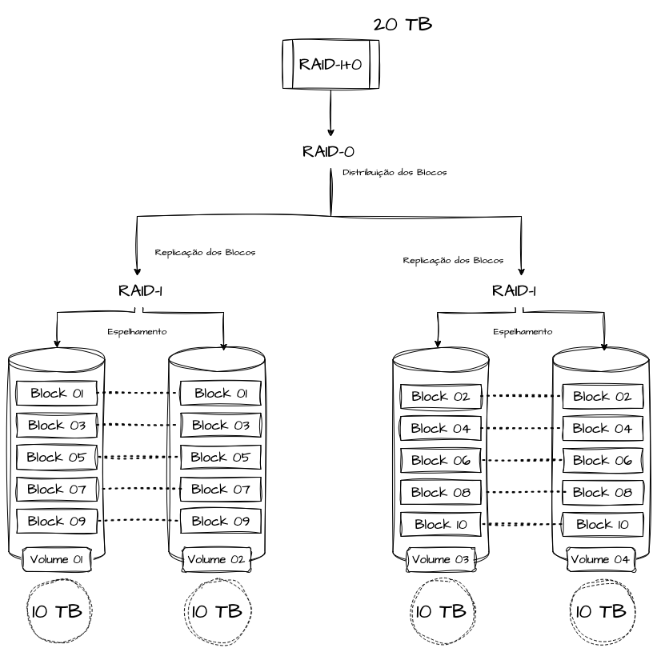

O RAID 10 é fortemente recomendado para sistemas financeiros, hospitalares e cargas transacionais críticas.
