- [System Design - Teorema CAP, ACID, BASE e Bancos de Dados Distribuídos](#system-design---teorema-cap-acid-base-e-bancos-de-dados-distribuídos)
- [O Teorema CAP](#o-teorema-cap)
- [ACID e BASE, os trade-offs entre SQL e NoSQL](#acid-e-base-os-trade-offs-entre-sql-e-nosql)
- [Modelo ACID - Atomicity, Consistency, Isolation, Durability](#modelo-acid---atomicity-consistency-isolation-durability)
  - [Atomicidade](#atomicidade)
  - [Consistência](#consistência)
  - [Isolamento](#isolamento)
  - [Durabilidade](#durabilidade)
- [Modelo BASE - Basically Available, Soft State, Eventual Consistency](#modelo-base---basically-available-soft-state-eventual-consistency)
  - [Basicamente Disponível](#basicamente-disponível)
  - [Soft State](#soft-state)
  - [Eventualmente Consistente](#eventualmente-consistente)
- [Explicação dos Componentes do CAP](#explicação-dos-componentes-do-cap)
  - [Consistency / Consistência (C)](#consistency--consistência-c)
  - [Availability / Disponibilidade (A)](#availability--disponibilidade-a)
  - [Partition Tolerance / Tolerância a Partições (P)](#partition-tolerance--tolerância-a-partições-p)
  - [O que é uma Partição de Rede?](#o-que-é-uma-partição-de-rede)
- [As combinações do Teorema: “Escolha 2”](#as-combinações-do-teorema-escolha-2)
  - [CP (Consistência e Tolerância a Partições)](#cp-consistência-e-tolerância-a-partições)
  - [AP (Disponibilidade e Tolerância a Partições)](#ap-disponibilidade-e-tolerância-a-partições)
  - [CA (Consistência e Disponibilidade)](#ca-consistência-e-disponibilidade)
- [Tabela de Flavors (CAP)](#tabela-de-flavors-cap)
- [O que mudou depois da concepção do CAP?](#o-que-mudou-depois-da-concepção-do-cap)
- [Teorema PACELC](#teorema-pacelc)
- [O Teorema PACELC](#o-teorema-pacelc)
  - [Teorema PACELC vs Teorema CAP](#teorema-pacelc-vs-teorema-cap)
- [Aplicações do PACELC](#aplicações-do-pacelc)
  - [PA/EL (On Partition, Availability; Else, Latency)](#pael-on-partition-availability-else-latency)
  - [PC/EL (On Partition, Consistency; Else, Latency)](#pcel-on-partition-consistency-else-latency)
  - [PA/EC (On Partition, Availability; Else, Consistency)](#paec-on-partition-availability-else-consistency)
  - [PC/EC (On Partition, Consistency; Else, Consistency)](#pcec-on-partition-consistency-else-consistency)
  - [Comparações do PACELC](#comparações-do-pacelc)
- [Referências](#referências)


# System Design - Teorema CAP, ACID, BASE e Bancos de Dados Distribuídos


Esse é mais um artigo da série de System Design, que está se mostrando extremamente prazerosa de escrever. Tem sido muito gratificante me desafiar a entender temas densos e complexos e simplificar suas explicações. Da ultima vez falamos sobre Concorrência, Paralelismo e Multithreading, hoje não consegui gerar exemplos tão didáticos para o mundo real quando nesse artigo, mas ainda assim espero de coração que você ainda saia com algum conhecimento bacana daqui.

Hoje vamos abordar alguns tópicos muito importantes relacionados à arquitetura de bancos de dados. Discutiremos o Teorema CAP, desde sua concepção até outros tópicos que tangenciam este tema, e, por fim, reavaliaremos a evolução do teorema muitos anos após sua publicação, comparando-o com soluções modernas e a evolução contínua da engenharia de software.

# O Teorema CAP
O Teorema CAP é uma sigla para Consistency, Availability, and Partition Tolerance (Consistência, Disponibilidade e Tolerância a Partições), e representa um princípio fundamental para compreender a arquitetura e as limitações na escolha de uma base de dados.

Esse modelo foi proposto por Eric Brewer da Universidade da Califórnia durante uma conferência no ano 2000. O teorema foi de extrema importancia para influenciar escolhas arquiteturais em bancos de dados distribuídos.


O teorema propõe que, na perspectiva de sistemas distribuídos, um banco de dados só pode entregar dois dos três atributos descritos no CAP. Isso é análogo à máxima popular de “Escolha 2: Bom, Rápido e Barato”. Se for Bom e Barato, não vai Rápido. Se for Rápido e Bom não vai ser Barato. Se for Barato e Rápido não vai ser Bom. A proposta inicial segue essa lógica.

Ele fornece uma base para entender as limitações inerentes a qualquer sistema de banco de dados distribuído e ajuda a esclarecer por que não é possível atingir todas as três propriedades simultaneamente. Vamos explorar o modelo proposto comparando com abordagens mais modernas ao longo deste artigo.

Para entender a concepção completa de todas as propriedades do terema CAP, precisamos explorar alguns conceitos que irão ajudar na sua compreensão. Antes de detalhar o que significa cada item do CAP, é necessário entender os conceitos de ACID e BASE e compreender como funcionam transações e operações dentro dos bancos de dados.


# ACID e BASE, os trade-offs entre SQL e NoSQL
Nas disciplinas de bancos de dados, dois conjuntos de conceitos são fundamentais para guiar o design e a gestão das transações e/ou consultas: ACID e BASE.

Entender a diferença entre ambos é de extrema importancia para qualquer pessoa que trabalhe com engenharia ou arquitetura, e que deseje trabalhar de forma eficiente com bancos de dados distribuídos, além da escolha de uma tecnologia específica.

Vamos começar detalhando sobre ACID.

# Modelo ACID - Atomicity, Consistency, Isolation, Durability
Quando falamos sobre ACID, um acrônimo para Atomicidade, Consistência, Isolamento e Durabilidade, estamos nos referindo a bancos de dados que proporcionam operações transacionais processadas de forma atômica e confiável, em troca, talvez, de outras propriedades possíveis em requisitos diferentes. É o caso dos bancos de dados SQL tradicionais, onde a consistência e o commit das transações de escrita são priorizados em detrimento da performance e disponibilidade.

Os itens do ACID são definidos da seguinte forma:

## Atomicidade
A atomicidade assegura que cada transação seja tratada como uma unidade indivisível, ou seja, todas as operações de escrita dentro de uma transação devem ser concluídas com sucesso; caso contrário, nenhuma delas será efetivada.

Uma transação pode conter uma ou mais queries que correspondem a uma lógica ou funcionalidade de negócio específica. Por exemplo, imagine um sistema simples que registra vendas de um e-commerce. Recebemos um evento fictício que representa a venda de um produto qualquer, no qual precisamos decrementar o estoque desse produto e registrar a venda. Nesse caso, seriam duas operações: decrementar o contador de estoque do produto numa tabela chamada estoque e, em seguida, fazer um INSERT em uma tabela chamada vendas. Ambas as operações precisam ser concluídas de forma dependente, pois tanto atualizar o estoque sem registrar a venda quanto registrar a venda sem atualizar o estoque podem gerar problemas de consistência logística e contábil para o e-commerce, além de transtornos para o cliente. Esse é o real benefício das transações, que garantem a atomicidade no modelo ACID.

```go
package main

import (
    "database/sql"
    "log"

    _ "github.com/go-sql-driver/mysql"
)

func main() {
    // Representa uma conexão com o banco de dados MySQL 
    db, err := sql.Open("mysql", "username:password@tcp(host:port)/dbname")
    if err != nil {
        log.Fatal(err)
    }
    defer db.Close()

    // Iniciando a Transação
    tx, err := db.Begin()
    if err != nil {
        log.Fatal(err)
    }

    // Representação do produto vendido
    produtoID := 1
    quantidadeVendida := 10

    // 1ª Operação: Atualizar o estoque do produto
    _, err = tx.Exec("UPDATE produtos SET estoque = estoque - ? WHERE id = ?", quantidadeVendida, produtoID)
    if err != nil {
        tx.Rollback() // Em caso de falha, é efetuado o rollback de todas as queries dentro da transaction
        log.Fatal(err)
    }

    // 2ª Operação: Registrar a venda
    _, err = tx.Exec("INSERT INTO vendas (produto_id, quantidade) VALUES (?, ?)", produtoID, quantidadeVendida)
    if err != nil {
        tx.Rollback() // Em caso de falha, é efetuado o rollback de todas as queries dentro da transaction
        log.Fatal(err)
    }

    // Se chegou até aqui, ambas as operações foram bem-sucedidas. Então, faz commit.
    err = tx.Commit()
    if err != nil {
        log.Fatal(err)
    }
}
```

## Consistência
A consistência em um banco de dados refere-se à garantia de que todas as transações conduzam o banco de dados de um estado consistente para outro estado igualmente consistente. Esta definição, embora elegante, pode ser difícil de compreender inicialmente. Em termos práticos, a consistência nos assegura a integridade dos dados, evitando dados corrompidos ou inválidos. Isso significa que, em nenhum momento, o banco de dados operará com dados desatualizados ou indisponíveis na visão do cliente.

O nível de consistência também garante a validação das transações, conforme discutido no tópico de atomicidade, além de respeitar restrições e condições impostas durante a modelagem dos dados. Na prática, isso se traduz na garantia de que todas as foreign keys, especificações de nullabilidade, triggers e tipos sejam respeitados em todo momento. Por exemplo, uma tentativa de inserir uma string em um campo do tipo decimal resultará em um erro de validação, ou a garantia de que um valor nunca será menor que zero ou excederá um determinado tamanho.

## Isolamento
O isolamento, em nível transacional nos bancos de dados no modelo ACID, refere-se à capacidade de uma transação operar independentemente de outras transações simultâneas, ou seja, a garantia de que várias transações ocorrendo ao mesmo tempo não interfiram umas nas outras.

Existem diversos níveis de isolamento, mas todos visam prevenir situações como Dirty Reads, onde uma transação de leitura acessa dados que foram inseridos ou modificados por outra transação ainda não confirmada; Non-repeatable Reads, onde a mesma transação lê os mesmos dados mais de uma vez e obtém resultados diferentes devido a outra transação de escrita concluída entre essas leituras; e Phantom Reads, onde a re-execução da mesma leitura em uma transação recupera dados que não existiam na primeira leitura, devido ao mesmo motivo.

O maior desafio a nível arquitetural é encontrar o equilíbrio certo entre isolamento e desempenho no design de sistemas de banco de dados. Níveis mais altos de isolamento tendem a reduzir a concorrência e podem afetar o desempenho, enquanto níveis mais baixos podem aumentar a concorrência, mas com riscos de inconsistência.

## Durabilidade
A durabilidade, no modelo ACID, é o pilar que garante que, uma vez confirmada, uma transação permanecerá assim permanentemente. Isso significa que, após a confirmação de uma operação de escrita, ela não será perdida mesmo diante de diversas possibilidades de falha, assegurando a persistência dos dados em uma fonte não volátil, como disco rígido, e não apenas em armazenamento volátil, como memória, que pode ser perdida caso o servidor desligue.

Ela é fundamental para a confiabilidade do sistema, especialmente em aplicações onde a perda de dados pode ter consequências sérias.

# Modelo BASE - Basically Available, Soft State, Eventual Consistency
Enquanto o ACID foca na precisão e confiabilidade, o BASE, um acrônimo para Basicamente Disponível, Soft State e Eventualmente Consistente, adota uma abordagem com níveis de flexibilidade mais adequados para lidar com sistemas distribuídos modernos, onde a disponibilidade e a tolerância a falhas são prioridades. Assim como o Teorema CAP, o BASE também foi proposto por Brewer junto a um grupo de pesquisadores.

## Basicamente Disponível
O termo Basicamente Disponível implica que o sistema é projetado para maximizar a disponibilidade, mas não garante uma disponibilidade total e ininterrupta. Em outras palavras, o sistema será acessível na maior parte do tempo, mas pode haver momentos em que alguns dados ou funcionalidades não estejam disponíveis, devido a falhas de rede, manutenção ou particionamento de dados.

Para alcançar essa disponibilidade, os dados são frequentemente particionados e replicados em múltiplos servidores. Isso permite que, mesmo se uma parte do sistema falhar, outras partes continuem funcionando.

Bancos de dados NoSQL, como Dynamo, Cassandra ou MongoDB, empregam estratégias de replicação e particionamento para garantir que os dados estejam disponíveis mesmo quando alguns nós do cluster falham.

Essa abordagem é ideal para ambientes de larga escala e alta demanda, onde a capacidade de lidar com falhas parciais e a necessidade de manter a operação contínua são mais críticas do que manter uma consistência estrita dos dados em todos os momentos.

## Soft State
O conceito de Soft State se refere à ideia de que o estado do sistema pode mudar ao longo do tempo, mesmo sem uma entrada externa ou uma intervenção intencional. Em um sistema operando sob o princípio de “Soft State”, os dados podem expirar ou ser atualizados automaticamente, e não há garantia de que as informações permaneçam consistentes se não forem atualizadas ou verificadas periodicamente. Esse princípio reconhece que manter a consistência rigorosa em todos os momentos pode ser impraticável ou desnecessária para certos tipos de aplicações e dados.

Em sistemas que aplicam o Soft State, os dados podem se autogerenciar, autodeletar e autoatualizar. Essa abordagem é comum em sistemas de cache distribuído, como Memcached, Redis, onde os dados armazenados são frequentemente considerados como tendo um “Soft State”. Eles podem ser substituídos ou expirar com o tempo para refletir mudanças no estado dos dados originais.

## Eventualmente Consistente
A Consistência Eventual descreve que as escritas realizadas em um determinado dado em um sistema de banco de dados distribuído serão replicadas para todos os nós de forma assíncrona. Isso significa que, por algum tempo, diferentes nós podem ter versões diferentes dos mesmos dados. O termo “eventual” nesse contexto é a garantia de que, se nenhuma nova alteração for feita em um dado por um certo período, todos os dados distribuídos entre os nós se tornarão consistentes em algum momento.

Este modelo é adequado para sistemas que operam em redes com latência significativa ou onde falhas de nós são comuns, permitindo que o sistema continue operacional apesar de inconsistências temporárias.

A consistência eventual é crucial para sistemas que precisam escalar para lidar com grandes volumes de tráfego ou grandes conjuntos de dados. Ela permite uma operação mais eficiente em larga escala, por isso muitos bancos de dados NoSQL, projetados para esse tipo de demanda, como Cassandra e DynamoDB, utilizam a consistência eventual para proporcionar alta disponibilidade e escalabilidade, sendo especialmente útil em aplicações web de larga escala.

# Explicação dos Componentes do CAP
Agora que já exploramos os conceitos e aplicações de ACID e BASE, podemos traçar um paralelo mais claro com as combinações de funcionalidades propostas no Teorema CAP. Vamos detalhar cada um dos componentes da sigla tentando gerar familiaridade com ambos os conceitos:

## Consistency / Consistência (C)
O nível de Consistência refere-se à garantia de que todos os nós de um banco de dados distribuído exibam os mesmos dados simultaneamente. Isso significa que, independentemente de qual nó seja consultado, todos retornarão sempre a versão mais recente dos dados.

Imagine uma situação onde uma operação de escrita precise aguardar a confirmação de replicação de todos os nós para concluir a transação e liberar o dado para consulta.

A consistência é essencial em aplicações onde a atomicidade e a atualização dos dados são partes críticas da solução, como em sistemas financeiros e registros hospitalares.


## Availability / Disponibilidade (A)
O nível de Disponibilidade assegura que todas as solicitações feitas ao sistema receberão uma resposta, independentemente de os dados estarem atualizados no nó consultado ou não.

Quando a disponibilidade é priorizada em uma escolha arquitetural, geralmente se presume que o dado retornado pode não ser o mais recente, desde a operação de escrita até a de leitura.

Isso significa que as operações de escrita e leitura podem atuar de forma independente uma das outras. Ou seja, a solicitação de escrita pode ser concluída antes de todo o processo de replicação entre os nós estar completo.

Este atributo é particularmente valioso em sistemas que exigem alta performance, volumosa ingestão de dados e tempos de resposta rápidos, como em fluxos de streaming e análise de dados (analytics).

Os sistemas alcançam a disponibilidade dos dados normalmente através da replicação, que consiste em “duplicar” as informações entre os nós disponíveis.


## Partition Tolerance / Tolerância a Partições (P)
O nível de Tolerância a Partições refere-se à capacidade de um banco de dados distribuído continuar operacional, apesar de falhas que “particionem” a rede e duas ou mais partes que não conseguem mais se comunicar.

Em ambientes distribuídos, é cada vez mais necessário assumir que falhas de rede, hardware, atualizações programadas e de segurança emergencial feitas pelos provedores podem ocorrer a qualquer momento. Um sistema tolerante a partições é capaz de oferecer um certo nível de continuidade do serviço em caso de falhas parciais.

Esse atributo é particularmente valioso em aplicações distribuídas geograficamente, redes sociais, agregadores de logs, brokers de eventos, sistemas de filas, entre outros.

## O que é uma Partição de Rede?
O termo “partição” pode gerar confusão, especialmente quando já estamos familiarizados com outros termos de Bancos de Dados. Porém, no contexto de “CAP” e “Tolerância a Partições”, Partição de Rede refere-se a uma situação onde ocorre uma falha sistêmica de rede entre dois ou mais nós do banco de dados, impedindo que eles permaneçam sincronizados e gerando uma inconsistência temporária. Isso se torna mais complexo quando a escrita é distribuída entre os nós.

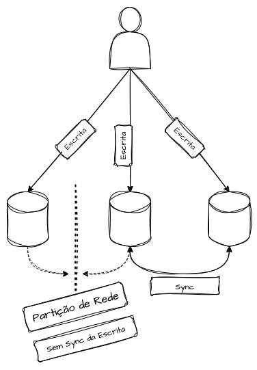

Frequentemente, em um cluster otimizado para tolerância a partições, é possível isolar um nó do restante do cluster para executar manutenção, troubleshooting, adição de recursos ou atualização. Após a conclusão, esse nó é reintegrado ao cluster, passando por um processo de sincronização para retomar a operação consistente com os demais. Podemos entender que, mediante a uma falha de comunicação de rede entre um ou mais nós que recebem requisições de escita, quando esse problema de comunicação for resolvido, o meu banco de dados terá a capacidade de realizar a replicação e resolução de conflitos das operacões entre todos os nodes do cluster.

# As combinações do Teorema: “Escolha 2”

## CP (Consistência e Tolerância a Partições)
Nesta configuração, o sistema prioriza a consistência e a tolerância a partições, sacrificando a disponibilidade.

O sistema mantém a consistência através de todos os nós que continuam operando em caso de falhas de rede ou partições. Quando uma partição ocorre entre dois ou mais nós, o sistema deve ter a capacidade de desativar os nós inconsistentes, tornando-os indisponíveis até que a consistência seja restaurada.

Esta abordagem é mais utilizada em situações onde a precisão dos dados é crítica e a atomicidade transacional é inegociável, como em sistemas financeiros, calculadores de crédito, sistemas de controle de estoque, entre outros.

**Exemplos**
- [MongoDB](https://www.mongodb.com/)
- [Cassandra - Sob Determinadas Configurações](https://cassandra.apache.org/)
- [Couchbase](https://www.couchbase.com/)
- [Etcd](https://etcd.io/)
- [Consul](https://www.consul.io/)

## AP (Disponibilidade e Tolerância a Partições)
Nesta configuração, o sistema prioriza a entrega de alta disponibilidade e tolerância a partições, sacrificando a consistência.

Quando ocorre uma partição de rede, todos os nós permanecem disponíveis para consultas, independentemente do seu nível de atualização. Mesmo durante os processos de ressincronização, todos os nós continuarão respondendo a solicitações, podendo fornecer dados desatualizados ou não.

Essa abordagem é empregada quando a continuidade da operação é mais importante do que a manutenção de dados consistentes o tempo todo. Exemplos típicos incluem buscas em e-commerces, redes sociais e sistemas de busca.

**Exemplos**
- [CouchDB](https://couchdb.apache.org/)
- [DynamoDB](https://aws.amazon.com/dynamodb/)
- [Cassandra - Sob Determinadas Configurações](https://cassandra.apache.org/)
- [SimpleDB](https://aws.amazon.com/simpledb/)

## CA (Consistência e Disponibilidade)
Nesta configuração, o sistema prioriza a consistência e a disponibilidade das solicitações, mas torna-se sensível a partições de dados. Em outras palavras, se ocorrer uma falha de rede ou partição, o sistema pode ficar completamente inoperante.

Este tipo de sistema é menos comum em ambientes distribuídos, pois a maioria deles é projetada para lidar com falhas de rede, partições e inconsistências.

Tal abordagem pode ser encontrada em outros tipos de bancos de dados que podem ou não ser distribuídos, variando conforme a necessidade de configuração específica. Exemplos incluem o Redis Standalone e bancos de dados SQL centralizados, como MySQL e PostgreSQL. Este modelo é frequentemente adotado para garantir operações ACID.

**Exemplos**
- [MySQL/MariaDB](https://www.mysql.com/)
- [PostgreSQL](https://www.postgresql.org/)
- [Oracle](https://www.oracle.com/database/)
- [SQL Server](https://www.microsoft.com/sql-server/)
- [Redis Standalone](https://redis.io/)
- [Memcached Standalone](https://memcached.org/)

# Tabela de Flavors (CAP)
Assumindo o que já vimos até aqui, segue uma tabela de refência de diferentes flavors de databases e onde cada uma das opções melhor se encaixa dentro da proposta do CAP.

| Banco de Dados | Consistência (C) | Disponibilidade (A) | Tolerância a Partições (P) |
| :--- | :---: | :---: | :---: |
| Cassandra | ❌ | ✅ | ✅ |
| MongoDB | ✅ | ❌ | ✅ |
| Couchbase | ✅ | ❌ | ✅ |
| DynamoDB | ❌ | ✅ | ✅ |
| Redis | ✅ | ✅ | ❌ |
| MySQL/MariaDB | ✅ | ✅ | ❌ |
| PostgreSQL | ✅ | ✅ | ❌ |
| Oracle | ✅ | ✅ | ❌ |
| Etcd | ✅ | ❌ | ✅ |
| Consul | ✅ | ❌ | ✅ |
| CockroachDB | ✅ | ❌ | ✅ |
| Riak | ❌ | ✅ | ✅ |
| HBase | ✅ | ❌ | ✅ |
| Neo4j | ✅ | ✅ | ❌ |
| FoundationDB | ✅ | ❌ | ✅ |
| VoltDB | ✅ | ✅ | ❌ |
| ArangoDB | ✅ | ✅ | ❌ |
| FaunaDB | ✅ | ✅ | ❌ |
| Aerospike | ❌ | ✅ | ✅ |
| Amazon Aurora | ✅ | ✅ | ❌ |
| CouchDB | ❌ | ✅ | ✅ |
| SimpleDB | ❌ | ✅ | ✅ |


# O que mudou depois da concepção do CAP?
Em 2012, Eric Brewer, autor do teorema, publicou um artigo intitulado CAP Twelve Years Later: How the “Rules” Have Changed, revisando o que foi proposto em seu trabalho original de 2000 com base na evolução tecnológica das opções de bancos de dados, clouds e arquiteturas de microserviços modernas. Ele lista as lições aprendidas e os conceitos que precisam ser revisitados.

Um dos pontos principais desse artigo é desmistificar a ideia de “2 de 3” entre consistência, disponibilidade e tolerância a partições, considerada enganosa na realidade atual. A formulação inicial do teorema era o já mencionado “Bom, Rápido e Barato, escolha 2”. No entanto, segundo o autor, essa visão sugere que as propriedades do sistema são binárias e altamente exclusivas.

A simplificação excessiva das compensações revelou-se limitante nas escolhas de arquitetura ao projetar sistemas modernos. Consistência e disponibilidade, na realidade, não são estados “on-off”, mas espectros que oferecem graus variados de realização.

Ao considerar consistência, disponibilidade e tolerância a partições, é mais produtivo pensar nelas como propriedades contínuas, em vez de estados binários. Por exemplo, a disponibilidade pode variar de 0 a 100%, e existem muitos níveis de consistência que podem ser explorados em sistemas modernos.

As partições de rede, embora críticas, são eventos relativamente raros em muitos workloads. A interpretação original do teorema sugere que as decisões de design devem presumir a presença constante de partições. Na prática, porém, a maior parte do tempo, os sistemas de bancos de dados operam em um estado não particionado, permitindo que consistência e disponibilidade sejam otimizadas conjuntamente.

Em resumo, o teorema CAP é útil para compreensões e discussões iniciais sobre design e escolhas arquiteturais. No entanto, é uma simplificação enganosa, uma vez que “2 de 3” não são necessariamente exclusivos, permitindo a existência de níveis de consistência e disponibilidade além de um estado binário de “consistente/não consistente”, “disponível/não disponível”, como demonstrado no modelo BASE.

---

# Teorema PACELC


Esse artigo é um complemento ao capítulo anterior sobre ACID, BASE e Teorema CAP, e apresenta uma evolução conceitual do modelo teórico do CAP, incluindo as críticas que surgiram com a evolução dos sistemas distribuídos e de seus componentes. O PACELC é um conceito mais moderno, que ajuda a compreender algumas lacunas que o CAP não cobre.

Após uma boa assimilação das classificações AP, CA, CP do CAP, podemos aprofundar o entendimento nos apêndices trazidos pelo PACELC.


# O Teorema PACELC
O Teorema PACELC foi proposto por Daniel Abadi em 2010, na Universidade de Yale, e nos ajuda a entender sistemas distribuídos para além do que é proposto pelo Teorema CAP. O Teorema CAP, como já vimos, estabelece que um sistema, mediante uma partição de rede, precisa escolher entre consistência e disponibilidade. Esse modelo foi — e ainda é — extremamente importante para nortear decisões arquiteturais e de engenharia em diversos contextos, mas deixa algumas lacunas conceituais em sistemas modernos, principalmente quanto ao comportamento do sistema ao considerar a Partition Tolerance. Por exemplo: o que aconteceria com um sistema quando não houver falhas de rede?


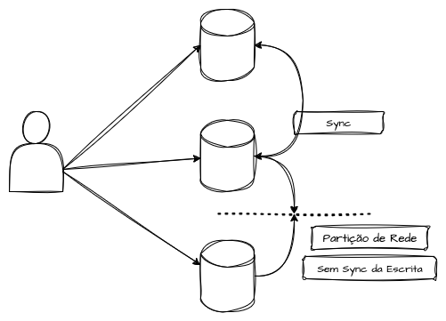

O PACELC amplia esse entendimento no contexto de bancos de dados distribuídos ao levantar uma nova questão: o que acontece quando não há falhas de rede e não há particionamento entre os nós do sistema? Nesses cenários, é possível operar em diferentes níveis de consistência conforme a necessidade. Assim, o modelo nos ajuda a refletir: o que o sistema deve priorizar quando está funcionando corretamente? E, de forma complementar, o que ele deve priorizar quando ocorre um particionamento entre os nós? O teorema nos ajuda a responder esses questionamentos de forma mais detalhado.

## Teorema PACELC vs Teorema CAP
Como vimos anteriormente, o Teorema CAP diz que quando ocorre uma Partição de Rede (P) entre os nós do sistema, é necessário escolher entre Consistência (C) ou Disponibilidade (A). Esse raciocínio é muito útil para a escolha de tecnologias que envolvem esses dois trade-offs, mas ainda deixa em aberto o requisito não funcional de como o sistema deve operar quando não há partições de rede.

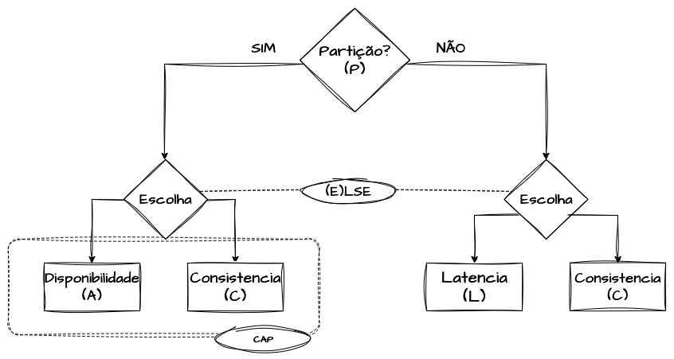

O PACELC funciona como uma extensão do CAP, propondo o seguinte racional: se houver partição (P), devemos escolher entre Disponibilidade (A) e Consistência (C); Else (E), ou seja, se não houver partição, escolhemos entre Latência (L) e Consistência (C). O teorema mostra que, mesmo em condições normais, sem partições —, ainda é preciso tomar decisões difíceis ao projetar a arquitetura. Ou priorizamos a garantia de uma consistência forte, pagando o preço de mais latência, ou abrimos mão de maiores níveis de consistência para reduzir o tempo de resposta e otimizar a performance das operações.

Em momentos de falha, decidimos entre disponibilidade e consistência. Fora deles, optamos entre consistência forte, que pode custar latência, e consistência eventual, que otimiza a performance mas sem garantias imediatas de consistência.

Esse raciocínio aproxima o modelo da realidade dos sistemas modernos, onde temos redes geograficamente distribuídas, replicação de dados e sharding e particionamento.

Imagine um banco de dados global: se ele quiser garantir que todas as réplicas estejam sempre sincronizadas antes de confirmar uma operação (consistência forte), cada escrita será mais lenta devido à latência de rede. Já se ele aceitar consistência eventual, poderá responder mais rápido, mas correrá o risco de que um usuário no Brasil veja um dado diferente de outro usuário na Espanha por algum tempo.

Em resumo, os dois teoremas não são excludentes, mas complementares. O PACELC amplia o CAP ao analisar não apenas os cenários de falha, mas também o comportamento do sistema em situações normais, conectando os padrões CP (Consistency + Partition Tolerance) e AP (Availability + Partition Tolerance) com as escolhas de Latência (L) e Consistência (C) fora das partições.


# Aplicações do PACELC
O Teorema PACELC se tornou uma forma prática de classificar sistemas distribuídos e suas bases de dados. Por exemplo, o Amazon DynamoDB é conhecido como PA/EL — ou seja, prefere disponibilidade durante partições (PA) e latência baixa em condições normais (EL). Já o Google Spanner é classificado como PC/EC, pois prefere consistência tanto durante partições quanto no funcionamento cotidiano, aceitando pagar o preço da latência.

Assim como no CAP, em que temos classificações como AP, CP ou AC, no PACELC também é possível categorizar os bancos de dados em diferentes combinações, como PA/EL, PC/EL, PA/EC e PC/EC, dependendo das escolhas de tr


## PA/EL (On Partition, Availability; Else, Latency)

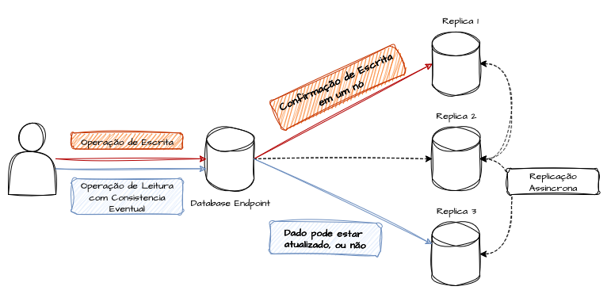

O modelo PA/EL descreve um sistema que, em condições normais (sem partição de rede), prioriza a latência em vez da consistência. Esse tipo de sistema busca garantir baixa latência nas operações, mesmo que isso signifique abrir mão de uma consistência forte. Else (E): quando ocorre uma partição de rede, o sistema prioriza a disponibilidade (A) em vez da consistência (C). Em outras palavras, reforça o modelo de consistência eventual, no qual todos os nós continuam respondendo às requisições independentemente do rompimento da partição, ainda que as réplicas não estejam totalmente sincronizadas.

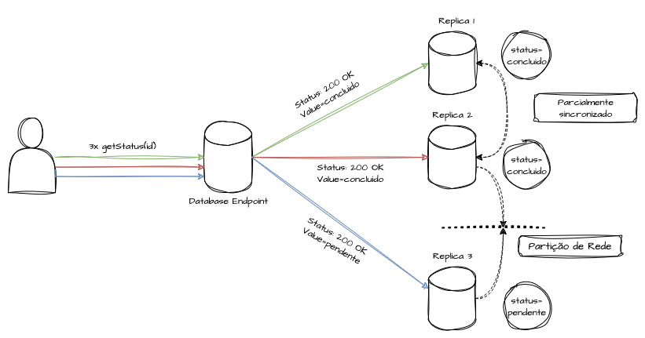

Esses bancos de dados são projetados para oferecer alta performance nas operações de escrita de forma resiliente, mas aceitam que diferentes usuários possam ver versões ligeiramente diferentes dos dados por algum tempo, até que a partição seja resolvida. É o caso de tecnologias como DynamoDB e Cassandra, amplamente utilizadas em cenários de grande escala, onde performance global e disponibilidade são mais importantes que a consistência absoluta.

## PC/EL (On Partition, Consistency; Else, Latency)

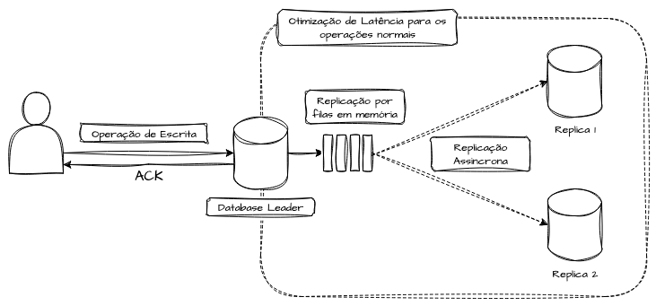

No modelo PC/EL, temos sistemas que, em seu funcionamento normal, priorizam a latência e o alto throughput ao custo da consistência. Nesse cenário, o sistema reduz o nível de consistência operacional para manter tempos de resposta rápidos e operações de escrita otimizadas.

Else (E): em caso de particionamento, o sistema passa a priorizar a consistência (C). Isso significa que, em uma situação de falha, o sistema pode ficar indisponível até que o cluster recupere o consenso e volte a operar, garantindo a integridade dos dados mesmo ao custo da disponibilidade temporária.

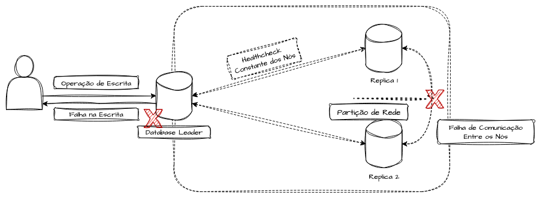

É uma escolha intermediária, onde os sistemas em questão não possuem soluções confiáveis de resolução de conflitos em grandes volumes de dados, funcionando apenas dentro do fluxo transacional previsto. Por isso, é preferível tornar o serviço indisponível do que lidar com uma parcela de dados que eventualmente nunca se tornariam consistentes.

Esse modelo é interessante quando a consistência mínima durante falhas é inegociável, mas, durante a operação normal, o objetivo é priorizar alto desempenho nas operações de escrita e leitura. O sistema aceita consistência eventual apenas quando todos os nós estão disponíveis, exigindo processos contínuos de health checks e heartbeats entre eles para validar o status antes de realizar operações. Caso contrário, prefere ficar totalmente inoperante.


## PA/EC (On Partition, Availability; Else, Consistency)

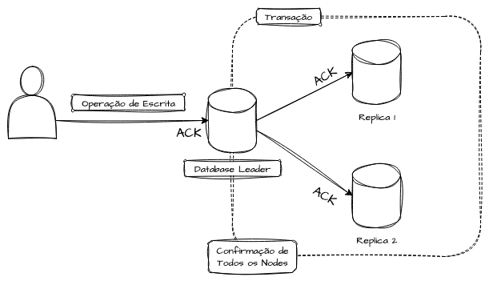

O modelo PA/EC descreve sistemas que, em condições normais de operação, priorizam a consistência forte, garantindo que todas as réplicas do sistema mantenham sempre a mesma versão do dado.

Else (E): em caso de falhas ou particionamentos de rede, o sistema prioriza a disponibilidade (A), aceitando operações de escrita e leitura mesmo que existam divergências temporárias entre as réplicas.

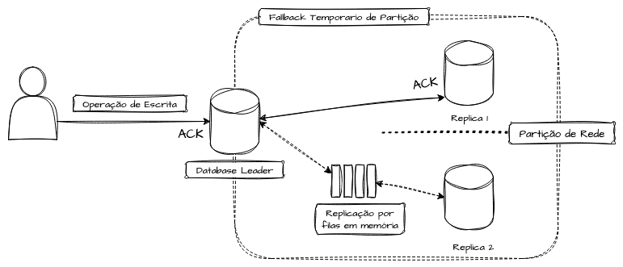

Normalmente, esses sistemas contam com algoritmos complexos de CRDTs (Conflict-Free Replicated Data Types), que fazem a gestão de conflitos entre diferentes atualizações de dados em nós distribuídos. Esse modelo é menos comum, mas pode aparecer em contextos híbridos de microserviços, nos quais a experiência do usuário não pode parar mesmo com falhas parciais, mas em que a regra de negócio e a criticidade operacional exigem que, quando a rede está saudável, todos os dados permaneçam rigorosamente sincronizados.

Em resumo, esse modelo assume a consistência eventual apenas como um fallback da consistência forte em último caso.

## PC/EC (On Partition, Consistency; Else, Consistency)

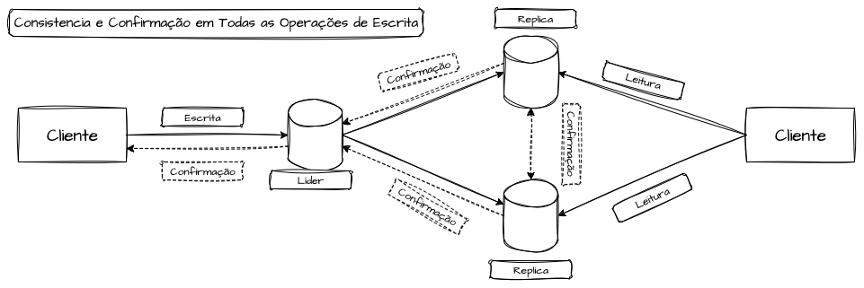

O modelo PC/EC descreve sistemas que são mais conservadores em relação à consistência dos dados. em operações normais, o sistema também prioriza a consistência em vez da latência, aceitando um maior custo de tempo de resposta em troca da garantia de que a última versão do dado esteja disponível em todos os nós. ELSE; Durante uma partição de rede, o sistema prioriza a consistência (C) em vez da disponibilidade (A), assumindo que é melhor falhar temporariamente do que operar com consistência eventual em algum nível.

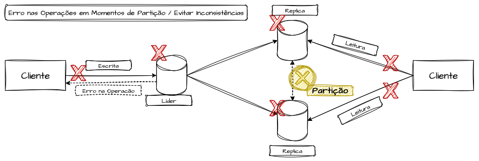

Esse comportamento é típico em sistemas nos quais a precisão dos dados é a qualidade mais importante. É a escolha natural para sistemas bancários, coordenação de clusters e transações críticas, onde ver dados incorretos por alguns milissegundos pode gerar prejuízos enormes.

Podemos encontrar esse modelo em bancos SQL tradicionais, no etcd e também em bancos transacionais geograficamente distribuídos, como o Google Spanner.


## Comparações do PACELC

A seguir, temos uma tabela comparativa de alguns flavors de bancos ditribuídos que estão inerentes a trabalhos com partição, e onde cada uma delas se encontra dentro dos itens do PACELC.

| Sistema / Banco de Dados | PAC (durante partição) | ELC (sem partição) | Classificação | Observação |
| :--- | :--- | :--- | :--- | :--- |
| **Amazon DynamoDB** | **A** (disponibilidade) | **L** (baixa latência, consistência eventual por padrão) | PA/EL | Eventual consistency como default, mas suporta “strong reads” opcionais. |
| **Cassandra** | **A** (disponibilidade) | **L** (baixa latência, consistência eventual por padrão) | PA/EL | Modelo baseado no Dynamo, otimizado para disponibilidade e baixa latência global. |
| **MongoDB** | **A** (se configurado com w=1) ou **C** (com majority write concern) | **L** (eventual consistency em réplicas secundárias) | PA/EL ou PC/EL | Flexível; o trade-off depende do write concern e read concern. |
| **Google Spanner** | **C** (consistência forte global) | **C** (mesmo sem partição, prioriza consistência) | PC/EC | Usa TrueTime para garantir consistência serializável global, com custo de latência. |
| **Azure Cosmos DB** | **A** (disponibilidade) | **L/C** (configurável: eventual, bounded, session, consistent prefix, strong) | PA/ELC | Oferece 5 níveis de consistência configuráveis. |
| **Apache Kafka** | **A** (disponibilidade) | **L** (prioriza throughput e baixa latência) | PA/EL | Garantias de consistência são fracas; foco em disponibilidade e velocidade. |
| **Etcd** | **C** (consistência forte) | **C** (consistência forte) | PC/EC | Voltado para consistência forte, usado em sistemas críticos de coordenação. |
| **ZooKeeper** | **C** (consistência forte) | **C** (consistência forte) | PC/EC | Voltado para consistência forte, usado em sistemas críticos de coordenação. |
| **CockroachDB** | **C** (prioriza consistência em partições) | **C** (consistência forte via consenso Raft) | PC/EC | Inspirado no Spanner, mantém consistência global em troca de latência mais alta. |
| **Redis em Cluster Mode** | **A** (disponibilidade, pode perder dados em falhas) | **L** (baixa latência com replicação assíncrona) | PA/EL | Focado em velocidade; consistência forte não é garantida em partições ou failover. |
| **Amazon RDS (Multi-AZ)** | **C** (replicação síncrona entre zonas, prioriza consistência) | **C** (dados consistentes entre réplicas antes de confirmar) | PC/EC | Designado para workloads transacionais, garantindo consistência e durabilidade. |


---
# Referências

- [Seth Gilbert and Nancy Lynch. 2002. Brewer’s conjecture and the feasibility of consistent, available, partition-tolerant web services. SIGACT News 33, 2 (June 2002)](https://dl.acm.org/doi/10.1145/564585.564601)

- [Theo Haerder and Andreas Reuter. 1983. Principles of transaction-oriented database recovery. ACM Comput. Surv. 15, 4 (December 1983), 287–317](https://doi.org/10.1145/289.291)

- [Eric Brewer. 2012. CAP Twelve Years Later: How the “Rules” Have Changed](https://www.infoq.com/articles/cap-twelve-years-later-how-the-rules-have-changed/)

- [Problems with CAP, and Yahoo’s little known NoSQL system](http://dbmsmusings.blogspot.com/2010/04/problems-with-cap-and-yahoos-little.html)

- [Basically Available, Soft State, Eventual Consistency](https://www.devx.com/terms/basically-available-soft-state-eventual-consistency/)

- [O que é o Teorema CAP?](https://www.ibm.com/br-pt/topics/cap-theorem)

- [Breve Introdução ao Teorema CAP](https://medium.com/@ruan.victor/breve-introdu%C3%A7%C3%A3o-ao-teorema-cap-eb8bb0a0d7a4)

- [Teorema CAP](https://docs.aws.amazon.com/pt_br/whitepapers/latest/availability-and-beyond-improving-resilience/cap-theorem.html)

- [Princípios de funcionamento ACID vs BASE nos bancos de dados](https://edge.uol/en/insights/article/principios-de-funcionamento-acid-vs-base-nos-bancos-de-dados/)

- [Please stop calling databases CP or AP](https://martin.kleppmann.com/2015/05/11/please-stop-calling-databases-cp-or-ap.html)

- [Martin Kleppmann. 2015. A Critique of the CAP Theorem](https://arxiv.org/abs/1509.05393)

- [Hermitage: Testing the “I” in ACID - Martin Kleppmann](https://martin.kleppmann.com/2014/11/25/hermitage-testing-the-i-in-acid.html)

- [Consistency Tradeoffs in Modern Distributed Database System Design](https://www.cs.umd.edu/~abadi/papers/abadi-pacelc.pdf)

- [PACELC design principle](https://en.wikipedia.org/wiki/PACELC_design_principle)

- [PACELC: A extensão do Teorema CAP](https://emergingcode.substack.com/p/pacelc-a-extensao-do-teorema-cap)

- [PACELC Theorem](https://www.scylladb.com/glossary/pacelc-theorem/)

- [PACELC Theorem Explained: Distributed Systems Series](https://medium.com/distributed-systems-series/pacelc-theorem-explained-distributed-systems-series-9c509febb8f8)

- [System Design Interview Basics: CAP vs. PACELC](https://www.designgurus.io/blog/system-design-interview-basics-cap-vs-pacelc)

- [PACELC Theorem](https://www.geeksforgeeks.org/operating-systems/pacelc-theorem/)

- [PACELC Theorem & Distributed Databases](https://ritesh-kapoor.medium.com/pacelc-theorem-and-distributed-databases-301d971deda3)

- [Understanding Eventual Consistency in DynamoDB](https://www.alexdebrie.com/posts/dynamodb-eventual-consistency/)