# System Design - Teorema CAP, ACID, BASE e Bancos de Dados Distribuídos

- [System Design - Teorema CAP, ACID, BASE e Bancos de Dados Distribuídos](#system-design---teorema-cap-acid-base-e-bancos-de-dados-distribuídos)
- [O Teorema CAP](#o-teorema-cap)
- [ACID e BASE, os trade-offs entre SQL e NoSQL](#acid-e-base-os-trade-offs-entre-sql-e-nosql)
- [Modelo ACID - Atomicity, Consistency, Isolation, Durability](#modelo-acid---atomicity-consistency-isolation-durability)
  - [Atomicidade](#atomicidade)
  - [Consistência](#consistência)
  - [Isolamento](#isolamento)
  - [Durabilidade](#durabilidade)
- [Modelo BASE - Basically Available, Soft State, Eventual Consistency](#modelo-base---basically-available-soft-state-eventual-consistency)
  - [Basicamente Disponível](#basicamente-disponível)
  - [Soft State](#soft-state)
  - [Eventualmente Consistente](#eventualmente-consistente)
- [Explicação dos Componentes do CAP](#explicação-dos-componentes-do-cap)
  - [Consistency / Consistência (C)](#consistency--consistência-c)
  - [Availability / Disponibilidade (A)](#availability--disponibilidade-a)
  - [Partition Tolerance / Tolerância a Partições (P)](#partition-tolerance--tolerância-a-partições-p)
  - [O que é uma Partição de Rede?](#o-que-é-uma-partição-de-rede)
- [As combinações do Teorema: “Escolha 2”](#as-combinações-do-teorema-escolha-2)
  - [CP (Consistência e Tolerância a Partições)](#cp-consistência-e-tolerância-a-partições)
  - [AP (Disponibilidade e Tolerância a Partições)](#ap-disponibilidade-e-tolerância-a-partições)
  - [CA (Consistência e Disponibilidade)](#ca-consistência-e-disponibilidade)
- [Tabela de Flavors (CAP)](#tabela-de-flavors-cap)
- [O que mudou depois da concepção do CAP?](#o-que-mudou-depois-da-concepção-do-cap)
- [Teorema PACELC](#teorema-pacelc)
- [O Teorema PACELC](#o-teorema-pacelc)
  - [Teorema PACELC vs Teorema CAP](#teorema-pacelc-vs-teorema-cap)
- [Aplicações do PACELC](#aplicações-do-pacelc)
  - [PA/EL (On Partition, Availability; Else, Latency)](#pael-on-partition-availability-else-latency)
  - [PC/EL (On Partition, Consistency; Else, Latency)](#pcel-on-partition-consistency-else-latency)
  - [PA/EC (On Partition, Availability; Else, Consistency)](#paec-on-partition-availability-else-consistency)
  - [PC/EC (On Partition, Consistency; Else, Consistency)](#pcec-on-partition-consistency-else-consistency)
  - [Comparações do PACELC](#comparações-do-pacelc)
- [Referências](#referências)

> **Nota:** Este documento é um material de estudo baseado no artigo original **"System Design - Teorema CAP, ACID, BASE e Bancos de Dados Distribuídos"**, de **Matheus Fidelis**, publicado em [fidelissauro.dev/teorema-cap](https://fidelissauro.dev/teorema-cap/). As ilustrações pertencem ao autor original. Recomenda-se a leitura do artigo completo na fonte.

---

# O Teorema CAP

O **Teorema CAP** resume três propriedades de bancos de dados distribuídos: **Consistency** (Consistência), **Availability** (Disponibilidade) e **Partition Tolerance** (Tolerância a Partições). Ele serve como ponto de partida para raciocinar sobre os limites e as escolhas envolvidas ao adotar uma base de dados.

Foi formulado por **Eric Brewer** (Universidade da Califórnia) em uma conferência no ano 2000 e teve forte influência sobre as decisões arquiteturais em sistemas distribuídos nas duas décadas seguintes.

A ideia central é que um sistema distribuído só consegue garantir **dois dos três** atributos ao mesmo tempo. A analogia clássica é a do "Bom, Rápido e Barato — escolha 2": cada combinação obriga a abrir mão da terceira propriedade.

Para compreender plenamente cada item do CAP, antes é preciso entender os conceitos de **ACID** e **BASE**, que descrevem como transações e operações se comportam dentro dos bancos de dados.

# ACID e BASE, os trade-offs entre SQL e NoSQL

Existem dois conjuntos de garantias que orientam o design de transações e consultas: **ACID** e **BASE**. Cada um representa uma filosofia distinta sobre o equilíbrio entre confiabilidade e disponibilidade.

Entender a diferença entre eles é essencial para qualquer pessoa que projete ou opere bancos de dados distribuídos, pois essa compreensão precede e fundamenta a escolha de uma tecnologia específica. Começamos pelo ACID.

# Modelo ACID - Atomicity, Consistency, Isolation, Durability

O **ACID** (Atomicidade, Consistência, Isolamento e Durabilidade) descreve bancos que executam operações transacionais de forma atômica e confiável, geralmente priorizando a integridade da escrita em detrimento de performance e disponibilidade. É o comportamento típico dos bancos **SQL tradicionais**.

A seguir, cada uma das quatro propriedades é detalhada.

## Atomicidade

A atomicidade garante que uma transação seja tratada como uma **unidade indivisível**: ou todas as operações são concluídas com sucesso, ou nenhuma é efetivada.

Um bom exemplo é a venda em um e-commerce, que combina duas operações dependentes — decrementar o estoque do produto e registrar a venda. Se apenas uma delas fosse aplicada, surgiriam inconsistências contábeis e logísticas. A transação assegura que ambas ocorram em conjunto ou sejam revertidas juntas.

No artigo, esse cenário é ilustrado com um trecho em **Go** usando `database/sql` com MySQL: a transação é aberta com `db.Begin()`, executa o `UPDATE` de estoque e o `INSERT` da venda, faz `Rollback()` se qualquer passo falhar e só chama `Commit()` quando ambos os comandos têm sucesso.

## Consistência

A consistência garante que toda transação leve o banco de um estado válido para outro estado igualmente válido, preservando a integridade dos dados e evitando registros corrompidos ou inválidos.

Na prática, isso significa respeitar as regras definidas na modelagem: **foreign keys**, restrições de nullabilidade, triggers e tipos de dados. Tentar inserir uma string em um campo decimal, ou gravar um valor fora dos limites permitidos, resulta em erro de validação.

## Isolamento

O isolamento garante que transações simultâneas operem **sem interferir umas nas outras**, como se cada uma rodasse de forma independente.

Os níveis de isolamento existem para prevenir anomalias como **Dirty Reads** (ler dados ainda não confirmados), **Non-repeatable Reads** (a mesma leitura retorna valores diferentes na mesma transação) e **Phantom Reads** (novas linhas aparecem ao repetir uma leitura). O desafio arquitetural é equilibrar isolamento e desempenho: níveis altos reduzem a concorrência, enquanto níveis baixos a aumentam ao custo de possíveis inconsistências.

## Durabilidade

A durabilidade assegura que, uma vez confirmada, uma transação **permaneça persistida** mesmo diante de falhas, gravando os dados em meio não volátil (disco) e não apenas em memória.

Essa garantia é especialmente crítica em aplicações nas quais a perda de dados teria consequências graves.

# Modelo BASE - Basically Available, Soft State, Eventual Consistency

Enquanto o ACID prioriza precisão e confiabilidade, o **BASE** (Basicamente Disponível, Soft State e Eventualmente Consistente) adota uma postura mais flexível, voltada para sistemas distribuídos modernos onde disponibilidade e tolerância a falhas pesam mais. Assim como o CAP, o BASE também foi proposto por Brewer e colaboradores.

## Basicamente Disponível

"Basicamente Disponível" significa que o sistema é desenhado para **maximizar a disponibilidade**, sem prometê-la de forma total e ininterrupta. O serviço responde na maior parte do tempo, mas parte dos dados ou funcionalidades pode ficar indisponível em momentos de falha, manutenção ou particionamento.

Para isso, os dados são **particionados e replicados** entre vários servidores, permitindo que o sistema siga operacional mesmo com falhas parciais. Bancos NoSQL como Dynamo, Cassandra e MongoDB usam exatamente essas estratégias, sendo ideais para ambientes de larga escala onde a continuidade vale mais que a consistência estrita.

## Soft State

O **Soft State** parte da ideia de que o estado do sistema pode **mudar com o tempo** mesmo sem intervenção externa. Os dados podem expirar ou ser atualizados automaticamente, sem garantia de consistência permanente caso não sejam revalidados periodicamente.

Esse comportamento é comum em **caches distribuídos** como Memcached e Redis, nos quais os registros se autogerenciam, expiram e são substituídos para acompanhar mudanças nos dados de origem.

## Eventualmente Consistente

A **Consistência Eventual** descreve a replicação **assíncrona** das escritas entre os nós: por algum intervalo, diferentes nós podem ter versões distintas do mesmo dado. O termo "eventual" é a promessa de que, na ausência de novas alterações, todos os nós convergem para o mesmo estado em algum momento.

Esse modelo é adequado a redes com latência alta ou propensas a falhas de nós, mantendo o sistema operacional apesar de inconsistências temporárias. É a base de NoSQL como Cassandra e DynamoDB, projetados para alta disponibilidade e escalabilidade em aplicações web de grande porte.

# Explicação dos Componentes do CAP

Com ACID e BASE compreendidos, fica mais simples mapear cada letra do CAP às garantias já discutidas. A seguir, cada componente é detalhado buscando conectar os dois universos.

## Consistency / Consistência (C)

A **Consistência** no CAP garante que todos os nós exibam a **mesma versão do dado simultaneamente** — independentemente de qual nó for consultado, a resposta é sempre a mais recente.

Isso costuma exigir que uma escrita aguarde a confirmação de replicação em todos os nós antes de liberar o dado para leitura. É indispensável em domínios onde atomicidade e atualidade são críticas, como sistemas financeiros e registros hospitalares.

## Availability / Disponibilidade (A)

A **Disponibilidade** garante que **toda requisição receba uma resposta**, mesmo que o nó consultado não tenha a versão mais recente do dado.

Quando ela é priorizada, assume-se que a leitura pode retornar um valor desatualizado, pois escrita e leitura operam de forma independente — a escrita pode ser confirmada antes que a replicação termine. Esse atributo é valioso em cenários de alta performance e ingestão volumosa, como streaming e analytics, e normalmente é alcançado por meio de **replicação**.

## Partition Tolerance / Tolerância a Partições (P)

A **Tolerância a Partições** é a capacidade do sistema continuar operando mesmo quando a rede se divide e dois ou mais grupos de nós deixam de se comunicar.

Em ambientes distribuídos, é prudente assumir que falhas de rede, hardware e manutenções programadas vão acontecer. Um sistema tolerante a partições oferece continuidade diante dessas falhas parciais, sendo especialmente relevante em aplicações geograficamente distribuídas, redes sociais, agregadores de logs, brokers de eventos e sistemas de filas.

## O que é uma Partição de Rede?

No contexto do CAP, uma **Partição de Rede** é uma falha sistêmica de comunicação entre dois ou mais nós, que os impede de se sincronizar e gera inconsistência temporária — situação que se agrava quando a escrita é distribuída.

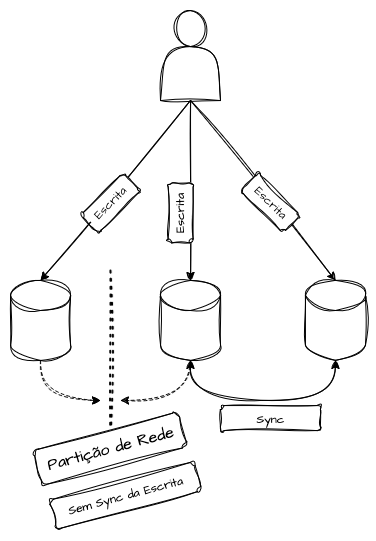

Em clusters otimizados para tolerância a partições, é comum **isolar um nó** deliberadamente para manutenção, troubleshooting ou atualização, reintegrando-o depois por meio de sincronização. Quando a comunicação é restabelecida, o banco precisa ser capaz de **replicar e resolver conflitos** entre todos os nós para retomar a operação consistente.

# As combinações do Teorema: “Escolha 2”

## CP (Consistência e Tolerância a Partições)

Na configuração **CP**, o sistema preserva consistência e tolerância a partições, **sacrificando a disponibilidade**. Diante de uma partição, os nós inconsistentes podem ser desativados — ficando indisponíveis — até que a consistência seja restabelecida.

É a escolha indicada quando a precisão dos dados é inegociável, como em sistemas financeiros, motores de cálculo de crédito e controle de estoque.

**Exemplos**
- [MongoDB](https://www.mongodb.com/)
- [Cassandra - Sob Determinadas Configurações](https://cassandra.apache.org/)
- [Couchbase](https://www.couchbase.com/)
- [Etcd](https://etcd.io/)
- [Consul](https://www.consul.io/)

## AP (Disponibilidade e Tolerância a Partições)

Na configuração **AP**, prioriza-se disponibilidade e tolerância a partições, **abrindo mão da consistência**. Durante uma partição, todos os nós seguem respondendo às requisições, mesmo que possam devolver dados desatualizados enquanto a ressincronização ocorre.

Faz sentido quando a continuidade importa mais que a exatidão constante dos dados, como em buscas de e-commerce, redes sociais e mecanismos de pesquisa.

**Exemplos**
- [CouchDB](https://couchdb.apache.org/)
- [DynamoDB](https://aws.amazon.com/dynamodb/)
- [Cassandra - Sob Determinadas Configurações](https://cassandra.apache.org/)
- [SimpleDB](https://aws.amazon.com/simpledb/)

## CA (Consistência e Disponibilidade)

Na configuração **CA**, garante-se consistência e disponibilidade, mas o sistema fica **sensível a partições** — uma falha de rede pode torná-lo totalmente inoperante. Por isso é rara em ambientes genuinamente distribuídos, que geralmente precisam lidar com partições.

Aparece em bancos centralizados, que podem ou não ser distribuídos conforme a configuração, como Redis Standalone e SQL centralizados (MySQL, PostgreSQL), comumente adotados para garantir operações ACID.

**Exemplos**
- [MySQL/MariaDB](https://www.mysql.com/)
- [PostgreSQL](https://www.postgresql.org/)
- [Oracle](https://www.oracle.com/database/)
- [SQL Server](https://www.microsoft.com/sql-server/)
- [Redis Standalone](https://redis.io/)
- [Memcached Standalone](https://memcached.org/)

# Tabela de Flavors (CAP)

A tabela abaixo classifica diferentes bancos de dados segundo as duas propriedades do CAP que cada um privilegia, servindo como referência rápida para identificar em qual canto do triângulo cada tecnologia se posiciona.

| Banco de Dados | Consistência (C) | Disponibilidade (A) | Tolerância a Partições (P) |
| :--- | :---: | :---: | :---: |
| Cassandra | ❌ | ✅ | ✅ |
| MongoDB | ✅ | ❌ | ✅ |
| Couchbase | ✅ | ❌ | ✅ |
| DynamoDB | ❌ | ✅ | ✅ |
| Redis | ✅ | ✅ | ❌ |
| MySQL/MariaDB | ✅ | ✅ | ❌ |
| PostgreSQL | ✅ | ✅ | ❌ |
| Oracle | ✅ | ✅ | ❌ |
| Etcd | ✅ | ❌ | ✅ |
| Consul | ✅ | ❌ | ✅ |
| CockroachDB | ✅ | ❌ | ✅ |
| Riak | ❌ | ✅ | ✅ |
| HBase | ✅ | ❌ | ✅ |
| Neo4j | ✅ | ✅ | ❌ |
| FoundationDB | ✅ | ❌ | ✅ |
| VoltDB | ✅ | ✅ | ❌ |
| ArangoDB | ✅ | ✅ | ❌ |
| FaunaDB | ✅ | ✅ | ❌ |
| Aerospike | ❌ | ✅ | ✅ |
| Amazon Aurora | ✅ | ✅ | ❌ |
| CouchDB | ❌ | ✅ | ✅ |
| SimpleDB | ❌ | ✅ | ✅ |

# O que mudou depois da concepção do CAP?

Em 2012, Eric Brewer publicou **"CAP Twelve Years Later: How the 'Rules' Have Changed"**, revisando sua proposta original à luz da evolução de bancos de dados, nuvens e arquiteturas de microsserviços.

O ponto principal é **desmistificar a regra do "2 de 3"**, considerada enganosa na prática. Tratar consistência e disponibilidade como estados binários ("on/off") limita as decisões de arquitetura, quando na verdade elas se comportam como **espectros** com graus variados de realização — a disponibilidade, por exemplo, pode variar de 0 a 100%, e há diversos níveis de consistência.

Outro ponto é que **partições de rede são eventos raros** em muitos workloads. Como na maior parte do tempo o sistema opera sem partições, é possível otimizar consistência e disponibilidade conjuntamente nesse período, em vez de assumir a presença constante de falhas como sugeria a leitura original.

Em síntese, o CAP continua útil para discussões iniciais de design, mas é uma simplificação: o "2 de 3" não é necessariamente exclusivo, e existem níveis intermediários de consistência e disponibilidade, como o próprio modelo BASE demonstra.

---

# Teorema PACELC

Esta seção complementa o capítulo sobre ACID, BASE e CAP, apresentando uma evolução conceitual do modelo. O **PACELC** preenche lacunas que o CAP deixa em aberto, sobretudo quanto ao comportamento do sistema **fora** dos momentos de partição.

Com as classificações AP, CA e CP do CAP já assimiladas, fica mais fácil avançar para os apêndices que o PACELC acrescenta.

# O Teorema PACELC

O **PACELC** foi proposto por **Daniel Abadi** (Universidade de Yale) em 2010. O CAP diz que, **durante uma partição**, é preciso escolher entre consistência e disponibilidade — algo valioso, mas que ignora uma pergunta importante: o que o sistema deve priorizar quando **não há** falha de rede?

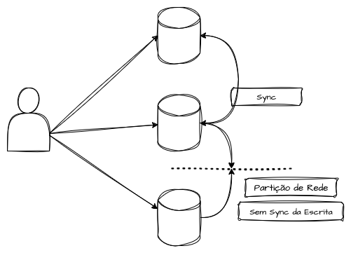

O PACELC amplia o raciocínio justamente para esse cenário sem particionamento, no qual ainda é possível operar em diferentes níveis de consistência. Ele nos leva a refletir sobre duas decisões distintas: o que priorizar quando o sistema está saudável e o que priorizar quando ocorre uma partição.

## Teorema PACELC vs Teorema CAP

O CAP cobre apenas o caso da partição (P): escolher entre Consistência (C) e Disponibilidade (A). Ele não diz nada sobre como o sistema deve se comportar em operação normal.

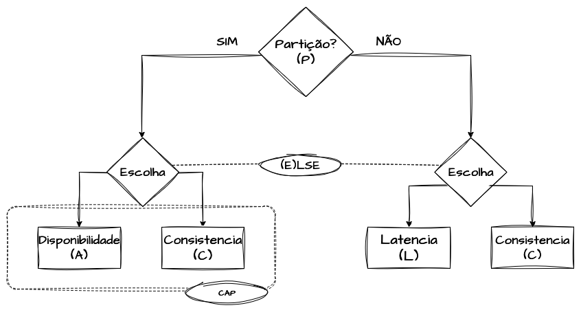

O PACELC estende essa lógica com a fórmula: **se houver Partição (P), escolha entre Availability (A) e Consistency (C); senão (Else, E), escolha entre Latency (L) e Consistency (C)**. Ou seja, mesmo sem falhas, há um trade-off: garantir consistência forte ao custo de mais latência, ou reduzir a consistência para responder mais rápido.

Esse raciocínio se aproxima da realidade de sistemas modernos com redes geograficamente distribuídas, replicação e sharding. Um banco global que exige todas as réplicas sincronizadas antes de confirmar uma escrita paga o preço da latência; se aceitar consistência eventual, responde mais rápido, mas um usuário no Brasil pode ver um dado diferente de outro na Espanha por algum tempo.

Em resumo, CAP e PACELC são **complementares**: o PACELC analisa tanto os cenários de falha quanto o comportamento em operação normal, conectando os padrões CP e AP às escolhas de Latência e Consistência fora das partições.

# Aplicações do PACELC

O PACELC virou uma forma prática de **classificar** sistemas distribuídos. O DynamoDB, por exemplo, é **PA/EL** (disponibilidade na partição, baixa latência fora dela), enquanto o Google Spanner é **PC/EC** (consistência em ambos os casos, aceitando pagar latência).

Assim como o CAP tem suas categorias, o PACELC permite classificar bancos em combinações como **PA/EL, PC/EL, PA/EC e PC/EC**, conforme os trade-offs adotados dentro e fora das partições.

## PA/EL (On Partition, Availability; Else, Latency)

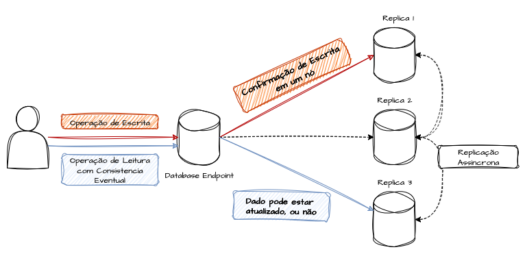

No **PA/EL**, em operação normal o sistema prioriza **latência** sobre consistência, buscando respostas rápidas mesmo que isso enfraqueça a consistência. Quando ocorre uma partição (Else), prioriza **disponibilidade** — todos os nós continuam respondendo, reforçando o modelo de consistência eventual mesmo sem réplicas plenamente sincronizadas.

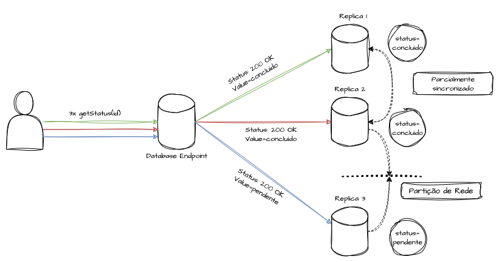

São bancos projetados para escrita de alta performance e resiliente, aceitando que usuários vejam versões ligeiramente diferentes do dado até a partição se resolver. É o caso de **DynamoDB** e **Cassandra**, usados em larga escala onde performance global e disponibilidade superam a consistência absoluta.

## PC/EL (On Partition, Consistency; Else, Latency)

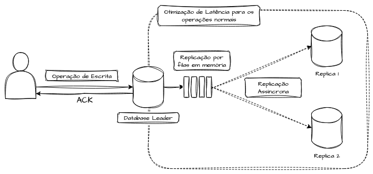

No **PC/EL**, em operação normal o sistema favorece **latência e throughput**, reduzindo o nível de consistência para manter respostas rápidas. Em caso de partição (Else), passa a priorizar **consistência**, podendo ficar indisponível até o cluster recuperar o consenso.

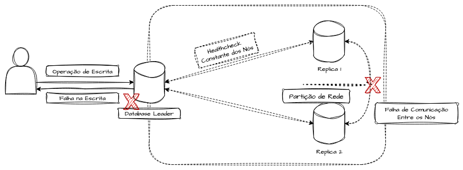

É uma escolha intermediária, típica de sistemas que não possuem resolução de conflitos confiável em grande volume e operam apenas dentro do fluxo transacional previsto. Para esses casos, é preferível ficar indisponível a manter dados que talvez nunca convirjam. Esse modelo exige **health checks** e **heartbeats** contínuos entre os nós para validar o estado antes de operar; do contrário, prefere ficar totalmente inoperante.

## PA/EC (On Partition, Availability; Else, Consistency)

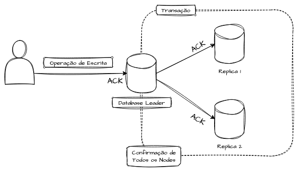

No **PA/EC**, em operação normal o sistema prioriza **consistência forte**, mantendo todas as réplicas com a mesma versão do dado. Diante de uma falha ou partição (Else), passa a priorizar **disponibilidade**, aceitando divergências temporárias entre réplicas.

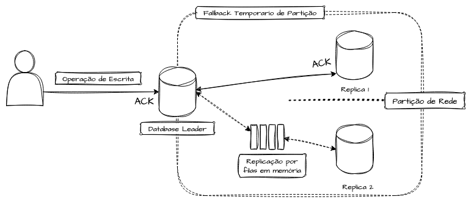

Esses sistemas costumam apoiar-se em **CRDTs** (Conflict-Free Replicated Data Types) para reconciliar atualizações concorrentes entre nós. É um modelo menos comum, presente em contextos híbridos de microsserviços onde a experiência não pode parar com falhas parciais, mas a regra de negócio exige sincronização rigorosa enquanto a rede está saudável. Em essência, a consistência eventual entra apenas como **fallback** da consistência forte.

## PC/EC (On Partition, Consistency; Else, Consistency)

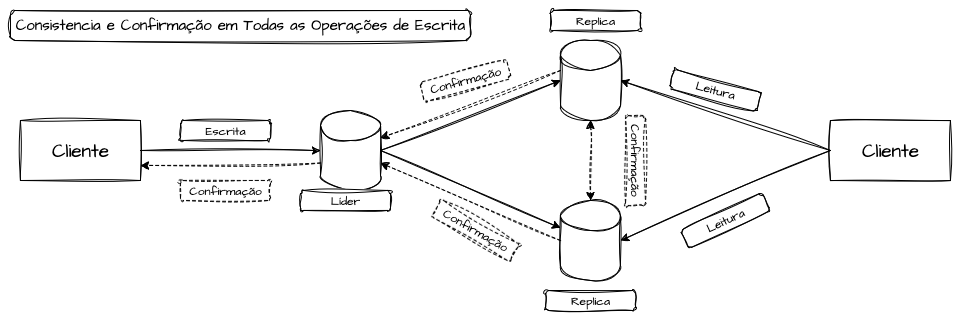

O **PC/EC** é o modelo mais conservador: prioriza **consistência tanto em operação normal quanto durante partições**, aceitando maior latência em troca de garantir a versão mais recente do dado em todos os nós. Durante uma partição, assume que é melhor falhar temporariamente do que operar com qualquer nível de inconsistência.

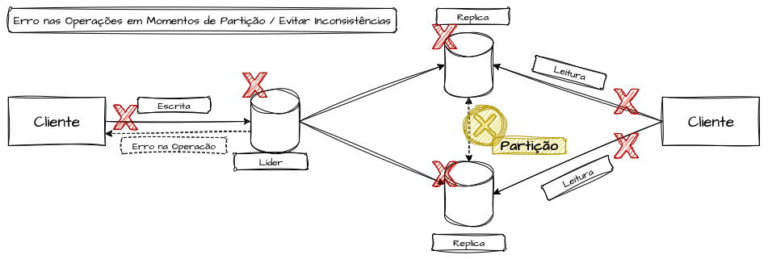

É típico de sistemas onde a precisão é a qualidade mais importante — bancos, coordenação de clusters e transações críticas, nos quais ver um dado incorreto por milissegundos pode causar grandes prejuízos. Encontra-se esse comportamento em bancos SQL tradicionais, no **etcd** e em bancos transacionais geograficamente distribuídos como o **Google Spanner**.

## Comparações do PACELC

A tabela a seguir reúne diferentes bancos distribuídos e indica como cada um se posiciona durante a partição (PAC) e fora dela (ELC), com a respectiva classificação.

| Sistema / Banco de Dados | PAC (durante partição) | ELC (sem partição) | Classificação | Observação |
| :--- | :--- | :--- | :--- | :--- |
| **Amazon DynamoDB** | **A** (disponibilidade) | **L** (baixa latência, consistência eventual por padrão) | PA/EL | Eventual consistency como default, mas suporta “strong reads” opcionais. |
| **Cassandra** | **A** (disponibilidade) | **L** (baixa latência, consistência eventual por padrão) | PA/EL | Modelo baseado no Dynamo, otimizado para disponibilidade e baixa latência global. |
| **MongoDB** | **A** (se configurado com w=1) ou **C** (com majority write concern) | **L** (eventual consistency em réplicas secundárias) | PA/EL ou PC/EL | Flexível; o trade-off depende do write concern e read concern. |
| **Google Spanner** | **C** (consistência forte global) | **C** (mesmo sem partição, prioriza consistência) | PC/EC | Usa TrueTime para garantir consistência serializável global, com custo de latência. |
| **Azure Cosmos DB** | **A** (disponibilidade) | **L/C** (configurável: eventual, bounded, session, consistent prefix, strong) | PA/ELC | Oferece 5 níveis de consistência configuráveis. |
| **Apache Kafka** | **A** (disponibilidade) | **L** (prioriza throughput e baixa latência) | PA/EL | Garantias de consistência são fracas; foco em disponibilidade e velocidade. |
| **Etcd** | **C** (consistência forte) | **C** (consistência forte) | PC/EC | Voltado para consistência forte, usado em sistemas críticos de coordenação. |
| **ZooKeeper** | **C** (consistência forte) | **C** (consistência forte) | PC/EC | Voltado para consistência forte, usado em sistemas críticos de coordenação. |
| **CockroachDB** | **C** (prioriza consistência em partições) | **C** (consistência forte via consenso Raft) | PC/EC | Inspirado no Spanner, mantém consistência global em troca de latência mais alta. |
| **Redis em Cluster Mode** | **A** (disponibilidade, pode perder dados em falhas) | **L** (baixa latência com replicação assíncrona) | PA/EL | Focado em velocidade; consistência forte não é garantida em partições ou failover. |
| **Amazon RDS (Multi-AZ)** | **C** (replicação síncrona entre zonas, prioriza consistência) | **C** (dados consistentes entre réplicas antes de confirmar) | PC/EC | Designado para workloads transacionais, garantindo consistência e durabilidade. |

---
# Referências

- [Seth Gilbert and Nancy Lynch. 2002. Brewer’s conjecture and the feasibility of consistent, available, partition-tolerant web services. SIGACT News 33, 2 (June 2002)](https://dl.acm.org/doi/10.1145/564585.564601)

- [Theo Haerder and Andreas Reuter. 1983. Principles of transaction-oriented database recovery. ACM Comput. Surv. 15, 4 (December 1983), 287–317](https://doi.org/10.1145/289.291)

- [Eric Brewer. 2012. CAP Twelve Years Later: How the “Rules” Have Changed](https://www.infoq.com/articles/cap-twelve-years-later-how-the-rules-have-changed/)

- [Problems with CAP, and Yahoo’s little known NoSQL system](http://dbmsmusings.blogspot.com/2010/04/problems-with-cap-and-yahoos-little.html)

- [Basically Available, Soft State, Eventual Consistency](https://www.devx.com/terms/basically-available-soft-state-eventual-consistency/)

- [O que é o Teorema CAP?](https://www.ibm.com/br-pt/topics/cap-theorem)

- [Breve Introdução ao Teorema CAP](https://medium.com/@ruan.victor/breve-introdu%C3%A7%C3%A3o-ao-teorema-cap-eb8bb0a0d7a4)

- [Teorema CAP](https://docs.aws.amazon.com/pt_br/whitepapers/latest/availability-and-beyond-improving-resilience/cap-theorem.html)

- [Princípios de funcionamento ACID vs BASE nos bancos de dados](https://edge.uol/en/insights/article/principios-de-funcionamento-acid-vs-base-nos-bancos-de-dados/)

- [Please stop calling databases CP or AP](https://martin.kleppmann.com/2015/05/11/please-stop-calling-databases-cp-or-ap.html)

- [Martin Kleppmann. 2015. A Critique of the CAP Theorem](https://arxiv.org/abs/1509.05393)

- [Hermitage: Testing the “I” in ACID - Martin Kleppmann](https://martin.kleppmann.com/2014/11/25/hermitage-testing-the-i-in-acid.html)

- [Consistency Tradeoffs in Modern Distributed Database System Design](https://www.cs.umd.edu/~abadi/papers/abadi-pacelc.pdf)

- [PACELC design principle](https://en.wikipedia.org/wiki/PACELC_design_principle)

- [PACELC: A extensão do Teorema CAP](https://emergingcode.substack.com/p/pacelc-a-extensao-do-teorema-cap)

- [PACELC Theorem](https://www.scylladb.com/glossary/pacelc-theorem/)

- [PACELC Theorem Explained: Distributed Systems Series](https://medium.com/distributed-systems-series/pacelc-theorem-explained-distributed-systems-series-9c509febb8f8)

- [System Design Interview Basics: CAP vs. PACELC](https://www.designgurus.io/blog/system-design-interview-basics-cap-vs-pacelc)

- [PACELC Theorem](https://www.geeksforgeeks.org/operating-systems/pacelc-theorem/)

- [PACELC Theorem & Distributed Databases](https://ritesh-kapoor.medium.com/pacelc-theorem-and-distributed-databases-301d971deda3)

- [Understanding Eventual Consistency in DynamoDB](https://www.alexdebrie.com/posts/dynamodb-eventual-consistency/)
