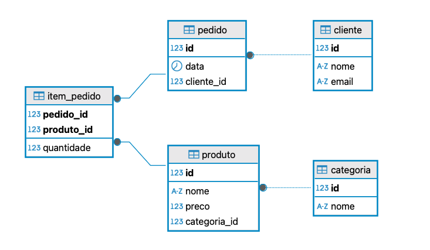
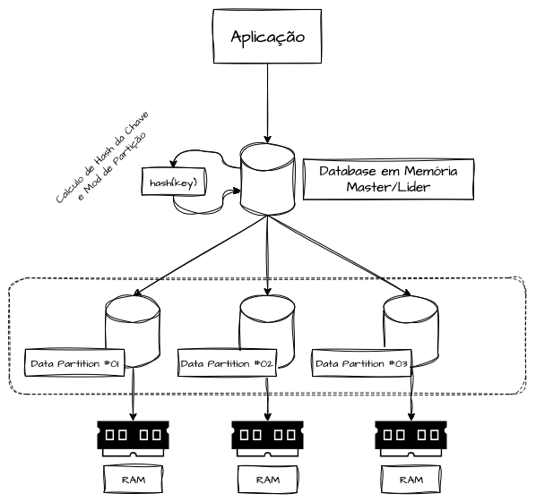
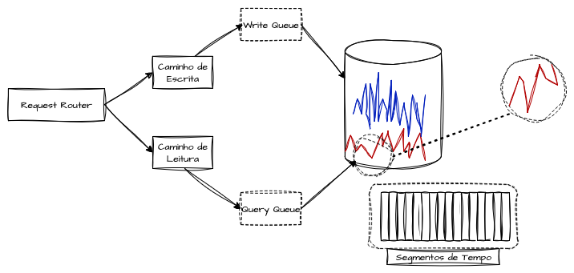
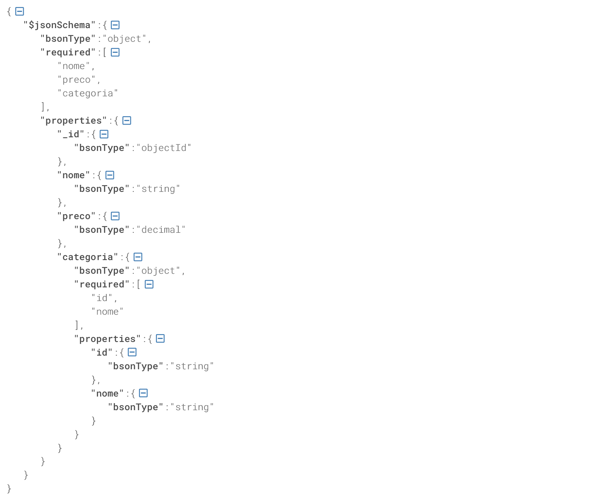
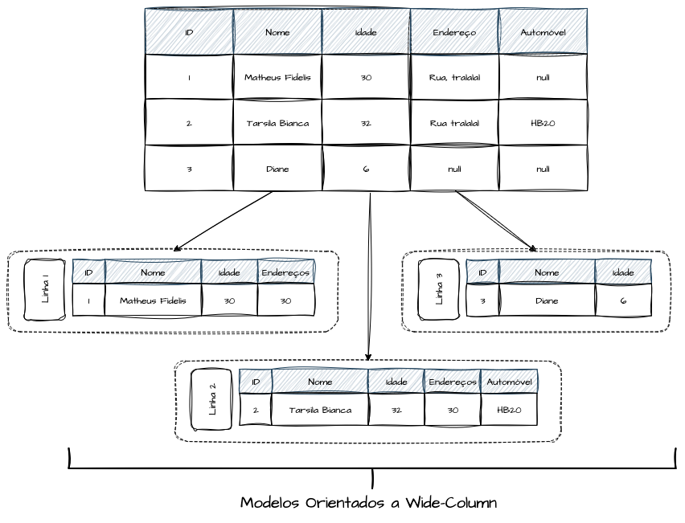
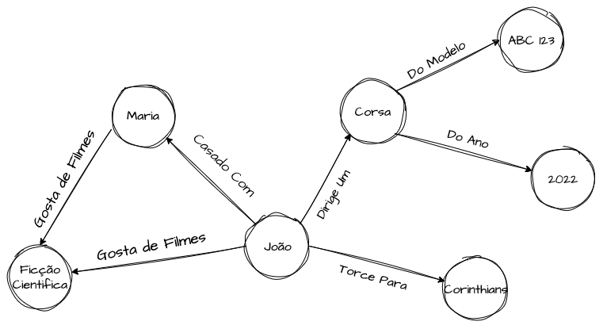
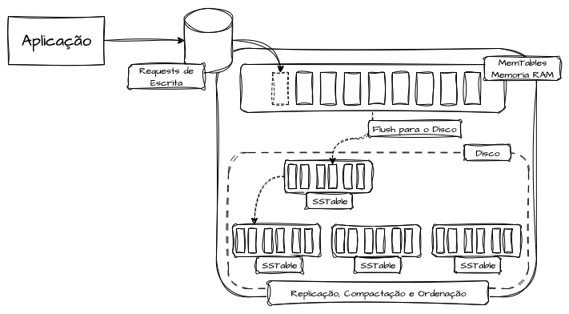
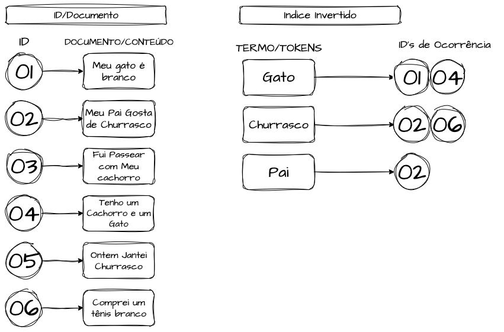
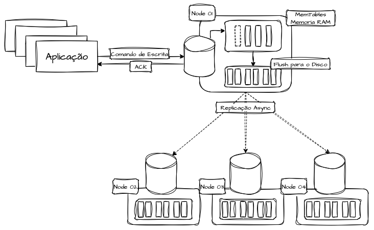
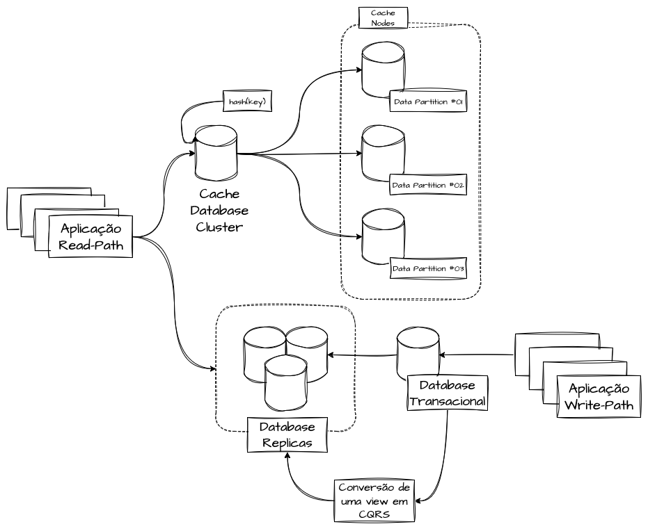

- [Databases, Modelos de Dados e Indexação](#databases-modelos-de-dados-e-indexação)
- [Definindo um Banco de Dados](#definindo-um-banco-de-dados)
- [Tipos de Bancos de Dados](#tipos-de-bancos-de-dados)
  - [Bancos de Dados Relacionais SQL](#bancos-de-dados-relacionais-sql)
  - [Banco de Dados Não-Relacionais NoSQL](#banco-de-dados-não-relacionais-nosql)
  - [Bancos de Dados NewSQL](#bancos-de-dados-newsql)
  - [Bancos de Dados em Memória](#bancos-de-dados-em-memória)
  - [Time-Series Databases](#time-series-databases)
- [Níveis de Consistência](#níveis-de-consistência)
  - [Consistência Forte](#consistência-forte)
  - [Consistência Eventual](#consistência-eventual)
- [Modelos de Dados](#modelos-de-dados)
  - [Modelos de Tuplas (Row‑Oriented)](#modelos-de-tuplas-roworiented)
  - [Modelos de Documentos](#modelos-de-documentos)
  - [Modelos Colunares (Column-Oriented)](#modelos-colunares-column-oriented)
  - [Modelos de Coluna Larga (Wide-Column)](#modelos-de-coluna-larga-wide-column)
  - [Modelos Key‑Value (Chave‑Valor)](#modelos-keyvalue-chavevalor)
  - [Modelos Baseados em Grafos](#modelos-baseados-em-grafos)
- [Armazenamento e Indexação](#armazenamento-e-indexação)
  - [Page Size (Tamanho da Página)](#page-size-tamanho-da-página)
  - [Indexação Colunar](#indexação-colunar)
  - [LSM-Trees (Log-Structured Merge-Tree)](#lsm-trees-log-structured-merge-tree)
  - [Indexação B‑Tree (Árvores B)](#indexação-btree-árvores-b)
  - [Indexação por Hashing](#indexação-por-hashing)
  - [Índices Invertidos](#índices-invertidos)
- [Arquitetura](#arquitetura)
  - [Cenários Transacionais](#cenários-transacionais)
  - [Cenários de Write‑Intensive](#cenários-de-writeintensive)
  - [Cenários de Read‑Intensive](#cenários-de-readintensive)
- [Referências](#referências)

> **Nota:** Este documento é um material de estudo baseado no artigo original **"Databases, Modelos de Dados e Indexação"**, de **Matheus Fidelis**, publicado em [fidelissauro.dev/databases](https://fidelissauro.dev/databases/). As ilustrações pertencem ao autor original. Recomenda-se a leitura do artigo completo na fonte.

---

# Databases, Modelos de Dados e Indexação

Este capítulo apresenta as principais implementações de bancos de dados e suas diferenças práticas quando aplicadas a sistemas em produção, com o objetivo de tornar essas distinções úteis para decisões de arquitetura. O tema é vasto e quase inevitavelmente leva ao uso de exemplos nominais de tecnologias para ilustrar cada implementação. As anotações complementam discussões anteriores sobre ACID, BASE e o Teorema CAP, e exploram diversos modelos de dados e técnicas de indexação que aparecem de forma recorrente entre engines distintas.

# Definindo um Banco de Dados

Em sua essência, um banco de dados é um mecanismo para organizar informações dentro de uma estrutura previamente definida, de modo que possam ser armazenadas, gerenciadas e acessadas para leitura e escrita por meio de um padrão de consulta. Ele atua como uma camada intermediária entre o cliente e o dado: o desenvolvedor consulta e manipula informações sem precisar lidar diretamente com alocação em disco, indexação ou algoritmos de distribuição. A persistência pode ocorrer em storages duráveis, temporários ou uma combinação dos dois, dependendo da implementação.

Em ambientes distribuídos, o papel do banco ganha complexidade adicional, especialmente quando entram em jogo replicação geográfica, baixa latência e a decisão entre consistência forte e consistência eventual. Essas escolhas afetam diretamente os níveis de consistência, disponibilidade e desempenho que o sistema consegue oferecer.

# Tipos de Bancos de Dados

A escolha de um banco de dados deve ser tratada como uma análise das features de cada opção, avaliando como cada característica contribui ou prejudica os requisitos de desempenho, consistência e custo do produto. A ideia é evitar adotar uma engine repleta de recursos que nunca serão usados e que, ainda assim, não atendem ao que o sistema realmente precisa. As seções seguintes detalham, em nível arquitetural, as principais categorias disponíveis.

## Bancos de Dados Relacionais SQL

Os bancos relacionais (SQL) derivam do modelo proposto por Edgar F. Codd em 1970 e organizam os dados em tabelas formadas por tuplas (linhas) e atributos (colunas). Seu grande diferencial é o schema rígido: tipos de dados, restrições de integridade, identificadores únicos e regras de relacionamento são definidos por contrato. Esses relacionamentos declarativos entre tabelas são amplamente usados pela engenharia de software para modelar entidades e agregados de um domínio. Normalmente esses bancos oferecem garantias ACID — atomicidade, consistência, isolamento e durabilidade.

Um exemplo clássico é um sistema de pedidos e estoque. Clientes, pedidos, itens, produtos e categorias vivem em tabelas separadas, conectadas por chaves estrangeiras. A integridade referencial impede, por exemplo, que um pedido aponte para um cliente inexistente ou que um item referencie um produto que não existe. Relações muitos-para-muitos, como a de pedidos e produtos, são resolvidas por tabelas associativas (item de pedido). Esse desenho garante consistência e facilita relatórios analíticos, como total gasto por cliente ou itens mais vendidos em um período.

## Banco de Dados Não-Relacionais NoSQL

Os bancos NoSQL (Not Only SQL) propõem uma alternativa mais flexível ao rigor dos modelos relacionais, trocando parte da consistência e da integridade por escalabilidade. Em vez de tabelas e linhas com relacionamentos diretos, adotam formatos variados e schemas flexíveis, geralmente com consistência eventual, em favor de melhor desempenho de leitura e escrita, escalabilidade horizontal e distribuição.

É nessa categoria que encontramos a maior diversidade de formatos — chave-valor, JSON, BSON, grafos, entre outros. O foco é evitar joins custosos privilegiando estruturas simples e mutáveis. Esse modelo tende a aumentar a performance, mas transfere para a aplicação a responsabilidade de garantir tipos e contratos, abrindo espaço para inconsistências.

Retomando o exemplo de pedidos, um banco orientado a documentos pode representar toda a hierarquia (cliente, pedidos, itens, produtos e categorias) de forma aninhada dentro de um único documento por cliente. Isso elimina a necessidade de múltiplas coleções e joins: ao ler um documento, todos os dados relacionados já vêm embutidos.

## Bancos de Dados NewSQL

O maior desafio dos sistemas distribuídos é lidar com os trade-offs da camada de dados. Os bancos NewSQL nascem da tentativa de conciliar os dois mundos: oferecer a confiabilidade transacional e relacional dos modelos SQL e, ao mesmo tempo, agregar a escalabilidade horizontal e o alto throughput típicos do NoSQL.

Na prática, essas engines são profundamente voltadas para cenários distribuídos. Executam sharding e replicação de forma transparente e síncrona para preservar garantias ACID, apoiando-se em protocolos de consenso distribuído para fazer isso da maneira mais performática possível.

## Bancos de Dados em Memória

Os bancos in-memory são especializados em manter seus dados diretamente na RAM do servidor, em vez de persistir de forma durável em discos. A volatilidade é uma característica central desse modelo.

A motivação principal é reduzir latência: uma consulta em memória volátil pode ser respondida em nanossegundos, enquanto um acesso a disco fica na casa dos milissegundos — diferença que se agrava sob uso intensivo de I/O.

Os modelos de dados aqui costumam ser bastante simples, e o uso ideal gira em torno de chave-valor combinado com bancos duráveis. Esse tipo de banco é a base de sistemas de cache, oferecendo uma camada de acesso rápido para dados caros de calcular e que mudam pouco.

Por trabalharem com estruturas simples e dados que podem ser reconstruídos a partir da origem, esses bancos facilitam a escalabilidade horizontal. Nós podem ser adicionados ou removidos com algoritmos de hashing consistente: ao escrever, calcula-se o hash da chave para definir o nó responsável; ao ler, o mesmo cálculo direciona a requisição. O trade-off é assumir a não-durabilidade — reiniciar o serviço pode apagar tudo — e conviver com um custo de escala que tende a ser financeiramente alto.

## Time-Series Databases

Os Time-Series Databases (TSDBs) são especializados em séries temporais, com indexação baseada no tempo. Cada registro funciona como um carimbo temporal preciso de uma métrica. O armazenamento é tipicamente append-only, gravando cada ponto de forma sequencial e segmentada. São muito usados em observabilidade e monitoramento, acompanhando métricas ao longo de horas, dias ou anos, com alta capacidade de ingestão e operações matemáticas eficientes.

Otimizados para ingerir e consultar grandes volumes sequenciais, esses bancos sempre carregam trade-offs entre relacionamento, consistência, disponibilidade e confiabilidade. Sob alta carga, é comum aplicarem backpressure e enfileiramento. Não há garantia atômica de disponibilidade do dado após a escrita nem de exatidão completa nas consultas, o que os torna inadequados para cenários transacionais e ideais para análises.

Esse tipo de engine também costuma incluir mecanismos inteligentes de expurgo de dados expirados, gerenciando o storage de forma mais eficiente ao longo do tempo.

# Níveis de Consistência

Em sistemas distribuídos, o nível de consistência é um dos fatores mais decisivos na escolha arquitetural. Optar entre consistência forte e eventual pode elevar a escalabilidade e a confiabilidade, mas também pode introduzir problemas e afetar a experiência do usuário se os trade-offs forem ignorados. As subseções a seguir esclarecem as diferenças entre os dois extremos.

## Consistência Forte

A consistência forte — também chamada de linearizabilidade ou consistência sequencial na literatura — representa o nível mais agressivamente transacional. Em uma analogia de termômetro, seria o ponto mais extremo da escala.

Na prática, independentemente do número de réplicas, todas retornam sempre o mesmo dado. Toda leitura reflete o valor mais recente de qualquer escrita já confirmada. Uma vez que um commit é confirmado, qualquer leitura posterior — mesmo em outro nó ou região — refletirá esse valor, até que nova transação o altere. O banco só transita de um estado consistente para outro estado consistente.

Esses bancos costumam se posicionar no modelo CA do Teorema CAP, caso dos SQL tradicionais. Para atingir esse comportamento, empregam protocolos de consenso como Paxos ou Raft, ou commits síncronos entre réplicas, exigindo o acordo de um quórum mínimo antes de confirmar cada escrita — o que aumenta latência e consumo de I/O em troca de confiabilidade.

## Consistência Eventual

A consistência eventual descreve sistemas que, independentemente do volume de escritas, convergem para um estado consistente em algum momento, ainda que por um breve intervalo réplicas distintas possam retornar versões diferentes do dado. Para viabilizar isso, a replicação é assíncrona e não bloqueia escritas.

Quando ocorre uma escrita, apenas um nó (ou um pequeno quórum) precisa confirmá-la; o restante é propagado por logs ou outro mecanismo. Se uma leitura atingir um nó que ainda não recebeu a escrita, ela pode devolver dados desatualizados ou ausentes.

Esse modelo sacrifica consistência para ganhar disponibilidade e desempenho, já que as confirmações são locais e não aguardam outros nós. Mesmo diante de partições de rede, leituras e escritas seguem operando em réplicas isoladas.

O custo é a necessidade de tratar conflitos, seja na engine, seja na aplicação. Estratégias comuns incluem o last-write-wins (resolução por timestamp) e os CRDTs, que aplicam algoritmos mais sofisticados de sincronização. De forma geral, tudo que não é consistência forte recai, em algum grau, em consistência eventual — inclusive um banco ACID cujo quórum de commit aceita confirmação parcial das réplicas.

# Modelos de Dados

Os modelos de dados definem como as informações são estruturadas, armazenadas e acessadas dentro da engine. Essa escolha influencia diretamente desempenho, consistência e escalabilidade. Cada modelo é otimizado para cenários específicos, e compreender seu funcionamento ajuda a direcionar boas decisões de engenharia.

## Modelos de Tuplas (Row‑Oriented)

Os modelos orientados a linha são os mais tradicionais do mercado. Cada tupla, com seus atributos identificados por colunas, é gravada de forma contígua e completa em disco ou memória, mantendo todos os campos em sequência. Esse formato favorece operações ponto a ponto sobre um registro inteiro — leitura, escrita, atualização e deleção — sendo ideal para cenários transacionais que manipulam registros completos com frequência.

Sistemas baseados em linha são otimizados para granularidade com baixa latência e fazem uso intensivo de caches de páginas. Como todos os campos de uma linha ficam no mesmo bloco de disco, recuperar o registro inteiro é uma operação eficiente, trazendo todos os valores de uma só vez.

## Modelos de Documentos

Bancos orientados a documentos tratam cada registro como uma entidade autônoma, normalmente em formato livre, sem restrições rígidas de campos, geralmente em JSON ou BSON. Essa flexibilidade facilita a evolução do schema e dos contratos sob a ótica da aplicação, dispensando migrações complexas.

Costumam ser usados para agrupar dados relacionados em um único objeto e para oferecer indexação invertida ou full-text search, permitindo buscar padrões em todo o documento sem se prender a um campo específico. Suportam filtros sobre atributos aninhados, agregações e pipelines de transformação, com indexação flexível em campos internos.

Entre os usos mais comuns estão catálogos de produtos, históricos de clientes ou pacientes, agregadores de logs e armazenamento de crawlers. É frequente que esses bancos atuem como camada de consulta secundária após transformações de dados, sendo uma escolha natural para implementações de CQRS.

## Modelos Colunares (Column-Oriented)

Os modelos colunares são inspirados em sistemas de Big Data e Data Warehouse. Diferente do modelo de tuplas, onde os dados ficam organizados por linha, aqui cada coluna é armazenada de forma contígua. Em uma tabela tradicional, todos os registros compartilham o mesmo conjunto de colunas, e adicionar um atributo implica inseri-lo em toda a tabela com valores nulos ou default.

Ao manter cada coluna contígua em disco ou memória, esse modelo permite que sistemas analíticos processem grandes volumes de dados em repouso e executem operações complexas sobre atributos específicos de forma performática — como médias, desvios-padrão, segmentações de público ou fechamentos contábeis — lendo apenas as colunas necessárias.

## Modelos de Coluna Larga (Wide-Column)

Os bancos wide-column preservam o conceito de linhas, mas cada registro pode ter seu próprio conjunto de colunas.

Os dados são organizados em famílias de colunas agrupadas em torno de chaves de linha. Uma linha pode reunir diferentes colunas em famílias distintas; ao consultar explicitamente uma família, o sistema acessa apenas as linhas correspondentes. Isso é eficiente para dados dispersos, séries temporais, data warehouses e data lakes desestruturados.

Essas engines são desenhadas para replicação e sharding distribuídos, escalando a milhares de nós e reduzindo pontos únicos de falha, com schemas altamente flexíveis. O preço é a consistência eventual, somada a transações atômicas limitadas e joins restritos entre tabelas e famílias.

## Modelos Key‑Value (Chave‑Valor)

Os bancos chave-valor são provavelmente o tipo mais simples de NoSQL. Armazenam pares formados por uma chave, que funciona como identificador único, e um valor, que pode assumir diversos formatos não estruturados — strings, números, booleanos, JSON ou blobs complexos.

Os exemplos mais conhecidos são engines de cache como Redis, Valkey e Memcached, mas o padrão também aparece em bancos como MongoDB, DynamoDB e Elasticsearch quando devidamente modelados.

Sua performance vem da facilidade de indexação e recuperação: o acesso ocorre diretamente pela chave, já conhecida pelo cliente. Isso favorece replicação e distribuição para suportar grandes volumes, além de simplificar o acesso, geralmente realizado por protocolos bem estabelecidos via TCP/IP ou interfaces RESTful, evitando complexidade desnecessária.

## Modelos Baseados em Grafos

Os bancos de grafos são construídos sobre estruturas em que o relacionamento entre entidades é tão importante quanto o próprio dado.

Enquanto no modelo SQL os relacionamentos surgem de chaves estrangeiras e JOINs no momento da consulta, os bancos de grafos tratam nós (entidades) e arestas (relacionamentos) como cidadãos de primeira classe. Os dados ficam em propriedades chave-valor associadas aos vértices, e as arestas conectam esses vértices. Isso permite responder de forma performática a perguntas relacionais complexas — como "amigos de amigos que moram na mesma cidade e trabalharam na mesma empresa" — sem joins custosos entre múltiplas tabelas.

Esses bancos são aplicados em sistemas de recomendação baseados em comportamento, análise de redes sociais, modelagem de ameaças, detecção de fraudes e estudos de cadeias logísticas. As consultas precisam considerar o grau e a complexidade dos vértices, a seletividade dos padrões e a cardinalidade dos valores, de modo a minimizar leituras aleatórias em disco.

# Armazenamento e Indexação

A forma como a engine realiza armazenamento e indexação impacta diretamente o desempenho e a flexibilidade das operações de escrita, leitura e consulta. Esta seção descreve as principais técnicas encontradas no mercado e seus trade-offs.

Sem indexação adequada, o banco precisaria escanear toda a tabela ou coleção para localizar um dado — operação lenta em grandes volumes e incompatível com uma escalabilidade saudável. Os conceitos a seguir são recorrentes entre diferentes implementações e ajudam a compreender essas operações.

## Page Size (Tamanho da Página)

O armazenamento em páginas organiza os dados em blocos de tamanho fixo e configurável. Essas páginas são usadas por bancos orientados a linha — a maioria dos relacionais e alguns NoSQL — que guardam chunks com múltiplas tuplas em cada página. Tamanhos comuns são 4 KB, 8 KB ou 16 KB, e as páginas também carregam metadados para controle de relacionamentos e indexação.

O principal trade-off está justamente no tamanho da página. Páginas maiores reduzem o número de operações de I/O em leituras de grandes volumes ou de objetos fisicamente próximos, otimizando a leitura sequencial; em contrapartida, encarecem consultas pontuais, em que a página inteira é lida para recuperar poucos registros. Páginas menores fazem o oposto: minimizam leitura irrelevante em consultas pontuais, mas exigem mais operações de I/O em leituras extensas.

Esse conceito aparece em diversas engines SQL e NoSQL, combinado com outros métodos de indexação. Exemplos notáveis incluem MySQL (InnoDB), MariaDB (InnoDB), PostgreSQL e SQL Server.

## Indexação Colunar

A indexação colunar define padrões em que cada coluna é gravada em um segmento contíguo do sistema de arquivos. Por mais contraintuitivo que pareça em termos de I/O, isso permite consultas específicas no nível de atributo, recuperando apenas os campos solicitados. O resultado é uma redução considerável de I/O em buscas e processos analíticos, além de facilitar operações matemáticas diretamente nas consultas.

Outro benefício importante é a compressão. Ao agrupar dados homogêneos de uma mesma coluna, com pouca diversidade ou muitos valores repetidos, o formato colunar favorece algoritmos de compressão muito eficientes, como a compressão por dicionário. Isso economiza espaço e melhora ainda mais o desempenho de I/O.

Engines voltadas a analytics, big data e data warehouses — como Amazon Redshift, Google BigQuery, MemSQL e SQL Server em modo Columnstore Index — adotam essa arquitetura para alcançar alta performance em consultas analíticas complexas.

## LSM-Trees (Log-Structured Merge-Tree)

Os Log-Structured Systems, frequentemente implementados via LSM-Tree, gravam os dados primeiro em tabelas em memória (memtables) e depois os exportam para arquivos imutáveis em disco (sstables), num modelo append-only.

O append-only oferece excelente performance de escrita e baixa latência de confirmação, pois as operações são sequenciais e evitam acessos aleatórios em disco. Não há atualização in-place: novas versões do dado entram como novos registros, e deleções são feitas por meio de um marcador especial chamado tombstone. A remoção física ocorre depois, durante a compactação (merge) dos sstables.

Esse comportamento é ideal para sistemas que precisam de transações sequenciais e imutáveis voltadas à auditoria e rastreabilidade, já que versões anteriores podem ser recuperadas. Aplica-se bem a ledger tables, livros-caixa, registros de auditoria e rastreamento de operações financeiras. Engines como BigTable, DynamoDB, Apache Cassandra, InfluxDB e ScyllaDB usam LSM-Trees para priorizar alta performance de escrita e escalabilidade horizontal.

Na prática, escritas são registradas sequencialmente em memtables e, periodicamente, descarregadas em sstables imutáveis sem bloquear leituras ou escritas, sustentando alto throughput. A compactação consolida múltiplas versões, elimina tombstones e reduz fragmentação. Nas leituras, a engine consulta primeiro as memtables mais recentes e depois percorre os sstables em ordem, combinando resultados para devolver a versão mais atual — equilibrando alta performance de escrita com leituras consistentes, ao custo de um merge contínuo em segundo plano.

## Indexação B‑Tree (Árvores B)

A B-Tree é uma estrutura autobalanceada projetada para gerenciar grandes volumes de informação em storage. Trata-se de uma árvore multi-way em que cada nó pode conter várias chaves e múltiplos ponteiros. Isso a torna mais larga e menos profunda do que árvores binárias, otimizando o acesso a dados em disco ao reduzir a profundidade da travessia.

Os dados ficam ordenados dentro dos nós, permitindo buscas, escritas, atualizações e deleções em tempo logarítmico. O armazenamento é construído para que cada nó caiba em um bloco de disco, minimizando operações de I/O — normalmente o maior custo em bancos de grande porte.

Ao buscar uma chave, o sistema carrega apenas os poucos blocos necessários para percorrer o caminho da raiz até o nó que contém a chave ou o ponteiro para o dado. Assim, mesmo em tabelas enormes, as buscas permanecem rápidas e com poucas operações.

## Indexação por Hashing

A indexação por hashing localiza valores por meio de correspondências exatas (exact-matches). Diferente das B-Trees, otimizadas para range queries e saltos logarítmicos, o hashing é projetado para buscas diretas e praticamente instantâneas.

Três conceitos sustentam essa técnica: funções hash, tabelas hash e buckets. A função hash converte de forma determinística uma chave em um endereço numérico — aplicar `hash("fidelis")` deve produzir sempre o mesmo resultado, indicando o bucket onde o dado será guardado ou procurado.

Quando há colisões, uma estratégia comum é o encadeamento separado: o bucket aponta para uma estrutura secundária, geralmente uma lista encadeada (ou uma árvore balanceada em cadeias longas). Se várias chaves resultam no mesmo bucket, seus valores são armazenados nessa lista, adicionados sequencialmente ao final (ou em ordem, se a lista for mantida ordenada).

A recuperação segue a mesma lógica: aplica-se a função hash à chave, chega-se diretamente ao bucket correto e percorre-se a pequena lista local para encontrar o valor. Isso permite recuperação quase instantânea, sem múltiplas leituras em disco.

## Índices Invertidos

Os Índices Invertidos são estruturas que permitem encontrar documentos completos a partir de termos de busca específicos, viabilizando full-text search em grandes volumes. Ao contrário das estruturas que mapeiam um documento para um valor, o índice invertido faz o caminho oposto: mapeia termos, palavras ou tokens para os documentos onde aparecem. A técnica é típica de bancos orientados a documentos, como Elasticsearch e Apache Solr, mas também existe em relacionais com suporte a full-text search, como PostgreSQL, SQL Server e Oracle.

Esse modelo facilita enormemente engines de busca sobre dados desestruturados ou semiestruturados — catálogos, produtos de e-commerce, contratos jurídicos e logs. Em vez de escanear todos os atributos de todas as linhas (algo lento e custoso), o índice invertido funciona como o catálogo de uma biblioteca: aponta diretamente para os documentos que contêm o termo buscado.

Em uma loja online, ao pesquisar "geladeira verde 2 portas", o índice invertido localiza rapidamente os produtos cujos campos indexados contenham esses termos, independentemente de sua ordem ou de em quais atributos aparecem. A construção desse índice envolve uma pipeline executada no momento da gravação: pré-processamento (normalização do texto), tokenização (divisão em tokens) e a criação do índice que associa cada token aos documentos correspondentes.

# Arquitetura

A escolha do banco de dados reflete diretamente a arquitetura do sistema. Em ambientes distribuídos, essa decisão impacta desempenho, disponibilidade, escalabilidade e consistência — de uma parte ou do todo. Selecionar a tecnologia de persistência correta exige considerar requisitos funcionais e não funcionais, pois uma escolha equivocada pode gerar problemas sérios de performance e confiabilidade. As seções a seguir listam os cenários mais comuns e sugestões iniciais para discussões de arquitetura.

## Cenários Transacionais

Cenários transacionais envolvem duas ou mais operações que precisam ser concluídas integralmente para que a transação tenha sucesso. Cada operação funciona como um contrato: ou se conclui por completo, ou é totalmente revertida, mantendo o estado do domínio sempre válido. Esses cenários demandam consistência forte, permitindo ler imediatamente a última escrita.

São ideais para funcionalidades críticas, como atualização de saldo ou ajuste de estoque após uma compra. Exigem atomicidade e garantias ACID, motivo pelo qual os bancos relacionais — que oferecem esse comportamento por padrão — são as implementações mais comuns. Costumam ser a fonte mais confiável para eventos de negócio, como criação de pedido ou confirmação de pagamento.

A diretriz aqui não é velocidade ou volume, mas integridade e consistência inquestionáveis — frequentemente combinadas com camadas de cache (chave-valor) ou CQRS para absorver leitura intensiva sem comprometer a golden source transacional. A estratégia de indexação mais comum é a B-Tree, que acelera buscas por chave primária e índices secundários.

O preço da atomicidade é maior latência de escrita, sobretudo em ambientes distribuídos: quanto mais réplicas, maior o tempo de commit, já que o dado precisa ser confirmado pelo quórum. Bancos SQL clássicos escalam verticalmente sem afetar a latência de commit, mas exigem hardware caro; iniciativas NewSQL escalam horizontalmente, ao custo de protocolos de consenso (Raft/Paxos) que adicionam latência e consumo de rede e CPU.

## Cenários de Write‑Intensive

Cenários write-intensive são aqueles em que a taxa de escrita supera consideravelmente a de leitura. São aplicações que precisam ingerir um fluxo contínuo e massivo de dados sem perder informação, mesmo abrindo mão de consistência forte e convivendo com réplicas temporariamente desatualizadas.

Exemplos incluem processamentos assíncronos, agregadores de logs, captação de dados de IoT e feeds de redes sociais. Para sustentar alta escrita, a arquitetura costuma adotar NoSQL projetado para escalabilidade horizontal, com modelos append-only (LSM-Trees) e replicação assíncrona.

Ao contrário das B-Trees, que podem exigir I/O custoso em escritas e atualizações, as LSM-Trees transformam cada escrita em uma operação sequencial de append, armazenando primeiro em memória e depois em disco, sem bloquear a resposta até a confirmação em todos os nós. Isso favorece a consistência eventual, já que o sistema não aguarda a replicação completa antes de responder. Engines como DynamoDB, Cassandra e ScyllaDB se destacam aqui, e implementações on-premises permitem ajustar o quórum para equilibrar latência, disponibilidade e consistência.

## Cenários de Read‑Intensive

Cenários read-intensive são o oposto: ambientes em que as leituras predominam sobre as escritas. O objetivo é maximizar o throughput de consulta e minimizar a latência de leitura. Exemplos típicos são feeds de redes sociais, catálogos de produtos, listagens de usuários e consultas de endereços.

A solução combina diversas técnicas. Réplicas de leitura garantem escalabilidade horizontal, distribuindo a carga de consulta. As otimizações mais comuns unem um banco primário consistente (PostgreSQL ou MySQL) a réplicas de leitura e camadas de cache (Redis, Memcached). Também é possível aplicar CQRS, capturando dados em um caminho otimizado para escrita e convertendo-os em modelos otimizados para leitura.

# Referências

- [A Relational Model of Data for Large Shared Data Banks, 1970 - E. F. CODD - IBM Research Laboratory, San Jose, California](https://www.seas.upenn.edu/~zives/03f/cis550/codd.pdf)

- [Edgar F. Codd](https://dblp.org/pid/c/EFCodd.html)

- [Banco de dados NoSQL, SQL e NewSQL: diferenças e vantagens](https://blog.geekhunter.com.br/banco-de-dados-nosql/)

- [SQL, NoSQL ou New SQL?](https://medium.com/@habbema/sql-no-ou-new-sql-b8059921cd5b)

- [SQL vs NO SQL vs NEW SQL](https://www.geeksforgeeks.org/dbms/sql-vs-no-sql-vs-new-sql/)

- [NoSQL vs NewSQL vs Distributed SQL: A Comprehensive Comparison](https://dev.to/ankitmalikg/nosql-vs-newsql-vs-distributed-sql-a-comprehensive-comparison-lm7)

- [What is NewSQL?](https://www.dremio.com/wiki/newsql/)

- [SQL, NewSQL, and NOSQL Databases: A Comparative Survey](https://ieeexplore.ieee.org/document/9078970)

- [Clash of Database Technologies: SQL vs. NoSQL vs. NewSQL](https://aaron-russell.co.uk/blog/sql-vs-nosql-vs-newsql/)

- [Wide-column Database Definition FAQ’s](https://www.scylladb.com/glossary/wide-column-database/)

- [Cassandra Column Family](https://www.scylladb.com/glossary/cassandra-column-family/)

- [Pages and extents architecture guide](https://learn.microsoft.com/en-us/sql/relational-databases/pages-and-extents-architecture-guide?view=sql-server-ver17)

- [Choosing a Large or Small Page Size](https://ibexpert.com/docu/doku.php?id=02-ibexpert:02-01-getting-started:registering-a-database:page-sizes)

- [Índices columnstore: visão geral](https://learn.microsoft.com/pt-br/sql/relational-databases/indexes/columnstore-indexes-overview?view=sql-server-ver17)

- [Row-based vs. Column-based Indexes](https://www.linkedin.com/pulse/row-based-vs-column-based-indexes-ayman-elnory/)

- [Understanding Hash Indexing in Databases](https://medium.com/@rohmatmret/understanding-hash-indexing-in-databases-11c02b7d4ed1)

- [Understanding Inverted Indexes: The Backbone of Efficient Search](https://dev.to/surajvatsya/understanding-inverted-indexes-the-backbone-of-efficient-search-3hoe)

- [What is Time Series Database (TSDB)?](https://thecustomizewindows.com/2019/10/what-is-time-series-database-tsdb/)

- [Sequential Consistency](https://en.wikipedia.org/wiki/Sequential_consistency)

- [Sequential Consistency In Distributed Systems](https://www.geeksforgeeks.org/system-design/sequential-consistency-in-distributive-systems/)

- [Last-Write-Wins in Database Systems](https://www.linkedin.com/pulse/last-write-wins-database-systems-yeshwanth-n-emc8c/)

- [CRDT’s](https://crdt.tech/)
