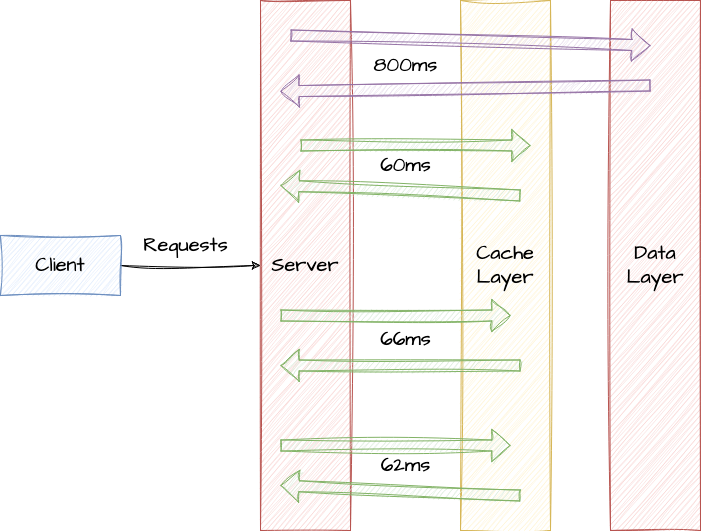
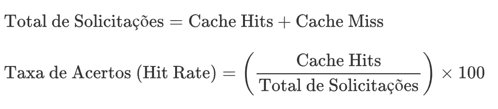
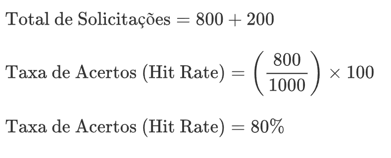
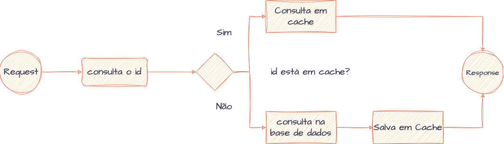
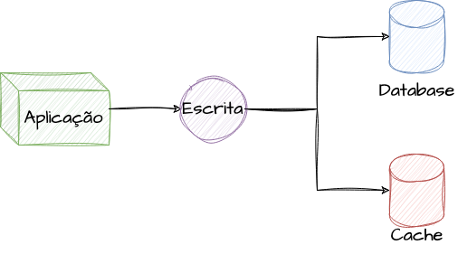
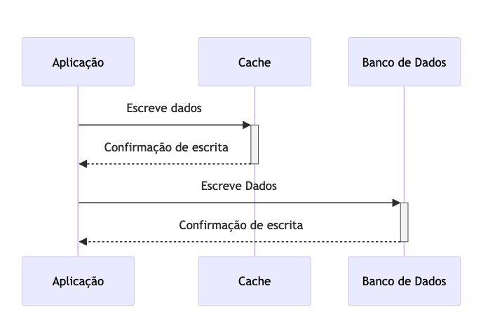
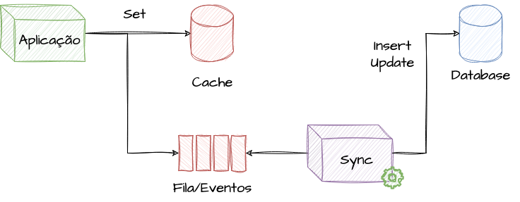
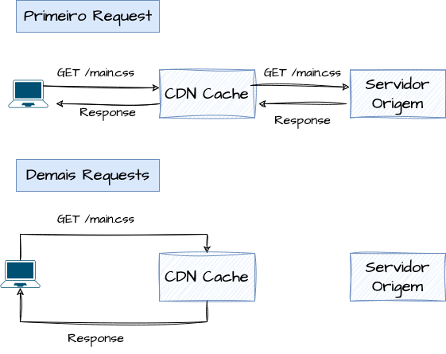

# Estratégias de Cache

- [Estratégias de Cache](#estratégias-de-cache)
- [Definindo Cache](#definindo-cache)
- [Princípios Básicos de Cache](#princípios-básicos-de-cache)
  - [Consistência de Dados](#consistência-de-dados)
  - [Time to Live (TTL)](#time-to-live-ttl)
  - [Políticas de Evicção e Substituição](#políticas-de-evicção-e-substituição)
  - [Invalidação de Itens em Cache](#invalidação-de-itens-em-cache)
  - [Eventos de Hit Rate, Cache Hit e Cache Miss](#eventos-de-hit-rate-cache-hit-e-cache-miss)
    - [Cache Hit](#cache-hit)
    - [Cache Miss](#cache-miss)
    - [Hit Rate - Taxa de Acertos](#hit-rate---taxa-de-acertos)
- [Implementações de Cache](#implementações-de-cache)
  - [Cache em Memória (Hashmap)](#cache-em-memória-hashmap)
  - [Caching em Sistemas Distribuídos](#caching-em-sistemas-distribuídos)
  - [Cache em Bancos de Dados e Camadas de Dados](#cache-em-bancos-de-dados-e-camadas-de-dados)
  - [Cache-Aside (Lazy Loading)](#cache-aside-lazy-loading)
  - [Write-Through (Escrita Dupla)](#write-through-escrita-dupla)
  - [Write-Behind (Lazy Writing)](#write-behind-lazy-writing)
  - [Cache de Conteúdo Distribuído (CDN Cache)](#cache-de-conteúdo-distribuído-cdn-cache)
    - [Primeiro Acesso](#primeiro-acesso)
    - [Segundo Acesso](#segundo-acesso)
- [Referencias](#referencias)

> **Nota:** Este documento é um material de estudo baseado no artigo original
> **"Estratégias de Cache"**, de **Matheus Fidelis**, publicado em
> [fidelissauro.dev/caching](https://fidelissauro.dev/caching/).
> As ilustrações pertencem ao autor original. Recomenda-se a leitura do
> artigo completo na fonte.

---

Este material explora o tema de cacheamento (ou *caching*) pela lente de System
Design. A ideia central de cache é universal — guardar dados temporariamente em
um local mais próximo ou mais rápido para reduzir o tempo de acesso à fonte
original. Na prática, porém, essa ideia se desdobra em diversas estratégias e
tipos. O estudo parte de definições conceituais e genéricas, reaproveitáveis na
maioria dos cenários, e avança progressivamente para abordagens específicas,
com suas particularidades, vantagens e trade-offs.

# Definindo Cache

Em termos simples, cache é uma técnica de otimização que insere uma **camada
intermediária de dados** entre dois componentes. Serve para armazenar
temporariamente informações que seriam custosas ou lentas de recuperar na
origem, funcionando também como uma camada temporária de resiliência diante de
falhas das dependências.

Em geral, o que fica no cache é o resultado de uma operação anterior ou uma
cópia de dados que residem em outro lugar. Com isso, evita-se sobrecarregar
dependências e reduz-se a consulta a dados que mudam pouco, aproximando-os do
cliente ou movendo-os de um local caro para um mais acessível.

> [!note]
> Exemplo de cacheamento em camadas de dados de uma interação entre cliente e servidor

O conteúdo cacheado pode ser qualquer coisa: resultados de consultas a banco,
respostas de sistemas dependentes, *assets* ou páginas web inteiras. O ganho é
maior quando os dados são acessados com frequência, mas mudam raramente. Vale
reforçar um ponto que costuma gerar confusão: tecnologias como bancos de dados
em memória, CDNs e proxies reversos **implementam** capacidades de cache, mas
não **definem** o conceito — cache é uma estratégia, não um produto específico.

# Princípios Básicos de Cache

Independentemente da estratégia escolhida ou da finalidade, há um conjunto de
conceitos e desafios recorrentes em qualquer solução de caching. Esta seção
reúne esses fundamentos, que ajudam a projetar caches de forma mais consciente
e eficiente.

## Consistência de Dados

Manter o cache alinhado à fonte de dados principal é um dos pontos mais
críticos, sobretudo quando os dados são sensíveis a atualizações. A estratégia
adotada precisa garantir que o cache reflita as mudanças mais recentes, e em
sistemas altamente distribuídos esse costuma ser o maior desafio.

Um exemplo ilustra bem o risco: imagine cachear os dados cadastrais de um
usuário em um sistema de compras. A pergunta-chave é "com que frequência esses
dados mudam?". Se o usuário troca de endereço — ou pior, é desativado por
atividade suspeita — o cache desatualizado pode enviar produtos para o lugar
errado ou permitir ações indevidas. Por isso, as operações de escrita na fonte
original têm a responsabilidade de **invalidar ou atualizar** as chaves de
cache correspondentes.

## Time to Live (TTL)

O TTL (*Time to Live*) define um tempo de vida para cada item no cache. Quando
esse período expira, o item é removido ou marcado como inválido — em ambos os
casos, sinaliza-se que ele deve ser renovado. Em sistemas de larga escala o TTL
é praticamente obrigatório: evita que dados obsoletos comprometam a
consistência, força uma reciclagem periódica das informações e ajuda a liberar
recursos ocupados por itens que já não são acessados.

## Políticas de Evicção e Substituição

A política de evicção determina **quais itens descartar** quando o cache atinge
sua capacidade máxima. Se um cache comporta 1000 itens e já está cheio, a
chegada de um novo item exige que algum existente seja removido. As políticas
buscam preservar os itens mais relevantes e acessados, descartando primeiro os
menos úteis. As principais abordagens são:

* **Least Recently Used (LRU):** remove o item usado há mais tempo, partindo da
  hipótese de que algo não acessado recentemente dificilmente será requisitado
  em breve.
* **Least Frequently Used (LFU):** descarta os itens menos acessados ao longo
  do tempo. Pode ser mais preciso que o LRU, mas é mais difícil de implementar
  por exigir o rastreamento da frequência de uso de cada item.
* **First In, First Out (FIFO):** elimina os itens na ordem de chegada. Simples
  de implementar, mas não leva em conta a frequência de uso.
* **Random Replacement (RR):** escolhe um item aleatório para remover. Trivial
  de implementar, porém ignora completamente o padrão de acesso.

## Invalidação de Itens em Cache

Invalidar um cache é remover ou marcar dados como inválidos. Isso pode acontecer
de diferentes formas: **programaticamente**, quando a própria lógica do
algoritmo descarta itens que perderam utilidade; **manualmente**, via comandos
que invalidam itens individuais ou em grupo; ou **automaticamente**, através do
TTL, com a expiração ocorrendo após um período definido.

## Eventos de Hit Rate, Cache Hit e Cache Miss

Em sistemas que usam cache, dois eventos são fundamentais para medir
eficiência: o *cache hit* e o *cache miss*. Acompanhá-los fornece dados
importantes para análise de desempenho e para avaliar se a camada de cache está
realmente entregando valor.

### Cache Hit

Um *cache hit* ocorre quando a informação procurada já está no cache,
permitindo que o sistema a entregue diretamente, sem recorrer à fonte original
(que seria bem mais lenta). Uma alta taxa de *hits* costuma indicar um cache bem
ajustado, que efetivamente reduz acessos às fontes mais lentas.

### Cache Miss

Um *cache miss* acontece quando o dado não está no cache, obrigando o sistema a
buscá-lo na origem — operação de maior latência e custo. Minimizar *misses* é
parte importante do design de um cache e envolve prever padrões de acesso e
ajustar as políticas de evicção. Limpezas totais ou parciais podem provocar um
pico temporário de *misses* até a reconstrução dos itens; já um volume alto e
constante de *misses* frente aos *hits* sugere uso ineficiente do cache e
oportunidade de otimização.

### Hit Rate - Taxa de Acertos

A eficácia do cache resulta da relação entre *hits* e *misses*. A taxa de
acertos (*hit rate*) é o número de *cache hits* dividido pelo total de
solicitações (*hits* + *misses*), normalmente expressa em porcentagem. Quanto
maior a taxa, mais eficiente o cache; uma taxa baixa indica espaço para
otimização — ou até justifica remover a camada de cache.

Como exemplo, considerando 800 *cache hits* e 200 *cache misses* em determinado
período, a taxa de acertos seria calculada da seguinte forma:

# Implementações de Cache

Como cache é uma estratégia voltada a uma finalidade, e não uma tecnologia
específica, existem muitas formas de implementá-lo. Esta seção detalha alguns
dos principais usos e cenários de aplicação de caching.

## Cache em Memória (Hashmap)

O cache em memória é útil para otimizar o desempenho em uma escala mais simples.
Mesmo limitado a uma única execução ou processo, reduz o tempo de acesso a dados
e alivia a carga sobre recursos mais lentos. Entre as opções, estruturas
baseadas em *hashmap* se destacam pela simplicidade, alto desempenho e
facilidade nas operações básicas.

A ideia é montar um mapa chave-valor mantido localmente em memória: cada item
salvo é referenciado por uma chave única que permite recuperá-lo. Isso
proporciona uma capacidade de cache local dentro do processo.

O exemplo de código apresentado no artigo (em Go) implementa um `MemoryCache`
com um `map[string]interface{}` protegido por um `sync.RWMutex` e exposto via
*singleton* (`sync.Once`), oferecendo métodos `Set` e `Get`. Um ponto de
atenção: implementações que acumulam muitos itens por longos períodos precisam
de estratégias de invalidação para evitar *leaks* e saturação da memória
disponível.

## Caching em Sistemas Distribuídos

Em sistemas distribuídos, o cache é um grande facilitador de performance,
redução de latência e escalabilidade ao servir conteúdo estático ou dinâmico.
Diferente do cache em memória — restrito a um processo —, tecnologias como Redis
e Memcached permitem distribuir e paralelizar o cache, de modo que múltiplas
réplicas e sistemas acessem os mesmos itens simultaneamente.

Esse modelo é especialmente valioso em cargas sensíveis à escalabilidade
horizontal: independentemente de qual réplica tenha criado o cache, ele fica
imediatamente disponível para as demais.

Muitas dessas tecnologias permitem trabalhar com cache de forma pragmática,
adicionando nós ao cluster para lidar com mais carga sem degradar o desempenho.
Elas oferecem replicação entre nós para manter consistência e mecanismos de
alta disponibilidade que sustentam a operação mesmo diante de falhas ou
particionamento — caso, por exemplo, do Redis em modo cluster.

## Cache em Bancos de Dados e Camadas de Dados

Bancos de dados costumam ser o maior gargalo das aplicações, devido ao custo de
escrita, leitura, concorrência e persistência de longo prazo. Como a maioria das
opções de mercado não é sensível à escalabilidade horizontal, a camada de dados
tende a ser uma das mais complexas de escalar. O cache mitiga esse gargalo ao
guardar consultas inteiras ou registros muito acessados em uma camada em
memória, mais barata e rápida de consultar.

Há diferentes estratégias para isso, abordadas de forma simplificada nas seções
seguintes.

## Cache-Aside (Lazy Loading)

O *cache-aside* é a estratégia mais comum em caches de banco de dados. A própria
aplicação constrói o cache **sob demanda**: antes de ler do banco, ela consulta
o cache. Se o dado está presente (*cache hit*), a resposta vem direto do cache;
se não está (*cache miss*), a aplicação busca no banco, grava o resultado no
cache para consultas futuras e segue adiante. A primeira construção desse cache
naturalmente leva um pouco mais de tempo.

> [!note]
> Lógica de consulta e construção de cache em bancos de dados utilizando estratégias de Cache-Aside

Embora traga ganhos expressivos de desempenho, essa abordagem adiciona
complexidade na gestão de consistência. O exemplo em Go do artigo demonstra o
fluxo: consulta uma chave no Redis e, ao receber `redis.Nil`, recorre ao MySQL,
grava o valor no cache e o retorna.

## Write-Through (Escrita Dupla)

O *write-through* (escrita dupla) é indicado quando o cache precisa ser mais
durável e a leitura deve manter um tempo de resposta previsível. A estratégia
consiste em atualizar **simultaneamente** o banco principal e o cache sempre que
um dado é inserido ou modificado.

O objetivo é manter o cache sempre sincronizado com a fonte persistente,
reduzindo o risco de inconsistências. Sistemas que adotam essa abordagem
precisam de mecanismos robustos de recuperação para os casos em que a escrita na
origem falha após o dado já ter sido gravado no cache. Na prática, *cache-aside*
e *write-through* costumam ser combinados de forma complementar.

O exemplo de código (Go) escreve primeiro no MySQL com um `INSERT ... ON
DUPLICATE KEY UPDATE` e, em seguida, atualiza imediatamente a chave
correspondente no Redis, ilustrando a escrita nas duas camadas.

## Write-Behind (Lazy Writing)

O *write-behind* (também chamado de *lazy writing*) busca otimizar a escrita,
minimizando latência e aliviando a carga sobre a fonte persistente. Diferente do
*write-through*, em que a escrita reflete imediatamente nas duas camadas, o
*write-behind* **adia a sincronização** com o armazenamento durável,
aproveitando janelas de baixa atividade ou políticas específicas.

Aqui a escrita é aplicada primeiro ao cache, permitindo que a aplicação siga sem
esperar a confirmação da fonte persistente. A propagação para o armazenamento
durável ocorre de forma **assíncrona**, baseada em critérios como intervalos de
tempo, volume acumulado de operações, detecção de baixa demanda ou uso de
componentes intermediários como filas e *event brokers*. Essa estratégia exige
algum processo paralelo responsável por efetivar a escrita.

## Cache de Conteúdo Distribuído (CDN Cache)

A CDN (*Content Delivery Network*) é uma infraestrutura de rede distribuída
geograficamente para otimizar a entrega de conteúdo. Ela mantém cópias de
recursos estáticos — imagens, vídeos, CSS, JavaScript — em servidores espalhados
por diferentes regiões.

Quando um usuário solicita um recurso, em vez de ir direto à origem, a CDN
encaminha a requisição ao servidor mais próximo que tenha o conteúdo em cache,
considerando fatores como proximidade geográfica, *health checks* e latência de
rede. A lógica segue o mesmo princípio de caching já apresentado: busca na
origem quando o recurso não está em cache e serve a cópia cacheada nas demais
vezes — com a particularidade de que algumas soluções replicam os arquivos entre
pontos geográficos de forma assíncrona.

O objetivo é encurtar a distância percorrida pelos dados mais acessados,
reduzindo latência, aliviando a origem e melhorando a experiência do usuário.
É especialmente eficaz em aplicações web com muitos recursos estáticos que mudam
pouco mas recebem muitas requisições. Como benefício adicional, CDNs absorvem
picos súbitos de tráfego e costumam incluir proteções contra DDoS, firewalls,
filtragem de pacotes e detecção de ameaças. Aplicações com ciclo de
desenvolvimento constante precisam embutir estratégias de invalidação na
pipeline, para que os usuários sempre recebam a versão mais recente do conteúdo.

O artigo ilustra o conceito com um servidor HTTP em Go que atua como proxy de
cache entre o cliente e `google.com.br`: para cada requisição, gera um *hash*
(SHA-1) do caminho, verifica se o arquivo já existe em disco e, em caso
afirmativo, responde a partir do cache local; caso contrário, busca na origem,
armazena e então responde.

### Primeiro Acesso

A saída descrita para o primeiro acesso mostra os recursos sendo buscados na
origem (mensagens "não está presente em cache"), com tempos na casa das centenas
de milissegundos para a maioria das requisições. É o custo esperado de popular o
cache pela primeira vez.

### Segundo Acesso

Já no segundo acesso, os mesmos recursos aparecem como presentes em cache e são
servidos a partir do disco local, com tempos na casa dos microssegundos —
ordens de grandeza mais rápidos que o acesso inicial. O contraste evidencia o
ganho de performance proporcionado pela camada de cache.

# Referencias

- [Cache Strategies](https://medium.com/@mmoshikoo/cache-strategies-996e91c80303)

- [Caching patterns](https://docs.aws.amazon.com/whitepapers/latest/database-caching-strategies-using-redis/caching-patterns.html)

- [Introduction to database caching](https://www.prisma.io/dataguide/managing-databases/introduction-database-caching)

- [Top Caching Strategies](https://blog.bytebytego.com/p/top-caching-strategies)

- [Cache Eviction Strategies Every Redis Developer Should Know](https://redis.com/blog/cache-eviction-strategies/)

- [Cache Hit e Cache Miss](https://redis.com/blog/cache-eviction-strategies/)

- [Caching patterns](https://docs.aws.amazon.com/whitepapers/latest/database-caching-strategies-using-redis/caching-patterns.html)

- [Azure Architecture: Cache-Aside](https://learn.microsoft.com/pt-br/azure/architecture/patterns/cache-aside)

- [Write Through and Write Back in Cache](https://www.geeksforgeeks.org/write-through-and-write-back-in-cache/)
