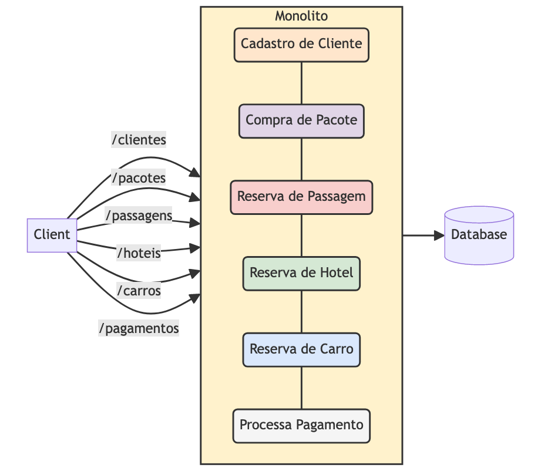
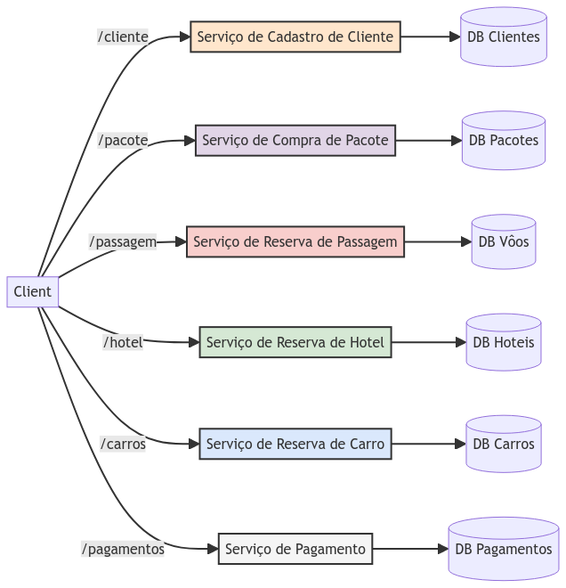
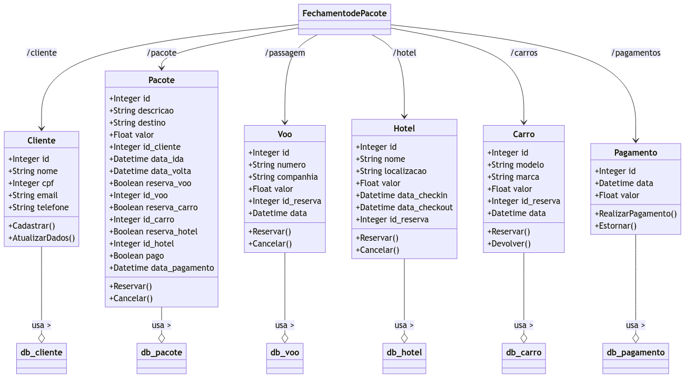

# System Design - Microsserviços, Monolitos e Domínios

- [System Design - Microsserviços, Monolitos e Domínios](#system-design---microsserviços-monolitos-e-domínios)
- [Arquitetura Monolítica](#arquitetura-monolítica)
  - [Vantagens de uma Arquitetura Monolítica](#vantagens-de-uma-arquitetura-monolítica)
  - [Desvantagens de uma Arquitetura Monolítica](#desvantagens-de-uma-arquitetura-monolítica)
- [Arquitetura de Microsserviços](#arquitetura-de-microsserviços)
  - [Vantagens de uma Arquitetura de Microsserviços](#vantagens-de-uma-arquitetura-de-microsserviços)
  - [Desvantagens de uma Arquitetura de Microsserviços](#desvantagens-de-uma-arquitetura-de-microsserviços)
- [Domínios e Design](#domínios-e-design)
- [Lei de Conway na arquitetura de sistemas](#lei-de-conway-na-arquitetura-de-sistemas)
- [Referências](#referências)

> **Nota:** Este documento é um material de estudo baseado no artigo original
> **"System Design - Microsserviços, Monolitos e Domínios"**, de **Matheus Fidelis**,
> publicado em [fidelissauro.dev/monolitos-microservicos](https://fidelissauro.dev/monolitos-microservicos/).
> As ilustrações pertencem ao autor original. Recomenda-se a leitura do artigo
> completo na fonte.

---

Este material aborda, em um nível conceitual e de alto nível, as arquiteturas
de monólitos e microsserviços. A proposta não é mergulhar nos componentes
internos de cada tema, mas estabelecer definições, vantagens e desafios que
ajudam a entender como projetar sistemas para demandas modernas. Vários tópicos
citados aqui — escalabilidade, resiliência e protocolos de comunicação — são
apenas introduzidos e merecem aprofundamento próprio.

Além de contrastar monólitos e microsserviços, o objetivo é mostrar como
sistemas distribuídos, domínios de negócio e a Lei de Conway influenciam as
decisões de arquitetura tomadas pelas equipes de engenharia. Vale lembrar que
muitas dessas definições nascem mais da experiência prática e do senso comum do
que de formalizações científicas, já que boa parte do assunto carece de
definições rígidas.

# Arquitetura Monolítica

Uma boa analogia para o monólito é a de um robô de controle remoto saído da
caixa: ele reúne várias partes com responsabilidades diferentes, mas todas estão
unidas em uma única peça. Se qualquer parte quebra, o brinquedo inteiro deixa de
funcionar. No software, o monólito é a aplicação em que todos os componentes e
serviços são acessados diretamente, por chamadas locais entre métodos do próprio
sistema, formando uma unidade única e indivisível.

Na prática, isso significa que todas as funcionalidades vivem na mesma base de
código, no mesmo binário, na mesma aplicação e, na maioria das vezes,
compartilhando o mesmo banco de dados. Essa integração forte favorece a
simplicidade no desenvolvimento e na implantação, além de facilitar a
manutenção da consistência dos dados — um dos maiores desafios dos sistemas
modernos.

Um exemplo recorrente no artigo é o backoffice de uma agência de viagens, com
funcionalidades como cadastro de clientes, venda de pacotes, reservas de hotéis,
passagens, aluguel de carros e cobrança. Em uma abordagem monolítica, tudo isso
estaria empacotado em uma única peça de software.

> [!NOTE]
> Exemplo de uma arquitetura monolitica aplicada a um produto de venda de viagens

É um equívoco comum associar o monólito a algo "errado", "arcaico" ou "legado".
Escolher uma arquitetura monolítica não torna o sistema automaticamente moderno
ou ultrapassado. Na verdade, o monólito costuma ser o estágio inicial ideal de
qualquer produto — salvo casos em que se projeta para altíssima demanda desde o
princípio. Empresas como Facebook, Twitter, Uber e Netflix começaram como
monólitos e sustentaram essa arquitetura mesmo em grande escala.

## Vantagens de uma Arquitetura Monolítica

A principal vantagem é a simplicidade na gestão de dependências e nas interações
entre as funcionalidades. Como tudo roda no mesmo processo, dispensam-se
protocolos e estratégias adicionais de comunicação como HTTP, gRPC, webhooks e
mensageria. Construir novas funcionalidades também tende a ser mais direto, pois
desenvolvimento, teste e implantação seguem unificados.

Outro ponto forte é a facilidade de manter a consistência dos dados, já que
todos os contextos convergem para um único banco. Por isso, a arquitetura
monolítica é especialmente adequada quando a complexidade de negócio é
gerenciável e a escalabilidade não é uma preocupação imediata — cenário comum em
aplicações de pequeno e médio porte e em equipes enxutas, onde gerir múltiplos
serviços seria custoso em tempo, energia e dinheiro.

Quando quem opera o sistema não conhece os detalhes internos da arquitetura, o
monólito também simplifica a entrada em produção, por ser uma única unidade. O
artigo cita o caso do Istio, que migrou de microsserviços de volta para um
monólito justamente pela facilidade de operar uma aplicação única. Esse modelo
ainda favorece o ciclo de vida de MVPs, novos produtos e protótipos, pela
agilidade de iniciar e evoluir. Investir em testes unitários e de integração e
seguir padrões de projeto consolidados prolonga a vida útil e a qualidade do
sistema, permitindo validar o comportamento de ponta a ponta.

## Desvantagens de uma Arquitetura Monolítica

À medida que o monólito cresce, os desafios de escala e manutenção ficam cada
vez mais evidentes — algo que faz parte do fluxo "natural" do ciclo de vida da
engenharia. Com a diversidade crescente de funcionalidades, requisições e fluxos
de negócio, escalar horizontalmente se torna difícil, problema crítico em
ambientes de nuvem e de alto tráfego. A manutenção, antes vantajosa, pode se
deteriorar, exigindo rebases constantes, revisões mais detalhadas e implantações
mais complexas.

A escala vertical — aumentar recursos computacionais da mesma instância — tende
a crescer de forma contínua e se transforma em um desafio financeiro, já que a
demanda e o consumo de recursos só aumentam. Por fim, há o problema de tolerância
a falhas: como todos os componentes estão na mesma unidade, uma falha em uma
parte pode derrubar o sistema inteiro.

# Arquitetura de Microsserviços

Se o monólito é o robô de controle remoto, os microsserviços são uma grande caixa
de LEGO: cada bloco é pequeno e independente, e com eles é possível montar
estruturas variadas. Se um bloco quebra ou precisa ser trocado, a substituição é
simples e não afeta os demais. Microsserviços são, portanto, um estilo
arquitetural em que a aplicação é dividida em serviços menores, cada um operando
de forma independente e se comunicando indiretamente por algum protocolo.

Cada microsserviço foca em uma função ou recurso de negócio específico e pode ser
desenvolvido, implantado e escalado isoladamente. A ideia central é fragmentar
um grande bloco de funcionalidades em unidades menores e mais gerenciáveis.
Retomando o backoffice da agência de viagens, gestão de clientes, pacotes,
reservas e pagamentos podem virar serviços autônomos que se comunicam entre si
ou são acessados diretamente pelos clientes via endpoints específicos.

> [!NOTE]
> Exemplo de uma arquitetura de microsserviços aplicada a um produto de venda de viagens

A adoção de microsserviços normalmente surge como resposta a problemas de
escalabilidade e manutenção, sobretudo quando processamentos assíncronos,
redução de acoplamento e eliminação de pontos únicos de falha passam a ser
importantes. Um exemplo claro de motivação: um cadastro de cliente leve (200ms,
pouco recurso) que precisa dividir CPU, memória e I/O com rotinas pesadas, como
fechamento de caixa ou geração de relatórios. Essa concorrência heterogênea
degrada a performance e justifica separar funcionalidades em serviços distintos.

A construção de microsserviços também se torna comum quando crescem o número de
equipes, produtos e profissionais, tornando vantajoso gerir o ciclo de vida das
aplicações de forma isolada e por contexto — tema aprofundado adiante na Lei de
Conway.

## Vantagens de uma Arquitetura de Microsserviços

A vantagem mais citada é a descentralização. Diferentes serviços podem usar
linguagens, frameworks e bancos de dados distintos, cada um otimizado para sua
necessidade. Um serviço transacional, em que acurácia e segurança são cruciais,
pode adotar um banco com propriedades ACID; já um serviço de busca textual, como
a busca de produtos de um e-commerce, pode usar tecnologias de full-text search
como Elasticsearch ou MongoDB. Essa flexibilidade aumenta a complexidade de
manutenção e documentação, mas é um benefício significativo.

Outro ganho é poder escalar cada serviço horizontalmente de forma independente,
conforme seu próprio consumo de recursos, sem que o scale in/scale out afete
todas as dependências ao mesmo tempo. Idealmente, o "Blast Radius" (raio de
explosão) de uma falha fica contido em um componente, permitindo que o sistema
siga operando parcial ou totalmente — especialmente com fallbacks ou
processamento assíncrono. Esse cenário, porém, depende fortemente da adoção de
padrões de resiliência na comunicação entre as dependências.

## Desvantagens de uma Arquitetura de Microsserviços

Gerenciar múltiplos microsserviços é claramente mais complexo do que cuidar de
uma única aplicação, e essa complexidade se estende a implantação, monitoramento
e tratamento de falhas. A facilidade de entregar uma nova versão isolada só se
concretiza com versionamento inteligente das funcionalidades e gestão eficiente
dos contratos dos protocolos de comunicação; sem isso, a suposta vantagem vira
obstáculo nos processos de implantação corporativos.

Testar um conjunto de serviços independentes é mais difícil do que testar um
monólito: exige testes de integração e end-to-end mais complexos e frequentes,
além de ambientes de homologação confiáveis que reproduzam fielmente a produção.
A consistência e a integridade dos dados em ambientes distribuídos figuram entre
os maiores desafios — transações distribuídas de longa duração, sincronização de
dados e compensações retroativas (desfazer transações em cascata) demandam
soluções complexas.

Monitoramento, observabilidade e alertas também ficam mais difíceis, exigindo
estratégias homogêneas e ferramentas avançadas de tracing, agregação de logs e
métricas — cuja maturidade pode até superar a complexidade dos próprios serviços.
Por fim, a comunicação entre serviços passa a depender da rede interna, com
protocolos como HTTP, filas de mensagens e eventos em streams, expondo o sistema
a latência e falhas de comunicação. Isso torna essenciais padrões de resiliência
como circuit breakers, retries, fallbacks, filas de reprocessamento e dead letter
queues.

# Domínios e Design

Modelar corretamente os domínios de negócio é crucial, sobretudo em
microsserviços. Um domínio de negócio é uma esfera de conhecimento, influência
ou atividade sobre um assunto; modelá-lo envolve identificar as entidades-chave,
suas relações e interações para cumprir as funções de negócio, algo
especialmente relevante em sistemas complexos.

O Domain-Driven Design (DDD) é uma abordagem que prioriza o domínio e a lógica de
negócio. Ele valoriza um modelo de domínio rico e expressivo, incorporando regras
de negócio e usando uma linguagem comum entre desenvolvedores e especialistas
para alinhar o entendimento dos conceitos e delimitar com precisão as
responsabilidades de cada parte do sistema. O DDD ajuda a evitar a chamada
modelagem anêmica — entidades que são meras coleções de dados, sem comportamento
ou regra — e favorece a modularidade e a clara definição de limites contextuais.

O DDD não é exclusivo de microsserviços: pode ser aplicado a uma única base de
código, definindo limites entre classes e módulos e criando um monólito mais
modular. Em microsserviços, serve para delimitar responsabilidades e reduzir a
complexidade entre os serviços. Em ambos os casos, ele alinha o design do
software ao domínio de negócio; o que muda é como esse alinhamento é gerenciado e
colocado em produção conforme a arquitetura escolhida.

> [!NOTE]
> Exemplo de DDD aplicado à construção de uma aplicação de vendas de pacotes de viagens.

Esse mesmo exemplo serve tanto para desenhar um diagrama de classes e módulos de
um monólito quanto para definir responsabilidades de microsserviços. Um dos
maiores desafios é identificar corretamente os limites de serviço: com o DDD, os
serviços se organizam em torno de contextos delimitados (bounded contexts), cada
um cuidando de um conjunto distinto de entidades e regras, mantendo os serviços
pequenos, focados e independentes. Em ambientes com muitas equipes, a modelagem
no nível de domínio também mapeia responsáveis, evita duplicação de soluções e
promove reutilização — algo essencial em grandes corporações.

# Lei de Conway na arquitetura de sistemas

A Lei de Conway foi formulada por Melvin Conway, programador e cientista da
computação. Apresentada originalmente em um paper rejeitado por Harvard em 1967
— sob a alegação de que ele "não conseguiu provar sua tese" — ela ganhou
notoriedade ao ser publicada na revista Datamation, no artigo "How Do Committees
Invent?". A tese central é que a estrutura organizacional de uma empresa
influencia diretamente a arquitetura do software que ela produz: os designs dos
sistemas refletem as estruturas de comunicação das organizações.

Em outras palavras, a forma como as equipes são organizadas e se comunicam tende
a moldar o software. Organizações com muitos grupos pequenos e independentes
tendem a gerar software com vários componentes independentes; estruturas mais
integradas produzem software mais integrado. Uma empresa com times separados de
frontend, backend e dados provavelmente terá módulos distintos com tecnologias
específicas (SPAs, microfrontends, BFFs, REST, GraphQL, procedures). Startups com
equipe unificada e decisões rápidas tendem a softwares mais integrados, enquanto
grandes corporações com pouca comunicação interdepartamental frequentemente
acabam com sistemas fragmentados ou redundantes.

A Lei de Conway também influencia, de forma orgânica, a adoção de monólitos ou
microsserviços. Estruturas centralizadas, hierárquicas e com comunicação vertical
tendem a produzir sistemas monolíticos, espelhando essa centralização em uma base
única — o que também ocorre em ambientes informais de alta integração. Já
organizações com equipes menores, autônomas e de comunicação interna intensa,
porém com pouca interação entre grupos, tendem a originar microsserviços, cada um
representando um aspecto específico do negócio.

# Referências
- [AWS - Qual é a diferença entre arquitetura monolítica e de microsserviços?](https://aws.amazon.com/pt/compare/the-difference-between-monolithic-and-microservices-architecture/)

- [Microsserviços x arquitetura monolítica: entenda a diferença](https://viceri.com.br/insights/microsservicos-x-arquitetura-monolitica-entenda-a-diferenca/)

- [Domain Driven Design](https://en.wikipedia.org/wiki/Domain-driven_design)

- [Pattern: Monolithic Architecture](https://microservices.io/patterns/monolithic.html)

- [Martin Fowler: Microservices](https://martinfowler.com/articles/microservices.html)

- [Martin Fowler: Anemic Domain Model](https://martinfowler.com/bliki/AnemicDomainModel.html)

- [Martin Fowler: Conway’s Law](https://martinfowler.com/bliki/ConwaysLaw.html)

- [Livro: Domain-driven design: atacando as complexidades no coração do software (2016)](https://www.amazon.com.br/Domain-driven-design-atacando-complexidades-software/dp/8550800651)

- [Domain-Driven Design, do início ao código](https://medium.com/cwi-software/domain-driven-design-do-in%C3%ADcio-ao-c%C3%B3digo-569b23cb3d47)

- [Conway’s Law](https://www.melconway.com/Home/Conways_Law.html)

- [How Do Committees Invent?](https://www.melconway.com/Home/Committees_Paper.html)

- [Como a lei de Conway afeta o desenvolvimento de softwares?](https://www.supero.com.br/blog/como-a-lei-de-conway-afeta-o-desenvolvimento-de-softwares/)

- [The enduring link between Conway’s Law and microservices](https://www.techtarget.com/searchapparchitecture/tip/The-enduring-link-between-Conways-Law-and-microservices)
