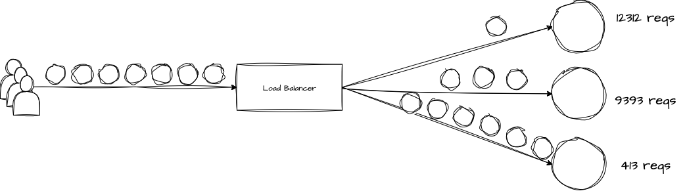
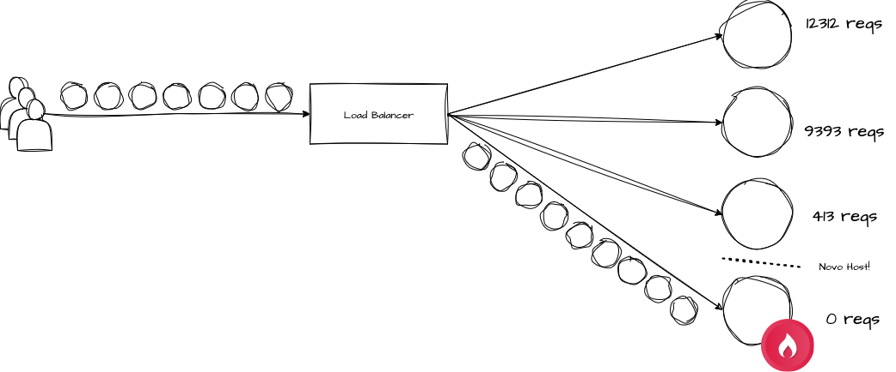
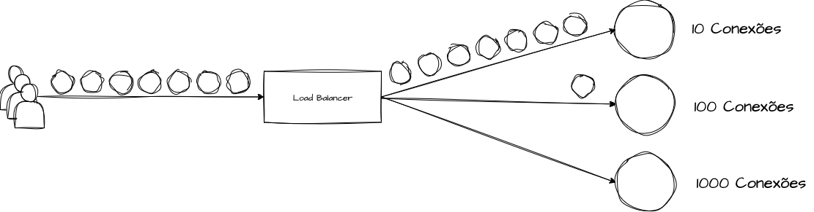
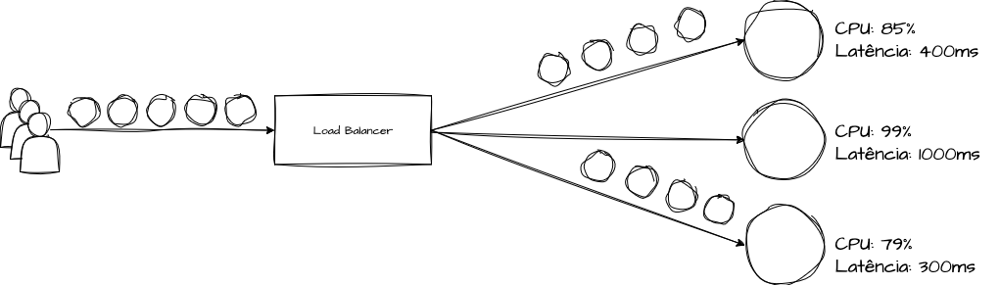
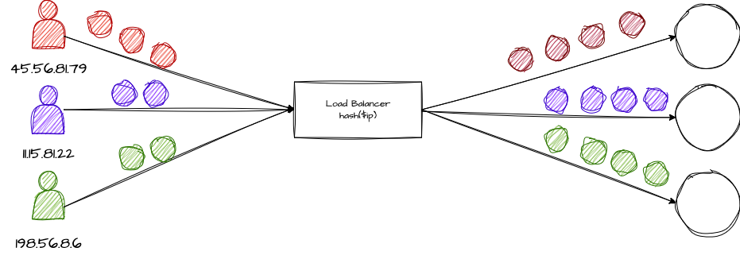
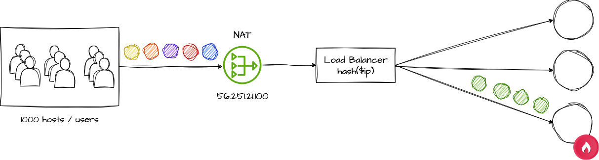
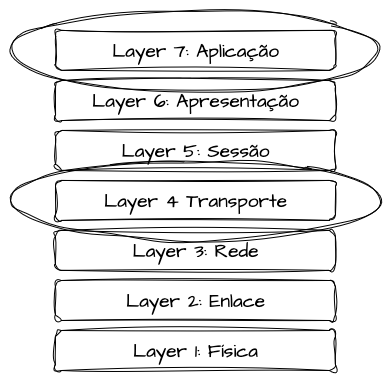
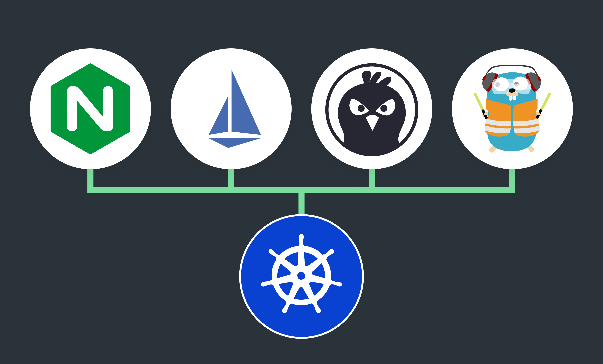

# System Design - Load Balancers e Proxies Reversos

- [System Design - Load Balancers e Proxies Reversos](#system-design---load-balancers-e-proxies-reversos)
    - [O Problema da Falta de Balanceamento de Carga](#o-problema-da-falta-de-balanceamento-de-carga)
    - [Resolvendo problemas com balanceamento de carga](#resolvendo-problemas-com-balanceamento-de-carga)
- [Fundamentos de Balanceadores de Carga](#fundamentos-de-balanceadores-de-carga)
  - [Proxy Reverso vs Load Balancer](#proxy-reverso-vs-load-balancer)
  - [O Papel do Load Balancer](#o-papel-do-load-balancer)
- [Algoritmos de Balanceamento de Carga](#algoritmos-de-balanceamento-de-carga)
  - [Round Robin](#round-robin)
    - [Limitações do Round Robin](#limitações-do-round-robin)
    - [Exemplo de um Algoritmo de Round Robin](#exemplo-de-um-algoritmo-de-round-robin)
  - [Least Request](#least-request)
    - [Limitações do Least Request](#limitações-do-least-request)
    - [Exemplo de Implementação](#exemplo-de-implementação)
  - [Least Connection](#least-connection)
    - [Limitações do Least Connection](#limitações-do-least-connection)
  - [Least Outstanding Requests (LOR)](#least-outstanding-requests-lor)
    - [Limitações do Least Outstanding Requests](#limitações-do-least-outstanding-requests)
  - [IP Hash Balancing](#ip-hash-balancing)
    - [Limitações ao Implementar a Técnica de IP Hashing](#limitações-ao-implementar-a-técnica-de-ip-hashing)
    - [Exemplo de Implementação](#exemplo-de-implementação-1)
  - [Maglev](#maglev)
    - [Limitações do Maglev](#limitações-do-maglev)
  - [Random Load Balancing](#random-load-balancing)
    - [Limitações do Random](#limitações-do-random)
- [Load Balancing e Camada OSI](#load-balancing-e-camada-osi)
  - [Load Balancers em Layer 4 (Transporte)](#load-balancers-em-layer-4-transporte)
  - [Load Balancers em Layer 7 (Aplicação)](#load-balancers-em-layer-7-aplicação)
- [Implementações e Tecnologias](#implementações-e-tecnologias)
    - [Envoy Proxy](#envoy-proxy)
    - [Nginx](#nginx)
    - [HAProxy](#haproxy)
    - [Traefik](#traefik)
    - [Kubernetes Ingress Controllers](#kubernetes-ingress-controllers)
      - [Cloud Load Balancers](#cloud-load-balancers)
- [Referencias](#referencias)

> **Nota:** Este documento é um material de estudo baseado no artigo original
> **"System Design - Load Balancers e Proxies Reversos"**, de **Matheus Fidelis**,
> publicado em [fidelissauro.dev/load-balancing](https://fidelissauro.dev/load-balancing/).
> As ilustrações pertencem ao autor original. Recomenda-se a leitura do artigo
> completo na fonte.

---

### O Problema da Falta de Balanceamento de Carga

Para entender o valor de um balanceador de carga, vale partir de uma analogia simples: um pequeno supermercado de bairro em horário de pico, atendendo todo mundo com **um único caixa**. O resultado é previsível — uma fila enorme e única, atrasos e clientes irritados.

Esse caixa solitário vive sobrecarregado, o que aumenta a chance de erro pela pressão constante sobre o atendente. Pior ainda, não existe diferenciação: quem leva apenas um refrigerante espera o mesmo tanto que quem traz o carrinho cheio das compras do mês, tornando o atendimento ineficiente.

O ponto crítico é a fragilidade. Se aquele único caixa falha ou quebra, **a operação inteira para**. Esse cenário ilustra exatamente os problemas que o balanceamento de carga se propõe a resolver: gargalos, ausência de diferenciação de carga e ponto único de falha.

### Resolvendo problemas com balanceamento de carga

Agora imagine que o dono investe, compra mais caixas e contrata mais atendentes. Com **múltiplas filas** disponíveis, os clientes se distribuem e o tempo de espera cai de forma significativa, já que cada caixa passa a lidar com uma fração da demanda — menos estresse, menos erros.

O ganho de resiliência é igualmente importante: se um caixa precisa de manutenção, o impacto é apenas parcial. A operação segue funcionando, ainda que de forma degradada, em vez de parar por completo.

Há também espaço para especialização: alguns caixas podem ser dedicados a poucos volumes ou a atendimento preferencial, evitando que compras pequenas concorram com carrinhos lotados. No mundo dos sistemas, esse cenário traduz exatamente o papel de um balanceador de carga — distribuir, isolar falhas e otimizar o atendimento.

# Fundamentos de Balanceadores de Carga

## Proxy Reverso vs Load Balancer

Um **Proxy Reverso** atua como intermediário para requisições destinadas a um ou mais servidores internos: recebe a chamada do cliente, encaminha ao servidor adequado e devolve a resposta ao solicitante original. A confusão com o Load Balancer é natural, já que ambos se posicionam entre clientes e servidores como ponto único de acesso a múltiplos hosts.

A distinção está no caso de uso. O **Load Balancer** brilha quando há muitos hosts no pool, o volume de requisições é grande demais para um único servidor, e quando resiliência e eliminação de pontos únicos de falha são prioridade. Ele também é projetado para escalabilidade horizontal contínua, adaptando-se à entrada e saída de hosts a qualquer momento, normalmente com mecanismos de *health check* para evitar enviar tráfego a instâncias degradadas.

O Proxy Reverso, por sua vez, costuma aparecer numa relação **1:1**, servindo como camada intermediária para uma única aplicação — gerenciando pools de conexão, limites de upload, tipos de conteúdo, segurança e cache. Exemplos clássicos são sidecars de Envoy no Kubernetes, a stack Nginx com PHP-FPM, ou servidores em NodeJS, Java/Spring e Golang atrás de um proxy. Nada impede, contudo, que um proxy reverso atenda mais de um host ou mais de uma aplicação, roteando por URL, basepath, header ou IP de origem.

Vale reforçar que tanto load balancers quanto proxies reversos são **padrões de rede**, frequentemente viabilizados pelas **mesmas tecnologias**. Envoy e Nginx, por exemplo, podem atuar como proxies reversos 1:1 (sidecars em service meshes) ou como balanceadores de carga, dependendo da configuração.

## O Papel do Load Balancer

Antes de tudo, um Load Balancer é um **padrão arquitetural de rede** para gestão de tráfego em ambientes com múltiplos servidores — datacenters privados, nuvens públicas e aplicações web distribuídas.

Sua função central é distribuir as requisições de entrada entre vários hosts de forma eficiente e estratégica: otimizar o uso de recursos, melhorar tempos de resposta, reduzir a carga individual de cada servidor e manter a disponibilidade mesmo quando um host falha. As diferentes estratégias para fazer essa distribuição são justamente os algoritmos de balanceamento, detalhados adiante.

Do ponto de vista de resiliência, o balanceador impede que qualquer servidor isolado se torne um ponto único de falha. Suas aplicações vão de hardware de rede dedicado a softwares especializados operando em camadas específicas. Além de distribuir tráfego, muitos balanceadores oferecem recursos extras de **camada 7**, como roteamento por basepath, querystring, header e IP de origem, além de **offload de SSL/TLS**, retirando esse custo de processamento das aplicações do pool.

# Algoritmos de Balanceamento de Carga

Existem várias abordagens de balanceamento, cada uma com características próprias e adequadas a cenários distintos. Um algoritmo que entrega ótima performance num contexto pode ser uma escolha ruim em outro.

Por isso, o essencial não é apenas conhecer cada algoritmo, mas entender **qual problema cada um tenta resolver**, onde ele se encaixa bem e onde seu uso é desaconselhado.

## Round Robin

O **Round Robin** é um dos algoritmos mais difundidos, com o objetivo de distribuir carga de forma uniforme e cíclica entre os servidores. Sua origem está no escalonamento de processos em CPU, baseado na variável `quantum`, que define o tempo dedicado a cada processo na fila. Esse modelo evita o problema de *Starvation* (inanição), em que um processo nunca executa por causa de outros de prioridade maior, garantindo rotatividade justa.

Aplicado a balanceamento, a ideia é a mesma: cada nova requisição vai para o **próximo servidor da fila**, ciclicamente, seguindo ou não a lógica de `quantum`. O objetivo é evitar que um host fique sobrecarregado enquanto outros ficam ociosos.

Seus pontos fortes são simplicidade e justiça na distribuição, o que o torna especialmente eficaz em ambientes de escalabilidade horizontal, facilitando adicionar ou remover hosts do pool. Na analogia do supermercado, é como mandar os clientes para cada caixa em sequência, um após o outro, sem olhar o tamanho de cada fila.

### Limitações do Round Robin

A crítica mais comum é que o Round Robin trata todas as requisições como iguais, ignorando que elas **não custam o mesmo** em processamento. Isso gera ineficiência, sobretudo quando os servidores têm capacidades distintas.

Na prática, em aplicações web, uma requisição simples (salvar um pedido) pode acabar competindo no mesmo host com uma pesada (gerar um relatório contábil de fechamento), saturando aquele servidor de forma desigual e degradando o tempo de resposta. Um segundo problema aparece em implementações com `quantum`: se um pico de carga ocorre dentro daquele curto intervalo, todas as requisições do pico caem no mesmo host, sobrecarregando-o enquanto os demais ficam subutilizados.

### Exemplo de um Algoritmo de Round Robin

A implementação de referência em Go modela uma struct `RoundRobin` que guarda a lista de hosts, um índice de controle (rotacionado a cada chamada), um `mutex` para tornar o avanço do índice *thread-safe* e a variável de tempo `quantum`. A lógica essencial é incrementar o índice de forma circular sobre o slice de hosts, devolvendo o próximo host a cada requisição.

[Go Playground - Round Robin](https://go.dev/play/p/sUrhELXqIJW)

## Least Request

O **Least Request** é simples e eficiente: direciona a requisição atual para o servidor que **processou o menor número de requisições** até o momento. Cada host ativo tem um contador, incrementado individualmente conforme recebe tráfego.

A escolha recai sempre sobre o host de menor contador. Dependendo da implementação, esse contador pode ser reiniciado periodicamente, o que ajuda a manter o algoritmo escalável em cenários de escalabilidade horizontal.

O foco aqui é equilibrar a **frequência** de atendimento, e não a duração ou complexidade de cada requisição. Por isso ele se sai bem com requisições uniformes e curtas — por exemplo, um microsserviço de poucas rotas e alta performance, como uma consulta que recebe um `id` e devolve o recurso rapidamente. Na analogia do mercado, é mandar o cliente para o caixa de menor fila.

### Limitações do Least Request

Por contar apenas requisições, o Least Request ainda sofre com desbalanceamento quando as requisições têm durações muito variadas. Assim como o Round Robin, ele **não enxerga a saturação real** dos hosts, então a simples contagem pode não representar a carga efetiva.

Há ainda um risco operacional: implementações sem um mecanismo para "zerar" o contador podem causar problemas em ambientes elásticos. Um host novo que entra no pool com contador baixo pode receber uma enxurrada de requisições de uma só vez — uma espécie de **negação de serviço involuntária** provocada pelo próprio balanceador.

### Exemplo de Implementação

O exemplo em Go define uma struct `LeastRequest` com a lista de hosts, um slice `requests` que mantém a contagem de requisições ativas por host e um `mutex` para operações seguras em concorrência. O algoritmo percorre o slice de contadores, identifica o índice de menor valor e retorna o host correspondente, atualizando sua contagem.

## Least Connection

Os algoritmos de **Least Connection** são uma evolução mais sofisticada: em vez de apenas distribuir uniformemente, eles tentam considerar o **estado atual** dos servidores, ao contrário de Round Robin e Least Request.

O método direciona a requisição para o servidor com o **menor número de conexões ativas** naquele instante. "Conexão ativa" significa uma sessão em andamento entre cliente e servidor — independentemente de a requisição já ter sido processada — algo comum em cenários com keep-alive, WebSockets ou gRPC persistente. Se um host tem 5 conexões ativas e outro tem 3, a próxima chamada vai para o de 3.

### Limitações do Least Connection

A primeira desvantagem, menos crítica, é a **maior complexidade de implementação** frente à simplicidade do Round Robin — algo facilmente contornável ao se usar tecnologias que já suportam o cenário.

Mais relevante: o algoritmo conta conexões, mas **não avalia o peso** de cada uma. Servidores que lidam com conexões mais exigentes podem ficar sobrecarregados, e gerenciar todo esse estado de conexões consome recursos do balanceador. Pior, conexões de longa duração (como as de keep-alive) podem fazer um host **parecer menos ocupado do que realmente está**, abrindo espaço para desbalanceamento.

## Least Outstanding Requests (LOR)

O **Least Outstanding Requests (LOR)** é um algoritmo bastante sofisticado, que ataca o principal problema dos anteriores: a saturação dos hosts. A diferença sutil em relação ao Least Connection é o que se mede — o Least Connection olha **conexões ativas** (em uso ou não), enquanto o LOR olha **requisições pendentes**, ou seja, aquelas que começaram mas ainda não terminaram. Isso o torna mais preciso para identificar hosts com maior carga de processamento e tempos de resposta mais longos.

Em resumo: o Least Connection pergunta "quantas conexões estão abertas?"; o LOR pergunta "quantas requisições ainda estão sendo processadas?".

O LOR equilibra a carga enviando novas requisições para os hosts com **menos requisições pendentes**, buscando manter todos com volume de trabalho semelhante e gerenciável. Como foca na saturação real, e não na mera contagem, é especialmente eficaz quando as requisições têm tempos de resposta variáveis e imprevisíveis.

### Limitações do Least Outstanding Requests

O preço dessa precisão é o **monitoramento contínuo e detalhado** do estado das requisições em cada servidor, o que eleva a complexidade da implementação e o custo computacional para manter o acompanhamento em tempo real — especialmente em sistemas distribuídos.

Essa sobrecarga pode prejudicar o desempenho do próprio balanceador, sobretudo em variações repentinas de carga. Além disso, determinar com exatidão **quando uma requisição realmente termina** pode ser um desafio significativo.

## IP Hash Balancing

O **IP Hash** é uma técnica comum em componentes de rede, mas cuja lógica também se aplica a outros algoritmos. Seu grande valor é manter a **persistência de sessão** em aplicações web.

Ela funciona gerando um **hash consistente a partir do IP do cliente** para decidir o host de destino.

Como o hash de um mesmo IP sempre produz o mesmo resultado, as requisições de um cliente específico vão consistentemente para o mesmo host, desde que ele esteja disponível. Essa propriedade é reaproveitada por outros algoritmos (como o Maglev) e é útil quando se precisa de "sessão", de uma ordem de dependência entre requisições, de caching ou de operações contínuas de persistência sobre os mesmos dados.

### Limitações ao Implementar a Técnica de IP Hashing

O IP Hashing perde eficácia quando muitos usuários estão atrás de **NATs ou proxies**, compartilhando o mesmo IP público — o que concentra tráfego num único host. Ele também pode gerar distribuição desigual se a base de usuários não estiver bem distribuída em termos de endereços IP.

Como alternativa, a mesma lógica de hashing pode ser estendida para outros valores além do IP, como headers e segmentos de URL, dando mais flexibilidade para escolher a chave de afinidade.

### Exemplo de Implementação

O exemplo em Go cria uma struct `IPHashBalancer` que guarda a lista de hosts, com um construtor `NewIPHashBalancer`. O método `getHost` recebe o IP do cliente, calcula um hash (no exemplo, MD5), converte esse hash em um número inteiro e aplica módulo sobre a quantidade de hosts, garantindo que o mesmo IP sempre caia no mesmo host do pool.

## Maglev

O **Maglev** é um algoritmo criado pela Google, voltado a sistemas complexos de computação distribuída. Apesar de inovador, ainda não é amplamente adotado fora de contextos específicos.

Ele distribui requisições de modo que cada cliente seja **consistentemente roteado para o mesmo servidor** (enquanto disponível), usando **tabelas de hash consistente** que mapeiam clientes para servidores de forma determinística porém equilibrada — guardando parentesco direto com a ideia de IP Hash.

Seu objetivo é garantir distribuição consistente priorizando **cache de dados e manutenção de sessão**, oferecendo uma noção de "persistência". Isso traz desafios de escalabilidade frente a balanceamentos stateless (como entre réplicas de uma API REST), já que busca **mínima flutuação no mapeamento** das requisições. É especialmente adequado para balanceamento entre datacenters, ingestão de dados, cenários que exigem continuidade, e soluções multi-tenant que segregam ambientes pelo IP de origem.

### Limitações do Maglev

O Maglev, embora eficiente em grandes sistemas e datacenters, **sofre com mudanças rápidas no pool de hosts**, como acontece em ambientes de escalabilidade horizontal agressiva. Além disso, costuma exigir **hardware e software específicos** para operar em pleno potencial.

## Random Load Balancing

O **Random** é o mais simples de todos — e também um dos menos usados. Diferente de Round Robin ou Least Connection, ele **ignora completamente o estado** e a carga dos servidores: apenas seleciona um host aleatório do pool para cada requisição.

O balanceador mantém a lista de servidores disponíveis e, quando chega uma requisição, escolhe um índice aleatório dessa lista, normalmente via gerador de números aleatórios.

Sua grande vantagem é não exigir estado nem monitoramento, o que se traduz em **baixíssima latência de decisão**. Ele faz sentido em cargas leves ou bem distribuídas e em ambientes que priorizam escalabilidade rápida e simples; fora disso, costuma ser desaconselhado.

### Limitações do Random

A aleatoriedade pode produzir **distribuição desigual**, especialmente quando o volume de requisições é baixo. O resultado é a possibilidade de sobrecarregar alguns servidores enquanto outros ficam subutilizados. Na implementação de referência em Go, uma struct `RandomBalancer` mantém a lista de hosts, um `mutex` e um gerador `*rand.Rand` inicializado com semente baseada no tempo atual; a seleção do host é apenas um índice aleatório sobre o slice.

# Load Balancing e Camada OSI

Ao posicionar os balanceadores dentro da arquitetura de solução, é natural cruzá-los com o **modelo OSI**. Diferentes implementações atuam em camadas distintas, cada uma com vantagens e tradeoffs próprios, que devem ser avaliados conforme a forma de exposição da aplicação, o acesso aos backends e o protocolo em uso.

Os dois cenários mais relevantes para design de sistemas são o **Layer 4 (Transporte)** e o **Layer 7 (Aplicação)**.

## Load Balancers em Layer 4 (Transporte)

Em **Layer 4** estamos na camada de transporte do OSI, responsável por protocolos como TCP e UDP. Aqui o balanceador **não interpreta o payload** nem protocolos de camadas superiores — ele lida apenas com pacotes, endereços IP e portas, encaminhando o tráfego de forma transparente, sem algoritmos complexos de distribuição.

Essa simplicidade o torna **extremamente rápido e eficiente**, com latência altamente otimizada frente a camadas superiores, já que não há custo de processar o conteúdo da requisição. Por isso é a escolha natural quando performance e throughput são requisitos prioritários.

O tradeoff é a **falta de granularidade**: ele não consegue rotear com base em `headers`, `query strings`, `paths` ou regras que dependam de interpretar a aplicação.

## Load Balancers em Layer 7 (Aplicação)

Já em **Layer 7** entramos na camada de aplicação, lidando diretamente com protocolos como HTTP, gRPC e WebSocket. O balanceador **entende o conteúdo** da requisição e pode tomar decisões de roteamento granulares — por URL, header, body ou querystring — além de oferecer recursos como **SSL/TLS offloading**, cache de respostas e até compressão de payload para reduzir latência.

Num cenário distribuído de microsserviços, um balanceador Layer 7 permite encaminhar requisições para diferentes serviços com base em paths, hosts ou headers.

Em resumo: balanceadores **Layer 7 focam em inteligência e flexibilidade** de roteamento (e em algoritmos mais complexos), enquanto os **Layer 4 focam em velocidade e eficiência** de tráfego.

# Implementações e Tecnologias

Para conectar teoria e prática, segue um apanhado de tecnologias de mercado que atuam como proxies reversos, balanceadores de carga ou ambos.

### Envoy Proxy

O **Envoy Proxy** é um proxy de alto desempenho e alta confiabilidade, projetado para sustentar grandes volumes consumindo pouco recurso computacional. Voltado a aplicações Cloud Native e arquiteturas de microsserviços, foi criado pela Lyft e hoje é um projeto da Cloud Native Computing Foundation, popular por sua flexibilidade no gerenciamento de tráfego e por ser facilmente extensível.

Diversas tecnologias Cloud Native se apoiam no Envoy para controle de rede — Istio Service Mesh, Contour, Gloo, Emissary, enRoute, Higress, Kusk e o próprio Envoy Gateway. São Load Balancers, Reverse Proxies e API Gateways construídos em torno dele justamente pela performance econômica em alto volume. Ele atua como proxy **Layer 7** (HTTP, gRPC, WebSockets) e também em **Layers 3/4**, suportando os algoritmos discutidos no texto e com monitoramento avançado para praticamente todas as funcionalidades.

### Nginx

O **Nginx** é um servidor web e proxy reverso de alto desempenho, conhecido por estabilidade, riqueza de recursos, configuração simples e baixo consumo. Criado por Igor Sysoev em 2002, tornou-se rapidamente uma escolha popular em aplicações de baixo, médio e alto tráfego por sua eficiência e escalabilidade.

Seu grande destaque é lidar com um enorme número de conexões simultâneas usando relativamente pouca memória, sem abrir mão da simplicidade de configuração. Além de servidor web, atua como proxy reverso e balanceador, suportando HTTP, HTTPS, SMTP, POP3 e IMAP, com recursos de segurança como autenticação básica, SSL/TLS e suporte a WAF — uma ferramenta extremamente versátil em qualquer stack moderna.

### HAProxy

O **HAProxy** é um dos balanceadores e proxies reversos mais populares e confiáveis, reconhecido por eficiência, robustez e flexibilidade. Desenvolvido por Willy Tarreau em 2000, é open-source, brilha em ambientes de alto tráfego e figura como a principal alternativa ao Nginx em vários cenários.

Ele oferece algoritmos sofisticados — Round Robin, Least Connections e Source IP Hash, todos abordados aqui — permitindo distribuição eficiente em diversos contextos. Pode atuar como proxy reverso para HTTP e TCP, com recursos como SSL/TLS offloading, suporte a HTTP/2 e WebSockets.

### Traefik

O **Traefik** é um proxy reverso e balanceador HTTP moderno e open-source, conhecido pela simplicidade de configuração e pela integração automática com ambientes de containers, como Docker e Kubernetes. Lançado em 2015, ganhou tração rápida nas comunidades de DevOps e Cloud; além de HTTP e HTTPS, também suporta TCP e UDP.

Seu grande diferencial é a **descoberta dinâmica**: ele detecta automaticamente mudanças nos serviços — containers iniciando ou parando — e ajusta as rotas em tempo real, sem downtime. Essa atualização dinâmica é talvez o principal motivo de sua adoção como proxy reverso e balanceador.

### Kubernetes Ingress Controllers

Os **Kubernetes Ingress Controllers** são componentes essenciais em clusters, oferecendo uma forma padronizada e eficiente de gerenciar o acesso externo às aplicações. Eles funcionam como ponto de entrada para tráfego TCP, HTTP e HTTPS, permitindo definir regras de roteamento que distribuem o tráfego para os serviços internos — cumprindo, de várias formas, o papel de um Load Balancer externo.

Há diversas implementações — Nginx, HAProxy, Traefik, Service Meshes, Envoy, entre outras — cada uma com características próprias a avaliar caso a caso. Todas permitem, de alguma forma, centralizar regras de roteamento, SSL/TLS offloading e demais configurações num único recurso, simplificando a gestão e entregando recursos avançados de segurança, desempenho e escalabilidade em um ou mais clusters.

#### Cloud Load Balancers

Os Load Balancers das principais nuvens — **AWS, GCP e Azure** — são soluções altamente escaláveis, desenhadas para operar de forma eficiente em cada plataforma e fortemente integradas aos demais serviços (segurança, monitoramento, escalabilidade e auditoria).

A maioria dos provedores disponibiliza **mais de um tipo** de serviço de balanceamento, cada um voltado a um tipo de arquitetura. Em geral há opções para **Camada 7 (HTTP/HTTPS)** e opções dedicadas à **Camada 4 (TCP/UDP)**, com funcionalidades como roteamento avançado, segurança reforçada, resiliência, circuit breaking e verificação de saúde dos hosts.

# Referencias
- [Load balancing in cloud computing: A big picture](https://www.sciencedirect.com/science/article/pii/S1319157817303361)

- [Availability and Load Balancing in Cloud Computing](https://d1wqtxts1xzle7.cloudfront.net/76748183/25-ICCSM2011-S0063-libre.pdf?1639832780=&response-content-disposition=inline%3B+filename%3DAvailability_and_Load_Balancing_in_Cloud.pdf&Expires=1703003902&Signature=gAi9-DNn~~xSieqOS~ZWrtG-Nf9QRUHyfad0uYjSTtSU~3mdPfguO7LTxYoIjio2j8asc2B62qSLA8QuN3p5xkPNte5jfbLnykFJseai~hiB01wATbxInnWwPwmz73WWs1tNxQ4gvODIof1t4jhS8AN9n2UfHHkMcwXFhgLsHSIk9FkXDp1MCXrIsQzK8728nb55fbQ7E312yVT7BstOlkQxwF62rFo8GpO-bFShYs7a5a~ZVpjTT-lAozeYDWrvG8Etn2nA5RncuWFDisU4MmN29-4bksPdX-7f1rOvbP8nBpVtG4UKqyQSN4Mx2bv7PZDvkkdlMPktu1mvGcw55w__&Key-Pair-Id=APKAJLOHF5GGSLRBV4ZA)

- [Singh, Gurasis, and Kamalpreet Kaur. “An improved weighted least connection scheduling algorithm for load balancing in web cluster systems.”](https://d1wqtxts1xzle7.cloudfront.net/56786000/IRJET-V5I3455-libre.pdf?1528867659=&response-content-disposition=inline%3B+filename%3DAn_Improved_Weighted_Least_Connection_Sc.pdf&Expires=1703004066&Signature=E~zGV5JM41QwUw29m~Hv836Zr9FotHK0ahR5Ss5i5LBFx324-Fj1sDmHN70lQYa3vWnOxOKFFOMPWqAgeK~OgEaaeFS1aHX0twhCFZkTJyXc5wdOHu2gc9Xwp6RFuFjt14jHFU83Ztg~Sat2VgAElLwgAv6VypmMtU1aZSgu65Xy8BRHLReLugC9WgE5K7Mefk-5D3WDl4LlCiS32SMeZiN2cRRAsAnwSrnk94Hpp5cGAd1~sxAqCQydhIkWUoKpIY2JCtsXBpGTAa0rqjLCIfSmhzwdu4fJEm2e0q85c~QzXvZZ6Ki2NNrwyyppHogXONTy21zA4HVn8Sx1Es2HCQ__&Key-Pair-Id=APKAJLOHF5GGSLRBV4ZA)

- [S. Kaur, K. Kumar, J. Singh and Navtej Singh Ghumman, “Round-robin based load balancing in Software Defined Networking”, 2015](https://ieeexplore.ieee.org/abstract/document/7100616/)

- [Load Balancing 101 - Priyanka Hariharan](https://medium.com/the-kickstarter/load-balancing-101-81710aa7a3d7)

- [What is Round Robin Scheduling in OS?](https://www.scaler.com/topics/round-robin-scheduling-in-os/)

- [What Is Load Balancing?](https://www.nginx.com/resources/glossary/load-balancing/)

- [AWS - Application Load Balancers / Routing algorithms](https://docs.aws.amazon.com/elasticloadbalancing/latest/application/load-balancer-target-groups.html#modify-routing-algorithm)

- [Reverse Proxy vs Load Balancer](https://www.nginx.com/resources/glossary/reverse-proxy-vs-load-balancer/)

- [Maglev: A Fast and Reliable Software Network Load Balancer](https://static.googleusercontent.com/media/research.google.com/pt-BR//pubs/archive/44824.pdf)

- [Envoy - Supported load balancers](https://www.envoyproxy.io/docs/envoy/latest/intro/arch_overview/upstream/load_balancing/load_balancers)

- [Load balancing services in Consul service mesh with Envoy](https://developer.hashicorp.com/consul/tutorials/developer-mesh/load-balancing-envoy)

- [Kubernetes Networking: Load Balancing Techniques and Algorithms](https://romanglushach.medium.com/kubernetes-networking-load-balancing-techniques-and-algorithms-5da85c5c7253)

- [Customizing Load Balancing Algorithms in HAProxy](https://mhsamsal.wordpress.com/2021/10/14/customizing-load-balancing-algorithms-in-haproxy/)
