# System Design - API Gateways

- [System Design - API Gateways](#system-design---api-gateways)
- [Definindo API Gateways](#definindo-api-gateways)
  - [O problema que os API Gateways resolvem?](#o-problema-que-os-api-gateways-resolvem)
- [API Gateways em Arquiteturas de Microserviços](#api-gateways-em-arquiteturas-de-microserviços)
- [API Gateways e Load Balancers](#api-gateways-e-load-balancers)
- [Componentes e Arquitetura de um API Gateway](#componentes-e-arquitetura-de-um-api-gateway)
  - [Roteamento de Requisições](#roteamento-de-requisições)
  - [Autenticação e Autorização](#autenticação-e-autorização)
  - [Limitação de Taxa (Rate Limiting) e Throttling](#limitação-de-taxa-rate-limiting-e-throttling)
    - [Rate Limit](#rate-limit)
    - [Throttling](#throttling)
    - [Token Bucket](#token-bucket)
    - [Leaky Buckets](#leaky-buckets)
  - [Gerenciamento de APIs e Versionamento](#gerenciamento-de-apis-e-versionamento)
    - [Referências](#referências)

> **Nota:** Este documento é um material de estudo baseado no artigo original
> **"System Design - API Gateways"**, de **Matheus Fidelis**, publicado em
> [fidelissauro.dev/api-gateways](https://fidelissauro.dev/api-gateways).
> As ilustrações pertencem ao autor original. Recomenda-se a leitura do artigo
> completo na fonte.

---

# Definindo API Gateways

À medida que as arquiteturas modernas crescem, elas tendem a ficar mais
distribuídas, granulares e complexas. Nesse cenário surge uma pergunta central:
como oferecer um acesso uniforme a todos esses componentes espalhados? O API
Gateway é a resposta para esse problema de consistência.

Em essência, um API Gateway é uma **camada de abstração posicionada entre os
clientes e os serviços** de uma arquitetura. Ele expõe uma **interface única**,
recebe todas as chamadas de API e as encaminha para o serviço interno correto
com base em regras pré-definidas (basepaths, métodos HTTP, etc.), devolvendo a
resposta ao cliente. Na prática, o consumidor enxerga vários serviços como se
fossem um só, centralizando a comunicação síncrona entre os microserviços.

Visto como padrão, o Gateway unifica a comunicação cliente-servidor em um único
ponto de entrada conhecido e concentra funcionalidades comuns — autenticação,
autorização, cache, firewall, rate limiting, entre outras. Vale lembrar que,
por padrão, os Gateways atuam principalmente como intermediários de **APIs
REST**.

## O problema que os API Gateways resolvem?

Em um backend monolítico, quando o cliente precisa de dados ou de algum serviço,
ele faz uma chamada para a URL do backend e um balanceador de carga encaminha a
requisição para um dos nodes disponíveis. Nada de novo até aqui.

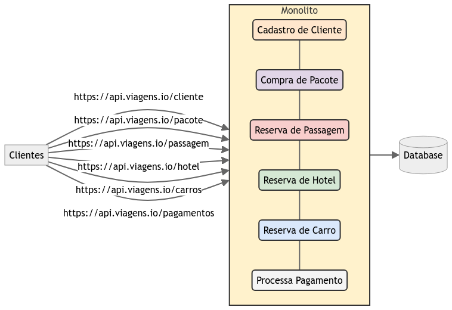

Exemplo de exposição direta de uma aplicação monolítica

Em microserviços a dinâmica é semelhante, mas o cliente passa a chamar
diretamente o microserviço responsável por cada funcionalidade, lidando com
diversas URLs distintas. O problema fica evidente quando todos esses endpoints
precisam ser públicos para consumidores como SPAs, apps mobile ou integrações de
terceiros.

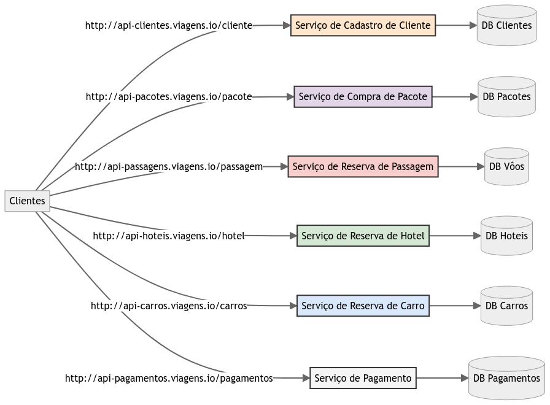

Exemplo de exposição direta de vários microserviços

Expor tudo publicamente é trabalhoso: cada cliente teria que conhecer todos os
endpoints, com URLs e documentações próprias, e cada time interno precisaria
implementar segurança (autenticação e autorização) de forma idêntica e alinhada
aos padrões da organização. Pior ainda no ciclo de vida da aplicação: substituir
um serviço antigo por uma solução moderna geraria trabalho extra inclusive para
os clientes de integração. Os API Gateways resolvem isso encapsulando os
sistemas internos do produto ou domínio e oferecendo um meio único de acessar
cada serviço.

# API Gateways em Arquiteturas de Microserviços

Em arquiteturas com dezenas ou centenas de serviços, o API Gateway simplifica a
interação dos clientes ao abstrair a complexidade do backend em um ponto de
entrada único e coeso. O cliente não precisa saber onde cada serviço está nem
como ele é dividido internamente, o que reduz a complexidade de ambos os lados.

Na prática, o Gateway encapsula a complexidade do sistema distribuído e expõe
endpoints simplificados, agrupando rotas e redirecionando solicitações para
diferentes microserviços a partir de um único ponto de contato.

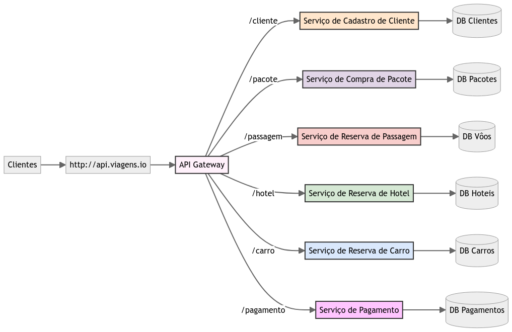

Exemplo funcional de exposição de vários microserviços através de um API Gateway

Cada requisição feita a um `recurso` ou `método` descrito no Gateway pode ser
encaminhada a um microserviço diferente. Essa flexibilidade ajuda tanto em
roteamentos simples quanto em cenários mais complexos, resolvendo questões de
governança e organização de produtos internos e externos.

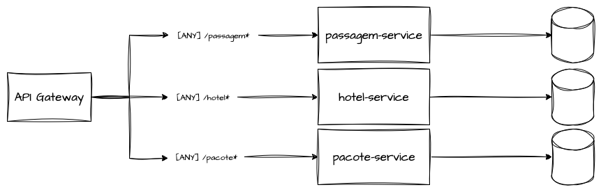

API Gateway redirecionando tráfego para diversos microserviços com base no path-prefix

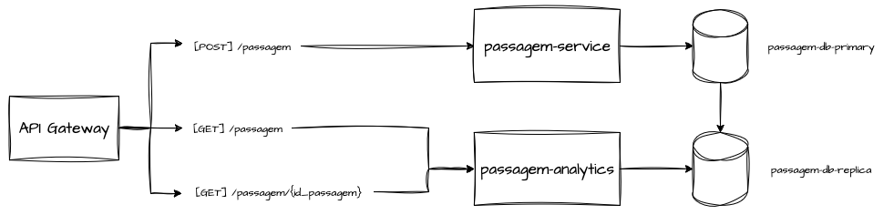

API Gateway redirecionando tráfego para diversos microserviços com base em regras mais específicas de método e path

Como o serviço fica totalmente abstraído por um recurso do Gateway, trocá-lo ou
substituí-lo torna-se simples. Respeitando os contratos pré-estabelecidos, é
perfeitamente viável trocar o backend "em voo", sem grandes impactos para o
consumidor.

# API Gateways e Load Balancers

É natural comparar API Gateways com Load Balancers e Proxies Reversos, já que
todos intermediam requisições entre clientes e um backend conhecido. Surge até a
dúvida se um Gateway poderia, em algum momento, substituir o balanceador de
carga.

A diferença está no foco. Balanceadores distribuem requisições entre N réplicas
da mesma aplicação, em diferentes camadas de rede (Layer 4 ou Layer 7), podendo
servir qualquer tipo de aplicação — páginas web, serviços RPC, bancos de dados ou
APIs REST. Já os API Gateways criam uma abstração unificada para diversos
endpoints construídos sobre HTTP (REST, WebSockets, etc.), concentrando-se em
governança de APIs: expor apenas os endpoints selecionados e gerenciar seu
consumo de forma granular — algo que as demais soluções, mais abrangentes, não
entregam.

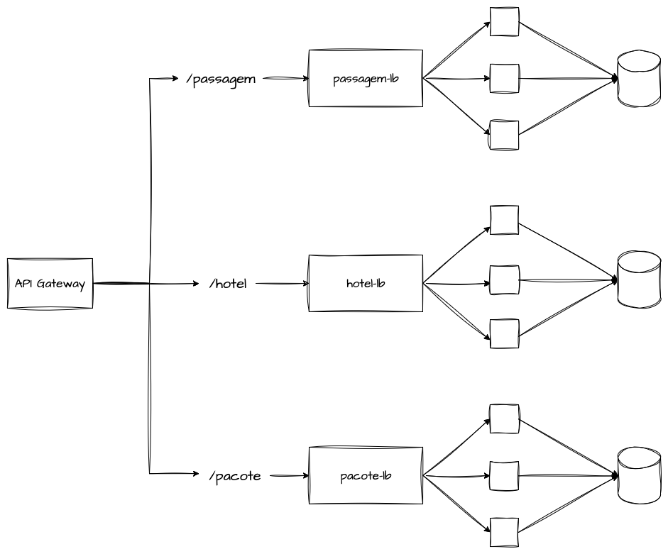

API Gateways tendo Load Balancers como Backend

Na prática, ambas as soluções convivem em conjunto: o API Gateway usa
balanceadores de carga como backend, delegando a eles a distribuição de tráfego
entre os hosts, a checagem de saúde e a resiliência.

# Componentes e Arquitetura de um API Gateway

Esta seção descreve os principais blocos que compõem um API Gateway e como cada
um contribui para eficiência, segurança e escalabilidade. Um Gateway típico
reúne vários componentes que cooperam no processamento das requisições:
**roteamento de requisições**, centralização de autenticação e autorização,
limitação de tráfego e throttling, modificação de mensagens e gerenciamento de
cache.

## Roteamento de Requisições

O roteamento centralizado é a funcionalidade nuclear do padrão. Com base nas
informações que o cliente fornece pelo próprio protocolo HTTP, o Gateway
direciona corretamente a chamada ao microserviço responsável — mesmo que o
cliente desconheça completamente os serviços que existem por trás dele.

## Autenticação e Autorização

**Autenticação é o processo de verificar a identidade do usuário**, enquanto a
**autorização determina quais recursos ou serviços ele pode acessar** conforme
suas permissões. De forma resumida: a autenticação diz ao sistema **quem você
é**, e a autorização diz **o que você pode fazer**.

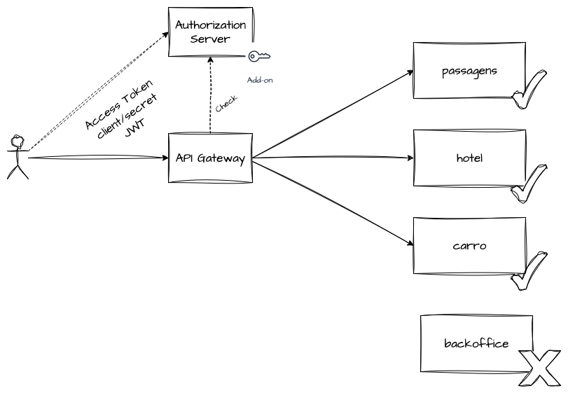

Muitos Gateways oferecem uma forma centralizada desse controle de acesso,
dispensando que cada microserviço implemente o mecanismo individualmente.
Centralizar autenticação e autorização no Gateway traz escalabilidade e clareza
arquitetural, embora em muitos casos seja necessário integrá-lo a um servidor de
identidade externo, responsável pelos provedores de autenticação e autorização.

## Limitação de Taxa (Rate Limiting) e Throttling

Para evitar sobrecarga nos sistemas adjacentes — e até na própria infraestrutura
do Gateway —, os API Gateways comumente aplicam mecanismos de limitação e
controle de uso dos recursos. Esses mecanismos são as implementações de **Rate
Limiting** e **Throttling**.

### Rate Limit

O Rate Limiting é o processo de **restringir o número de solicitações que um
usuário pode fazer a um serviço em um período determinado** — ou seja, controlar
a quantidade de recursos consumidos por uma aplicação ou cliente.

É uma estratégia valiosa para prevenir abusos pontuais e proteger o backend de
saturar. Imagine um serviço de compra de pacotes no basepath `/pacote` que
suporta até 100 requisições por segundo sem degradar — esse é o seu gargalo.

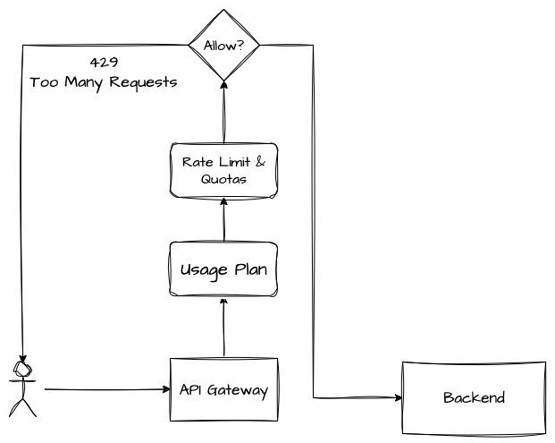

Com Rate Limiting, o Gateway segura tudo que ultrapassar os 100 TPS, evitando
repassar o excedente ao serviço. Além de medida preventiva, o limite de taxa
pode virar um recurso comercial: planos mais caros do produto liberam limites
maiores.

### Throttling

O Throttling, ou estrangulamento, é a **prática de controlar o consumo de
recursos quando os limites são atingidos**, normalmente reduzindo ou bloqueando
a taxa de solicitações permitidas. Pode ser consequência do Rate Limiting quando
este é ultrapassado em escala global do Gateway.

O Throttling pode ser **ativado temporariamente**, até que o backend se
estabilize diante da saturação dos sistemas adjacentes, e configurado como
recurso do próprio Gateway. Por exemplo: cada cliente pode fazer 10 requisições
por segundo, mas o Gateway, por suas próprias limitações de infraestrutura,
suporta até 10.000 transações por segundo. **Se a soma de todos os clientes
ultrapassar o limite do próprio Gateway, o Throttling entra em ação**, limitando
parcialmente o atendimento para restabelecer a saúde de toda a malha.

Uma boa analogia é a de um sistema de defesa térmica: quando uma peça atinge uma
temperatura perigosa, o mecanismo de Throttling **reduz drasticamente a
capacidade de funcionamento da máquina até a temperatura baixar**, diminuindo a
vazão para proteger a integridade do equipamento.

Em resumo, ambos controlam a quantidade de tráfego, mas o Rate Limiting age de
forma **preventiva** e o Throttling de forma **reativa**.

### Token Bucket

O **Token Bucket** é um dos algoritmos mais usados para implementar rate limits
em sistemas distribuídos. Ele funciona como um **balde de capacidade limitada de
tokens**, aplicável sobre uma dimensão de tempo e com escopos variados — conta,
usuário, tenant ou global.

A ideia é que os **tokens sejam adicionados a uma taxa fixa e constante** no
tempo (por exemplo, 100 tokens por segundo, 1000 por hora, 10 por segundo por
usuário), respeitando uma **capacidade máxima** do balde.

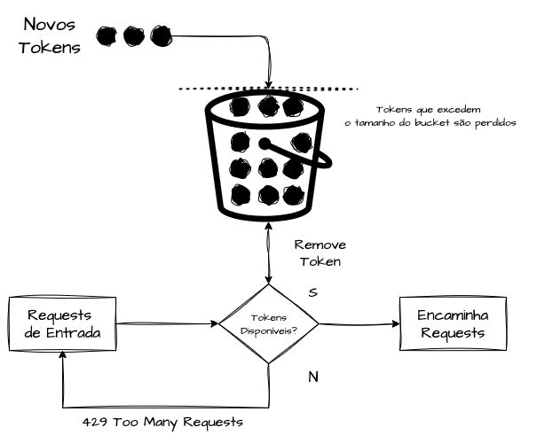

Ilustrando: um balde com capacidade de **200 tokens** e reposição de **100
tokens por segundo** permite ao cliente disparar até **200 requisições de uma
vez** (aproveitando os tokens acumulados), mas depois ele fica limitado a 100
por segundo. Cada requisição consome um token; se eles se esgotarem antes da
renovação, os requests são **negados** para proteger o backend.

Por trabalhar com limites "seguros e flexíveis", o Token Bucket costuma ser
implementado em Gateways apoiado por estruturas distribuídas como **Redis** e
outros bancos em memória, que mantêm contadores centralizados (e eventualmente
consistentes) entre múltiplas réplicas. Isso permite absorver **picos curtos
(bursts)** usando a reserva acumulada. Em contrapartida, sua consistência não é
forte: a nível de usuário ou conta pode ocorrer um **vazamento flexível de
tokens**, deixando passar alguns requests a mais por conta do tamanho do bucket.

### Leaky Buckets

O **Leaky Bucket** impõe um conceito de **saída constante**: independentemente do
volume de requisições que chega, a taxa de vazão é sempre mantida. Diferente do
Token Bucket — que acumula tokens para lidar com bursts —, o Leaky Bucket
trabalha apenas com **limites rígidos e previsíveis**, sem permitir requests além
da taxa definida, mas garantindo a **suavização total do tráfego** para o
backend. É ideal para sistemas que precisam de cadência controlada.

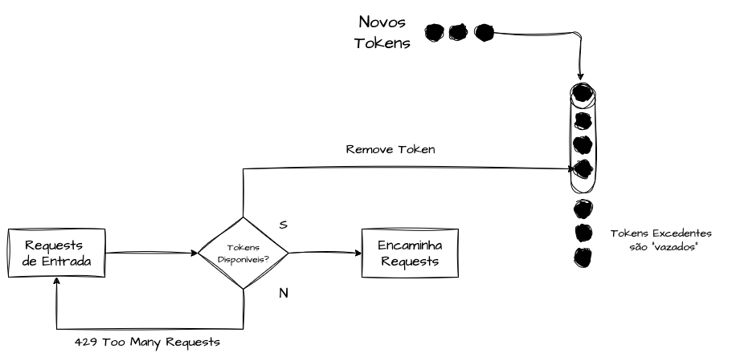

A distinção prática é o tamanho do balde: enquanto o Token Bucket pode ter
reposição de 50 tokens/s com bucket total de 200, o Leaky Bucket usa 50 tokens/s
com bucket total de **50**, nunca flexibilizando esse limite.

## Gerenciamento de APIs e Versionamento

Gerenciar APIs envolve criar, publicar, manter e monitorar as APIs. O
versionamento permite que múltiplas versões coexistam para atender diferentes
clientes e casos de uso ao longo do tempo. Normalmente isso se traduz em
reescrever a chamada ao backend, indo além do simples path do Gateway.

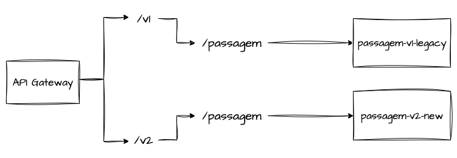

Gerir o tráfego entre duas versões do mesmo backend também é uma necessidade
real. De modo geral, os API Gateways podem oferecer release gradual — como um
**canary deployment** progressivo e controlado — facilitando a substituição "a
quente" de um serviço por outro, desde que ambos respeitem os mesmos contratos.

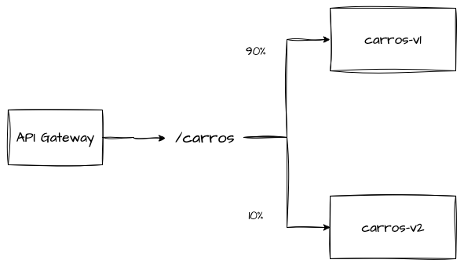

### Referências

* [What Is an API Gateway?](https://www.nginx.com/learn/api-gateway/)

* [JWT Introduction](https://jwt.io/introduction)

* [What Is an API Gateway & How Does It Work?](https://blog.hubspot.com/website/api-gateway)

* [API Gateways - Microservices](https://microservices.io/patterns/apigateway.html)

* [My experiences with API gateways…](https://mahesh-mahadevan.medium.com/my-experiences-with-api-gateways-8a93ad17c4c4)

* [O que é thermal throttling e como corrigir](https://canaltech.com.br/amp/hardware/o-que-e-thermal-throttling/)

* [WCF - Throttling e Pooling](http://www.linhadecodigo.com.br/artigo/1996/wcf-throttling-e-pooling.aspx#:~:text=Basicamente%20a%20id%C3%A9ia%20do%20Throttling,do%20servi%C3%A7o%2C%20independente%20de%20endpoints)

* [The Ultimate Guide to API Gateways](https://blog.softwareag.com/ultimate-guide-api-gateways/)

* [What is API Gateway on System Design ?](https://www.geeksforgeeks.org/what-is-api-gateway-system-design/)

* [API Gateway - System Design](https://medium.com/@karan99/system-design-api-gateway-6e6b41de45e3)
