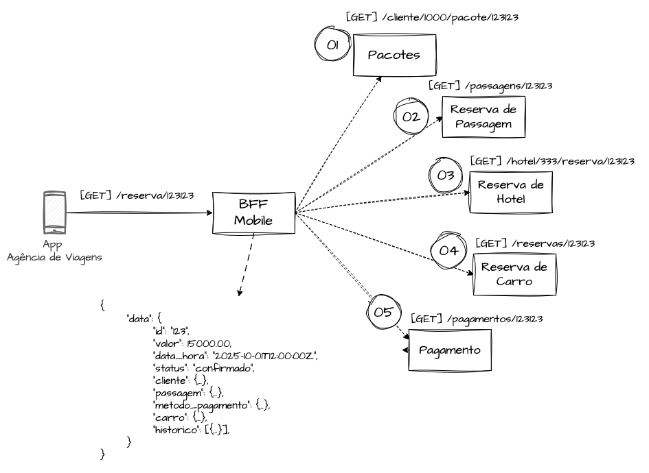
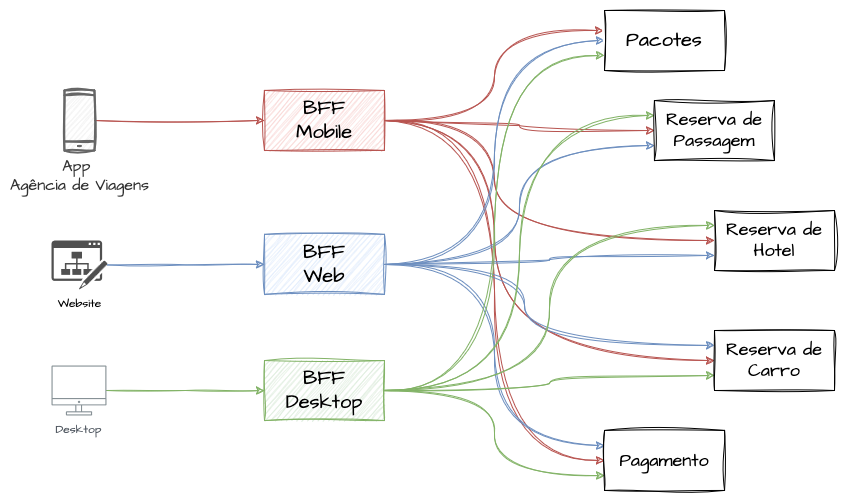
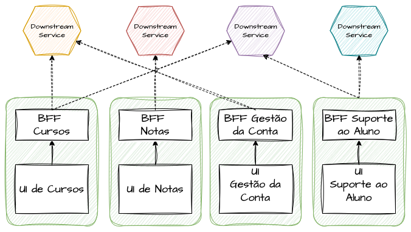
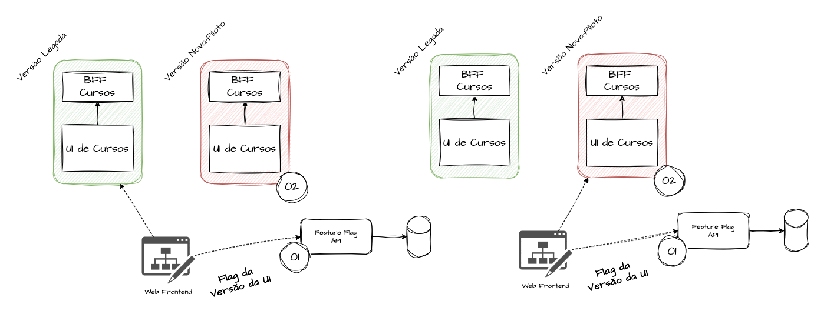
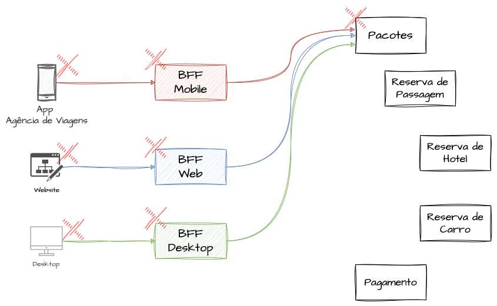
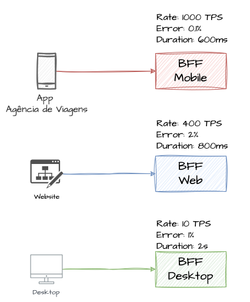

# System Design - Backend for Frontend (BFF)

- [System Design - Backend for Frontend (BFF)](#system-design---backend-for-frontend-bff)
- [Definindo Backend for Frontends](#definindo-backend-for-frontends)
- [Responsabilidades Arquiteturais](#responsabilidades-arquiteturais)
  - [API Composition Pattern nos BFF’s](#api-composition-pattern-nos-bffs)
  - [Segregação de Canais com BFF’s](#segregação-de-canais-com-bffs)
  - [Segregação de Microfrontends e BFF’s](#segregação-de-microfrontends-e-bffs)
  - [Versionamento de Interfaces e BFF’s](#versionamento-de-interfaces-e-bffs)
  - [Resiliência e Blast Radius em BFF’s](#resiliência-e-blast-radius-em-bffs)
  - [Desacoplamento de Métricas e Experiência de Uso](#desacoplamento-de-métricas-e-experiência-de-uso)
    - [Referências](#referências)

Neste capítulo iremos mais uma vez entrar na temática das capacidades de exposição de serviços, tal qual já abordado anteriormente em alguns cenários. Dessa vez iremos apresentar um pattern interessante que pode simplificar a interação entre frontends e diversos backends de forma simplificada e performática. No caso, iremos aprofundar um pouco das possibilidades arquiteturais dos BFF’s, ou Backend for Frontends. Comparado a outros artigos de exposição que ilustramos formas de dar um ponto único de contato, tanto a caráter de performance quanto de governança, os BFF’s possuem características mais simples e customizadas a nível do cliente-serviço que o consome.

# Definindo Backend for Frontends

Os BFFs, ou Backends for Frontends, são padrões arquiteturais que criam backends especializados para cada tipo de frontend. Em vez de utilizarmos um único backend responsável por atender requisições de todos os clientes e interfaces, concluímos que as requisições vindas de um cliente mobile possuem requisitos de negócio, segurança e escalabilidade diferentes dos de clientes web ou APIs públicas. Nesse contexto, criamos aplicações segregadas para intermediar e tratar de forma especializada cada tipo de consumo do serviço.

Os Backend For Frontends são de primeiro momento, facilmente confundidos com um componente de infraestrutura. Ao contrário de [API Gateways](https://fidelissauro.dev/api-gateway/) e de [balanceadores de carga e proxies reversos](https://fidelissauro.dev/load-balancing/), que são componentes de infraestrutura responsáveis por desacoplar os backends e fornecer interfaces unificadas para vários microsserviços, os BFFs são aplicações completas, com suas próprias características de capacidade, escalabilidade e segurança, e podem atuar como backends desses componentes de infraestrutura.

# Responsabilidades Arquiteturais

Os BFFs propõem a criação de um serviço intermediário responsável por simplificar a integração do frontend com os microsserviços necessários para executar as operações solicitadas pelo cliente. Para essa função, diversas responsabilidades podem ser acopladas ao BFF, tais como autenticação, autorização, acesso a cache, requisições a múltiplos serviços, composição de payloads, gestão de filtros, adaptação de contratos (renomear campos, formatar dados), ordenar listas e acionar fallbacks quando necessário.

Ao delegar essa série de tarefas e complexidades — antes exclusivas do cliente — aos BFFs, ganhamos em clareza de código, responsabilidade clara de cada funcionalidade, performance otimizada e isolamento de canais de frontend, como IoT, mobile, páginas web e dispositivos domésticos inteligentes.

## API Composition Pattern nos BFF’s

O API Composition Pattern refere-se à prática de consolidar diversas requisições a serviços backend distintos em um único ponto de entrada. Para simplificar esse fluxo para o frontend, podemos incorporar essa lógica no BFF, de modo que o canal de consumo realize apenas uma única requisição ao Backend for Frontend. Internamente, o BFF executa os demais requests, consolida e formata os payloads, e finalmente retorna a resposta ao cliente no formato esperado.

Dessa forma, minimizamos a latência de rede entre o cliente e múltiplos servidores, simplificamos o código do frontend e ganhamos flexibilidade para aplicar transformações, como filtragem de campos sensíveis, enriquecimento de dados ou ordenação específica, sem expor ao usuário a complexidade do ecossistema de microsserviços.

## Segregação de Canais com BFF’s

Na implementação de BFFs, assumimos que cada canal de usuário — desktop, web, mobile (iOS, Android) ou dispositivos domésticos e de IoT — pode ter requisitos distintos quanto ao formato de dados, volume de transações, comportamento e regras de cache. A segregação de canais em BFFs distintos implica criar instâncias e versões independentes para cada perfil de cliente, de modo que cada BFF conheça a jornada e os fluxos específicos do seu público-alvo.

Dessa forma, evitamos condicionais complexas no código e focamos nas necessidades específicas de cada canal. Por exemplo: Um Canal Web: pode servir conteúdo por meio de SSR (Server-Side Rendering), gerenciar sessão em um cache centralizado (por exemplo, Memcached) e realizar autenticação e autorização via tokens JWT, além de oferecer mais funcionalidades comparado a outros modos de acesso. Um Canal Mobile: costuma exigir respostas enxutas, compressão de dados mais intensa e funcionalidades de sincronização offline. Um Canal de IoT ou de Eletrodomésticos: precisa suportar conexões intermitentes, usar protocolos como [MQTT e WebSockets](https://fidelissauro.dev/mensageria-eventos-streaming/) e adotar uma gestão criteriosa de segurança e privacidade dos dados trafegados.

Todos esses cenários se beneficiam de interfaces de comunicação dedicadas, implementadas como seus respectivos Backends for Frontends.

## Segregação de Microfrontends e BFF’s

Em projetos que adotam a fragmentação da camada de visualização em microfrontends, cada módulo independente é mantido por um time com responsabilidades próprias. Nessa abordagem, faz sentido criar BFFs coesos e exclusivos para cada microfrontend, garantindo que cada equipe tenha autonomia e responsabilidade sobre sua funcionalidade específica. O BFF de cada módulo atua como um mini-orquestrador independente, encarregado de gerenciar e formatar os dados necessários — desde o carregamento de widgets e dashboards até o processamento de notificações e operações de CRUD — sem expor as complexidades dos microsserviços “core” para o restante da aplicação.

Essa estratégia, indicada principalmente para projetos de grande porte que reforçam a [Lei de Conway](https://fidelissauro.dev/monolitos-microservicos/), fortalece o princípio de equipes “end-to-end”, em que cada time domina toda a jornada da feature — do microfrontend ao seu backend dedicado — assegurando alinhamento total entre UI e APIs. Dessa forma também conseguimos isolar tanto o frontend quanto backend do mesmo dentro de uma mesma unidade de deployment se necessário, podendo realizar os dois no mesmo momento e realizando o rollback também da mesma forma.

## Versionamento de Interfaces e BFF’s

A aplicação correta e desacoplada de BFFs pode nos ajudar a testar novas versões de produtos e até descontinuar versões legadas. Por meio de [feature toggles e deployments inteligentes](https://fidelissauro.dev/deployment-strategies/), podemos ter várias versões do BFF em produção e alternar qual delas está ativa ou inativa. Quando lançamos uma nova versão de uma feature, produto ou frontend, podemos criar um BFF dedicado a essa versão, facilitando experimentações controladas com públicos específicos e evitando toggles adicionais ou condicionais complexas.

## Resiliência e Blast Radius em BFF’s

Visto que, por mais que os BFF’s sejam segregados pelo número de canais, ainda compartilham muito serviços de backend, ainda mais em sistemas distribuídos. Cada implementação do BFF’s devem garantir por padrão todos os [patterns de resiliência](https://fidelissauro.dev/resiliencia/) com suas dependências, tais como Circuit Breakers, acionamentos inteligentes de fallbacks, camadas de controle de timeouts e retries.

O conceito de blast radius em BFFs refere-se ao alcance de um evento de falha: mesmo com BFFs segregados por canal, todos podem ser impactados se compartilharem o mesmo serviço crítico. Para reduzir o blast radius, devemos trabalhar em [unidades de deployment independentes](https://fidelissauro.dev/deployment-strategies/) e bulkheads lógicos, isolando grupos de chamadas e limitando o escopo das falhas a apenas um subconjunto de funcionalidades. Além disso, deployments canary ou blue-green permitem validar novas versões do BFF em pequenos segmentos de tráfego antes de afetar toda a base de usuários. Combinando essas estratégias, conseguimos entregar uma camada do canal o mais proxima possível de algo altamente disponível e tolerante a falhas, mantendo a experiência do usuário consistente mesmo diante de instabilidades no backend.

## Desacoplamento de Métricas e Experiência de Uso

Ao adotar o padrão BFF, separamos a coleta e o tratamento de métricas da experiência direta do usuário. Quando segregamos a camada de contato com os serviços de “downstream” a nível de canais, podemos, por exemplo, desacomplar as métricas e análisar a experiência de cada um dos segmentos de uso de forma independente e segregada e obter e metrificar Service Levels para cada um deles. Dessa forma conseguimos verificar se a experiência de uso, por exemplo do canal mobile, está sendo impactado ou impactando pelo volume das outras interfaces como Web e etc. Por mais que a maioria dos serviços de downstream sejam compartilhados, ainda conseguimos capturar em termos de volume, error rate e tempo de resposta de cada tipo de canal.

### Referências

[Backend For Frontend: Uma estratégia sob medida para a entrega de microsserviços](https://medium.com/jeitosanar/backend-for-frontend-uma-estrat%C3%A9gia-sob-demanda-para-a-entrega-de-microsservi%C3%A7os-2f12d4cb9e3f)

[Arquitetura BFF — Back-end for Front-end](https://medium.com/digitalproductsdev/arquitetura-bff-back-end-for-front-end-13e2cbfbcda2)

[Pattern: Backends For Frontends](https://samnewman.io/patterns/architectural/bff/)

[Backend for Frontend Pattern](https://www.geeksforgeeks.org/backend-for-frontend-pattern/)
