# System Design - Service Mesh

- [System Design - Service Mesh](#system-design---service-mesh)
- [Definindo Service Mesh](#definindo-service-mesh)
- [Componentes de um Service Mesh](#componentes-de-um-service-mesh)
  - [Control Plane (Camada de Controle)](#control-plane-camada-de-controle)
  - [Data Plane (Camada de Execução)](#data-plane-camada-de-execução)
- [Modelos de Service Mesh](#modelos-de-service-mesh)
  - [Modelo Client e Server](#modelo-client-e-server)
  - [Sidecars](#sidecars)
  - [Sidecarless / Proxyless](#sidecarless--proxyless)
- [Funcionalidades Comuns dos Service Meshes](#funcionalidades-comuns-dos-service-meshes)
  - [Roteamento de Tráfego Inteligente](#roteamento-de-tráfego-inteligente)
  - [Balanceamento de Carga Dinâmico](#balanceamento-de-carga-dinâmico)
  - [Observabilidade e Telemetria Transparente](#observabilidade-e-telemetria-transparente)
  - [Segurança, Autenticação e Autorização](#segurança-autenticação-e-autorização)
  - [Criptografia de Tráfego e mTLS](#criptografia-de-tráfego-e-mtls)
  - [Resiliência na Camada de Comunicação](#resiliência-na-camada-de-comunicação)
- [Referências](#referências)

> **Nota:** Este documento é um material de estudo baseado no artigo original
> **"System Design - Service Mesh"**, de **Matheus Fidelis**, publicado em
> [fidelissauro.dev/service-mesh](https://fidelissauro.dev/service-mesh).
> As ilustrações pertencem ao autor original. Recomenda-se a leitura do artigo
> completo na fonte.

---

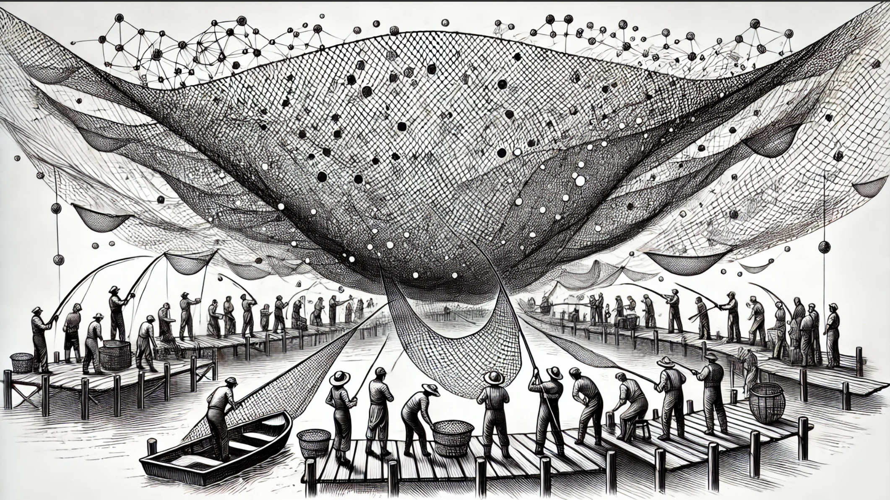

O conteúdo nasceu da síntese de uma aula sobre o tema e busca reorganizar, de forma conceitual, o que o mercado costuma esperar de um service mesh. A intenção é voltar às origens dos patterns de engenharia e tratar a malha de serviço de maneira pé-no-chão, longe das discussões puramente de produto.

Bem aplicada, a malha de serviço agrega resiliência, disponibilidade e inteligência a sistemas distribuídos de diferentes naturezas. Por isso o foco aqui é entender, de forma definitiva, o que é esse pattern e em quais cenários ele rende mais, abstraindo as implementações específicas para concentrar atenção no conceito.

# Definindo Service Mesh

Antes de tudo, o Service Mesh (Malha de Serviço) é um pattern de **networking**. Ele entrega, diretamente na camada de rede, mecanismos para lidar com a complexidade de comunicação entre muitos microserviços de um ambiente distribuído. Métricas, observabilidade, segurança, controle e resiliência passam a ser oferecidos de forma padronizada, transparente e desacoplada da aplicação — a ponto de os próprios participantes nem perceberem que estão dentro de uma malha.

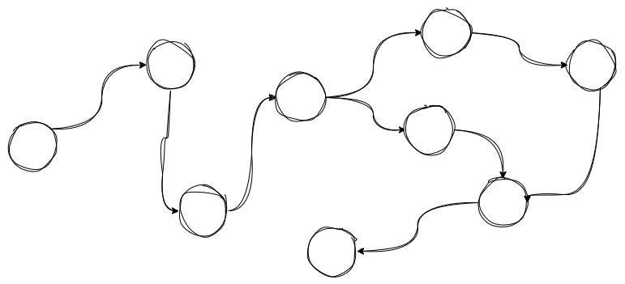

O nome "malha" remete à teia de componentes que conversam entre si — microserviços e suas dependências — consumidos por várias fontes o tempo todo, de modo padronizado ou não.

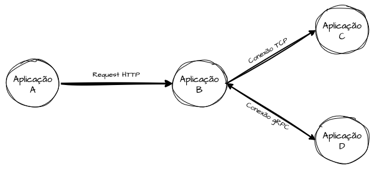

Atuando sobre os protocolos de rede, o Service Mesh evita que cada serviço reimplemente isoladamente segurança, balanceamento, autenticação, autorização, observabilidade e resiliência (retries, circuit breakers, service discovery). Essas responsabilidades migram para uma camada de comunicação dedicada e transparente, seja interceptando o tráfego com proxies, seja operando em camadas mais baixas, no próprio kernel.

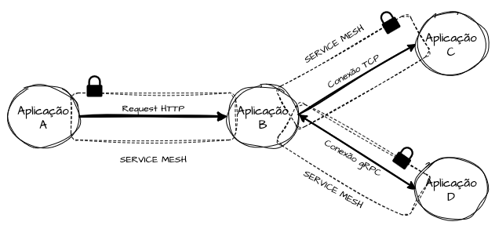

Na prática, o pattern estende conexões comuns como TCP, HTTP ou gRPC. Quando um componente abre conexão com outro para pedir dados ou executar comandos, o mesh intercepta essa conexão e injeta comportamentos extras, elevando segurança, resiliência e observabilidade num nível abstraído da aplicação.

Uma boa forma de captar a ideia é enxergar a rede como software: seus comportamentos, mecanismos e níveis de segurança passam a ser definidos de maneira declarativa e configurável.

# Componentes de um Service Mesh

As implementações costumam se dividir em dois componentes centrais: **Control Plane** (Plano de Controle) e **Data Plane** (Plano de Dados). Independentemente do modelo adotado, esses dois conceitos aparecem em algum nível e são complementares — definem o que, como e onde as regras serão executadas.

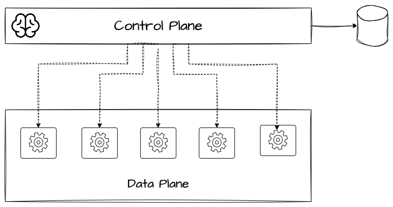

Essa separação permite gerenciar as regras de comunicação de forma centralizada e, em seguida, propagá-las a todos os componentes da malha, sem precisar atualizar cada microserviço individualmente. A comunicação fica completamente segregada e transparente.

## Control Plane (Camada de Controle)

O Control Plane define e persiste todas as regras da malha. Roteamentos baseados em host, header ou path; autorizações de comunicação entre serviços; políticas de chaveamento de tráfego entre versões — tudo isso fica armazenado nele, junto a um mecanismo que disponibiliza essas regras para consulta imediata pelos agentes do Data Plane, que são quem as aplica de fato.

## Data Plane (Camada de Execução)

Com as políticas definidas no Control Plane, elas são encaminhadas aos agentes do Data Plane, responsáveis pela execução real. O ideal é que o Data Plane altere o comportamento das comunicações de forma totalmente transparente, sem exigir reinicialização ou mudança direta no serviço.

Esses agentes costumam operar como proxies intermediários entre os serviços, interceptando chamadas sem que as aplicações saibam. Toda requisição entre um serviço e suas dependências passa por esse proxy, que decide o destino, valida a autorização e coleta métricas conforme as regras previamente configuradas.

# Modelos de Service Mesh

Ao olhar o mercado, todas as opções têm prós e contras, mas servem essencialmente ao mesmo fim: adicionar features na camada de rede. O que varia é o **como** isso é implementado — detalhe decisivo na hora de adotar a arquitetura. A seguir, as abordagens mais comuns, para ajudar a escolher o tipo de implementação que faz sentido para cada ambiente, produto ou plataforma.

## Modelo Client e Server

É talvez o modelo mais rudimentar, porque exige implementação direta na aplicação: ela precisa conhecer os endereços do Control Plane para renovar periodicamente suas configurações e políticas em memória.

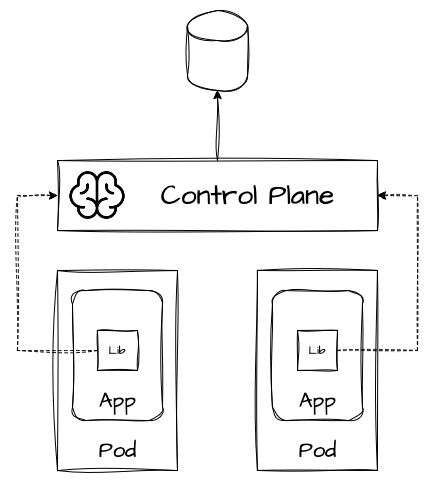

A entrega se dá por bibliotecas e SDKs específicos para cada linguagem. Assim, a própria aplicação assume a responsabilidade de atualizar e aplicar os comportamentos do Data Plane em tempo de execução.

Por consequência, é um modelo mais limitado em resiliência e segurança fora da aplicação, ficando menos abstraído e mais acoplado à lógica interna do serviço.

## Sidecars

A forma mais comum de implementar o Data Plane é via sidecars acoplados à aplicação. Em containers, isso significa adicionar um container extra dentro da menor unidade do orquestrador, encarregado de receber o tráfego de entrada e saída e decidir o roteamento. O sidecar busca proativamente as políticas mais recentes no Control Plane e aplica as regras de interceptação sem que a aplicação perceba.

No Kubernetes, por exemplo, cada pod ganha um container adicional rodando um proxy que intercepta as requisições e decide antes de repassá-las ao container da aplicação. Esta recebe o request já interceptado, autorizado e eventualmente modificado, sem saber de nada disso.

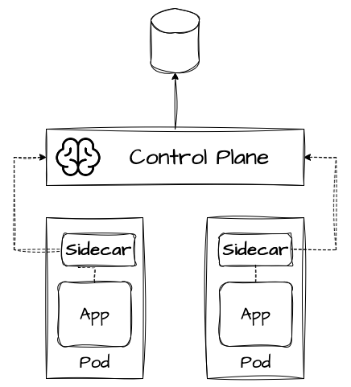

Toda a comunicação passa por esse proxy, que aplica balanceamento, retries, autenticação (mTLS), circuit breaking e coleta de métricas. Apesar de ser a abordagem mais difundida, é também a mais custosa computacionalmente, já que exige um componente adicional em cada réplica do serviço.

## Sidecarless / Proxyless

As propostas Sidecarless (ou Proxyless) são mais modernas e retomam a essência do pattern voltado a networking. Nesse modelo, as funções antes desempenhadas pelo proxy sidecar passam para componentes de rede ou para o kernel, compartilhados entre os serviços. Isso elimina o componente dedicado por instância, reduzindo CPU, memória e a latência da camada intermediária.

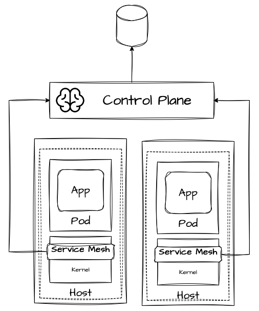

São, por natureza, mais econômicas e performáticas, pois operam na própria camada de rede ou capturando eventos no kernel do host, injetando trechos de código para decidir sobre as chamadas de sistema interceptadas.

Por ficarem mais próximas do sistema operacional, oferecem mais garantias em camadas baixas (camada 4, transporte), mas têm limitações nas funcionalidades típicas da camada 7 (aplicação). Para cobrir essa lacuna, é comum usar proxies compartilhados que assumem responsabilidades de L7, como retries, circuit breakers, controle de requisições e limitação de protocolos.

# Funcionalidades Comuns dos Service Meshes

O objetivo principal de adotar uma malha é incorporar comportamentos diretamente na camada de comunicação entre as aplicações. Esses comportamentos se desdobram em funcionalidades já conhecidas, agora aplicadas de forma transparente para os serviços da malha. A seguir, algumas delas — várias já vistas em capítulos anteriores — agora sob a ótica do service mesh.

## Roteamento de Tráfego Inteligente

A malha permite definir regras sofisticadas de roteamento entre serviços, encaminhando requisições por cabeçalhos, paths, versões ou pesos de tráfego. Isso viabiliza estratégias como canary, blue-green ou roteamento por contexto (device, geolocalização, tipo de cliente).

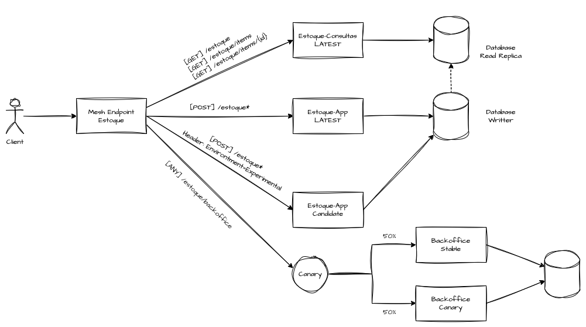

Essa granularidade é uma marca dos meshes que atuam em camada 7. Trabalhar com regras complexas de roteamento abre caminho para deployments mais inteligentes — Canary Releases, Blue/Green, Traffic Mirror, entre outros.

## Balanceamento de Carga Dinâmico

Balanceamento de carga é um dos pilares de sistemas distribuídos no que toca performance, capacidade, escalabilidade e resiliência. Dentro da malha, ele deixa de depender de um componente intermediário centralizado e passa a ser gerenciado pela própria camada de comunicação.

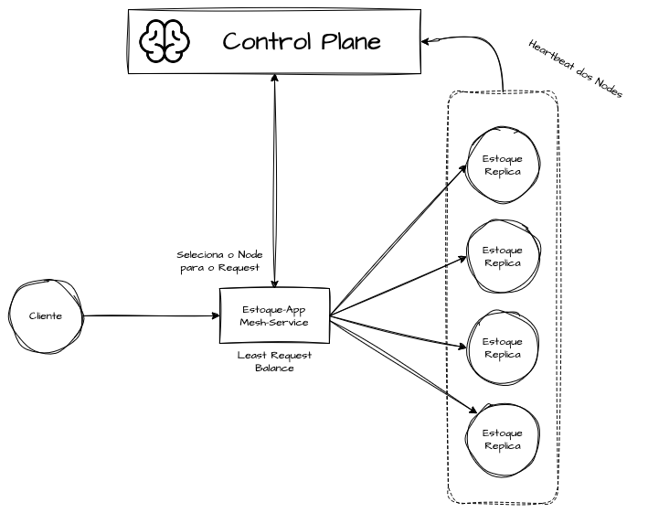

Com isso, dá para fazer health checks proativos e aplicar algoritmos variados — Least Request, Round Robin, IP-Hash, Least Connection — de forma isolada por microserviço, otimizando cada cenário. Para funcionar bem, o mesh precisa de service discovery, que registra os participantes do contexto de cada serviço.

## Observabilidade e Telemetria Transparente

Como é possível interceptar e enriquecer as conexões entre os componentes, a malha coleta métricas de latência, taxa de erro, throughput e tempo de resposta de forma fidedigna e transparente, sem componentes extras e sem o risco de métricas tendenciosas.

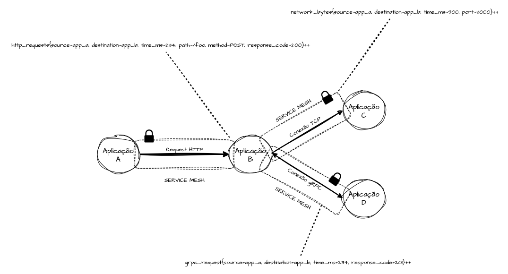

A mesma capacidade gera spans de tracing distribuído automaticamente, desacoplados das aplicações, fornecendo fontes confiáveis para troubleshooting, detecção de anomalias e análise de performance.

Observabilidade e telemetria de dia zero costumam ser um dos ganhos mais valiosos e imediatos de uma malha de serviço.

## Segurança, Autenticação e Autorização

Control Plane e Data Plane podem mapear quais serviços pertencem a determinados grupos. Durante a interceptação do tráfego, aplicam controles de acesso granulares na camada de comunicação, restringindo quem fala com quem e quais endpoints e métodos podem ser consumidos.

Em plataformas que hospedam muitos serviços de produtos, times ou clientes diferentes, esse controle permite segregar e isolar cargas de trabalho, negando ou permitindo acessos diretamente na rede, de forma performática e transparente.

## Criptografia de Tráfego e mTLS

Outro ganho de segurança é trafegar pacotes criptografados em ambas as pontas, de forma transparente. Com mTLS por padrão, toda a comunicação entre serviços é cifrada em trânsito, impedindo que payloads sensíveis sejam interceptados, alterados ou envenenados por componentes maliciosos, dentro ou fora da malha.

O mTLS também valida a identidade de origem e destino antes da conexão e permite a troca de chaves diretamente entre componentes intermediários, como os sidecars, tirando essa responsabilidade da aplicação.

Uma boa implementação deve ser transparente: nada de configurar certificados manualmente ou alterar código. O Control Plane gerencia emissão, rotação e revogação dos certificados, enquanto o Data Plane os aplica nos componentes intermediários — instruções no kernel ou proxies sidecar — de forma invisível aos serviços.

## Resiliência na Camada de Comunicação

Atuando na rede, a malha oferece mecanismos nativos e abstraídos contra falhas e instabilidades na comunicação. De forma transparente, é possível aplicar retries customizados (número de tentativas e intervalos), timeouts configuráveis para evitar conexões presas, circuit breakers que cortam chamadas a destinos com falhas persistentes e fallbacks com comportamentos alternativos — tudo sem que as aplicações percebam.

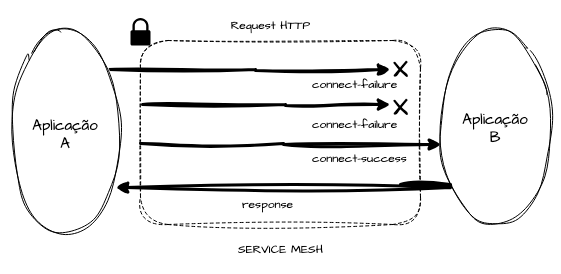

Também é possível injetar falhas intencionais na comunicação entre microserviços para testar e validar as estratégias de resiliência, preparando o ambiente para se manter disponível em situações adversas por meio de Fault Injection.

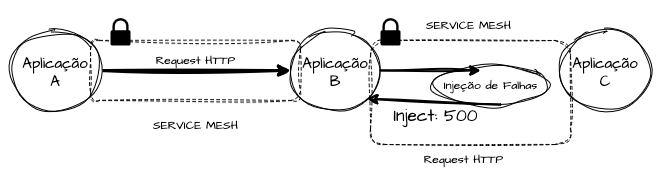

# Referências
* [Service mesh](https://www.redhat.com/pt-br/topics/microservices/what-is-a-service-mesh)

* [The Istio service mesh](https://istio.io/latest/about/service-mesh/)

* [Dissecting Overheads of Service Mesh Sidecars](https://dl.acm.org/doi/pdf/10.1145/3620678.3624652)

* [An Empirical Study of Service Mesh Traffic Management Policies for Microservices](https://dl.acm.org/doi/pdf/10.1145/3620678.3624652)

* [Service Mesh Patterns](https://dl.acm.org/doi/pdf/10.1145/3489525.3511686)

* [Istio - ZTunnel](https://github.com/istio/ztunnel)

* [Service mesh vs. API gateway](https://www.solo.io/topics/service-mesh/service-mesh-vs-api-gateway)

* [Introducing Ambient Mesh](https://istio.io/latest/blog/2022/introducing-ambient-mesh/)

* [Use the proxyless service mesh feature in gRPC services](https://www.alibabacloud.com/help/en/asm/use-cases/use-the-proxyless-service-mesh-feature-in-grpc-services)

* [Proxyless Service Mesh](https://dubbo.apache.org/en/overview/mannual/golang-sdk/tutorial/deploy2/proxyless_service_mesh/)

* [What is a Service Mesh?](https://konghq.com/blog/learning-center/what-is-a-service-mesh)

* [Service Mesh: O que é e Principais Características](https://www.luisdev.com.br/2022/06/15/service-mesh-o-que-e-principais-caracteristicas/)

* [O que é Fault Injection Testing](https://lbodev.com.br/glossario/o-que-e-fault-injection-testing/)
