# System Design - Paralelismo, Concorrência e Multithreading

- [System Design - Paralelismo, Concorrência e Multithreading](#system-design---paralelismo-concorrência-e-multithreading)
  - [O que é um Processo?](#o-que-é-um-processo)
  - [O que é uma Thread?](#o-que-é-uma-thread)
  - [O que é Multithreading?](#o-que-é-multithreading)
- [Concorrência](#concorrência)
    - [Exemplo de Implementação](#exemplo-de-implementação)
- [Paralelismo](#paralelismo)
    - [Implementando um algoritmo de paralelismo](#implementando-um-algoritmo-de-paralelismo)
  - [Paralelismo Externo vs Paralelismo Interno](#paralelismo-externo-vs-paralelismo-interno)
    - [Paralelismo Interno](#paralelismo-interno)
    - [Paralelismo Externo](#paralelismo-externo)
- [Paralelismo vs Concorrência](#paralelismo-vs-concorrência)
- [Lidando com Paralelismo e Concorrência](#lidando-com-paralelismo-e-concorrência)
    - [Deadlocks e Starvation](#deadlocks-e-starvation)
  - [Race Conditions - Condições de Corrida](#race-conditions---condições-de-corrida)
    - [Race Conditions e Last-Write-Wins](#race-conditions-e-last-write-wins)
  - [Mutex](#mutex)
  - [Mutex Distribuído](#mutex-distribuído)
    - [Exemplo de Implementação](#exemplo-de-implementação-1)
  - [Mutex Distribuído - Zookeeper](#mutex-distribuído---zookeeper)
    - [Exemplo de Implementação](#exemplo-de-implementação-2)
  - [Spinlock](#spinlock)
    - [Exemplo de Implementação](#exemplo-de-implementação-3)
  - [Semáforos e Worker Pools](#semáforos-e-worker-pools)
    - [Exemplo de Implementação:](#exemplo-de-implementação-4)
- [Referências](#referências)


Este artigo é o primeiro de uma série sobre System Design. Esta série tem como objetivo explicar conceitos complexos de programação de maneira simples e objetiva para todos os tipos de profissionais, independentemente do nível de senioridade ou tempo de experiência, contribuindo para a fixação de conceitos de ciências da computação e arquitetura.

Comecei a escrever esses textos em 2021, quando tinha a intenção de produzir material explicativo sobre engenharia para profissionais de Site Reliability Engineering (SRE). Hoje, revendo com uma nova perspectiva, consegui revisar esse material para torná-lo útil e acessível a todos.

Todos os artigos vão, em algum momento, utilizar analogias com o “mundo real” para tornar a lógica mais clara e facilitar a explicação e compreensão. Neste texto, vou explicar tópicos como Multithreading, Concorrência e Paralelismo.

Não é meu objetivo detalhar exaustivamente todos os aspectos do mundo ou explicar todos os tópicos envolvendo esse tema com termos complexos da literatura. Meu objetivo é que você compreenda os conceitos, consiga aplicar e, principalmente, explicar para outra pessoa usando os mesmos exemplos ou criando novos. Prometo tornar isso divertido.

Utilizaremos a linguagem de programação `Go` para exemplificar alguns algoritmos. Embora utilizemos recursos nativos como `Goroutines`, `Channels` e `WaitGroups`, a ideia não é tornar este material um artigo específico sobre a linguagem; Ele pode ser aproveitado conceitualmente para diversos contextos.

Vamos começar detalhando alguns conceitos que serão úteis durante o artigo:

## O que é um Processo?

Um processo é basicamente uma instância de um programa em execução. Esse programa contém uma série de instruções, e o processo é a execução real dessas instruções. Em outras palavras, um processo é um programa em ação.

Ao iniciarmos aplicativos como o navegador, IDE, agentes, aplicações, bancos de dados e outros serviços, o sistema operacional cria um processo para cada um desses programas, fornecendo os recursos necessários para sua execução. Isso inclui espaço de memória isolado, threads, contextos e a gestão do próprio ciclo de vida do processo.

## O que é uma Thread?

Uma Thread é a menor unidade de processamento que pode ser gerenciada por um sistema operacional. Ela representa uma sequência de instruções programadas que pode ser executada de forma independente em um núcleo de CPU. Dentro do mesmo processo, múltiplas threads podem ser utilizadas para realizar tarefas de forma concorrente, visando melhorar a eficiência do programa, enquanto uma thread aguarda por uma ação demorada, como uma requisição HTTP, o programa pode prosseguir com a execução de outras threads. As threads de um mesmo programa compartilham o mesmo espaço de memória e os recursos alocados. Sistemas que possuem múltiplas CPUs, ou CPUs com múltiplos núcleos, podem executar threads simultaneamente em núcleos diferentes da CPU, permitindo o paralelismo. Imagine as threads como várias tarefas menores que precisam ser realizadas em um churrasco.

## O que é Multithreading?

Multithreading é uma técnica de programação que consiste na criação de múltiplas threads (fluxos de execução independentes) dentro de um único processo. Cada thread pode ser responsável por diferentes tarefas ou partes de uma tarefa mais ampla. Este método pode ser aplicado tanto em contextos concorrentes quanto paralelos. Em sistemas com um único núcleo do processador, o multithreading facilita a concorrência (alternância rápida entre threads para criar a ilusão de simultaneidade). Já em sistemas multiprocessadores, ou com múltiplos núcleos, o multithreading pode alcançar paralelismo real, com threads sendo executadas simultaneamente em núcleos distintos da CPU, otimizando o uso dos recursos e melhorando a eficiência e o desempenho do processo.

Para ilustrar o conceito de multithread, pense em seu restaurante favorito. Aqui, o processo é o restaurante funcionando, com o objetivo de servir comida aos clientes. Durante um horário de pico, como o almoço em um dia útil, as threads são como os funcionários da cozinha. Cada cozinheiro (thread) é responsável por preparar um prato diferente simultaneamente, acelerando o atendimento dos pedidos. Dessa forma, vários pratos são preparados ao mesmo tempo, aumentando a eficiência e diminuindo o tempo de espera dos clientes.

Agora que já exploramos alguns conceitos teóricos importantes, podemos seguir com explicações mais detalhadas.

# Concorrência

Concorrência é sobre lidar com muitas tarefas ao mesmo tempo, mas não de forma simultânea. É a habilidade de uma aplicação gerenciar múltiplas tarefas e instruções em segundo plano no mesmo núcleo do processador, mesmo que essas instruções não estejam sendo processadas ao mesmo tempo, ou executadas em outros núcleos diferentes.


Em outras palavras, um sistema concorrente gerencia a interleaving (intercalação) de múltiplas unidades de execução — threads ou processos — permitindo que diferentes partes de um programa progridam de maneira independente no mesmo core do processador. O CPU alterna rapidamente entre todos os processos e threads existentes, alternando entre as tarefas (context switching).


Imagine que você está preparando um churrasco sozinho. Você é responsável por organizar a geladeira, fazer os cortes de carne, preparar os vegetais para os amigos vegetarianos, fazer caipirinhas e gelar a cerveja. Você alterna entre essas tarefas, trabalhando um pouco em cada uma, apesar de ser responsável por todas elas.

Este cenário é um exemplo de concorrência, onde você está gerenciando várias tarefas, mas não necessariamente trabalhando em mais de uma delas simultaneamente. Você se alterna entre as tarefas, criando a impressão de que tudo está progredindo ao mesmo tempo.

### Exemplo de Implementação

Agora, vamos criar um algoritmo que abstrai o nosso churrasco. Este algoritmo seguirá a lógica:

• Listar as atividades do churrasco.
• Executar essas tarefas em goroutines simultâneas, com cada uma aguardando seu respectivo tempo de preparo.
• Monitorar a conclusão das atividades.

```go
package main

import (
	"fmt"
	"sync"
	"time"
)

type Atividade struct {
	Nome string
	Tempo int
}

// Função para simular o tempo de preparo de cada atividade do churrasco
func preparar(item string, tempoPreparo int, churrasco chan<- string) {
	fmt.Printf("Preparando %s...\n", item)
	time.Sleep(time.Duration(tempoPreparo) * time.Second)
	churrasco <- item
}
```

```text
Preparando picanha...
Preparando costela...
Preparando linguica...
Preparando churrasqueira...
Preparando salada...
Preparando queijo...
Preparando bebidas...
bebidas foi preparado.
salada foi preparado.
churrasqueira foi preparado.
queijo foi preparado.
linguica foi preparado.
picanha foi preparado.
costela foi preparado.
```

[Exemplo de Concorrencia - Go Playground](https://go.dev/play/p/d7HzIKIRnD0)

# Paralelismo

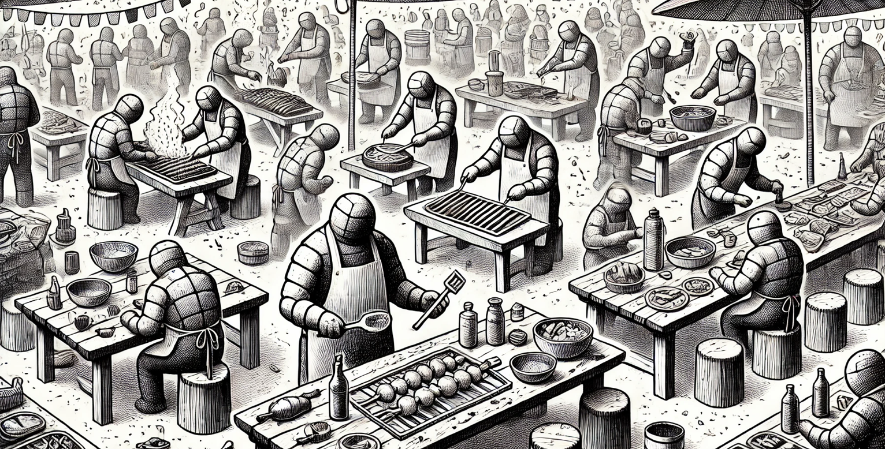

Ainda estamos no exemplo do churrasco. Desta vez você tem amigos para ajudar: um corta a carne, outro acende a churrasqueira, outro gela a cerveja e mais um faz a caipirinha. Todas essas tarefas estão ocorrendo em paralelo, com cada pessoa responsável por uma parte do processo.

Isso ilustra o paralelismo. Múltiplas tarefas e instruções ocorrendo simultaneamente, executadas por múltiplos núcleos de processadores.

Diferentemente da concorrência, onde se trata de gerenciar várias tarefas ao mesmo tempo, mas com apenas uma ativa por vez, o paralelismo envolve fazer várias coisas ao mesmo tempo.

O paralelismo é empregado em situações onde o desempenho e a eficiência são críticos, e há recursos suficientes, como múltiplos núcleos de CPU, para executar diversas tarefas simultaneamente.

Em ambientes paralelos, processos ou threads frequentemente precisam coordenar suas ações e comunicar-se entre si. Mecanismos de sincronização, como semáforos, mutexes e monitores, são ferramentas essenciais para evitar race conditions e garantir a consistência dos dados, embora isso possa acrescentar complexidade à programação e ao debugging de programas que implementam paralelismo.

O paralelismo em computação é um campo de pesquisa ativo e continua evoluindo, especialmente com o desenvolvimento de novas arquiteturas de hardware e a crescente demanda por processamento de grandes volumes de dados e computação de alto desempenho.

### Implementando um algoritmo de paralelismo

Vamos simular novamente um churrasco em código, mas agora sob condições de paralelismo. Neste snippet, vamos:

• Identificar quantos amigos (CPUs) estão disponíveis para ajudar no churrasco.
• Criar uma lista de atividades do churrasco, informando o tempo de preparo e quem é o responsável por cada tarefa.
• Determinar o número ideal de tarefas e distribuí-las entre os amigos de forma equilibrada.
• Alocar as tarefas entre os amigos (CPUs) em threads.
• Monitorar o output das tarefas.

```go
package main

import (
	"fmt"
	"runtime"
	"sync"
	"time"
)

type Atividade struct {
	Nome string
	Tempo int
    Resp string // Responsável
}
```

```text
Número de CPU's (amigos) pra ajudar no churrasco: 8.
Número tarefas do churrasco: 16.
Número tarefas pra cada CPU (amigo): 2.
Amigo 1 começou a prepação de picanha...
Amigo 3 começou a prepação de gelar cerveja...
Amigo 6 começou a prepação de abacaxi...
Amigo 2 começou a prepação de linguica...
Amigo 7 começou a prepação de molhos...
Amigo 5 começou a prep...
```

[Exemplo de Concorrencia - Go Playground](https://go.dev/play/p/2qEtDrT9p2V)

## Paralelismo Externo vs Paralelismo Interno

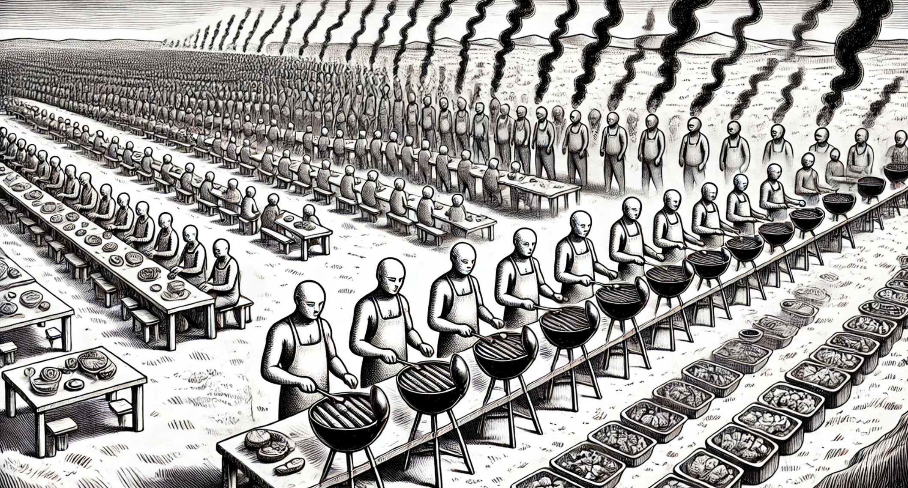

O paralelismo pode ser dividido em duas categorias: interno e externo.

### Paralelismo Interno

O paralelismo interno, também conhecido como paralelismo intrínseco, ocorre dentro de um processo. É o paralelismo que você implementa no código da sua aplicação quando precisa dividir tarefas ou itens em memória entre várias sub-tarefas que podem ser processadas simultaneamente. Basicamente, é o paralelismo que você cria via código para ser executado dentro do seu container ou servidor.

### Paralelismo Externo

Já o paralelismo externo refere-se à execução simultânea de múltiplas tarefas em diferentes hardwares, máquinas ou containers. Esse conceito é aplicado em ambientes de computação distribuída, como Hadoop e Spark, consumo de mensagens vindas de message brokers como RabbitMQ, SQS, streamings como Kafka que distribuem grandes volumes de dados em vários servidores e instâncias para realizar tarefas de ETL, Machine Learning e Analytics. Também é visto em Load Balancers, que dividem as requisições entre várias instâncias da mesma aplicação para distribuir o tráfego.

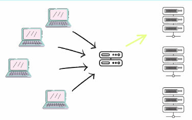

# Paralelismo vs Concorrência

Após uma análise detalhada, conseguimos distinguir conceitualmente concorrência de paralelismo. A concorrência lida com a execução de várias tarefas ao mesmo tempo, permitindo que um sistema execute múltiplas operações aparentemente simultâneas. Já o paralelismo envolve a execução literal de várias operações ou tarefas ao mesmo tempo.

Concorrência no mais, significa também ter várias tarefas em paralelo onde você não tem controle na ordem que elas serão processadas, tendo em vista que só é possível saber a ordem de execução após todas elas terem terminado.

Em sistemas com um único núcleo de CPU, a concorrência é normalmente alcançada através de multithreading, onde as tarefas são alternadas rapidamente, criando a ilusão de execução simultânea. Por outro lado, o paralelismo requer hardware com múltiplos núcleos, permitindo que cada núcleo execute diferentes threads ou processos simultaneamente.

Paralelismo em geral é concorrênte, mas nem toda concorrência é paralela.

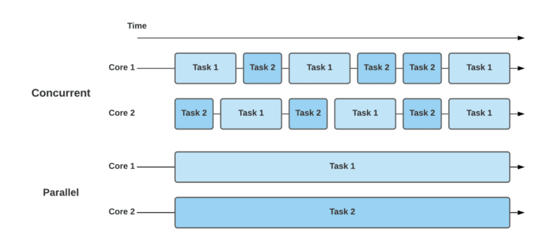

# Lidando com Paralelismo e Concorrência

Agora que já detalhamos de forma lúdica e conceitual a definição de programação paralela e concorrente, é hora de explorar os desafios e ferramentas existentes para trabalhar com essas estratégias. Embora abordagens paralelas e concorrentes ofereçam várias vantagens, como melhoria de performance, escalabilidade e otimização de recursos, elas também trazem desafios significativos. Estes incluem questões de coordenação, condições de corrida, deadlocks, starvation, balanceamento de carga de trabalho entre outros. Vamos agora definir conceitualmente alguns desses termos para facilitar seu entendimento e capacidade de explicá-los no futuro.

### Deadlocks e Starvation

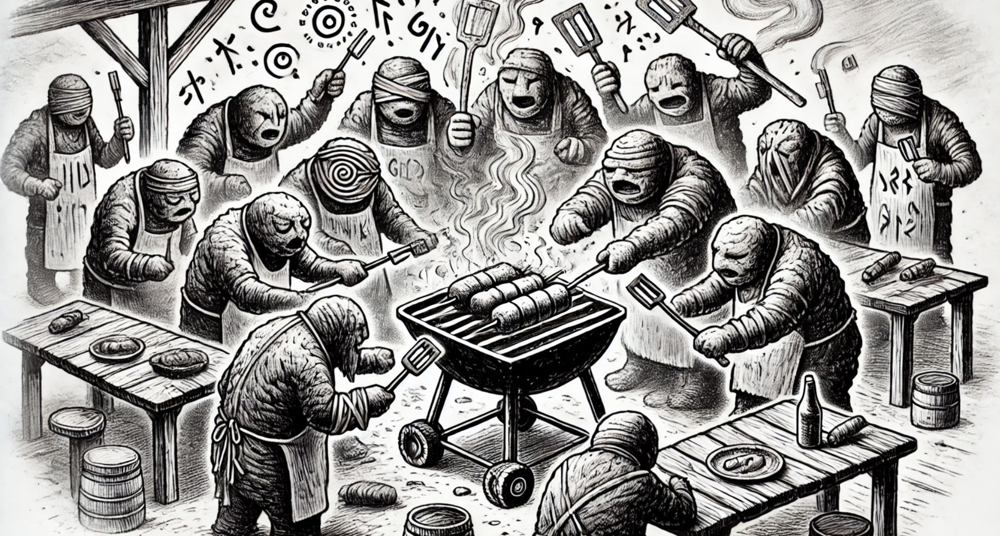

Imagine que você está usando a grelha, um recurso compartilhado no seu churrasco, para preparar o pão de alho, enquanto seu amigo está segurando a espátula (lembre-se, nada de furar a carne com garfo, pelo amor de Deus…), outro recurso essencial. Você precisa da espátula, e seu amigo precisa da grelha. Ambos aguardam que o recurso do outro fique disponível, mas nenhum de vocês libera o recurso que possui, criando um impasse onde nenhuma das tarefas pode prosseguir. Isso exemplifica um Deadlock.

Um deadlock ocorre quando duas ou mais threads (ou processos) entram em um estado de espera permanente, pois cada uma está esperando por um recurso que está sob posse da outra. Em suma, existe um ciclo de dependências de recursos que impede qualquer avanço.

Agora, imagine outra situação onde cada um precisa preparar sua própria refeição devido a preferências específicas de ponto da carne. Seu grupo de amigos se divide entre os mais ágeis, cara-de-pau e esfomeados, e os mais educados e lentos. À medida que as grelhas ficam disponíveis, o primeiro grupo ocupa rapidamente os espaços, deixando pouco ou nenhum acesso para o segundo grupo. Como resultado, as pessoas mais tranquilas enfrentam dificuldades para assar sua comida, experimentando uma espécie de Starvation.

Starvation, ou inanição, ocorre quando uma ou mais threads não conseguem acessar os recursos necessários por um longo período. Isso é frequentemente causado por uma alocação de recursos desigual, onde certas threads são priorizadas em detrimento de outras.

## Race Conditions - Condições de Corrida

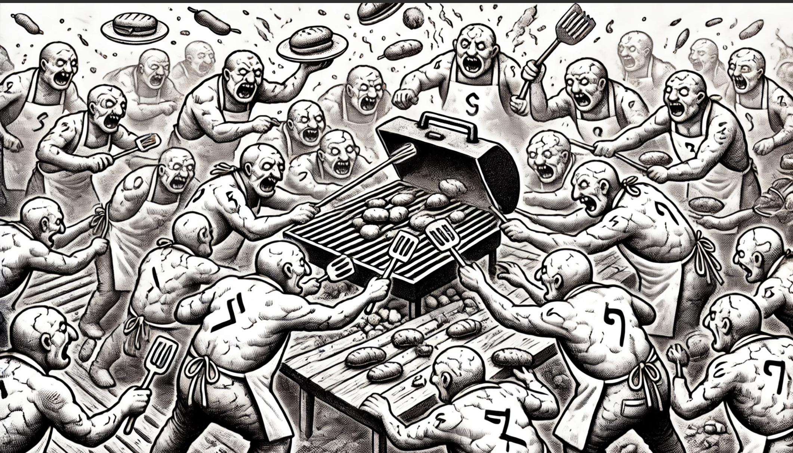

Imagine que você está organizando outro churrasco com seus amigos. Desta vez, há apenas uma churrasqueira disponível para grelhar todos os alimentos. Vocês precisam preparar picanha, maminha, legumes, abacaxi, linguiça, pão de alho e mais. A churrasqueira é pequena e só permite assar um tipo de alimento por vez. Aqui, a churrasqueira representa um recurso compartilhado, e uma Race Condition (condição de corrida) pode surgir se todos os alimentos forem preparados para assar simultaneamente.

Uma Race Condition é um fenômeno comum quando um recurso compartilhado é acessado e modificado por várias tarefas ou threads em paralelo. O estado final desse recurso pode depender da ordem em que as modificações são realizadas, que pode variar a cada execução.

Por exemplo, considere o seguinte algoritmo:

• Inicialmente, temos um número definido de itens (como `100`) disponíveis para serem grelhados.
• Temos um contador que registra o número de itens que foram grelhados.
• Idealmente, se começarmos com `100` itens disponíveis, o contador de itens grelhados também deveria terminar com o valor `100`.

Contudo, em uma situação de race condition, o resultado pode ser diferente do esperado devido à sobreposição e interferência das operações realizadas pelas várias threads. Por exemplo, dois ou mais amigos podem tentar colocar diferentes itens na churrasqueira ao mesmo tempo, resultando em confusão e possíveis erros no processo de contagem.

```go
package main

import (
	"fmt"
	"sync"
	"time"
)

// Variável compartilhada para contar os alimentos grelhados
var grelhados int = 0

// Função para simular o tempo de preparo de um alimento na churrasqueira
func grelhar() {
	grelhados++
	time.Sleep(time.Millisecond * 100)
}

func main() {
	// Wait Group para esperar todas as goroutines terminarem
	var wg sync.WaitGroup
	
	// Alimentos disponíveis pra colocar na grelha
	var alimentosChurrasco = 100
    
    // Simula...
}
```

Podemos observar que o resultado varia de acordo com a ordem e o tempo que as goroutines acessam o contador. Esse é o cerne do problema de race condition: a inconsistência dos resultados devido ao acesso simultâneo ao mesmo recurso. Embora a analogia com o churrasco seja útil para ilustrar o conceito, na realidade prática de um churrasco, a grelha não comportaria todos os alimentos ao mesmo tempo. Portanto, a situação de race condition, neste contexto, seria menos provável, já que a limitação física da grelha impõe um controle natural sobre o acesso simultâneo. No entanto, em sistemas de computação, onde múltiplas threads podem acessar e modificar o mesmo recurso sem uma devida sincronização, a race condition se torna um problema significativo e desafiador.

```text
❯ go run problem/main.go
Total de itens grelhados na churrasqueira: 97
❯ go run problem/main.go
Total de itens grelhados na churrasqueira: 96
❯ go run problem/main.go
Total de itens grelhados na churrasqueira: 100
❯ go run problem/main.go
Total de itens grelhados na churrasqueira: 99
❯ go run problem/main.go
Total de itens grelhados na churrasqueira: 97
❯ go run problem/main.go
Total de itens grelhados na churrasqueira: 100
❯ go run problem/main.go
Total de itens grelhados na churrasqueira: 99
```

[Exemplo de Race Condition - Go Playground](https://go.dev/play/p/QQQwp9YuikV)

### Race Conditions e Last-Write-Wins

Em sistemas distribuídos, uma race condition pode ocorrer quando temos eventos que precisam ser processados em uma sequencia definida, são recebidos ou aplicados fora de ordem, resultando em um estado inconsistente no sistema. Diferente do contexto tradicional de paralismo interno de threads competindo por um recurso de memória compartilhada, nas arquiteturas distribuídas a race condition ocorre entre mensagens, eventos ou atualizações de estado que trafegam por canais assíncronos, onde a entrega, a ordem e a latência não são determinísticas.

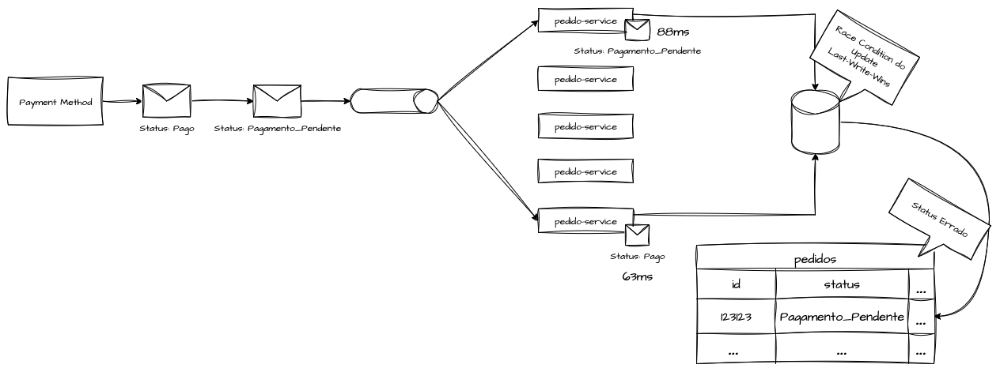

Considere um sistema de pagamentos que se comunica com um sistema de pedidos por meio de uma message broker, após o processamento de uma transação o sistema de pagamento publica dois eventos sequenciais, o `Pagamento_Pendente` e em sequencia o evento `Pago` com a confirmação do pagamento. No fluxo ideal, o consumidor do sistema de pedidos deveria processar esses eventos na ordem de emissão, transicionando o estado do pedido de “aguardando pagamento” para “pago”. No entanto, como o barramento de mensagens não garante entrega ordenada existindo a possibilidade de que o evento `Pago` seja consumido em pequenos instantes antes de `Pagamento_Pendente`.

Esse fenômeno, comum em sistemas distribuídos, caracteriza uma race condition interprocessual. Esse comportamento é agravado quando a arquitetura não adota o modelo de “last-write-wins”, no qual o sistema não verifica a coerência temporal ou causal das atualizações, aplicando simplesmente o último evento recebido como a verdade vigente sem checagens temporal da emissão das solicitações.

O Last-Write-Wins é uma estratégia de resolução de conflitos usada em sistemas distribuídos para determinar qual atualização deve prevalecer quando há escritas concorrentes sobre o mesmo dado. Quando duas ou mais réplicas modificam o mesmo registro quase ao mesmo tempo e o sistema precisa decidir qual versão manter como “a correta”. Para isso as requisições precisam ser enriquecidas com timestamps atômicos da solicitação, para que seja possivel realizar esse tipo de verificação de forma sistemica.

## Mutex

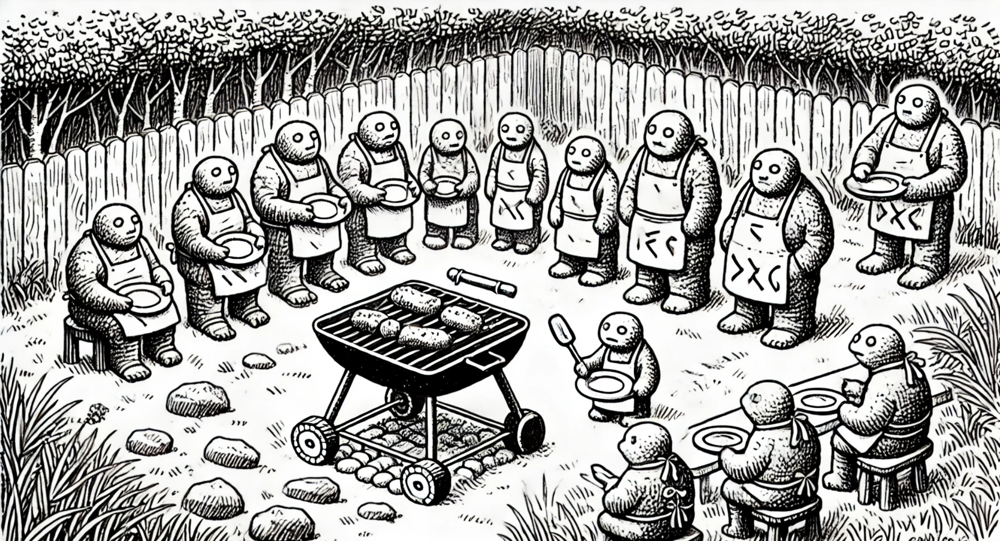

Voltando ao churrasco, após observar o exemplo de Race Conditions, concluímos que é impossível assar todos os alimentos ao mesmo tempo na grelha, já que ela só comporta um item por vez. Portanto, é necessário que alguém do churrasco fique responsável por assar os alimentos em sequência.

Como a churrasqueira é um recurso compartilhado, essa pessoa atuará como uma “trava” para o uso da churrasqueira: um alimento é assado, e então o próximo é colocado. Esse cenário ilustra a função de um Mutex.

“Mutex” é a abreviação de Mutual Exclusion (Exclusão Mútua) e é uma estratégia eficiente para controlar o acesso a um recurso compartilhado em ambientes de multithreading, paralelismo ou concorrência. Ela possibilita um acesso sequencial e organizado aos recursos, sendo uma das principais ferramentas para programação concorrente e paralela.

O principal objetivo do Mutex é evitar Race Conditions, como visto anteriormente, garantindo que apenas uma thread por vez possa acessar um recurso. As operações básicas de um Mutex são “lock”, para bloquear o acesso ao recurso, e “unlock”, para liberá-lo para a próxima thread.

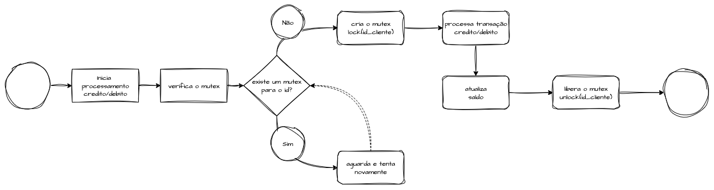

Estas operações de lock/unlock também devem respeitar uma certa prioridade, ou seja, apenas a thread que bloqueou o recurso pode desbloqueá-lo.

Sem um Mutex, todos tentariam usar a churrasqueira simultaneamente, resultando em confusão, disputas e, possivelmente, alimentos mal preparados ou queimados.

Contudo, o uso de Mutexes não está isento de riscos, sendo o principal deles o Deadlock. Um Deadlock ocorre quando várias threads tentam bloquear múltiplos Mutexes em uma ordem inconsistente.

No Go, podemos trabalhar com Mutexes através do pacote `sync`. Para solucionar o problema de race condition com a grelha, podemos:

• Criar um orquestrador para o uso da grelha, chamado `grelhaOcupada`, usando o `sync.Mutex`.
• Durante a preparação, na função `grelhar()`, inserimos um `Mutex.Lock()` no início e um `Mutex.Unlock()` no final para liberar o recurso para a próxima thread.
• Assim, garantimos um acesso sequencial a todos os processos para grelhar itens na churrasqueira.

```go
package main

import (
	"fmt"
	"sync"
	"time"
)

// Variável compartilhada para contar os alimentos grelhados
var grelhados int = 0
// Variável de Mutex
var grelhaOcupada sync.Mutex

// Função para simular o tempo de preparo de um alimento na churrasqueira
func grelhar() {
	grelhaOcupada.Lock() // Trava o acesso ao contador (grelha)
	fmt.Println("Grelhando um alimento na churras...
```

```text
...
Grelhando um alimento na churrasqueira
Liberando a grelha pro proximo alimento
Grelhando um alimento na churrasqueira
Liberando a grelha pro proximo alimento
Grelhando um alimento na churrasqueira
Liberando a grelha pro proximo alimento
Grelhando um alimento na churrasqueira
Liberando a grelha pro proximo alimento
Grelhando um alimento na churrasqueira
Liberando a grelha pro proximo alimento
Grelhando um alimento na churrasqueira
Liberando a grelha pro proximo alimento
Total de itens grelhados na churrasqueira: 100
```

[Exemplo de Mutex - Go Playground](https://go.dev/play/p/sjqz6rD_aYB)

## Mutex Distribuído

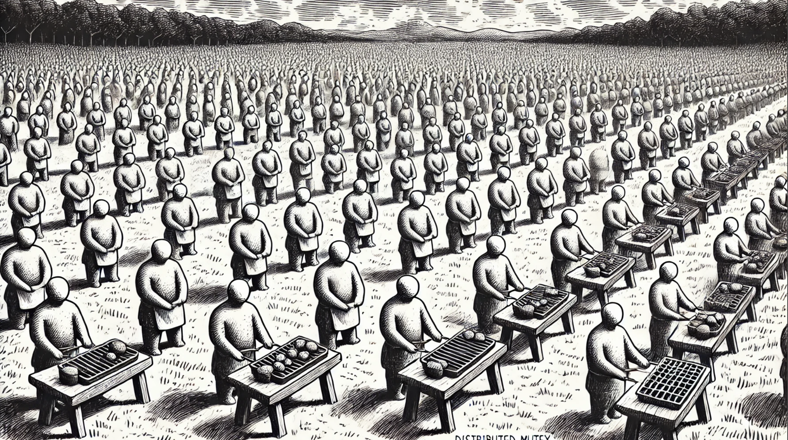

Já exploramos o uso de Mutex no modelo de paralelismo interno, onde o controle de paralelismo é implementado via código. É igualmente importante entender a aplicação dessa lógica no paralelismo externo, em cenários arquiteturais diversos como o consumo de mensagens de uma fila, eventos de um tópico do Kafka, tratamento de solicitações HTTP e outras situações que demandam idempotência, atomicidade e exclusividade em determinados processos.

Desenvolver um Mutex para sistemas distribuídos apresenta uma série de desafios, mas em alguns aspectos, é mais facilitado do que os Mutexes em cenários de paralelismo interno com memória compartilhada. Entre os possíveis problemas que podemos encontrar estão a comunicação entre componentes, latência de rede e falhas gerais nos serviços.

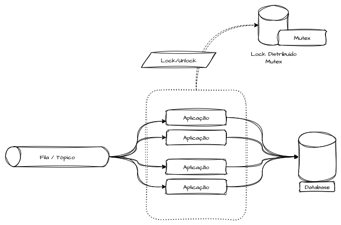

Para funcionar eficientemente, esses sistemas geralmente dependem de uma base de dados centralizada para manter o estado dos processos compartilhados entre todas as réplicas dos consumidores de mensagens. Isso é crucial para lidar com duplicidade de mensagens, eventos ou solicitações devido a cenários imprevistos.

Algumas estratégias comuns utilizam bancos de dados otimizados para operações de leitura e escrita chave/valor, como Redis, Memcached, Cassandra, DynamoDB, além de tecnologias como Zookeeper.

No exemplo a seguir, que utilizamos o Redis para apresentar um fluxo lógico de um algoritmo de Mutex. Ao receber uma pseudo-mensagem, verificamos se já existe um lock para ela no Redis. Se o lock existir, descartamos o processamento da mensagem. Se não existir, criamos o lock, processamos a mensagem e, em seguida, liberamos o lock.

### Exemplo de Implementação

```go
package main

import (
    "context"
    "fmt"
    "time"
    redis "github.com/redis/go-redis/v9"
)

type PedidoDeCompra struct {
    Id string
    Item string
    Quantidade float64
}

// Funç...
```

```text
❯ go run main.go
Mutex criado para o recurso por 10s: 12345
Processando pedido: 12345
Pedido processado: 12345
Mutex liberado para o recurso: 12345
```

Caso outro processo tentasse acessar o recurso 12345 durante a execução do primeiro receberia o seguinte retorno:

```text
❯ go run main.go
Mutex travado para o recurso 12345
```

Esse é um exemplo simples pra entendimento do algoritmo que não trata todos os cenários de um ambiente produtivo. Para isso eu recomendo o uso de alguma biblioteca especifica para locks no Redis como [RedisLock](https://github.com/bsm/redislock)

## Mutex Distribuído - Zookeeper

Uma alternativa elegante ao Redis para gerenciar locks distribuídos é o uso do Apache Zookeeper. Embora a lógica fundamental seja semelhante ao exemplo anterior, o Zookeeper apresenta algumas peculiaridades interessantes.

A criação de um mutex distribuído em Go utilizando Apache Zookeeper é uma tarefa avançada que exige a manipulação de znodes (nós do Zookeeper) para gerenciar as travas de forma distribuída. Vamos explorar um exemplo básico de como isso pode ser implementado.

Uma vantagem notável dos locks do Zookeeper é a capacidade de definir um timeout de sessão. Isso garante que todos os locks gerenciados pelo processo sejam excluídos automaticamente após o término da execução do programa.

Segue a lógica para o uso do Zookeeper na gestão de locks:

• Verificação de Lock: Checar se já existe um lock para o recurso específico.
• Gerenciamento de Mensagem: Caso o lock exista, a mensagem é ignorada e retornada ao pool. Se não existir, prosseguir para o próximo passo.
• Criação de Lock: Estabelecer um lock para o recurso.
• Processamento da Solicitação: Realizar as operações necessárias enquanto o lock está ativo.
• Remoção do Lock: Após o processamento bem-sucedido, remover o lock para liberar o recurso.

### Exemplo de Implementação

```go
package main

import (
	"fmt"
	"time"
	"github.com/go-zookeeper/zk"
)

type PedidoDeCompra struct {
	Id string
	Item string
	Quantidade float64
}

// Função mock para exemplificar a chegada de alg...
```

```text
2023/11/30 08:08:38 connected to 0.0.0.0:2181
2023/11/30 08:08:38 authenticated: id=72058178855239682, timeout=40000
2023/11/30 08:08:38 re-submitting `0` credentials after reconnect
Mutex criado para o recurso /123456
Processando pedido: 123456
Pedido processado: /123456
Mutex liberado para o recurso: /123456
```

```text
2023/11/30 08:05:19 connected to 0.0.0.0:2181
2023/11/30 08:05:19 authenticated: id=72058073710329942, timeout=40000
2023/11/30 08:05:19 re-submitting `0` credentials after reconnect
Mutex travado para o recurso /12345
2023/11/30 08:05:19 recv loop terminated: EOF
2023/11/30 08:05:19 send loop terminated: <nil>
```

## Spinlock

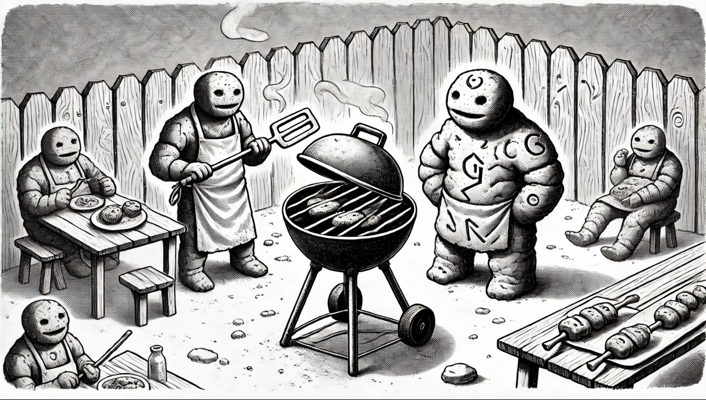

Imagine novamente o churrasco com seus amigos, onde há uma única grelha que todos desejam utilizar para assar diferentes alimentos. Diferentemente do Mutex, onde se espera pacientemente pela liberação do recurso, no caso do Spinlock, cada pessoa permanece ao lado da grelha, verificando constantemente se ela está livre. Assim que a grelha fica disponível, a pessoa que está verificando naquele exato momento a utiliza.

Um spinlock é um mecanismo de sincronização utilizado em ambientes de programação concorrente para proteger o acesso a recursos compartilhados. A ideia por trás de um spinlock é relativamente simples: em vez de bloquear uma thread e fazê-la entrar em estado de espera (sleep) quando tenta acessar um recurso já bloqueado, a thread continua ativa (girando) em um loop até que o lock seja liberado.

Esta abordagem de “girar” em um loop, constantemente verificando se o recurso está disponível, é eficaz em cenários onde o tempo de espera pelo recurso é relativamente curto, pois evita o overhead associado ao bloqueio e desbloqueio de threads. No entanto, em situações onde o recurso permanece bloqueado por períodos mais longos, o spinlock pode ser menos eficiente, pois a thread continua consumindo recursos de CPU enquanto “gira”.

Pense em um spinlock como uma situação em um churrasco onde, em vez de formar uma fila e aguardar a sua vez de usar a grelha (o que seria um bloqueio tradicional como vimos no Mutex), cada pessoa fica parada ao lado da grelha, perguntando toda hora se ela está livre. Assim que a grelha é liberada, a pessoa que verificar naquele momento a utiliza. Esta abordagem é eficiente se o tempo de espera pela grelha for curto, mas pode ser cansativa e ineficiente se a grelha estiver ocupada por longos períodos.

### Exemplo de Implementação

```go
package main

import (
	"fmt"
	"runtime"
	"sync"
	"sync/atomic"
	"time"
)

type SpinLock struct {
	state int32
}

// Método do SpinLock para "travar a grelha"
// Cria um loop ativo (spin) que aguarda o valor do state ter o valor de 1
// Quando entrar na condição de `Unlock()`,...
```

```text
❯ go run main.go
Amigo 10 está esperando para usar a grelha
Amigo 10 está grelhando seu almoço
Amigo 1 está esperando para usar a grelha
Amigo 2 está esperando para usar a grelha
Amigo 3 está esperando para usar a grelha
Amigo 4 está esperando para usar a grelha
Amigo 5 está esperando para usar a grelha
Amigo 6 está esperando para usar a grelha
Amigo 7 está esperando para usar a grelha
Amigo 8 está esperando para usar a grelha
Am...
```

[Spinlock - Go Playground](https://go.dev/play/p/AsoJtOIUyde)

## Semáforos e Worker Pools

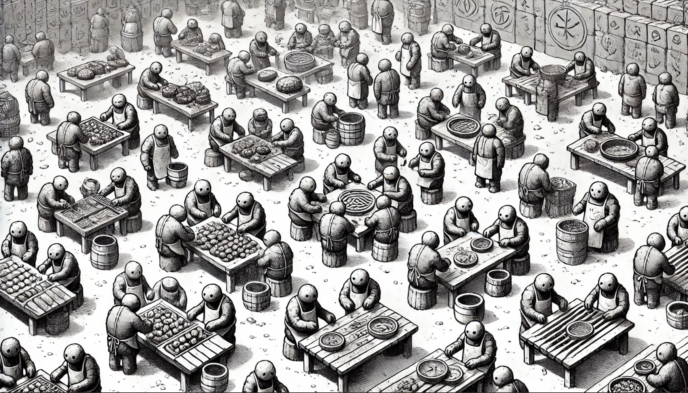

Existem dois tipos principais de semáforos: o Semáforo Binário, que é similar ao Mutex já discutido, e o Semáforo Contador, que vamos abordar agora.

Um semáforo é outro mecanismo de sincronização usado em programação paralela para controlar o acesso a recursos compartilhados e evitar Race Conditions e inconsistências de dados. Ele se baseia em operações atômicas, que incluem:

• Wait (Ocupar um recurso): Utilizada para adquirir um recurso. Por exemplo, em um semáforo com 10 posições, podemos ter no máximo 10 threads trabalhando simultaneamente. Ao executar `Wait()`, o número disponível é decrementado, indicando que uma posição está ocupada.
• Signal (Liberar um recurso): O oposto de `Wait`, a operação `Signal()` incrementa o contador do semáforo até o limite especificado. Quando um processo em `Wait()` conclui, ele chama `Signal()` para liberar um espaço, permitindo que outra thread ocupe esse lugar.

Os semáforos são eficientes para trabalhar com Worker Pools, que são conjuntos de threads dedicadas executando tarefas de forma controlada em quantidade. Esse padrão é útil quando há muitas tarefas a serem realizadas, mas é necessário limitar o número de threads em execução simultânea. Na nossa analogia, o Worker Pool seria o número de alimentos que a grelha pode acomodar.

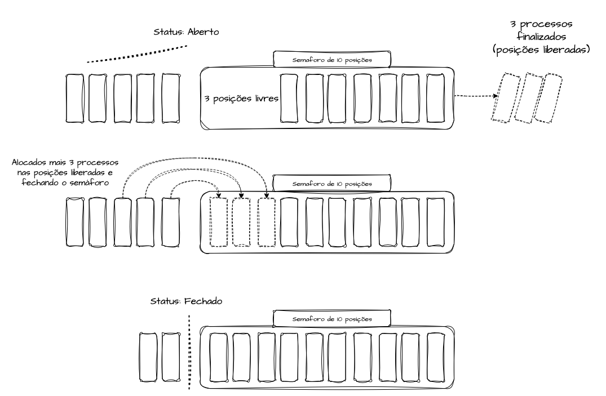

Em um sistema hipotético de consumo de mensagens, cada réplica da nossa aplicação trabalha com um semaforo de 10 posição. Dessa forma, entedemos que iremos processar apenas 10 mensagens por vez em cada replica. Cada vez que chega uma mensagem a ser processada, enfileiramos ela em memória e verificamos se existem espaços livres para serem ocupados no semáforo. Caso 3 processos tenham terminado, o semaforo estará no status “aberto”, permitindo que novas mensagens sejam processadas. Iremos alocar as 3 mensagens novas no semaforo e após isso, ao atingir seu tamanho de 10 posições, o mesmo irá entrar em status “fechado” e as mensagens enfileiradas irão ficar travadas para processamento até que outros processos sejam liberados.

Imagine um churrasco com uma grelha maior, capaz de comportar um número definido de alimentos simultaneamente. A grelha representa um recurso compartilhado, e a capacidade máxima de alimentos que ela pode assar por vez ilustra o conceito de semáforo contador.

Suponha que a grelha possa acomodar até 3 pedaços de carne de cada vez. Cada alimento colocado na grelha ocupa um espaço do semáforo, decrementando seu valor até atingir 0, indicando que a grelha está completamente ocupada. Quando um alimento é retirado da grelha, o contador é incrementado, indicando que há espaço para mais um alimento ser assado.

### Exemplo de Implementação:

• Determinar a capacidade da grelha: `3`.
• Verificar a quantidade de comida disponível para o churrasco: `10`.
• Criar um channel com o tamanho da capacidade da grelha para gerenciar o uso.
• Iniciar o preparo da comida, ocupando um espaço no semáforo ao começar a assar o alimento.
• Remover um espaço do semáforo ao concluir o assado de cada alimento.
• Aqui no Go vamos inverter a lógica de incrementar / decrementar. Vamos criar um canal com o tamanho maximo de itens que cabem na grelha, adicionar um objeto para ocupar a posição e em seguida removê-lo quando liberar o processo.

```go
package main

import (
	"fmt"
	"sync"
	"time"
)

// Função para simular o tempo de preparo de cada atividade do churrasco
func preparar(item int, tempoPreparo int) {
	fmt.Printf("Preparando o alimento %v...\n", item)
	time.Sleep(time.Duration(tempoPreparo) * time.Second)
	fmt.Printf("Alimento %v preparado, desocupando a grelha...\n", item)...
```

```text
❯ go run main.go
Preparando o alimento 2...
Preparando o alimento 1...
Preparando o alimento 3...
Alimento 3 preparado, desocupando a grelha...
Alimento 1 preparado, desocupando a grelha...
Alimento 2 preparado, desocupando a grelha...
Preparando o alimento 6...
Preparando o alimento 5...
Preparando o alimento 4...
Alimento 4 preparado, desocupando a grelha...
Alimento 6 preparado, desocupando a grelha...
Alimento 5 preparado, desocupando a grelha...
```

[Exemplo de Semaphore - Go Playground](https://go.dev/play/p/qZmrpyU_6a9)

Essa foi uma implementação manual que pode ou não ser utilizada pra resolver algum problema, o objetivo foi explicar o funcionamento. Caso for implementar em produção, recomendo a utilização da biblioteca [semaphore](https://pkg.go.dev/golang.org/x/sync/semaphore) do Golang que abstrai muita coisa da lógica dos Worker Pools.


# Referências

* [Github - Algoritmos apresentados no texto](https://github.com/msfidelis/system-design-examples/tree/main/concurrency-parallelism)

*  [Martin Kleppmann - How to do distributed locking](https://martin.kleppmann.com/2016/02/08/how-to-do-distributed-locking.html)

*  [Parallelizing Dijkstra’s Algorithm - Department of Computer Science and Information Technology - St. Cloud University](https://repository.stcloudstate.edu/cgi/viewcontent.cgi?article=1044&context=csit_etds)

* [Palestra na GopherCon 2023: O que há por trás de um orquestrador? Go, sistemas distribuídos e lágrimas](https://www.youtube.com/watch?feature=shared&v=DjAF_sLJjZM)

* [Load Balancing 101](https://medium.com/the-kickstarter/load-balancing-101-81710aa7a3d7)

* [Desvendando a Concorrência e Paralelismo em Go](https://medium.com/@rgribeiro/desvendando-a-concorr%C3%AAncia-e-paralelismo-em-go-7a33d33f5510)

* [Concorrência e Paralelismo em Go](https://www.tabnews.com.br/lucchesisp/concorrencia-e-paralelismo-com-golang#)

* [Handling Mutexes in Distributed Systems with Redis and Go](https://dev.to/jdvert/handling-mutexes-in-distributed-systems-with-redis-and-go-5g0d)

* [Github - Redislock](https://github.com/bsm/redislock)

* [Difference Between Mutex and Semaphore in Operating System](https://afteracademy.com/blog/difference-between-mutex-and-semaphore-in-operating-system/)

* [Go - Paralelismo e Concorrência](https://dev.to/yanpiing/go-paralelismo-e-concorrencia-4mlo)

* [Golang - Semaphore Lib](https://pkg.go.dev/golang.org/x/sync/semaphore)

* [Using Spinlocks](https://docs.oracle.com/cd/E37838_01/html/E61057/ggecq.html)

* [O Jantar dos filósofos - Problema de sincronização em Sistemas Operacionais](https://blog.pantuza.com/artigos/o-jantar-dos-filosofos-problema-de-sincronizacao-em-sistemas-operacionais)

* [Comunicação de Processos](https://edisciplinas.usp.br/pluginfile.php/4933938/mod_resource/content/1/Aula%2005%20-%20Comunicacao_so_2019.pdf)

* [Comunicação e Sincronismo entre Processos](https://www.professores.uff.br/mquinet/wp-content/uploads/sites/42/2017/08/7.pdf)
