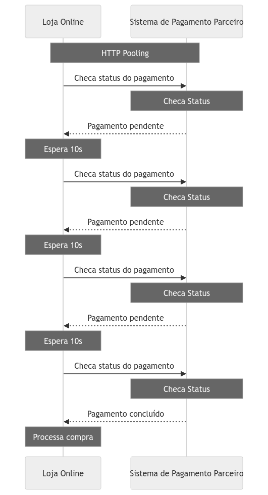
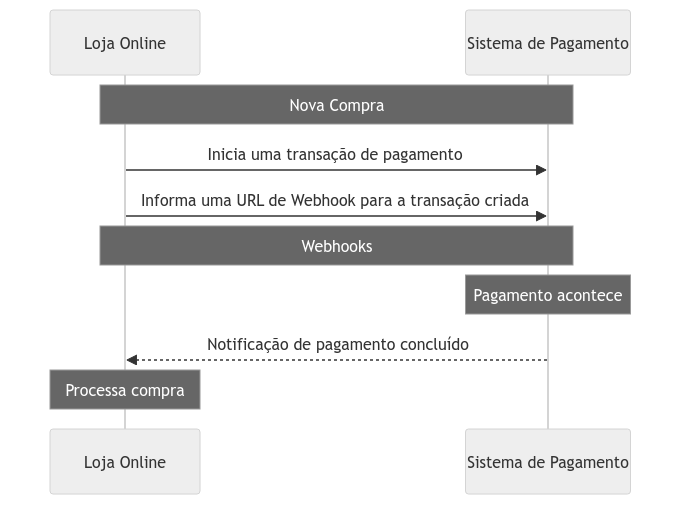
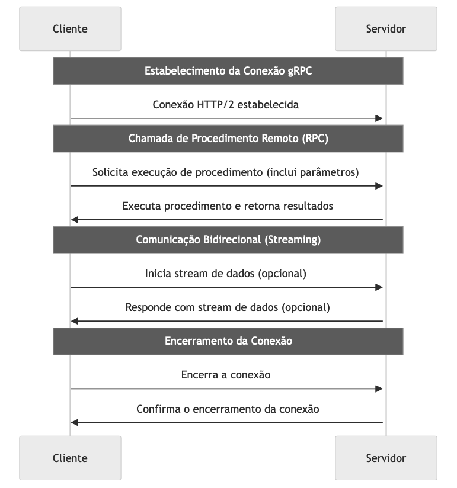
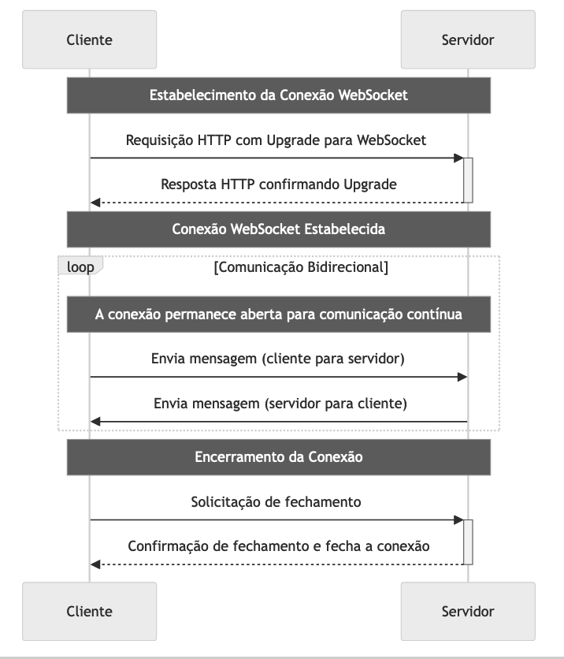
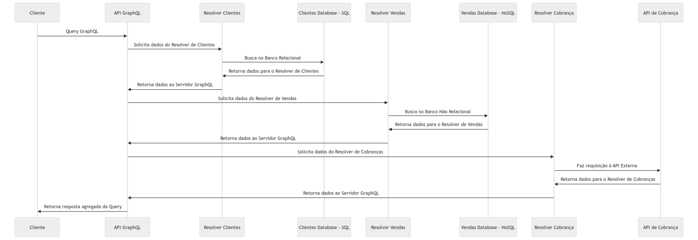
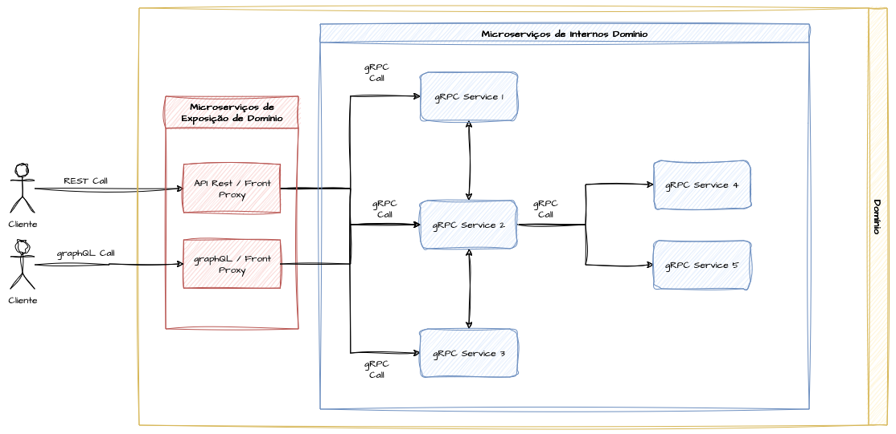

# System Design - Padrões de Comunicação Síncronos

- [System Design - Padrões de Comunicação Síncronos](#system-design---padrões-de-comunicação-síncronos)
- [Definindo Comunicações Sincronas](#definindo-comunicações-sincronas)
- [API’s REST - Representational State Transfer](#apis-rest---representational-state-transfer)
  - [Componentes de uma requisição REST](#componentes-de-uma-requisição-rest)
    - [URI’s e URL’s](#uris-e-urls)
      - [URI - Uniform Resource Identifier](#uri---uniform-resource-identifier)
      - [URL - Uniform Resource Locator](#url---uniform-resource-locator)
    - [Recursos e Paths](#recursos-e-paths)
    - [Headers](#headers)
    - [Query Strings](#query-strings)
    - [Body e Formatos](#body-e-formatos)
    - [Utilização de Métodos HTTP para Representar Ações nos Paths](#utilização-de-métodos-http-para-representar-ações-nos-paths)
      - [Idempotência nas Requisições REST](#idempotência-nas-requisições-rest)
    - [Métodos HTTP nas URI’s e Recursos](#métodos-http-nas-uris-e-recursos)
      - [Status Codes de Resposta e Padrões do REST](#status-codes-de-resposta-e-padrões-do-rest)
  - [Principios do REST](#principios-do-rest)
    - [Interface Uniforme](#interface-uniforme)
    - [Comunicação Stateless](#comunicação-stateless)
    - [Camadas](#camadas)
    - [Cache](#cache)
- [Webhooks](#webhooks)
    - [Pooling e a Diferença entre Webhooks e API’s](#pooling-e-a-diferença-entre-webhooks-e-apis)
- [RPC - Remote Procedure Call](#rpc---remote-procedure-call)
    - [Exemplo de um Servidor RPC](#exemplo-de-um-servidor-rpc)
    - [Exemplo de um Client RPC](#exemplo-de-um-client-rpc)
- [gRPC - Google Remote Procedure Call](#grpc---google-remote-procedure-call)
  - [ProtoBufs](#protobufs)
    - [Exemplo de Protobuf](#exemplo-de-protobuf)
    - [Exemplo de Server gRPC](#exemplo-de-server-grpc)
    - [Exemplo de Client gRPC](#exemplo-de-client-grpc)
- [Websockets](#websockets)
- [GraphQL](#graphql)
  - [Componentes do GraphQL](#componentes-do-graphql)
    - [Schema](#schema)
    - [Query](#query)
    - [Mutations](#mutations)
    - [Resolvers e Data Sources](#resolvers-e-data-sources)
  - [Convergência de Arquiteturas gRPC \& REST \& GraphQL](#convergência-de-arquiteturas-grpc--rest--graphql)
- [Referências](#referências)

> **Nota:** Este documento é um material de estudo baseado no artigo original
> **"System Design - Padrões de Comunicação Síncronos"**, de **Matheus Fidelis**,
> publicado em [fidelissauro.dev/padroes-de-comunicacao-sincronos](https://fidelissauro.dev/padroes-de-comunicacao-sincronos/).
> As ilustrações pertencem ao autor original. Recomenda-se a leitura do artigo
> completo na fonte.

---

# Definindo Comunicações Sincronas

Uma comunicação síncrona é o modelo em que o cliente que dispara uma chamada fica aguardando a resposta do servidor antes de seguir adiante com qualquer outra tarefa. É um padrão comum tanto em sistemas distribuídos quanto monolíticos. Um exemplo prático: em um cenário de logística, o serviço que calcula o preço do frete precisa primeiro buscar os dados de endereço em outro serviço de cadastro de clientes para só então concluir o cálculo.

A característica que define esse modelo é a sua natureza **bloqueante**. O processo que originou a chamada permanece travado, em uma espécie de "espera ativa", até que toda a interação com o servidor termine. Trata-se de um diálogo direto e imediato entre as partes, que precisa ser resolvido de ponta a ponta dentro do tempo de execução da tarefa.

A grande vantagem aparece em contextos onde a **consistência dos dados** é prioritária, já que as operações seguem uma ordem bem definida. Além disso, é um padrão mais simples e intuitivo de entender e implementar.

Por outro lado, há um custo. O bloqueio durante a espera reduz a capacidade de processamento paralelo, limitando a escalabilidade. Há também um efeito em cadeia: a lentidão ou instabilidade de uma única dependência pode degradar o tempo de resposta de toda a sequência de chamadas. O ponto mais sensível é que a indisponibilidade de um serviço dentro de um fluxo bloqueante pode comprometer a disponibilidade de toda a cadeia. Por isso, mesmo sendo relativamente simples de construir, chamadas síncronas exigem atenção a retentativas, timeouts e outras estratégias de resiliência entre cliente e servidor.

# API’s REST - Representational State Transfer

O REST (Representational State Transfer) é um estilo arquitetural para sistemas distribuídos que privilegia a simplicidade na comunicação entre componentes, seja na internet ou em redes internas de microserviços. É a abordagem dominante para comunicação síncrona entre serviços. Formulado por Roy Fielding em sua tese de doutorado em 2000, o REST não é um protocolo nem um padrão formal, mas sim um conjunto de princípios para projetar sistemas escaláveis, confiáveis e fáceis de manter. APIs que aderem a esses princípios são chamadas de RESTful.

Ele se apoia fortemente nos recursos do protocolo HTTP, definindo papéis claros de cliente e servidor e oferecendo uma interface intuitiva para interagir com dados e ações de um sistema. Os métodos HTTP (GET, POST, PUT, DELETE, PATCH) expressam as operações CRUD sobre recursos identificados por URIs, que por sua vez representam entidades do domínio da aplicação.

## Componentes de uma requisição REST

Uma requisição REST é montada a partir de vários componentes que, em conjunto, comunicam ao servidor a intenção do cliente. Cada um tem uma função específica e ajuda o servidor a processar a solicitação a partir de recursos expostos de forma clara. A seguir, exploramos os principais elementos presentes em uma requisição HTTP no contexto do REST.

### URI’s e URL’s

Dentro do REST, URIs e URLs têm papéis distintos na tarefa de identificar e interagir com os recursos expostos pelas APIs. Vale lembrar que, nesse contexto, um "recurso" é qualquer informação ou dado que possa receber um nome e ser identificado: documentos, imagens, serviços ou coleções de outros recursos.

#### URI - Uniform Resource Identifier

Uma URI é uma sequência de caracteres que identifica de forma única um recurso específico. Esse recurso pode ser qualquer coisa endereçável — um documento, uma imagem, um serviço de vídeo ou uma coleção como listas de vendas, produtos ou dados de usuários. As URIs funcionam como um mecanismo universal de identificação, permitindo que clientes e servidores se refiram a um recurso sem ambiguidade. No REST, cada recurso recebe uma URI única, o que possibilita identificar, por exemplo, um livro em uma biblioteca, um usuário em uma rede social ou uma transação financeira.

#### URL - Uniform Resource Locator

No REST, as URLs são a forma mais comum de expressar URIs — na prática, toda URL é um subtipo de URI. A diferença é que a URL não apenas identifica o recurso, mas também informa **como acessá-lo**. A URL `https://api.fidelissauro.dev/livro/1234`, por exemplo, identifica o livro `1234` no domínio indicado e ainda explicita que ele é acessível via HTTPS. Uma vez que os recursos são identificáveis de forma padronizada, suas URLs podem ser combinadas com os métodos HTTP para realizar operações sobre os dados gerenciados pela API.

### Recursos e Paths

Na arquitetura REST, recursos são os objetos, dados ou serviços acessíveis pela rede, sempre identificados por URIs. Os **paths**, por sua vez, são a parte da URI que indica o endereço exato onde o recurso está. Eles organizam os recursos de maneira hierárquica e lógica, tornando o acesso mais intuitivo.

Essa estrutura costuma refletir a relação natural entre os recursos. Em uma API de blog, por exemplo, `/articles` retorna todos os artigos, `/articles/{id}` aponta para um artigo específico e `/articles/{id}/comments` representa os comentários daquele artigo. Cada recurso, com seu identificador único, é acessado por meio dos métodos HTTP padrão.

### Headers

Os headers (cabeçalhos) são elementos do protocolo HTTP usados tanto em requisições quanto em respostas para transportar informações essenciais sobre a transação. Eles cumprem funções variadas: indicar o formato dos dados, autenticar usuários, controlar cache, entre outras. Em uma API REST, os headers viabilizam a troca de metadados entre cliente e servidor, dando suporte à negociação de conteúdo, à segurança e a outras funcionalidades.

A seguir, alguns dos headers mais frequentes na troca de dados via REST e suas funções:

|  |  |
|---|---|
| Content-Type | Especifica o tipo de mídia do corpo da requisição/resposta (ex: application/json). |
| Accept | Informa ao servidor os tipos de mídia aceitáveis como resposta. |
| Authorization | Contém as credenciais para autenticar o usuário que faz a requisição. |
| Cache-Control | Direciona o comportamento do cache no cliente e no servidor (ex: no-cache). |
| ETag | Um identificador único para uma versão específica de um recurso, usado para otimizar o cache. |
| Location | Indica a URL de um recurso recém-criado ou a URL para onde o cliente deve redirecionar. |
| Content-Length | Indica o tamanho, em bytes, do corpo da mensagem de requisição ou resposta. |
| Date | O tempo em que a mensagem foi enviada, para sincronização entre cliente e servidor. |

### Query Strings

As query strings são o mecanismo para enviar informações adicionais ao servidor durante uma requisição. Elas habilitam filtragem, paginação, ordenação e personalização dos dados, deixando as APIs RESTful mais flexíveis — especialmente em recursos de listagem com o método GET.

Diferente do path, as query strings não fazem parte do endereço do recurso. Elas são anexadas ao final da URL após um `?`, na forma de pares chave-valor separados por `&`. A URL `/articles?author=fidelissauro&sort=date`, por exemplo, solicita os artigos de "fidelissauro" ordenados por data. São um recurso extremamente útil na construção de APIs.

### Body e Formatos

O body (corpo) da requisição ou da resposta é o componente responsável por transportar os dados entre cliente e servidor. Ele é usado principalmente em métodos como `POST`, `PUT` e `PATCH`, quando há necessidade de enviar informações estruturadas, como na criação ou atualização de recursos. O conteúdo varia conforme a operação e os dados envolvidos, sempre respeitando os contratos de request e response definidos pela API.

### Utilização de Métodos HTTP para Representar Ações nos Paths

Os métodos HTTP, também chamados de "verbos", definem as ações possíveis sobre os recursos representados nos paths. Cada um carrega uma semântica própria: GET para obter a representação de um recurso, POST para criar, PUT para atualizar e DELETE para remover. Essa correspondência entre verbo e ação torna a interação com a API previsível e clara.

#### Idempotência nas Requisições REST

A idempotência é um conceito amplamente aplicado no desenvolvimento de software, incluindo o design de APIs RESTful, e é fundamental para construir interfaces confiáveis e previsíveis. Quando bem aplicada, ela garante que múltiplas chamadas idênticas a um mesmo endpoint produzam sempre o mesmo estado do recurso, sem efeitos colaterais após a primeira execução.

Esse comportamento é essencial para retentativas: mesmo diante de erros ou execuções parciais, repetir a requisição não gera duplicidades. Alguns métodos HTTP são naturalmente idempotentes; outros exigem lógica adicional, como chaves de idempotência ou checagem de campos, para permitir, por exemplo, criações idempotentes. O quadro abaixo resume cada método e sua relação com a idempotência:

|  |  |
|---|---|
| GET | Utilizado para recuperar a representação de um recurso sem modificá-lo. É seguro e idempotente, várias requisições idênticas devem ter o mesmo efeito que uma única requisição. | **Sim** |
| POST | Empregado para criar um novo recurso. Não é idempotente, pois realizar várias requisições POST pode criar múltiplos recursos. Em caso de necessidade de idempotência, será necessário a implementação de lógicas adicionais. | **Não** |
| PUT | Utilizado para atualizar um recurso existente ou criar um novo se ele não existir, no URI especificado. É idempotente, então múltiplas requisições idênticas terão o mesmo efeito sobre a entidade. | **Sim** |
| PATCH | Utilizado para aplicar atualizações parciais a um recurso. Ao contrário do PUT, que substitui o recurso inteiro, o PATCH modifica apenas as partes especificadas. É idempotente, pois a execução sob o mesmo recurso tende a gerar sempre o mesmo efeito e gerar o mesmo resultado. | **Sim** |
| DELETE | Empregado para remover um recurso. É idempotente, pois deletar um recurso várias vezes tem o mesmo efeito que deletá-lo uma única vez. | **Sim** |

### Métodos HTTP nas URI’s e Recursos

As URIs identificam recursos de forma única e, em uma API RESTful bem projetada, devem ser intuitivas e descritivas, facilitando a navegação. Um princípio importante é que as URIs apontem para **recursos e entidades, não para ações**. Prefira `/users` combinado com o método `GET` em vez de um path imperativo como `/getUsers`.

A estrutura das URIs deve refletir a hierarquia dos recursos — `/users/123/articles` representa os artigos do usuário de ID 123. Já as query strings entram como parâmetros de consulta para filtrar ou ajustar a saída, como em `/users?active=true` (somente usuários ativos) ou `/users/1/articles?tag=system-design`.

A tabela a seguir ilustra, para um portal de notícias ou blog, como combinar métodos HTTP e URIs:

|  |  |  |
|---|---|---|
| Listar todos os posts | GET | /articles |
| Obter um post específico | GET | /articles/1 |
| Criar um novo post | POST | /articles |
| Atualizar um post existente | PUT | /articles/1 |
| Deletar um post | DELETE | /articles/1 |
| Atualizar parte de um post | PATCH | /articles/1 |

#### Status Codes de Resposta e Padrões do REST

Os códigos de status são um recurso nativo do HTTP amplamente adotado em implementações RESTful para comunicar o estado de cada resposta. Eles organizam as respostas em classes que dão significado e representatividade a cada solicitação. Os mais comuns em APIs RESTful são:

|  |  |
|---|---|
| 200 OK | Solicitação bem-sucedida para GET, PUT ou POST sem criação de recurso. |
| 201 Created | Nova criação de recurso resultante de uma solicitação POST. |
| 202 Accepted | Solicitação aceita para processamento; conclusão pendente. |
| 204 No Content | Solicitação bem-sucedida sem conteúdo para retornar. Comum após DELETE. |
| 400 Bad Request | Erro de cliente devido a sintaxe ou formato inválido. |
| 401 Unauthorized | Falha ou necessidade de autenticação. |
| 403 Forbidden | Servidor recusa a solicitação, apesar de compreendê-la. |
| 404 Not Found | Recurso solicitado não encontrado. |
| 405 Method Not Allowed | Método conhecido pelo servidor, mas desativado. |
| 500 Internal Server Error | Falha genérica do servidor. |
| 503 Service Unavailable | Servidor indisponível, geralmente por manutenção ou sobrecarga. |
| 504 Gateway Timeout | Tempo limite atingido por um servidor gateway ou proxy sem resposta do servidor upstream. |

## Principios do REST

Os princípios arquiteturais do REST funcionam como um conjunto de regras e bases de design que orientam as equipes a construir APIs distribuídas de qualidade. Eles equilibram a boa experiência de consumo do cliente com a saúde e a evolução sustentável do projeto no médio e longo prazo. Nesta seção, exploramos os principais princípios esperados de uma implementação RESTful.

### Interface Uniforme

A interface uniforme é o princípio central do REST e trata da consistência na forma como os recursos são expostos. Ele exige que cada recurso seja identificável de forma única por URIs e que as respostas sigam formatos padronizados, como JSON ou XML. Além disso, requisições e respostas devem ser quase autodescritivas, carregando toda a informação necessária para serem compreendidas, incluindo metadados e hiperlinks. O resultado é uma padronização formal na interação entre cliente e servidor.

Essa uniformidade garante **interoperabilidade**: independentemente das tecnologias escolhidas para cliente e servidor, a comunicação permanece padronizada, sem que um lado precise conhecer os detalhes de implementação do outro. Projetar boas interfaces também é uma forma de promover o desacoplamento entre sistemas.

### Comunicação Stateless

No REST, cada requisição deve carregar todas as informações necessárias para ser compreendida e processada, pois o servidor **não armazena estado da sessão** entre as chamadas. Cada requisição é tratada como se fosse a primeira, sem memória das interações anteriores.

Essa característica eleva a confiabilidade: se um servidor falhar após processar uma requisição, o cliente pode simplesmente tentar de novo, eventualmente em outro node do pool, sem perda de continuidade. É justamente esse princípio que viabiliza a [escalabilidade horizontal](https://fidelissauro.dev/performance-capacidade-escalabilidade/) de aplicações REST de forma transparente.

O principal desafio do modelo stateless gira em torno da autenticação. Tokens como o JWT (JSON Web Tokens) são uma estratégia recomendada, pois conseguem carregar informações do cliente e mecanismos de validação de integridade sem exigir que o servidor mantenha histórico entre as requisições.

### Camadas

A arquitetura em camadas permite que intermediários — como proxies e gateways — facilitem ou melhorem a comunicação entre cliente e servidor de forma transparente, contribuindo para segurança, balanceamento de carga e cache. Combinada com o modelo stateless, essa abordagem torna o servidor bastante escalável.

O princípio de camadas ("Layered System") é uma das restrições arquiteturais mais relevantes do REST. Ele organiza a aplicação em camadas hierárquicas, cada uma com função específica, onde a comunicação flui sequencialmente entre camadas adjacentes sem que uma precise conhecer os detalhes internos das demais. Entre essas camadas podem existir API gateways, autenticação e autorização, cache, balanceadores de carga, proxies reversos, roteamento, lógica de negócio, acesso a dados e assim por diante.

### Cache

As respostas do servidor devem deixar explícito se podem ou não ser cacheadas, evitando a reutilização de dados obsoletos e melhorando eficiência e escalabilidade. O cache é uma técnica amplamente usada em aplicações web e APIs — inclusive nas RESTful — para armazenar cópias de recursos ou resultados custosos de gerar, permitindo reaproveitá-los em requisições futuras.

No contexto REST, o cache pode existir tanto no cliente quanto no servidor, além de pontos intermediários como proxies e gateways. Isso reduz a latência, alivia a carga sobre o servidor e melhora a experiência do usuário. Sua dinâmica depende de um gerenciamento cuidadoso para manter os dados precisos e atualizados, apoiado em cabeçalhos como `Cache-Control`, `Last-Modified` e `ETag`, que controlam validade, revalidação e expiração.

# Webhooks

Os Webhooks são um recurso arquitetural em que o **servidor envia dados ao cliente** de forma síncrona conforme determinadas ações ocorrem no sistema. É um papel invertido em relação à API tradicional: em vez de o cliente consultar o servidor, é o servidor que, através de URLs previamente cadastradas, notifica os clientes sempre que um dado é modificado, um status é atualizado ou uma ação precisa ser comunicada.

Quando os clientes precisam de atualizações contínuas sobre o estado de um recurso, o polling HTTP — baseado em consultas periódicas — sobrecarrega cliente e servidor, atrasa a detecção de mudanças e desperdiça recursos com requisições desnecessárias. É exatamente esse problema que os webhooks resolvem.

### Pooling e a Diferença entre Webhooks e API’s

Uma boa analogia para diferenciar polling de webhooks: imagine que você comprou um livro em um e-commerce e está ansioso pela entrega. No modelo de polling, você vai de tempos em tempos até a caixa de correio verificar se a encomenda chegou. Isso equivale a um cliente que, para se manter atualizado, precisa checar o recurso repetidamente até obter o estado desejado.

Agora imagine o cenário oposto: em vez da caixa de correio, há um entregador que toca a campainha e pede sua assinatura na entrega. Você segue com suas tarefas normalmente até ser notificado. Esse é o comportamento dos webhooks. Em um caso real, pense em um e-commerce integrado a um parceiro de pagamentos (Pix, cartão, boleto). No polling, ao gerar um código Pix, você ficaria consultando a API do parceiro repetidamente para saber se o pagamento foi concluído — algo não recomendado.

A alternativa com webhook é fornecer ao parceiro uma URL do seu sistema. Sempre que houver uma atualização do lado dele — pagamento concluído, cancelado, expirado ou recusado — ele dispara uma requisição com esses dados, eliminando a necessidade de consultas desnecessárias.

OBS: Utilizado para notificação passiva de eventos.

# RPC - Remote Procedure Call

O RPC (Remote Procedure Call) é um protocolo que permite executar procedimentos ou métodos em uma máquina diferente daquela onde o código roda. Um programa cliente envia uma solicitação de execução para um software servidor, que processa o procedimento e devolve o resultado. A grande proposta do RPC é abstrair a complexidade da comunicação em rede, deixando o desenvolvedor focado na lógica de negócio em vez dos detalhes de transmissão. Existem diversos protocolos RPC, como SOAP, Thrift e CORBA — e, mais adiante, abordaremos uma alternativa moderna: o gRPC.

### Exemplo de um Servidor RPC

Diferente do gRPC, chamadas RPC convencionais nem sempre exigem um contrato forte, o que traz flexibilidade e velocidade de implementação ao custo de menor padronização e consistência. O exemplo do artigo, escrito em Go, implementa um serviço que calcula a recomendação diária de ingestão de proteína a partir do peso informado. Em prosa, a ideia é definir um método que recebe o peso e devolve o valor recomendado, e então registrá-lo em um RPC server alocado em uma porta do host (no caso, a `1234`). O código completo está disponível no artigo original.

### Exemplo de um Client RPC

O lado cliente tende a ser ainda mais simples. Basta abrir uma conexão com a porta onde o servidor e o método RPC foram registrados e enviar a lista de argumentos no formato esperado pelo servidor. Como não há contrato forte, valem os mesmos trade-offs já citados: ganha-se velocidade e flexibilidade, perde-se em consistência. No exemplo em Go, o cliente conecta no endereço `0.0.0.0:1234`, monta os argumentos com o peso (85 kg) e invoca o método `Proteinas.Recomendacao`, recebendo de volta a recomendação (170g por dia). O código completo está no artigo original.

# gRPC - Google Remote Procedure Call

O gRPC é um framework de RPC de código aberto criado pelo Google. Ele conecta serviços de forma performática e escalável, sendo especialmente adequado para arquiteturas distribuídas e de microserviços. Seu design se apoia em três pilares: HTTP/2 como protocolo de transporte, Protocol Buffers (ProtoBuf) como linguagem de descrição de interface (IDL) e os conceitos de chamada RPC já vistos, somados a recursos como autenticação, balanceamento de carga e validações.

Graças ao HTTP/2, é possível realizar múltiplas chamadas RPC em paralelo sobre uma única conexão TCP, o que melhora significativamente a eficiência de rede e a latência. O gRPC também oferece **streaming bidirecional**, permitindo que cliente e servidor troquem sequências de mensagens pela mesma conexão — ideal para chat em tempo real, monitoramento contínuo e cenários que demandam comunicação persistente.

Por outro lado, implementar e operar gRPC pode ser mais complexo do que recorrer a alternativas simples como REST, sobretudo em projetos menores ou com requisitos de desempenho menos rígidos. O uso de contratos via ProtoBuf, embora garanta consistência, traz o desafio de distribuir e versionar esse contrato entre cliente e servidor. Toda vez que o contrato muda — para adicionar, alterar ou remover um campo — surge a dificuldade de garantir que todos os clientes do serviço sejam atualizados.

## ProtoBufs

O Protocol Buffers (ProtoBuf) é a linguagem de descrição de interface preferida do gRPC. Ele define os serviços e a estrutura de dados que cliente e servidor compartilham por meio de um contrato forte. É um sistema de serialização binária mais eficiente em espaço do que formatos como JSON e, ao mesmo tempo, oferece uma forma clara e agnóstica a linguagens e frameworks de especificar a interface do serviço.

### Exemplo de Protobuf

O contrato de exemplo do artigo, escrito na sintaxe `proto3`, descreve um service chamado `IMCService` com um método `Calcular`, que recebe uma mensagem no formato `IMCRequest` (com altura e peso) e retorna uma mensagem `IMCResponse` (com o resultado). A linguagem é declarativa e bastante enxuta. Depois de definir o contrato `.proto`, é necessário gerar os pacotes que o implementam — em Go, normalmente com a ferramenta `protoc`, que produz arquivos como `imc_grpc.pb.go` e `imc.pb.go`, importados tanto no cliente quanto no servidor. Os trechos completos de `.proto` e do comando de geração estão no artigo original.

### Exemplo de Server gRPC

Com os pacotes gerados pelo protobuf importados, o servidor gRPC é implementado respeitando o contrato definido: cria-se um tipo que implementa o método `Calcular`, recebendo e respondendo com os objetos da assinatura acordada. Depois de codificar a lógica do serviço, basta alocar uma porta (no exemplo, `50051`) e registrar o serviço no servidor gRPC. O código Go completo está disponível no artigo original.

### Exemplo de Client gRPC

O cliente reutiliza o mesmo contrato, estabelece uma **conexão persistente** com o endereço e a porta do servidor e invoca o método `Calcular`, enviando os dados no formato acordado e recebendo a resposta em seguida. No exemplo em Go, o cliente conecta em `0.0.0.0:50051` e calcula o IMC de uma pessoa (peso 90,5 e altura 1,77), obtendo o resultado 28,89. O código completo está no artigo original.

# Websockets

A comunicação baseada em Websockets é uma alternativa para resolver o problema de troca de dados em tempo real entre cliente e servidor na web. Diferentemente do modelo tradicional de requisição/resposta HTTP — unidirecional e que abre uma nova conexão TCP a cada interação — o protocolo WebSocket estabelece uma conexão **full-duplex sobre um único socket TCP**. Isso habilita comunicação bidirecional contínua, ideal para chats, dashboards dinâmicos, gráficos financeiros, sistemas de notificação e jogos online.

A conexão começa como uma requisição HTTP comum, mas solicita um "upgrade" para WebSocket por meio do cabeçalho `Upgrade`. Se o servidor suporta o protocolo, ele confirma o upgrade e a conexão HTTP é elevada a uma conexão WebSocket. A partir daí, a conexão permanece aberta, permitindo que ambas as partes enviem dados a qualquer momento. Manter a conexão aberta elimina a necessidade de reabrir conexões HTTP a cada interação, reduzindo drasticamente a latência.

Tanto o cliente quanto o servidor podem iniciar o encerramento: a parte interessada envia uma solicitação de fechamento e, após a resposta da outra parte, a conexão é fechada. É importante notar que, embora a maioria dos navegadores modernos suporte WebSockets, podem ocorrer problemas de compatibilidade com navegadores antigos ou redes restritivas. Além disso, gerenciar uma conexão persistente e garantir a retransmissão de mensagens perdidas tende a ser mais complexo do que usar requisições HTTP simples.

# GraphQL

O GraphQL pode ser entendido de duas formas: como uma linguagem de consulta para APIs (do lado do cliente) e como um runtime que executa essas consultas (do lado do servidor). Desenvolvido pelo Facebook, ele propõe uma abordagem diferente do REST tradicional, permitindo que o cliente defina exatamente a estrutura dos dados que deseja receber — nem mais, nem menos.

Isso ataca dois problemas comuns em APIs REST. O **over-fetching** (o artigo o cita como "ever-fetching") ocorre quando o payload é maior do que o necessário e o cliente recebe campos que não usa. Já o **under-fetching** acontece quando o cliente não obtém todos os dados de que precisa em uma única chamada e é forçado a consultar vários outros recursos para compor a informação completa.

Ao concentrar tudo em um único ponto de consulta — em vez de exigir vários endpoints para atender demandas distintas —, o GraphQL reduz a complexidade de lidar com over e under-fetching, tornando-se atraente nesses cenários. Vale ressaltar, contudo, que a flexibilidade pode cobrar seu preço: a falta de padrões rígidos pode se tornar um problema relevante à medida que a adoção cresce.

## Componentes do GraphQL

O GraphQL se apoia em alguns conceitos fundamentais que precisam ser compreendidos para garantir uma implementação coerente. Os principais são apresentados a seguir.

### Schema

O schema é definido pela SDL (Schema Definition Language), uma sintaxe simples para descrever estruturas de dados, e é a peça mais importante do GraphQL — compartilhada entre todos os demais componentes. Ele funciona como um **contrato entre cliente e servidor**, delimitando quais dados podem ser consultados ou modificados e como os clientes podem interagir com eles.

Seu grande motivador é justamente reduzir over e under-fetching, permitindo que o cliente solicite exatamente o que precisa. No schema definem-se as entidades, seus campos e tipos, as relações entre objetos e quais queries, mutations e subscriptions ficam disponíveis para o cliente.

### Query

Uma Query é a operação de leitura feita pelo cliente para recuperar valores do servidor. Ela precisa respeitar o que está definido no schema, mas dá ao cliente a liberdade de escolher quais campos quer obter e qual o formato ideal do payload de resposta para aquela solicitação específica.

### Mutations

Enquanto as queries leem dados, as mutations os modificam — criando, atualizando ou removendo informações no servidor. Elas são explicitamente destinadas a operações que causam efeitos colaterais e, conforme o que estiver definido no schema e em suas integrações, podem inclusive escrever em múltiplas fontes de dados.

### Resolvers e Data Sources

O GraphQL não é um banco de dados, e sim uma interface flexível entre o cliente e as fontes de dados disponíveis. Ele pode buscar informações simultaneamente em várias origens — bancos SQL, NoSQL, APIs REST, serviços RPC — conforme definido no schema. Os **resolvers** são as funções que fornecem as instruções e integrações necessárias para transformar uma operação GraphQL em dados reais.

> Exemplo da utilização de vários resolvers dentro de uma query

Cada campo configurado no schema está diretamente associado a um resolver, que é acionado sempre que aquele campo é solicitado. São eles os responsáveis por buscar os dados em suas fontes originais.

## Convergência de Arquiteturas gRPC & REST & GraphQL

Expor diretamente endpoints gRPC para clientes em escala pode ser trabalhoso, sobretudo em arquiteturas corporativas de grande granularidade. Olhando a arquitetura sob a ótica de [domínios de software](https://fidelissauro.dev/monolitos-microservicos/), é possível combinar mais de um protocolo de comunicação dentro de uma mesma malha de serviços.

Como distribuir e versionar arquivos ProtoBuf é complicado, enquanto contratos REST são mais simples de interpretar, uma estratégia viável é expor o domínio de software externamente via REST e usar o gRPC — mais leve — na comunicação interna entre os microserviços daquele domínio. A mesma lógica pode ser estendida a instâncias de GraphQL.

# Referências

* [HTTP Status](https://www.httpstatus.com.br/)

* [HTTP Cats](https://http.cat/)

* [HTTP Semantics - RFC9110](https://datatracker.ietf.org/doc/html/rfc9110)

* [Qual é a diferença entre gRPC e REST?](https://aws.amazon.com/pt/compare/the-difference-between-grpc-and-rest/)

* [Integration challenges in microservices architecture with gRPC & REST](https://www.cncf.io/blog/2022/02/11/
* integration-challenges-in-microservices-architecture-with-grpc-rest/)

* [REST vs. GraphQL vs. gRPC vs. WebSocket](https://www.resolutesoftware.com/blog/rest-vs-graphql-vs-grpc-vs-websocket/)

* [gRPC vs REST](https://www.gslab.com/blogs/grpc-vs-rest-a-complete-guide/)

* [gRPC](https://grpc.io/)

* [gRPC Golang](https://github.com/grpc/grpc-go)

* [Protobuf](https://protobuf.dev/)

* [Protocol Buffers - Google’s data interchange format](https://github.com/protocolbuffers/protobuf)

* [RPC Implementation in Go](https://dev.to/karankumarshreds/go-rpc-implementation-4731)

* [Echo Microframework](https://echo.labstack.com/docs/)

* [Gorilla - Websockets](https://github.com/gorilla/websocket/blob/main/examples/chat/client.go)

* [Demo: Nutrition Overengineering](https://github.com/msfidelis/nutrition-overengineering)

* [System Design Examples - gRPC](https://github.com/msfidelis/system-design-examples/tree/main/sync_protocols/grpc)

* [URI, URN e URL](https://igluonline.com/qual-diferenca-entre-url-uri-e-urn/)

* [URL, URI, URN](https://woliveiras.com.br/posts/url-uri-qual-diferenca)

* [REST Architectural Constraints](https://restfulapi.net/rest-architectural-constraints/)

* [Using GraphQL with Golang](https://www.apollographql.com/blog/using-graphql-with-golang)

* [GraphQL Schema](https://graphql.org/learn/schema/)

* [GraphQL Application Components](https://www.javatpoint.com/graphql-application-components)

* [EdgeDB SDL Reference](https://docs.edgedb.com/database/reference/sdl)

* [O que é um webhook?](https://www.redhat.com/pt-br/topics/automation/what-is-a-webhook)
