# System Design - Mensageria, Eventos, Streaming e Arquitetura Assincrona

- [System Design - Mensageria, Eventos, Streaming e Arquitetura Assincrona](#system-design---mensageria-eventos-streaming-e-arquitetura-assincrona)
  - [Mensagens e Eventos](#mensagens-e-eventos)
    - [Definindo Mensageria](#definindo-mensageria)
    - [Definindo Eventos](#definindo-eventos)
  - [Eventos vs Mensagens](#eventos-vs-mensagens)
    - [Eventos São Mensagens](#eventos-são-mensagens)
  - [Conceitos e Padrões](#conceitos-e-padrões)
    - [FIFO e Queues - First In First Out](#fifo-e-queues---first-in-first-out)
        - [Output:](#output)
    - [LIFO e Stacks - Last In First Out](#lifo-e-stacks---last-in-first-out)
        - [Output:](#output-1)
    - [Fanout](#fanout)
    - [DLQ - Dead Letter Queues](#dlq---dead-letter-queues)
    - [Processamento em Batch](#processamento-em-batch)
  - [Protocolos e Arquiteturas Event-Driven](#protocolos-e-arquiteturas-event-driven)
    - [Streaming e Reatividade](#streaming-e-reatividade)
    - [Reatividade e Arquiteturas Event-Driven](#reatividade-e-arquiteturas-event-driven)
  - [Kafka e Event Streaming](#kafka-e-event-streaming)
    - [Clusters e Brokers](#clusters-e-brokers)
    - [Tópicos](#tópicos)
    - [Partições](#partições)
    - [Fatores de Replicação](#fatores-de-replicação)
    - [Producers](#producers)
        - [Exemplo de Produtor](#exemplo-de-produtor)
    - [Consumers e Consumer Groups](#consumers-e-consumer-groups)
        - [Exemplo de um consumidor](#exemplo-de-um-consumidor)
        - [Output](#output-2)
  - [Protocolos e Arquiteturas de Message-Driven](#protocolos-e-arquiteturas-de-message-driven)
    - [MQTT (Message Queuing Telemetry Transport)](#mqtt-message-queuing-telemetry-transport)
    - [MQTT Default Subscription](#mqtt-default-subscription)
    - [MQTT Shared Subscription](#mqtt-shared-subscription)
  - [AMQP (Advanced Message Queuing Protocol)](#amqp-advanced-message-queuing-protocol)
    - [Brokers](#brokers)
    - [Channels](#channels)
    - [Queues](#queues)
    - [Producers](#producers-1)
    - [Consumers](#consumers)
    - [Exchanges e Binding Keys](#exchanges-e-binding-keys)
    - [Tipos de Exchanges](#tipos-de-exchanges)
      - [Direct Exchange](#direct-exchange)
        - [Setup e Binding no Modo Direct](#setup-e-binding-no-modo-direct)
        - [Producer no Modo Direct](#producer-no-modo-direct)
        - [Output](#output-3)
        - [Consumer no Modo Direct](#consumer-no-modo-direct)
        - [Output](#output-4)
      - [Topic Exchange](#topic-exchange)
        - [Setup e Binding no Topic](#setup-e-binding-no-topic)
        - [Producer no Modo Topic](#producer-no-modo-topic)
        - [Output - Produtor](#output---produtor)
        - [Output - Consumidor Default](#output---consumidor-default)
        - [Output - Consumidor Prioritario](#output---consumidor-prioritario)
        - [Output - Consumidor Lake](#output---consumidor-lake)
      - [Fanout Exchange](#fanout-exchange)
        - [Setup no Fanout](#setup-no-fanout)
        - [Producer no Fanout](#producer-no-fanout)
        - [Output - Produtor](#output---produtor-1)
        - [Output - Consumidor Cobranca](#output---consumidor-cobranca)
        - [Output - Consumidor Logistica](#output---consumidor-logistica)
        - [Output - Consumidor Estoque](#output---consumidor-estoque)
- [Referências](#referências)

> **Nota:** Este documento é um material de estudo baseado no artigo original
> **"System Design - Mensageria, Eventos, Streaming e Arquitetura Assincrona"**,
> de **Matheus Fidelis**, publicado em
> [fidelissauro.dev/mensageria-eventos-streaming](https://fidelissauro.dev/mensageria-eventos-streaming/).
> As ilustrações pertencem ao autor original. Recomenda-se a leitura do artigo
> completo na fonte.

---

## Mensagens e Eventos

Depois de explorar protocolos de rede e padrões de comunicação síncrona, este
capítulo fecha o trio tratando da comunicação assíncrona entre componentes de um
sistema distribuído. A ideia central é diferenciar **mensagens** de **eventos** e
mostrar como cada abordagem ajuda a resolver problemas de comunicação em larga
escala, usando protocolos e ferramentas como MQTT, AMQP e Kafka (comunicação
assíncrona over-TCP), entendendo as vantagens e os limites de cada um.

### Definindo Mensageria

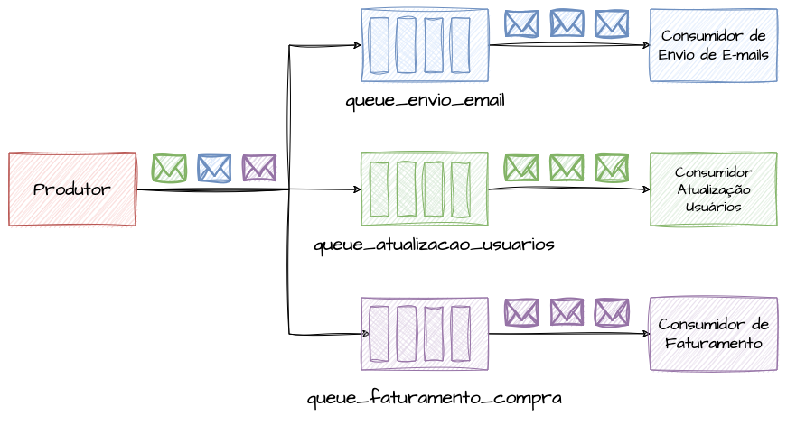

Mensageria é, de forma simples, a troca de mensagens por meio de um componente
intermediário (a fila). Há um produtor que quer estimular um comportamento em
outro componente, e para isso envia os dados necessários para uma queue, de onde
o sistema de destino os recebe — de forma ordenada ou não. O pré-requisito é
existir um canal comum acordado entre remetente e destinatário.

A natureza da mensagem costuma ser **imperativa**: envio uma mensagem para o
sistema de e-mail esperando que ele dispare o e-mail, ou mando os dados de uma
compra para o faturamento esperando que ele execute as tarefas previstas. Em
geral existe um destinatário conhecido e intencional, que age sobre o dado da
forma esperada — conceitualmente um relacionamento de um para um.

A analogia útil é a de uma carta ou encomenda: ela tem destinatário único e
conhecido. O convite formal para ser padrinho de um casamento é uma mensagem
especializada, enviada só a algumas pessoas; os demais convidados recebem outra
carta com conteúdo diferente. É como se os noivos usassem duas filas distintas,
uma para padrinhos e outra para o restante.

### Definindo Eventos

Ao contrário da mensagem, que é entregue intencionalmente a um destino conhecido
com comportamento esperado, o **evento** é uma notificação genérica de que algo
aconteceu. Várias partes do sistema interessadas naquele tipo de notificação a
escutam e reagem como acharem necessário — ou simplesmente a ignoram.

Mensagens trafegam de um para um por filas; eventos trafegam por **tópicos**,
chegando ao mesmo tempo a todos os interessados naquele assunto. Por isso eventos
promovem **desacoplamento maior**: o emissor não precisa saber quem consome nem
como. Mensagens, por dependerem de um contrato comum de formato/protocolo, tendem
a introduzir mais acoplamento entre emissor e receptor.

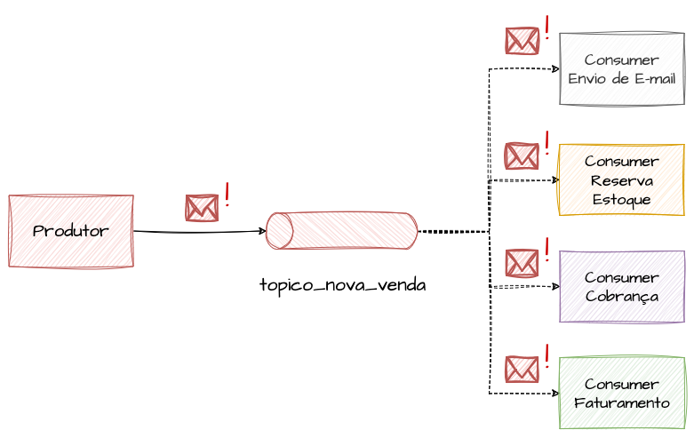

Eventos andam próximos do streaming e esperam que os espectadores reajam assim
que algo ocorre. No e-commerce, em vez de o produtor enviar pontualmente uma
mensagem para cada fila (cobrar, faturar, enviar e-mail, notificar estoque), basta
emitir um evento "uma venda aconteceu" e os subsistemas interessados agem de forma
simultânea e isolada. A analogia é o mestre de cerimônias ou o DJ que anuncia o
que vai acontecer (valsa, buquê, jantar) e cada interessado toma sua ação.

## Eventos vs Mensagens

### Eventos São Mensagens

Mensagens são dados enviados de um ponto a outro; eventos são notificações sem
destinatário específico que estimulam várias partes do sistema. Ainda assim, há um
denominador comum: computacionalmente, ambos são formas de construir comunicação
assíncrona, e o conceito de mensagem pode ser reaproveitado em diversos cenários.

Alguns autores tratam "mensagem" como termo guarda-chuva e a subdividem em:
**Documento** (dados anêmicos, em que o receptor decide como interpretar),
**Comando** (um sistema evoca uma ação imperativa em outro) e **Evento** (a
representação de que "algo ocorreu", uma mudança de estado de um objeto de
domínio). Na prática, o que chamamos de mensagem cai bem nos subtipos Documento e
Comando.

Mesmo sendo conceitos próximos — e frequentemente confundidos ou usados de forma
intercambiável, com tópicos sendo usados como filas e vice-versa — conhecer as
diferenças permite projetar soluções mais escaláveis e performáticas. A distinção
fundamental é o propósito: mensagens são **imperativas** ("faça algo" para um ator
específico); eventos são **reativos e desacoplados** ("aconteceu algo") e os
interessados decidem o que fazer.

Mensagens geralmente transferem dados esperando uma resposta ou reação; eventos
informam mudanças de estado sem esperar resposta. Em arquiteturas reativas o
produtor do evento normalmente nem conhece seus consumidores, pois a relação é de
um para muitos. Eventos são ideais para sistemas reativos a mudanças de estado
("a compra ficou CANCELADA"), enquanto mensagens servem melhor a integrações
diretas que exigem uma ação ("cancele essa compra"). No fim, tanto mensagens
quanto eventos cumprem o objetivo de distribuir cargas de trabalho de forma
assíncrona entre vários consumidores trabalhando em paralelo.

## Conceitos e Padrões

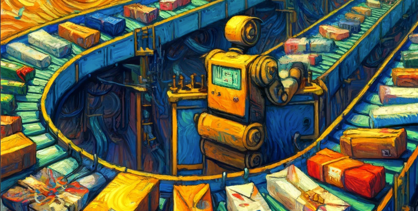

Tanto ferramentas de mensageria quanto de eventos e streaming compartilham alguns
conceitos. Nesta seção eles são detalhados para servir de base na escolha das
melhores decisões arquiteturais.

### FIFO e Queues - First In First Out

O padrão **FIFO** (First In First Out) é onipresente em mensageria e
processamento de filas: a primeira mensagem a chegar é a primeira a ser
disponibilizada para consumo, exatamente como uma fila literal.

É adotado quando precisamos garantir uma ordem mínima de processamento, pois a
ordem de consumo reflete a ordem de chegada. É útil em sistemas financeiros (onde
a ordem de execução de transações importa) e em vendas (onde a ordem de confirmação
das compras precisa ser tratada de forma justa).

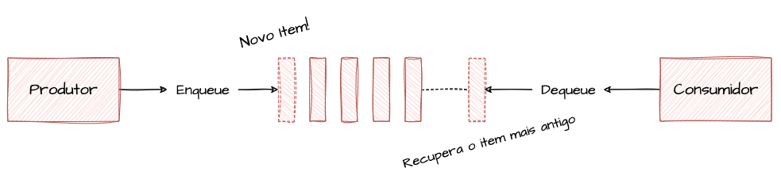

As operações típicas de uma Queue são `Enqueue` (adicionar um item ao fim da fila)
e `Dequeue` (remover o primeiro item). O artigo apresenta uma implementação
mínima em Go demonstrando a lógica: o exemplo enfileira "Pizza", "Hamburger" e
"Churrasco" e depois os desenfileira.

##### Output:

A saída do exemplo confirma o comportamento FIFO: os itens saem na **mesma ordem**
em que entraram — Pizza, Hamburger e Churrasco.

### LIFO e Stacks - Last In First Out

O padrão **LIFO** (Last In First Out) também aparece em filas de mensageria, mas
em estruturas de dados é associado a uma **Stack** (pilha): o último item incluído
é o primeiro a ser consumido.

Embora pareça contraintuitivo para distribuição de carga e processamento em batch,
o LIFO é útil em funcionalidades de "desfazer", onde é preciso preservar a memória
das etapas para revertê-las na ordem inversa — por exemplo, o cálculo de descontos
de um plano com múltiplas condições e regras.

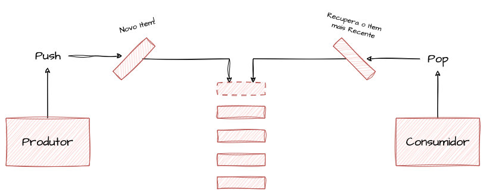

A diferença essencial entre queue e stack é o sentido de remoção dos itens: uma
stack é uma queue ao contrário. As operações são `Push` (empilhar no topo) e `Pop`
(retirar do topo). O exemplo em Go empilha "Pizza", "Hamburger" e "Churrasco".

##### Output:

A saída demonstra o comportamento LIFO: a ordem de saída é **invertida** em
relação à entrada — Churrasco, Hamburger e Pizza.

### Fanout

O **Fanout** é um padrão de envio 1:N. Em mensageria, ocorre quando uma única
mensagem precisa ser distribuída para várias filas; em eventos, é o comportamento
padrão de repassar a mesma mensagem para todos os grupos de consumidores
interessados no tópico. Em resumo, é enviar a mesma mensagem para todos os destinos
que façam sentido dentro de um contexto.

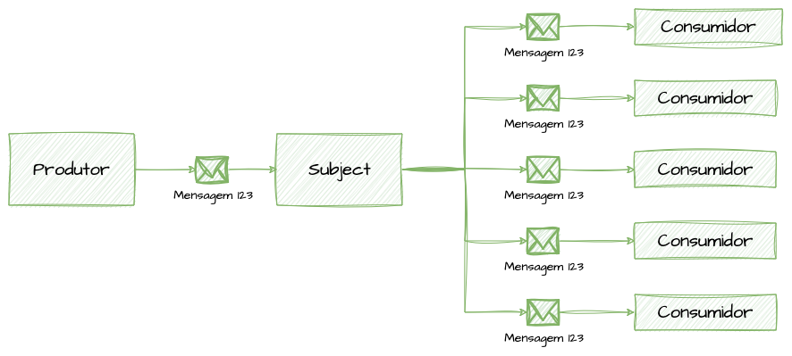

É útil quando precisamos notificar vários grupos simultaneamente, inclusive para
replicação de dados — por exemplo, duplicar processamento ou dado para outros
bancos, datacenters e subsistemas.

### DLQ - Dead Letter Queues

As **Dead Letter Queues** são mecanismos de post-mortem para mensagens que não
conseguiram ser processadas. Centralizam mensagens que falharam no consumo por
erros, timeouts de confirmação ou excesso de tentativas.

Elas permitem que os times tratem os casos de insucesso sem criar overhead de
retentativas infinitas na fila principal, podendo ainda reprocessar mensagens
depois de resolver uma indisponibilidade temporária de um subsistema.

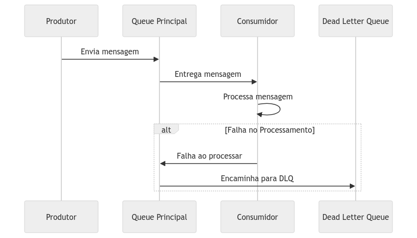

Com monitoramento adequado, as DLQs viram um indicador chave de saúde dos sistemas
assíncronos: como não faz parte do fluxo normal encaminhar muitas mensagens para
elas, observar o volume de mensagens em DLQs ao longo do tempo ajuda a detectar
problemas.

### Processamento em Batch

O processamento em **batch** pode ser considerado a origem da comunicação
assíncrona, que evoluiu até os modelos modernos de hoje. Consiste em uma ou um
grupo de tarefas que processam de uma vez um lote de dados acumulado dentro de um
período.

Processamentos bancários costumam rodar em batch em horários de baixo uso. A
abordagem também é comum em relatórios gerenciais, fechamentos contábeis e de
caixa, onde lançamentos, notas e transações de tempo real são acumulados para
serem contabilizados em lote.

Por operarem de forma autônoma e com grande volume, sistemas de batch precisam de
mecanismos robustos de tratamento de erro e recuperação, para que processos possam
ser retomados ou refeitos. Falhas fatais podem gerar prejuízos financeiros e
estratégicos por conta de atrasos e prazos.

## Protocolos e Arquiteturas Event-Driven

Arquiteturas orientadas a eventos (event-driven) são extremamente úteis em
ambientes distribuídos e facilitam o processamento e a análise de grandes volumes
de dados em tempo real (ou muito próximo disso). São ideais para compartilhar
mudanças de estado entre vários interessados, replicar dados e distribuir
responsabilidades entre sistemas de forma desacoplada.

### Streaming e Reatividade

**Streaming** é o padrão de processamento de um fluxo contínuo de dados gerados em
tempo real. Diferente do batch, que lida com blocos estáticos, o streaming trata
volumes iguais ou maiores em tempos muito próximos do momento em que os dados são
gerados, usando reatividade para executar suas funções.

Um exemplo clássico é o monitoramento de comportamento em redes sociais: cliques,
buscas e até a altura da rolagem viram eventos analíticos processados quase
instantaneamente para enriquecer relatórios e algoritmos de recomendação.

Outros exemplos são sistemas antifraude, que classificam transações conforme o
padrão de comportamento e pagamento, e plataformas de streaming de vídeo, que
recomendam títulos parecidos com base no histórico, sem precisar de uma janela
grande de tempo para decidir.

### Reatividade e Arquiteturas Event-Driven

Aplicações event-driven são projetadas para detectar eventos — vindos ou não de
streaming — e tomar decisões a partir deles. Várias aplicações podem reagir ao
mesmo evento de forma totalmente independente.

Esse grupo de padrões é bem-vindo em ambientes de constante mudança ou que reagem
a mudanças de estado de muitos objetos. A capacidade de múltiplos atores
responderem em tempo real torna o desacoplamento de sistemas de larga escala mais
eficiente.

O exemplo é um delivery de comida: diferentes grupos de listeners reagem a cada
mudança de status do pedido — `CRIADO` (notifica o restaurante e o usuário),
`ACEITO` (inicia a cobrança), `PRONTO` (notifica entregadores) e assim por diante
para `A_CAMINHO`, `ENTREGUE`, `FINALIZADO`, cada grupo agindo de forma autônoma.

## Kafka e Event Streaming

O **Apache Kafka**, embora não seja a única opção, é provavelmente a plataforma
mais associada a arquiteturas orientadas a eventos. Foi projetado para lidar com
alto volume de dados garantindo performance e alta disponibilidade. A seguir, seus
componentes e conceitos mais importantes.

### Clusters e Brokers

Um **cluster** Kafka é formado por vários servidores, cada um sendo um nó chamado
**broker**. O grupo de brokers recebe, armazena, replica e distribui os eventos
entre si em tópicos e partições, além de disponibilizá-los aos grupos de
consumidores conectados. Qualquer broker pode receber qualquer evento. A
distribuição de carga entre brokers pode ser feita por balanceadores de carga,
CNAMEs de DNS ou passando aos clientes a lista de brokers separada por vírgula.

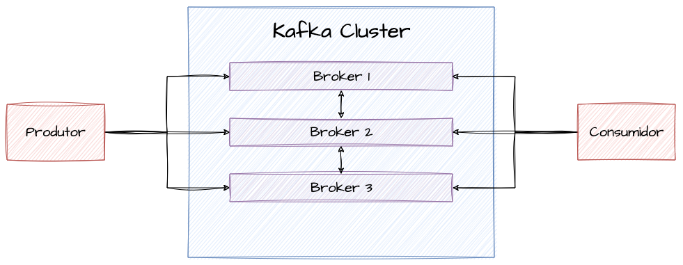

### Tópicos

Um **tópico** é uma "categoria" ou "assunto" — próximo da ideia de um "feed" de
eventos — no qual mensagens de um determinado contexto são publicadas. São o motor
das arquiteturas reativas e podem ter vários assinantes que recebem cópias dos
dados conforme são publicados. Internamente, são distribuídos e balanceados entre
partições para que um grupo maior de consumidores divida o trabalho.

Como representam um feed de um contexto específico, é importante nomeá-los de forma
consistente e clara, facilitando entender que dados trafegam ali — fator chave em
sistemas de larga escala que envolvem muitos times.

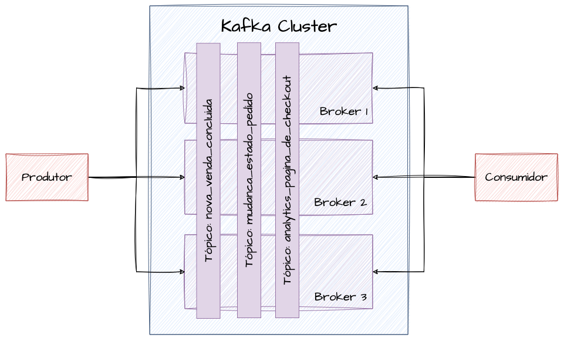

### Partições

**Partições** são subdivisões de um tópico que garantem distribuição e
balanceamento de carga. Permitem que os dados sejam divididos entre múltiplos
brokers e associados a múltiplos consumidores de um mesmo grupo, gerando o
paralelismo da arquitetura. Cada consumidor pode ler uma ou mais partições em
paralelo.

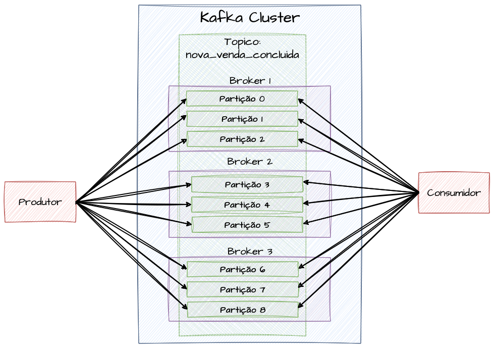

### Fatores de Replicação

O **fator de replicação** (replication factor) garante alta disponibilidade dos
eventos. Configurado no tópico, ele assegura que uma cópia do mesmo dado seja
mantida em brokers diferentes. Cada partição tem um broker **líder**, que gerencia
a replicação passiva para os brokers seguidores e responde pelas leituras.

Um replication factor de 2 significa duas cópias do dado (a original mais uma) em
brokers distintos; um fator 3 mantém a original mais duas réplicas, totalizando 3.

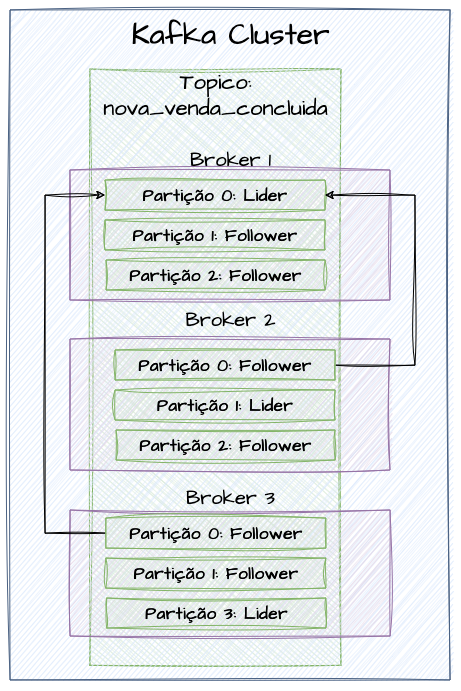

Uma consideração importante: o fator de replicação de um tópico **nunca deve
exceder** o número de brokers do cluster.

### Producers

Os **producers** (produtores) publicam eventos em um tópico específico. Podem
definir manualmente a partição de destino por meio de uma chave de partição, ou
deixar que o próprio Kafka distribua os eventos uniformemente.

Usar uma chave de partição permite, por exemplo, que todos os eventos de um
determinado cliente ou produto sejam sempre tratados pelo mesmo consumidor — útil
quando se quer "continuidade" ou "ordem". Por outro lado, isso pode gerar **hot
partitions**, desbalanceando a carga; em cenários de produção uniforme, costuma ser
melhor confiar nos algoritmos nativos de distribuição.

É preciso equilibrar disponibilidade e performance via **ACKs** (acknowledgments).
Com ACK igual a 0, há maior throughput em troca de menor garantia de entrega, pois
o produtor não espera confirmação. Quanto mais ACKs, maior a confiabilidade e
menor o throughput; quanto menos ACKs, maior o throughput e menor a confiabilidade.

A produção também pode usar **batches** de eventos, aproveitando uma única
solicitação para enviar muitas mensagens. O tamanho do batch impacta performance,
throughput e uso de rede/memória. Junto a ele, vale ajustar o `linger time` —
tempo máximo de buffering em memória antes de enviar o batch. Assim, mesmo com um
batch size de 1000 e linger time de 200ms, se só 300 ou 400 eventos forem
acumulados até o timeout, o batch é enviado para não represar eventos.

##### Exemplo de Produtor

O artigo traz um exemplo em Go usando a biblioteca `confluent-kafka-go`: o
produtor é configurado apontando para os brokers (`bootstrap.servers`), com um
`client.id` e `acks: all`, e então publica em loop 10 mensagens simuladas de venda
no tópico `ecommerce_nova_venda`, com `Partition: kafka.PartitionAny`, finalizando
com um `Flush` para aguardar a entrega.

### Consumers e Consumer Groups

Os **consumers** (consumidores) leem registros de uma ou mais partições para
processá-los. Para permitir múltiplas leituras de um mesmo dado por consumidores
com propósitos diferentes, eles se organizam em **consumer groups** identificados
por nome. Cada registro de uma partição é entregue a um único consumidor dentro de
cada grupo associado ao tópico, e o Kafka rebalanceia as partições entre os
consumidores automaticamente.

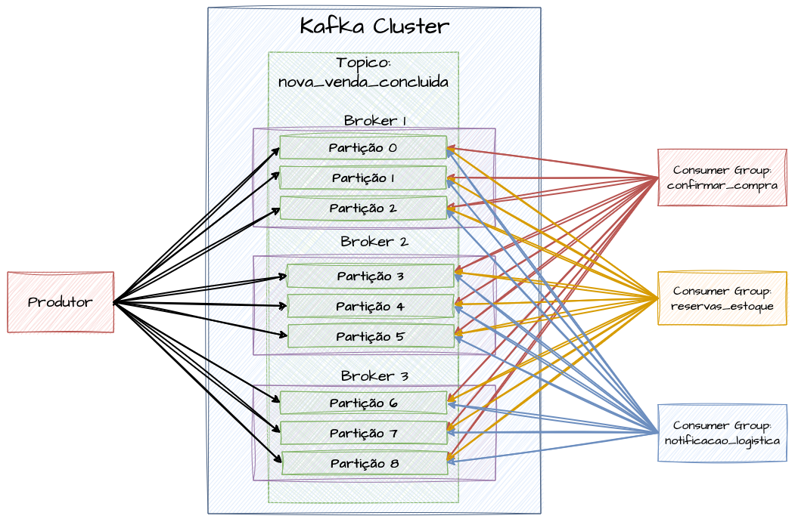

Um consumidor pode ler várias partições em paralelo, mas o número de consumidores
ativos **nunca excede** o número de partições. Com 9 partições e 9 consumidores,
atinge-se o máximo de paralelismo: réplicas adicionais (20, 30, 50) ficarão
ociosas. A escala horizontal de consumidores é, portanto, limitada pela quantidade
de partições.

##### Exemplo de um consumidor

O exemplo em Go cria um consumidor com `group.id` próprio (por exemplo
`ecommerce_faturamento_group`) e `auto.offset.reset: earliest`, inscreve-se no
tópico e entra em loop lendo mensagens. Importante: o `CommitMessage` (commit do
offset) deve ser feito apenas após o processamento bem-sucedido, para garantir a
integridade do consumo.

##### Output

A saída ilustra o consumidor recebendo mensagens em loop e confirmando o offset a
cada uma ("Mensagem recebida" seguido de "Offset commitado com sucesso").

## Protocolos e Arquiteturas de Message-Driven

As arquiteturas **Message-Driven** facilitam a troca eficiente e assíncrona de
mensagens entre sistemas distribuídos. Os dois protocolos mais importantes dessa
categoria são o **MQTT** (Message Queuing Telemetry Transport) e o **AMQP**
(Advanced Message Queuing Protocol).

Esses protocolos otimizam o tráfego, garantem a entrega e suportam padrões de
comunicação flexíveis e confiáveis. Enquanto o HTTP costuma servir a interações
síncronas de requisição/resposta, os protocolos assíncronos ampliam a capacidade
de processar tarefas custosas em background, paralelizar e distribuir trabalho
entre microsserviços e continuar em background um trabalho iniciado de forma
síncrona.

A seção inicial foca no funcionamento dos protocolos; a aplicação prática em
engenharia é detalhada posteriormente.

### MQTT (Message Queuing Telemetry Transport)

O **MQTT** é um protocolo de mensageria leve e eficiente, voltado a cenários com
recursos computacionais limitados e largura de banda instável. É muito usado em
IoT e Edge Computing, facilitando a comunicação entre dispositivos restritos e
servidores via modelo **publish/subscribe** (pub/sub): dispositivos publicam em
tópicos e os clientes inscritos recebem as mensagens, mesmo sob redes instáveis.
Destaca-se por simplicidade, eficiência e baixo consumo de energia.

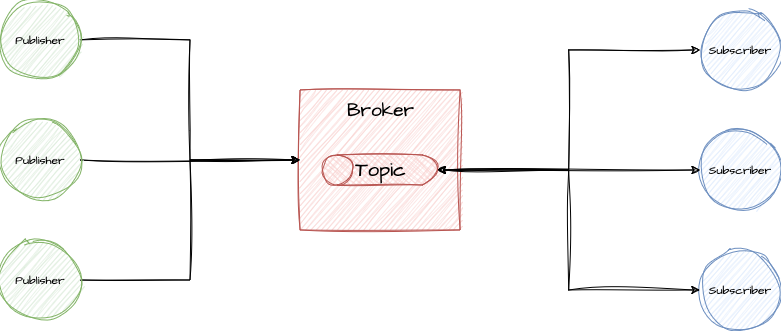

> Arquitetura MQTT Resumida

Na topologia, os **brokers** (clusters de servidores MQTT) centralizam e
orquestram as mensagens enviadas por vários dispositivos. Quem envia as mensagens
são os **Publishers**.

Após receber as mensagens, os brokers as armazenam em tópicos identificados na
publicação e as disponibilizam para consumo. As aplicações que consomem esses
dados são os **Subscribers**.

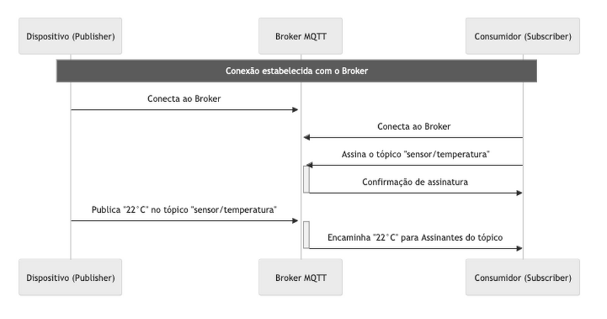

O MQTT opera sobre TCP/IP, com uma conexão de socket persistente entre cliente e
broker, oferecendo comunicação bidirecional confiável (pacotes chegam em ordem e
sem duplicidade). Dentro dessa conexão, os clientes podem **publicar** em tópicos
(mensagem `PUBLISH`) e **assinar** tópicos (mensagem `SUBSCRIBE`), trocando
mensagens de forma performática e confiável.

### MQTT Default Subscription

Na subscrição padrão, segue-se o pub/sub tradicional: cada assinante inscrito em um
tópico recebe uma **cópia** da mensagem publicada. Se três dispositivos assinam
`"sensor/temperatura"`, todos os três recebem cópias independentes da mensagem.

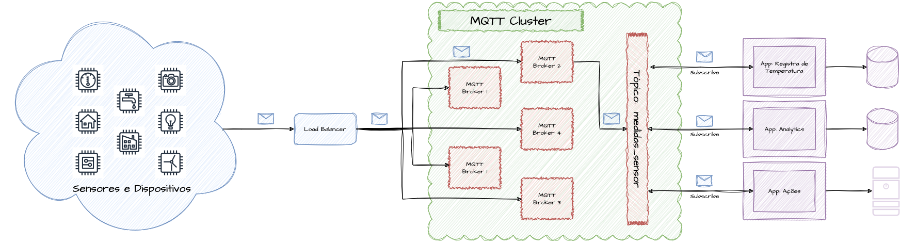

> Modelo de subscription padrão do MQTT

Esse modelo é útil quando todos os assinantes precisam receber todas as mensagens.
Por exemplo, a medição de `sensor/temperatura` pode ser, ao mesmo tempo, armazenada
em banco, enviada para análise e usada para acionar outro sistema — três aplicações
distintas recebendo simultaneamente a mesma informação.

### MQTT Shared Subscription

A **Shared Subscription**, introduzida em versões mais recentes do MQTT, permite um
modelo mais próximo do balanceamento de carga: em vez de cada assinante receber
cópia da mensagem, as mensagens são distribuídas de forma balanceada entre os
assinantes do grupo de subscrição compartilhada.

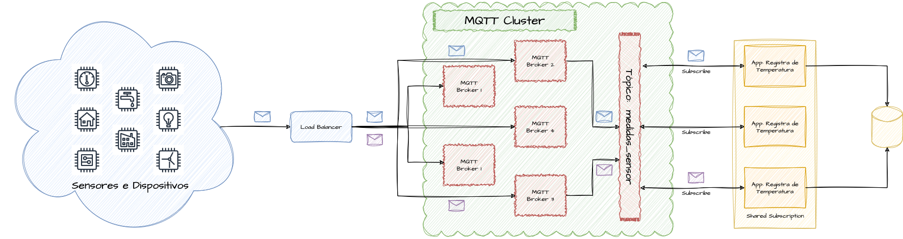

> Modelo de shared subscription do MQTT

É útil em processamento de mensagens em larga escala, em que o balanceamento entre
múltiplos consumidores otimiza o processamento de alto volume, gerando arquiteturas
mais escaláveis. Enquanto a subscrição normal entrega tudo a todos, a compartilhada
distribui a carga. É possível combinar as duas: criar várias shared subscriptions
que recebem a mesma mensagem e distribuem internamente a carga entre os membros de
cada pool.

## AMQP (Advanced Message Queuing Protocol)

O **AMQP** é um protocolo de mensageria aberto que, diferentemente do MQTT (focado
em simplicidade e eficiência), oferece um conjunto mais rico de recursos:
confirmação de mensagens, roteamento flexível e transações seguras.

É voltado à integração de sistemas corporativos e aplicações complexas, suportando
tanto pub/sub quanto enfileiramento de mensagens. Sua implementação mais conhecida é
o **RabbitMQ**.

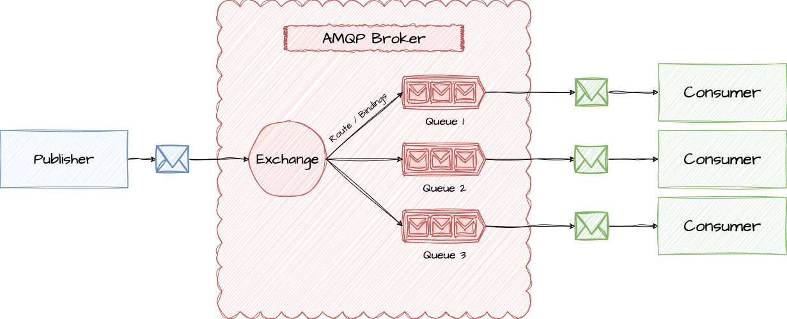

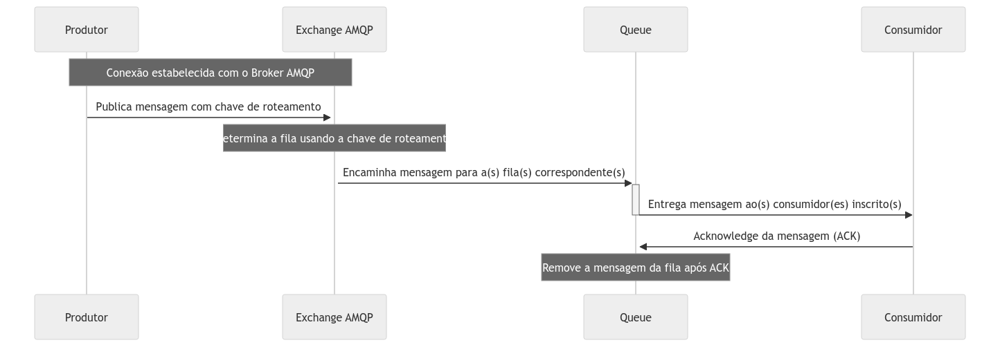

O fluxo começa com uma conexão TCP entre o cliente (produtor ou consumidor) e o
broker. Em seguida ocorre a negociação do protocolo: o cliente envia um header
indicando a versão do AMQP, e o servidor confirma ou sugere outra. Estabelecida a
sessão, vários **canais** lógicos podem ser criados sobre a mesma conexão TCP.

O produtor publica mensagens pelo canal, rotulando-as com uma chave de roteamento
ou enviando para uma **exchange** específica. O broker usa esses metadados (exchange
e routing key) para encaminhar a mensagem às filas corretas, onde aguardam consumo.

### Brokers

No AMQP, o **broker** é o intermediário centralizador entre produtores e
consumidores: gerencia a recepção, o tratamento, o armazenamento e o
direcionamento das mensagens para as filas corretas, usando os metadados enviados
pelo produtor. Ele agrupa exchanges, rotas e queues, e trabalha mais próximo do
nível físico.

### Channels

Um **Channel** é uma sessão virtual estabelecida por produtor e consumidor sobre o
próprio protocolo. Os channels são persistentes e permitem trafegar operações e
mensagens simultaneamente por uma única conexão, tornando o protocolo "barato"
computacionalmente. Cada sessão é uma conexão independente que evita a criação de
muitas conexões de rede, que sobrecarregariam os brokers em média/larga escala.

### Queues

Uma **queue** no AMQP mantém o conceito genérico de fila: a estrutura que armazena
temporariamente as mensagens até que sejam processadas pelo consumidor. Nelas
podem ser configurados parâmetros como persistência, visibilidade, durabilidade e
TTL. São os intermediários diretos entre o dado produzido e o consumido.

### Producers

O **producer** envia mensagens para uma exchange através dos canais, para que sejam
roteadas à queue correta. Sua responsabilidade é informar a mensagem e a **binding
key** que indica o roteamento dentro do conjunto de queues possíveis, podendo
definir persistência e prioridade da mensagem.

### Consumers

O **consumer** recebe as mensagens armazenadas na queue. Suas responsabilidades são
se inscrever nas queues de interesse e processar as mensagens conforme a lógica
definida. Pode operar em **auto-ack** (a recepção já dispara a remoção da mensagem)
ou com **confirmação manual** (após o processamento, o consumidor decide se a
mensagem pode ser removida ou reenviada em caso de erro).

### Exchanges e Binding Keys

As **Exchanges** recebem as mensagens dos produtores e, por regras de roteamento,
as entregam às queues corretas. Existem vários tipos — direct, topic, fanout e
headers — cada um com uma estratégia de roteamento. A escolha depende do padrão de
mensageria desejado, e a distribuição às queues é feita por meio das **binding
keys**.

### Tipos de Exchanges

O AMQP oferece tipos de exchanges com finalidades específicas, dando flexibilidade
ao comportamento de roteamento. Entre os mais úteis para projetar arquiteturas,
três são detalhados a seguir: **Direct**, **Topic** e **Fanout**.

#### Direct Exchange

A **Direct Exchange** é o tipo padrão e mais comum. Associa exchange e queue
usando a binding key, que precisa corresponder de forma **exata** para o
roteamento — caracterizando um encaminhamento ponto a ponto. É adequada para
distribuir "comandos" imperativos entre sistemas: "cobrar", "enviar", "processar",
"criar", "cadastrar".

No exemplo de e-commerce, cada sistema recebe mensagens com conteúdo específico e
não reaproveitável: a binding key `confirmar_compra` roteia para a fila de
confirmação, `enviar_email` para o envio de e-mail e `cobrar` para a fila de
cobrança.

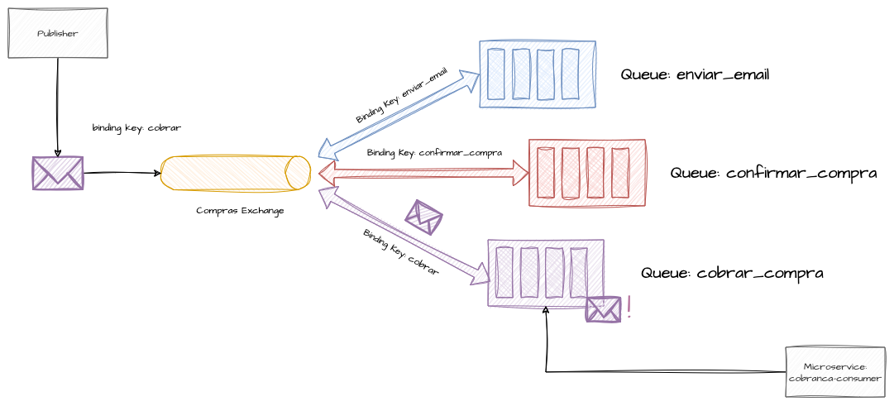

O exemplo cria uma exchange `ecommerce.nova.venda` simulando vendas concluídas, uma
queue `cobrar` e a associa à exchange com a binding key `cobrar`. Na produção,
conecta-se ao broker informando a exchange e a binding key `cobrar` para que a
mensagem fique disponível na queue.

##### Setup e Binding no Modo Direct

O trecho em Go abre a conexão e um canal, declara a exchange `ecommerce.nova.venda`
do tipo `direct` (durable), declara a queue `cobrar` e, por fim, executa o
`QueueBind` associando a queue à exchange com a binding key `cobrar`.

##### Producer no Modo Direct

O produtor publica em loop 10 mensagens na exchange `ecommerce.nova.venda` usando a
routing key `cobrar`. Cada mensagem carrega um `id` gerado via UUID como corpo em
`text/plain`.

##### Output

A saída do produtor mostra dez linhas "Mensagem de venda enviada para a exchange
ecommerce.nova.venda", cada uma com um UUID diferente.

##### Consumer no Modo Direct

O consumidor declara (ou reaproveita) a queue `cobrar` e registra um consumo com
**auto-ack desativado**. Em uma goroutine, processa cada mensagem recebida e faz a
confirmação manual via `d.Ack(false)`.

##### Output

A saída do consumidor lista as mensagens recebidas na queue `cobrar`, com os mesmos
UUIDs publicados pelo produtor — confirmando o roteamento ponto a ponto.

#### Topic Exchange

A **Topic Exchange** permite roteamento mais dinâmico que a correspondência exata da
Direct. O binding é baseado em padrões da binding key, usando curingas: `*`
substitui exatamente uma palavra e `#` substitui zero ou mais palavras.

O cenário é o faturamento do e-commerce: a queue `queue.faturamento` recebe o fluxo
geral, mas alguns clientes críticos precisam de SLA menor e não podem concorrer com
o volume total, então cria-se `queue.faturamento.prioritario`. As binding keys
`faturamento.prioridade.default` e `faturamento.prioridade.alta` diferenciam os
fluxos.

Além disso, todas as mensagens de faturamento — independentemente da prioridade —
devem ir para um data lake, via `queue.faturamento.datalake`, usando uma binding
com curinga `faturamento.prioridade.*`. Assim, qualquer mensagem que case com esse
padrão também chega à fila do data lake.

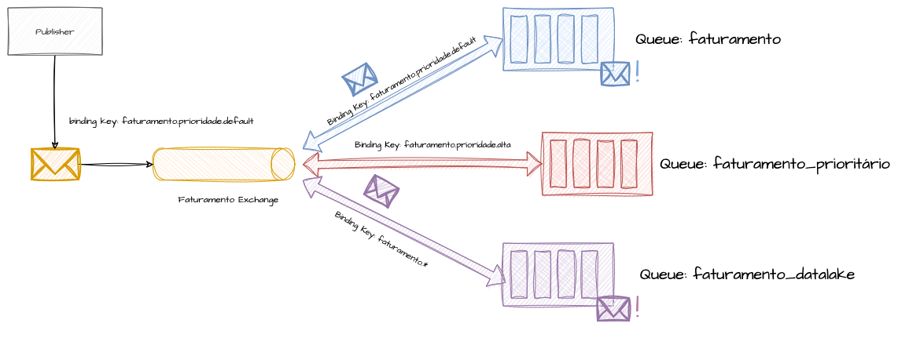

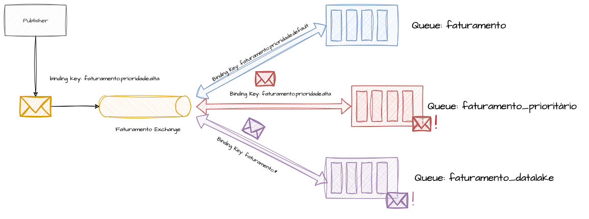

O exemplo reproduz esse cenário com três queues e três bindings: faturamento
default, faturamento de prioridade alta e o envio analítico para o datalake. A
prioridade informada na produção define o microsserviço segregado de destino, e a
mensagem também segue de forma genérica para o datalake.

##### Setup e Binding no Topic

O trecho em Go declara a exchange `ecommerce.nova.venda.faturamento` do tipo
`topic` e cria as três queues com seus respectivos binds: `queue.faturamento` com
`faturamento.prioridade.default`, `queue.faturamento.prioritario` com
`faturamento.prioridade.alta` e `queue.faturamento.datalake` com o curinga
`faturamento.prioridade.*`.

##### Producer no Modo Topic

O produtor envia 20 mensagens, usando por padrão a routing key
`faturamento.prioridade.default` e, em cerca de 10% dos casos (sorteio aleatório),
`faturamento.prioridade.alta`, simulando a chegada esporádica de pedidos
prioritários.

##### Output - Produtor

A saída do produtor mostra as 20 mensagens publicadas, a maioria com a prioridade
default e algumas poucas marcadas como prioridade alta, cada uma com seu UUID.

##### Output - Consumidor Default

O consumidor da `queue.faturamento` processa apenas as mensagens de prioridade
default, ignorando as prioritárias — que foram roteadas para outra fila.

##### Output - Consumidor Prioritario

O consumidor da `queue.faturamento.prioritario` recebe somente as poucas mensagens
de prioridade alta, demonstrando a segregação por binding key.

##### Output - Consumidor Lake

O consumidor da `queue.faturamento.datalake` recebe **todas** as mensagens
(default e alta), pois o curinga `faturamento.prioridade.*` casa com ambos os
padrões — confirmando a duplicação para o analítico.

#### Fanout Exchange

A **Fanout Exchange** vincula várias queues a uma única exchange e replica a mesma
mensagem para todas elas **sem precisar de binding key**. É útil para notificar
vários subsistemas simultaneamente, aproximando-se de um evento, mas ainda dentro
da mensageria.

O exemplo notifica ao mesmo tempo os sistemas de cobrança, logística e estoque
sobre uma nova venda. Esses processos rodam em paralelo, não exigem ordem
específica e podem usar o mesmo payload — cenário ideal para fanout, em que uma
única produção entrega a mensagem idêntica a todas as queues associadas.

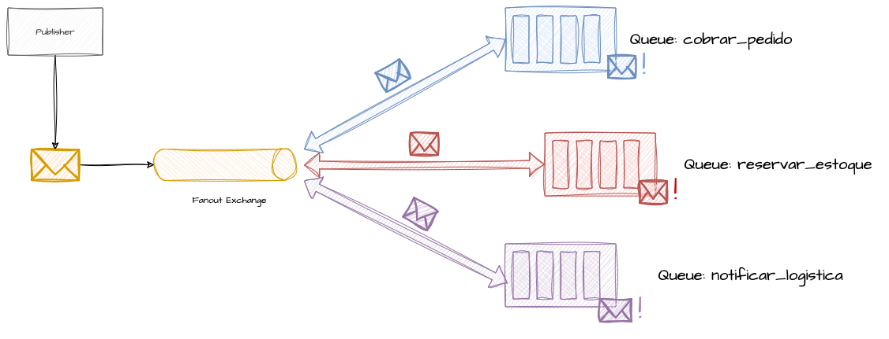

##### Setup no Fanout

O trecho declara a exchange `ecommerce.nova.venda` do tipo `fanout` e cria as
queues `cobrar_pedido`, `reservar_estoque` e `informar_logistica`, associando todas
à exchange com a binding key **vazia** (ignorada no fanout).

##### Producer no Fanout

O produtor publica 10 mensagens na exchange `ecommerce.nova.venda` com a routing
key vazia. Cada mensagem leva um UUID como corpo e é replicada para as três queues.

##### Output - Produtor

A saída do produtor mostra as mensagens de venda enviadas à exchange
`ecommerce.nova.venda`, cada uma com seu UUID.

##### Output - Consumidor Cobranca

O consumidor da queue `cobrar_pedido` recebe **todas** as mensagens publicadas,
com os mesmos UUIDs do produtor.

##### Output - Consumidor Logistica

O consumidor da queue `informar_logistica` também recebe **todas** as mensagens,
com os mesmos UUIDs — confirmando a replicação 1:N do fanout.

##### Output - Consumidor Estoque

O consumidor da queue `reservar_estoque` recebe igualmente **todas** as mensagens,
demonstrando que cada queue associada à fanout exchange recebe uma cópia idêntica.

# Referências

* [MQTT](https://mqtt.org/)

* [O que é MQTT?](https://aws.amazon.com/pt/what-is/mqtt/)

* [Conhecendo o MQTT](https://www.mercatoautomacao.com.br/blogs/novidades/conhecendo-o-mqtt)

* [Arquitetura do agente MQTT independente no Google Cloud](https://cloud.google.com/architecture/connected-devices/mqtt-broker-architecture?hl=pt-br)

* [Eclipse Paho MQTT Go client](https://pkg.go.dev/github.com/eclipse/paho.mqtt.golang#section-readme)

* [AMQP](https://www.amqp.org/)

* [Advanced Message Queuing Protocol](https://pt.wikipedia.org/wiki/Advanced_Message_Queuing_Protocol)

* [AMQP — Propriedades de Mensagem](https://medium.com/xp-inc/amqp-propriedades-de-mensagem-f56a14e92409)

* [FAQ: What is AMQP and why is it used in RabbitMQ?](https://www.cloudamqp.com/blog/what-is-amqp-and-why-is-it-used-in-rabbitmq.html)

* [RabbitMQ Exchange Type](https://hevodata.com/learn/rabbitmq-exchange-type/)

* [Enqueue and Dequeue](https://docs.oracle.com/cd/E19253-01/820-0446/chp-sched-10/index.html)

* [Livro - Criando Microsserviços: Projetando Sistemas com Componentes Menores e Mais Especializados](https://www.amazon.com.br/Criando-Microsservi%C3%A7os-Projetando-Componentes-Especializados/dp/6586057884/)

* [Livro - Software Architecture: The Hard Parts (English Edition)](https://www.amazon.com.br/Software-Architecture-Hard-Parts-English-ebook/dp/B09H2H5QKC)

* [Livro - Arquitetura de software: as partes difíceis: análises modernas de trade-off para arquiteturas distribuídas (Edição PT-BR)](https://www.amazon.com.br/Arquitetura-software-trade-off-arquiteturas-distribu%C3%ADdas-ebook/dp/B0CY5B9G9Y)

* [Kafka - Architecture](https://kafka.apache.org/10/documentation/streams/architecture)

* [Kafka Basics and Core Concepts](https://medium.com/inspiredbrilliance/kafka-basics-and-core-concepts-5fd7a68c3193)

* [Apache Kafka: 10 essential terms and concepts explained](https://www.redhat.com/en/blog/apache-kafka-10-essential-terms-and-concepts-explained)

* [Event Driven Architecture, The Hard Parts: Events Vs Messages](https://medium.com/simpplr-technology/event-driven-architecture-the-hard-parts-events-vs-messages-0fcfc7243703)

* [How Much Data Does Streaming Netflix Use?](https://www.buckeyebroadband.com/support/internet/how-much-data-does-streaming-netflix-use)

* [Apache Kafka – linger.ms and batch.size](https://www.geeksforgeeks.org/apache-kafka-linger-ms-and-batch-size/)

* [Github: AMQP Producer e Consumer Default - Exemplos](https://github.com/msfidelis/system-design-examples/tree/main/messages/rabbit-mq/default)

* [Github: AMQP Producer e Consumer Topic - Exemplos](https://github.com/msfidelis/system-design-examples/tree/main/messages/rabbit-mq/topic)

* [Github: AMQP Producer e Consumer Fanout - Exemplos](https://github.com/msfidelis/system-design-examples/tree/main/messages/rabbit-mq/fanout)

* [Github: Kafka Producer e Consumer Exemplos](https://github.com/msfidelis/system-design-examples/tree/main/kafka)

* [Message Driven vs Event Driven](https://developer.lightbend.com/docs/akka-guide/concepts/message-driven-event-driven.html)

* [R2DBC](https://r2dbc.io/)

* [R2DBC - Reactive Relational Database Connectivity](https://www.baeldung.com/r2dbc)

* [Getting Started with Reactive Relational Database Connectivity and the Oracle R2DBC Driver](https://www.baeldung.com/r2dbc)

* [Firebase Cloud Messaging](https://firebase.google.com/docs/cloud-messaging)

* [Amazon SQS](https://aws.amazon.com/pt/sqs/getting-started/)
