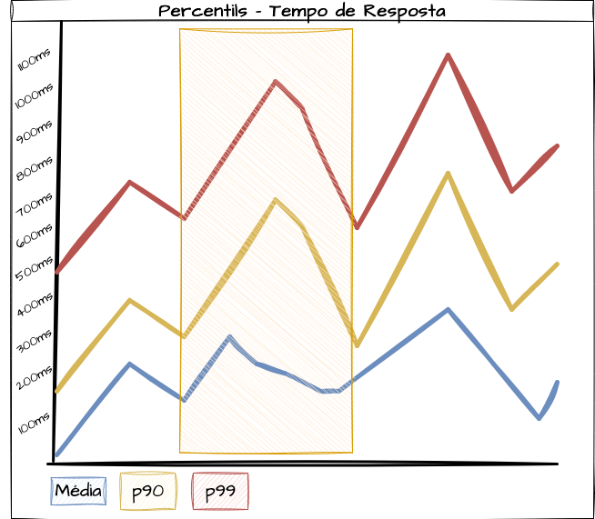
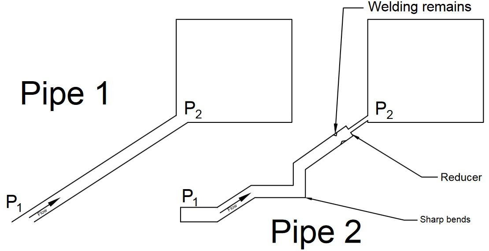
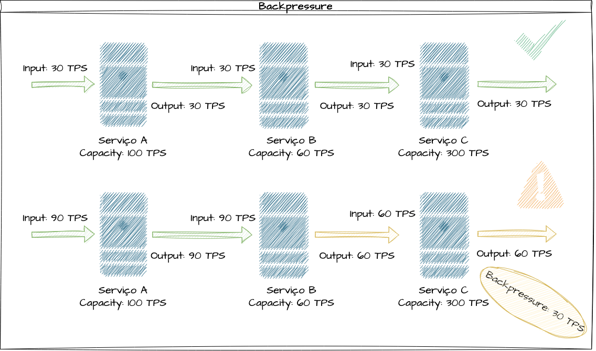
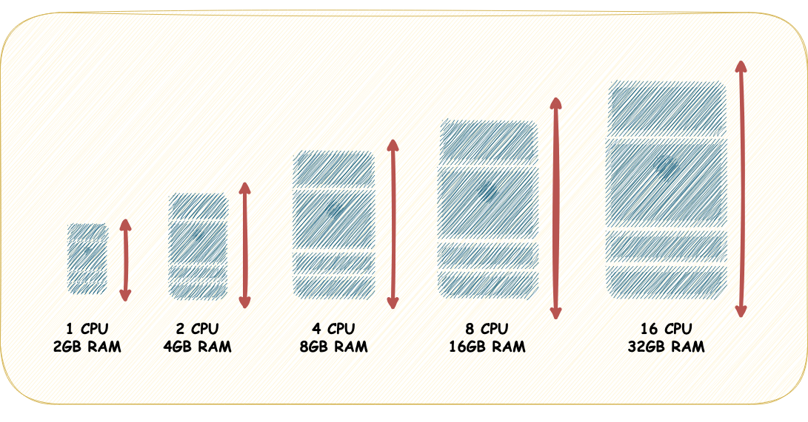
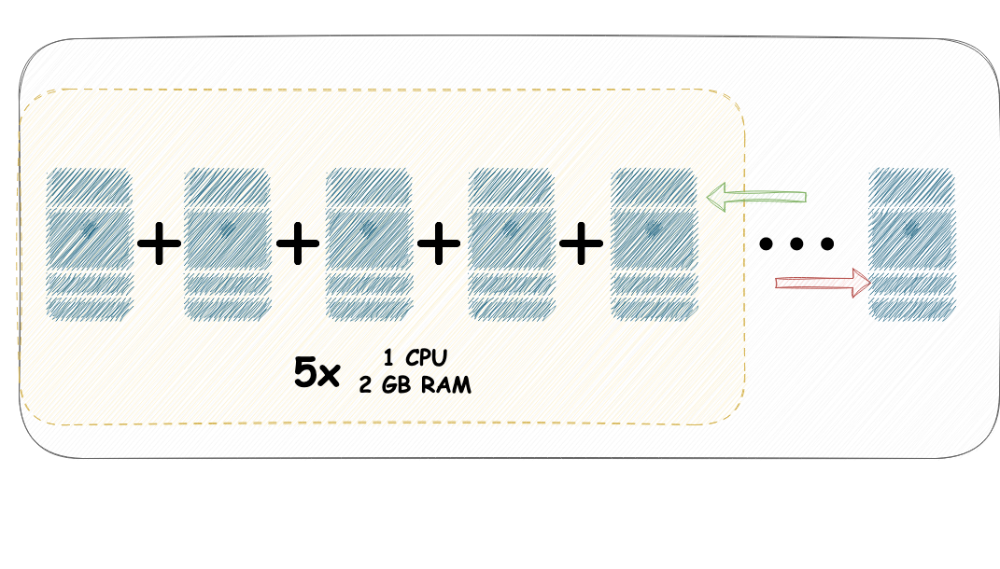

# System Design - Performance, Capacidade e Escalabilidade

- [System Design - Performance, Capacidade e Escalabilidade](#system-design---performance-capacidade-e-escalabilidade)
- [Definindo Performance](#definindo-performance)
  - [Métricas de Performance](#métricas-de-performance)
    - [Utilização e Saturação de Recursos](#utilização-e-saturação-de-recursos)
    - [Throughput, ou Tráfego](#throughput-ou-tráfego)
    - [Tempo de Resposta](#tempo-de-resposta)
    - [Taxa de Erros](#taxa-de-erros)
    - [Utilizando Percentis em Métricas de Performance](#utilizando-percentis-em-métricas-de-performance)
- [Definindo Capacidade](#definindo-capacidade)
  - [Gargalos de Capacidade](#gargalos-de-capacidade)
  - [Backpressure de Capacidade](#backpressure-de-capacidade)
  - [Custo de Transação por Capacidade](#custo-de-transação-por-capacidade)
- [Definindo Escalabilidade](#definindo-escalabilidade)
  - [Importância da Escalabilidade em Sistemas Modernos](#importância-da-escalabilidade-em-sistemas-modernos)
  - [Escalabilidade Vertical e Escalabilidade Horizontal](#escalabilidade-vertical-e-escalabilidade-horizontal)
    - [Escalabilidade Vertical](#escalabilidade-vertical)
      - [Scale Up e Scale Down](#scale-up-e-scale-down)
    - [Escalabilidade Horizontal](#escalabilidade-horizontal)
      - [Scale Out e Scale In](#scale-out-e-scale-in)
- [Planejamento de Capacidade e Escalabilidade](#planejamento-de-capacidade-e-escalabilidade)
  - [Fórmula Básica para Capacidade](#fórmula-básica-para-capacidade)
  - [Utilização de Recursos Computacionais](#utilização-de-recursos-computacionais)
  - [Requisições e Transações por Períodos de Tempo (Throughput)](#requisições-e-transações-por-períodos-de-tempo-throughput)
  - [Escalabilidade de Software](#escalabilidade-de-software)
- [Referências](#referências)

> **Nota:** Este documento é um material de estudo baseado no artigo original
> **"System Design - Performance, Capacidade e Escalabilidade"**, de
> **Matheus Fidelis**, publicado em
> [fidelissauro.dev/performance-capacidade-escalabilidade](https://fidelissauro.dev/performance-capacidade-escalabilidade/).
> As ilustrações pertencem ao autor original. Recomenda-se a leitura do artigo
> completo na fonte.

---

Este material reúne três temas que, embora distintos, se entrelaçam o tempo
todo em System Design: **performance**, **capacidade** e **escalabilidade**. A
abordagem é conceitual, com foco em entender como cada pilar influencia os
demais. São assuntos densos o suficiente para renderem textos separados, mas
ganham profundidade quando estudados em conjunto.

# Definindo Performance

Performance é, de forma resumida, a medida de **quão rápido e eficiente** um
sistema ou algoritmo consegue processar uma única transação — seja isolada,
seja em meio a um grande volume de operações simultâneas. É a faceta mais
percebida pelo usuário final, ainda que envolva uma série de termos técnicos e
complexidades das disciplinas de engenharia de software.

A avaliação de performance precisa sempre ser interpretada à luz dos
**requisitos funcionais e não funcionais** do sistema. Um serviço de
processamento em tempo real carrega expectativas de desempenho bem diferentes
das de um sistema voltado ao armazenamento de longo prazo. Não existe número
"bom" no vácuo: o que vale é o contexto.

## Métricas de Performance

Compreender como o sistema se comporta sob diferentes condições — picos de
carga, falhas de componentes, mudanças no padrão de uso — é essencial. Para
isso, dependemos de **monitoramento contínuo de indicadores-chave** (KPIs,
service levels, etc.). Observar essas métricas de forma sequencial, ao longo de
vários períodos, gera insumo para decisões de design, manutenção, operação,
comparação de benchmarks e priorização de melhorias.

Algumas métricas são praticamente universais; outras nascem de necessidades
específicas de negócio. Identificar quais vale a pena acompanhar é um trabalho
contínuo, fortemente ligado à maturidade e às "horas de voo" do software.

Para este estudo, o foco recai sobre o conjunto básico conhecido como **Four
Golden Signals**, popularizado pelo Google no livro
[Site Reliability Engineering](https://sre.google/sre-book/table-of-contents/).
São as quatro métricas centrais para entender a saúde de um sistema
distribuído: **Saturação**, **Tráfego**, **Tempo de Resposta** e **Taxa de
Erros**. Aqui elas são vistas sob a ótica de performance, e não de
observabilidade — tema reservado para um capítulo próprio.

### Utilização e Saturação de Recursos

A **utilização** indica quanto de um recurso disponível está em uso. Quando
essa taxa se aproxima do limite máximo possível ou esperado, dizemos que o
recurso está **saturado**. A saturação pode ocorrer em CPU, memória, disco ou
até em um pool de conexões de rede, e acompanhá-la ajuda a antecipar problemas
de desempenho e a saber quando escalar.

Algoritmos intensivos em CPU, memória, disco e rede são especialmente sensíveis
a otimizações e degradações. Medir a saturação serve para responder perguntas
como "a partir de qual percentual de CPU meu tempo de resposta começa a sofrer?"
ou "a partir de qual I/O de disco meu banco começa a degradar as consultas?".
Conseguir respondê-las com clareza é um sinal de maturidade da equipe.

A utilização pode ser expressa pela razão entre recurso consumido e recurso
disponível, multiplicada por 100. No exemplo do artigo, um sistema com 2 GB de
RAM disponíveis usando 1 GB apresenta 50% de utilização. Vale o alerta: um
recurso pode degradar a performance **antes mesmo de chegar a 100%** de
utilização.

### Throughput, ou Tráfego

O **throughput** descreve o número de operações que um sistema consegue
realizar em um dado intervalo de tempo — requisições por segundo, vendas por
minuto, arquivos por dia, eventos por mês. Em aplicações web, costuma ser
contabilizado pela quantidade de requisições HTTP recebidas e respondidas.

A métrica é obtida dividindo as unidades de trabalho processadas pelo tempo. Um
sistema que recebeu 6.000 requisições no último minuto, por exemplo, tem um
throughput de 100 rps. Representar isso matematicamente ajuda a saber até que
ponto o sistema atende à demanda antes de comprometer tempo de resposta e taxa
de erros — e serve de base para acionar estratégias de escalabilidade dinâmica.

### Tempo de Resposta

O **tempo de resposta** é o intervalo total entre o envio de uma solicitação e
o recebimento da resposta. Ele soma a **latência** (ida e volta na rede) e o
**tempo de processamento** no servidor. Do ponto de vista do usuário, é o tempo
entre executar uma ação e ver o resultado. Em sistemas escaláveis, o ideal é
que esse valor não cresça de forma significativa à medida que a carga aumenta.

A latência representa o atraso de rede — influenciado por distância física,
meio de transmissão e dispositivos intermediários como roteadores. Já o tempo
de processamento é o que o servidor leva para tratar a requisição depois de
recebê-la. Medido a partir do cliente, o tempo de resposta é simplesmente o
timestamp da resposta menos o timestamp da requisição.

Cada um desses componentes pode ser observado isoladamente e em pontos
distintos da operação. Essa granularidade é valiosa em troubleshooting, pois
permite localizar exatamente onde a degradação aconteceu.

### Taxa de Erros

A **taxa de erros** é a porcentagem de requisições que falham em relação ao
total processado. Combinada a tempo de resposta e throughput, ela permite
conclusões importantes sobre o comportamento do sistema. Um sistema bem
planejado deve **manter ou reduzir** sua taxa de erro mesmo quando a carga
cresce.

O cálculo é direto: número de erros dividido pelo total de tentativas,
multiplicado por 100. No exemplo, 50 erros em 1.000 transações resultam em 5%.
Acompanhar essa métrica ao longo do tempo ajuda a identificar tendências,
avaliar o impacto de mudanças e priorizar áreas que precisam de melhoria —
especialmente em produção, onde a estabilidade é crítica.

### Utilizando Percentis em Métricas de Performance

Percentis dividem um conjunto ordenado de dados em cem partes iguais e oferecem
uma visão muito mais rica do que a média isolada. Em análises de tempo de
resposta, execução de queries e uso de recursos, eles revelam **outliers e
picos** que a média costuma esconder.

Um percentil é o valor abaixo do qual cai determinada porcentagem dos dados. O
**p90** de 800ms, por exemplo, indica que 90% das respostas são mais rápidas do
que isso. Percentis altos, como p95 e p99, são ótimos para flagrar
comportamentos anormais e extremos que prejudicam a experiência do usuário.

O artigo ilustra o ponto com um cenário onde a média de resposta é de 200ms —
aparentemente excelente. Ao olhar os percentis, porém, o p95 é de 700ms e o p99
chega a 1000ms. Ou seja, embora a maioria das requisições seja rápida, há um
volume relevante de respostas bem mais lentas do que a média sugere. Avaliar
esses outliers é fundamental para planejar capacidade e identificar gargalos.

# Definindo Capacidade

Capacidade é a **quantidade máxima de trabalho** que um sistema consegue
receber e processar de forma eficaz em um dado período. É a forma de descobrir o
limite atual do sistema, considerando CPU, memória, armazenamento, rede e
também a performance dos algoritmos. Ao pensar em prazos de curto, médio e longo
prazo, monitorar recursos e dependências é tão importante quanto monitorar
desempenho.

O conceito é central na arquitetura e no planejamento de infraestrutura. Ele
abrange tanto a habilidade de processar dados e transações — ligada ao poder
computacional e à eficiência — quanto a de suportar muitos usuários simultâneos
sem degradar, adaptando-se a cargas crescentes para manter a experiência
constante.

Trabalhar capacidade não se resume a dimensionar recursos. Envolve também
**estratégias de monitoramento, observabilidade, gestão de desempenho,
automações e escalabilidade**.

## Gargalos de Capacidade

Gargalos são pontos onde o desempenho ou a capacidade ficam limitados por um
componente que não dá conta da carga. Eles podem surgir em hardware, software
ou na arquitetura de rede. Um erro comum, mesmo entre profissionais
experientes, é associar gargalos apenas à infraestrutura — quando, na prática,
**código mal otimizado, algoritmos ineficientes e problemas de concorrência**
(deadlocks, excesso de locks) costumam ser limitadores ainda mais difíceis de
superar.

Um design que não distribui bem a carga acaba criando gargalos por conta
própria, como um ponto central de processamento que deveria ter sido dividido
em partes. Em essência, o gargalo se manifesta quando a **demanda supera a
capacidade**.

Identificar e resolver gargalos é a chave para otimizar performance e
escalabilidade, e geralmente exige monitoramento detalhado, testes de carga e
ajustes finos. Há, porém, um detalhe importante: ao resolver um gargalo, a
carga flui adiante e pode **revelar um novo gargalo** no componente seguinte.
Por isso, é um processo dinâmico e contínuo.

## Backpressure de Capacidade

**Backpressure** (ou "repressão") tem várias definições conforme o contexto.
Aqui, a inspiração vem da engenharia física — mais especificamente da gestão de
fluidos —, onde o termo descreve a resistência oposta ao movimento de um fluido.

> Backpressure, ou Repressão, é o termo usado para definir uma resistência ao
> fluxo desejado de fluido através de tubos. Obstruções ou curvas apertadas
> criam contrapressão devido a perda de carga por atrito e queda de pressão.

Em software, o backpressure acontece quando um componente recebe mais dados ou
requisições do que consegue processar, gerando aumento de tempo de resposta,
falhas e até perda de dados. O artigo ilustra com uma transação que percorre os
serviços A, B e C, suportando respectivamente 100, 60 e 300 TPS. Com 90 TPS,
todos absorvem o fluxo sem problemas.

A 100 TPS, porém, o serviço B — limitado a 60 — acumula 40 transações por
segundo de represamento. Num cenário ainda mais crítico, com 120 TPS injetadas,
o gargalo total chega a 60 TPS, ou seja, 50% de degradação entre entrada e
saída.

O serviço mais performático do fluxo (C, com 300 TPS) fica permanentemente
ocioso, limitado pelos componentes anteriores. Vale a máxima atribuída a Henry
Ford: "uma corrente é tão forte quanto seu elo mais fraco". O throughput e a
capacidade de um sistema sempre serão restringidos pelo seu componente mais
degradado.

## Custo de Transação por Capacidade

Avaliar o **custo por transação** é uma forma de medir a eficiência e o
custo-benefício da capacidade alocada. Trata-se de uma métrica financeira
especialmente relevante em nuvens públicas, onde cada recurso pesa no caixa.
Normalmente, considera-se apenas as requisições do cliente final, sem
multiplicar pelos subsistemas e microserviços internos transparentes ao
usuário.

O cálculo divide o **custo operacional total** pelo **total de transações** no
mesmo período. Em sistemas com demanda variável, esse valor muda ao longo do
tempo — daí a importância de considerar os picos. Em geral, um custo por
transação mais baixo indica maior eficiência e melhor aproveitamento dos
recursos.

# Definindo Escalabilidade

Escalabilidade é a capacidade de um sistema crescer e absorver aumento de carga
**sem comprometer qualidade, desempenho e eficiência** — seja mais usuários,
transações, dados ou recursos. É um atributo crítico para sistemas que esperam
crescimento e especialmente importante em nuvem, onde as demandas mudam
rapidamente.

No livro *Release It!*, de Michael T. Nygard, a escalabilidade é vista de duas
formas: como o throughput varia conforme a demanda (relacionando requisições
por segundo e tempo de resposta) e como os modos de escala disponíveis em um
sistema. Adota-se aqui a segunda definição: **a capacidade de adicionar ou
remover capacidade computacional**.

Uma analogia útil é o ar-condicionado regulado para 20°C: quando o ambiente
esquenta, ele aumenta a potência; quando esfria, reduz — sempre buscando
estabilizar o objetivo. Sistemas escaláveis fazem o mesmo com seus recursos.

## Importância da Escalabilidade em Sistemas Modernos

A escalabilidade permite que sistemas se adaptem rapidamente a variações de
tráfego e demanda, mantendo desempenho consistente sob qualquer carga. Em
negócios dinâmicos, escalar conforme necessário é o que garante continuidade,
eficiência operacional e uma experiência de usuário satisfatória mesmo em
picos.

Há ainda um ganho econômico: sistemas escaláveis aproveitam recursos de forma
mais eficiente, **pagando apenas pelo que se usa** e reduzindo desperdício.
Além disso, facilitam a evolução do produto e a adição de funcionalidades sem
exigir uma reestruturação completa da infraestrutura já projetada.

## Escalabilidade Vertical e Escalabilidade Horizontal

Existem dois grandes tipos de escalabilidade no design de sistemas: a
**vertical** e a **horizontal**. Para ilustrá-los, o artigo usa o exemplo de
uma empresa de ônibus cuja missão é levar passageiros de um ponto A a um ponto
B.

A frota inicial comportava cerca de 100 passageiros por horário, mas o aumento
gradual da demanda passou a gerar filas, atrasos e reclamações. A partir desse
problema, exploram-se as duas estratégias de escala.

### Escalabilidade Vertical

Uma solução para a superlotação seria trocar parte da frota por **ônibus de
dois andares**, dobrando a capacidade de cada veículo. Esse é o paralelo da
escalabilidade vertical: aumentar (ou reduzir) a capacidade de um mesmo
componente adicionando ou removendo recursos dele.

Na prática, a escala vertical envolve ajustar CPU, RAM, disco ou rede de um
único recurso — sem se limitar a isso, podendo incluir também otimizações de
algoritmo para melhorar o I/O. É uma abordagem mais simples, mas que esbarra em
**limites físicos e de custo**.

O foco do design vertical está em **maximizar o processamento e a eficiência de
um único servidor ou recurso**, otimizando algoritmos e escolhendo tecnologias
que melhor aproveitem CPU e memória.

#### Scale Up e Scale Down

As operações de **scale-up** e **scale-down** pertencem à escalabilidade
vertical. **Scale-up** significa aumentar os recursos de um servidor — mais
CPU, mais RAM, mais armazenamento. **Scale-down** é o inverso: reduzir esses
recursos quando deixam de ser necessários. Ambas ajustam a capacidade de um
único componente.

### Escalabilidade Horizontal

A outra alternativa para a superlotação seria comprar **mais unidades dos mesmos
ônibus**, em vez de substituir a frota. Mais veículos operando na rota
distribuem os passageiros entre si — exatamente como funciona a escalabilidade
horizontal.

A escala horizontal consiste em **adicionar ou remover unidades computacionais**
(servidores, contêineres, réplicas) de um sistema. Quando uma aplicação web em
um único nó começa a receber muito tráfego, adicionam-se réplicas para dividir a
carga, geralmente por meio de um
[Balanceador de Carga](https://fidelissauro.dev/load-balancing/). Quando
automatizada, essa capacidade também é chamada de **elasticidade**.

Para que funcione bem, o sistema precisa ser projetado com **arquitetura
distribuída**, capaz de processar solicitações com paralelismo externo.

#### Scale Out e Scale In

**Scale-out** e **scale-in** pertencem à escalabilidade horizontal.
**Scale-out** aumenta o número de servidores ou réplicas que desempenham a
mesma função, distribuindo a carga entre eles; **scale-in** reduz esse número.
As duas operações podem ser combinadas para **ajustar dinamicamente** a
capacidade conforme a demanda oscila.

# Planejamento de Capacidade e Escalabilidade

Esta seção apresenta uma métrica essencial para avaliar capacidade e
escalabilidade e mostra como aplicá-la em fórmulas que calculam ajustes de
capacidade ligados à escalabilidade horizontal. A fórmula base usada foi
extraída do funcionamento do **Horizontal Pod Autoscaler (HPA)** do Kubernetes,
mas é genérica o suficiente para ser implementada em diversos contextos.

A ideia é explorar cenários e métricas relevantes e, em seguida, aplicar a
fórmula para descobrir quantos recursos computacionais um sistema precisa para
contornar um gargalo.

## Fórmula Básica para Capacidade

A fórmula base busca determinar a **quantidade ideal de réplicas** para atender
ao sistema. Em termos gerais, multiplica-se o número de réplicas atuais pela
razão entre o **valor atual** da métrica observada e o **valor desejado** dessa
métrica.

À primeira vista o conceito parece abstrato, mas se torna claro com exemplos. O
"valor desejado" é a meta que queremos que a métrica atinja, enquanto o "valor
atual" é o que está sendo medido naquele momento. As seções seguintes aplicam
essa lógica a cenários concretos.

## Utilização de Recursos Computacionais

A forma mais simples de aplicar a fórmula é por meio da **utilização de CPU e
memória**, métricas fáceis de calcular, planejar e monitorar — por isso muito
usadas em autoscaling. O objetivo é descobrir quanto de cada recurso está em
uso; utilização excessiva indica gargalo, e a fórmula aponta o reajuste
necessário.

No exemplo do artigo, parte-se de 6 réplicas, cada uma podendo usar 200
milicores, com 1200m solicitados, 600m disponíveis e meta de 80% de utilização.
O cálculo intermediário (1200m ÷ 600m × 100) resulta em **200% de utilização de
CPU**.

Aplicando a fórmula base — 6 réplicas × (200 ÷ 80) — chega-se a **15 réplicas**.
Ou seja, para contornar o gargalo de CPU, o ideal seria escalar de 6 para 15
réplicas. A mesma lógica vale para qualquer outro recurso, não só CPU.

## Requisições e Transações por Períodos de Tempo (Throughput)

Uma abordagem favorita do autor é planejar capacidade a partir da **quantidade
de requisições** que a aplicação recebe num período. A premissa: cada réplica
suporta um certo número de transações por segundo sem degradar. Se cada réplica
aguenta 10 TPS e a aplicação recebe 100 TPS, o ideal seriam 10 réplicas.

No exemplo, partem-se de 6 réplicas, cada uma suportando 15 TPS, com 10.000
requisições no último minuto. Primeiro calcula-se o throughput total: 10.000 ÷
60 ≈ **166,66 rps**. Em seguida, divide-se pelo número de réplicas atuais para
obter as requisições por réplica: 166,66 ÷ 6 ≈ **27,78**.

Com essas variáveis, aplica-se a fórmula — 6 × (27,78 ÷ 15) — usando 15 como a
base desejada de requisições por réplica. O resultado é **11 réplicas**. Numa
operação de reajuste com foco horizontal, esse seria o número ideal para a
aplicação.

## Escalabilidade de Software

Escalabilidade vai **muito além do ajuste elástico de infraestrutura**.
Associá-la apenas a componentes de infra é um erro: olhar para arquitetura,
necessidades e fluxos de negócio ao projetar software é o que permite criar
soluções modernas sem inflar os custos operacionais.

A primeira frente é **otimizar algoritmos** no código existente — reduzir a
complexidade computacional, eliminar gargalos de processamento, melhorar o uso
de memória e explorar paralelismo e concorrência. No nível de dados, otimizar
esquemas, índices e queries reduz tempo de resposta e amplia a capacidade,
assim como distribuir a carga entre vários servidores.

Outras estratégias incluem
[avaliar bancos NoSQL ou armazenamento distribuído](https://fidelissauro.dev/teorema-cap/)
para alta demanda, aplicar **caching** (em memória, distribuído ou no cliente)
e usar **filas e mensageria assíncrona** para tarefas intensivas ou de I/O.
Integrar essas práticas exige
[um compromisso contínuo com qualidade de código, arquitetura e monitoramento](https://fidelissauro.dev/janelas-quebradas/),
garantindo que o sistema evolua junto com as demandas.

# Referências

* [Test of the New Infortrend CS Scale-Out NAS Cluster (Part 1)](https://www.digistor.com.au/the-latest/cat/digistor-blog/post/test-new-infortrend-cs-scale-out-nas-cluster/)

* [Horizontal Pod Autoscaling - Algorithm details](https://kubernetes.io/docs/tasks/run-application/horizontal-pod-autoscale/#algorithm-details)

* [HorizontalPodAutoscaler Walkthrough](https://kubernetes.io/docs/tasks/run-application/horizontal-pod-autoscale-walkthrough/)

* [Stupid Simple Scalability](https://www.suse.com/c/rancher_blog/stupid-simple-scalability/)

* [Livro: Release It: Design and Deploy Production-Ready Software](https://www.amazon.com.br/Release-Design-Deploy-Production-Ready-Software/dp/0978739213)

* [Kubernetes Instance Calculator](https://learnk8s.io/kubernetes-instance-calculator)

* [CSE 567-13-01A Course Overview: The Art of Computer Systems Performance Analysis](https://www.youtube.com/watch?v=QsenPyqCuGQ&list=PLjGG94etKypJEKjNAa1n_1X0bWWNyZcof&index=2)

* [Backpressure explained — the resisted flow of data through software](https://medium.com/@jayphelps/backpressure-explained-the-flow-of-data-through-software-2350b3e77ce7)

* [Back-Pressure](https://en.wikipedia.org/wiki/Back_pressure)

* [Lei de Amdahl](https://pt.wikipedia.org/wiki/Lei_de_Amdahl)

* [Escalabilidade](https://pt.wikipedia.org/wiki/Escalabilidade)

* [AppDynamics: Percentiles Made Easy](https://www.appdynamics.com/blog/product/percentiles-made-easy/)

* [Dynatrace: Why averages suck and percentiles are great](https://www.dynatrace.com/news/blog/why-averages-suck-and-percentiles-are-great/)

* [Response times and what to make of their percentile values](https://www.ombulabs.com/blog/performance/response-times-and-what-to-make-of-their-percentile-values.html)

* [Um mergulho profundo na lei de Amdahl e na lei de Gustafson](https://hackernoon.com/pt/um-mergulho-profundo-na-lei-amdahls-e-na-lei-gustafsons)

* [DevOps Monitoring Guide — How to manage the 4 Golden Signals](https://www.site24x7.com/learn/4-golden-signals.html)

* [The four Golden Signals of Monitoring](https://sysdig.com/blog/golden-signals-kubernetes/)

* [Livro: Engenharia de Confiabilidade do Google: Como o Google Administra Seus Sistemas de Produção](https://www.amazon.com.br/Engenharia-Confiabilidade-Google-Administra-Sistemas/dp/8575225170/ref=asc_df_8575225170/?tag=googleshopp00-20&linkCode=df0&hvadid=379787347388&hvpos=&hvnetw=g&hvrand=6082686845870695900&hvpone=&hvptwo=&hvqmt=&hvdev=c&hvdvcmdl=&hvlocint=&hvlocphy=9100425&hvtargid=pla-809202560056&psc=1&mcid=af7c2201dacb3b4dadd5fdd4007a440e)

* [Luiz Aoqui: Nomad Autoscaler](https://docs.google.com/presentation/d/164YFiKcWO13Zuw11TJmZfNX6eCJznLwhvMNo5hIHUrA/edit#slide=id.gdf732d1188_0_7)
