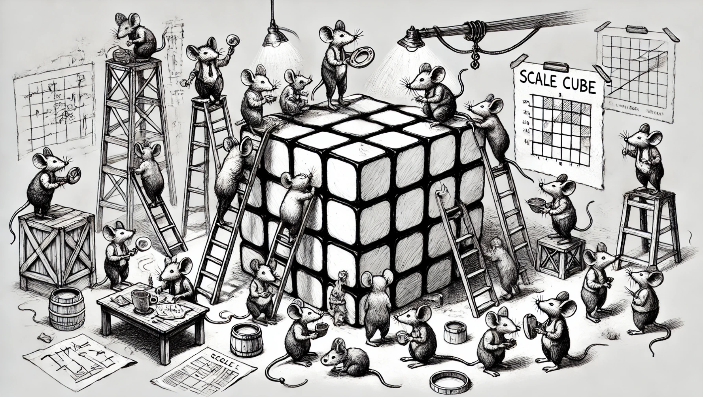
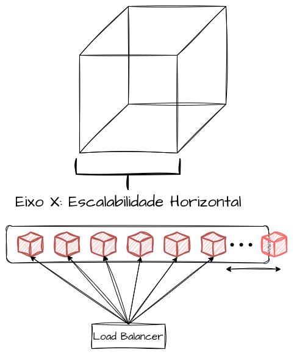
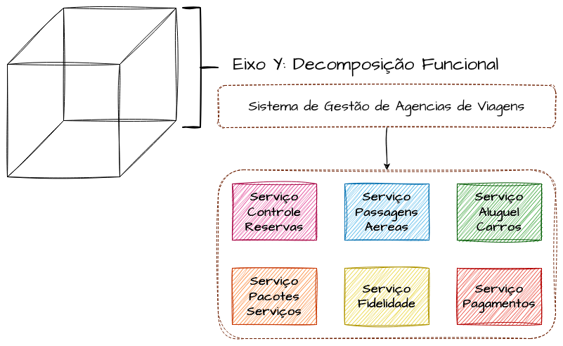
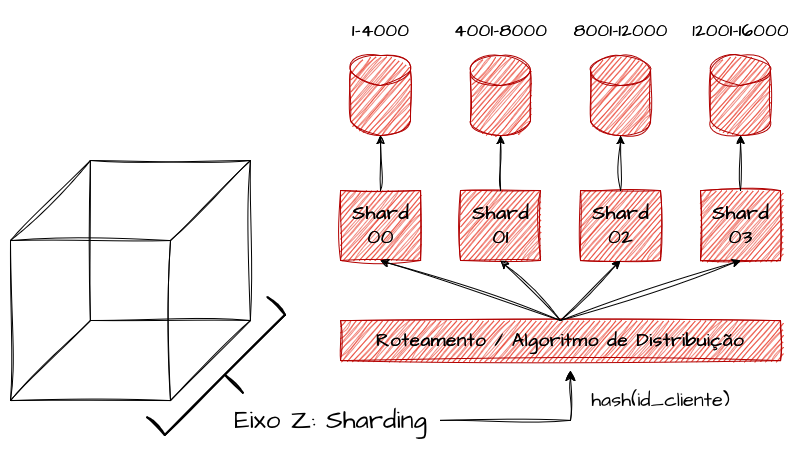

# System Design - Scale Cube

- [System Design - Scale Cube](#system-design---scale-cube)
  - [Eixo X - Escalabilidade Horizontal](#eixo-x---escalabilidade-horizontal)
  - [Eixo Y - Quebra de Funcionalidades](#eixo-y---quebra-de-funcionalidades)
  - [Eixo Z - Sharding de Dados](#eixo-z---sharding-de-dados)
    - [Uso do Scale Cube](#uso-do-scale-cube)
    - [Referências](#referências)

> **Nota:** Este documento é um material de estudo baseado no artigo original **"System Design - Scale Cube"**, de **Matheus Fidelis**, publicado em [fidelissauro.dev/cubo-escalabilidade](https://fidelissauro.dev/cubo-escalabilidade/). As ilustrações pertencem ao autor original. Recomenda-se a leitura do artigo completo na fonte.

---

O **Scale Cube** (Cubo da Escalabilidade) é um modelo conceitual descrito no livro *The Art of Scalability*, de Martin L. Abbott e Michael T. Fisher. A proposta é orientar a modelagem de sistemas pensando em escalabilidade desde o início do projeto. O nome vem da representação em forma de cubo, com três dimensões — os eixos **X, Y e Z** (largura, altura e profundidade) — em que cada eixo traduz um princípio distinto de escalabilidade.

Mais do que uma regra rígida, o cubo funciona como um mapa mental para decidir o que precisa ser considerado ao desenhar ou refatorar uma aplicação que precisa crescer. Os três eixos representam, respectivamente: **X — escalabilidade horizontal**, **Y — decomposição de funcionalidades** e **Z — sharding e particionamento de dados**.

## Eixo X - Escalabilidade Horizontal

O eixo X trata da capacidade de a aplicação crescer horizontalmente conforme a demanda e os níveis de saturação aumentam. Na prática, isso significa conseguir **adicionar e remover réplicas idênticas** do mesmo serviço sob demanda, distribuindo a carga entre elas. Quando o tráfego chega via HTTP, essas réplicas costumam receber requisições por meio de componentes intermediários como balanceadores de carga.

Costuma ser a dimensão mais simples de aplicar, porque escalar horizontalmente é uma característica nativa da maioria das plataformas modernas — nuvens públicas e orquestradores de containers. O ponto de atenção está em projetar aplicações **stateless**: requisições sequenciais podem cair em servidores diferentes, então o estado de entidades e processos precisa ser gerido de forma distribuída, e não preso à memória local de uma instância.

## Eixo Y - Quebra de Funcionalidades

O eixo Y propõe **dividir as funcionalidades** de um sistema, decompondo um sistema maior em microserviços especializados, cada um responsável por um contexto isolado e desacoplado. É essencialmente o processo de quebrar um monolito em serviços menores. A grande vantagem é que cada funcionalidade passa a **escalar e ser otimizada de forma independente**: um serviço CPU-bound e outro I/O-intensivo podem ser dimensionados com recursos diferentes, sem que um afete o outro.

Combinado ao eixo X, o eixo Y é o que dá forma aos microserviços como os conhecemos hoje. Transformar funcionalidades em serviços especializados, capazes de escalar horizontalmente conforme suas próprias características, é o que entrega a experiência concreta de um sistema distribuído.

## Eixo Z - Sharding de Dados

O eixo Z é o **mais complexo** do modelo, tanto em conceito quanto em implementação. Ele propõe **particionar e distribuir os dados** entre vários clusters, servidores e bancos. Essa estratégia de dividir grandes volumes em fatias menores é chamada de **sharding** ou particionamento, em que cada *shard* guarda apenas uma parcela do conjunto total de dados.

A ideia é dividir os dados entre servidores independentes e **rotear cada requisição para a partição correta** com base em uma chave de partição (*sharding key*). Essa chave pode derivar de atributos como iniciais do cliente, intervalos de identificadores sequenciais, faixas de datas ou o hash de algum valor forte. Com isso, ataca-se a camada mais delicada de um sistema distribuído — a **persistência** —, reduzindo o blast-radius em caso de falha e permitindo escalar os dados de forma quase horizontal.

É a abordagem mais trabalhosa do cubo, justamente porque exige camadas adicionais de engenharia, estratégias bem pensadas de distribuição e mecanismos de roteamento inteligentes para que cada chamada encontre o destino correto.

### Uso do Scale Cube

Aplicando as três dimensões de forma combinada, é possível ganhar confiabilidade e escalabilidade em cenários distribuídos complexos, simplificando a decomposição de serviços, a escalabilidade horizontal e a distribuição controlada de dados. Como bônus, esse desenho abre espaço para estratégias de deploy mais elaboradas, como **Blue/Green Deployments** e **Canary Releases**, aumentando a resiliência e a eficiência operacional.

Vale lembrar que o Scale Cube é **altamente conceitual**: funciona como mapa mental, não como um modelo de governança arquitetural. Seu valor está em organizar as preocupações que devem ser levadas em conta ao projetar sistemas críticos, aprimorando o senso crítico de arquitetura e engenharia das equipes envolvidas.

### Referências

[Scale Cube](https://en.wikipedia.org/wiki/Scale_cube)

[The Scale Cube - 3 Dimensions to Scale](https://microservices.io/articles/scalecube.html)

[Achieving Scalability with Scale Cube](https://medium.com/@avicsebooks/achieving-scalability-with-scale-cube-6f67eac96930)

[AKF Scale Cube](https://akfpartners.com/growth-blog/scale-cube)
