# System Design - Sharding e Particionamento de Dados

- [System Design - Sharding e Particionamento de Dados](#system-design---sharding-e-particionamento-de-dados)
- [Definindo Sharding](#definindo-sharding)
	- [Topologia de Sharding](#topologia-de-sharding)
		- [Sharding para Segregação de Dados](#sharding-para-segregação-de-dados)
		- [Sharding para Segregação Computacional](#sharding-para-segregação-computacional)
- [Escalabilidade e Performance](#escalabilidade-e-performance)
- [Sharding Keys e Hot Partitions](#sharding-keys-e-hot-partitions)
	- [Sharding Keys](#sharding-keys)
	- [Hot Partitions](#hot-partitions)
- [Estratégias e Aplicações de Sharding](#estratégias-e-aplicações-de-sharding)
	- [Sharding por ranges de iniciais](#sharding-por-ranges-de-iniciais)
	- [Sharding por Ranges de Identificadores](#sharding-por-ranges-de-identificadores)
	- [Sharding por Ranges de Datas e Tiers de Storage](#sharding-por-ranges-de-datas-e-tiers-de-storage)
	- [Sharding por Hashing](#sharding-por-hashing)
			- [Exemplo de Balanceamento por Hash Functions](#exemplo-de-balanceamento-por-hash-functions)
			- [Output](#output)
		- [Distribuição e os Algoritmos de Hashing](#distribuição-e-os-algoritmos-de-hashing)
			- [Output](#output-1)
	- [Sharding e Distribuição por MurmurHash](#sharding-e-distribuição-por-murmurhash)
			- [Output](#output-2)
	- [Sharding por Hashing Consistente](#sharding-por-hashing-consistente)
	- [Sharding por Hashing e Gestão de Chaves](#sharding-por-hashing-e-gestão-de-chaves)
	- [Segregação Avançada com Suffle Sharding](#segregação-avançada-com-suffle-sharding)
			- [Referencias](#referencias)

> **Nota:** Este documento é um material de estudo baseado no artigo original **"System Design - Sharding e Particionamento de Dados"**, de **Matheus Fidelis**, publicado em [fidelissauro.dev/sharding](https://fidelissauro.dev/sharding/). As ilustrações pertencem ao autor original. Recomenda-se a leitura do artigo completo na fonte.

---

# Definindo Sharding

Sharding (ou particionamento) é uma técnica de sistemas distribuídos que consiste em quebrar grandes conjuntos de dados em pedaços menores chamados de **shards** ou **partições**. Cada shard guarda apenas uma fatia do todo, o que permite tratar volumes massivos de dados com mais eficiência, segurança e disponibilidade. É uma estratégia útil principalmente quando os dados crescem a ponto de não caberem mais, de forma performática, em um único servidor, banco ou carga de trabalho.

O conceito não se restringe a bancos de dados. Apesar de esse ser o uso mais difundido, a mesma ideia de particionar pode ser aplicada à distribuição de cargas em microsserviços, a caches distribuídos e até à segmentação de tráfego de rede.

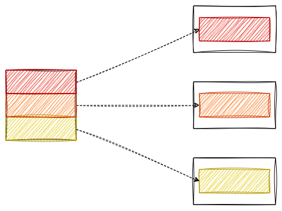

No mundo de bancos de dados, cada shard é um subconjunto da base original que pode viver em servidores ou nós diferentes. Essa divisão distribui o trabalho, elimina gargalos e remove pontos únicos de falha que aparecem quando tudo está centralizado. Também é o que viabiliza a escalabilidade horizontal: à medida que os dados crescem, basta acrescentar novos servidores para hospedar shards adicionais.

Em contrapartida, o sharding adiciona complexidade de manutenção e de balanceamento dos shards, além do desafio de manter a consistência dos dados entre as partições conforme a escala aumenta.

## Topologia de Sharding

Existem diferentes topologias de sharding, cada uma adequada a um tipo de necessidade. Pensando o conceito de forma ampla, encontramos várias abordagens distintas para distribuir carga e ganhar performance e resiliência.

### Sharding para Segregação de Dados

Essa é a forma mais conhecida de sharding. O objetivo é separar conjuntos diferentes de dados em shards distintos — tabelas ou instâncias de banco roteadas por algum critério. É comum em sistemas que precisam isolar tipos de dados por questões de segurança, compliance ou simplesmente para facilitar gestão e desempenho.

Em uma aplicação multi-tenant, por exemplo, os dados de cada cliente principal podem ser segregados em shards próprios. Isso reforça a segurança, impedindo que um cliente acesse os dados de outro, e ainda permite adaptar a infraestrutura de cada shard às necessidades específicas daquele cliente.

Outro caso recorrente é a separação entre dados sensíveis e não sensíveis. Informações confidenciais ou sujeitas a regulamentação podem ficar em shards com mais segurança e auditoria, enquanto dados menos críticos ficam em shards mais leves, reduzindo custo e complexidade.

### Sharding para Segregação Computacional

Aqui o foco deixa de ser apenas o dado e passa a ser a carga computacional. Em vez de distribuir registros, a ideia é isolar operações intensivas em shards dedicados, adicionando camadas extras de otimização.

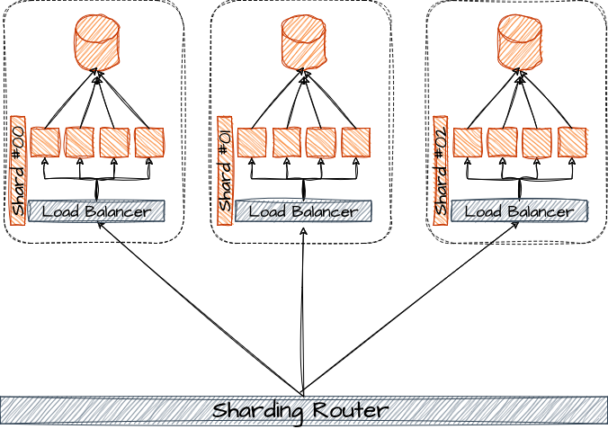

Em sistemas que executam tarefas pesadas — cálculos em tempo real, processamento de grandes volumes, algoritmos de machine learning — segregar esse processamento em shards específicos evita que operações mais leves sejam prejudicadas pelo consumo de recursos das mais pesadas, mantendo um desempenho mais previsível no sistema como um todo.

Essa topologia também ajuda quando diferentes operações exigem hardware distinto: shards voltados a I/O intensivo podem usar discos rápidos e mais banda, enquanto shards de processamento podem ser configurados com mais núcleos de CPU.

# Escalabilidade e Performance

A relevância do sharding em sistemas distribuídos está ligada à necessidade de lidar com grandes volumes de dados e de escalar horizontalmente. O banco de dados é frequentemente o ponto mais crítico de escala, e o sharding atua exatamente nesse gargalo.

Ao dividir os dados em vários shards hospedados em servidores diferentes, é possível adicionar capacidade sem reestruturar toda a base original, expandindo a infraestrutura conforme a demanda cresce. Essa elasticidade horizontal é essencial para sistemas que precisam crescer de forma contínua sem comprometer desempenho ou integridade.

Com os dados fragmentados, as operações de leitura e escrita também se distribuem entre recursos distintos. Isso reduz a carga sobre qualquer servidor individual, melhora os tempos de resposta e evita gargalos, sustentando um desempenho consistente mesmo sob alta carga.

Há ainda o ganho de disponibilidade: se o nó que hospeda um shard falhar, os demais shards continuam ativos, permitindo que o sistema opere com funcionalidade reduzida em vez de cair por completo — uma resiliência crucial em ambientes de produção.

# Sharding Keys e Hot Partitions

Antes de explorar implementações concretas, é importante entender dois conceitos complementares e centrais na teoria de particionamento: as **sharding keys** e o fenômeno das **hot partitions**.

## Sharding Keys

A primeira pergunta ao planejar um particionamento é: "particionar com base em quê?". Definir a dimensão de corte é a decisão mais importante, anterior a qualquer escolha de tecnologia. Esse critério de corte é o que chamamos de **sharding key**.

A sharding key (ou chave de partição) é o atributo que determina como e em qual partição cada dado será armazenado. Uma boa escolha precisa garantir distribuição equilibrada, o que normalmente exige alta cardinalidade — ou seja, um grande número de valores únicos. Idealmente, a chave também deve coincidir com campos frequentemente usados nas consultas, como datas, identificadores ou categorias.

Exemplos comuns de sharding keys incluem iniciais de um identificador de cliente, o ID de uma entidade, o hash de algum valor ou categorias específicas. Em sistemas financeiros, é comum separar Pessoas Físicas de Pessoas Jurídicas; bancos podem particionar por faixas de agências; sistemas de vendas e logística costumam dividir por intervalos de datas; e sistemas multi-tenant frequentemente usam o hash do identificador do tenant.

A estratégia certa depende do contexto e das características do sistema. Nos próximos tópicos algumas dessas abordagens são detalhadas.

## Hot Partitions

**Hot partitions** são problemas decorrentes da má distribuição de dados e carga entre as partições. O fenômeno acontece quando uma ou poucas partições recebem uma carga desproporcionalmente alta em relação às demais, degradando o desempenho.

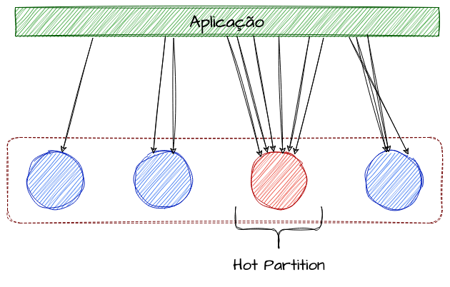

Imagine um sistema multi-tenant com 300 clientes distribuídos em 10 partições. No cenário ideal, cada partição teria cerca de 30 clientes, ou ~10% do uso. Mas suponha que três desses clientes concentrem 50% de todo o uso e, por azar do cálculo de hash, caiam na mesma partição. Essa única partição passaria a representar mais da metade da carga, enquanto as outras nove ficariam ociosas — exatamente o quadro de uma hot partition.

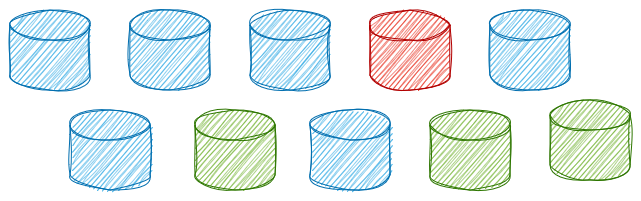

Como a distribuição é definida por operações matemáticas sobre a chave de partição — e não pelo tamanho ou padrão de uso real dos dados — esse desbalanceamento pode surgir naturalmente. Partições sobrecarregadas geram lentidão e, em casos extremos, falhas, ao passo que as subutilizadas desperdiçam recursos.

Para mitigar, há técnicas como o uso de chaves de particionamento mais aleatórias, o pré-particionamento baseado em padrões de uso já conhecidos, o isolamento de sharding keys específicas em partições dedicadas e o uso de caching inteligente para aliviar as partições mais acessadas.

# Estratégias e Aplicações de Sharding

Esta seção apresenta algumas das muitas possibilidades de aplicação de sharding em sistemas distribuídos, explorando como realizar o particionamento com diferentes modelos de sharding keys.

## Sharding por ranges de iniciais

Uma estratégia simples — não muito eficaz, mas didática — é distribuir usuários, clientes ou tenants pelas iniciais de um identificador. Definimos intervalos de letras por shard, por exemplo A–E em um shard, F–J em outro, e assim por diante até W–Z.

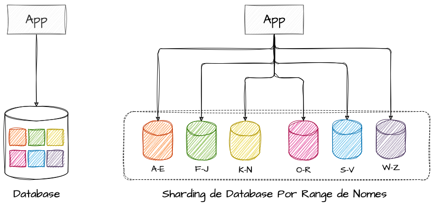

Apesar de fácil de entender, esse modelo escancara justamente o problema que o sharding tenta evitar: as hot partitions. Quando o uso é desproporcional entre os intervalos, surge o desbalanceamento de carga.

No exemplo das iniciais de nomes, é razoável supor que existam muito mais Anas, Brunos e Carlos do que Wesleys, Yasmins e Ziraldos. Assim, a partição de A–E ficaria sobrecarregada (uma hot partition), enquanto a de W–Z permaneceria quase ociosa, gerando um desequilíbrio expressivo de performance.

O caso reforça a importância de escolher uma sharding key que promova distribuição equilibrada para evitar gargalos.

## Sharding por Ranges de Identificadores

Outra abordagem comum divide os dados por intervalos contínuos de valores da sharding key. Por ser sequencial, exige maior governança, pois pode gerar o efeito de "transbordo": alguns shards ficam cheios enquanto outros permanecem vazios ou subutilizados.

A ideia é que cada shard contenha uma faixa específica de valores, e as consultas sejam direcionadas ao shard correspondente. Funciona bem quando os dados têm uma ordem natural e as consultas costumam envolver intervalos.

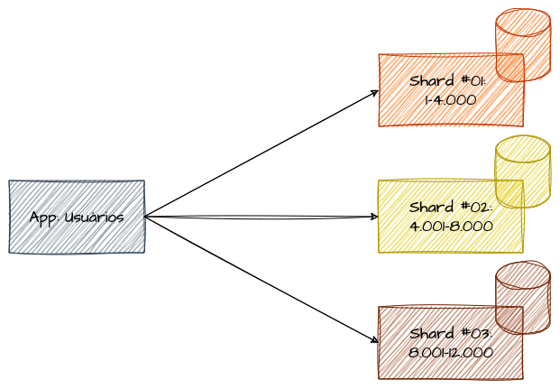

Pense em uma base de 10.000 usuários criados sequencialmente, dividida em 3 shards por faixas de identificadores, com espaço reservado para novos cadastros. Levando o aspecto sequencial ao pé da letra, é possível terminar com dois shards cheios e um quase vazio, guardando capacidade para o crescimento.

O risco é o desbalanceamento de carga: se os valores não se distribuírem de forma uniforme, alguns shards atingem o limite enquanto outros ficam ociosos. Por isso, ao usar ranges de identificadores, é obrigatório monitorar e reajustar a distribuição à medida que o sistema cresce.

## Sharding por Ranges de Datas e Tiers de Storage

Atributos sequenciais também viabilizam o sharding por intervalos de tempo. Em um sistema de vendas hipotético, poderíamos particionar por intervalos de datas — por exemplo, uma base por ano, agrupando todas as transações daquele período.

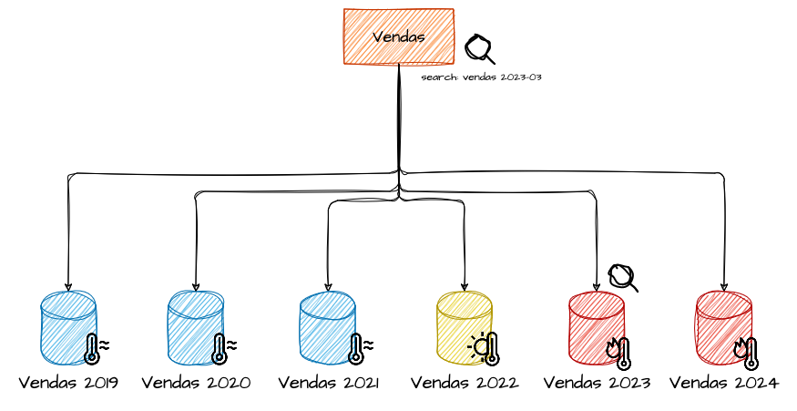

Nesse modelo cabe uma estratégia adicional muito comum: usar diferentes **tiers** de armazenamento. A ideia é organizar os dados em camadas com diferentes níveis de custo e desempenho. Os anos corrente e anterior poderiam ficar em um tier **hot**, com armazenamento caro e rápido; anos ainda acessados com frequência moderada iriam para um tier **warm** intermediário; e dados muito antigos, raramente consultados, ficariam em um tier **cold**, mais barato e lento.

Combinar particionamento por datas com tiers de storage oferece distribuição eficiente e, ao mesmo tempo, otimização de custo e desempenho, ajustando os recursos à frequência de acesso e à importância dos dados ao longo do tempo.

## Sharding por Hashing

No sharding por hashing, aplica-se uma função de hash sobre a sharding key para decidir onde o dado é armazenado ou para onde o cliente é roteado. A função converte o valor da chave em um hash, que é então mapeado para um dos shards disponíveis por meio de uma operação de módulo (`mod`), que retorna o resto de uma divisão.

Por exemplo, se o hash for 15 e houver 3 shards, `15 % 3` resulta em 0, indicando o shard 0. Se o hash for 10, `10 % 3` resulta em 1, levando o registro ao shard 1.

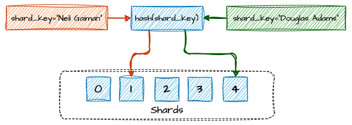

#### Exemplo de Balanceamento por Hash Functions

Considere um sistema multi-tenant em que o identificador do tenant foi escolhido como sharding key. Para decidir o shard de cada cliente, aplica-se o algoritmo SHA-256 sobre o identificador, converte-se o hash em um número inteiro e calcula-se o módulo pelo número de shards; o resto indica o shard de destino.

Essa abordagem ajuda a evitar hot partitions, já que a função de hash tende a distribuir os dados de forma uniforme. A operação de módulo, por sua vez, é simples e barata, o que torna o método eficiente mesmo em larga escala.

O artigo apresenta uma implementação em Go com as funções `hashTenant` (que calcula o SHA-256 do identificador, em minúsculas, e o converte para inteiro) e `getShardByTenant` (que aplica o módulo por 3 shards), executadas sobre uma lista de tenants fictícios como padarias, açougues e pet shops.

#### Output

A saída do programa imprime cada tenant ao lado do shard correspondente, distribuindo as dez entradas de exemplo entre os shards 0, 1 e 2 de forma razoavelmente equilibrada.

O esquema é simples, intuitivo e funciona bem — até que o número de servidores mude. Se um servidor falha ou um novo é adicionado, as chaves precisam ser redistribuídas, porque o resultado da operação de módulo muda. Em outras palavras, sempre que a quantidade de servidores varia, perdem-se as referências de distribuição dos dados.

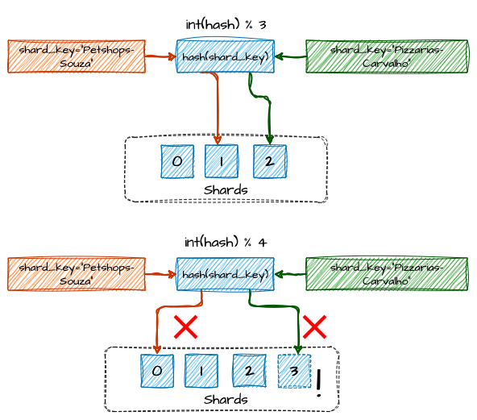

> Exemplo de perda de referências entre shards devido à mudança no resultado do módulo

Em recursos **stateless**, como servidores de aplicação, essa redistribuição é trivial. Em recursos com estado facilmente reconstruível, como caches, o impacto também é pequeno. Mas em particionamentos com dados persistentes a mudança de servidores se torna um problema sério, podendo perder o roteamento para o armazenamento original e gerar inconsistências imediatas.

Nesse cenário, é preciso um trabalho árduo de redistribuição logo após qualquer mudança de escala horizontal. Para mitigar isso quando os nós variam com frequência, costuma-se adotar o **Hashing Consistente**.

### Distribuição e os Algoritmos de Hashing

A escolha do algoritmo de hashing é um ponto de tuning fino que pode mudar completamente o resultado da distribuição. Depois de escolher bem a sharding key, é recomendável testar comparativamente vários algoritmos sobre uma amostra de chaves para identificar qual garante a melhor distribuição.

Dependendo do algoritmo, os dados ficam mais ou menos uniformes entre os shards, impactando diretamente performance e resiliência.

O artigo apresenta um código em Go que implementa cinco funções de hash — **SHA-256**, **SHA-512**, **MD5**, **FNV-1a** e uma **função de hash simples** (que apenas soma os códigos dos caracteres). Cada função transforma o identificador do tenant em um valor usado para calcular o shard via módulo por 5 shards.

#### Output

A saída exibe, para cada algoritmo, quantos tenants caíram em cada um dos cinco shards. Os números variam bastante de um algoritmo para outro: alguns produzem uma distribuição mais equilibrada, enquanto outros concentram mais entradas em determinados shards.

Vale ressaltar que esse resultado só tem valor para o conjunto específico de sharding keys do exemplo. Com outro tipo de valor, os resultados podem ser completamente diferentes — o experimento serve apenas para ilustrar como a escolha do algoritmo afeta a distribuição.

## Sharding e Distribuição por MurmurHash

O **MurmurHash** (ou simplesmente Murmur) é uma função de hash rápida, eficiente e **não criptográfica**, muito usada para gerar identificadores a partir de strings e outros dados. Ele transforma os dados em números inteiros, lidando nativamente com ranges e intervalos de valores, o que o torna especialmente útil para distribuição de dados e hashing consistente.

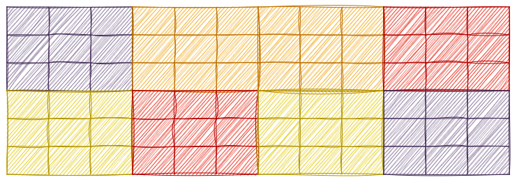

O MurmurHash se destaca em evitar hot partitions, pois espalha os valores de hash de forma próxima ao uniforme.

Ao aplicar o MurmurHash a uma string usada como sharding key, o algoritmo gera diretamente um valor numérico — um inteiro de 32 ou 64 bits, conforme a versão — sem necessidade de conversões adicionais. Sua simplicidade e baixo custo computacional o tornam ideal para sistemas que precisam processar grandes volumes rapidamente.

O artigo mostra uma implementação em Go que usa a biblioteca `murmur3` para calcular o hash de cada tenant e determinar o shard via módulo por 5 shards.

#### Output

A saída apresenta a distribuição final dos tenants entre os cinco shards, com contagens bastante próximas entre si — evidenciando a tendência de distribuição uniforme do MurmurHash.

## Sharding por Hashing Consistente

O **Hashing Consistente** é uma técnica de sharding muito útil em sistemas distribuídos nos quais adicionar ou remover servidores é tarefa rotineira. Diferente do hashing simples — onde uma mudança de shard pode exigir a redistribuição de quase todos os dados —, o hashing consistente minimiza a quantidade de dados realocados. Vale notar que a redistribuição ainda ocorre, porém em escala muito menor.

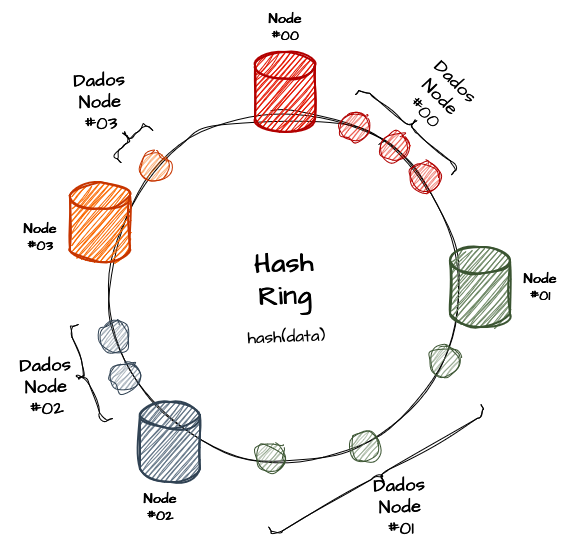

Visualmente, o hashing consistente é representado de forma cíclica: a estrutura central é um anel, o **hash ring**. A alocação de uma chave em um nó se dá por um intervalo de valores dentro do anel, e não pelo valor exato do hash. Assim, ao alterar a quantidade de nós, os resultados mudam muito pouco, reduzindo a necessidade de redistribuição.

Se usássemos hashing tradicional, cada adição ou remoção de servidor exigiria mover muitos dados — algo caro e demorado.

Voltando ao sistema multi-tenant: imagine um círculo que representa todos os possíveis valores de hash. Tanto os nós de servidor quanto os tenants são mapeados para pontos nesse círculo usando a mesma função. Os dados de um tenant ficam no servidor que aparece primeiro no sentido horário a partir do ponto onde o tenant foi mapeado; se o valor ultrapassa o limite, ele "dá uma volta" e retorna ao marco 0 do anel.

Ao adicionar um novo nó, apenas os dados entre ele e o próximo nó no sentido horário precisam ser redistribuídos; o restante permanece intacto. Na remoção de um nó, seus dados passam para o próximo nó no sentido horário, minimizando o movimento e preservando a integridade.

O artigo apresenta uma implementação em Go de um `ConsistentHashRing`, com nós representados por uma struct `Node`, suporte a réplicas virtuais por nó, e métodos para adicionar (`AddNode`), remover (`RemoveNode`) e localizar o nó de um tenant (`GetTenantNode`) por busca binária no anel ordenado.

A execução do exemplo distribui os tenants pelos nós, depois remove o `Shard-02` e em seguida adiciona o `Shard-04`. A saída mostra que apenas alguns tenants mudam de shard a cada alteração (marcados como "Nova movimentação"), enquanto a maioria permanece onde estava — exatamente o comportamento que torna o hashing consistente atraente.

Essa abordagem aceita diversos algoritmos de hashing. O ideal é testar o balanceamento, como demonstrado antes, para encontrar qual estratégia rende a melhor distribuição para a sua amostra de sharding keys.

## Sharding por Hashing e Gestão de Chaves

Uma alternativa é tratar a distribuição e a identificação da partição de forma **cadastral**, o que exige implementações adicionais na arquitetura. A vantagem do hashing é que o cálculo costuma ser muito barato; o problema aparece nas redistribuições, que podem se tornar extremamente custosas.

Podemos imaginar uma arquitetura em que o cálculo de hash ocorre apenas no momento da criação de uma nova sharding key, e as consultas seguintes passam por uma API específica que expõe essas chaves de distribuição por algum protocolo. Nesse desenho, é necessário um componente de balanceamento e roteamento inteligente para encaminhar cada requisição ao seu shard correto.

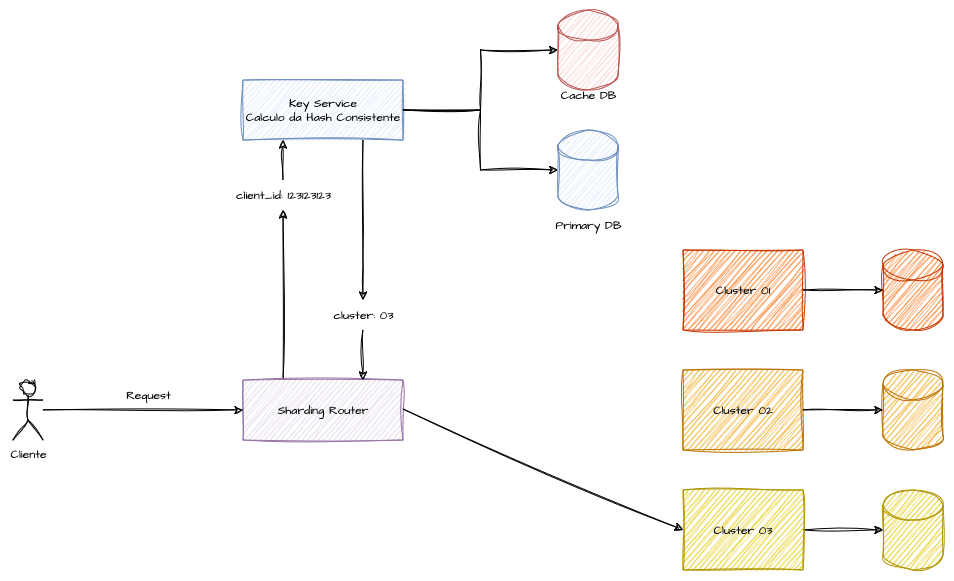

Apesar do maior esforço de engenharia, essa estratégia oferece um gerenciamento mais manual e controlado da distribuição de clientes entre as partições. Ela permite isolar clientes que geram hot partitions, alocando-os em shards segregados e infraestruturas dedicadas, de modo que usuários muito intensivos não afetem o desempenho geral.

Por exigir essa abordagem mais manual, ela também abre espaço para combinar outras técnicas de design, como caching, balanceamento de carga e replicação.

## Segregação Avançada com Suffle Sharding

O **Shuffle Sharding** é uma técnica avançada que combina o sharding tradicional com replicação distribuída. A ideia é criar subconjuntos embaralhados de shards para cada cliente, operação ou partição, reduzindo drasticamente o **blast radius** de uma falha. Salvando os dados de um cliente em mais de um shard, isola-se falhas, picos de carga e comportamentos maliciosos a um grupo mínimo de recursos, evitando que um único cliente derrube toda a infraestrutura ou todos os clientes de um shard.

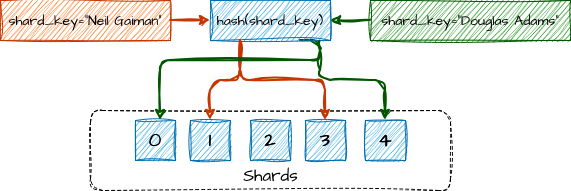

O modelo funciona como uma técnica híbrida de replicação e sharding. Cada operação é roteada para um **Shard Primário** (a golden source dos dados do cliente) e também escrita em um ou mais **Shards Secundários** escolhidos pelo algoritmo de embaralhamento, que define o "shuffle-shard virtual" do cliente. Quanto à consistência, há dois modos: **Consistência Forte**, em que o dado só é confirmado após escrita bem-sucedida em N shards do conjunto, garantindo durabilidade imediata; e **Consistência Eventual**, em que as réplicas nos shards secundários são atualizadas de forma assíncrona, priorizando baixa latência e alto throughput.

A estratégia equilibra resiliência, isolamento lógico e escalabilidade. Como cada cliente escreve em múltiplos shards embaralhados, qualquer falha fica restrita aos shards que aquele cliente usa, e não ao cluster inteiro. Quando um shard falha, seus fallbacks assumem como primário, redirecionando os clientes daquela partição para um shard de fallback com seus dados completos, ou muito próximos disso. No conjunto, o sistema tolera mais falhas parciais, pois a redundância entre primários e secundários sustenta leitura e escrita mesmo durante incidentes.

  
#### Referencias

[Sharding pattern](https://learn.microsoft.com/en-us/azure/architecture/patterns/sharding)

[Database Sharding](https://www.geeksforgeeks.org/database-sharding-a-system-design-concept/)

[Database Sharding for System Design Interview](https://dev.to/somadevtoo/database-sharding-for-system-design-interview-1k6b)

[Database Sharding Pattern for Scaling Microservices Database Architecture](https://medium.com/design-microservices-architecture-with-patterns/database-sharding-pattern-for-scaling-microservices-database-architecture-2077a556078)

[Hot Partitions in Databases](https://www.linkedin.com/pulse/hot-partitions-database-yeshwanth-n)

[Everything You Need to Know About Consistent Hashing](https://app.daily.dev/posts/everything-you-need-to-know-about-consistent-hashing-zcla3svww)

[System Design Case Study - How Discord solved the Hot partition problem ?](https://engineeringatscale.substack.com/p/how-discord-solved-hot-partition-problem)

[System Design - Hashing Example](https://github.com/msfidelis/system-design-examples/blob/main/sharding/hashing/main.go)

[System Design - Hashing Murmur3](https://github.com/msfidelis/system-design-examples/blob/main/sharding/murmur/main.go)

[System Design - Distribuição de Hashing](https://github.com/msfidelis/system-design-examples/blob/main/sharding/hashing-distrib/main.go)

[System Design - Hashing Consistente](https://github.com/msfidelis/system-design-examples/blob/main/sharding/consistent-hashing-remove/main.go)

[Sharding: Architecture Pattern](https://www.linkedin.com/pulse/sharding-architecture-pattern-pratik-pandey/)

[Consistent hashing](https://en.wikipedia.org/wiki/Consistent_hashing)

[A Guide to Consistent Hashing](https://www.toptal.com/big-data/consistent-hashing)

[What Is Consistent Hashing?](https://www.baeldung.com/cs/consistent-hashing)

[Shuffle Sharding: Massive and Magical Fault Isolation](https://aws.amazon.com/pt/blogs/architecture/shuffle-sharding-massive-and-magical-fault-isolation/)

[System Design — Consistent Hashing](https://medium.com/must-know-computer-science/system-design-consistent-hashing-f66fa9b75f3f)

[A Crash Course in Database Sharding](https://blog.bytebytego.com/p/a-crash-course-in-database-sharding)

[MurmurHash](https://en.wikipedia.org/wiki/MurmurHash)

[Murmur3 Hashing for Memcached Client](https://medium.com/@eranda/murmur3-hashing-for-memcached-client-99760fbe9fff)

[How does MurmurHash work?](https://www.synnada.ai/glossary/murmurhash)

[AWS - Partições e Distribuições de Dados](https://docs.aws.amazon.com/pt_br/amazondynamodb/latest/developerguide/HowItWorks.Partitions.html)

[Sharding Distributed Databases: A Critical Review](https://www.researchgate.net/profile/Siamak-Solat/publication/379753203_Sharding_Distributed_Databases_A_Critical_Review/links/664bb71822a7f16b4f3e14f3/Sharding-Distributed-Databases-A-Critical-Review.pdf)

[Shuffle Sharding: Massive and Magical Fault Isolation](https://aws.amazon.com/blogs/architecture/shuffle-sharding-massive-and-magical-fault-isolation/)

[The Magic of Shuffle Sharding](https://hamzahabdulla1.medium.com/uno-ddos-tres-the-magic-of-shuffle-sharding-13d6c9d3a974)

[Cortex - Shuffle Sharding](https://cortexmetrics.io/docs/guides/shuffle-sharding/)
