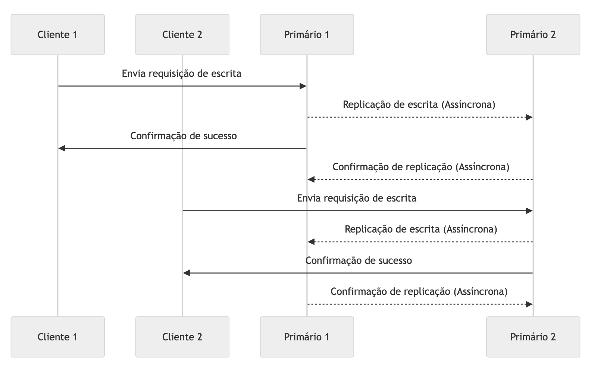
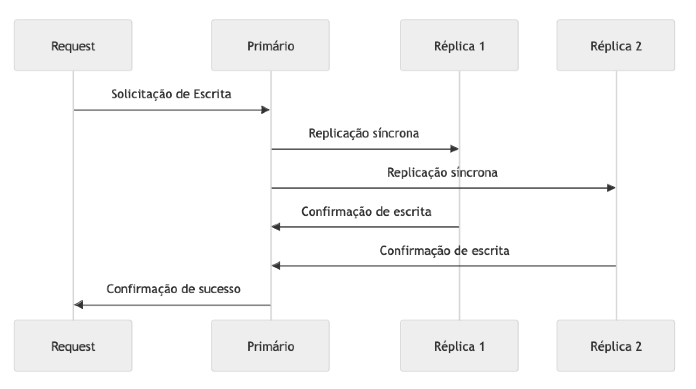
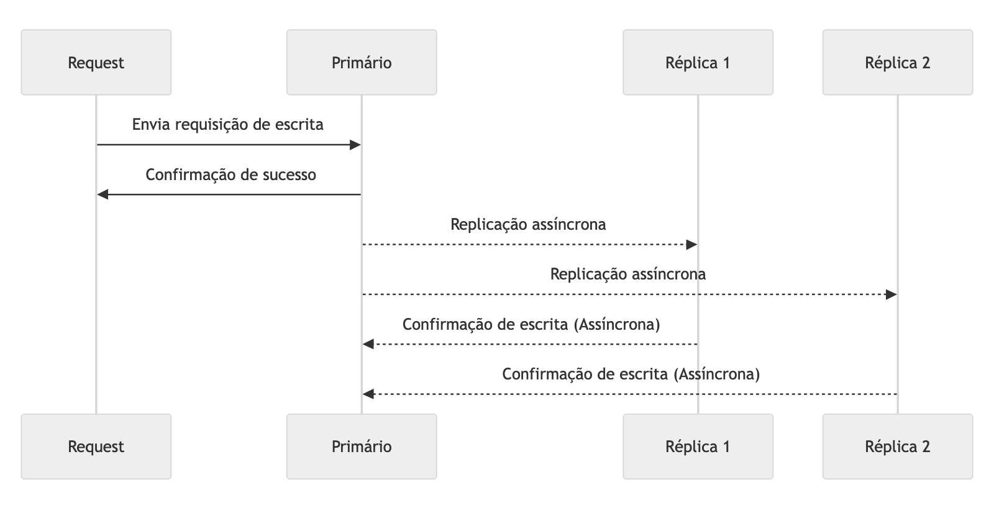
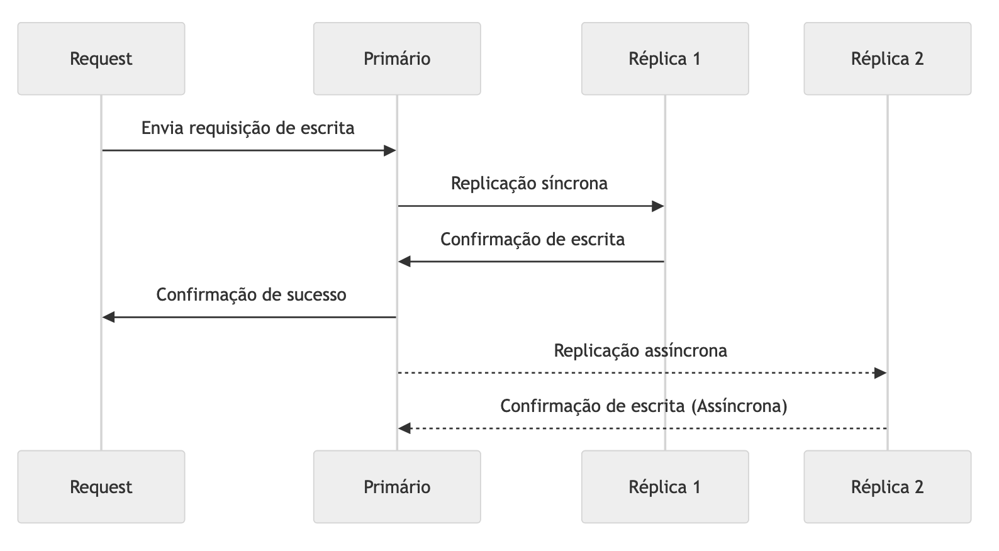
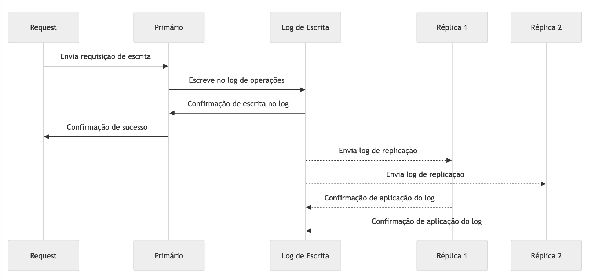
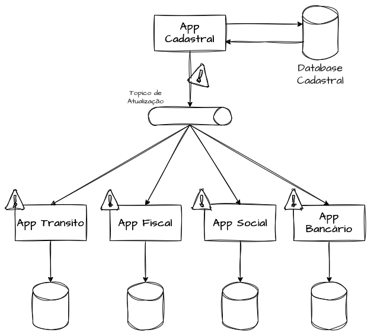
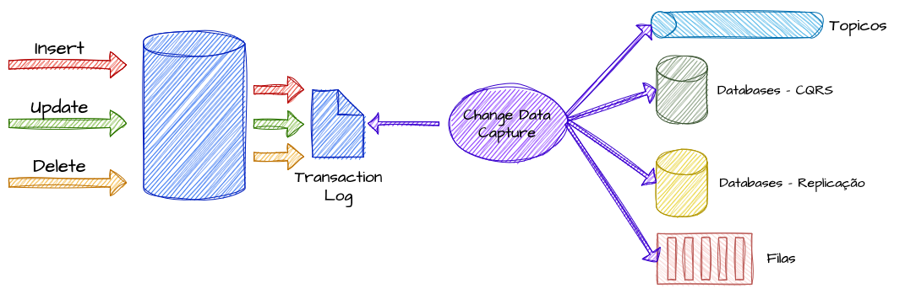
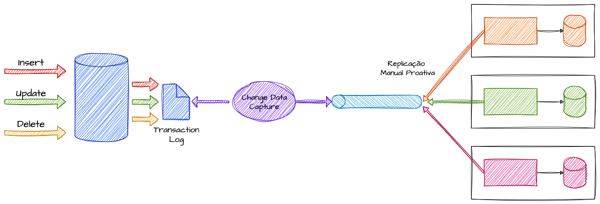

# System Design - Replicação de Dados

- [System Design - Replicação de Dados](#system-design---replicação-de-dados)
- [Definindo Replicação na Engenharia de Software](#definindo-replicação-na-engenharia-de-software)
- [Modelos de Replicação](#modelos-de-replicação)
  - [Replicação Primary-Replica](#replicação-primary-replica)
  - [Replicação Primary-Primary - Multi-Master](#replicação-primary-primary---multi-master)
- [Estratégias de Replicação](#estratégias-de-replicação)
  - [Replicação Total e Parcial](#replicação-total-e-parcial)
  - [Replicação Síncrona](#replicação-síncrona)
  - [Replicação Assíncrona](#replicação-assíncrona)
  - [Replicação Semi-Síncrona](#replicação-semi-síncrona)
  - [Replicação por Logs](#replicação-por-logs)
- [Arquitetura](#arquitetura)
  - [Event-Carried State Transfer - Replicação de Estados e Objetos de Domínios](#event-carried-state-transfer---replicação-de-estados-e-objetos-de-domínios)
  - [Replicação por Change Data Capture - Captura de Alterações em Dados](#replicação-por-change-data-capture---captura-de-alterações-em-dados)
  - [CRDT’s - Conflict Free Replicated Data Types](#crdts---conflict-free-replicated-data-types)
- [Referências](#referências)

> **Nota:** Este documento é um material de estudo baseado no artigo original
> **"System Design - Replicação de Dados"**, de **Matheus Fidelis**, publicado em
> [fidelissauro.dev/replicacao](https://fidelissauro.dev/replicacao/).
> As ilustrações pertencem ao autor original. Recomenda-se a leitura do
> artigo completo na fonte.

---

# Definindo Replicação na Engenharia de Software

Replicar dados significa, na prática, manter **mais de uma cópia da mesma informação em lugares diferentes**. A analogia das chaves de casa ajuda: depender de uma única cópia que anda o dia todo com você é arriscado — basta perdê-la para ficar sem acesso. Distribuir cópias reserva entre pessoas de confiança ou em esconderijos estratégicos é justamente a mentalidade que aplicamos a sistemas: evitar que a perda de um único ponto deixe tudo indisponível.

Na engenharia de software, essas cópias podem viver em nós distintos, datacenters separados geograficamente ou até em regiões diferentes de nuvens públicas. O propósito é assegurar que os dados continuem acessíveis mesmo diante de falhas de hardware ou problemas de rede, sustentando requisitos de **consistência, disponibilidade e tolerância a falhas**.

Em essência, a replicação garante que a mesma informação esteja presente em vários locais, permitindo que o sistema siga operando ainda que uma de suas partes deixe de responder. A consistência plena pode levar algum tempo para ser restabelecida, conforme o esforço necessário para promover uma réplica a fonte principal.

# Modelos de Replicação

Antes de discutir estratégias concretas, vale compreender os modelos sobre os quais a replicação se apoia. Independentemente de como as cópias são mantidas, a organização dos nós tende a seguir um de dois arranjos: **Primary-Replica** ou **Primary-Primary** (também chamado de **Multi-Master**). Entender conceitualmente os dois cria a base para depois falarmos de implementações práticas.

## Replicação Primary-Replica

Nesse modelo, um **nó primário concentra todas as operações de escrita** e propaga as mudanças para um ou mais nós secundários, as réplicas. Estas costumam servir apenas leituras, o que permite distribuir a carga de consultas entre vários nós enquanto a escrita permanece simples e centralizada. É um arranjo bastante adequado a cargas de leitura intensiva.

O lado negativo é que o nó primário se torna um **ponto único de falha**. Se ele cair, uma das réplicas precisa ser promovida a novo primário, e esse processo — cujo tempo varia conforme a tecnologia, muitas vezes exigindo intervenção manual — pode gerar indisponibilidade e erros temporários. O modelo combina especialmente bem com cenários que adotam CQRS para criar modelos de leitura otimizados.

## Replicação Primary-Primary - Multi-Master

Aqui **múltiplos nós atuam simultaneamente como primários**, aceitando tanto leituras quanto escritas. Qualquer nó pode processar atualizações, que são então replicadas para os demais, favorecendo alta disponibilidade e escalabilidade também na escrita.

A vantagem é eliminar o ponto único de falha do Primary-Replica e ganhar flexibilidade na distribuição da carga. Em troca, surge uma complexidade adicional significativa: **resolver conflitos de escrita**. Quando dois nós recebem escritas concorrentes sobre o mesmo dado, o sistema precisa de uma estratégia de desempate — por exemplo, ordenar operações por timestamp ou aplicar políticas específicas de resolução, sobretudo em situações de particionamento temporário causado por falhas de rede.

# Estratégias de Replicação

A replicação aparece combinada com várias outras técnicas de engenharia, não só voltada a dados — que são o foco mais comum pela sua importância e complexidade — como também a cenários menos óbvios, como replicar cargas de trabalho inteiras ou domínios mantidos em cache. Esta seção apresenta as estratégias mais usadas, destacando diferenças, vantagens e desvantagens para esclarecer quando cada uma faz sentido e apoiar decisões de arquitetura.

## Replicação Total e Parcial

Na **Replicação Total**, todos os dados são copiados para todos os nós, de modo que cada nó tem uma cópia completa. Isso eleva muito a disponibilidade — qualquer nó pode atender qualquer requisição — mas aumenta o custo de armazenamento e a latência de escrita, já que cada gravação precisa ser confirmada em todos os nós do cluster. Academicamente esse modelo também é chamado de **Full-Table Replication**.

Já na **Replicação Parcial**, cada nó guarda apenas uma fração dos dados. O resultado é maior eficiência de armazenamento e menor latência de escrita, ao custo de leituras mais complexas: o dado procurado pode não estar local, exigindo comunicação entre nós ou uma camada de consulta que abstraia essa dispersão. Para localizar os dados, costuma-se recorrer a algoritmos de Sharding, como o **Hashing Consistente**.

## Replicação Síncrona

Na replicação síncrona, uma escrita só é considerada concluída **depois que todos os nós confirmaram tê-la aplicado**. Isso entrega **consistência forte**: qualquer nó consultado, a qualquer momento, devolve o mesmo valor, pois nenhuma leitura enxerga o dado antes da confirmação geral.

Na prática, o cliente envia o dado ao endpoint primário do cluster, que o distribui para todos os nós; a operação só retorna sucesso quando todos respondem "ok". Uma técnica clássica para implementar esse comportamento é o **two-phase commit**. O ganho é evidente em domínios onde divergência é inaceitável, como pagamentos e sistemas financeiros. O custo é a **latência mais alta**, agravada quando os nós são numerosos ou estão geograficamente distantes.

## Replicação Assíncrona

Aqui a escrita é enviada a um nó e propagada aos demais **de forma eventual**, permitindo que a operação seja confirmada ao cliente antes de todas as réplicas estarem atualizadas. O efeito é um **desempenho de escrita muito melhor**, pois não há espera por confirmações coletivas.

O preço é a **consistência eventual**: consultas feitas logo após a escrita podem retornar versões diferentes do dado até que a replicação se complete. Por isso, o modelo é amplamente adotado quando disponibilidade e desempenho importam mais que consistência imediata — redes sociais, assets em CDN, clusters de cache e dados menos críticos usados para aliviar a origem.

## Replicação Semi-Síncrona

Esse modelo é um meio-termo entre síncrono e assíncrono: exige que **ao menos uma réplica (ou um pequeno subconjunto) confirme a gravação** antes de a operação ser dada como bem-sucedida, deixando os demais nós serem atualizados de forma assíncrona depois.

O resultado é um **equilíbrio entre consistência e desempenho**, com uma camada extra de resiliência: garante-se durabilidade síncrona em pelo menos um nó sem pagar a latência de confirmar todos. Bancos como MySQL e MariaDB seguem essa lógica, confirmando a escrita assim que um secundário a grava, enquanto outros nós recebem as atualizações mais tarde.

## Replicação por Logs

Nessa abordagem, **todas as operações são registradas sequencialmente em um log**, e esse log é replicado para os demais nós, que reexecutam as mesmas operações localmente. Em vez de copiar o estado completo dos dados, replicam-se apenas as mudanças, mantendo as réplicas consistentes a partir do replay dessas alterações.

É vantajoso quando há mais escritas que leituras ou quando o volume é muito grande, pois só as modificações trafegam entre os nós, reduzindo o tráfego. Tecnologias maduras como o **Apache Kafka** usam replicação por logs: cada partição de um tópico tem suas mudanças registradas em logs de transações replicados entre brokers, garantindo durabilidade e resiliência.

A mesma ideia sustenta algoritmos fundamentais de sistemas distribuídos — **Paxos** (BigTable, Apache Mesos), **Raft** (etcd, ScyllaDB, Consul, CockroachDB) e **Viewstamped Replication** (TigerBeetle) — além de técnicas como o **write-ahead log**, que assegura durabilidade durante a replicação mesmo diante de falhas de nós.

# Arquitetura

Embora seja muito associada a recursos prontos de caches e bancos de dados, a replicação pode ser aplicada **manualmente e de forma muito mais ampla** para resolver desafios arquiteturais. Usada de modo estratégico, ela permite escalar sistemas distribuídos com inteligência. A seguir, alguns padrões arquiteturais que combinam replicação com outras técnicas para ganhar desempenho e escalabilidade em larga escala.

## Event-Carried State Transfer - Replicação de Estados e Objetos de Domínios

Em sistemas corporativos grandes e complexos, o **Event-Carried State Transfer** é uma forma eficaz de lidar com alta disponibilidade de grandes volumes de dados. O padrão transmite o **estado de um objeto entre serviços ou domínios por meio de eventos**, combinando cache, arquitetura orientada a eventos e replicação — uma estratégia custosa, porém poderosa, que reduz acoplamento.

A ideia central: sempre que uma entidade de um domínio é atualizada, a mudança é publicada em um tópico de eventos. Os serviços dependentes consomem esses eventos e atualizam suas **próprias bases locais**, mantendo uma cópia em cache do estado. Em vez de consultar uma fonte central a cada requisição, cada serviço trabalha com sua versão dos dados, especialmente útil onde a consistência eventual é tolerável.

Um bom exemplo é um sistema governamental que compartilha dados de cidadãos entre órgãos bancários, fiscais, de segurança, trânsito e social. Ao atualizar estado civil, renda, endereço ou telefone num cadastro central, um evento notificaria cada sistema, que então atualizaria sua própria base.

## Replicação por Change Data Capture - Captura de Alterações em Dados

O **Change Data Capture (CDC)** detecta e captura as alterações feitas em uma fonte de dados — relacional ou não — e as transmite para outros sistemas em tempo real. Assim, serviços externos se mantêm atualizados **sem precisar consultar diretamente o banco de origem**, o que é valioso para sincronizar dados, alimentar filas de mensagens e manter caches atualizados.

O mecanismo monitora inserções, atualizações e deleções, capturando-as conforme ocorrem. As mudanças capturadas podem então ser enviadas a tópicos de eventos ou diretamente aos sistemas dependentes, evitando sobrecarregar o banco principal com consultas constantes.

O CDC serve de base para outras estratégias, como o próprio Event-Carried State Transfer, que aproveita esses eventos para replicar dados de forma proativa. Também habilita streaming para datalakes, cacheamento proativo e CQRS, atuando como uma ponte reativa entre a fonte e os demais padrões de integração.

## CRDT’s - Conflict Free Replicated Data Types

Em replicações distribuídas, sobretudo nos arranjos **primary-primary / multi-master**, os **CRDTs** *(Conflict-Free Replicated Data Types)* resolvem o maior desafio do modelo: **lidar com conflitos entre atualizações concorrentes de um mesmo dado**. Quando nós diferentes recebem versões distintas do mesmo registro, é preciso decidir qual é a versão final — e os CRDTs fazem isso automaticamente, sem coordenação ou bloqueio entre nós.

Pense em um editor colaborativo de documentos: se duas pessoas, em nós diferentes, alteram a mesma linha ao mesmo tempo, um sistema baseado em CRDTs mescla as mudanças automaticamente, produzindo uma versão final sem intervenção manual nem conflito.

A garantia vem de propriedades matemáticas que tornam as operações **associativas, comutativas e idempotentes**: a ordem em que as atualizações chegam não altera o resultado final. Mesmo com nós atualizando o dado de forma independente, a sincronização leva a um estado final consistente.

Por dispensar bloqueios e coordenação, cada nó opera de forma autônoma, o que eleva a disponibilidade e assegura **consistência eventual** — todos os nós convergem para a mesma cópia. Isso torna os CRDTs especialmente adequados a ambientes primary-primary, em que todos os nós aceitam escritas simultaneamente.

# Referências

[What is data replication?](https://www.manageengine.com/device-control/data-replication.html)

[What is Change Data Capture?](https://www.qlik.com/us/change-data-capture/cdc-change-data-capture)

[O que é Change Data Capture](https://triggo.ai/blog/o-que-e-change-data-capture/)

[SQL-Server: O que é a CDA (captura de dados de alterações)?](https://learn.microsoft.com/pt-br/sql/relational-databases/track-changes/about-change-data-capture-sql-server?view=sql-server-ver16)

[Two-Phase Commit](https://martinfowler.com/articles/patterns-of-distributed-systems/two-phase-commit.html)

[Event-Carried State Transfer Pattern](https://rivery.io/data-learning-center/data-replication/)

[7 Data Replication Strategies & Real World Use Cases 2024](https://estuary.dev/data-replication-strategies/)

[Replication Strategies and Partitioning in Cassandra](https://www.baeldung.com/cassandra-replication-partitioning)

[Event-Carried State Transfer: A Pattern for Distributed Data Management in Event-Driven Systems](https://dev.to/cadienvan/event-carried-state-transfer-a-pattern-for-distributed-data-management-in-event-driven-systems-165h)

[Event-Carried State Transfer: Consistência e isolamento entre microsserviços](https://medium.com/@lauanguermandi/event-carried-state-transfer-consist%C3%AAncia-e-isolamento-entre-microsservi%C3%A7os-89d1937de33d)

[Event-Carried State Transfer Pattern](https://www.grahambrooks.com/event-driven-architecture/patterns/stateful-event-pattern/)

[A Gentle Introduction to CRDTs](https://vlcn.io/blog/intro-to-crdts)

[CRDTs: The Hard Parts](https://martin.kleppmann.com/2020/07/06/crdt-hard-parts-hydra.html)
