# System Design - CQRS (Command Query Responsability Segregation)

- [System Design - CQRS (Command Query Responsability Segregation)](#system-design---cqrs-command-query-responsability-segregation)
- [Definindo CQRS](#definindo-cqrs)
  - [Separação de Responsabilidades](#separação-de-responsabilidades)
    - [Perspectiva sobre Modelos de Domínio](#perspectiva-sobre-modelos-de-domínio)
- [Modelos de Implementação](#modelos-de-implementação)
  - [CQRS em bancos SQL e Views Materializadas](#cqrs-em-bancos-sql-e-views-materializadas)
      - [Output](#output)
    - [Consistência Eventual no CQRS](#consistência-eventual-no-cqrs)
  - [CQRS e Réplicas de Leitura](#cqrs-e-réplicas-de-leitura)
  - [CQRS e Bancos de Dados NoSQL](#cqrs-e-bancos-de-dados-nosql)
  - [CQRS em Sistemas Distribuídos](#cqrs-em-sistemas-distribuídos)
    - [Pattern de Dual-Write no Contexto de CQRS](#pattern-de-dual-write-no-contexto-de-cqrs)
    - [Outbox Pattern no Contexto de CQRS](#outbox-pattern-no-contexto-de-cqrs)
- [Referencias](#referencias)

> **Nota:** Este documento é um material de estudo baseado no artigo original **"System Design - CQRS (Command Query Responsability Segregation)"**, de **Matheus Fidelis**, publicado em [fidelissauro.dev/cqrs](https://fidelissauro.dev/cqrs/). As ilustrações pertencem ao autor original. Recomenda-se a leitura do artigo completo na fonte.

---

Este capítulo amplia o repertório de estratégias para lidar com dados em sistemas modernos, distribuídos ou não. À medida que os domínios crescem em escala, manipular dados de forma eficiente torna-se uma das disciplinas mais críticas e complexas da Engenharia de Software, e dominar padrões para isso é um marcador importante de senioridade. O foco aqui é o padrão CQRS e diferentes formas de implementá-lo, que podem ser combinadas e adaptadas conforme a maturidade dos times e o conhecimento dos domínios de negócio evoluem.

# Definindo CQRS

CQRS significa **Command Query Responsibility Segregation** e é um padrão arquitetural que separa as responsabilidades de escrita e de leitura de um sistema. As operações de escrita são chamadas de "comandos", pois representam ações imperativas que alteram o estado de uma ou mais entidades. As operações de leitura são chamadas de "queries" e existem apenas para devolver dados do domínio de forma otimizada, sem modificar nada.

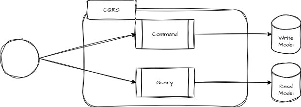

> Modelo Conceitual de CQRS

A motivação central é ganhar performance e escalabilidade usando modelos de dados especializados para cada tarefa. Ao desacoplar comandos e queries, cada lado pode ser escalado de forma independente, aproveitando melhor os recursos computacionais alocados.

Na prática, o padrão costuma envolver dois ou mais bancos de dados que mantêm os mesmos dados replicados, mas cada um modelado para uma necessidade específica. Ao longo do capítulo essas ideias são exploradas em variações cada vez mais sofisticadas.

## Separação de Responsabilidades

A essência do CQRS é separar leitura e escrita usando infraestruturas e modelos de dados distintos para cada responsabilidade.

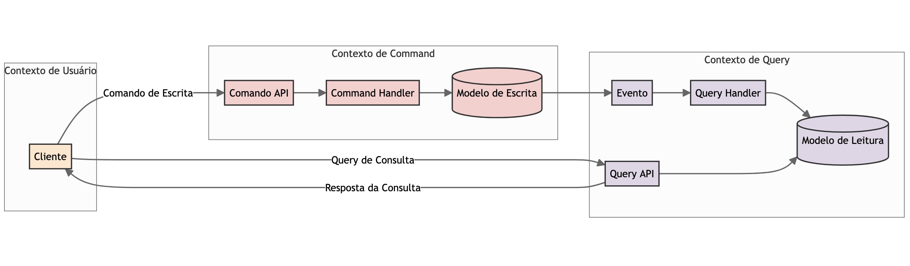

> Diagrama conceitual de segregação de responsabilidades do CQRS

Os **commands** carregam todas as informações necessárias para criar, atualizar ou remover registros e aplicam as validações que garantem a integridade dos dados. O modelo de escrita prioriza consistência e integridade, e por isso costuma se apoiar em bancos relacionais com transações ACID e em estruturas normalizadas, que asseguram operações atômicas e relacionamentos íntegros.

As **queries** apenas retornam dados, sem alterar estado. Os bancos do lado de leitura são otimizados para recuperação rápida, recorrendo a técnicas como caching, réplicas de leitura e desnormalização. Bancos NoSQL aparecem com frequência nesse papel por sua performance e escalabilidade horizontal, embora bancos SQL desnormalizados também funcionem bem.

Um exemplo simples seria manter um modelo normalizado em um banco SQL de escrita para garantir consistência e, a partir dos eventos de comando, gravar uma segunda representação desnormalizada em uma view materializada ou em um documento NoSQL próximo do formato de resposta da API.

### Perspectiva sobre Modelos de Domínio

O modelo de comando concentra a lógica de negócio, as validações e as regras que devem ser aplicadas sempre que o estado muda. Ele tende a ser mais complexo e frequentemente segue o padrão **Rich Domain Model**, com a lógica embutida nas entidades e apoiada em transações ACID. Em um sistema hospitalar fictício, por exemplo, criar uma prescrição exigiria validar médico, paciente e medicamento, conferir se o médico tem autorização para prescrever conforme sua especialidade e só então persistir — tudo encapsulado dentro do comando.

O modelo de consulta, por outro lado, é otimizado apenas para leitura. Ele não precisa carregar regras de negócio ou validações, pois sua função é entregar dados já consolidados para exibição ou uso posterior. No mesmo exemplo, uma estrutura desnormalizada poderia reunir, de forma legível e rápida, os dados do médico, do paciente e dos medicamentos prescritos.

# Modelos de Implementação

As implementações de CQRS variam de versões simples, restritas a um contexto ou funcionalidade, até abordagens complexas que agregam dados de várias fontes e etapas de um processo maior. As seções seguintes apresentam diferentes modelos de implementação que ajudam a entender o alcance desse tipo de arquitetura na resolução de problemas de escala e resiliência.

## CQRS em bancos SQL e Views Materializadas

A forma mais simples de aplicar CQRS é transpor um modelo SQL normalizado para outro modelo SQL desnormalizado. Essa tabela desnormalizada pode ficar na mesma instância e schema do modelo normalizado ou em um banco separado; a evolução para uma base dedicada é viável, embora exija infraestrutura e processos adicionais.

O exemplo usado é uma funcionalidade de prescrição de medicamentos, modelada com as tabelas `Medicos`, `Pacientes`, `Medicamentos`, `Prescricoes` e `Prescricao_Medicamentos`, esta última fazendo o vínculo 1:N entre prescrição e medicamentos. Esse modelo garante consistência forte de relacionamentos, impedindo que medicamentos, pacientes ou médicos não cadastrados participem de uma prescrição.

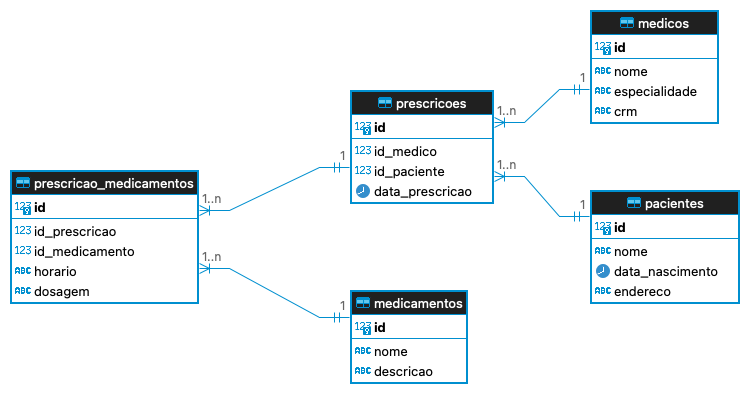

O artigo apresenta o DDL desse modelo normalizado de escrita: as cinco tabelas com chaves primárias e chaves estrangeiras ligando prescrições a médicos e pacientes, e a tabela de vínculo a prescrições e medicamentos. A modelagem prioriza a integridade dos relacionamentos durante a manipulação dos dados.

Esse modelo garante integridade, mas surge outra necessidade: gerar relatórios e ordens de serviço para a farmácia hospitalar preparar e controlar a saída de estoque. Essa visão é crítica, pois envolve triagem, rastreio, contabilidade e separação dos medicamentos por quarto/enfermaria. Para montá-la em um modelo altamente normalizado, é preciso uma quantidade considerável de joins.

O texto exibe a query que recupera essa visão consolidada de uma prescrição específica, combinando `Prescricoes`, `Medicos`, `Pacientes`, `Prescricao_Medicamentos` e `Medicamentos` por meio de vários `LEFT JOIN`, filtrando pelo id da prescrição.

#### Output

O resultado dessa query é uma série de linhas em que cada medicamento prescrito aparece repetindo os dados do médico e do paciente — efeito natural do join, com colunas como data da prescrição, nome e especialidade do médico, dados do paciente, nome do medicamento, horário e dosagem. Em vez de reproduzir a saída completa, basta entender que cada medicamento gera uma linha com as informações cruzadas.

Para externalizar essa consulta em um modelo especializado, a primeira alternativa é criar uma segunda tabela semi-desnormalizada que mantém apenas a consistência básica entre IDs e relacionamentos e coloca os medicamentos da prescrição em linha, de forma descritiva. Isso elimina a necessidade de joins constantes e entrega a view pronta para o subsistema de farmácia.

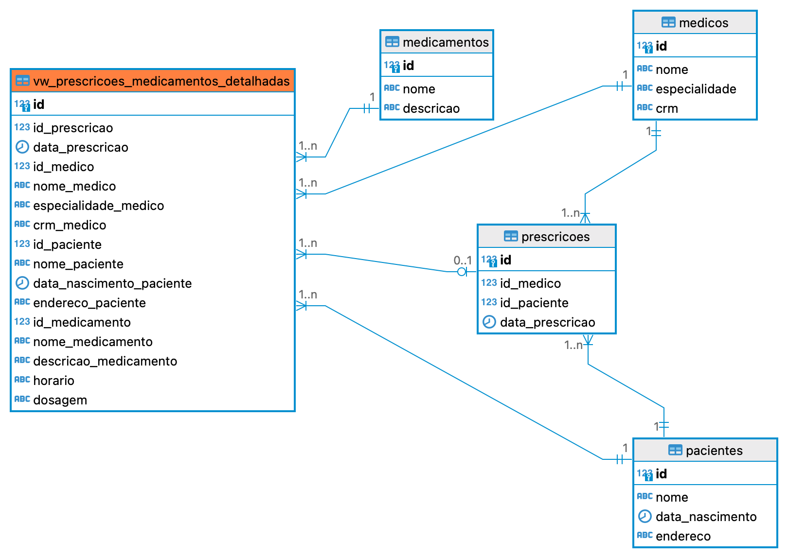

O artigo mostra o DDL dessa tabela de leitura, `vw_prescricoes_medicamentos_detalhadas`, que reúne em colunas únicas os dados de médico, paciente e medicamento que antes estavam espalhados, mantendo ainda chaves estrangeiras de referência para preservar um mínimo de integridade.

Para ilustrar, supondo que a tabela de consulta esteja no mesmo banco, é feita uma carga inicial usando a query com todos os joins para popular a nova tabela. Depois disso, recuperar a prescrição detalhada passa a ser um simples `SELECT` em uma única tabela já compilada.

O material apresenta o `INSERT ... SELECT` que faz essa carga inicial, lendo o modelo normalizado com os joins e gravando os campos correspondentes na tabela de leitura, seguido de um `SELECT` simples nessa tabela filtrando pela prescrição. A saída resultante traz, em cada linha, todos os dados já consolidados (prescrição, médico, paciente e medicamento), sem necessidade de novos joins.

Com isso, a visão de leitura para a farmácia fica otimizada e os sistemas recuperam os dados de forma simplificada. Essa estratégia é comum para criar visualizações especializadas, mas a carga via `SELECT` da base inteira é inviável em sistemas transacionais de grande volume, pois pode agravar problemas de escala. Para contornar isso, é preciso adicionar responsabilidades aos modelos de comando e consulta, muitas vezes aceitando consistência eventual no lado de leitura.

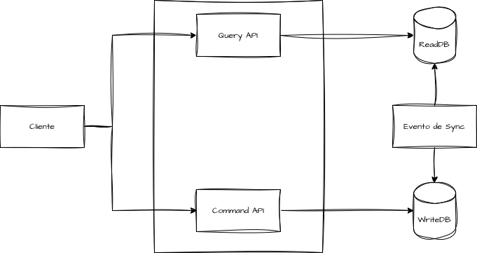

Para sincronizar escrita e leitura de forma saudável, mensageria e eventos atuam como intermediários, desacoplando as responsabilidades e permitindo que ambos os lados escalem de forma independente. O preço a pagar é a consistência eventual, que precisa ser prevista no design da arquitetura.

### Consistência Eventual no CQRS

No contexto de CQRS, a consistência eventual é valiosa quando é prevista e aceita desde o desenho da solução. Diferente de sistemas que garantem consistência imediata, esse modelo parte do princípio de que o sistema pode operar inconsistente por um intervalo de tempo sem grandes prejuízos e que, com o passar do tempo, voltará a um estado consistente.

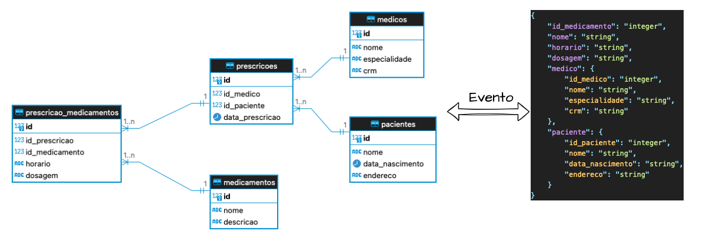

Na prática, com os modelos de comando e consulta separados, as escritas ocorrem no modelo de comando e, em seguida, eventos ou mensagens são emitidos para atualizar o modelo de consulta de forma assíncrona. Isso significa que pode haver um atraso até que a leitura reflita as últimas mudanças — o intervalo em que o sistema está em "consistência eventual".

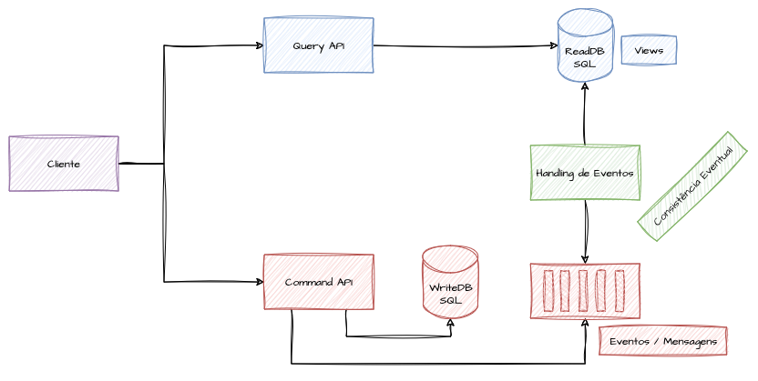

Sincronizar os modelos exige esforço computacional extra: processos assíncronos de mensageria que trafegam dados por filas ou tópicos e escrevem no modelo de consulta, gerando views otimizadas. Esse comportamento adicional deve ser independente e não pode impactar a performance de forma agressiva. Em termos práticos, após persistir no modelo de escrita, o comando publica uma mensagem ou evento com os dados necessários para que um processo de sincronização construa a representação correspondente no modelo de consulta.

## CQRS e Réplicas de Leitura

Conforme a intensidade de escrita cresce por causa da sincronização entre modelos, o próprio modelo de leitura tende a saturar, pois ainda concentra a concorrência entre escrita de sincronização e leitura dos clientes. Olhando de perto, percebe-se que o problema apenas mudou de lugar — mas há outras formas de otimizar o lado de leitura em uma abordagem SQL.

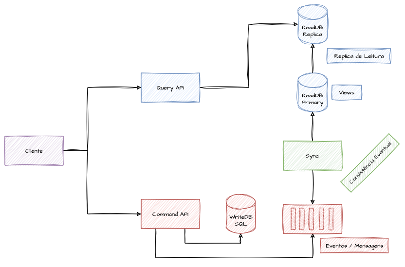

Aproveitando a consistência eventual já aceita, é possível usar réplicas de leitura adicionais como base principal das queries, deixando a instância primária dedicada a absorver a escrita de sincronização e evitar concorrência com a API. Isso eleva os custos operacionais, mas adiciona resiliência: se a sincronização escreve nas duas bases e as queries não alteram estado, instâncias *read-only* podem ser incorporadas ao fluxo para ganhar performance.

## CQRS e Bancos de Dados NoSQL

Usar NoSQL para atender ao lado de leitura é interessante porque troca isolamento, relacionamento e atomicidade por performance otimizada de escrita e leitura. Como o modelo de leitura não precisa das garantias ACID, esse tradeoff pode ser aceito com mais segurança em prol de consultas mais rápidas.

Topologicamente, a implementação é igual à de usar dois bancos SQL, com a diferença de que as aplicações ou processos do domínio precisam conhecer os dois dialetos e saber traduzir entre eles por meio de processos intermediários.

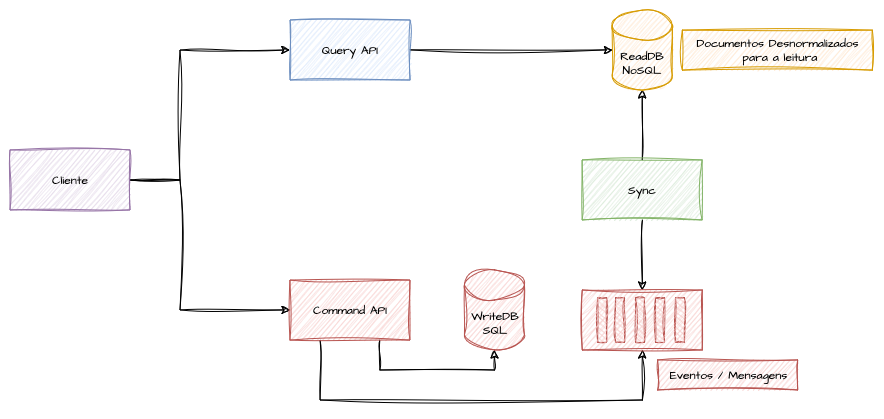

No exemplo, é preciso converter os dados de todas as prescrições para montar prontuários médicos eletrônicos — usados na gestão interna do hospital — e também receitas médicas entregues ao paciente. Os dois casos são parecidos e permitem criar um query model NoSQL muito próximo do response final.

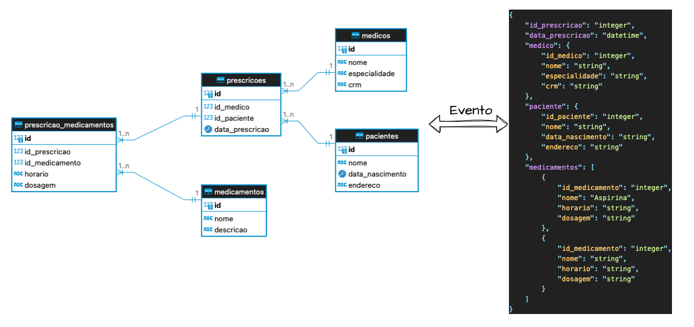

Com CQRS, esse modelo de consulta pode virar um documento NoSQL no qual todas as informações da prescrição são agrupadas, parecido com um response HTTP montado manualmente. Cada comando de escrita gera eventos ou mensagens com os dados do prontuário para construir a visualização otimizada. O exemplo adota o **Elasticsearch**, no qual se cria um mapeamento que define a estrutura mínima de campos e tipos, alinhado ao evento de entrada e ao payload esperado da API de consulta.

O artigo mostra o mapping do índice `prontuarios`, com objetos aninhados para `medico`, `paciente` e uma lista `nested` de `medicamentos`, e a resposta de confirmação retornada pelo Elasticsearch ao criar o índice.

Depois do mapping, é necessário um processo que receba o evento de domínio gerado por um comando de escrita e o transforme no documento esperado. A escolha do banco influencia esse processo, pois nem sempre todos os dados chegam em um único evento. Se a construção for incremental, com dados distribuídos consolidados de forma assíncrona, o modelo NoSQL precisa aceitar incrementos parciais dos registros.

O texto apresenta o documento indexado via `POST`, contendo o id da prescrição, os blocos de médico e paciente e o array de medicamentos com horário e dosagem. Esse modelo abre uma grande variedade de possibilidades de consulta: se a chave do índice for conhecida e mantida pelo modelo de escrita, a busca pode ser feita diretamente por ela, garantindo recuperação otimizada.

O artigo encerra a seção exibindo a resposta de um `GET` por id, que devolve o documento completo no campo `_source`, com todos os dados da prescrição já consolidados em um único objeto.

## CQRS em Sistemas Distribuídos

Aplicado a sistemas distribuídos e granulares, o CQRS aumenta resiliência, performance e facilita a sumarização de dados de domínio espalhados por múltiplos microsserviços. Quando cada serviço tem seu próprio banco especializado, fica mais difícil montar consultas que unam dados de serviços diferentes — e é justamente aí que abordagens de consolidação ajudam a otimizar queries e replicação.

Construir views otimizadas a partir de dados de vários serviços, via eventos e mensagens, resolve cenários complexos, mas também aumenta a complexidade e a granularidade do ambiente. Para puristas de domínio, estender o CQRS para além de um único domínio pode ser controverso, já que tradicionalmente a separação de comando e query se limita à responsabilidade de um domínio específico; ainda assim, montar modelos consolidados com dados de domínios distintos é uma adição poderosa ao arsenal de arquitetura.

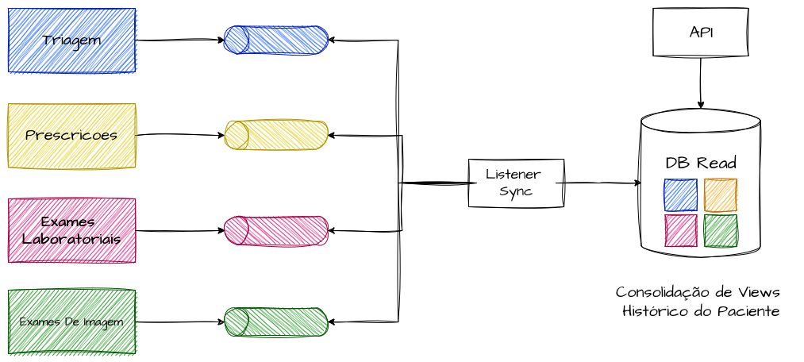

> [!NOTE]
> Consolidação de eventos de diversos event-stores de comandos para compor modelos de dados com dados distribuídos.

O custo da consistência eventual cresce conforme aumenta o número de fontes de eventos a tratar e sumarizar. Estendendo o exemplo hospitalar, surge a necessidade de recuperar todo o histórico do paciente para auditoria, faturamento e treinamento de modelos. Há serviços distintos para triagem inicial, prescrições, exames laboratoriais e exames de imagem, e essas informações precisam ser consolidadas tanto por atendimento individual quanto ao longo de anos de relacionamento do paciente com o hospital.

Para isso, cria-se uma visualização consolidada entre vários domínios que expõem seus dados por tópicos de consolidação. Listeners escutam tanto eventos de comando quanto tópicos de resposta que confirmam a execução bem-sucedida, e vão construindo um modelo de consulta que agrupa os dados. Esse modelo de leitura deve permitir atualizações incrementais e aceitar uma consistência eventual contínua, já que o tempo de construção varia com a demanda e o número de fontes. É uma alternativa em tempo quase real a jobs de ETL em batch e ao padrão API-Composition, que tende a acoplar fortemente os serviços e pode comprometer a disponibilidade.

### Pattern de Dual-Write no Contexto de CQRS

Olhando com a ótica de resiliência, o comando executa dois passos — persistir no banco e publicar o evento — e surge um alerta: o que acontece se um deles falhar e o outro não? Se o dado for persistido mas a publicação da mensagem falhar (por indisponibilidade do broker, por exemplo), a mudança de estado não se refletirá nas APIs de consulta.

No cenário inverso, se a mensagem for publicada com sucesso mas o banco falhar, ocorre uma inconsistência semelhante: dados que não existem na base transacional aparecem nas APIs de consulta como se o comando tivesse sido efetivado.

Ambos os casos são problemáticos para sistemas que exigem integridade forte. Para mitigá-los, existem padrões de design que reforçam a segurança dos processos de comando e leitura — um deles é o **Dual-Write**.

O **Dual-Write** se aplica quando é preciso confirmar a consistência do dado em duas fontes distintas e dependentes, ainda que de forma assíncrona. No CQRS, ele mantém comando e consulta sincronizados: quando um comando altera o estado, ele é processado (validações, regras de negócio, escrita no banco) e, ao concluir com sucesso, gera o evento correspondente que descreve a mudança. O objetivo é garantir que o dado não seja alterado se a publicação do evento falhar e que o evento não seja publicado se a escrita no banco falhar — um assegurando o outro.

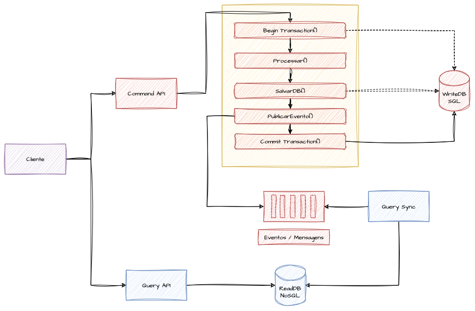

> [!NOTE]
> Exemplo de Dual Write implementado para garantir a escrita em banco e a publicação do evento

Para viabilizar essa confiabilidade, todas as operações de escrita precisam ocorrer dentro de transações atômicas — uma unidade única e indivisível. Isso só funciona efetivamente em bancos ACID com suporte a commit e rollback. A transação é iniciada antes das modificações; se tudo ocorrer como esperado, inclusive a publicação do evento, o commit efetiva todas as operações de uma vez.

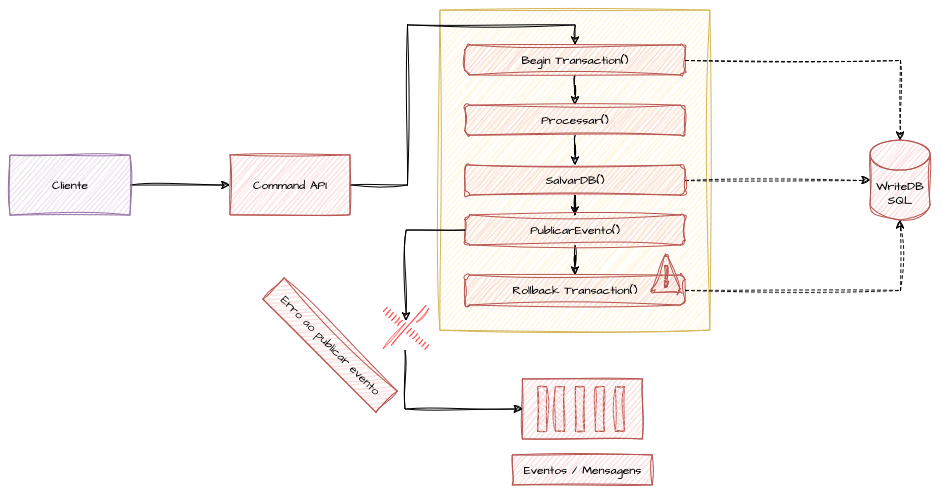

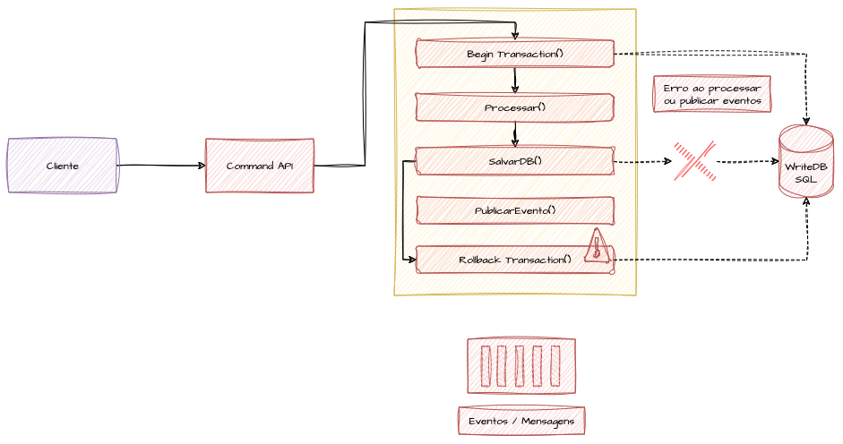

> [!NOTE]
> Exemplo de Falhas que podem ocorrer em processos e integrações sendo respondidas com um rollback

Se qualquer etapa falhar, o rollback é acionado e as operações de escrita realizadas dentro da transação não são efetivadas.

### Outbox Pattern no Contexto de CQRS

O **Transactional Outbox Pattern** é uma alternativa ao Dual-Write, voltado a garantir a consistência entre a escrita no banco e a publicação de eventos em sistemas distribuídos que usam bancos SQL. No CQRS, é fundamental que os eventos de mudança de estado cheguem corretamente aos modelos de consulta, e o ideal é que a alteração no banco e a publicação do evento ocorram de maneira atômica — ambas concluídas ou nenhuma.

O Outbox resolve isso armazenando os eventos em uma tabela de outbox dentro do mesmo banco transacional usado para persistir o estado. Quando um comando processa uma alteração, o evento correspondente é gravado na tabela de outbox na mesma transação. Um processo assíncrono lê periodicamente esses eventos em ordem, publica-os no sistema de mensageria e depois marca como publicados ou os remove da tabela.

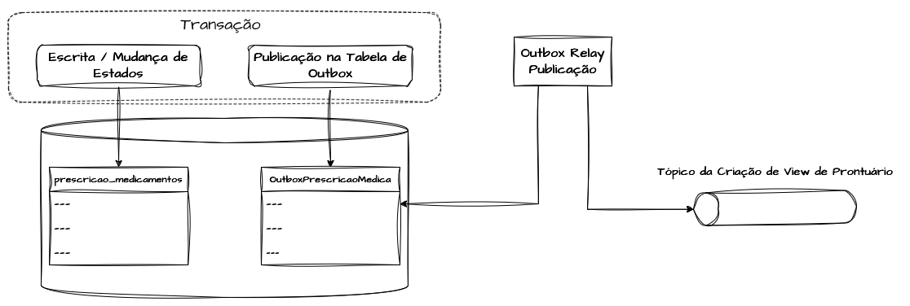

O padrão tem três componentes principais: a **tabela outbox**, o **processo de publicação** (também chamado de **relay de mensagem**) e a **gestão de erros** obrigatória para torná-lo de fato resiliente. A tabela outbox guarda os eventos temporariamente e deve participar da mesma transação da escrita de dados, garantindo atomicidade. O relay lê os eventos de forma assíncrona e periódica, publica na mensageria e marca como publicados ou os remove — preferencialmente removendo. A gestão de erros precisa prever retentativas e monitoramento, de modo que todo evento seja eventualmente publicado e só removido após confirmação.

No exemplo, é preciso montar uma view das prescrições do prontuário. Para isso, cria-se uma tabela de outbox que armazena os eventos de prescrição dentro da mesma transação que salva as prescrições na tabela principal.

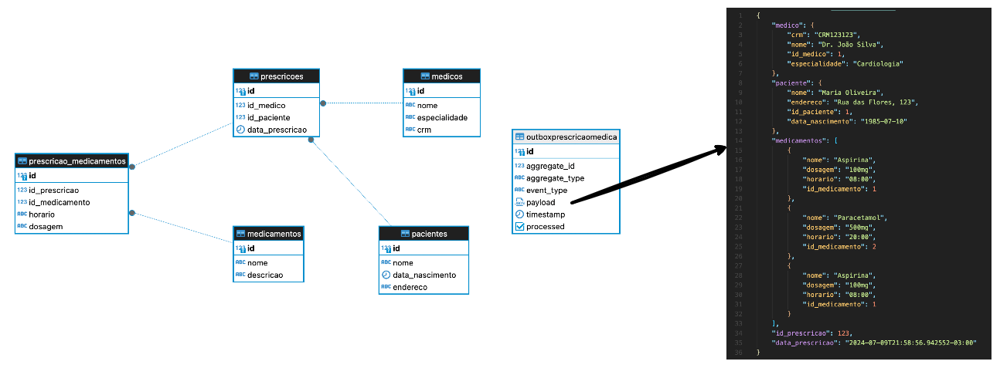

O artigo apresenta o DDL da tabela `OutboxPrescricaoMedica`, com colunas como `aggregate_id`, `aggregate_type`, `event_type`, um `payload` em JSONB, um timestamp e um booleano `processed` que indica se o evento já foi publicado.

Em seguida, o texto mostra uma transação SQL que, entre `BEGIN` e `COMMIT`, insere os medicamentos da prescrição na tabela de escrita e, na mesma transação, grava na tabela de outbox um evento `PrescricaoCriada` cujo payload é montado com `jsonb_build_object`, agregando os dados de médico, paciente e a lista de medicamentos. Como ambas as escritas estão na mesma transação, o commit só ocorre se as duas tiverem sucesso.

Comparado ao Dual-Write, o Outbox leva mais a sério a mediação da publicação dentro da abordagem transacional, apostando no sucesso da propagação pela simplicidade, mesmo que dependa de um processo adicional para ler e publicar os eventos.

Apesar de oferecer mais garantias de publicação, o padrão exige custo computacional adicional no banco, devido à leitura e escrita constantes na tabela de outbox. Isso pode se tornar um gargalo conforme a escala aumenta: a concorrência entre leitura e escrita fica comprometida e tende a afetar a performance geral do sistema, justamente na parte mais difícil de escalar em sistemas transacionais de grande porte.

# Referencias

[Centro de Arquitetura Microsoft - Padrão CQRS](https://learn.microsoft.com/pt-br/azure/architecture/patterns/cqrs)

[CQRS – O que é? Onde aplicar?](https://www.eduardopires.net.br/2016/07/cqrs-o-que-e-onde-aplicar/)

[CQRS (Command Query Responsibility Segregation) em uma Arquitetura de Microsserviços](https://medium.com/@marcelomg21/cqrs-command-query-responsibility-segregation-em-uma-arquitetura-de-micro-servi%C3%A7os-71dcb687a8a9)

[Amazon AWS - Padrão CQRS](https://docs.aws.amazon.com/pt_br/prescriptive-guidance/latest/modernization-data-persistence/cqrs-pattern.html)

[Martin Fowler - CQRS](https://www.martinfowler.com/bliki/CQRS.html)

[Gitlab - CQRS](https://ajuda.gitlab.io/guia-rapido/arquitetura/design-patterns/cqrs/)

[Command Query Responsibility Segregation (CQRS)](https://developer.confluent.io/courses/event-sourcing/cqrs/)

[Microservices Patterns: API Composition and CQRS Patterns](https://crishantha.medium.com/microservices-patterns-api-composition-pattern-27040cae5bd3)

[Pattern: Command Query Responsibility Segregation (CQRS)](https://microservices.io/patterns/data/cqrs.html)

[Pattern: Database per Service](https://microservices.io/patterns/data/database-per-service.html)

[CQRS na AWS: Sincronizando os Serviços de Command e Query com o Padrão Transactional Outbox](https://aws.amazon.com/pt/blogs/aws-brasil/cqrs-na-aws-sincronizando-os-servicos-de-command-e-query-com-o-padrao-transactional-outbox-a-tecnica-transaction-log-tailing-e-o-debezium-connector/)

[CQRS na AWS: Sincronizando os Serviços de Command e Query com o Amazon SQS](https://aws.amazon.com/pt/blogs/aws-brasil/cqrs-na-aws-sincronizando-os-servicos-de-command-e-query-com-o-amazon-sqs/)

[Qual a diferênça entre View e Materialized View?](https://dicasdeprogramacao.com.br/qual-a-diferenca-entre-view-e-materialized-view/)

[Guia para modelagem de domínios ricos](https://arleypadua.medium.com/guia-para-modelar-dom%C3%ADnios-ricos-15887b516c1b)
