# System Design - Saga Pattern

- [System Design - Saga Pattern](#system-design---saga-pattern)
- [O que é o modelo SAGA?](#o-que-é-o-modelo-saga)
  - [A Origem Histórica do Saga Pattern](#a-origem-histórica-do-saga-pattern)
- [O problema de lidar com transações distribuídas](#o-problema-de-lidar-com-transações-distribuídas)
- [O problema de lidar com transações longas](#o-problema-de-lidar-com-transações-longas)
- [A Proposta de Transações Saga](#a-proposta-de-transações-saga)
  - [Modelo Orquestrado](#modelo-orquestrado)
    - [Modelo de Comando / Resposta em Transações Saga](#modelo-de-comando--resposta-em-transações-saga)
  - [Modelo Coreografado](#modelo-coreografado)
- [Adoções Arquiteturais](#adoções-arquiteturais)
  - [Maquinas de Estado no Modelo Saga](#maquinas-de-estado-no-modelo-saga)
    - [Transições de Estados da Saga](#transições-de-estados-da-saga)
    - [Ciclo de Vida da Saga](#ciclo-de-vida-da-saga)
  - [Logs de Saga e Rastreabilidade da Transação](#logs-de-saga-e-rastreabilidade-da-transação)
  - [Modelos de Ação e Compensação no Saga Pattern](#modelos-de-ação-e-compensação-no-saga-pattern)
  - [Problemas de Dual Write em Transações Saga](#problemas-de-dual-write-em-transações-saga)
    - [Outbox Pattern e Change Data Capture em Transações Saga](#outbox-pattern-e-change-data-capture-em-transações-saga)
    - [Two-Phase Commit em Transações Saga](#two-phase-commit-em-transações-saga)
  - [Mecanismos de Reinicialização de Saga](#mecanismos-de-reinicialização-de-saga)
- [Referências](#referências)

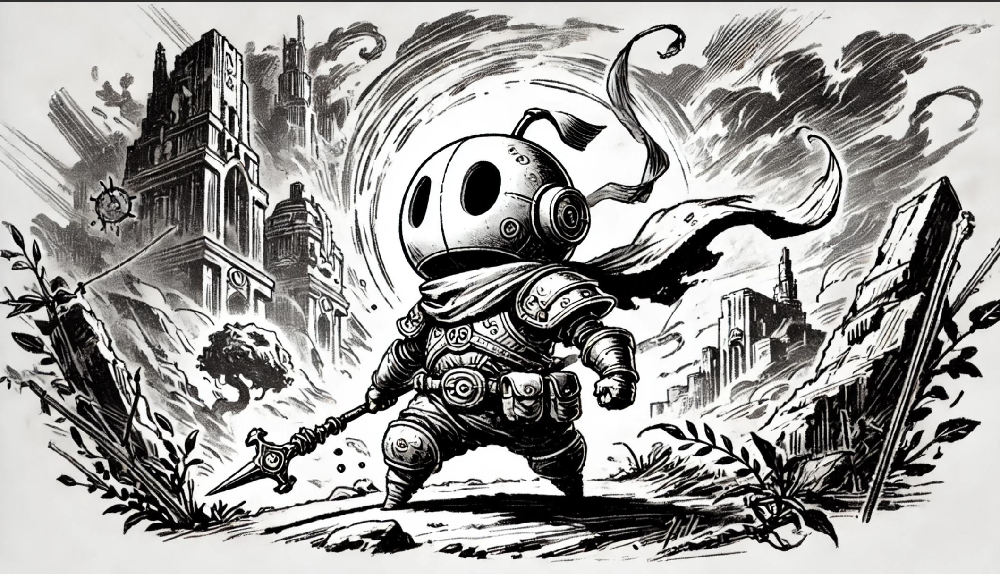

> **Nota:** Este documento é um material de estudo baseado no artigo original
> **"System Design - Saga Pattern"**, de **Matheus Fidelis**, publicado em
> [fidelissauro.dev/saga-pattern](https://fidelissauro.dev/saga-pattern/).
> As ilustrações pertencem ao autor original. Recomenda-se a leitura do
> artigo completo na fonte.

---

# O que é o modelo SAGA?

O Saga é um **padrão arquitetural voltado a preservar a consistência de dados em transações distribuídas**, principalmente quando essas transações precisam atravessar vários microserviços ou demoram bastante tempo até serem finalizadas — situações em que aceitar uma execução pela metade não é uma opção.

O nome remete às sagas no sentido literal: uma jornada do herói dividida em capítulos, na qual cada etapa precisa ser superada em sequência. De forma análoga, uma Saga tem natureza **sequencial e distribuída**, dependendo de diversos serviços que executam seus passos um após o outro, de maneira ordenada.

A implementação pode seguir duas abordagens — **Coreografada ou Orquestrada** — detalhadas adiante. Independentemente da escolha, o objetivo é coordenar transações que tocam dados em diferentes serviços e bancos sem perder consistência. Em caso de falha, todos os participantes precisam ser avisados para **compensar a transação**, revertendo (rollback) os passos já concluídos.

Vale reforçar: a proposta central do Saga é **confiabilidade e consistência, não desempenho**. Boa parte de suas nuances inclusive sacrifica performance para alcançar esse objetivo.

## A Origem Histórica do Saga Pattern

Embora esta série normalmente evite aprofundar em detalhes acadêmicos, neste caso vale destacar de onde o padrão surgiu e que problema ele foi originalmente concebido para resolver.

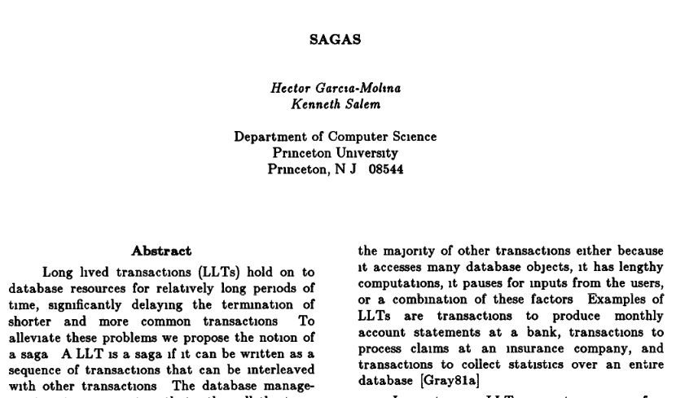

O Saga Pattern foi descrito pela primeira vez por **Hector Garcia-Molina** e **Kenneth Salem**, em **1987**, em um artigo da Universidade de Princeton intitulado **"SAGAS"**. A motivação era lidar com as **Long Live Transactions (LLTs)**: processos que demoravam mais que as operações comuns e não podiam simplesmente travar os recursos computacionais até o fim.

A ideia, fiel à metáfora dos capítulos, era **quebrar uma transação longa em várias transações menores**, cada uma capaz de ser confirmada ou desfeita de forma independente, transformando uma grande operação atômica em pequenas transações atômicas supervisionadas.

Apesar de não ter nascido para resolver consistência em microserviços — e sim processos em bancos de dados —, o conceito foi **revisitado** com a popularização dos sistemas distribuídos, mostrando-se útil para tratar falhas e garantir consistência nas arquiteturas modernas.

# O problema de lidar com transações distribuídas

Uma transação distribuída é aquela que só se conclui quando **múltiplos sistemas e bancos de dados gravam e confirmam seus dados**, reportando o status de escrita para quem coordena o processo.

Pense no sistema de pedidos de um grande e-commerce: receber uma solicitação e levá-la da compra até a entrega exige acionar vários domínios, como **Pedidos, Pagamentos, Estoque, Entregas** e **Notificações**.

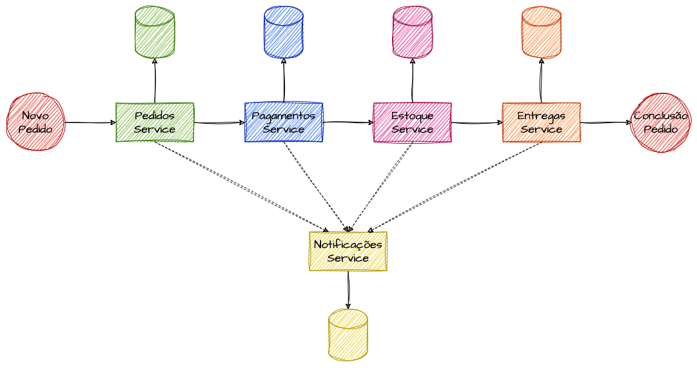

> [!NOTE] 
> Exemplo de um processo distribuido inicial

Quanto mais serviços interligados, **maior a complexidade e a chance de falhas e inconsistências**, já que cada domínio precisa cumprir sua parte da sequência para o pedido ter sucesso.

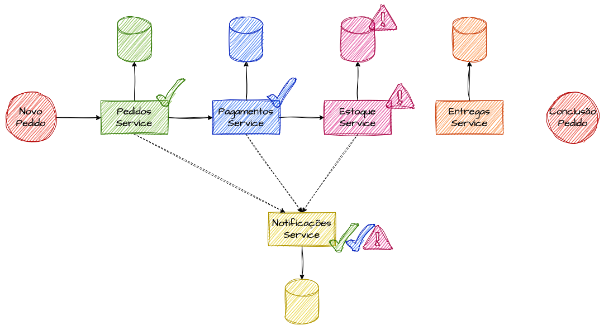

> [!NOTE] 
> Exemplo de um erro em uma transação distribuída

Se um serviço falhar no meio do caminho — por exemplo, falta de item em estoque ou dados inválidos —, pode ser impossível seguir para os próximos passos, mesmo que etapas críticas como o pagamento já tenham ocorrido. Desfazer o que já foi feito torna-se um problema complicado, e o sistema corre o risco de ficar inconsistente (pagamento cobrado, pedido não concluído). É exatamente esse cenário que o Saga Pattern busca resolver, garantindo o retorno a um estado consistente entre todos os serviços envolvidos.

# O problema de lidar com transações longas

Muitos processos complexos demandam mais tempo para concluir por completo: uma solicitação pode levar de milissegundos a semanas ou meses, dependendo das etapas envolvidas.

Esse intervalo entre um passo e o seguinte pode ser intencional, motivado por **agendamentos, estímulos externos, agrupamento de registros em janelas de tempo** e afins. Exemplos incluem cobrança de parcelamentos, agendamentos financeiros, consolidação de franquias de uso, processamento em batch e fechamento de faturas.

Gerenciar o ciclo de vida dessas transações de longo prazo é um **desafio arquitetural relevante**, sobretudo em consistência e conclusão. É preciso controlar a transação de ponta a ponta, acompanhar todas as etapas e conhecer seu estado atual de forma transparente e durável. O Saga resolve isso **decompondo a transação longa em transações menores e independentes**, cada uma sob responsabilidade de um serviço, facilitando consistência e recuperação de falhas.

# A Proposta de Transações Saga

Fechando a problemática apresentada, o Saga Pattern é um padrão pensado para **lidar com transações distribuídas que dependem de consistência eventual em múltiplos microserviços**.

Sua proposta é **decompor uma transação longa e complexa em uma sequência de transações menores e coordenadas**, garantindo sucesso ou erro controlado da execução e preservando a consistência dos dados entre serviços que adotam o modelo **"One Database Per Service"**.

Cada Saga funciona como uma **transação pseudo-atômica**, composta por operações menores executadas localmente em cada serviço. Caso uma dessas operações falhe, o padrão define **transações compensatórias** que desfazem o que já foi feito, mantendo o sistema consistente mesmo diante de erros.

Quando aplicado em [abordagens assíncronas](https://fidelissauro.dev/mensageria-eventos-streaming/), o Saga dispensa bloqueios síncronos e prolongados — como os do **Two-Phase Commit (2PC)** —, que são caros e podem virar gargalos difíceis de recuperar em ambientes distribuídos.

Há dois modelos principais de implementação: **Orquestrado** e **Coreografado**, com características distintas de coordenação e comunicação. A escolha depende das necessidades do sistema e, sobretudo, da complexidade das transações.

## Modelo Orquestrado

O **Modelo Orquestrado** introduz um **componente centralizado** que gerencia a execução das sagas. Esse orquestrador inicia a saga, coordena a sequência de transações, monitora respostas e dispara compensações quando necessário, atuando como um **control plane** que envia comandos aos serviços e decide os próximos passos com base nas respostas.

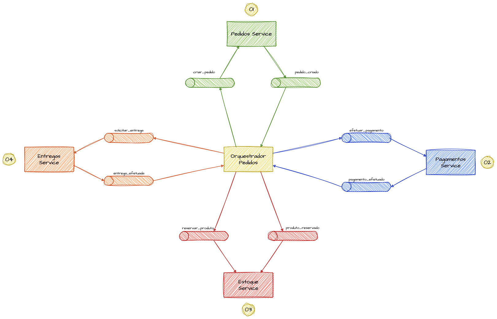

> [!NOTE]
> Exemplificação do Modelo Orquestrado

Para concluir um pedido, é preciso estimular e aguardar a confirmação de vários domínios — pagamentos, estoque, notificações, entregas —, cada um com seus contratos, limites e capacidades. Em uma abordagem assíncrona, o orquestrador usa o padrão de [command / response](https://fidelissauro.dev/) para acionar cada serviço e, conforme a resposta, seguir para o próximo passo, compensar ou encerrar a saga. Ele também pode operar de forma síncrona, mas aí mecanismos nativos de mensageria (backoff, retries, DLQs) precisam ser implementados manualmente.

Na prática, o orquestrador monta um **"mapa da saga"** com todas as etapas necessárias, envia mensagens e eventos aos serviços e, a partir das respostas, avança a saga até concluí-la ou compensar o que já foi executado.

Esse modelo depende de um padrão de **Máquina de Estado**, capaz de manter o estado atual e, a cada resposta, decidir a transição e a ação correspondente. Assim, a complexidade da orquestração fica concentrada em um único componente, facilitando métricas, controle de histórico e alterações de estado de forma transacional.

### Modelo de Comando / Resposta em Transações Saga

Em implementações modernas, especialmente no modelo orquestrado, boa parte das interações ocorre de forma **assíncrona e reativa**. O orquestrador (ou um serviço solicitante externo à saga) envia um **comando** para que outro serviço execute uma ação e aguarda a resposta de forma bloqueante ou semi-bloqueante antes de prosseguir.

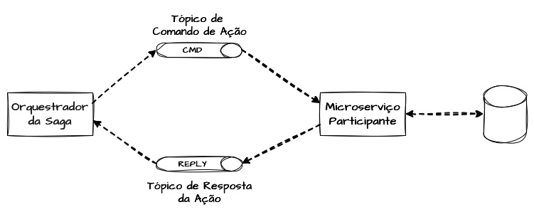

> [!NOTE]
> Modelo de Comando e Resposta de Fluxos Assincronos

Isso pressupõe que cada serviço exponha um **tópico de ação** e um **tópico de resposta**, de modo que o solicitante saiba para onde enviar o comando e onde aguardar a confirmação de sucesso ou falha.

## Modelo Coreografado

Diferentemente do Orquestrado, que centraliza o conhecimento de toda a saga, o **Coreografado** distribui essa responsabilidade: cada serviço **conhece o anterior e o seguinte**. A saga roda como uma malha de serviços, na qual, ao terminar seu processo, um serviço aciona diretamente o próximo, e assim por diante até a conclusão.

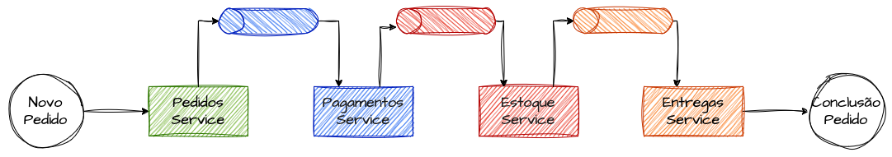

A mesma lógica vale para compensação e rollback: o serviço que falha precisa notificar o anterior ou acionar um "botão do pânico", fazendo toda a malha já confirmada regredir.

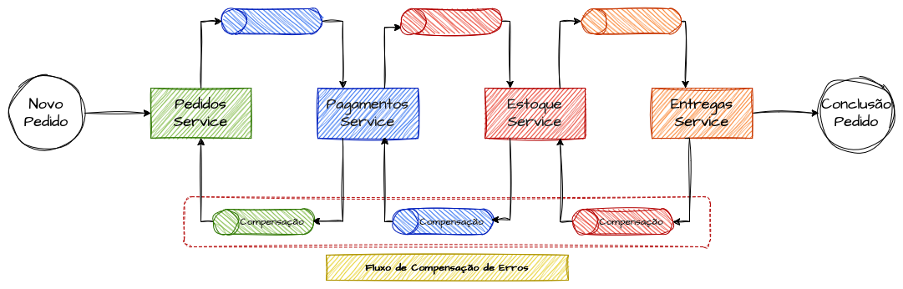

Apesar de ser, à primeira vista, mais simples e com menos garantias que o orquestrado, o modelo coreografado também viabiliza fluxos síncronos em arquiteturas saga.

# Adoções Arquiteturais

As abordagens de Saga se estendem a diversos padrões arquiteturais. Nesta seção são abordados os patterns e estratégias considerados mais relevantes ao avaliar uma arquitetura saga para um projeto.

## Maquinas de Estado no Modelo Saga

Em sistemas distribuídos, **manter o estado de todos os passos até a saga ser concluída é talvez a preocupação mais crítica**. Esse controle permite identificar quais sagas estão pendentes ou falharam e em qual passo, viabilizando monitoramento, retentativas, retomadas e compensações.

### Transições de Estados da Saga

Uma Máquina de Estado lida com quatro elementos: **estados, eventos, transições e ações**.

Os **estados** descrevem a situação atual da transação (`Iniciado`, `Agendado`, `Pagamento Concluído`, `Entrega Programada`, `Finalizado` etc.). Os **eventos** são notificações relevantes do processo — como `Pagamento Aprovado` ou `Item não disponível no estoque` — que podem ou não provocar uma mudança. As **transições** representam a passagem de um estado válido para outro em decorrência de um evento; por exemplo, estando em `Estoque Reservado` e recebendo `Pagamento Concluído`, a máquina transiciona para `Agendar Entrega`. Ao entrar em um novo estado, executa-se uma **ação** — no caso, invocar o microserviço de entregas.

No modelo saga, o **estado atual corresponde à própria saga**, e os **eventos** são as entradas e saídas dos serviços acionados. A máquina precisa guardar o estado, avaliar cada evento recebido, decidir se há transição e, em caso positivo, qual ação tomar.

### Ciclo de Vida da Saga

Imagine uma saga de fechamento de pedido que nasce com estado `NOVO`. Nesse ponto, garante-se que o domínio de pedidos tenha registrado todos os dados da solicitação para fins analíticos.

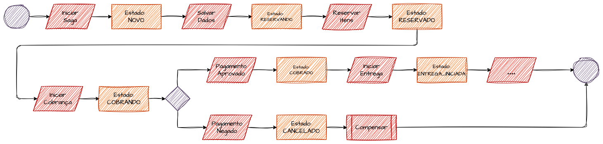

> [!NOTE]
> Exemplo do Fluxo de Transição e Ações da Saga

Confirmada a gravação, o estado passa a `RESERVANDO` (reserva de item em estoque), depois `RESERVADO` e em seguida `COBRANDO`, quando o sistema de pagamentos é notificado e pode demorar a responder. Em sucesso, vai para `COBRADO` e aciona as entregas (`INICIAR_ENTREGA`), seguindo por estados intermediários como `SEPARACAO`, `SEPARADO`, `DESPACHADO`, `EM_ROTA` e `ENTREGUE`, até chegar a `FINALIZADO`.

Se, a partir de `COBRANDO`, ocorrer falha (`PAGAMENTO_NEGADO` ou `NAO_PAGO`), a saga deve notificar o sistema de reservas para liberar os itens e atualizar o estado analítico de pedidos.

De forma geral, a máquina de estado raciocina sobre quatro perguntas:

- **Qual evento acabei de receber?** → `COBRADO COM SUCESSO`
- **Qual é o meu estado atual?** → `COBRANDO`
- **Se meu estado é COBRANDO e recebo COBRADO COM SUCESSO, para qual estado vou?** → `INICIAR_ENTREGA`
- **Qual ação devo tomar ao entrar em INICIAR_ENTREGA?** → Notificar o sistema de entregas.

Em resumo: "Que evento é esse?", "Onde estou agora?", "Para onde vou?" e "O que devo fazer aqui?".

## Logs de Saga e Rastreabilidade da Transação

**Registrar todos os passos da transação traz grande vantagem** — em sagas simples e, principalmente, nas complexas —, ainda que possa ficar custoso se mantido por muito tempo. O grande benefício de coordenar estados é permitir a **rastreabilidade** de todas as sagas: concluídas, em andamento ou finalizadas com erro.

Modelagens de dados adequadas tornam possível rastrear cada passo iniciado e finalizado. Nos modelos orquestrados, o componente central registra os passos e suas respostas, facilitando o controle automático ou manual.

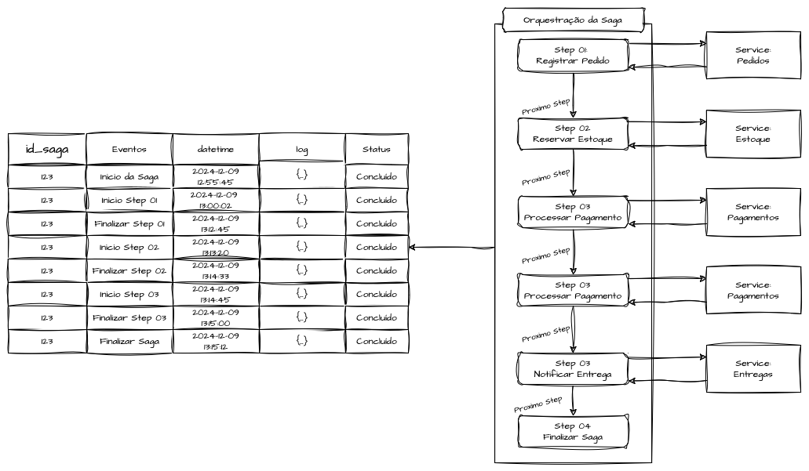

Assim, fica simples identificar quais sagas apresentaram erro mantendo esses registros na camada de dados. Esses insumos alimentam **mecanismos de resiliência** capazes de monitorar, retomar, reiniciar ou refazer passos que falharam, além de oferecer uma visão analítica da jornada.

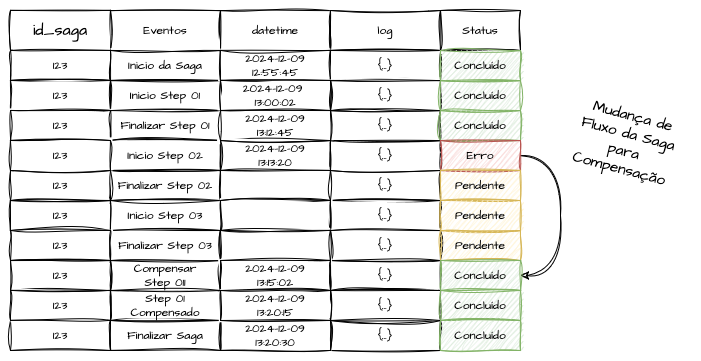

## Modelos de Ação e Compensação no Saga Pattern

Projetar sistemas distribuídos é assumir que lutaremos constantemente contra problemas de consistência. Os patterns de compensação do Saga **garantem que cada passo executado em sequência possa ser revertido em caso de falha**.

Assim como o Saga assegura a execução bem-sucedida do caminho saudável, a compensação garante que, diante de falhas sistêmicas — dados inválidos, indisponibilidades, problemas de saldo, limites de crédito ou estoque —, as ações sejam totalmente desfeitas, evitando que apenas parte da transação se confirme.

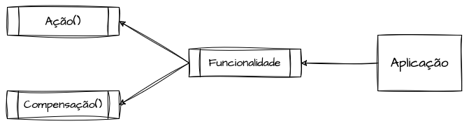

Uma forma eficiente de projetar os handlers que executam passos da saga (via APIs ou listeners de eventos) é **expô-los sempre junto a um método de reversão**: para cada ação, uma forma de desfazê-la. Exemplos: `reservaPassagens()` e `liberaPassagens()`, `cobrarPedido()` e `estornarCobranca()`, `incrementarUso()` e `decrementarUso()`.

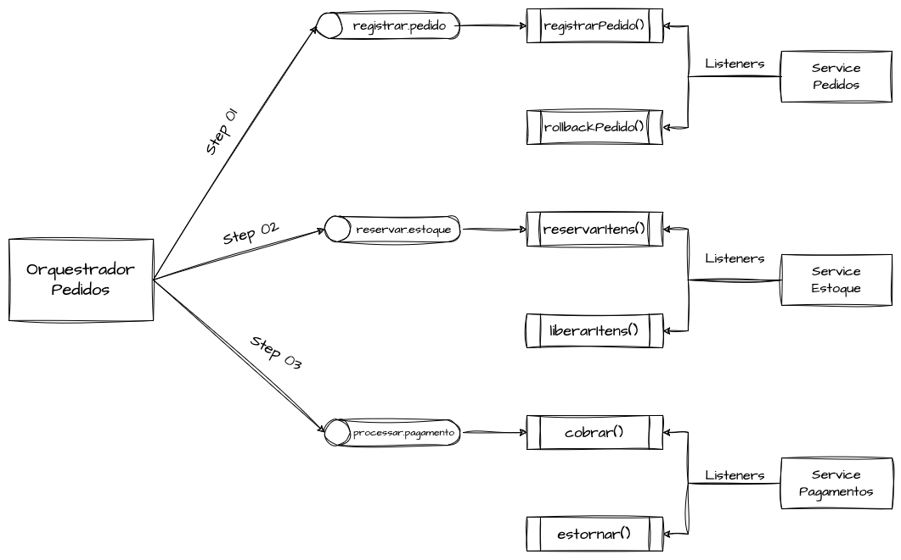

Com Ação e Compensação implementadas, o orquestrador pode "apertar o botão do pânico", notificando os serviços para desfazerem o que já foi confirmado. Em arquiteturas orientadas a eventos, pode-se criar um **tópico de compensação** com múltiplos *consumer groups*, de modo que cada serviço receba a mesma mensagem e execute a compensação caso a transação já tenha sido confirmada nele.

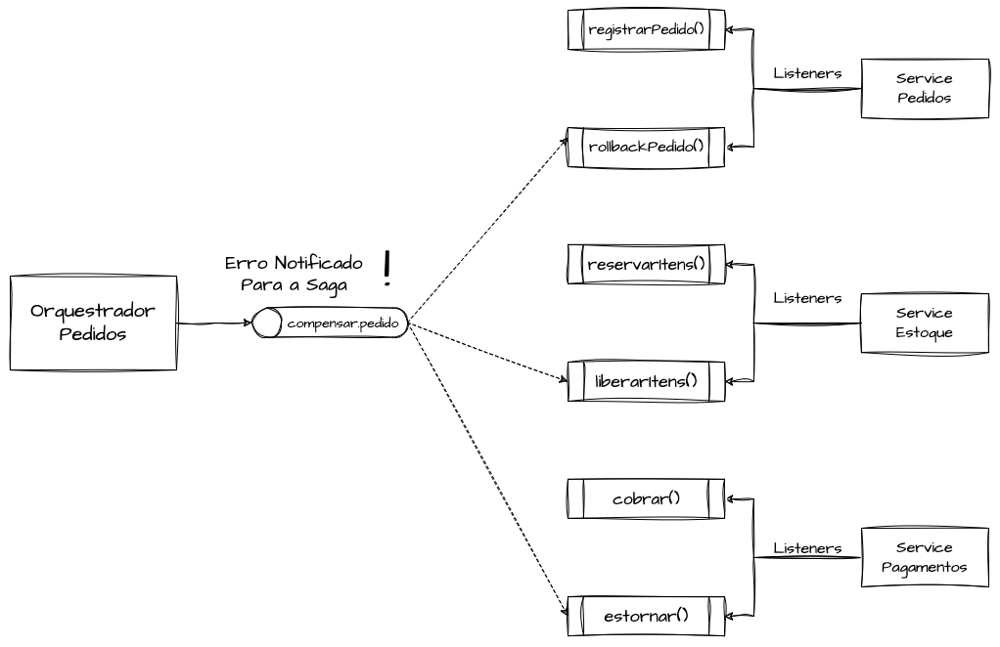

## Problemas de Dual Write em Transações Saga

O **Dual Write** é tanto um problema quanto um padrão clássico em arquiteturas distribuídas. Ele aparece quando uma operação precisa gravar dados em **dois lugares diferentes** — banco e cache, banco e API externa, duas APIs, ou banco e fila/tópico. Sempre que for necessário escrever de forma atômica em múltiplos pontos, estamos diante desse desafio.

Para ilustrar: se for preciso confirmar a operação em um destino, mas o outro estiver indisponível, a confirmação deixa de ser atômica, já que as duas escritas deveriam acontecer juntas para preservar a consistência.

No **modelo coreografado**, cada serviço executa localmente sua ação no banco e **publica um evento** para o próximo serviço continuar — esse é o caminho feliz, sem problemas de consistência.

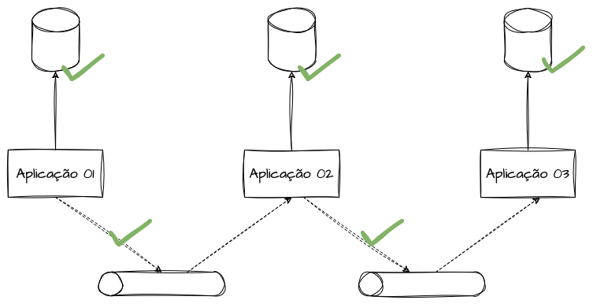

> [!NOTE]
> **Modelo Coreografado** - Exemplo de dual write

A inconsistência surge quando, por exemplo, o dado não é gravado no banco mas o evento é emitido; ou quando o dado é salvo corretamente, mas, por indisponibilidade do broker, o evento não sai. Em ambos os casos o sistema fica inconsistente.

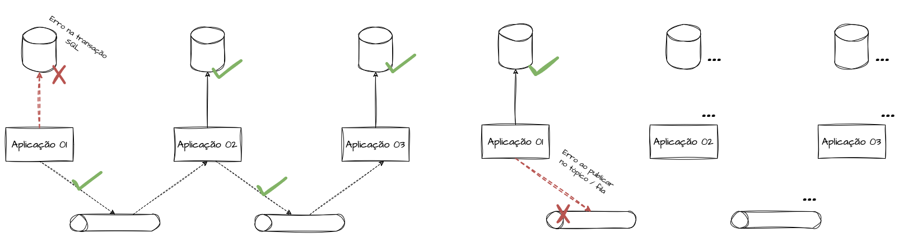

> [!NOTE]
> **Modelo Coreografado** - Exemplo de falha de dual write

No **modelo orquestrado**, o problema também ocorre, de forma um pouco diferente. Em um fluxo de comando e resposta, se um serviço falhar ao garantir a escrita dupla (entre suas dependências e o canal de resposta), pode surgir uma **saga perdida**, com etapas intermediárias "presas" por falta de confirmação.

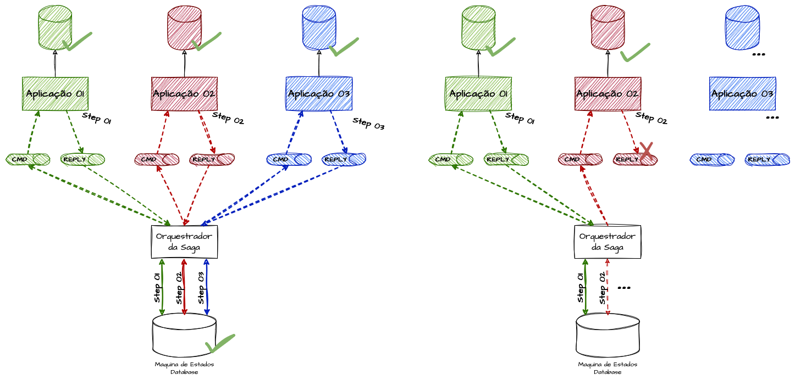

> [!NOTE]
> **Modelo Orquestrado** - Exemplo de falha de dual write

Garantir atomicidade em todos os passos é, provavelmente, a **maior complexidade** de uma implementação Saga. Os mecanismos de controle precisam tratar falhas com retentativas, supervisão de sagas e detecção daquelas iniciadas há muito tempo e ainda não concluídas. Em bancos ACID, uma alternativa eficiente é publicar o evento dentro de uma [transaction](https://fidelissauro.dev/teorema-cap/) e só commitar a alteração quando a comunicação for concluída — garantindo que tudo, ou nada, seja efetivado.

### Outbox Pattern e Change Data Capture em Transações Saga

O [Outbox Pattern](https://fidelissauro.dev/cqrs), já citado antes em outros contextos, pode aqui **atribuir caráter transacional à execução e ao controle dos steps da saga**. Um processo de relay, num modelo orquestrado, usa uma espécie de fila dentro do próprio banco para verificar quais steps estão pendentes e só os remove dessa "fila" quando todo o processamento do passo é confirmado.

Essa abordagem protege contra o Dual Write e reforça a resiliência da aplicação diante de indisponibilidades totais ou parciais de suas dependências.

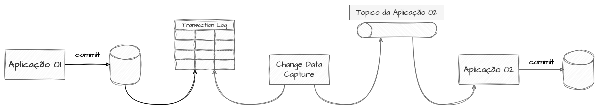

Mecanismos de **Change Data Capture** podem ser usados para transportar o dado ao sistema seguinte. Aplicável a ambas as variações arquiteturais, mas o controle pragmático e manual da execução, dos fallbacks e da lógica de negócio dos steps tende a ser mais indicado no padrão **orquestrado**, dada a própria finalidade do orquestrador.

### Two-Phase Commit em Transações Saga

Embora os exemplos do capítulo adotem orquestração assíncrona, é possível buscar **níveis de consistência em contextos síncronos**, típicos de uma abordagem cliente/servidor (request/reply).

O **Two-Phase Commit (2PC)** é um padrão conhecido para sistemas distribuídos. Ele propõe que, numa transação com vários participantes, um **coordenador** garanta que todos estejam "pré-confirmados" (prontos para gravar) antes de aplicar de fato as mudanças, confirmando em **duas fases**. Se algum participante não confirmar que está pronto, ninguém recebe o comando de **commit**. Além de microserviços, o padrão é bastante usado em estratégias de replicação.

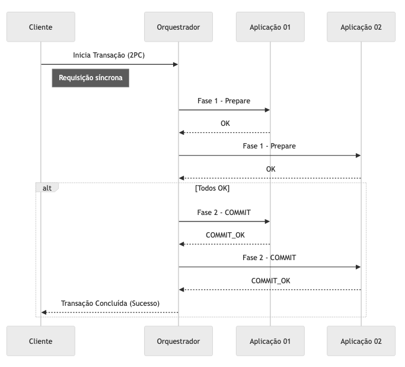

> [!NOTE]
> Two-Phase Commit executado com sucesso

O 2PC traz uma sensação de **atomicidade** aos serviços distribuídos, pois o coordenador solicita confirmação a cada participante antes do commit. Isso é valioso em sagas que exigem validação de todos os passos antes da conclusão — especialmente em cenários síncronos, em que o cliente espera resposta imediata e a operação pode ser abortada sem chance de compensar etapas já feitas.

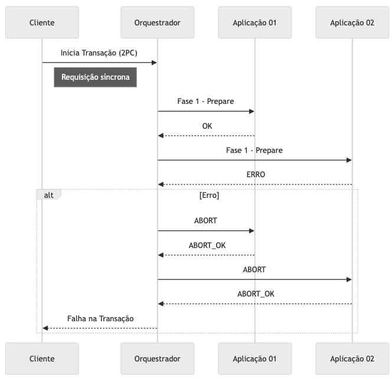

> [!NOTE]
> Two-Phase Commit executado com erro

Se algum serviço não responder com sucesso ou em tempo hábil, o coordenador **envia sinal de rollback** para que ninguém efetive as transações pendentes.

Por mais útil que seja, o 2PC pode virar **gargalo de performance** em alta demanda, por exigir múltiplas conexões abertas simultaneamente. Uma forma de otimizar é usar protocolos que facilitem long-live-connections, como o **gRPC**, que mantém conexões bidirecionais reaproveitáveis entre requisições.

## Mecanismos de Reinicialização de Saga

Mesmo com os diversos **"guard rails"** oferecidos pelo Saga, imprevistos sistêmicos podem gerar inconsistências de estado entre os serviços. Nesses casos, é preciso tomar **decisões de negócio**: optar por **compensações em massa** ou por alguma **estratégia de reinicialização da saga**.

Para reinicializar com segurança, é essencial que todos os serviços implementem **idempotência**, recebendo o mesmo comando várias vezes sem efeitos colaterais. Um serviço de reserva de quartos, por exemplo, ao receber repetidamente a mesma reserva para o mesmo quarto e usuário, deve aceitá-la sem sobrescrever o estado, respondendo sucesso. Isso facilita a ressincronização.

Quando a coordenação (orquestrada ou coreografada) recebe um estímulo para iniciar uma saga com **identificadores únicos** ou **chaves de idempotência** já existentes, ela pode reiniciar a saga por completo ou verificar quais etapas ficaram incompletas, **retomando a partir do ponto sem resposta** e assegurando a consistência.

  

# Referências

[SAGAS - Department of Computer Science Princeton University](https://www.cs.cornell.edu/andru/cs711/2002fa/reading/sagas.pdf)

[Saga distributed transactions pattern](https://learn.microsoft.com/en-us/azure/architecture/reference-architectures/saga/saga)

[Pattern: SAGA](https://microservices.io/patterns/data/saga.html)

[The Saga Pattern in a Reactive Microservices Environmen](https://www.scitepress.org/Papers/2019/79187/79187.pdf)

[Enhancing Saga Pattern for Distributed Transactions within a Microservices Architecture](https://www.mdpi.com/2076-3417/12/12/6242)

[Model: 8 types of sagas](https://tjenwellens.eu/everblog/ec936db8-ba4c-430b-aeb4-15d9c50c0f8c/)

[Saga Pattern in Microservices](https://www.baeldung.com/cs/saga-pattern-microservices)

[SAGA Pattern para microservices](https://dev.to/thiagosilva95/saga-pattern-para-microservices-2pb6)

[Saga Pattern — Um resumo com Caso de Uso (Pt-Br)](https://luanmds.medium.com/saga-pattern-um-resumo-com-caso-de-uso-pt-br-d534cec67625)

[Distributed Sagas: A Protocol for Coordinating Microservices](https://www.youtube.com/watch?v=0UTOLRTwOX0)

[What is a Saga in Microservices?](https://www.youtube.com/watch?v=0W8BtIwh824)

[Try-Confirm-Cancel (TCC) Protocol](https://blog.sofwancoder.com/try-confirm-cancel-tcc-protocol)

[Microservices Patterns: The Saga Pattern](https://medium.com/cloud-native-daily/microservices-patterns-part-04-saga-pattern-a7f85d8d4aa3)

[Compensating Actions, Part of a Complete Breakfast with Sagas](https://temporal.io/blog/compensating-actions-part-of-a-complete-breakfast-with-sagas)

[Getting started with small-step operational semantics](https://temporal.io/blog/getting-started-with-small-step-operational-semantics)

[Microserviços e o problema do Dual Write](https://arthurgregorio.eti.br/posts/dual-write-microservicos/)

[Solving the Dual-Write Problem: Effective Strategies for Atomic Updates Across Systems](https://www.confluent.io/blog/dual-write-problem/)

[Outbox Pattern(Saga): Transações distribuídas com microservices](https://medium.com/tonaserasa/outbox-pattern-saga-transa%C3%A7%C3%B5es-distribu%C3%ADdas-com-microservices-c9c294b7a045)

[Saga Orchestration for Microservices Using the Outbox Pattern](https://www.infoq.com/articles/saga-orchestration-outbox/)

[Martin Kleppmann - Distributed Systems 7.1: Two-phase commit](https://www.youtube.com/watch?v=-_rdWB9hN1c)

[Distributed Transactions & Two-phase Commit](https://medium.com/geekculture/distributed-transactions-two-phase-commit-c82752d69324)

[Try-Confirm-Cancel (TCC) Protocol](https://blog.sofwancoder.com/try-confirm-cancel-tcc-protocol)
