# System Design - Event Sourcing

- [System Design - Event Sourcing](#system-design---event-sourcing)
- [Definindo Event Sourcing](#definindo-event-sourcing)
- [Persistência Tradicional e Event Sourcing](#persistência-tradicional-e-event-sourcing)
- [Arquitetura Event-Sourcing](#arquitetura-event-sourcing)
  - [Agregados](#agregados)
  - [Event Store](#event-store)
  - [Event-Bus e Publishers](#event-bus-e-publishers)
  - [Projections e Modelos de Leitura](#projections-e-modelos-de-leitura)
    - [Projections e Read Models Transacionais](#projections-e-read-models-transacionais)
    - [Projections e Read Models Semi-Síncronos](#projections-e-read-models-semi-síncronos)
    - [Projections e Read Models Assíncronos](#projections-e-read-models-assíncronos)
- [Reconstituição de Estados e Rehydration](#reconstituição-de-estados-e-rehydration)
  - [Snapshotting](#snapshotting)
- [Versionamento e Garantias de Ordem em Consistência Eventual (Last-Write-Wins)](#versionamento-e-garantias-de-ordem-em-consistência-eventual-last-write-wins)
- [Idempotência em Domínios Complexos](#idempotência-em-domínios-complexos)
- [Referências](#referências)

> **Nota:** Este documento é um material de estudo baseado no artigo original
> **"System Design - Event Sourcing"**, de **Matheus Fidelis**, publicado em
> [fidelissauro.dev/event-sourcing](https://fidelissauro.dev/event-sourcing/).
> As ilustrações pertencem ao autor original. Recomenda-se a leitura do artigo
> completo na fonte.

---

# Definindo Event Sourcing

O Event Sourcing é um padrão arquitetural cuja ideia central é guardar, de forma
histórica e imutável, cada evento que muda o estado de uma entidade. Em vez de
manter apenas a "foto" atual do dado, ele preserva toda a trajetória de
mudanças, contando a "história" completa de uma transação ou entidade durante
todo o seu ciclo de vida.

Esse modelo brilha em domínios onde as entidades mudam de estado com frequência
— pagamentos, usuários, compras ou etapas de fabricação de um produto. Cada
alteração vira um registro permanente e auditável, formando um log cronológico
de fatos que pode ser inspecionado e recomposto. É um encaixe natural para
arquiteturas event-driven, que precisam emitir eventos continuamente e
reconstruir estados de maneira distribuída.

# Persistência Tradicional e Event Sourcing

Conforme os sistemas distribuídos ganham integrações e dependências mais
complexas, persistir apenas o "estado atual" de um registro começa a mostrar
limitações em termos de resiliência e recuperação de falhas. O modelo
tradicional opera sob o paradigma de *State Mutation*: a cada operação, o estado
anterior é sobrescrito. Ele responde bem a "como a entidade está agora", mas é
incapaz de explicar "como ela chegou até aqui".

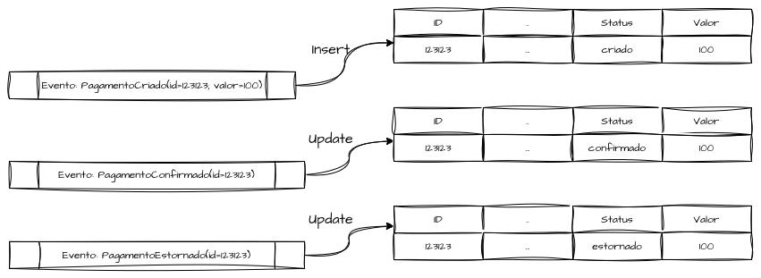

Como o estado é mutável por padrão, cada `INSERT`, `UPDATE` ou `DELETE` apaga a
informação anterior e, com ela, o histórico. Num sistema de pagamentos, por
exemplo, recebemos uma sequência de eventos de domínio que agem diretamente
sobre a entidade — mas o rastro desses eventos se perde.

O Event Sourcing propõe uma inversão conceitual: em vez de guardar o resultado
final de uma série de mutações, o sistema acumula uma sequência de eventos
imutáveis e deriva o estado atual a partir deles.

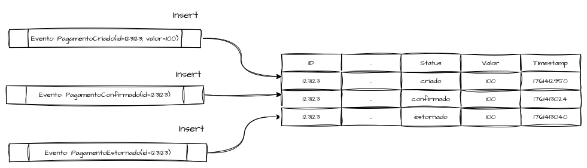

Cada operação passa a ser um fato imutável que diz que "algo aconteceu" e fica
registrado para sempre. O estado, então, deixa de ser a última atualização e
passa a ser uma sequência ordenada e temporal de eventos. Como toda operação é,
na prática, uma inserção, é preciso reaplicar os eventos para recuperar o último
estado — um *trade-off* conhecido que pressiona as leituras em cenários de alto
volume e exige otimizações avançadas. Bem aplicado, o padrão gera sistemas
auditáveis, reproduzíveis e reativos, mas cobra um nível elevado de maturidade
de engenharia para evitar gargalos e custos excessivos.

# Arquitetura Event-Sourcing

## Agregados

O agregado é a unidade lógica e transacional que reúne uma entidade e as regras
de negócio necessárias para manter sua consistência interna. É sobre ele que os
eventos são aplicados, validados, ordenados e evoluídos, de modo que o estado
final seja sempre fruto de uma sequência determinística de fatos no tempo.

Funcionando como uma fronteira de consistência, o agregado decide quais eventos
podem ocorrer, em que ordem e sob quais condições. Dentro dele, as mutações de
estado são convertidas em eventos imutáveis que mais tarde serão gravados no
Event Store e publicados no Event Bus — a fonte de dados primária de toda a
arquitetura.

## Event Store

O Event Store é o banco de dados central do Event Sourcing e deve ser tratado
como um *ledger* imutável. Sua função é armazenar o log de todos os eventos que
representam mudanças de estado das entidades, sempre respeitando uma ordem
temporal e absoluta.

Em vez de atualizar registros, a estrutura anexa um novo evento ao final do
fluxo (*stream*) associado a uma entidade ou agregado. Cada *stream* é, na
prática, a linha do tempo de uma transação. O Event Store não guarda o estado em
si, apenas a história completa dos fatos — por isso o ponto crítico ao projetar
essas soluções é garantir ordenação e atomicidade, para que a entidade possa ser
reconstruída reaplicando os eventos em sequência.

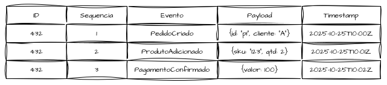

Ao reaplicar, por exemplo, os três eventos da transação 432, o estado é
reconstituído de forma fiel, chegando ao estado `pago` com dois produtos
associados ao cliente a. O modelo é análogo ao *append-only log* usado por
sistemas como Kafka ou por livros contábeis: os dados nunca são substituídos,
apenas acumulados.

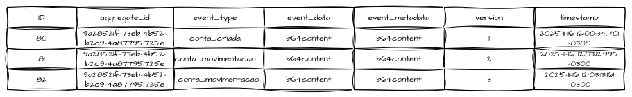

Modelar o Event Store de forma agnóstica ao tipo de operação é um requisito
obrigatório, o que costuma envolver campos livres ou *blobs* para guardar dados
e metadados do evento — úteis para replicação e reprocessamento — além de
índices que otimizam consultas transacionais e a recuperação de estados
históricos. Não é obrigatório usar bancos relacionais ou não relacionais
(embora seja o mais indicado); soluções como EventStoreDB e Apache Kafka também
servem, cada uma com seus *trade-offs* de flexibilidade na gestão dos dados.

## Event-Bus e Publishers

O Event Bus é o componente que permite que os eventos gerados dentro de um
domínio sejam publicados e propagados para outros domínios, sistemas e
subsistemas interessados nas mudanças de estado das entidades. Seu papel é
transportar esses eventos de forma desacoplada até os consumidores. Vale a
distinção: o Event Store é o registro de verdade — a *golden source* dos
eventos — enquanto o Event Bus é o meio de projeção das consequências desses
eventos.

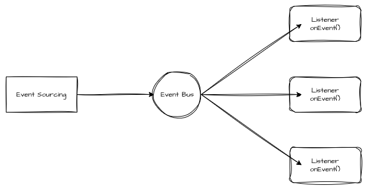

Os *publishers* são os componentes responsáveis por publicar, em tópicos, filas
ou barramentos, os eventos já confirmados no Event Store. Essa publicação deve
ser atômica: os eventos só vão ao Event Bus quando a gravação e demais operações
forem bem-sucedidas. O barramento pode ser implementado sobre Kafka, RabbitMQ,
SQS, NATS ou Pulsar, conforme o SLA e as garantias exigidas. Embora Event Bus e
Event Store não sejam obrigatórios no Event Sourcing, ambos facilitam muito
implementações de microsserviços orientados a eventos. Um bom Event Bus deve
preservar a ordenação por *stream* ou agregado, garantir entrega ao menos uma
vez, oferecer deduplicação e exigir idempotência nos consumidores para
reprocessamentos seguros.

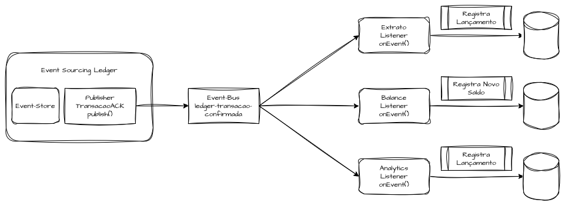

Um sistema pode possuir múltiplos barramentos, cada um transmitindo eventos de
domínio para consumidores específicos. Um Event Bus com características de
*ledger* distribuído — registrando historicamente tudo o que acontece em contas
bancárias ou livros caixa — pode emitir um evento como "Nova Conta Registrada"
para domínios que precisam montar previamente uma estrutura base de conta antes
de consumir eventos centrais, como uma transação, um saldo (*Balance*) ou um
extrato (*Statement*).

Quando os eventos de transações são emitidos, essas mensagens são repassadas a
outro barramento, encarregado de avisar os demais domínios. Isso permite compor
o saldo e registrar historicamente os lançamentos do extrato. Assim, é possível
notificar e recompor entidades inteiras em domínios que aplicam seu próprio
Event Sourcing ou persistência transacional, mantendo a arquitetura orientada a
eventos eventualmente consistente.

## Projections e Modelos de Leitura

Os Event Stores são otimizados para grandes volumes de escrita e, por isso,
costumam ser pouco eficientes para consultas — os bancos principais devem conter
apenas os logs dos fatos. Para alimentar APIs e consultas sistêmicas, precisamos
construir modelos voltados especificamente à leitura. Como eventos são, por
definição, ações já ocorridas, as *projections* são os processos que
interpretam esses fatos e os transformam em algo consultável.

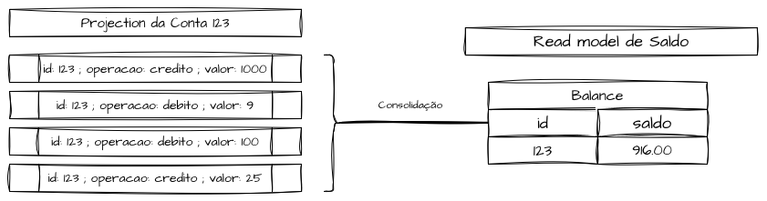

Em essência, uma *projection* "ouve" os eventos do Event Store, consolida vários
eventos de uma mesma entidade e materializa uma visão derivada otimizada para
leitura. Essa visão é o *Read Model*, que pode, sim, ser construído sob a ótica
de *State Mutation*.

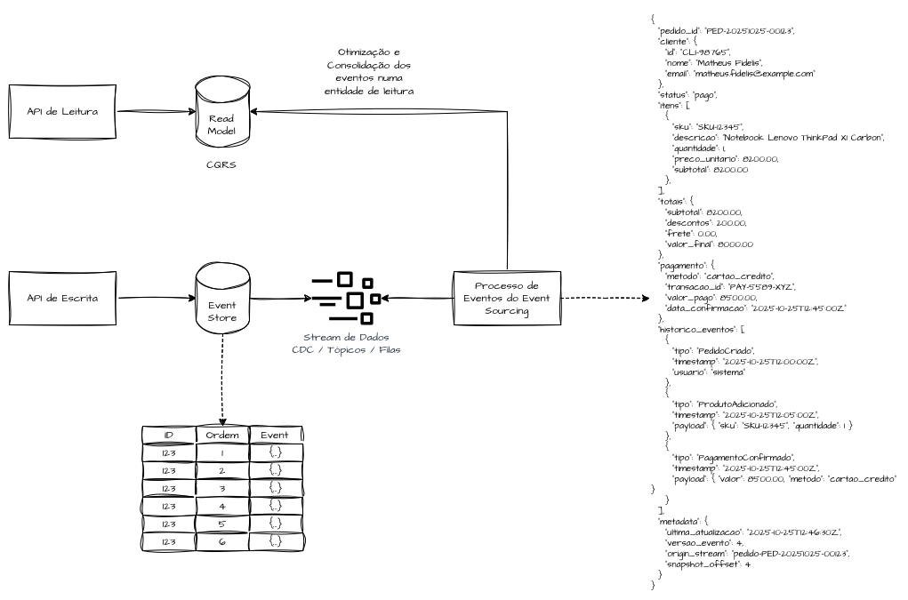

As *projections* costumam seguir o padrão CQRS (*Command-Query Responsibility
Segregation*), portando — de forma síncrona ou assíncrona — um modelo otimizado
para escrita rumo a outro otimizado para leitura. Nos *Read Models* podemos usar
bancos em memória para respostas rápidas, bancos de documentos para buscas
textuais ou modelos relacionais e não relacionais para relatórios consolidados.
É importante frisar: eles não são meros caches, mas representações
materializadas de fatos históricos registrados no Event Store, devendo evoluir
junto com o domínio e a semântica dos eventos.

Diferentemente do Event Store, as *projections* são determinísticas em relação
ao estado atual. Qualquer *replay* de eventos — em reprocessamentos temporais —
deve refletir também nelas, para que continuem representando o estado vigente.
Em sistemas maiores, várias *projections* coexistem (analytics, relatórios,
dashboards, filas, catálogos). Seguindo boas práticas de reprocessamento e
elasticidade, os *Read Models* distribuídos tornam-se efêmeros e descartáveis,
podendo ser reconstruídos a qualquer momento.

### Projections e Read Models Transacionais

No modelo transacional, pequenas *projections* podem ser agrupadas de forma
atômica dentro do próprio banco do Event Store. Como o Event Store é otimizado
para escrita intensiva, e não para leitura, concentrar muitas operações numa
única transação pode gerar gargalos e forçar escalabilidade vertical de
aplicações e bancos quando a carga é alta.

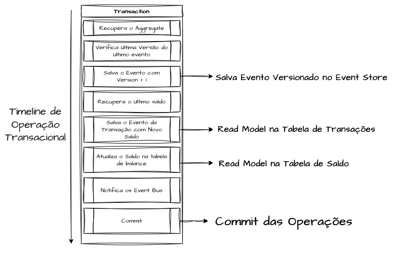

Aqui a prioridade é preservar atomicidade e consistência imediata: dentro de uma
mesma transação, persistem-se tanto o evento quanto a projeção derivada. O grande
ganho é eliminar a latência entre escrita e leitura, garantindo consistência
imediata para valores que não toleram divergência. Em contrapartida, soma-se
complexidade operacional e mais carga ao Event Store, que pode virar gargalo em
alta volumetria. Para mitigar, é comum aplicar o padrão *Transactional Outbox*,
em que o evento é escrito junto da projeção na mesma transação, mas publicado
depois de forma assíncrona — preservando atomicidade sem travar o *throughput* e
servindo de ponte para o modelo semi-síncrono.

### Projections e Read Models Semi-Síncronos

O propósito inicial do Event Sourcing é oferecer uma fonte segura e confiável de
dados transacionais, passível de reconstituição e replicação. Mesmo que algumas
*Read Models* nasçam dentro do Event Store de forma atômica, idealmente elas
devem ser encaminhadas a aplicações dedicadas a tratá-las e otimizá-las para
leitura, reduzindo qualquer operação que comprometa a capacidade reservada à
escrita e à confiabilidade.

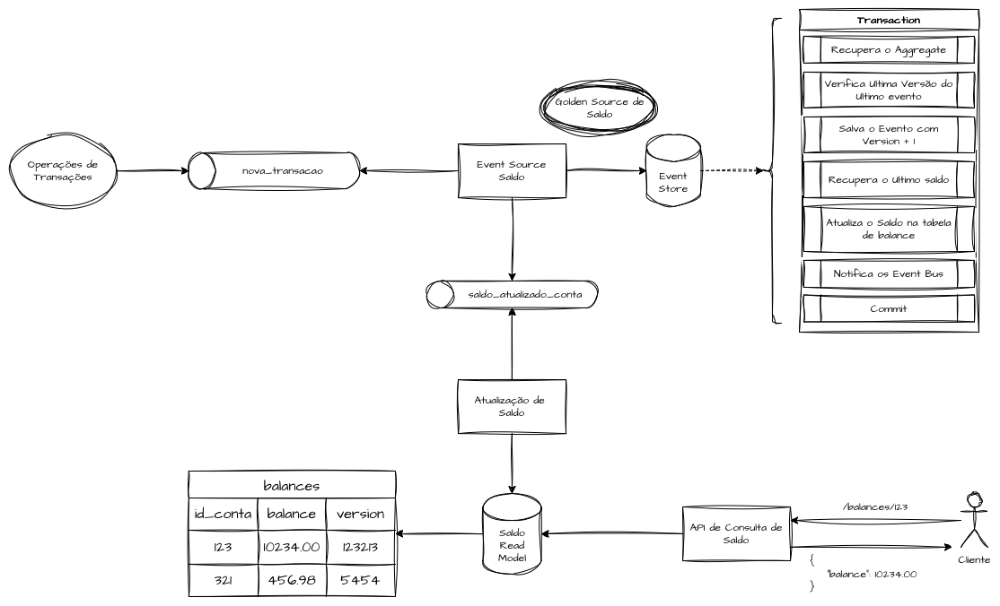

A ideia é aproveitar a afinidade transacional do Event Store como uma "golden
source atômica", atualizando as *Read Models* de forma assíncrona e eventual.
Mantém-se, então, duas fontes do mesmo dado: uma voltada à persistência e
confiabilidade, outra otimizada para consulta — ideal para grandes volumes.
Operações de saldo, por exemplo, precisam de exclusão mútua e atomicidade para
evitar inconsistências; elas podem rodar dentro do Event Store e, a cada
transação, o novo saldo é calculado atomicamente e publicado no Event Bus, onde
um *Read Model* otimizado o consome para exposição em alto volume. Assim, o
Event Store é a fonte de verdade e o *Read Model*, o estado derivado seguro —
modelo que só deve ser adotado quando se pode operar com otimismo entre os níveis
de consistência.

### Projections e Read Models Assíncronos

Quando o sistema tolera consistência eventual, os dados registrados no Event
Sourcing podem ser encaminhados via Event Bus para que cada domínio interessado
construa seus próprios *Read Models*, removendo qualquer complexidade adicional
do Event Store.

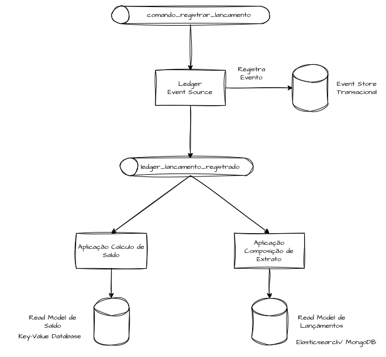

Com isso, o *capacity* do Event Store fica dedicado exclusivamente a registrar,
confirmar e repassar os logs temporais, garantindo sequencialidade atômica. Os
modelos de leitura são construídos de forma totalmente desacoplada, ao custo de
um aumento computacional significativo em cada reconstrução, já que é necessário
reenviar os logs completos para reconstituição. Em suma, eliminamos a
complexidade e a demanda computacional do motor de eventos, transferindo-as para
cada aplicação e domínio que trata os dados de forma agnóstica.

# Reconstituição de Estados e Rehydration

A reconstituição de estado de um agregado — popularmente chamada de
*Rehydration* — é o processo de usar os logs sequenciais do Event Store para
reconstruir o estado de entidades e operações, dentro e fora do domínio
principal. Idealmente, o Event Store deve oferecer ferramentas que permitam
reprocessar todos os registros em ordem, reaplicando os eventos de cada
entidade. Esse processo é central ao Event Sourcing e permite que a história
contada pelos logs seja recontada.

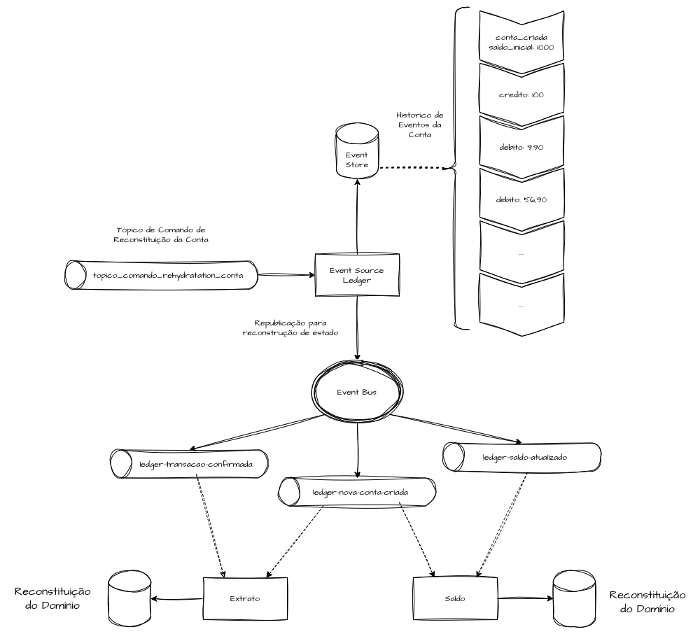

Imagine um Event Store que registra todas as transações de crédito e débito e
publica esses eventos a outros domínios (saldo, extrato), os quais expõem *Read
Models* sumarizados. Se um desses domínios sofrer alguma inconsistência —
sistêmica ou manual — e perder dados, a aplicação de Event Sourcing deve
conseguir reaplicar todos os eventos e reenviá-los em sequência ao Event Bus.
Assim, os domínios subsequentes se reconstituem a partir dos dados temporais,
recalculam o saldo atual ou reconstroem as visualizações de lançamentos. Essa
estratégia é especialmente valiosa em domínios que exigem rastreabilidade e
reconstituições auditáveis, como cadeias farmacêuticas, linhas de fabricação,
aplicação de descontos, prontuários médicos e fechamentos contábeis.

## Snapshotting

O modelo transacional pede que todas as operações de estado sejam armazenadas
para auditoria e recomposição ao longo do tempo. Em uma conta bancária, por
exemplo, é fácil saber o saldo atual, mas o detalhe é justamente reter a trilha
de eventos — depósitos, saques, transferências e estornos — que juntos
construíram esse estado. Em domínios onde auditabilidade, rastreabilidade ou
causalidade importam, perder esse histórico é um problema sério. O contraponto é
que reconstruir o estado completo fica caro à medida que a base de eventos
cresce, e é aí que entra o *Snapshotting*.

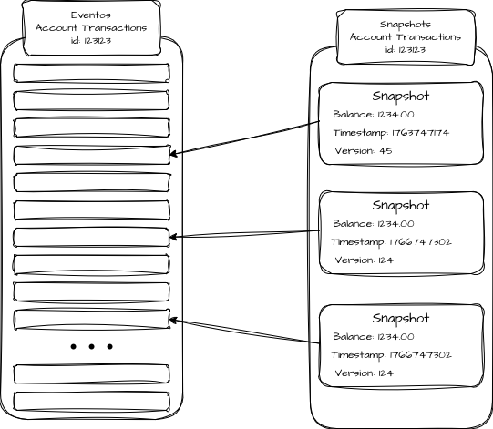

O *Snapshotting* é uma técnica de otimização que cria "pontos de restauração"
intermediários — fotografias do estado — para reconstruí-lo de forma incremental,
sem recalcular tudo a cada operação. Um snapshot guarda o estado de um agregado
em um dado momento, junto do índice do último evento aplicado. Assim, ao
"reidratar", o sistema parte do snapshot e processa apenas os eventos
posteriores. Por exemplo, se a entidade "Saldo" do agregado "Conta" tiver
1.000.000 de eventos, gerar um snapshot a cada 10.000 eventos permite carregar o
último e aplicar somente o que veio depois, reduzindo bastante o custo de
leitura. Ainda assim, snapshots devem ser tratados como artefatos derivados e
descartáveis: o Event Store permanece como *single source of truth* e os
snapshots são apenas mecanismos auxiliares de performance.

# Versionamento e Garantias de Ordem em Consistência Eventual (Last-Write-Wins)

Sempre que precisamos reidratar um ou mais agregados, os domínios consumidores
desses eventos devem atender a certos critérios para que o resultado final seja
consistente. Dentro do Event Sourcing, o Event Store precisa garantir a
ordenação local dos eventos de um mesmo agregado — todos os eventos de uma
entidade devem ser aplicados na sequência temporal em que ocorreram. É essa
ordenação local que torna a reconstrução de estados determinística.

No nível do Event Bus, porém, embora a publicação possa acontecer na ordem dos
eventos, a ordem de consumo não é globalmente garantida por padrão. Eventos
publicados em ordem podem chegar fora de ordem em réplicas ou sistemas
diferentes, sofrendo variações no tempo de processamento. Em arquiteturas
event-driven, isso não é falha: é o comportamento esperado da consistência
eventual.

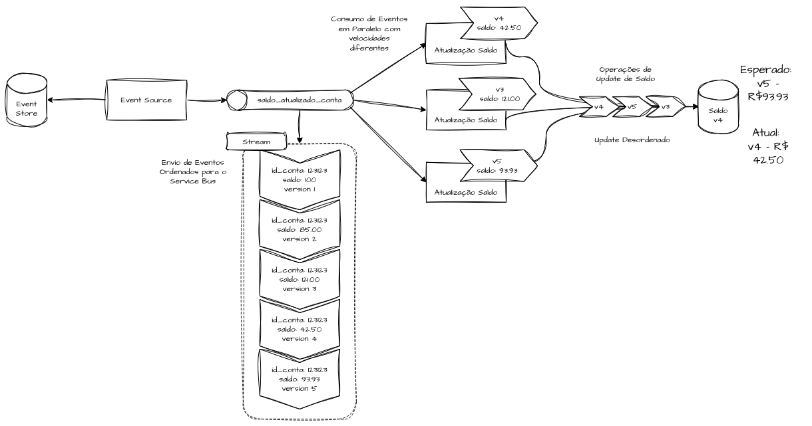

Em uma operação de saldo, várias transações podem atualizar o saldo de um cliente
em curto intervalo; todas entram de forma temporal e atômica no Event Store e
são publicadas sequencialmente no Event Bus. Mas o consumo nos clientes finais
pode ocorrer em paralelo e fora de ordem, gerando uma *Read Model* incorreta se
um evento mais novo for processado antes de um mais antigo. Nesse cenário, o
*Last-Write-Wins* (LWW) é uma forma simples de lidar com conflitos de escrita ou
reprocessamentos duplicados: diante de eventos concorrentes para o mesmo
agregado, prevalece o último evento válido por *timestamp* ou *version*.

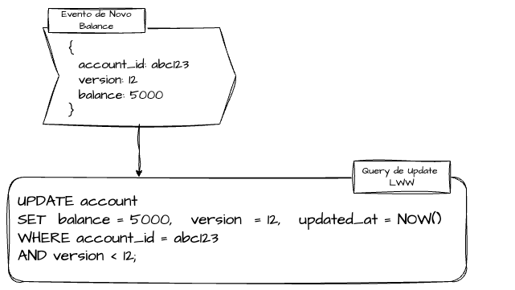

Cada evento deve carregar um `id` único e uma `version` incremental, usados na
comparação de versões — o que evita duplicações em sistemas subjacentes e permite
evoluir o *stream* com segurança. O mesmo pode ser feito com *timestamps* Unix,
indicando a ordem temporal direta. Os consumidores devem checar constantemente a
versão do evento contra o estado já persistido para evitar sobrescritas
indevidas, seja de forma transacional com condicionais em código, seja por meio
de escritas condicionais em bancos que suportem essa operação.

# Idempotência em Domínios Complexos

Idempotência é a propriedade que permite executar uma operação várias vezes sem
alterar o resultado final. Em sistemas centralizados, isso costuma ser garantido
por transações ACID. Já em arquiteturas distribuídas, onde os eventos se propagam
de forma assíncrona e cada serviço mantém sua própria consistência, a
idempotência precisa ser projetada explícita e cuidadosamente.

Em sistemas distribuídos baseados em eventos, a idempotência é um requisito
fundamental para operar arquiteturas complexas com segurança. A entrega e o
processamento de eventos são inerentemente não determinísticos: podem ocorrer em
duplicidade, sofrer *race conditions* ocasionais ou falhar e precisar reiniciar,
o que reforça a necessidade de evitar esforço computacional redundante.

No Event Sourcing, podemos decidir reprocessar todos os eventos de um período
para recompor projeções e notificações de forma histórica. Para que isso funcione
tanto no domínio principal quanto nos adjacentes, é preciso garantir idempotência
distribuída e controle de versão dos eventos, assegurando que eventos já
processados não gerem efeitos colaterais ou resultados inconsistentes. Todos os
domínios *downstream* devem fazer checagens e manter chaves de idempotência
fortes e consistentes o tempo todo.

# Referências

- [Github: Event Source Distributed Ledger](https://github.com/msfidelis/event-source-distributed-ledger)
- [Event Sourcing](https://martinfowler.com/eaaDev/EventSourcing.html)
- [Event sourcing pattern](https://docs.aws.amazon.com/prescriptive-guidance/latest/cloud-design-patterns/event-sourcing.html)
- [Eventsourcing e EventStore, Projeções, Snapshots](https://medium.com/@rvf.vazquez/eventsourcing-e-eventstore-proje%C3%A7%C3%B5es-snapshots-97b964a220d)
- [Event store](https://en.wikipedia.org/wiki/Event_store)
- [Explorando o EventStore – Overview](https://israelaece.com/2016/04/28/explorando-o-eventstore-overview/)
- [Event Bus & Event Store](https://docs.axoniq.io/axon-framework-reference/4.11/events/infrastructure/)
- [How to Create a Event Bus in Go](https://leapcell.medium.com/how-to-create-a-event-bus-in-go-d7919b59a584)
- [Implementing event-based communication between microservices (integration events)](https://learn.microsoft.com/en-us/dotnet/architecture/microservices/multi-container-microservice-net-applications/integration-event-based-microservice-communications)
- [Guide to Projections and Read Models in Event-Driven Architecture](https://event-driven.io/en/projections_and_read_models_in_event_driven_architecture/)
