# System Design - Padrões de Resiliência

- [System Design - Padrões de Resiliência](#system-design---padrões-de-resiliência)
- [Definindo Resiliência](#definindo-resiliência)
  - [Resiliência e Disponibilidade](#resiliência-e-disponibilidade)
  - [Métricas de Resiliência e Disponibilidade](#métricas-de-resiliência-e-disponibilidade)
    - [Métrica de Disponibilidade de Uso](#métrica-de-disponibilidade-de-uso)
    - [Métrica de Disponibilidade de Uptime](#métrica-de-disponibilidade-de-uptime)
  - [Blast Radius](#blast-radius)
  - [Estratégias e Patterns de Resiliência](#estratégias-e-patterns-de-resiliência)
  - [Replicação de Serviços, Balanceamento de Carga e Healthchecks](#replicação-de-serviços-balanceamento-de-carga-e-healthchecks)
  - [Idempotência](#idempotência)
    - [Chaves de Idempotência](#chaves-de-idempotência)
  - [Timeouts](#timeouts)
  - [Estratégias de Retry (Retentativas)](#estratégias-de-retry-retentativas)
    - [Retries Imediatos em Memória](#retries-imediatos-em-memória)
    - [Retries Assíncronos](#retries-assíncronos)
    - [Retries com Backoff Exponencial](#retries-com-backoff-exponencial)
    - [Retries com Estratégias de Jitter](#retries-com-estratégias-de-jitter)
  - [Circuit Breakers](#circuit-breakers)
  - [Throttling e Rate Limiting](#throttling-e-rate-limiting)
  - [Padrões de Fallback](#padrões-de-fallback)
    - [Exemplo: Fallback Sistêmico por Redundância](#exemplo-fallback-sistêmico-por-redundância)
    - [Exemplo: Fallback com Snapshot de Dados](#exemplo-fallback-com-snapshot-de-dados)
    - [Exemplo: Fallback com Fluxos Assíncronos](#exemplo-fallback-com-fluxos-assíncronos)
    - [Exemplo: Fallback Contratual](#exemplo-fallback-contratual)
    - [Acionamento de Fallback Proativo](#acionamento-de-fallback-proativo)
  - [Graceful Degradation](#graceful-degradation)
  - [Backpressure como Resiliência](#backpressure-como-resiliência)
  - [Resiliência na Camada de Dados](#resiliência-na-camada-de-dados)
    - [Read-Write Splitting](#read-write-splitting)
    - [Caching de Dados como Resiliência](#caching-de-dados-como-resiliência)
  - [Sharding e Particionamento de Clientes em Resiliência](#sharding-e-particionamento-de-clientes-em-resiliência)
  - [Bulkhead Pattern](#bulkhead-pattern)
  - [Lease Pattern](#lease-pattern)
- [Referências](#referências)

> **Nota:** Este documento é um material de estudo baseado no artigo original **"System Design - Padrões de Resiliência"**, de **Matheus Fidelis**, publicado em [fidelissauro.dev/resiliencia](https://fidelissauro.dev/resiliencia/). As ilustrações pertencem ao autor original. Recomenda-se a leitura do artigo completo na fonte.

---

Este capítulo funciona como uma grande revisão: retoma quase todos os assuntos já estudados e antecipa alguns que ainda virão, mas observando-os sob a lente da resiliência. Os conceitos em si continuam os mesmos; o que muda é a perspectiva. Para quem quer maior profundidade em cada tema, vale revisitar os capítulos anteriores.

A proposta central é exercitar a capacidade de pegar um conceito já compreendido e remodelá-lo para diferentes pontos de vista — aqui, o ponto de vista é o de manter sistemas operando diante de falhas, sem que isso descaracterize o propósito original de cada padrão.

# Definindo Resiliência

Resiliência é a capacidade de sistemas, processos e componentes resistirem a uma variedade de cenários de falha e seguirem operando, integral ou parcialmente. É um conceito transversal a várias disciplinas de engenharia, sempre voltado a elevar a eficiência e a segurança operacional das funcionalidades e das jornadas dos usuários. Em última análise, tudo que é construído com qualidade pode ser entendido como uma prática de resiliência.

Na rotina de times responsáveis por funcionalidades críticas, a ideia se traduz de forma simples: quando um ponto qualquer do sistema falha, ele precisa ter mecanismos para contornar a situação e reduzir ao mínimo o impacto sobre o funcionamento geral.

## Resiliência e Disponibilidade

Embora caminhem juntos, resiliência e disponibilidade não são sinônimos. Disponibilidade pode ser medida de duas formas: quantas requisições enviadas ao sistema foram atendidas com sucesso, ou quanto tempo o sistema permaneceu indisponível em um período.

Resiliência, por outro lado, é o conjunto de estratégias usadas para sustentar essa disponibilidade. Quanto mais robustos forem esses mecanismos, mais tolerante a falhas será o sistema e maior será sua disponibilidade percebida pelos usuários. O capítulo percorre diversos mecanismos de resiliência, em boa parte revisitando padrões já vistos com foco específico nesse objetivo.

## Métricas de Resiliência e Disponibilidade

Há um conjunto amplo de métricas para avaliar disponibilidade e resiliência, várias delas já discutidas em capítulos anteriores, especialmente no de Performance, Capacidade e Escalabilidade. Aqui destacam-se duas abordagens complementares de medição.

### Métrica de Disponibilidade de Uso

A forma mais comum mede a disponibilidade a partir do uso real do sistema, tomando como base a taxa de erros. Basta dividir o número de erros ocorridos no período pelo total de requisições (somando sucessos e falhas) e multiplicar por cem, obtendo a porcentagem de chamadas que não responderam como esperado.

No exemplo do artigo, uma API que recebe 1000 requisições em uma hora e registra 40 erros de servidor tem 4% de taxa de erros. Subtraindo esse valor de 100%, chega-se a 96% de disponibilidade no período. Essa abordagem é especialmente útil em sistemas com uso variável, em que medir disponibilidade por tempo não seria prático.

### Métrica de Disponibilidade de Uptime

O modelo mais tradicional considera o tempo em que o sistema esteve operacional — o uptime ou tempo de atividade. A indisponibilidade pode ser total ou parcial, e o tempo gasto até resolver um incidente é descontado do cálculo. Calcula-se o tempo operacional subtraindo do tempo total a soma de todos os períodos de downtime, e em seguida divide-se esse valor pelo tempo total.

No exemplo, um mês de cerca de 43.200 minutos com 180 minutos de downtime resulta em 43.020 minutos operacionais, ou seja, 99,58% de uptime. É a métrica típica de status pages e de SLAs de data centers e clouds, indicada quando não dá para medir disponibilidade diretamente pelo uso.

## Blast Radius

Blast Radius é um conceito de origem militar que descreve as zonas afetadas pelo impacto de uma explosão em determinada região, estimando quais áreas sofreriam com fogo, deslocamento de ar ou radiação.

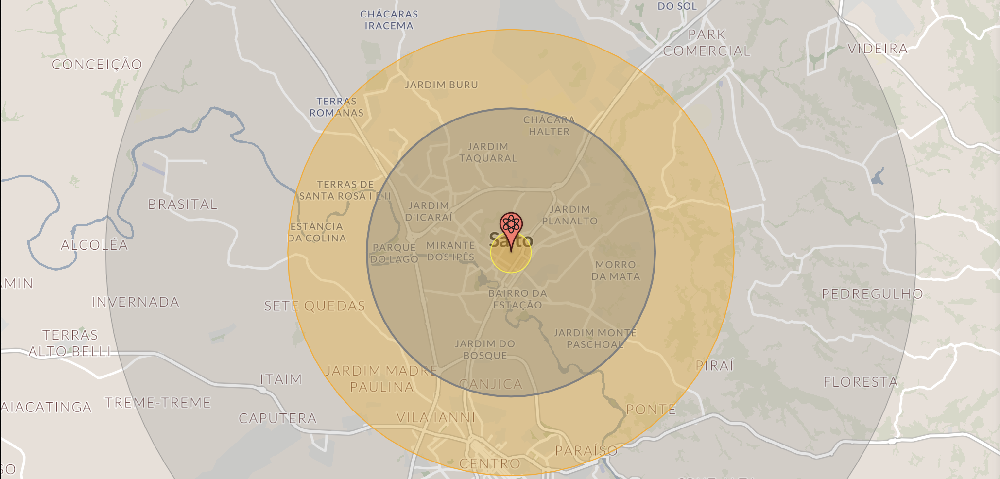

Aplicado à arquitetura de sistemas e à engenharia de confiabilidade, o termo serve para estimar o impacto da falha de um componente em um sistema distribuído, identificando pontos críticos e oportunidades de melhoria. A prática recomendada é provocar essa reflexão por meio de simulações de falha e de perguntas diretas em revisões arquiteturais — do tipo "se o componente X parar, o que acontece? O que continua funcionando? Em quanto tempo me recupero? Isso gera inconsistências?". O autor defende que esse tipo de questionamento seja feito sempre que possível, em um ambiente seguro e sem cerimônia, por ser uma das maneiras mais eficientes de partir do zero rumo a melhorias concretas de resiliência.

## Estratégias e Patterns de Resiliência

A partir daqui, o capítulo cataloga as principais estratégias e padrões que ajudam a contornar falhas e a adicionar diferentes níveis de resiliência. A ideia é expandir a "caixa de ferramentas" arquitetural, reaproveitando conceitos já apresentados, agora sob a ótica de disponibilidade e tolerância a falhas.

## Replicação de Serviços, Balanceamento de Carga e Healthchecks

A estratégia mais simples e fundamental é revisitar balanceamento de carga e escalabilidade horizontal. Distribuir e escalar a carga é, talvez, o que mais reflete resiliência e desempenho no curto prazo, especialmente quando o balanceamento opera junto com auto-scaling, adicionando e removendo réplicas sob demanda.

As aplicações, qualquer que seja o protocolo, devem expor URLs de healthcheck que reflitam seu estado por meio de códigos de resposta monitoráveis.

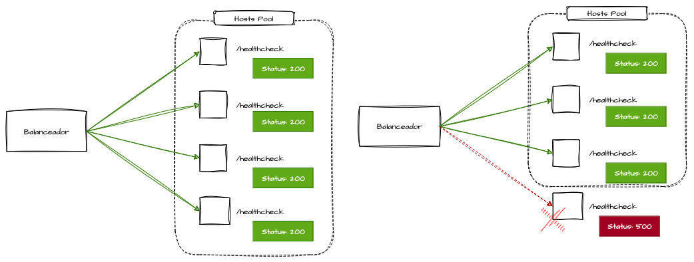

Os balanceadores verificam essas URLs periodicamente para liberar ou restringir tráfego às réplicas: se uma réplica passa a responder com erro ou estoura o tempo limite, deve ser considerada inativa e retirada do pool. Assim, garante-se o paralelismo externo das requisições síncronas, maximizando o uso de recursos e reduzindo a chance de falhas graves causadas pela indisponibilidade de um único host.

## Idempotência

Idempotência é provavelmente o passo mais importante para construir sistemas resilientes em ambientes distribuídos, pois habilita com segurança várias outras estratégias. O conceito deve funcionar bem independentemente do modelo ou protocolo: o objetivo é permitir que a mesma operação seja executada diversas vezes produzindo sempre o mesmo resultado, sem efeitos indesejados como duplicidades.

Essa propriedade é o que torna seguro repetir uma solicitação diante de falhas de rede, quedas de réplicas, manutenções programadas ou intermitências, permitindo sincronizar domínios e recuperar respostas que não chegaram.

### Chaves de Idempotência

Para garantir que uma requisição não seja duplicada, o controle se apoia em dados específicos que identifiquem a requisição, o comando ou a intenção de domínio. Esse identificador é a chamada chave de idempotência, verificada e armazenada antes do processamento.

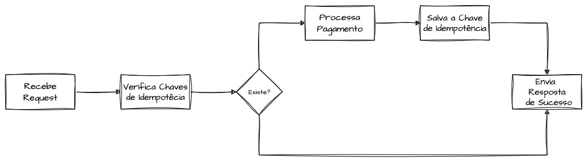

No exemplo de uma API de pagamentos, o cliente envia, em cabeçalhos ou parâmetros, uma chave única que pode ser gerada por ele ou derivada de valores da própria requisição. Se a cobrança for reenviada por causa de uma falha, a operação idempotente assegura que o valor seja debitado uma única vez. Sem esse controle, o cliente poderia ser cobrado várias vezes, gerando inconsistências financeiras graves.

## Timeouts

Timeouts definem um tempo limite para operações, funcionando como mecanismo preventivo contra chamadas que travam por longos períodos. Podem interromper processos tanto no cliente quanto no servidor e permitem detectar e contornar erros rapidamente, evitando que conexões fiquem abertas indefinidamente durante a degradação de uma dependência — o que poderia provocar falhas em cascata por sobrecarga.

Em sistemas resilientes, é desejável falhar rápido e acionar fallbacks o quanto antes; timeouts bem configurados tornam isso viável, geralmente por meio de parametrizações simples em bibliotecas. O artigo destaca três tipos: o Connection Timeout, que limita o tempo para estabelecer a conexão entre cliente e servidor (comum em conexões TCP com bancos sobrecarregados); o Timeout de Leitura e Escrita, que limita a espera por envio ou recebimento de dados depois de a conexão já existir; e o Idle Timeout, que encerra conexões ociosas para liberar recursos.

## Estratégias de Retry (Retentativas)

Retries são o ato de refazer uma requisição diante da falha de uma dependência. Como o balanceamento, é uma estratégia simples com benefícios de curto prazo, e todas as suas variações compartilham o mesmo princípio: superar indisponibilidades temporárias, falhas ocasionais e intermitências de rede ou de dependências.

Independentemente do modelo adotado, é essencial que os retries sejam implementados de forma criteriosa e que os serviços alvo possuam idempotência sólida, para que repetir a requisição não gere efeitos adversos ou duplicidades.

### Retries Imediatos em Memória

São executados em memória, normalmente na mesma thread da tentativa original. É o tipo mais simples, comum em clientes HTTP configuráveis e bibliotecas de consumo de serviços. A lógica define um número máximo de tentativas sequenciais, reenviando a requisição até obter uma resposta válida — útil, por exemplo, em chamadas gRPC sujeitas a intermitências.

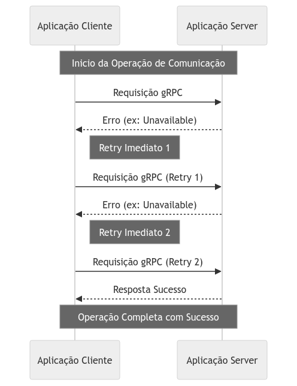

É crucial dimensionar bem o número máximo de tentativas, pois retentativas excessivas podem agravar a indisponibilidade da dependência. Apesar das limitações — operar só em memória (perdendo as tentativas se o runtime cair) e executar de forma sequencial e imediata (o que pode criar gargalos momentâneos) —, essa abordagem resolve a maior parte dos casos.

### Retries Assíncronos

Implementar retentativas por meio de processos assíncronos é uma das formas mais eficientes, já que o próprio desacoplamento da comunicação assíncrona adiciona resiliência. Um caso é o de requisições que começam síncronas mas terminam assíncronas: o sistema pode trocar o status definitivo (por exemplo, responder `202 Accepted` em vez de `201 Created`) para indicar que a operação será concluída e re-tentada sem o cliente precisar esperar.

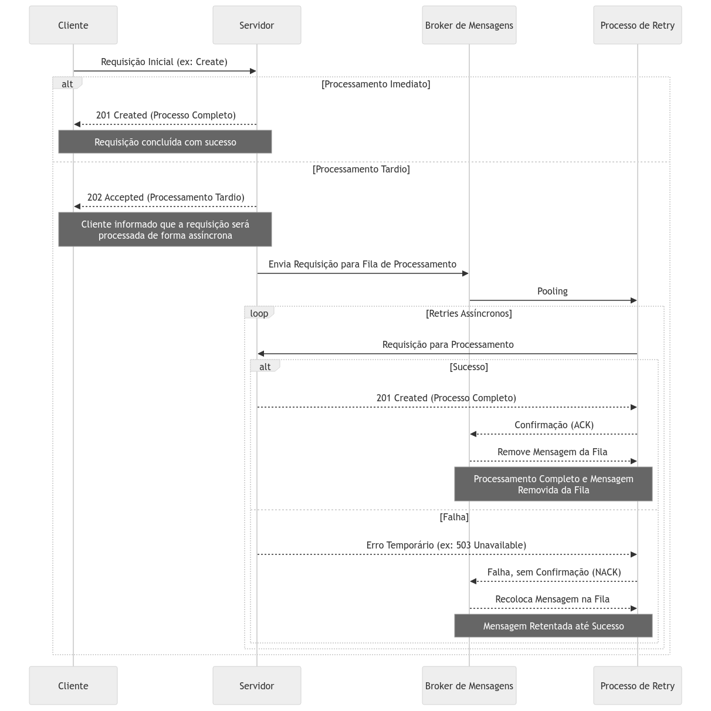

Quando aplicável, isso funciona como um ótimo fallback para o fluxo principal, armazenando requisições que falharam durante uma indisponibilidade para completá-las depois. Outra variação ocorre em fluxos naturalmente assíncronos, que começam e terminam dentro de brokers de mensagens: o produtor publica a mensagem e conta com mecanismos de retentativa, recebendo a resposta apenas após o processamento.

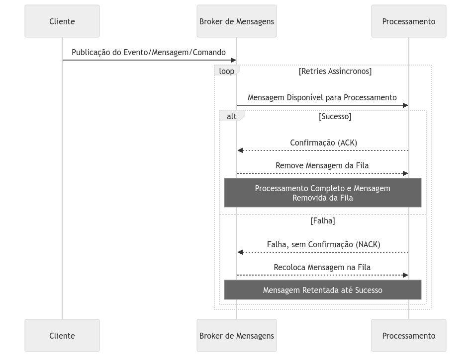

Aqui as requisições são enfileiradas em uma fila ou tópico consumido por um componente especializado em re-tentar e retomar o fluxo. Como os brokers costumam oferecer retentativas nativas — reenfileirando mensagens quando não recebem o `ack` —, a abordagem se torna muito robusta, ainda que exija mais componentes e complexidade.

### Retries com Backoff Exponencial

Em vez de retentativas em intervalos fixos, o backoff exponencial aumenta o tempo de espera entre tentativas de forma progressiva (1 s, 2 s, 4 s, 8 s, 16 s e assim por diante), aliviando a pressão sobre o sistema alvo e reduzindo o risco de sobrecarga provocada por muitas tentativas simultâneas.

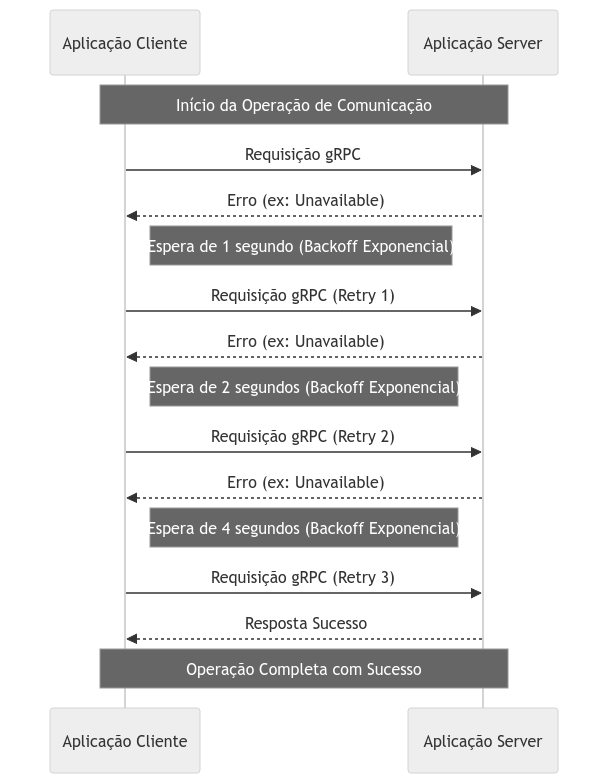

A técnica vale tanto para fluxos síncronos quanto assíncronos, é simples de implementar em clientes de comunicação e tem suporte nativo em muitos brokers. É uma evolução natural das estratégias de retry e fortemente recomendada sempre que possível.

### Retries com Estratégias de Jitter

O jitter é uma evolução do backoff exponencial: introduz intervalos aleatórios entre as retentativas, dispersando-as ainda mais e reduzindo o risco de gargalos. É especialmente útil em cenários de alto tráfego, em que muitas retentativas tendem a disparar ao mesmo tempo durante uma falha.

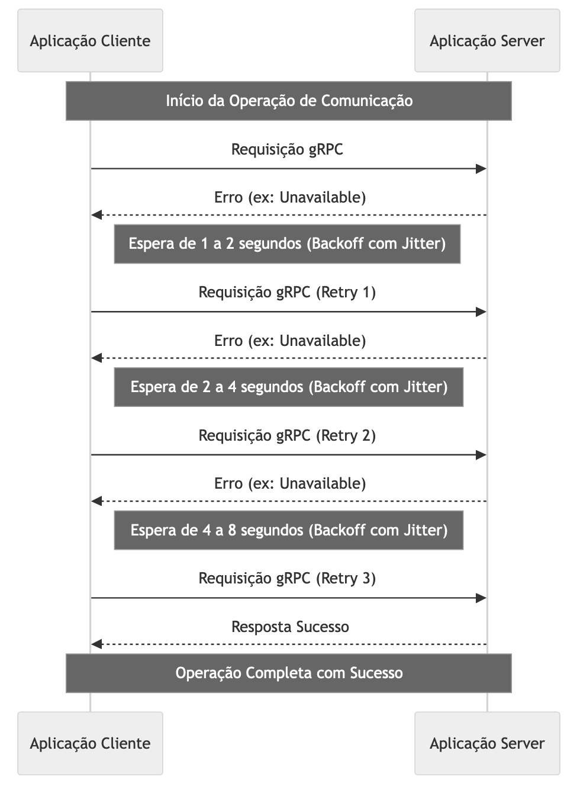

Há várias formas de aplicá-lo: uma simples atribui a cada tentativa um valor aleatório entre zero e o tempo máximo de backoff; também é possível usar jitter incremental, em que as faixas crescem a cada tentativa (por exemplo, de 0 a 4 s, depois de 2 a 6 s, e assim por diante). Em qualquer modelo, o objetivo é espalhar o volume de retentativas para que elas não agravem o problema existente.

## Circuit Breakers

O Circuit Breaker é um padrão projetado para proteger serviços de sobrecarga e impedir que falhas isoladas evoluam para falhas em cascata. A metáfora é a de um disjuntor elétrico, que "desarma" e interrompe o fluxo de chamadas para um componente quando detecta um alto número de falhas.

A implementação costuma envolver três estados. No estado fechado (inicial), todas as requisições passam normalmente e o circuito monitora continuamente as respostas.

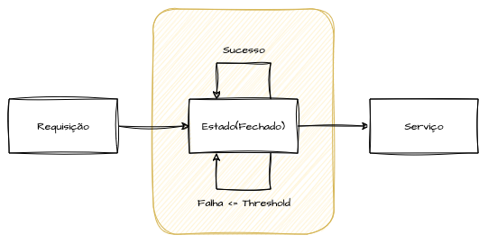

Quando limites de tempo de espera ou de erros são ultrapassados, o circuito vai para o estado aberto, bloqueando as comunicações com a dependência para não sobrecarregar recursos já comprometidos.

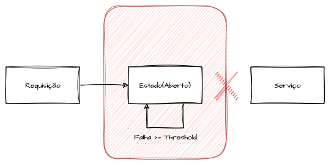

Após um período de resfriamento, dando tempo para o serviço se recuperar, o circuito passa ao estado semiaberto, em que um número limitado de requisições é liberado de forma controlada. Se forem bem-sucedidas, ele volta ao estado fechado; caso contrário, retorna ao aberto até o próximo ciclo.

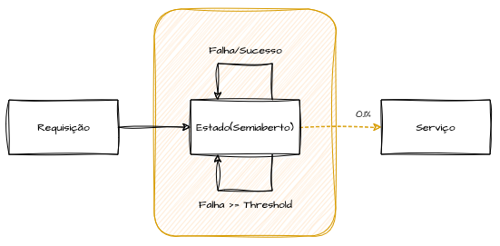

Esse padrão é central em sistemas distribuídos por conter o impacto de falhas temporárias. Há quem o associe apenas a um "erro rápido", mas é possível avançar e implementar verificações proativas de estado para acionar fallbacks sem depender de exceções, redirecionando automaticamente as requisições para fluxos alternativos — uma extensão que enriquece bastante a arquitetura de resiliência.

## Throttling e Rate Limiting

Throttling e rate limiting são tratados em profundidade no capítulo de API Gateways. Sob a ótica da resiliência, ambos controlam o fluxo de requisições e o consumo de recursos — em gateways ou em outros componentes — para evitar sobrecarga e assegurar que a infraestrutura suporte a demanda sem perder desempenho.

O rate limiting define o número máximo de requisições permitidas em um intervalo (por exemplo, 100 por minuto, 10 por segundo ou 1 milhão por mês). Ao ser excedido, as políticas de throttling entram em ação, rejeitando ou atrasando as requisições adicionais e retornando uma resposta que indica o limite atingido. Podem ser usados isolados ou em conjunto, e uma boa implementação exige que a engenharia conheça bem os pontos de limitação dos sistemas, normalmente definidos por testes de carga e estresse.

## Padrões de Fallback

Fallbacks são padrões variados que permitem que a aplicação continue operando — de forma completa, parcial ou degradada — quando algo falha. A ideia é oferecer rotas alternativas para alcançar o mesmo objetivo, ainda que sacrificando desempenho, tempo, consistência, custo ou funcionalidades.

Quase todos os conceitos do capítulo podem acionar ou atuar como fallback. Os exemplos a seguir são ilustrativos e não devem limitar a criatividade na hora de desenhar esses fluxos.

### Exemplo: Fallback Sistêmico por Redundância

É o modelo mais básico: acionar pragmaticamente um fluxo secundário quando o principal falha. O exemplo clássico é o de um e-commerce com um gateway de pagamento primário e outro secundário em prontidão.

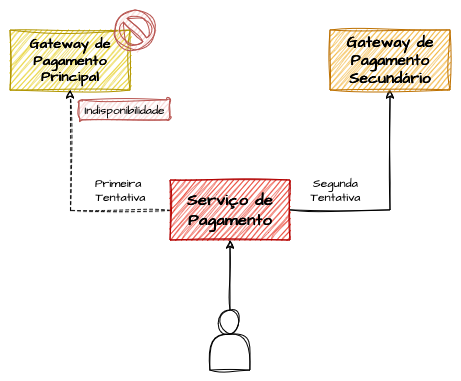

Diante de indisponibilidade temporária ou programada do gateway principal, os pagamentos são redirecionados para o secundário até o serviço se restabelecer. Apesar de simples, o exemplo demonstra o funcionamento do mecanismo e serve de base para combinar os demais padrões em soluções de alta disponibilidade.

### Exemplo: Fallback com Snapshot de Dados

O capítulo dedica uma seção específica a fallback na camada de dados, mas aqui ilustra o conceito com a consulta de um dado quase em tempo real, como o limite de crédito de um cartão. Em uma falha, a instituição precisa escolher entre bloquear todas as transações ou aprovar compras assumindo algum risco.

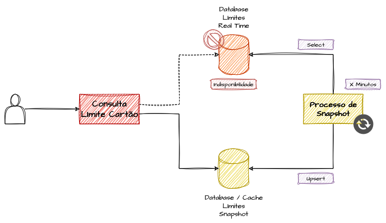

A solução proposta para o segundo caminho é manter snapshots atualizados periodicamente em cache ou em um banco mais acessível, permitindo checagens simplificadas quando o dado "quente" não está disponível. Troca-se consistência forte por consistência eventual e aceita-se um risco calculado de aprovar algumas transações além do limite, em troca de manter o sistema operando.

### Exemplo: Fallback com Fluxos Assíncronos

Outro fallback é oferecer uma alternativa de mensageria para fluxos que normalmente exigem resposta imediata, substituindo consistência forte por consistência eventual em caso de falha. A essência é a capacidade de transformar um fluxo síncrono em assíncrono quando necessário.

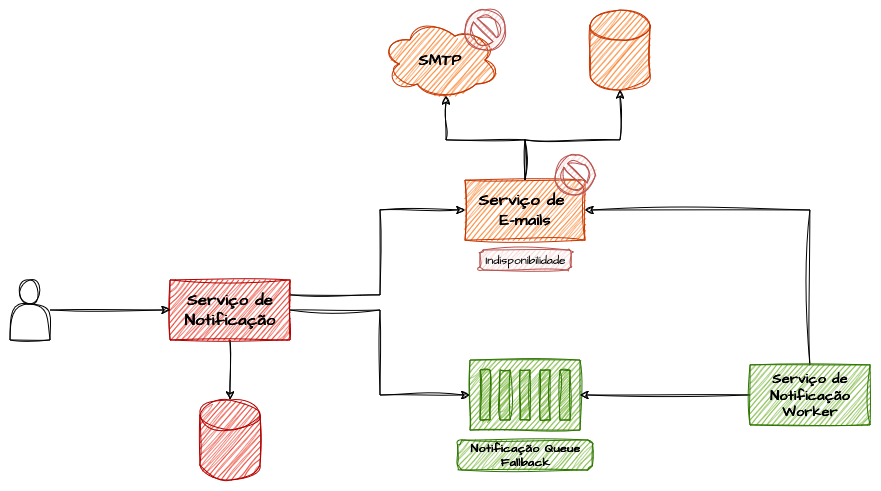

*Fallback Sync/Async*

No exemplo, uma API interna que dispara envios de e-mail aos clientes pode, diante da falha de um banco ou de um servidor SMTP, enviar a solicitação para uma fila em vez de retornar erro. A mensagem é reprocessada repetidas vezes até o serviço se restabelecer, concluindo a operação assim que a disponibilidade voltar — aceitável porque atrasos ocasionais nesse tipo de notificação não representam problema significativo.

### Exemplo: Fallback Contratual

Imagine um parceiro que oferece consulta de endereço/CEP e cálculo de frete a R$ 0,03 por consulta, sendo a primeira opção pelo melhor custo-benefício, e um segundo parceiro com as mesmas funcionalidades, porém com limitações e custo mais alto, em torno de R$ 0,10 por consulta.

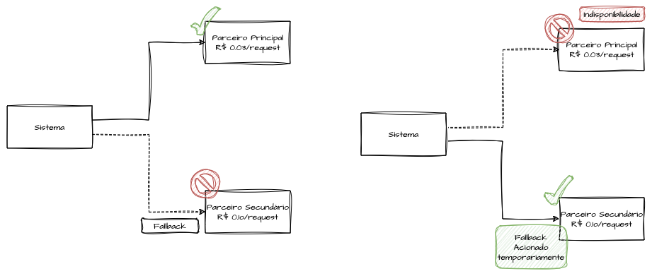

Mesmo não sendo o mais vantajoso financeiramente, esse segundo parceiro é um fallback contratual válido: em caso de falha do principal, a integração é temporariamente redirecionada para ele, garantindo a continuidade do serviço até a opção primária voltar a operar.

### Acionamento de Fallback Proativo

Acionar fallbacks de forma reativa, em resposta a erros, já é valioso, mas é possível ir além e validar regularmente a qualidade e a estabilidade desses caminhos alternativos, não apenas em momentos de crise.

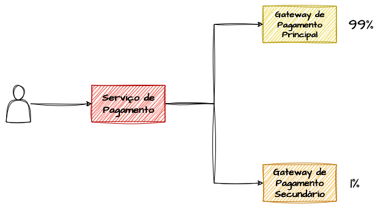

É comum que fallbacks raramente exercitados se transformem em pontos de falha quando ativados de repente. Para mitigar isso, direciona-se proativamente uma porcentagem mínima de tráfego para esses fluxos — via injeção de falhas ou roteamento intencional —, mantendo-os saudáveis e prontos para atuar quando realmente forem necessários.

## Graceful Degradation

Graceful Degradation é a capacidade de o sistema continuar operando suas funcionalidades essenciais mesmo quando partes significativas estão degradadas, sobrecarregadas ou indisponíveis. Está ligado ao conceito de fallback, mas pode ser acionado pragmaticamente ou por meio de feature toggles. Diante de um pico de tráfego, o sistema prioriza o que é principal e desativa o restante, operando apenas com o necessário.

A diferença em relação ao fallback é o caráter preventivo e intencional: enquanto fallbacks entram em ação após a falha, a degradação graciosa é deliberada e, ao detectar condições adversas, reduz automaticamente as funcionalidades a um nível mínimo de operação, concentrando-se nos fluxos prioritários.

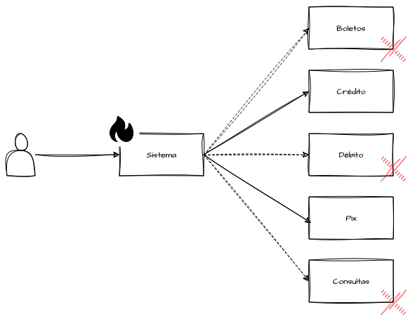

No exemplo, um gateway que oferece PIX, crédito, débito, boletos e consulta de transações pode, em momentos de alta demanda, desativar temporariamente débito, boletos e consulta — definidos como secundários — para direcionar recursos a PIX e crédito, que concentram o maior volume de uso.

## Backpressure como Resiliência

Ao adotar fluxos assíncronos, normalmente se pressupõe lidar com throughput elevado, escalando o processamento de grandes volumes com paralelismo externo de forma mais eficiente do que com chamadas síncronas e bloqueantes. O ciclo de vida dessas transações pode ser híbrido, mas fluxos intensivos de I/O podem provocar indisponibilidade repentina em sistemas downstream.

Visto antes como uma "força contrária" que cria gargalo no fluxo, o backpressure, quando ativo e intencional, permite desacelerar a produção ou a integração com outros serviços — reduzindo o ritmo de consumo ou enfileirando o processamento em memória — para proteger componentes downstream. Em resumo, ele emite sinais ativos de degradação e desaceleração, preservando os componentes posteriores e evitando picos de latência ou falhas em cascata.

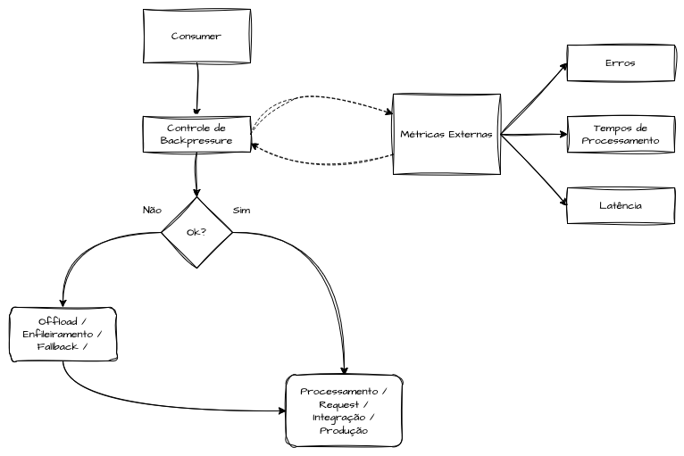

Essas implementações podem se basear em métricas de observabilidade: ao detectar latências crescentes, aumento de erros ou filas internas acima de thresholds, o adaptador aciona um feedback loop que desacelera chamadas externas ou redireciona tráfego para fallbacks e filas de offload — atuando como um circuito de segurança antes que a capacidade se esgote e reduzindo o blast radius de picos inesperados.

Uma abordagem mais avançada integra o backpressure ao monitoramento de SLIs e error budgets, das aplicações e de suas dependências. Se o error budget de um endpoint crítico se aproxima do limite, o sistema pode reduzir proativamente a taxa de ingestão e processamento para priorizar a estabilidade da malha de serviços, alinhando a resiliência técnica a metas de continuidade do negócio. Algumas implementações de Service Mesh permitem aplicar essas políticas de forma agnóstica à aplicação, simplificando a adoção em todo o ecossistema de microsserviços.

## Resiliência na Camada de Dados

Dados formam a camada mais difícil de escalar e de tornar tolerante a falhas. Garantir resiliência aqui simplifica consideravelmente a adoção dos demais padrões. Esta seção reúne diversos cenários já apresentados, dado que o tema é o foco central do livro.

### Read-Write Splitting

Segregar operações de escrita e de leitura em instâncias distintas de banco de dados traz, além de ganho de performance, mecanismos naturais de fallback.

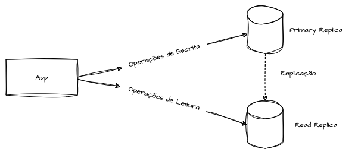

O uso de réplicas de leitura é amplamente adotado: as escritas ocorrem em uma instância principal, enquanto consultas, relatórios e acessos básicos vão para réplicas, dispersando o gargalo de I/O.

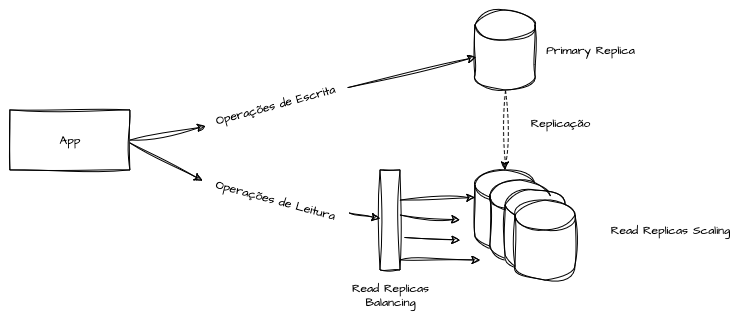

Em clouds públicas, dá para escalar horizontalmente o número de réplicas para atender picos e facilitar recuperação. O fallback entre réplicas de leitura é trivial, ao contrário da instância de escrita, que costuma ser o ponto único de inserções e atualizações.

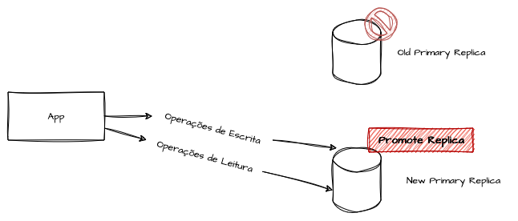

Um recurso valioso é a promoção de uma réplica de leitura (ou de uma instância de stand-by) a instância principal de escrita caso esta falhe. Essa prática eleva bastante a tolerância a falhas na camada de dados e é recomendada em arquiteturas resilientes.

### Caching de Dados como Resiliência

Os padrões de cache são versáteis e visam criar cópias mais performáticas e econômicas de dados, sejam de backend, de dependências externas, de bancos relacionais ou não relacionais, ou de conteúdo estático de front-end. Por manter versões dos dados em locais de acesso mais rápido e barato, o cache também atua como mecanismo de resiliência em relação à fonte original.

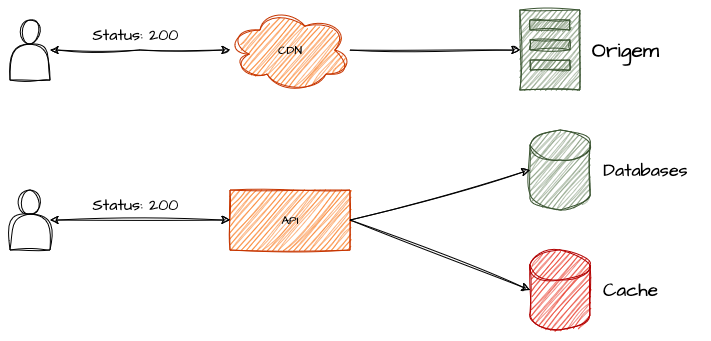

Consultar o cache em vez da origem reduz drasticamente os acessos ao backend ou ao banco, aumentando performance e diminuindo a carga sobre a camada de dados — efeito valioso em picos de demanda. É possível ainda projetar políticas de expiração e fallback que permitam ao cache suprir a indisponibilidade total da fonte. O autor recomenda revisitar padrões como Write-Behind, Write-Through, Lazy Loading e cache distribuído sob essa perspectiva.

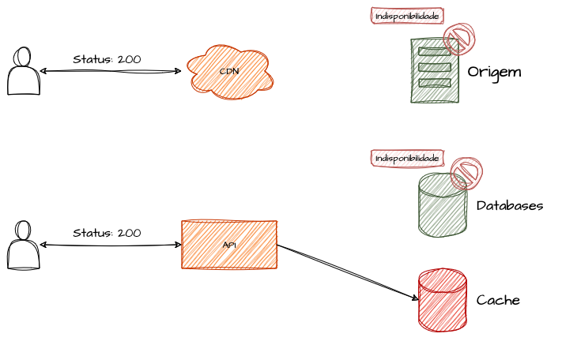

Quando cache e fonte original são mantidos sincronizados nas mesmas versões, ambas as camadas tornam-se altamente redundantes. Uma CDN bem configurada, por exemplo, pode sustentar longas indisponibilidades dos servidores de origem em front-ends, enquanto caches inteligentes permitem que o sistema continue operando total, parcial ou minimamente, conforme os critérios definidos.

## Sharding e Particionamento de Clientes em Resiliência

"Não colocar todos os ovos na mesma cesta" é a analogia perfeita para o sharding. Segregar um grande conjunto de dados em grupos menores é, por si só, intuitivo no contexto de resiliência, e dividir domínios — mesmo os já fragmentados em microsserviços — mostra-se um caminho evolutivo eficaz em cenários de alta demanda e missão crítica.

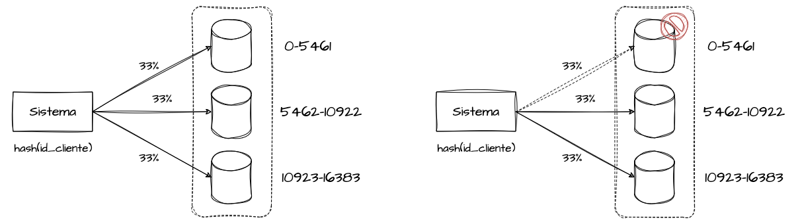

Particionar dados e cargas de trabalho em dimensões significativas — clientes, lojas ou tenants — de modo a isolar cada fragmento em um único shard permite testar funcionalidades com controle granular, sem propagá-las a todos os clientes, ainda que possa gerar partições quentes ocasionais. Esse isolamento reduz o blast radius dos componentes de cada shard, elevando a resiliência geral.

## Bulkhead Pattern

O Bulkhead se relaciona fortemente a sharding, hashing consistente, arquitetura celular e estabilidade estática. O nome vem do transporte marítimo, em que os compartimentos de um navio são isolados de forma que um dano em uma seção não afunde as demais.

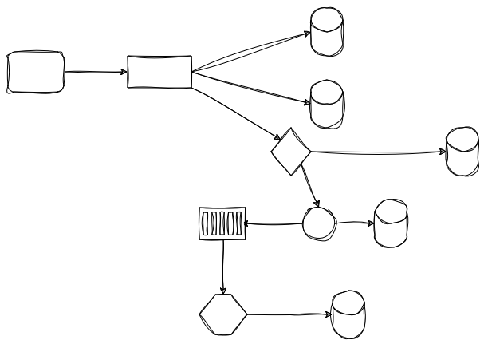

Como evolução do sharding — que está mais associado a dados —, o Bulkhead estende o particionamento para componentes de infraestrutura. O objetivo é isolar recursos específicos para funcionalidades distintas: pools de conexão, bancos de dados, balanceadores, versões de uma mesma aplicação, prioridades de requisição e segmentação de clientes.

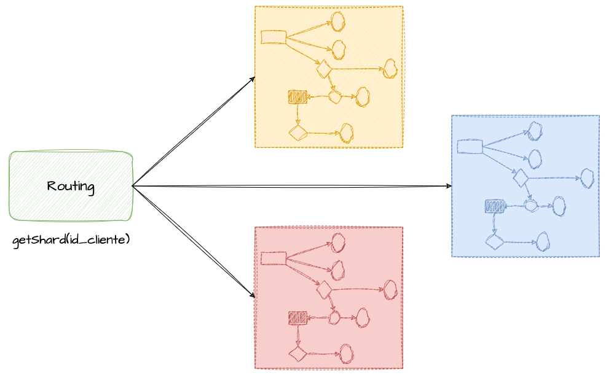

Distribuindo os clientes uniformemente em N bulkheads, o blast radius de uma falha em um compartimento fica limitado a 1/N dos clientes: 10 bulkheads limitam o impacto a 10%, 100 a 1% e 1.000 a 0,1%. Uma versão mais drástica isola todas as dependências de um domínio — microsserviços, bancos, caches e até arquivos — em bulkheads independentes, estratégia adotada em soluções multi-tenant baseadas em federação ou em arquiteturas celulares.

## Lease Pattern

O Lease Pattern, ou "arrendamento", define concessões temporárias ou prazos de validade para o uso e a alocação de recursos, como pools de conexão, tokens de acesso, alocação de consumo de mensagens e conexões persistentes entre clientes e servidores. Evita que sistemas de alto volume fiquem sobrecarregados por recursos ociosos, garantindo que operações ativas não sejam bloqueadas por alocações expiradas.

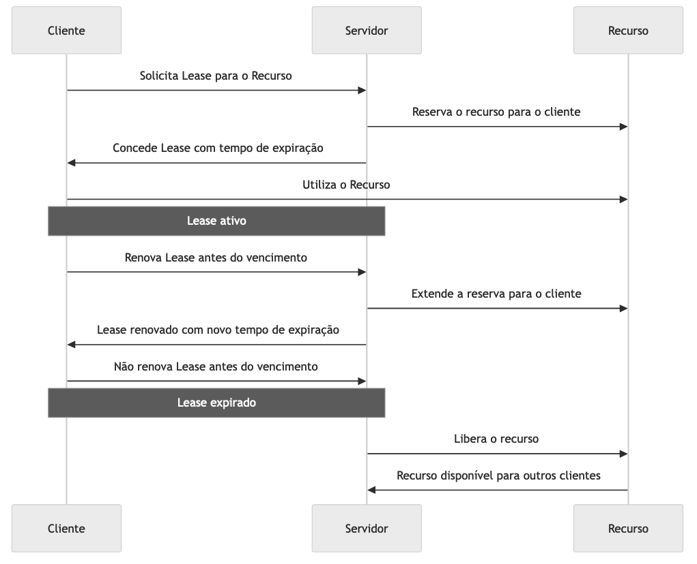

O leasing acontece quando um recurso inicia uma conexão com uma dependência — um consumidor Kafka conectando-se a uma partição, uma conexão persistente a um banco ou uma chamada gRPC com limite de conexões simultâneas. O servidor concede a alocação com prazo de validade ou tempo máximo de inatividade, e o cliente deve renovar o lease para indicar que segue ativo; se não renovar, o lease expira e o recurso é liberado para outro processo.

Em pools de conexão a bancos, cada cliente ou thread recebe um lease para uma conexão. Sem renovação por heartbeat ou liberação explícita ao fim do uso, o lease expira e a conexão volta ao pool, impedindo que recursos sejam monopolizados por clientes inativos. Esse mecanismo é fundamental em bancos transacionais, onde o número de conexões simultâneas é limitado e, ultrapassado o teto, novas solicitações são rejeitadas até haver leases disponíveis.

# Referências

[Best practices for retry pattern](https://harish-bhattbhatt.medium.com/best-practices-for-retry-pattern-f29d47cd5117)

[Retrying and Exponential Backoff: Smart Strategies for Robust Software](https://www.pullrequest.com/blog/retrying-and-exponential-backoff-smart-strategies-for-robust-software/)

[Tempos limite, novas tentativas e retirada com jitter](https://aws.amazon.com/pt/builders-library/timeouts-retries-and-backoff-with-jitter/)

[Better Retries with Exponential Backoff and Jitter](https://www.baeldung.com/resilience4j-backoff-jitter)

[NukeMap](https://nuclearsecrecy.com/nukemap/)

[How To Minimize Your Cloud Breach Blast Radius](https://sonraisecurity.com/blog/how-to-determine-blast-radius/)

[Guidance for Cell-Based Architecture on AWS](https://aws.amazon.com/pt/solutions/guidance/cell-based-architecture-on-aws/?did=sl_card&trk=sl_card)

[Terraform Module Blast Radius: Methods for Resilient IaC in Platform Engineering](https://www.firefly.ai/blog/terraform-module-blast-radius-methods-for-resilient-iac-in-platform-engineering)

[Circuit Breaker](https://martinfowler.com/bliki/CircuitBreaker.html)

[Pattern: Circuit Breaker](https://microservices.io/patterns/reliability/circuit-breaker.html)

[What is Fallback?](https://botpenguin.com/glossary/fallback)

[Bulkhead Pattern — Distributed Design Pattern](https://medium.com/nerd-for-tech/bulkhead-pattern-distributed-design-pattern-c673d5e81523)

[Bulkhead Pattern](https://www.geeksforgeeks.org/bulkhead-pattern/)

[Bulkhead pattern](https://learn.microsoft.com/en-us/azure/architecture/patterns/bulkhead)

[Como a estabilidade estática aumenta a resiliência da sua aplicação](https://medium.com/@robisson/como-a-estabilidade-est%C3%A1tica-aumenta-a-resili%C3%AAncia-da-sua-aplica%C3%A7%C3%A3o-2558247f27fa)

[Microservices - Resilience](https://badia-kharroubi.gitbooks.io/microservices-architecture/content/patterns/communication-patterns/bulkhead-pattern.html)

[Efficient Scalability and Concurrency implementing the Lease Management as a Locking Pattern](https://adria-arquimbau.medium.com/efficient-scalability-and-concurrency-implementing-the-lease-pattern-with-azure-storage-accounts-698dfe56458a)

[Leasing - Prashant Jain & Michael Kircher](https://hillside.net/plop/plop2k/proceedings/Jain-Kircher/Jain-Kircher.pdf)

[Conversation Patterns](https://www.enterpriseintegrationpatterns.com/patterns/conversation/Lease.html)

[graceful degradation](https://www.techtarget.com/searchnetworking/definition/graceful-degradation)

[Envoy Flow Control](https://blog.mygraphql.com/en/posts/cloud/envoy/flow-control/)

[Istio Service Mesh](https://www.istioworkshop.io/09-traffic-management/06-circuit-breaker/)

[Back Pressure in Distributed Systems](https://www.geeksforgeeks.org/back-pressure-in-distributed-systems/)
