# System Design -  Estratégias de Deployment

- [System Design -  Estratégias de Deployment](#system-design----estratégias-de-deployment)
- [Definindo um Deployment](#definindo-um-deployment)
- [Rollbacks de Versões](#rollbacks-de-versões)
- [Estratégias de Deployments](#estratégias-de-deployments)
  - [Big Bang Deployments](#big-bang-deployments)
  - [Rolling Updates](#rolling-updates)
  - [Blue-Green Deployments](#blue-green-deployments)
  - [Canary Releases](#canary-releases)
  - [Migrations e Versionamento de Schemas](#migrations-e-versionamento-de-schemas)
  - [Shadow Deployment e Mirror Traffic](#shadow-deployment-e-mirror-traffic)
  - [Feature Flags](#feature-flags)
    - [Clustering e Segregação de Segmentos](#clustering-e-segregação-de-segmentos)
  - [Sharding deployment](#sharding-deployment)
    - [Referências](#referências)

> **Nota:** Este documento é um material de estudo baseado no artigo original
> **"System Design -  Estratégias de Deployment"**, de **Matheus Fidelis**,
> publicado em [fidelissauro.dev/deployment-strategies](https://fidelissauro.dev/deployment-strategies/).
> As ilustrações pertencem ao autor original. Recomenda-se a leitura do artigo
> completo na fonte.

---


Estas notas resumem os principais conceitos por trás das técnicas de deployment
e entrega de software. A proposta não é apenas definir cada termo, mas entender
**por que** cada modelo existe e quais ganhos concretos ele traz quando aplicado
a projetos reais.

# Definindo um Deployment


A palavra "deployment" tem raiz militar: descrevia o posicionamento estratégico
de tropas, recursos e equipamentos antes de uma operação. Na engenharia de
software, deployment (ou implantação) é o ato de disponibilizar uma versão de
uma aplicação em um ambiente predefinido — seja para teste, avaliação ou uso
pelos clientes.

O deployment abrange diferentes contextos: distribuição de infraestrutura,
configurações e versões de aplicações novas ou já existentes. Em sua forma
moderna, ele se apoia em dois momentos que se conectam por pontes: a **CI**
(Integração Contínua) e o **CD** (Entrega Contínua).

# Rollbacks de Versões

Mais importante do que entregar com velocidade é **conseguir reverter uma versão
rapidamente** quando um comportamento inesperado aparece. O rollback é o
processo — manual ou automatizado — de cancelar um deployment e retornar a uma
versão anterior estável.

Há várias estratégias que sustentam a excelência operacional, permitindo
validar, promover ou reverter versões com eficiência. A maturidade nos
mecanismos de rollback é crítica em sistemas sensíveis e deve estar presente em
todos os modelos de deployment apresentados a seguir.

# Estratégias de Deployments

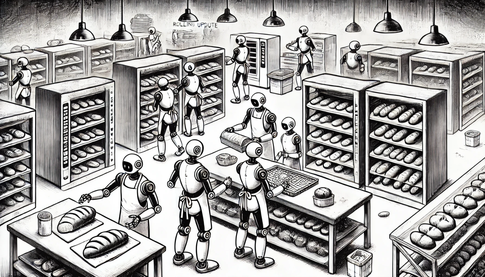

Compreendidos os fundamentos de integração e entrega contínua, podemos avançar
para os principais modelos de deployment, abstraídos de qualquer ferramenta
específica. O foco não é somente o **como** executar, mas o **porquê** de cada
modelo existir e que tipo de problema ele resolve.

Esse entendimento ajuda os times de engenharia a analisar as necessidades de
cada produto e a escolher, com base sólida, a estratégia mais adequada a cada
cenário.

Para facilitar, os modelos são ilustrados com uma analogia recorrente: imagine
que você é o responsável pela panificação de uma padaria tradicional e
renomada. Cada estratégia será explicada nesse contexto.

## Big Bang Deployments

Também chamados de Recreate Deployments, os Big Bang Deployments **recriam todo
o sistema de forma abrupta e simultânea**. Apesar de parecer drástica, essa
abordagem se justifica quando é impossível conviver com duas versões do mesmo
sistema ao mesmo tempo, ou quando uma transição gradual seria mais nociva do que
uma indisponibilidade curta até a estabilização.

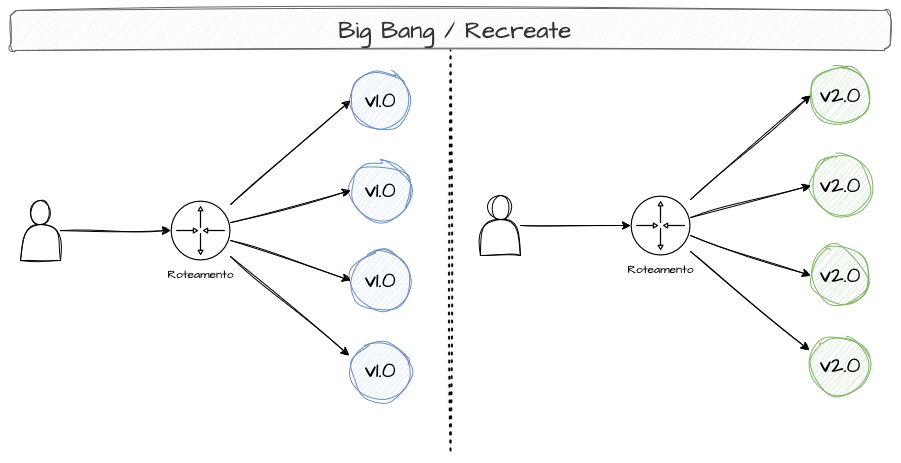

Esse padrão pode ser necessário em aplicações que usam **leasing**, como
consumidores Kafka, onde a troca constante de consumidores em um tópico provoca
rebalanceamentos que degradam o consumo. Em casos assim, recriar tudo de uma vez
pode ser mais viável do que atualizar progressivamente. Também serve quando é
preciso trocar esquemas de banco ou contratos de comunicação.

Na padaria, é como decidir testar uma farinha nova já na primeira fornada da
manhã: toda a produção passa a usar a nova marca de uma vez, e os clientes
recebem a receita nova sem qualquer validação prévia.

Essa estratégia só é viável quando as aplicações adotam
[comunicação assíncrona](https://fidelissauro.dev/mensageria-eventos-streaming/)
e operam com [consistência eventual](https://fidelissauro.dev/teorema-cap/). Por
adicionar risco elevado ao cliente, deve ser tratada como último recurso, usada
com cautela mesmo sendo operacionalmente mais simples.

## Rolling Updates

Provavelmente o modelo mais comum, o Rolling Update **promove uma atualização
gradual**: novas réplicas sobem e, assim que estáveis, as réplicas antigas são
desligadas. O sistema continua operando durante todo o processo, com parte das
instâncias na versão antiga e parte já na nova.

Em uma aplicação com 10 réplicas, é possível configurar a substituição uma a
uma, duas a duas, e assim por diante. A cada réplica nova ativa e saudável, a
progressão segue até atingir 100% das instâncias atualizadas.

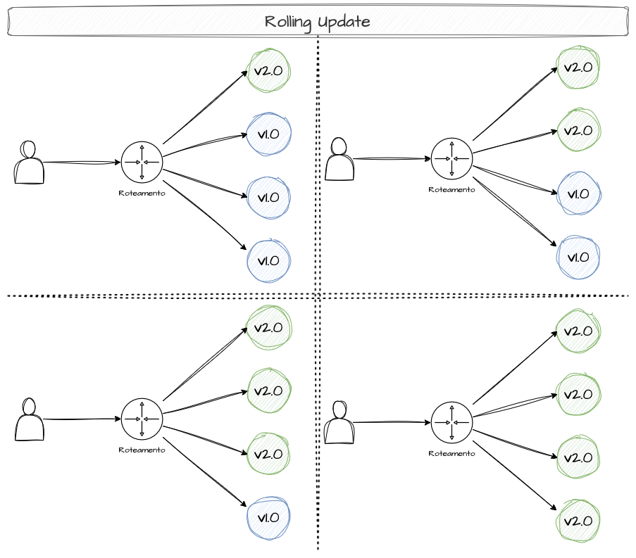

Na padaria, é como mudar a receita do pão francês: conforme os clientes compram
e abrem espaço na prateleira, novas fornadas com a receita nova vão ocupando o
estoque, até a prateleira inteira ser substituída.

O ponto fraco é a **ausência de validações intermediárias**: a única verificação
é se as réplicas estão de pé e passaram por um health check básico. Não há
controle fino de tráfego nem mecanismo de validação prévia da nova versão. Como
na padaria, se o cliente não gostar do pão novo, já não terá acesso ao da receita
anterior.

## Blue-Green Deployments

O Blue/Green busca **"zero downtime"** durante o release e **rollback rápido**
quando necessário, mantendo alta disponibilidade ao longo de todo o rollout.

A ideia é manter **dois ambientes idênticos**, divergindo apenas na versão do
componente atualizado. O **"Blue"** é a versão estável em produção, consumida
pelos usuários; o **"Green"** é a versão candidata a substituí-la.

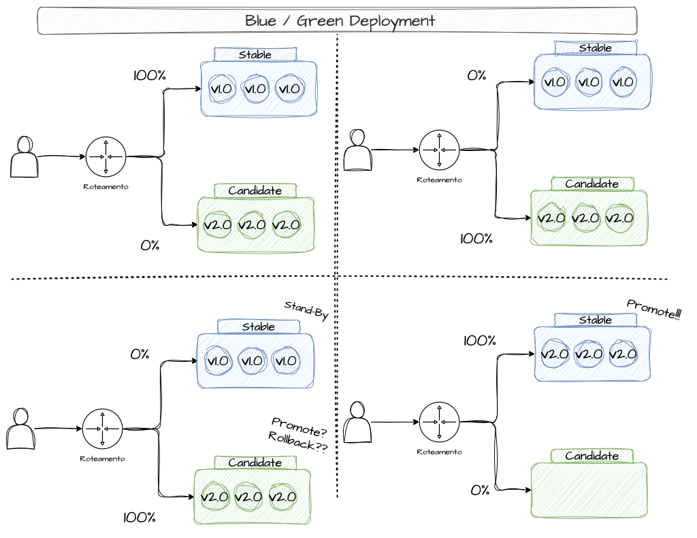

Esse arranjo **permite testar a nova versão sem afetar a produção**: dá para
fazer warm-up das réplicas, rodar
[smoke tests](https://fidelissauro.dev/load-testing/) e aplicar validações
automáticas ou manuais antes da promoção. Quando o Green está validado, o
tráfego é redirecionado do Blue para o Green — geralmente de forma instantânea,
via [Load Balancer](https://fidelissauro.dev/load-balancing/) ou
[roteamento de DNS](https://fidelissauro.dev/protocolos-de-rede/).

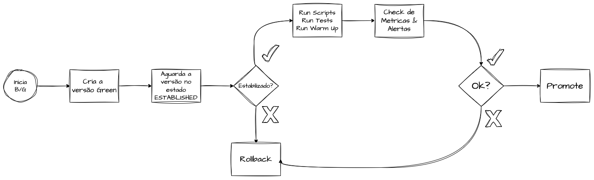

É comum manter o ambiente Blue ativo por um tempo para garantir retorno rápido
caso uma falha escape dos testes. Para extrair o máximo do modelo, é essencial
usar mecanismos que validem com segurança as principais funcionalidades e os
limites de erro e latência antes de expor a versão aos clientes finais.

Por outro lado, manter dois ambientes completos por longos períodos é caro,
sobretudo em sistemas grandes. E o maior desafio não é o software em si, mas a
**migração e o versionamento de schemas**: sincronizar versões de banco é a parte
mais complexa de qualquer deployment moderno, e alterações que tornam o Blue
incompatível dificultam muito o rollback.

## Canary Releases

Diferente do Blue/Green, que promove uma troca direta após validações, o Canary
Release é uma **implantação gradual**: mantém duas versões em operação, mas
direciona apenas uma pequena fração do tráfego (ou dos clientes) para a nova
release. O tráfego é dividido entre a versão **stable** (antiga) e a versão
**canary** (nova).

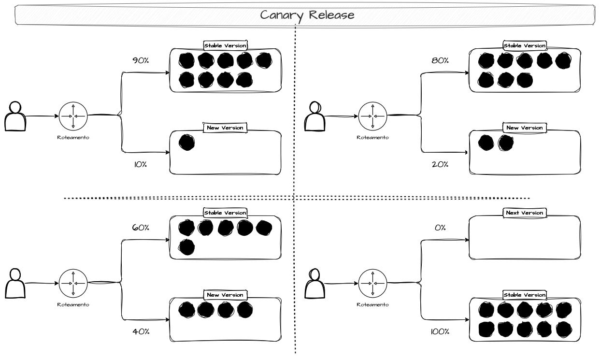

A participação da versão canary cresce de forma incremental e segura, conforme o
tempo passa ou conforme validações são atendidas. Mecanismos de rollback são
indispensáveis: o canary deve poder ser cancelado e a versão anterior restaurada
a qualquer momento, manualmente ou por decisão automatizada. Quando a nova versão
se mostra estável, todo o tráfego migra para ela, promovendo o canary a stable e
preparando o próximo rollout.

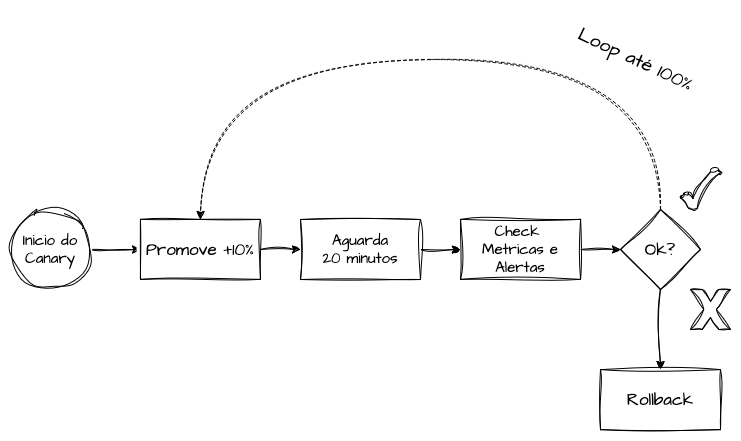

A forma mais eficiente de orquestrar essa progressão é **vincular o aumento das
porcentagens a métricas, alertas e testes sintéticos** executados durante o
deploy. Na padaria, é como inserir aos poucos alguns pães com a receita nova
junto aos tradicionais, coletando feedback diário dos clientes e ampliando a
proporção apenas se a reação for positiva — processo que pode levar semanas.

Mais importante do que acelerar a progressão é assegurar o rollback rápido.
Durante o canary, métricas essenciais — latência, taxa de erros e indicadores
customizados de produto — devem ser monitoradas, pois servem de base para
automatizar tanto a progressão quanto a reversão.

## Migrations e Versionamento de Schemas

As **Data e Schema Migrations** são estratégias para gerenciar mudanças em
bancos de dados de forma segura, controlada e com o menor impacto possível em
produção.

São especialmente relevantes em ambientes **cloud-native** e **distribuídos**,
nos quais a atualização de dados e esquemas precisa ser gradual e resiliente.

As **schema migrations** alteram a estrutura do banco — adicionar, modificar ou
remover tabelas, colunas, índices ou chaves. Já as **data migrations** atuam
sobre os dados armazenados — transformar, mover ou limpar registros.

## Shadow Deployment e Mirror Traffic

Conhecido também como Versão de Sombra, Mirror Traffic ou Shadow Traffic, o
Shadow Deploy é uma **estratégia avançada de validação**. A ideia é enviar uma
**cópia de parte do tráfego** para uma nova versão temporária e limitada,
observando seu comportamento sem afetar os usuários.

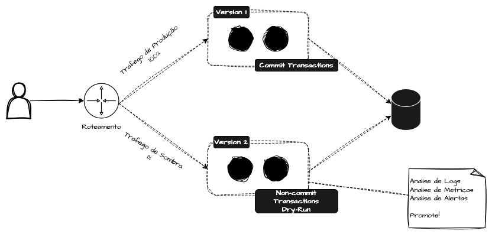

A nova versão processa esse tráfego, **mas sua resposta nunca chega ao cliente**.
A duplicação ocorre em tempo real, normalmente em camadas baixas — proxies
reversos, sidecars ou service meshes. É importante notar que o tráfego é
**duplicado, e não dividido**: as requisições seguem para a produção
normalmente, enquanto uma cópia alimenta a versão sombra. Por isso, funciona
bem como passo anterior a estratégias como Canary e Blue/Green, podendo ser
combinado com qualquer uma delas.

O modelo se encaixa melhor em aplicações que **não realizam escrita**, já que
espelhar operações de escrita duplicaria registros. Uma solução é rodar o
ambiente sombra em **"dry-run"**, simulando todo o fluxo sem efetivar as
transações.

```go
if os.Getenv("ENVIRONMENT") == "shadow" {
    tx.Rollback()
} else {
    tx.Commit()
}

```

O trecho de código acima ilustra essa ideia: quando o ambiente é o de sombra, a
transação sofre rollback ao final em vez de commit, de modo que nenhuma operação
seja persistida. Esse comportamento simula a execução completa sem causar
efeitos colaterais nos dados.

A versão sombra pode então ser **analisada por métricas e logs** antes de
qualquer decisão de progressão. Como pode preceder o Canary ou o Blue/Green,
serve de pré-validação antes de expor a versão aos clientes ou provisionar
infraestrutura de forma mais agressiva. Um cuidado essencial é garantir
**idempotência**, dentro e fora do dry-run, para evitar duplicidades e operações
inesperadas.

## Feature Flags

As Feature Flags (ou Feature Toggles) permitem **liberar funcionalidades de forma
controlada**, ativando ou desativando features dinamicamente sem alterar o código
ou refazer o deploy. A funcionalidade já vai para produção, porém com a flag
desligada; à medida que clientes são selecionados para experimentá-la, a flag é
ligada gradualmente.

São muito usadas para gerenciar lançamentos, controlar funcionalidades em
produção e conduzir experimentação. Um exemplo clássico é habilitar uma nova
interface apenas para uma fração dos usuários, comparando métricas com quem ainda
usa a versão antiga.

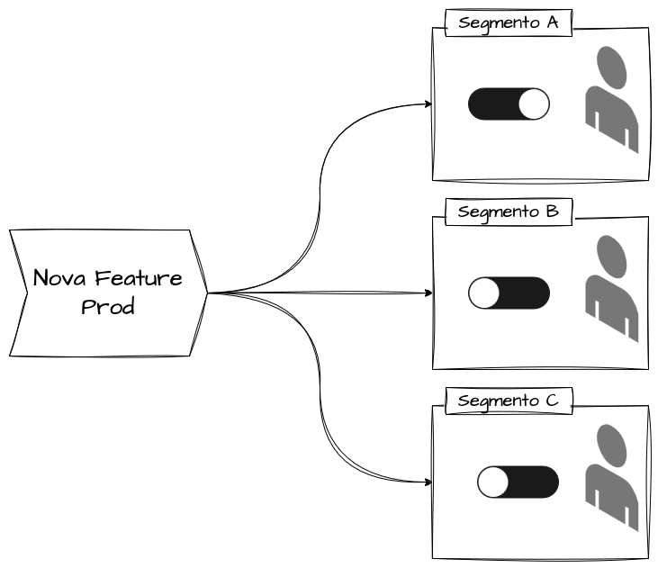

As flags **dependem de um componente centralizado** para controlar a distribuição
— ferramentas de mercado ou backoffices que alteram valores armazenados em banco.
Sistemas que segmentam clientes por categorias (Pessoa Física e Jurídica, ou
setores como Varejo, Mídia, Serviços) podem testar funcionalidades de forma
controlada entre grupos distintos.

O uso pode se estender a times de negócio e produto, que validam novidades
diretamente com os clientes sem depender da engenharia. Na padaria, equivale a
direcionar um produto novo a clientes de confiança para coletar impressões antes
de ampliar a produção.

### Clustering e Segregação de Segmentos

Uma técnica complementar é segregar clientes por características conhecidas
usando **algoritmos de clustering**. A partir de uma base com atributos como
segmento, volume, região, faturamento e períodos de uso, podemos aplicar
algoritmos como o **k-means** para agrupar clientes semelhantes, facilitando o
uso de feature flags e sharding sobre bases lógicas bem definidas.

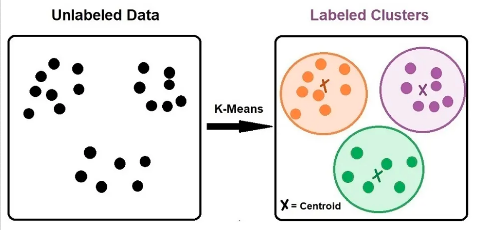

Na prática, o clustering ajuda a alocar esforço operacional e a fazer deployments
segmentados, começando por clusters menos críticos e liberando funcionalidades
conforme o perfil do cliente — o que melhora a experiência de testes e pilotos.
Na padaria, é como agrupar clientes (idosos, jovens, famílias, tradicionais,
experimentadores) e direcionar uma receita nova ao grupo mais adequado.

## Sharding deployment

O tema de [Sharding e Particionamento](https://fidelissauro.dev/sharding/) já foi
abordado sob as ópticas de dados, computação e segregação de clientes; aqui valem
os mesmos princípios. Com **chaves de partição** bem definidas, é possível
subdividir a infraestrutura de forma isolada e direcionar os clientes para shards
de modo consistente, validando novas versões em apenas uma fração dos usuários.

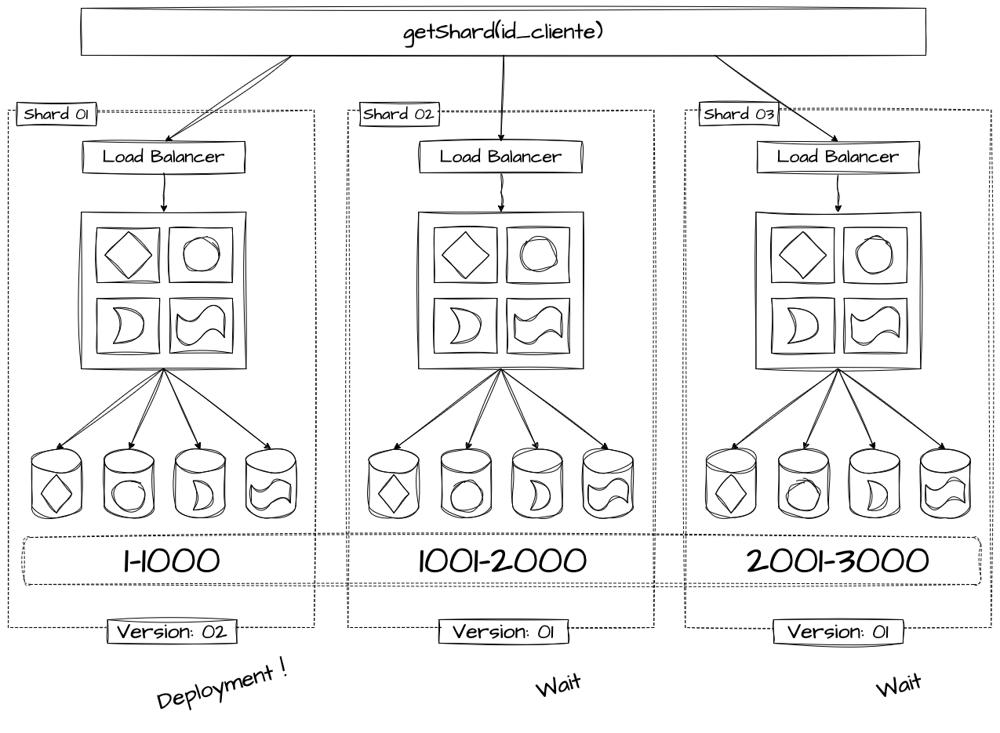

A abordagem é comum em arquiteturas **multi-tenant**, permitindo propagar versões
de forma controlada para subconjuntos de clientes em vez de toda a base. Assim,
uma eventual falha não se espalha pelo sistema inteiro, reduzindo o impacto e
facilitando a mitigação.

Por outro lado, é uma estratégia **avançada**, que exige planejamento rigoroso de
capacidade e custo, pois replica componentes básicos de infraestrutura para
isolar as cargas. Na padaria que atende outros estabelecimentos, equivale a
testar receitas em encomendas específicas, evitando expor clientes maiores e mais
recorrentes a eventuais erros.

### Referências

[Canary Releases](https://martinfowler.com/bliki/CanaryRelease.html)

[Pros and Cons of Canary Release and Feature Flags in Continuous Delivery](https://www.split.io/blog/canary-release-feature-flags/)

[Achieve Continuous Deployment with Feature Flags](https://www.split.io/blog/continuous-deployment-feature-flags/)

[SRE Workbook - Canarying Releases](https://sre.google/workbook/canarying-releases/)

[What is blue green deployment?](https://www.redhat.com/en/topics/devops/what-is-blue-green-deployment)

[What Is Blue/Green Deployment and Automating Blue/Green in Kubernetes](https://codefresh.io/learn/software-deployment/what-is-blue-green-deployment/)

[Advanced Traffic-shadowing Patterns for Microservices With Istio Service Mesh](https://blog.christianposta.com/microservices/advanced-traffic-shadowing-patterns-for-microservices-with-istio-service-mesh/)

[Glossary CNCF - Blue Green Deployment](https://glossary.cncf.io/pt-br/blue-green-deployment/)

[BlueGreen Deployment Strategy](https://argo-rollouts.readthedocs.io/en/stable/features/bluegreen/)

[Canary Deployment Strategy](https://argo-rollouts.readthedocs.io/en/stable/features/canary/)

[Istio Canary Deployments](https://docs.flagger.app/tutorials/istio-progressive-delivery)

[8 Different Types of Kubernetes Deployment Strategies](https://spacelift.io/blog/kubernetes-deployment-strategies)

[Entendendo Clusters e K-Means](https://medium.com/cwi-software/entendendo-clusters-e-k-means-56b79352b452)
