# System Design - Capacity Planning e a Teoria das Filas

- [System Design - Capacity Planning e a Teoria das Filas](#system-design---capacity-planning-e-a-teoria-das-filas)
- [Teoria das Filas](#teoria-das-filas)
  - [A Lei de Little na Teoria das Filas](#a-lei-de-little-na-teoria-das-filas)
    - [Lei de Little e o “Ponto Saudável”](#lei-de-little-e-o-ponto-saudável)
    - [Knee Curve (Curva do Joelho)](#knee-curve-curva-do-joelho)
    - [Margens Seguras de Saturação](#margens-seguras-de-saturação)
  - [Modelagem de Carga](#modelagem-de-carga)
    - [Transações por Segundo](#transações-por-segundo)
    - [Processos Concorrentes](#processos-concorrentes)
    - [Tamanho de Payload](#tamanho-de-payload)
    - [Cálculos de Estimativa de Carga](#cálculos-de-estimativa-de-carga)
      - [Estimativa de Transações por Segundo](#estimativa-de-transações-por-segundo)
      - [TPS Sistêmico](#tps-sistêmico)
      - [Estimativa de Tamanho de Payload](#estimativa-de-tamanho-de-payload)
      - [Estimativa de Bytes de Uma Transação](#estimativa-de-bytes-de-uma-transação)
      - [Estimativa de Banda pelo Payload e Transações por Segundo](#estimativa-de-banda-pelo-payload-e-transações-por-segundo)
    - [Perfis de Tráfego](#perfis-de-tráfego)
      - [Perfil Diário](#perfil-diário)
      - [Perfil Semanal](#perfil-semanal)
      - [Perfil Sazonal](#perfil-sazonal)
    - [Projeção de Crescimento](#projeção-de-crescimento)
      - [Crescimento Linear](#crescimento-linear)
      - [Crescimento Não Linear](#crescimento-não-linear)
      - [Crescimento Mediante Novas Features e Eventos de Negócio](#crescimento-mediante-novas-features-e-eventos-de-negócio)
    - [Capacidade End to End (E2E)](#capacidade-end-to-end-e2e)
      - [Throughput individual](#throughput-individual)
      - [Throughput sistêmico](#throughput-sistêmico)
      - [Dependência do Gargalo](#dependência-do-gargalo)
- [Planejamento de Capacidade](#planejamento-de-capacidade)
  - [Delimitar o Fluxo, Funcionalidades e Componentes](#delimitar-o-fluxo-funcionalidades-e-componentes)
  - [Levantar as Estimativas de Carga](#levantar-as-estimativas-de-carga)
  - [Identificação do Throughput Individual dos Componentes e Serviços](#identificação-do-throughput-individual-dos-componentes-e-serviços)
  - [Derivação do Throughput Sistêmico](#derivação-do-throughput-sistêmico)
  - [Levantamento da Projeção de Crescimento](#levantamento-da-projeção-de-crescimento)
  - [Avaliar o Custo e as Margens Operacionais](#avaliar-o-custo-e-as-margens-operacionais)
  - [Definição dos Limites Operacionais](#definição-dos-limites-operacionais)
  - [Testes de Carga e Estresse](#testes-de-carga-e-estresse)
- [Referências](#referências)

> **Nota:** Este documento é um material de estudo baseado no artigo original
> **"System Design - Capacity Planning e a Teoria das Filas"**, de
> **Matheus Fidelis**, publicado em
> [fidelissauro.dev/capacity-planning](https://fidelissauro.dev/capacity-planning/).
> As ilustrações pertencem ao autor original. Recomenda-se a leitura do artigo
> completo na fonte.

---

Capacity planning não tem como meta adivinhar o futuro com exatidão, e sim
compreender os limites estruturais de um sistema antes que eles virem
incidentes. A maioria dos problemas de capacidade não nasce de um crescimento
abrupto, mas da dificuldade de interpretar como o sistema reage sob carga real.
Métricas isoladas, como CPU, memória ou TPS médio, costumam contar apenas parte
da história. O que de fato importa é como esses sinais se relacionam entre si,
como a concorrência interna vai se acumulando e em que ponto os gargalos surgem
quando a carga deixa de ser uniforme.

O texto reúne um compilado de modelos matemáticos, conceitos e fórmulas voltados
a capacity planning e performance, organizados como uma caixa de ferramentas
prática. A abordagem é deliberadamente mais densa e teórica do que os capítulos
anteriores, mas com foco aplicável.

A proposta não é um guia para dimensionar servidores, e sim um método
sistemático para modelar carga, interpretar saturação e planejar crescimento de
forma estruturada. Teoria das filas, Lei de Little e curva do joelho deixam de
ser abstrações acadêmicas e se tornam instrumentos para responder a perguntas
como "quanto meu sistema aguenta de forma sustentável?" e "onde ele quebra antes
que eu perceba?". O objetivo central é mover o capacity planning de uma reação a
incidentes para uma prática de engenharia preventiva e bem fundamentada.

# Teoria das Filas

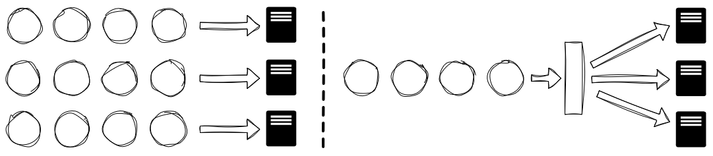

A teoria das filas é um dos pilares mais importantes (e mais mal compreendidos)
do capacity planning. Em essência, ela estuda como sistemas se comportam quando
múltiplas demandas competem por recursos finitos. Em software, isso aparece em
requisições síncronas aguardando resposta, mensagens acumuladas em filas, itens
processados em memória, conexões disputando pools de banco de dados ou operações
de I/O esperando acesso a um recurso compartilhado.

Conceitualmente, qualquer fila pode ser entendida por três dimensões: como as
demandas chegam, como são processadas e em que ordem são atendidas. A ideia é
transformar arquiteturas complexas em modelos matematicamente analisáveis,
sobretudo em sistemas distribuídos, onde taxas de uso estáveis e tempos de
resposta previsíveis raramente se sustentam.

As "filas" não existem só onde há enfileiramento assíncrono explícito, como
brokers de mensagens. A teoria também ajuda a entender gargalos, throughput
real, tempo de resposta e latências em cascata que surgem da saturação de pools
de threads, de conexões de banco, de locks em recursos compartilhados e de
mecanismos de retry. Em arquiteturas distribuídas, cada hop, requisição, buffer
e microsserviço se comporta como uma fila independente, com sua própria taxa de
chegada, taxa de processamento, saturação e congestionamento.

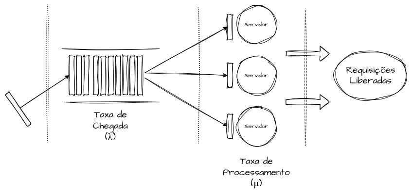

Na forma mais simples, uma fila é um mecanismo no qual solicitações chegam (λ) e
são processadas (μ), e o sistema oscila continuamente entre ociosidade,
equilíbrio e saturação dentro desses dois parâmetros. Quando a taxa de chegada
(λ) se aproxima ou ultrapassa a taxa de processamento (μ), forma-se um gargalo
físico: os tempos de resposta crescem e o throughput degrada, pois entra mais do
que sai. É por isso que um microsserviço saudável no p95 pode degradar bastante
no p99 sob picos, mesmo com CPU aparentemente estável. Em geral o problema não é
falta de capacidade física, e sim a variabilidade temporal, os bursts e o custo
de espera entre chamadas.

Isso explica por que o autoscaling raramente resolve todos os problemas de
capacidade. Ele apenas reage a aumentos expressivos de uso ou à saturação de
recursos, elevando momentaneamente a taxa de processamento (μ) ao adicionar
réplicas. Como funciona por gatilhos temporais, o sistema continua sensível a
bursts. Em outras palavras, um sistema não sofre por receber "muitas
requisições", mas por recebê-las de forma imprevisível ou não uniforme.

A teoria das filas sugere observar a variabilidade da carga, com métricas como
coeficiente de variação ou desvio padrão, em vez de percentis, mínimos, máximos
e médias da taxa de processamento. Analisamos a variação de λ e de μ. Isso
explica por que dois serviços com a mesma capacidade de recursos podem se
comportar de maneira completamente distinta: com a mesma taxa média de
atendimento, aquele com desvio padrão mais alto exibe curvas de latência bem
piores. Estratégias já discutidas, como sharding, bulkheads, caching,
escalabilidade vertical e horizontal, desacoplamento por filas e eventos, mais
consumidores e técnicas de concorrência e paralelismo, ajudam a manter a
estabilidade quando λ supera μ.

## A Lei de Little na Teoria das Filas

A Lei de Little (Little's Law) é um princípio matemático simples, integrado à
teoria das filas e apresentado por John D. C. Little nos anos 1960. Ela não
nasceu para problemas computacionais, podendo descrever a pressão de qualquer
sistema a partir da média de três variáveis: o número médio de itens em
processamento (L), a taxa média de chegada (λ) e o tempo médio de permanência no
sistema (W). A relação básica é `L = λ × W`.

Apesar de simples, o cálculo vale para interpretar qualquer sistema estável,
pois independe de estatísticas complexas ou de valores exatos de W e λ, desde
que suas médias estejam bem definidas.

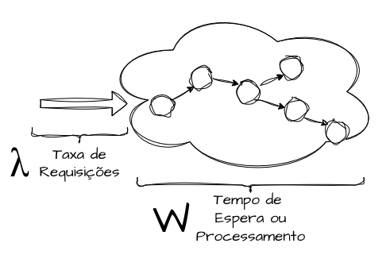

Em sistemas distribuídos, a Lei de Little permite interpretar a capacidade de
forma granular (por componente, dependência ou microsserviço) ou de forma mais
ampla, olhando um fluxo completo quando estimar a capacidade exata de cada peça
seria inviável.

Na prática, ela acrescenta uma leitura de capacidade sobre throughput e
latência. Para uma taxa de chegada fixa (λ), qualquer aumento no tempo médio de
resposta (W) implica, de imediato, um aumento proporcional no número de
processos simultâneos (L).

Como exemplo, um sistema assíncrono que recebe em média 1.500 mensagens por
segundo, com tempo médio de processamento de 50 ms, mantém em média 75 mensagens
simultâneas (L = 1.500 × 0,05). Esse valor representa a concorrência média
interna e serve de base para dimensionar consumidores, threads, partições de
filas ou limites de paralelismo, antecipando degradações ou otimizações sem
depender da saturação. Pela interpretação do modelo, quanto menor o L, melhor.

Pequenos aumentos no tempo médio de processamento impactam diretamente o número
de mensagens acumuladas e elevam o risco de atraso e de crescimento descontrolado
da fila. Se o tempo subir para 85 ms, o L salta para cerca de 127 (1.500 ×
0,085), um aumento de 52 mensagens em voo, motivado por algo plausível como
variação de payload, latência de dependências externas, I/O ou contenções.

### Lei de Little e o “Ponto Saudável”

A Lei de Little oferece um critério para encontrar um "ponto saudável" de
operação: aquele em que o crescimento da carga (λ) não provoca aumento
descontrolado da concorrência interna (L).

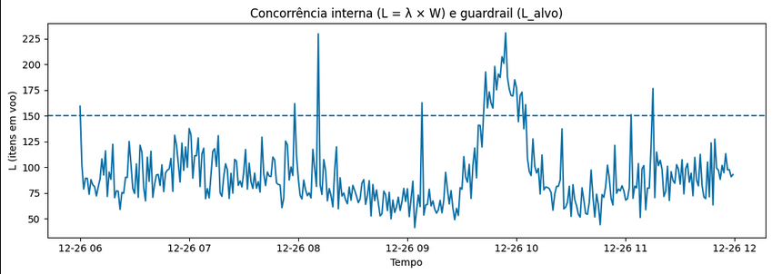

Para tornar isso concreto, podemos adotar um `L(Alvo)`, uma espécie de service
level de engenharia que define o número máximo desejável de itens em concorrência
interna, compatível com os limites físicos e operacionais da solução. Isso nos
empurra a buscar otimizações constantes para reduzir o tempo de processamento
(W).

Considere uma API REST com `L(Alvo)` de 150 que recebe 500 requisições por
segundo, com resposta média de 300 ms: o L resulta em 150 (500 × 0,3), exatamente
no contrato do "ponto saudável", com previsibilidade e margem para absorver
variações. Se a carga dobrar para 1.000 req/s, o L vai a 300, ultrapassa o alvo e
empurra o sistema para a zona de saturação e risco.

A resposta saudável é reduzir proporcionalmente W. O tempo-alvo de otimização sai
de `W = L(Alvo) / λ × 1000` (para chegar em milissegundos). No exemplo, com
`L(Alvo)` de 150 e 1.000 req/s, W precisa cair de 300 ms para 150 ms. Assim, o
sistema passa a processar 50% mais requisições mantendo a mesma concorrência
média interna. O objetivo é que o crescimento seja absorvido estruturalmente, sem
acúmulo extra de filas nem pressão excessiva sobre os recursos.

### Knee Curve (Curva do Joelho)

A Knee Curve, ou curva do joelho, expressa a relação entre a utilização de um
sistema e seu ponto de degradação. Em um [teste de carga](https://fidelissauro.dev/load-testing/),
ela marca o instante em que o tempo de resposta muda bruscamente em relação à
tendência anterior.

Normalmente, a latência cresce de forma linear conforme aumenta o volume de
requisições. A curva do joelho revela o ponto a partir do qual o sistema deixa de
se comportar de modo previsível e passa a degradar de forma acelerada.

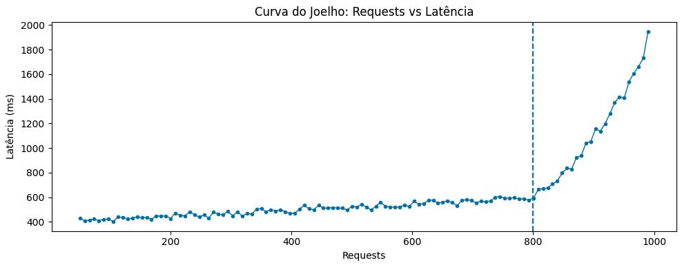

Enquanto a utilização permanece antes do "joelho", o sistema opera com saúde e
margem para absorver pequenas variações. Operar perto ou além da curva amplia o
enfileiramento interno, o número de retries e a saturação dos componentes.

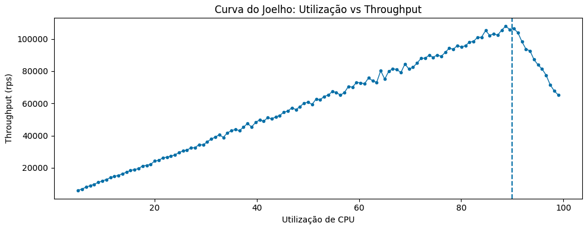

O modelo se aplica também a outras métricas além de requests. Recursos físicos
como CPU e memória ajudam a entender a partir de que nível de uso o sistema começa
a degradar em throughput e latência, permitindo estimar capacidades e definir
automações de [auto scaling](https://fidelissauro.dev/performance-capacidade-escalabilidade/)
de forma mais assertiva.

Em paralelo à teoria das filas, à medida que a utilização se aproxima da
capacidade máxima ou ultrapassa o "ponto saudável" da Lei de Little, as filas
internas começam a se formar e o tempo de espera passa a dominar o tempo total.
A partir daí, a latência cresce de forma não linear, muitas vezes exponencial,
mesmo com incrementos pequenos de utilização.

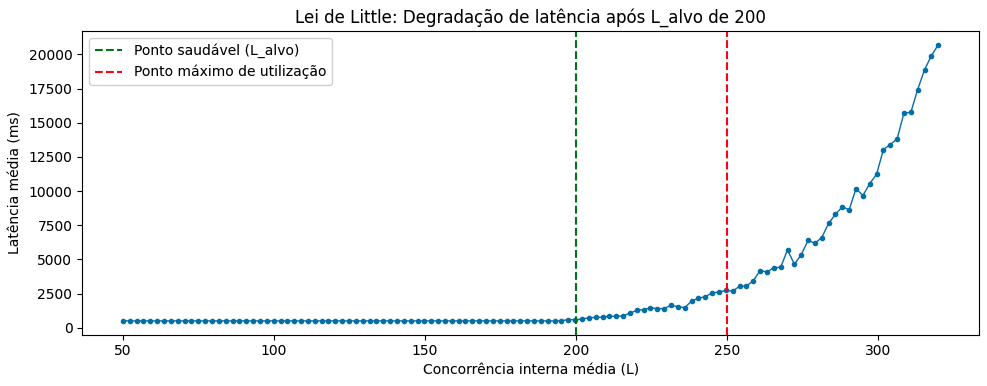

Em testes de performance, achar a curva do joelho permite identificar dois
pontos: o "ponto saudável" e o "ponto máximo de utilização". O primeiro é, em
geral, a zona anterior ao joelho, com o melhor equilíbrio entre eficiência e
previsibilidade, onde o throughput cresce de forma saudável e os tempos de
resposta permanecem conhecidos. O segundo é o limite teórico em que o sistema
ainda processa requisições, mas à custa de latências altas, imprevisibilidade e
risco real de indisponibilidade. O ideal é que ambas as zonas fiquem antes da
curva do joelho definitiva: uma para operação normal e outra para o limite máximo
de risco aceitável.

### Margens Seguras de Saturação

Ao olhar recursos físicos sob a ótica de capacity planning, como a utilização de
CPU, o objetivo não deve ser maximizar a ocupação, e sim tratá-los como recursos
finitos com margens instáveis de proximidade do limite.

Diferentemente de banda, armazenamento ou IOPs, a saturação de CPU e memória não
é linear nem representa "espaço livre" simples para alocar. Pela teoria das
filas, pequenos aumentos de utilização perto de um ponto saudável de CPU provocam
crescimento desproporcional de filas, sem que se chegue a 100% de uso.

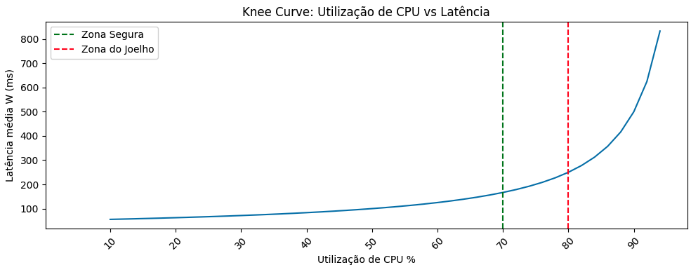

Os "pontos saudáveis" de CPU e memória são faixas de uso nas quais o sistema
absorve spikes, bursts e jitters sem exaurir a taxa de processamento (μ) ou
inflar o tempo de processamento (W), evitando filas e gargalos. O ponto central é
que não é preciso chegar a 100% de CPU para que filas internas se formem: por
volta de 80–85% de utilização, incrementos marginais de carga já produzem
aumentos desproporcionais de latência e concorrência.

## Modelagem de Carga

A modelagem de carga é um dos requisitos centrais para estimar o capacity
planning. Ambientes modernos oferecem monitoramento e observabilidade que coletam
logs, métricas e traces das aplicações e seus componentes. Para estimar
capacidade, é preciso analisar parte desses sinais de forma unificada e
correlacionada.

Transações por segundo, requests concorrentes e payload médio, em conjunto,
representam o comportamento real do sistema melhor do que qualquer uma delas
isoladamente. Juntas, formam a base mais sólida para uma modelagem de carga
realista.

As transações por segundo descrevem o ritmo das solicitações; a concorrência
descreve a pressão acumulada com a chegada delas; e o tamanho do payload descreve
o peso individual de cada transação em termos de networking, storage,
serialização e consumo de memória.

### Transações por Segundo

As transações por segundo representam a taxa de chegada de requisições e são o
ponto de partida de qualquer estimativa. Nenhuma métrica é mais importante do que
a quantidade de interações que o sistema recebe ou receberá.

Mesmo dentro de um único segundo, há insights relevantes sobre bursts. Dois
sistemas podem ter o mesmo TPS médio e se comportar de formas totalmente
diferentes conforme a distribuição temporal dessas transações. Um workload com
1.000 TPS homogêneos ao longo do segundo impõe pressão muito distinta de outro
com a mesma média, mas concentrado em bursts de 5–10 ms. Conhecer esse nível de
granularidade ajuda a estimar com mais precisão a capacidade necessária.

### Processos Concorrentes

Os requests concorrentes refletem uma dimensão interna do sistema, ligada à sua
capacidade de processamento. Diferentemente das transações por segundo, que
descrevem a chegada, os processos concorrentes descrevem o trabalho simultâneo
que o sistema sustenta.

Em sistemas síncronos, como servidores gRPC ou APIs REST, isso aparece como
threads ocupadas e conexões abertas. Em sistemas assíncronos, como mensagens em
voo, partições ocupadas, consumidores ativos e taxa de processamento em brokers.

Um exemplo comum são APIs com latências aceitáveis no p95, mas com concorrência
interna elevada por causa de pequenas degradações em dependências externas. A
capacidade aparente parece suficiente, enquanto o sistema já opera próximo a
limites estruturais invisíveis. Saber estimar e medir a concorrência interna é
fundamental para não esbarrar nas curvas do joelho.

### Tamanho de Payload

Estimar o tamanho do payload, seja em mensagens ou requests HTTP, é uma dimensão
frequentemente ignorada. Em sistemas com requisições homogêneas (poucos
endpoints, contratos bem definidos), o tamanho é previsível e a pressão de I/O é
estimável com confiança. Já em sistemas com muitas funcionalidades distribuídas
por filas e endpoints, o payload médio pode não representar fielmente a
realidade. O risco da estimativa não está na média, mas na dispersão em torno
dela.

Payloads maiores tendem a ampliar tempo de processamento, consumo de memória,
pressão em garbage collection, uso de buffers de rede e latência de serialização.
Um sistema que processa majoritariamente payloads pequenos, mas ocasionalmente
recebe payloads grandes, pode parecer estável na média e ainda assim sofrer
degradações abruptas em cenários funcionalmente válidos. Essa variabilidade cria
caudas longas no tempo de resposta e amplifica filas internas, mesmo sem mudança
perceptível no TPS.

O ideal é modelar sistemas e contratos com pouca variação de tamanho. Quando isso
não for possível, é necessário estimar cada funcionalidade isoladamente e buscar
uma estatística que represente melhor o sistema diante de suas particularidades.

### Cálculos de Estimativa de Carga

A modelagem de carga pode ser estimada com algumas equações simples, aplicadas a
dimensões já conhecidas do sistema ou fornecidas pelos times de produto. As
seções a seguir expandem essas equações para cenários mais específicos.

#### Estimativa de Transações por Segundo

O throughput é uma métrica valiosa para entender o comportamento do sistema e
costuma ser a primeira a ser levantada, pois conecta diretamente o comportamento
do usuário à pressão exercida sobre a arquitetura.

Embora simples, o TPS deve ser lido como valor estatístico (médio, mínimo e
máximo), e não como fluxo contínuo e uniforme. Em sistemas reais a taxa de
chegada oscila e sofre efeitos de sincronização, burstiness e correlação entre
clientes. Levantar o desvio padrão do TPS também traz insights sobre sua variação
ao longo do tempo. A fórmula base é o número de unidades de trabalho processadas
no período dividido pelo tempo do período em segundos.

Na prática, esse valor costuma vir de séries históricas sazonais, projeções de
crescimento ou metas de negócio, sendo depois ajustado para picos, sazonalidade e
eventos especiais como promoções, Black Friday ou Natal.

#### TPS Sistêmico

O TPS sistêmico representa a vazão efetiva de todo o sistema, considerando não só
a aplicação principal, mas todas as dependências críticas. Em arquiteturas
distribuídas, o throughput observado externamente é sempre limitado pelo menor
gargalo ativo no caminho de processamento. Em termos práticos, ele equivale ao
mínimo entre os TPS de aplicação, banco de dados, cache e demais componentes.

De nada adianta uma camada de aplicação altamente escalável se banco, cache,
broker ou uma API externa impõem limites mais restritivos. Além disso, o gargalo
dominante pode mudar dinamicamente conforme o perfil de carga, o tamanho do
payload ou o tipo de operação.

#### Estimativa de Tamanho de Payload

A estimativa de tamanho de payload quantifica o volume médio de dados por
requisição, somando o corpo da mensagem ao overhead dos protocolos de transporte
(HTTP, TLS, mTLS, entre outros). De forma direta, o payload em bytes é a soma do
corpo com os headers.

Em sistemas reais, porém, é preciso considerar camadas adicionais de overhead,
como encoding, compressão, criptografia e framing de protocolo, que podem tanto
ampliar quanto reduzir o tamanho efetivamente trafegado, o que se traduz em
multiplicar a soma anterior por um fator de overhead. Mais importante do que o
valor médio absoluto é a variabilidade do payload, já que payloads grandes
amplificam latência, memória e tempo de processamento, criando caudas longas que
afetam a estabilidade.

#### Estimativa de Bytes de Uma Transação

Enquanto o payload representa uma única mensagem, a estimativa de bytes por
transação considera o custo completo de uma interação, somando request e
response. Essa visão é mais adequada para análises de capacidade fim a fim e para
estimativas de custo e banda sob carga real.

A métrica é especialmente relevante em APIs verbosas, fluxos com respostas ricas
em dados ou sistemas em que o volume de resposta cresce com o contexto da
operação. Ignorar o payload de resposta é um erro comum que explica boa parte das
divergências entre estimativas e tráfego real.

#### Estimativa de Banda pelo Payload e Transações por Segundo

A estimativa de banda conecta o throughput lógico (TPS) ao consumo físico de
rede. A partir do payload médio por transação, é possível estimar o volume de
dados por segundo (basicamente TPS multiplicado pelo payload médio em bytes) e,
com isso, dimensionar links, limites de ingress e custos de transferência.

Esse cálculo é apenas uma aproximação inicial, que deve ser refinada com fatores
como retries, retransmissões, fan-out interno e replicação de tráfego entre zonas
ou regiões.

### Perfis de Tráfego

Os perfis de tráfego ajudam a entender como a carga se distribui ao longo do
tempo, revelando padrões de uso, assimetrias e variações que não aparecem em
métricas agregadas. Ao analisar comportamentos diários, semanais e sazonais, é
possível antecipar picos previsíveis, identificar janelas de ociosidade e
planejar capacidade de forma proativa, equilibrando desempenho, custo e
previsibilidade.

#### Perfil Diário

O perfil diário estuda o uso do sistema ao longo de 24 horas, normalmente ligado
à rotina dos usuários e aos agendamentos das integrações. Aqui usamos agregações
granulares (1, 2, 5 e 10 minutos) e estatísticas como média, p95, p99, máximo e
mínimo.

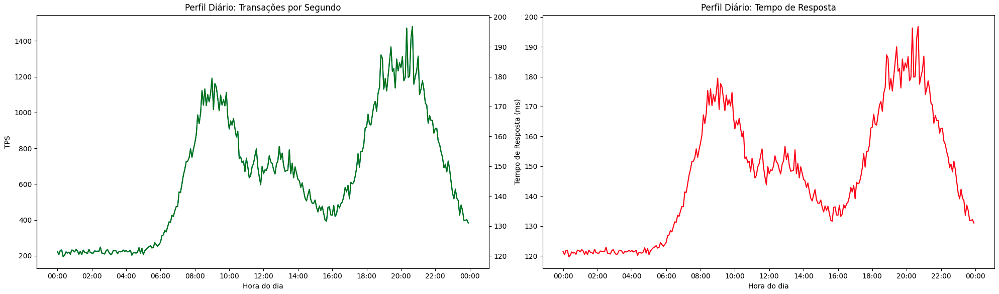

Em sistemas voltados a usuários finais, é possível identificar quando começam a
operar, com maior pressão nas janelas de expediente, alívio no almoço e pouco
tráfego de madrugada. Em delivery de comida, os picos antecedem almoço e jantar;
em apps de carona, ficam próximos do início e do fim do expediente; e em sistemas
B2B ou internos, alinham-se a rotinas operacionais, fechamentos de lote e
execuções agendadas.

Para capacity planning, o perfil diário é crítico porque define a duração dos
períodos de alta e baixa utilização, permitindo ajustar preventivamente a
capacidade nos horários de aumento rotineiro de tráfego ou de subutilização.

#### Perfil Semanal

O perfil semanal busca padrões de carga que se repetem ao longo dos 7 dias,
identificando desvios de uso, erro e latência. Para isso usamos agregações
maiores (1, 2, 3 e 5 horas), comparando médias e percentis para entender desvios.

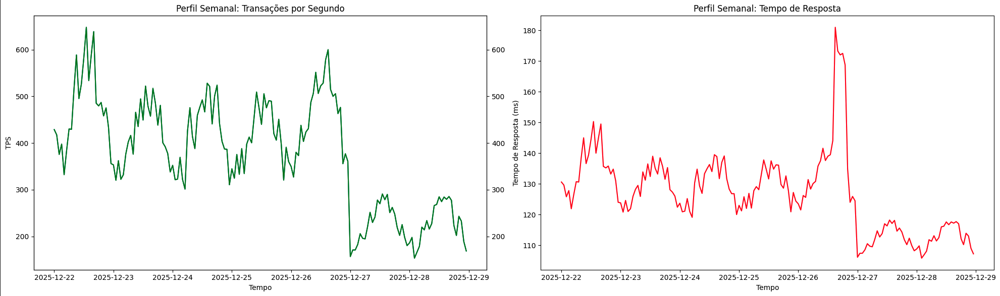

Um sistema pode operar abaixo do ponto saudável na maior parte da semana e ainda
entrar em saturação previsível em dias específicos. Diferentemente do perfil
diário, mais suave, o semanal pode trazer assimetrias abruptas, como segundas
sistematicamente mais carregadas, sextas com picos concentrados e finais de
semana com tráfego baixo.

Esse perfil é útil para entender desvios e projetar capacidade com base em
períodos repetitivos, viabilizando warm-ups preventivos ou descomissionamento de
contêineres e servidores em janelas de ociosidade conhecida.

#### Perfil Sazonal

O perfil sazonal descreve variações de carga em escalas mais longas (semanas,
meses ou anos), associadas a ciclos de negócio, eventos externos ou mudanças de
comportamento. A agregação aqui costuma ser feita em dias ou semanas.

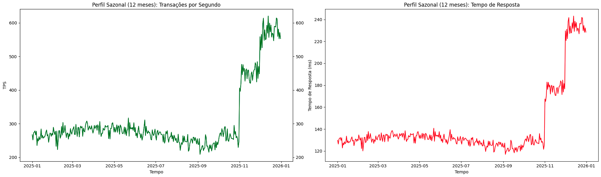

Essa visão permite estudar o crescimento gradual do sistema em fatias maiores de
tempo. Exemplos comuns incluem períodos promocionais, datas comemorativas, ciclos
fiscais, eventos regulatórios e fatores externos como clima e calendário escolar.
É possível atingir bons níveis de escalabilidade analisando apenas meses ou
semanas comuns e, mesmo assim, falhar em períodos não estacionários, como
e-commerces na Black Friday, em que uma semana de novembro excede todos os
padrões do ano.

Combinar perfis diários para granularidade, semanais para tendências e sazonais
em nível de mês e ano eleva bastante a capacidade de projetar e estimar a
capacidade ao longo de períodos longos, de forma estruturada e profissional.

### Projeção de Crescimento

A projeção de crescimento é o momento em que a análise deixa de ser estática e
reativa para adotar antecipação. Enquanto as estimativas anteriores buscavam
entender o comportamento atual, a projeção responde a uma pergunta mais difícil:
como será a carga daqui a 3, 6 ou 12 meses?

Responder a isso exige análise temporal extensa do passado, para captar o
crescimento natural, e parceria com os times de negócio, para entender
expectativas e perspectivas de mercado. A missão da engenharia é sustentar as
expectativas de produto de forma realista, e essas expectativas precisam ser de
conhecimento comum entre tecnologia e negócio.

#### Crescimento Linear

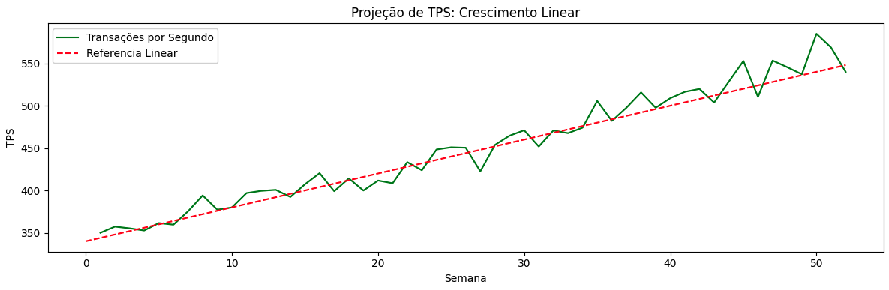

O crescimento linear assume que métricas como TPS, volume de dados ou usuários
ativos aumentam proporcionalmente ao tempo, com usuários, licenças, transações ou
compras seguindo uma tendência semelhante a cada mês ou semana. Pequenas
variações dessa taxa, para mais ou para menos, não descaracterizam o
comportamento como linear.

Esse padrão aparece em estágios iniciais de um produto ou em sistemas muito bem
estabelecidos, cenários opostos que compartilham uma tendência previsível e
estável. Nessa análise, inferimos que dobrar o número de transações ou usuários
implica diretamente dobrar a capacidade.

#### Crescimento Não Linear

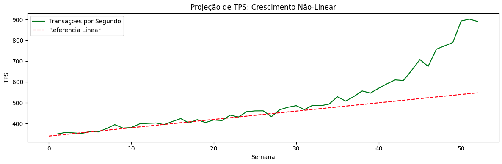

Em sistemas mais variáveis, tráfego e capacidade raramente crescem de forma
linear, alternando períodos lineares, exponenciais ou irregulares e exibindo
comportamentos difíceis de prever.

Esse crescimento tende a invalidar análises anteriores. Pode surgir de mudanças
de comportamento dos usuários ou da introdução de novas funcionalidades, em que
pequenas variações de usuários ou eventos geram aumentos desproporcionais em TPS,
latência ou concorrência interna. Também pode vir de testes de estratégias de
marketing e negócio, que provocam comportamentos imprevisíveis. Crescimentos não
lineares e não planejados são especialmente perigosos para sistemas que já operam
perto da taxa máxima de processamento conhecida.

#### Crescimento Mediante Novas Features e Eventos de Negócio

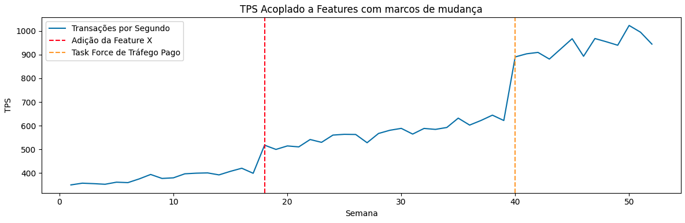

Uma dimensão valiosa, que aproxima engenharia e negócio, é a projeção de
crescimento ligada a mudanças, novas features e eventos planejados. O perfil de
tráfego pode mudar bruscamente com novas funcionalidades, migrações de usuários
ou campanhas de conversão. Ter esses eventos alinhados com os times responsáveis
permite agir de forma planejada e preventiva para suportar a nova carga.

Um evento que atraia mais usuários ou aumente a taxa de uso pode deslocar os
limites de processamento, aproximando o sistema da curva do joelho mesmo com as
funcionalidades já existentes. Além disso, uma nova feature pode multiplicar as
chamadas internas por requisição, ampliar o payload médio ou introduzir
dependências adicionais no fluxo. Testar carga contemplando essas características
é fundamental para reavaliar a capacidade necessária.

Nem toda mudança exige um planejamento de capacidade no detalhe máximo, mas
aquelas que pretendem alterar o comportamento do sistema como um todo precisam
ser consideradas com cuidado. Levantar estimativas e expectativas com todos os
envolvidos é essencial para planejamentos mais assertivos.

### Capacidade End to End (E2E)

Avaliar a capacidade end to end de um fluxo, sistema ou transação ajuda a assumir
responsabilidade sobre o encadeamento completo entre os serviços. Olhar todas as
dependências e integrações como a soma das capacidades individuais revela onde o
fluxo se limita, onde os gargalos emergem e quais sistemas podem falhar sob carga
real. É preciso avaliar tanto o throughput individual de cada sistema quanto o
sistêmico, observando como os "steps" se comportam em cadeia.

#### Throughput individual

O throughput individual é a capacidade máxima sustentável de um componente
isolado, avaliada fora do contexto do fluxo fim a fim. Descreve quanto trabalho
um serviço, banco, fila ou consumidor consegue processar por unidade de tempo sob
condições controladas, respeitando seus próprios limites de CPU, memória, I/O,
concorrência e configuração interna.

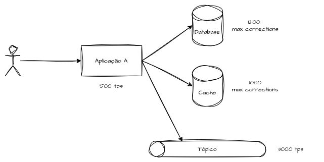

Há dois cenários de avaliação. No primeiro, considera-se um microsserviço e suas
dependências diretas (caches, filas, bancos), medindo a capacidade dentro de um
domínio de serviço, respondendo a perguntas como "quanto esse sistema de emissão
de boletos processa?". No segundo, analisa-se cada microcomponente isolado, como
"quanto de I/O esse banco suporta?". Ambos geram insights valiosos sobre
capacidade de produção.

#### Throughput sistêmico

O throughput sistêmico é a capacidade máxima de um sistema ou funcionalidade
considerando todas as suas dependências. O objetivo é ser agnóstico à capacidade
individual de cada componente, levando em conta apenas o fluxo completo, da
entrada até a resposta final. Serve para avaliar a capacidade total da solução e
identificar oportunidades de melhoria em filas e gargalos.

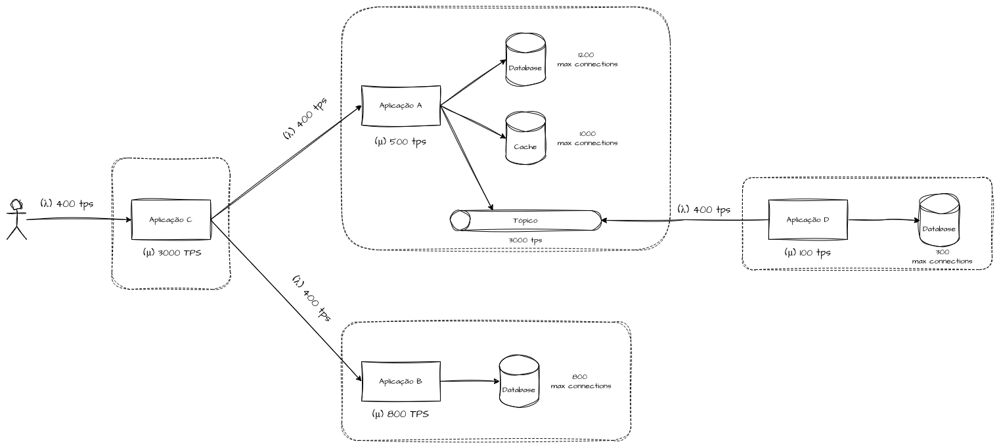

Na prática, o throughput sistêmico busca identificar o desequilíbrio entre λ e μ
em cada hop, determinando qual componente exerce maior pressão contrária ao
processamento fim a fim. Mesmo que serviços isolados operem com folga, o sistema
como um todo pode ter throughput limitado quando a variabilidade de vazão e
latência se acumula ao longo da comunicação end to end. Medir throughput
sistêmico significa observar o comportamento sob carga contínua, e não apenas em
picos instantâneos: um TPS alto por curtos períodos pode ser capacidade apenas
nominal, e não operacional.

#### Dependência do Gargalo

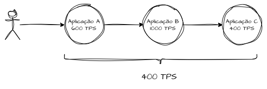

Como visto no capítulo sobre [performance, capacidade e escalabilidade](https://fidelissauro.dev/performance-capacidade-escalabilidade/),
gargalos são pontos em que o desempenho ou a capacidade ficam limitados por um
componente que não consegue lidar com a carga atual. Se completar uma transação
exige a resposta de três microsserviços, que processam respectivamente 400, 600 e
1.000 transações por segundo, o sistema fica limitado à menor taxa, ou seja, 400
TPS. O gargalo equivale ao mínimo entre as taxas de processamento envolvidas, e
exceder esse limite tende a gerar filas sistêmicas e pressão crescente sobre
processos, threads e dependências.

O gargalo atual é representado pelo componente com a menor taxa de processamento
(μ) em todo o fluxo. Identificá-lo é essencial para priorizar melhorias de forma
estratégica. Como já discutido, gargalos se movem com o tempo: uma otimização
local pode apenas deslocar o gargalo para outra parte subsequente do sistema.

# Planejamento de Capacidade

Esta seção propõe um roteiro aplicável de planejamento de capacidade, apoiado na
base teórica reunida ao longo do capítulo. A ideia é apresentar uma
"pseudo-estrutura" de um movimento de capacity planning que sirva como mapa
mental adaptável a diferentes cenários.

## Delimitar o Fluxo, Funcionalidades e Componentes

O primeiro passo é definir qual fluxo sistêmico será avaliado. Testar "o sistema"
inteiro de uma vez tende a gerar modelagens genéricas e pouco fiéis à realidade.
É preciso identificar funcionalidades, contratos, métodos de entrada, serviços
envolvidos, dados manipulados, respostas geradas e seus destinos.

Nessa fase, listamos todos os microsserviços, bancos, filas e tópicos, marcando
quais fluxos são síncronos, quais são assíncronos e como se comunicam. Esse passo
estabelece o escopo do throughput sistêmico, evitando análises locais
desconectadas da experiência real do usuário.

## Levantar as Estimativas de Carga

Com o fluxo definido, construímos a carga base usando as métricas já discutidas:
TPS médio, picos, perfis diários e semanais, além de datas e períodos sazonais
que indicam mudanças de comportamento e a intensidade dessas variações.

Também estimamos payloads, seus tamanhos e a banda trafegada nos perfis
levantados. Aqui surge a oportunidade de alinhar com produto e negócio as
expectativas de tempo de resposta e disponibilidade. Tornar esses indicadores
explícitos facilita avaliar se o capacity planning está adequado ou se há
subprovisionamento ou recursos ociosos em excesso.

Neste ponto, o objetivo não é precisão absoluta, mas ordem de grandeza. O modelo
inicial serve para responder "em que condições meu sistema opera hoje?", evitando
projeções desconexas ou irreais.

## Identificação do Throughput Individual dos Componentes e Serviços

Antes de projetar crescimento, é preciso entender os limites individuais de cada
componente relevante, identificando quais podem exercer pressão contrária, agravar
gargalos ou gerar curvas do joelho prematuras, e em que condições isso acontece.

Lidamos com variáveis como o TPS máximo sustentável do serviço, limites de
concorrência (threads, conexões e consumers) e a capacidade efetiva de cada
dependência (bancos, caches, brokers e APIs externas). Dependências externas
podem ser mockadas em ambientes controlados para não comprometer os testes de
limite operacional do serviço.

## Derivação do Throughput Sistêmico

A partir dos throughputs individuais, deriva-se o sistêmico aplicando
explicitamente a lógica do menor gargalo. Aqui respondemos: qual componente
limita a vazão hoje? O gargalo é rígido ou aceita escala horizontal dentro de uma
janela de tempo? Throughput, tempo de resposta e taxa de erro variam conforme o
tempo e as oscilações de tráfego dos perfis identificados?

Essa é uma das etapas mais importantes, pois a capacidade real emerge do
encadeamento entre os serviços, e não da análise isolada de cada componente.

## Levantamento da Projeção de Crescimento

Com a capacidade atual compreendida, o planejamento incorpora projeções, evitando
o erro clássico de assumir um único crescimento linear. É fundamental incluir os
times de negócio e, quando necessário, níveis executivos, para entender as
expectativas futuras.

O objetivo não é prever o futuro com precisão, mas entender até que ponto o
sistema atual sustenta os objetivos da empresa e identificar oportunidades de
melhoria para o horizonte planejado, evitando que a evolução ocorra de forma
reativa, já com a experiência do cliente degradada.

## Avaliar o Custo e as Margens Operacionais

Aqui o planejamento incorpora explicitamente custo e risco. A pergunta deixa de
ser "quanto o sistema aguenta" e passa a ser "quanto ele aguenta com
previsibilidade e custo aceitável para o negócio". Trabalhamos o impacto de
overprovisioning versus underprovisioning, quais regiões do ponto saudável são
aceitáveis em termos orçamentários e como isso se relaciona com a zona de
pré-joelho de throughput e latência.

Nessa etapa, a capacidade passa a ser tratada como orçamento, e não apenas como
limite técnico.

## Definição dos Limites Operacionais

O resultado do capacity planning não deve ser um único número de "quanto aguenta",
mas um conjunto de limites operacionais bem definidos: TPS sustentável,
`L(Alvo)`, latência máxima aceitável (em média e percentis) e taxa de erro máxima
tolerável. Essas definições precisam ser amplamente conhecidas pelos stakeholders
do produto, pois ajudam a antecipar quando uma reavaliação arquitetural será
necessária, alinhando orçamento e planejamento estratégico.

## Testes de Carga e Estresse

O último passo é validar na prática se o sistema atende aos requisitos e se possui
as parametrizações adequadas para escalar de forma dinâmica ou estática. Aqui
executamos testes de carga média (Average Load), estresse, spikes conhecidos e
breakpoint, para identificar quando o sistema ultrapassa o `L(Alvo)` e onde
entra em colapso.

Esses testes podem ser pontuais, mas o ideal é executá-los por períodos
prolongados, aproximando-se de cenários reais de operação. É fundamental coletar
evidências e documentar a capacidade real e, quando gargalos ou oportunidades
forem identificados, encaminhá-los ao backlog para tratamento e priorização.

# Referências

[Improving the performance of complex software is difficult, but understanding some fundamental principles can make it easier.](https://queue.acm.org/detail.cfm?id=1854041)

[Teoria das Filas](https://pt.wikipedia.org/wiki/Teoria_das_filas)

[Elementos das Teorias das Filas](https://www.scielo.br/j/rae/a/34fWxG9RqkRmd8spnbPfJnR/?format=html&lang=pt)

[Lei de Little (Little’s Law): A Ciência por Trás de Fazer Menos e Entregar Mais](https://br.k21.global/gestao-de-times-ageis/lei-de-little-littles-law-a-ciencia-por-tras-de-fazer-menos-e-entregar-mais)

[Little’s law](https://en-wikipedia-org.translate.goog/wiki/Little%27s_law?_x_tr_sl=en&_x_tr_tl=pt&_x_tr_hl=pt&_x_tr_pto=tc)

[Knee of a curve](https://en.wikipedia.org/wiki/Knee_of_a_curve)

[The “Knee” in Performance Testing: Where Throughput Meets the Wall](https://medium.com/@lahirukavikara/the-knee-in-performance-testing-where-throughput-meets-the-wall-904f90474346)

[A Capacity Planning Process for Performance Assurance of Component-Based Distributed Systems](https://dl.acm.org/doi/epdf/10.1145/1958746.1958784)

[Capacity Planner - Google](https://docs.cloud.google.com/capacity-planner/docs/overview)
