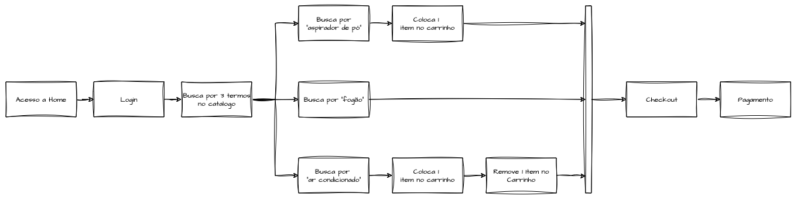
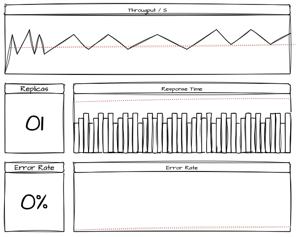
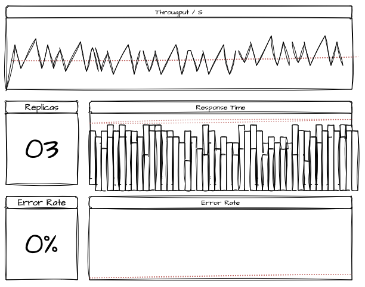
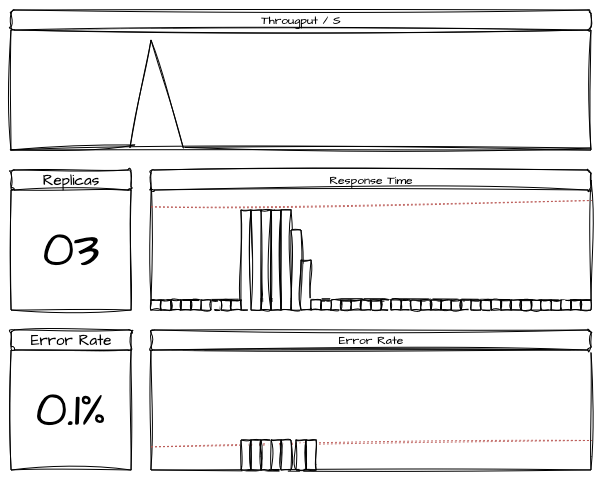
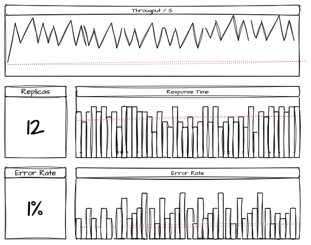
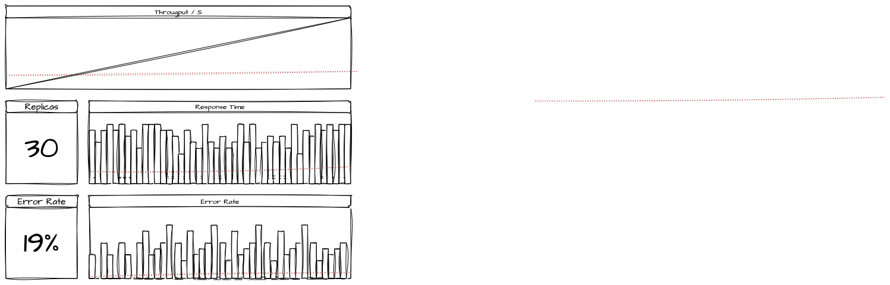

# System Design - Testes de Carga e Estresse

- [System Design - Testes de Carga e Estresse](#system-design---testes-de-carga-e-estresse)
- [Introdução](#introdução)
  - [A importância dos testes de performance](#a-importância-dos-testes-de-performance)
  - [A importância de conhecer comportamentos do sistema](#a-importância-de-conhecer-comportamentos-do-sistema)
  - [Testes de Performance em Build e Run](#testes-de-performance-em-build-e-run)
- [Testes de Carga e Estresse](#testes-de-carga-e-estresse)
- [Tipos de Teste](#tipos-de-teste)
  - [Teste de Fumaça, Smoke Tests](#teste-de-fumaça-smoke-tests)
  - [Teste de Average Load](#teste-de-average-load)
  - [Testes de Estresse](#testes-de-estresse)
  - [Testes de Spike](#testes-de-spike)
  - [Testes de Breakpoint](#testes-de-breakpoint)
- [Respondendo a Perguntas Chave](#respondendo-a-perguntas-chave)
    - [Qual é o trafego esperado do meu sistema hoje?](#qual-é-o-trafego-esperado-do-meu-sistema-hoje)
    - [Quais são meus objetivos de tempo de resposta, taxa de erros e saturação?](#quais-são-meus-objetivos-de-tempo-de-resposta-taxa-de-erros-e-saturação)
    - [Qual é o trafego esperado do meu sistema em períodos de pico?](#qual-é-o-trafego-esperado-do-meu-sistema-em-períodos-de-pico)
    - [Quais os protocolos e estímulos que minha aplicação é exposta?](#quais-os-protocolos-e-estímulos-que-minha-aplicação-é-exposta)
    - [Qual é a expectativa de crescimento do meu sistema?](#qual-é-a-expectativa-de-crescimento-do-meu-sistema)
    - [Qual é o cenário mais extremo que o sistema enfrentará?](#qual-é-o-cenário-mais-extremo-que-o-sistema-enfrentará)
  - [Quais são as funcionalidades principais que precisam ser testadas?](#quais-são-as-funcionalidades-principais-que-precisam-ser-testadas)
  - [Quais são as jornadas comuns do usuário?](#quais-são-as-jornadas-comuns-do-usuário)
  - [Quais os endpoints mais utilizados? E quais os mais caros?](#quais-os-endpoints-mais-utilizados-e-quais-os-mais-caros)
  - [Métricas em Testes de Performance](#métricas-em-testes-de-performance)
    - [Service Levels como objetivos esperados](#service-levels-como-objetivos-esperados)
- [Estratégias de pré-teste](#estratégias-de-pré-teste)
  - [Avaliando a capacidade individual de cada réplica](#avaliando-a-capacidade-individual-de-cada-réplica)
  - [Validação de unidade assíncrona](#validação-de-unidade-assíncrona)
- [Ferramental para Testes](#ferramental-para-testes)
  - [Grafana K6](#grafana-k6)
  - [Locust](#locust)
  - [Apache JMeter](#apache-jmeter)
  - [Gatling](#gatling)
  - [Oha / Ohayou](#oha--ohayou)
- [Modelo de Roteiro de Teste](#modelo-de-roteiro-de-teste)
  - [Relatório de Teste de Performance - Produto de Cobrança de Vendas - Time de Engenharia](#relatório-de-teste-de-performance---produto-de-cobrança-de-vendas---time-de-engenharia)
  - [1. Visão Geral](#1-visão-geral)
  - [2. Objetivos do Teste](#2-objetivos-do-teste)
    - [Metas:](#metas)
  - [3. Cenários de Teste](#3-cenários-de-teste)
    - [3.0. Pré-teste](#30-pré-teste)
    - [3.1. Cenário 1: Carga Média (Average Load)](#31-cenário-1-carga-média-average-load)
    - [3.2. Cenário 2: Carga de Pico (Spike Test)](#32-cenário-2-carga-de-pico-spike-test)
    - [3.3. Cenário 3: Stress Test](#33-cenário-3-stress-test)
    - [3.4. Cenário 4: Breakpoint](#34-cenário-4-breakpoint)
- [Referências](#referências)

> **Nota:** Este documento é um material de estudo baseado no artigo original **"System Design - Testes de Carga e Estresse"**, de **Matheus Fidelis**, publicado em [fidelissauro.dev/load-testing](https://fidelissauro.dev/load-testing/). As ilustrações pertencem ao autor original. Recomenda-se a leitura do artigo completo na fonte.

---

# Introdução

Testes de performance são fundamentais em sistemas de larga escala que precisam funcionar de maneira confiável e responsável. A ideia central deste material é apresentar os diferentes tipos de teste e, sobretudo, mostrar como construir um roteiro que tenha utilidade tanto para a engenharia quanto para o produto como um todo.

## A importância dos testes de performance

Apesar de nem sempre ser viável, testar performance deveria ser uma prática contínua ao longo de todo o ciclo de vida do software, do build à operação madura. É a forma mais prática e científica de descobrir os limites reais do sistema e de confirmar que ele cumpre os requisitos definidos.

Conhecidos os limites impostos pelo produto, os testes de carga, estresse e performance oferecem garantias pragmáticas de que os requisitos básicos de uso serão entregues. Isso permite estabelecer expectativas de capacidade de curto, médio e longo prazo. O propósito ao longo do texto é mostrar como projetar testes de maneira assertiva, dinâmica e adaptável a diferentes cenários, usando-os para formular e responder perguntas-chave sobre o produto.

## A importância de conhecer comportamentos do sistema

Documentar funcionalidades, lógicas e jornadas do sistema tem valor altíssimo, ainda que isso muitas vezes seja tratado como um cenário ideal. Compreender como, quando e com que frequência o cliente interage com o sistema ajuda a transformar funcionalidades em comportamentos e jornadas, revelando gargalos e oportunidades de melhoria.

Cada funcionalidade tem um perfil próprio. Um relatório gerencial de fechamento de caixa é computacionalmente caro, mas pouco frequente e concentrado em períodos previsíveis. Já o registro de vendas de um catálogo é muito mais frequente, porém geralmente leve em termos de processamento. Isso orienta a estratégia: testar a venda em escala (carga) e o relatório sob estresse, evitando cenários sem sentido como emitir milhares de relatórios em paralelo ou medir o sistema inteiro com uma única venda.

Mapear a jornada comum do cliente, por exemplo o caminho típico em um e-commerce (home, busca, navegação no catálogo, carrinho, cupom, login/cadastro feitos uma única vez, pagamento e consultas posteriores), permite modelar as transações injetadas com base em comportamento real. Disso extraímos insights úteis: busca e navegação acontecem muitas vezes, enquanto login, cadastro e preenchimento de dados ocorrem poucas vezes. Desenhar testes a partir desse comportamento agrega valor imediato à engenharia.

## Testes de Performance em Build e Run

Esses testes podem ocorrer em vários estágios do ciclo de vida do software. Para simplificar, dividimos em dois marcos: o **Build**, que corresponde à construção inicial e aos primeiros estágios (MVP e pós-MVP), e o **Run**, no qual a capacidade atual e desejada é revisitada continuamente para garantir que os requisitos não se deteriorem conforme o sistema evolui.

Na fase de Run os testes acontecem em ambientes mais realistas, como pré-produção ou mesmo produção, podendo ou não concorrer com o cliente final. O objetivo é submeter o sistema, de forma controlada, a cenários que simulam cargas reais ou extremas, descobrindo seus níveis de disponibilidade, resiliência e performance antes que esses dados apareçam de maneira reativa ou em meio a uma crise.

# Testes de Carga e Estresse

A terminologia em torno de testes de carga costuma gerar confusão sobre "o que serve para quê" e se realmente há diferença entre os termos. As diferenças existem e, compreendidas em sua natureza, ajudam a montar estratégias adequadas a cada cenário.

O teste de carga avalia como o sistema se comporta sob cargas reais e esperadas, servindo para garantir que estimativas e expectativas de produto sejam atendidas. Ele assegura as baselines recebidas pela engenharia: onboarding de clientes, volume de transações, contratos de disponibilidade, tempos de resposta, entre outros.

Por exemplo, se um produto precisa suportar 300 transações por segundo com resposta abaixo de 400ms, o teste de carga injeta exatamente esse tráfego e verifica o cumprimento dos requisitos. Quando há expectativa de crescimento (novos clientes ou aumento de X% em um período), o teste deve ser desenhado para acompanhar essa evolução gradual e identificar até que ponto o sistema atende antes de atingir um limite que comprometa as expectativas.

O teste de estresse avalia as mesmas dimensões, porém sob condições adversas: picos de acesso, cargas repentinas ou volumes muito superiores ao habitual. Seu objetivo é encontrar gargalos e limitações, normalmente aplicando uma carga bem acima da esperada. Ambos os cenários ajudam a localizar gargalos de capacidade, oportunidades de otimização, analisar recursos e simular o uso de dependências. A seguir, os principais tipos de teste aplicáveis a esses cenários.

# Tipos de Teste

Esta seção descreve alguns dos principais tipos de teste e o tipo de pergunta que cada um busca responder quando aplicado.

## Teste de Fumaça, Smoke Tests

Os smoke tests injetam uma carga mínima para verificar as principais funcionalidades sob a ótica de um tráfego básico, garantindo o funcionamento mínimo aceitável. São comumente executados em pipelines de CI/CD, integrando a cadeia de qualidade durante releases ou em automações periódicas em ambientes produtivos e pré-produtivos, gerando evidências de bom funcionamento.

A finalidade é validar se a aplicação está "pronta para ser testada" em cenários mais intensivos. O smoke test não faz análise detalhada de desempenho; ele apenas confirma que não há falhas críticas que impeçam o funcionamento básico, servindo como verificação inicial antes de testes mais profundos.

## Teste de Average Load

O Average Load avalia o comportamento do sistema sob a carga esperada por períodos longos, verificando se ele mantém a performance estabelecida. Diferente de cenários adversos ou mínimos, o foco é confirmar o bom funcionamento dentro dos limites esperados. Se a meta hipotética é de 400 transações por segundo com resposta de até 200ms, o teste injeta esse volume continuamente para detectar outliers ou comportamentos que comprometam a uniformidade da performance.

Os cenários ideais duram dias ou semanas, permitindo estudar todas as variações ocorridas e identificar padrões e correlações. Esse formato é especialmente útil para revelar problemas como memory leaks.

## Testes de Estresse

O termo "teste de estresse" é amplamente conhecido e frequentemente usado de forma genérica para outros tipos de teste. Seu objetivo específico, porém, é avaliar o comportamento do sistema sob condições extremas que excedem o fluxo normal esperado.

O foco principal é identificar gargalos, limites de capacidade e falhas de resiliência por meio da sobrecarga, sendo relevante quando se deseja entender como o sistema reage em eventos de alto tráfego ou picos inesperados de demanda.

Entre os indicadores comumente avaliados estão métricas de capacidade como CPU, memória, rede, I/O e o número de conexões nos pools do sistema e de suas dependências, analisados em conjunto para determinar o ponto de saturação.

As lições deste teste ajudam a identificar de forma proativa pontos de falha e oportunidades de melhoria, evitando que esses problemas surjam apenas em produção, já impactando o cliente. Os insights também revelam quais partes do sistema continuam operando durante falhas graves e se isso favorece ou atrapalha a recuperação completa.

## Testes de Spike

Os testes de spike podem ser vistos como variação ou complemento dos testes de estresse. Eles simulam picos repentinos de uso e mostram como o sistema reage a esse cenário. Podem ser programados durante um teste de estresse ou de breakpoint convencional, que aumentam a carga de forma progressiva, mas aqui o foco é uma progressão súbita seguida de uma redução rápida.

Esse tipo de teste valida a estabilidade do sistema e revela possíveis degradações momentâneas de desempenho. É especialmente valioso para sistemas que de fato sofrem aumentos repentinos e imprevisíveis de uso.

As lições aprendidas mostram como ajustar a arquitetura para absorver picos repentinos sem superdimensionar capacidade e infraestrutura. O objetivo é otimizar o uso dos recursos, lidando com picos inesperados sem comprometimento significativo de desempenho.

## Testes de Breakpoint

Os testes de breakpoint avaliam o comportamento sob tráfego progressivo por longos períodos com o objetivo de encontrar o ponto exato de quebra. Eles identificam o momento em que o sistema começa a falhar conforme a carga cresce, detectando degradação no tempo de resposta, aumento na taxa de erros e falhas críticas nos componentes.

A execução exige muito mais controle do que outros testes, pois o objetivo não é validar performance ou capacidade em cenários específicos, mas levar o sistema ao seu limite real.

Durante o breakpoint avaliam-se várias métricas de saturação (CPU, memória, latência, I/O, disco, rede, taxa de erros do serviço e de todas as dependências), o que permite identificar quais componentes falham primeiro e como ocorre a cascata de falhas. Normalmente também se analisam aqui as limitações das políticas de escalabilidade horizontal vigentes.

# Respondendo a Perguntas Chave

Um teste de performance ou estresse existe para responder perguntas específicas sobre o sistema. Apenas injetar carga, sem antes definir quais respostas se busca, não é eficiente nem em esforço nem em resultado. O teste precisa ser executado em condições que permitam compreender em detalhe, ou estimar por inferência, as capacidades do sistema ou de suas funcionalidades isoladas. Simular carga sem propósito gera resultados dispersos e de pouco valor.

Por isso, ainda que o planejamento seja mais demorado que a execução, é essencial alinhar expectativas e definir objetivos claros, de modo que os resultados realmente apoiem negócio e engenharia na tomada de decisões técnicas e na priorização.

### Qual é o trafego esperado do meu sistema hoje?

Quantos usuários simultâneos o sistema suporta? Quantas transações por segundo processa em média? Há picos em horários específicos? Essas são as primeiras perguntas ao planejar um teste eficiente. Em sistemas já em operação com observabilidade adequada, elas são facilmente respondidas pelas métricas existentes.

Se o sistema for novo, essas informações devem vir do time de produto, com base nos acordos com o cliente interno ou externo. Quando o volume ainda não é conhecido, ele precisa ser pesquisado e comunicado a todos os stakeholders envolvidos no desenvolvimento e na operação.

### Quais são meus objetivos de tempo de resposta, taxa de erros e saturação?

Conhecido o volume de uso, define-se quais são os limites aceitáveis de erro e o tempo de resposta ideal. Em vez de tratar o sistema como uma caixa preta com uma única média, é mais valioso medir por jornadas ou ações específicas, já que diferentes ações têm pesos e complexidades distintos. Mapear essas jornadas é interessante quando se deseja granularizar os resultados.

Com todas as jornadas mapeadas, é possível executar testes que simulam comportamentos heterogêneos, com vários usuários realizando ações distintas ao mesmo tempo, aproximando o cenário do uso real. Para que esses testes sejam válidos no contexto do produto, porém, os limites aceitáveis de erro e tempo de resposta precisam ser conhecidos, permitindo avaliar se os objetivos foram ou não atingidos.

### Qual é o trafego esperado do meu sistema em períodos de pico?

Definidos os baselines, é fundamental entender as variações esperadas ou estimadas no uso. Sistemas costumam ter fluxos previsíveis, mas não uniformes: um serviço de delivery, por exemplo, tem uso constante ao longo do dia com picos próximos do almoço e do jantar.

Compreender como esses picos se comportam e como afetam a experiência do cliente gera dados valiosos para testes de spike ou estresse, configurados para simular capacidades variáveis ou progressivas que reflitam os momentos de maior demanda ou os vales de acesso.

### Quais os protocolos e estímulos que minha aplicação é exposta?

Definidos objetivos de uso e limites de experiência, é preciso descer ao nível arquitetural e identificar os protocolos da aplicação, mapeamento essencial para escolher as ferramentas e processos de teste ideais.

A aplicação usa protocolos síncronos como HTTP, gRPC ou WebSockets? Está exposta a estímulos assíncronos como AMQP, Kafka, polling ou MQTT? O ideal é mapear todos os principais protocolos transacionais para que os testes reproduzam corretamente o comportamento real, usando as mesmas vias de comunicação do fluxo normal dos clientes.

### Qual é a expectativa de crescimento do meu sistema?

Atendidas as necessidades atuais, projetam-se testes de carga que considerem o crescimento natural, ajudando a responder até quando a capacidade atual será suficiente e quando precisará ser revisitada de forma proativa. Alinhada às expectativas do produto, essa abordagem é eficaz para projetar sistemas que cresçam de maneira saudável a longo prazo.

A comunicação clara entre produto e engenharia sobre planos de expansão, metas de vendas e onboarding de novos clientes é essencial. Esse alinhamento permite basear os testes em projeções reais, garantindo que o sistema esteja preparado para a demanda futura sem falhas ou degradação.

### Qual é o cenário mais extremo que o sistema enfrentará?

Mesmo entendendo o comportamento natural do sistema, é necessário considerar como ele reagiria em cenários ainda mais extremos. Isso é especialmente relevante em promoções, Black Friday, Natal e situações inesperadas que se deseja antecipar. Conhecer ou estimar esses extremos é uma das etapas mais críticas e interessantes do planejamento.

É tipicamente nesse estágio que se encontram os principais gargalos e pontos de melhoria, pois os limites são estressados além do normal. Estimar esses cenários ajuda a melhorar resiliência e escalabilidade e a preparar o sistema para tráfego incomum.

## Quais são as funcionalidades principais que precisam ser testadas?

Quais são as partes mais críticas (busca, detalhes de itens, carrinho, checkout, pagamento, consulta de dados cadastrais) que exigem maior atenção? Há funcionalidades que impactam diretamente o core e que devem ser testadas sob maior carga? Nesses casos, vale desenvolver testes isolados e direcionados antes de testar a jornada completa, principalmente quando o comportamento de partes específicas é alterado. Isso ajuda a detectar se uma mudança introduziu degradações ou trouxe melhorias, garantindo que as áreas mais sensíveis funcionem com eficiência mesmo sob alta demanda.

## Quais são as jornadas comuns do usuário?

Uma das melhores formas de formular testes de carga e estresse é simular jornadas completas, refletindo a experiência real. Em um e-commerce, o usuário segue o "fluxo feliz": acessa a home, faz login, realiza várias buscas, adiciona e remove itens do carrinho, inicia o checkout e finaliza o pagamento. Assim, racionalizamos o número de interações de forma realista, próxima ao uso real.

Em cenários mais assíncronos, como um sistema de pagamentos reativo estimulado por clientes internos com cobranças e estornos, aplica-se a mesma lógica. Sabendo que 50% das solicitações são cobranças por cartão, 30% por pagamento instantâneo, 15% por boleto e 5% por estorno, criamos mecanismos de teste que estimulam o sistema com essas mesmas proporções, refletindo o comportamento real dos usuários e clientes.

## Quais os endpoints mais utilizados? E quais os mais caros?

Mapear as jornadas também serve para identificar quais funcionalidades são mais usadas do que outras. No exemplo anterior, a pesquisa ocorre muito mais vezes que o checkout: o cliente navega por várias categorias e produtos, mas paga apenas uma vez. Além disso, uma ação de pagamento tende a ser computacionalmente mais cara que uma pesquisa, mesmo quando ambas estão otimizadas. Esse conhecimento é fundamental para decidir como e quando testar cada funcionalidade, priorizando as mais usadas e as mais onerosas, garantindo robustez e eficiência mesmo nas operações mais críticas.

## Métricas em Testes de Performance

Já discutimos "o que observar" durante os testes. Vale agora aproveitar ao máximo a movimentação que eles geram: criar dashboards, configurar alertas, gerar logs e correlacionar tudo em um único painel, numa abordagem de "Single Pane of Glass". A ideia é oferecer observabilidade centralizada, na qual múltiplos recursos de uma mesma jornada são monitorados em ordem lógica. Esse padrão facilita acompanhar recursos e aplicações afetadas durante o teste e serve de suporte contínuo para o monitoramento da saúde do produto em operação, usando uma grande iniciativa para resolver vários problemas de uma vez e otimizar o monitoramento de forma proativa e integrada.

### Service Levels como objetivos esperados

Como saber se "passei no teste"? Uma oportunidade adicional é transformar toda essa pesquisa multidisciplinar sobre requisitos e objetivos em Service Levels oficiais do processo, oferecendo uma estrela-guia para engenharia, negócios e arquitetura.

Se o teste determinou que a disponibilidade do checkout deve ser sempre superior a 99,99% e que concluir uma compra não deve ultrapassar 3 segundos, há a oportunidade de adotar essas métricas como os SLAs padrão do sistema. Esses parâmetros dão direção clara para o monitoramento diário e permitem criar alertas proativos, notificando a operação antes da quebra do contrato e minimizando o impacto aos usuários.

# Estratégias de pré-teste

Antes de executar um teste completo, vale avaliar a capacidade da aplicação de forma individual e isolada, obtendo insumos iniciais sobre como o teste deve se comportar. Testar um fluxo completo isoladamente antes de iniciar um teste de jornada traz mais segurança. A seguir, algumas condições valiosas como exercício pré-teste.

## Avaliando a capacidade individual de cada réplica

A validação de capacidade de unidade determina quanto uma única réplica suporta de carga. Esse teste deve preceder o escalonamento do número de réplicas, garantindo comportamento previsível em múltiplas instâncias e servindo de insumo para definir e validar políticas de autoscaling.

Comece com apenas uma réplica e aplique carga incremental até descobrir o limite que uma única réplica sustenta sem ofender tempo de resposta e erros, executando as requisições, eventos e mensagens que o sistema normalmente processaria. O objetivo é encontrar os limites de processamento, CPU, memória e outros recursos de uma única instância frente aos acordos de disponibilidade.

Num objetivo de 99% de disponibilidade respondendo em até 200ms, injeta-se carga em uma réplica até esses limites serem ofendidos. Se, hipoteticamente, a réplica atende até 10 transações por segundo sem quebrar os SLAs, adiciona-se outra réplica e tenta-se chegar a 20 TPS; comprovando-se, adiciona-se mais uma e tenta-se 30 TPS. Repetindo o processo, chega-se à prova de que o limite de cada réplica é de cerca de 10 transações cada.

Esse teste pode prosseguir até encontrarmos um ponto em que o poder computacional deixa de ser o principal gargalo e este passa a ser uma próxima dependência.

## Validação de unidade assíncrona

Em cenários assíncronos que processam eventos ou mensagens, há um passo adicional ainda unitário: verificar como uma única réplica consome e processa mensagens, qual é sua vazão de processamento e se ela respeita os limites de capacidade.

Começamos represando um grande número de mensagens ou eventos nas filas ou tópicos. Iniciamos uma única réplica e observamos o throughput e como ela lida sozinha com esse volume. O foco é verificar se a aplicação gerencia a carga e evita sobrecarregar a si mesma, consumindo mais mensagens do que consegue processar e elevando memória, CPU e throughput a ponto de matar o processo. Em termos simples, mesmo com um lag muito alto, a aplicação deve consumir apenas a vazão programada sem morrer.

# Ferramental para Testes

A seguir, uma visão das ferramentas de teste de performance e estresse mais populares atualmente.

## Grafana K6

O [Grafana K6](https://github.com/grafana/k6) é uma ferramenta simples e intuitiva de teste de carga, voltada a reduzir a carga cognitiva dos desenvolvedores. Escrita em Go e focada no protocolo HTTP, permite simular cenários com muitas conexões simultâneas em HTTP, WebSocket e gRPC. É bastante usada em pipelines de CI/CD pela fácil integração, oferece integração nativa com o Grafana para dashboards em tempo real e seus testes são escritos em JavaScript.

## Locust

O [Locust](https://github.com/locustio/locust) testa performance e escalabilidade de aplicações web simulando o comportamento de vários usuários virtuais. Escrito em Python, permite definir cenários para protocolos como HTTP, HTTPS e WebSocket.

## Apache JMeter

O Apache JMeter é uma das ferramentas mais conhecidas para testes de carga, performance e estresse. Suporta uma ampla variedade de protocolos (HTTP, JDBC, SOAP, REST, gRPC, TCP e mensageria como MQTT) e simula diversos tipos de tráfego e transações, sendo ideal para aplicações web, APIs e sistemas distribuídos. Sua flexibilidade e ampla gama de protocolos o tornam muito utilizado, sobretudo para roteiros complexos.

## Gatling

O Gatling é uma ferramenta poderosa escrita em Scala, projetada para testar sistemas distribuídos e aplicações de alta performance. Oferece suporte nativo a HTTP, WebSocket, JMS, Kafka e gRPC, sendo muito usada para avaliar escalabilidade e resiliência, com cenários detalhados e relatórios avançados de desempenho.

## Oha / Ohayou

Oha, também conhecido como Ohayou, é uma ferramenta simples e leve para testar performance de APIs e serviços web. Focada em simplicidade e velocidade, usa principalmente HTTP e HTTPS para simular requisições em alta velocidade, reportando latência, throughput e erros. Sua leveza e interface minimalista a tornam prática para testes rápidos e diretos.

# Modelo de Roteiro de Teste

Esta seção final compila os tópicos anteriores em um documento inicial e extensível, pensado para ser intuitivo o bastante para que o leitor compreenda a proposta e a adapte às necessidades da sua empresa ou produto. O modelo é apresentado como um relatório de exemplo (um produto fictício de cobrança de vendas) e organiza o roteiro em três blocos principais: visão geral, objetivos e cenários de teste. As subseções a seguir mantêm os títulos do template original; em vez de reproduzir todo o relatório preenchido, descrevemos o propósito e a estrutura de cada parte.

---

## Relatório de Teste de Performance - Produto de Cobrança de Vendas - Time de Engenharia

Cabeçalho do relatório de exemplo, que identifica o produto e o time responsável pelo teste. Funciona como título do documento e contextualiza o cenário fictício usado para ilustrar o roteiro.

---

## 1. Visão Geral

Registra os metadados essenciais do teste: data, aplicação ou jornada avaliada (no exemplo, o checkout de cartão de crédito), versão, ambiente (produção, pré-produção ou desenvolvimento) e as ferramentas utilizadas. Serve para situar rapidamente quem lê o relatório.

---

## 2. Objetivos do Teste

Descreve a finalidade do teste — no exemplo, avaliar um novo microsserviço de checkout para garantir os SLAs de produto e encontrar oportunidades de otimização de gargalos.

### Metas:

Lista as metas quantitativas a serem verificadas, normalmente expressas em tempo de resposta (por exemplo, abaixo de 800ms no p95), throughput mínimo (TPS para um dado número de usuários), taxa de erros aceitável (inferior a 0,1%) e validação das políticas de escalabilidade horizontal sem degradação.

---

## 3. Cenários de Teste

Agrupa os diferentes cenários executados. Cada cenário descreve objetivo, carga simulada, protocolos testados, duração, expectativas, resultados observados e evidências (capturas de telas e gráficos).

### 3.0. Pré-teste

Valida a capacidade de uma única réplica antes de escalar, confirmando que ela suporta o tráfego sem degradação e mantém CPU e memória dentro de limites aceitáveis. Inclui evidência do experimento inicial.

---

### 3.1. Cenário 1: Carga Média (Average Load)

Avalia o comportamento sob carga média constante por um período prolongado, verificando se tempo de resposta médio, p95 e taxa de erro permanecem dentro do esperado, sem sinais de sobrecarga.

---

### 3.2. Cenário 2: Carga de Pico (Spike Test)

Simula os picos dos principais horários de compra para observar como o sistema reage a aumentos repentinos, registrando eventual aproximação dos limites de tempo de resposta e pequenas degradações em componentes específicos.

---

### 3.3. Cenário 3: Stress Test

Aplica carga acima do previsto, aumentando o número de usuários em intervalos regulares, para identificar a partir de que ponto os limites de produto são ofendidos. No exemplo, revela oportunidades de otimização em queries de banco de dados resolvidas com a criação de um novo índice.

---

### 3.4. Cenário 4: Breakpoint

Aumenta a carga de forma incremental até encontrar o ponto de quebra, documentando em quais níveis de usuários ativos o p95 sobe, os erros por timeout crescem e, por fim, ocorrem falhas em cascata com travamento dos bancos de dados.

# Referências

[Breakpoint testing: A beginner’s guide](https://grafana.com/blog/2024/01/30/breakpoint-testing/)

[What is load testing?](https://grafana.com/load-testing/)

[How to do Load Testing? [A FULL GUIDE]](https://luxequality.com/blog/how-to-do-load-testing/)

[Teste de Desempenho vs. Teste de Estresse vs. Teste de Carga](https://www.loadview-testing.com/pt-br/blog/teste-de-desempenho-vs-teste-de-estresse-vs-teste-de-carga/)

[Spike Testing](https://grafana.com/blog/2024/01/30/spike-testing/)

[Application Break Point Test](https://www.perfmatrix.com/application-break-point-test/)

[Load Test Types](https://dev.to/eminetto/load-test-types-5b5m)

[What is single pane of glass?](https://www.ibm.com/topics/single-pane-of-glass)

[JMeter](https://jmeter.apache.org/)

[Grafana K6](https://grafana.com/docs/k6/latest/)

[Gatling](https://docs.gatling.io/)

[Locust Testing Tool](https://docs.locust.io/en/stable/)

[Oh/Ohayou](https://github.com/hatoo/oha)

[Cassowary](https://github.com/rogerwelin/cassowary)
