# System Design - Bulkhead Pattern

- [System Design - Bulkhead Pattern](#system-design---bulkhead-pattern)
- [Definindo Bulkheads](#definindo-bulkheads)
  - [Bulkheads e a Engenharia Naval](#bulkheads-e-a-engenharia-naval)
  - [Bulkheads e a Arquitetura de Software](#bulkheads-e-a-arquitetura-de-software)
- [Implementações e Contenção de Falhas](#implementações-e-contenção-de-falhas)
  - [Recursos Lógicos](#recursos-lógicos)
  - [Recursos Físicos](#recursos-físicos)
- [Distribuição de Bulkheads e Blast Radius](#distribuição-de-bulkheads-e-blast-radius)
- [Bulkheads e Shardings](#bulkheads-e-shardings)
  - [Bulkheads de Sharding Funcional](#bulkheads-de-sharding-funcional)
  - [Bulkheads de Sharding Operacional](#bulkheads-de-sharding-operacional)
- [Arquiteturas de Bulkheads](#arquiteturas-de-bulkheads)
  - [Bulkheads por Priorização](#bulkheads-por-priorização)
  - [Bulkheads por Criticidade](#bulkheads-por-criticidade)
  - [Bulkheads por Tipo de Uso](#bulkheads-por-tipo-de-uso)
  - [Bulkheads por Segmento](#bulkheads-por-segmento)
  - [Bulkheads por Hashing Consistente](#bulkheads-por-hashing-consistente)
  - [Bulkheads por Tenants](#bulkheads-por-tenants)
    - [Noisy Neighbor e Bulkheads Tenants](#noisy-neighbor-e-bulkheads-tenants)
- [Referências](#referências)

> **Nota:** Este documento é um material de estudo baseado no artigo original
> **"System Design - Bulkhead Pattern"**, de **Matheus Fidelis**, publicado em
> [fidelissauro.dev/bulkheads](https://fidelissauro.dev/bulkheads/).
> As ilustrações pertencem ao autor original. Recomenda-se a leitura do artigo
> completo na fonte.

---

O conceito de **Bulkhead** aparece de forma recorrente ao longo de vários temas
de System Design, e a proposta aqui é consolidá-lo de ponta a ponta. Ao falar de
bulkheads, percorremos um espectro grande de aplicações: das mais baixas, no
nível de runtime e pools de recursos, até decisões amplas de arquitetura que
segmentam operações, domínios e clientes. A ideia é entender as capacidades
desse padrão, sempre pesando seus ganhos e seus custos.

# Definindo Bulkheads

O **Bulkhead Pattern** é, na essência, um padrão de **contenção de falhas**. Seu
foco não é evitar que falhas ocorram — algo impossível em sistemas distribuídos
— mas impedir que um problema localizado se alastre e derrube o sistema inteiro.
A premissa é que falhas são inevitáveis e, por isso, precisam ser previstas,
delimitadas e absorvidas em diferentes dimensões da arquitetura.

O cerne do padrão não está em retries, timeouts ou fallbacks, e sim na
**separação explícita dos destinos de execução**. Bem aplicado, o sistema deixa
de ser um bloco único e homogêneo e passa a se comportar como um conjunto de
compartimentos independentes, cada um com capacidade, escalabilidade, limites e
impacto próprios e bem definidos.

## Bulkheads e a Engenharia Naval

A palavra **Bulkhead** vem da engenharia naval. São as paredes internas que
dividem o casco de um navio em compartimentos estanques. Se o casco é perfurado,
apenas o compartimento atingido inunda, preservando a flutuabilidade do restante
da embarcação. O objetivo nunca foi impedir o dano em si, mas conter sua
propagação e evitar o naufrágio completo. Esse mesmo raciocínio foi transposto
para a engenharia de software como um padrão a ser estudado e aplicado em
sistemas críticos de grande escala.

## Bulkheads e a Arquitetura de Software

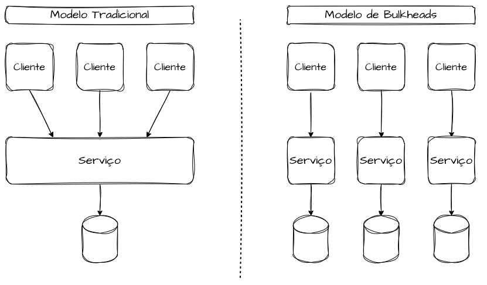

No software, o Bulkhead é um padrão de resiliência muito associado a
microsserviços, cujo propósito é isolar falhas para que um problema em um
componente não comprometa o todo. Na prática, ele representa uma separação
explícita e delimitada de recursos e de destinos de execução de transações,
segregando pools específicos para evitar que a saturação de um componente
contamine outros domínios ou segmentos de clientes.

Um equívoco comum é supor que bulkheads vivem em apenas uma camada do sistema.
Sistemas verdadeiramente resilientes aplicam o princípio de isolamento de forma
consistente por toda a stack. É frequente ver separação no nível da aplicação,
mas com banco de dados, filas ou tópicos ainda compartilhados — o que enfraquece
o isolamento.

O padrão pode incidir sobre diversas dimensões: pools de threads, filas,
tópicos, pools de conexão, bancos, VMs, containers, clusters ou shards. A regra
prática é simples: se dois fluxos compartilham os mesmos recursos, conexões ou
databases, eles **não têm bulkhead**, porque a falha de um inevitavelmente
respinga no outro. Aplicado corretamente, o sistema passa a se comportar como
partições independentes, cada uma com seus limites e seus usuários bem definidos.

# Implementações e Contenção de Falhas

Bulkheads podem ser implementados em diferentes camadas, mas todos buscam o
mesmo fim: impedir que a saturação de um recurso consuma a capacidade global do
sistema. Para isso, é preciso ter clareza sobre quais recursos são finitos,
quais são críticos e como devem ser particionados — e, a partir disso, definir
formas de identificar, redirecionar, redistribuir e monitorar tráfego e
operações dentro de cada compartimento.

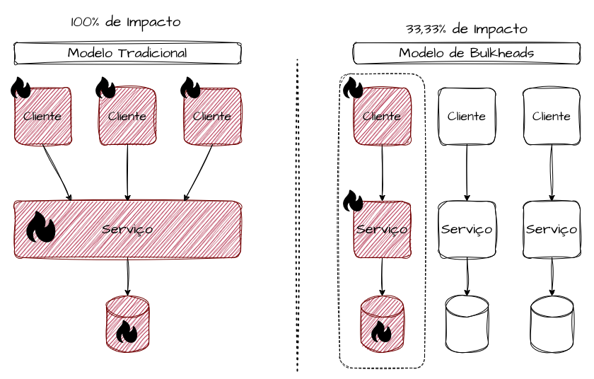

## Recursos Lógicos

Os bulkheads **lógicos** atuam sobre recursos de execução e concorrência —
threads, filas, conexões e limites de requisição. São os mais comuns e, ao mesmo
tempo, os mais frequentemente mal implementados.

Um exemplo clássico é o uso de thread pools dedicados por tipo de operação. Sem
bulkhead, uma operação lenta ou bloqueante pode esgotar todas as threads
disponíveis, gerando gargalos e filas internas. Com pools dedicados, a falha
fica confinada ao fluxo que a originou. O mesmo vale para filas e tópicos
independentes por domínio, evitando que um pico de mensagens não críticas atrase
ou bloqueie o processamento de eventos essenciais.

É comum confundir bulkheads lógicos com rate limiting ou limites globais de
concorrência. A diferença está no escopo do impacto: um limite global protege o
sistema como um todo, mas não protege os fluxos críticos uns dos outros. O
bulkhead lógico cria **fronteiras internas**, em que cada fluxo opera dentro de
sua própria capacidade alocada.

No dia a dia, isso aparece como pools separados para leitura e escrita, filas
distintas para eventos críticos e não críticos, ou executores dedicados a
integrações externas sabidamente instáveis. Um serviço que consome várias APIs
de terceiros não deveria permitir que a lentidão de uma delas consuma os
recursos das operações internas — cada integração é uma superfície de risco
distinta e merece seu próprio compartimento lógico.

## Recursos Físicos

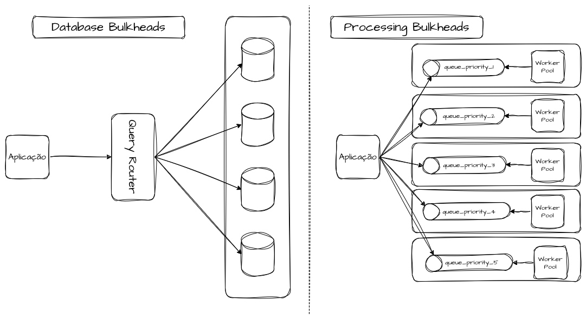

Os bulkheads **físicos** envolvem a separação concreta de infraestrutura:
servidores, nodes, instâncias, zonas de disponibilidade ou até regiões. O
isolamento passa a ser estrutural. Colocar workloads críticos e não críticos nos
mesmos nós cria um *shared fate* implícito — a saturação de CPU ou memória por um
workload pode derrubar todos os demais. Separar esses workloads em pools de nós
distintos é mais caro, mas entrega garantias muito mais fortes, sobretudo em
sistemas de alta criticidade.

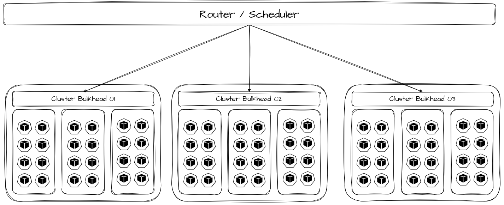

Esse cenário fica evidente em clusters Kubernetes, ambientes de virtualização ou
servidores *bare metal*. Um workload mal dimensionado, com vazamento de memória
ou comportamento não linear sob carga, pode pressionar o kernel, o scheduler ou
o hypervisor e afetar todos os serviços coalocados. Nesse ponto, nenhuma fila ou
thread pool dedicada resolve — é preciso segregação física. O critério pode
variar: tipo de cliente, segmento, prioridade, criticidade, hashing consistente,
identificadores, etc. Decisões como clusters distintos para domínios com SLOs
incompatíveis ou isolamento por região elevam o custo, mas reduzem
drasticamente o blast radius.

# Distribuição de Bulkheads e Blast Radius

A maneira como os shards são definidos, roteados e balanceados determina
diretamente o tamanho do **blast radius**, o comportamento sob sobrecarga e a
previsibilidade da degradação. Em arquiteturas mais avançadas, o sharding deixa
de ser apenas um detalhe de armazenamento ou roteamento e se torna um mecanismo
primário de isolamento operacional.

Cada shard funciona, na prática, como um bulkhead completo ou parcial — com
capacidade, limites e curva de degradação próprios. Distribuir bem esses shards
transforma falhas sistêmicas em falhas estatisticamente localizadas: em vez do
binário "o sistema caiu", passamos ao probabilístico "X% do sistema foi
impactado".

Quanto mais shards, menor o blast radius, porém maior a complexidade
operacional. E o ponto decisivo não é apenas o número de shards, mas **como o
tráfego é distribuído entre eles**. Distribuições mal balanceadas, chaves de
particionamento enviesadas ou roteamento instável podem concentrar carga em
poucos shards e anular completamente o efeito do bulkhead.

# Bulkheads e Shardings

O sharding é uma das formas mais poderosas — e mais perigosas — de implementar
bulkheads. Bem projetado, oferece isolamento estrutural; mal projetado, cria
acoplamentos invisíveis que só se manifestam sob estresse. A ideia é segregar
todos os recursos físicos que compõem o bulkhead (balanceadores, aplicações,
bancos, tópicos, filas) e criar réplicas dedicadas, de modo que um fluxo iniciado
em uma partição permaneça nela até o fim da execução, sem oferecer risco às
demais. Cada outro bulkhead deve ser capaz de executar as mesmas funções, mas com
capacidade isolada para outros públicos e operações.

São especialmente úteis para lidar com o **comportamento não linear** de sistemas
sob carga crescente. Próximo da saturação, pequenas variações de tráfego podem
provocar saltos desproporcionais de latência, consumo de memória, *lock
contention* ou pressão sobre o scheduler. Sem bulkheads, esse efeito tende a se
espalhar em cascata, fazendo fluxos saudáveis degradarem por compartilharem
recursos finitos. Como complemento às estratégias de sharding, os bulkheads
elevam os patamares de performance e disponibilidade.

## Bulkheads de Sharding Funcional

No sharding **funcional**, o sistema é dividido por funcionalidades e padrões de
uso. Cada shard atende a um conjunto específico de funções, com recursos e
limites próprios. Separar pagamentos, consultas e relatórios em shards distintos,
por exemplo, evita que um pico analítico degrade operações transacionais
críticas — aqui o bulkhead se alinha ao valor de negócio.

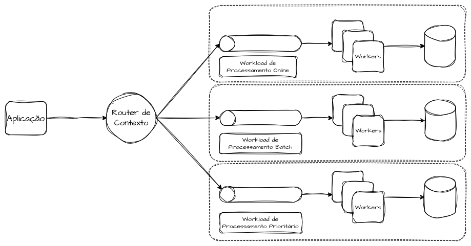

Uma aplicação comum é separar operações transacionais e *just-in-time* do
processamento de lotes e *batches*. Despejar uma carga gigante de processos em
repouso para concorrer com fluxos que têm contratos de tempo de resposta e
disponibilidade pode saturar o sistema e ferir os indicadores. Faz sentido,
portanto, dedicar infraestrutura para *batches* e sincronizações agendadas e
manter outra separada para as operações convencionais.

Outra estratégia é dedicar infraestrutura a diferentes prioridades de
processamento do mesmo tipo de transação — capacidade exclusiva para prioridade
alta, normal e baixa. Assim, um *spike* de solicitações normais ou de baixa
prioridade não compromete o bulkhead reservado à alta prioridade.

## Bulkheads de Sharding Operacional

No sharding **operacional**, a divisão se dá por volume ou características de
carga, não por função. Exemplos típicos: sharding por identificador de cliente,
por região ou por faixa de tráfego.

Esse modelo é eficaz para limitar o blast radius de picos localizados, mas exige
cuidado com operações globais, que podem atravessar múltiplos shards e
reintroduzir acoplamento. É comum que shards comecem bem isolados e, com o tempo,
passem a compartilhar dependências globais — serviços de configuração, catálogos
ou bancos auxiliares. Esses pontos viram canais ocultos de acoplamento.

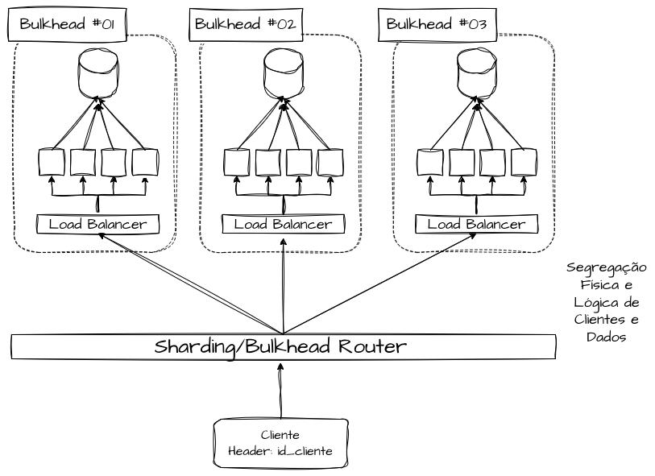

# Arquiteturas de Bulkheads

Nesta seção são ilustradas algumas possibilidades de segregação estrutural de
bulkheads na arquitetura de software, apresentando estratégias para dedicar e
isolar capacidade conforme contextos comuns do dia a dia. Vários desses pontos já
apareceram antes, mas aqui ganham uma recapitulação estruturada das estratégias.

## Bulkheads por Priorização

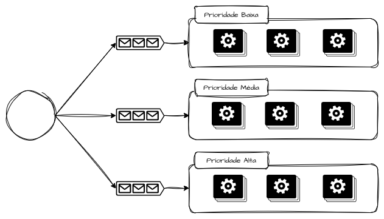

Bulkheads por **priorização** partem do princípio de que nem toda transação tem o
mesmo valor sistêmico. A ideia é reservar capacidade para fluxos de diferentes
prioridades, evitando que filas FIFO, pools compartilhados ou aplicações
generalistas colapsem sob *bursts* e façam requisições críticas concorrerem e se
atrasarem por causa de requisições menos relevantes.

Na prática, esse padrão aparece em sistemas financeiros, plataformas de pedidos e
serviços de autenticação, em que escrita transacional, confirmação de pagamento
ou autenticação de sessão não podem ser impactadas por cargas secundárias como
reprocessamentos, sincronizações ou integrações assíncronas pesadas.

## Bulkheads por Criticidade

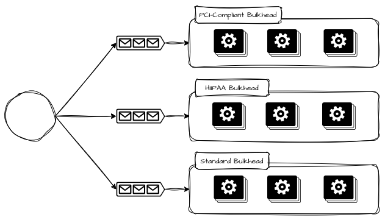

Bulkheads por **criticidade** vão além da prioridade momentânea e refletem o
impacto sistêmico da falha de um fluxo. Se a priorização responde "o que deve ser
atendido primeiro?", a criticidade responde "o que não pode falhar?". É possível
replicar e alocar capacidade para clientes que precisam estar em infraestruturas
auditadas por regulamentações específicas — como PCI Compliance, certificações
ISO ou HIPAA — atendendo a critérios de isolamento e auditabilidade próprios de
cada necessidade.

## Bulkheads por Tipo de Uso

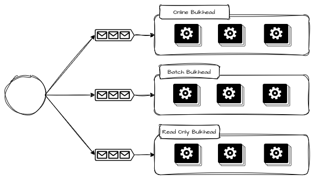

Bulkheads por **tipo de uso** surgem quando o mesmo sistema atende padrões de
carga radicalmente diferentes, permitindo separar fluxos interativos, síncronos e
sensíveis à latência de fluxos *batch*, assíncronos ou orientados a throughput.
Esses perfis têm curvas de comportamento opostas: operações interativas exigem
baixa latência, previsibilidade e rejeição rápida sob sobrecarga, enquanto
operações *batch* toleram latência alta mas consomem recursos de forma agressiva
e prolongada. Quando compartilham os mesmos recursos, o comportamento *batch*
tende a dominar e degradar silenciosamente os fluxos interativos.

A ideia não é "otimizar" o *batch*, mas impedir que ele concorra estruturalmente
com operações sensíveis. Isso costuma aparecer como filas, workers, clusters ou
até pipelines de deploy distintos por tipo de uso. O *batch* pode atrasar,
acumular ou ser pausado sem que isso altere o SLO das operações online.

## Bulkheads por Segmento

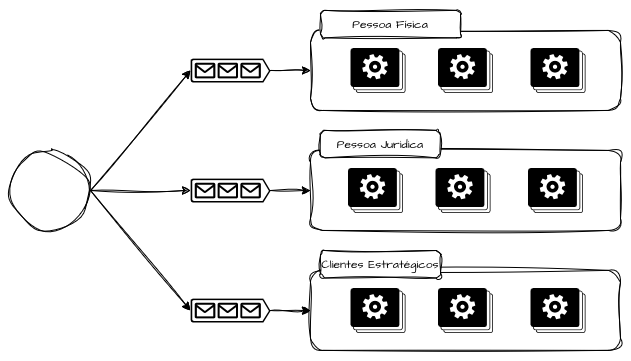

Bulkheads por **segmento** tratam da heterogeneidade de comportamento entre
grupos de usuários, clientes ou regiões. Clientes enterprise, parceiros
estratégicos ou segmentos regulados não deveriam compartilhar o mesmo destino
operacional de usuários experimentais, testes A/B ou integrações instáveis.

Sistemas que atendem públicos diversos podem segmentar capacidade para lidar com
diferenças de criticidade e expectativa — pessoa física, pessoa jurídica,
pessoas politicamente expostas, clientes prioritários. Assim, em uma contenção de
falhas, nem todos os segmentos são afetados ao mesmo tempo. Isso ainda abre
espaço saudável para negociação de SLOs, precificação diferenciada e evolução
independente de capacidade.

## Bulkheads por Hashing Consistente

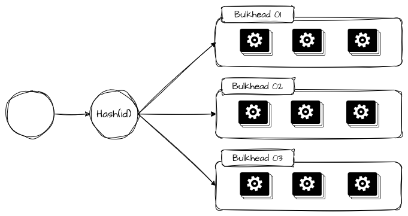

Bulkheads por **hashing consistente** são a forma mais estatística de aplicar
isolamento operacional quando o objetivo é distribuir carga e isolar parcelas de
falha de modo determinístico. Via algoritmo de roteamento, proxy ou roteador,
utiliza-se uma chave estável (tenantId, customerId, accountId, deviceId) para
enviar sempre as solicitações ao mesmo conjunto de recursos.

Em balanceamentos clássicos (*round-robin*, *least-connections*), um pico
localizado de um único cliente "vaza" para toda a frota, já que o balanceador
distribui indiscriminadamente. Com hashing consistente, esse pico fica
concentrado apenas no(s) shard(s) ao(s) qual(is) o cliente foi mapeado.

## Bulkheads por Tenants

Isolar tenants vai muito além de separar seus dados em tabelas ou instâncias
distintas. Trata-se de garantir que o consumo, os erros ou os picos de um tenant
não alterem o perfil operacional dos demais. Em plataformas SaaS, isso costuma
significar limites explícitos de capacidade por tenant, combinando bulkheads
lógicos e físicos conforme o nível de criticidade e de monetização.

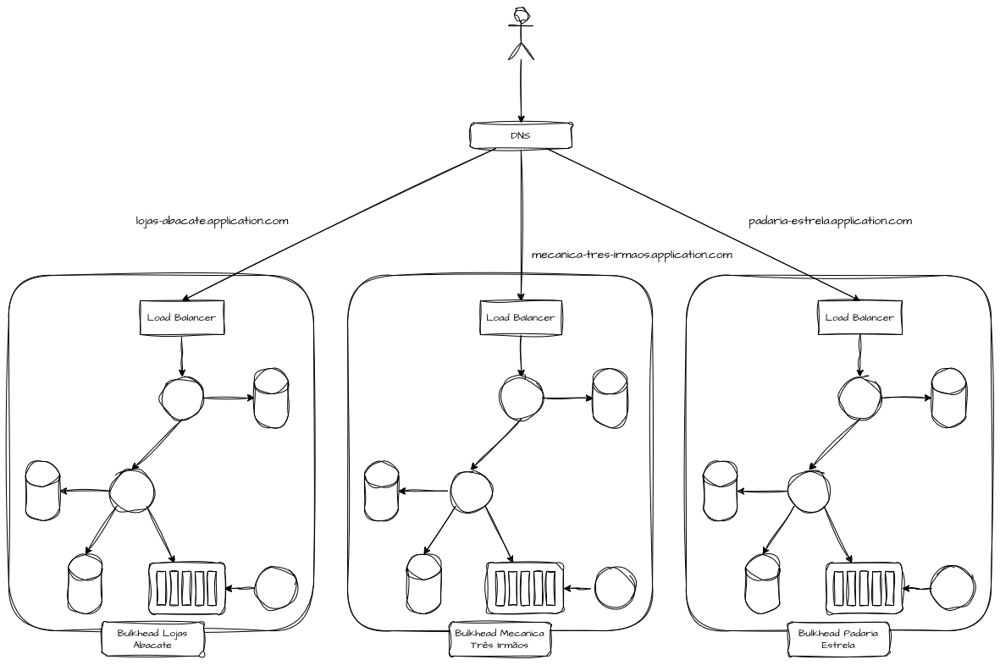

É possível ter réplicas inteiras de infraestrutura dedicadas a cada tenant,
roteadas por regras de balanceamento, ingress ou DNS, isolando totalmente a
operação para evitar *noisy neighbor*. No mundo real, muitas plataformas isolam
dados mas compartilham threads, filas e infraestrutura — e basta um cliente com
comportamento anômalo para comprometer toda a experiência. Bulkheads por tenant
transformam esse risco em um problema localizado, com degradação previsível,
mensurável e negociável do ponto de vista de negócio.

### Noisy Neighbor e Bulkheads Tenants

O problema do **noisy neighbor** (vizinho barulhento) surge quando múltiplos
tenants compartilham os mesmos recursos físicos e lógicos e o comportamento de um
prejudica os demais. Sem bulkheads, basta um tenant fora do padrão, com saturação
acima do previsto, para degradar a plataforma inteira.

Esse problema é especialmente crítico em plataformas SaaS e ambientes
multi-tenant de alta escala, onde a quantidade de clientes compartilhando a mesma
base amplifica o risco.

# Referências

[Bulkhead Pattern — Distributed Design Pattern](https://medium.com/nerd-for-tech/bulkhead-pattern-distributed-design-pattern-c673d5e81523)

[Bulkhead Pattern in Microservices](https://www.systemdesignacademy.com/blog/bulkhead-pattern)

[Bulkhead pattern](https://learn.microsoft.com/en-us/azure/architecture/patterns/bulkhead)

[Building a fault tolerant architecture with a Bulkhead Pattern on AWS App Mesh](https://aws.amazon.com/blogs/containers/building-a-fault-tolerant-architecture-with-a-bulkhead-pattern-on-aws-app-mesh/)

[Bulkhead Pattern](https://www.geeksforgeeks.org/system-design/bulkhead-pattern/)

[Failsafe - Bulkhead Go](https://failsafe-go.dev/bulkhead/)
