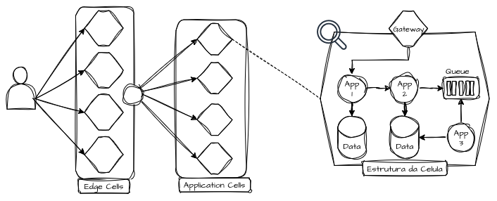
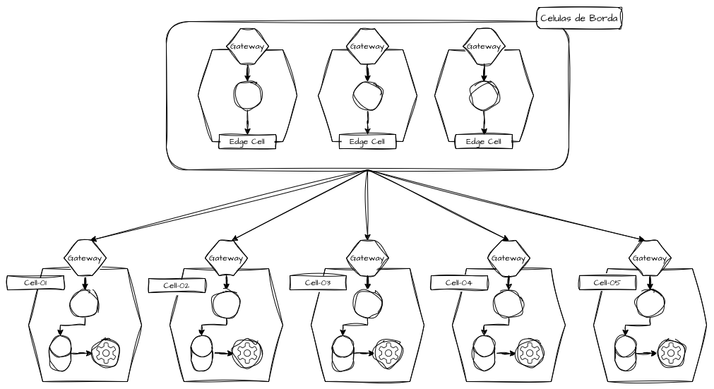
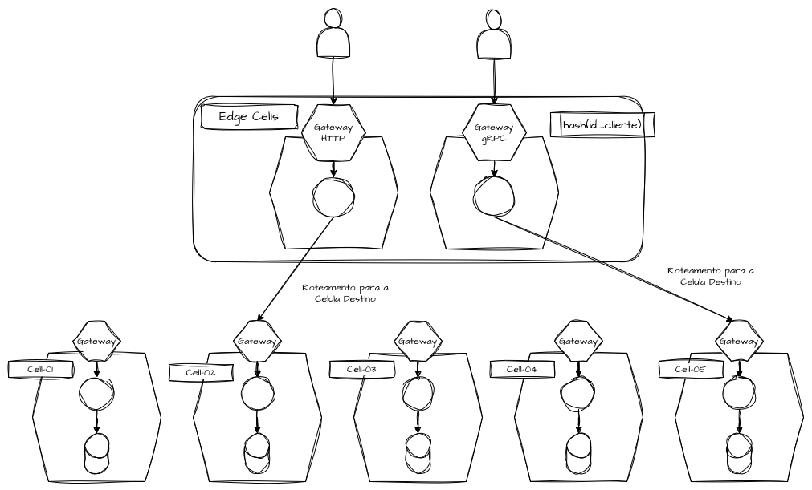
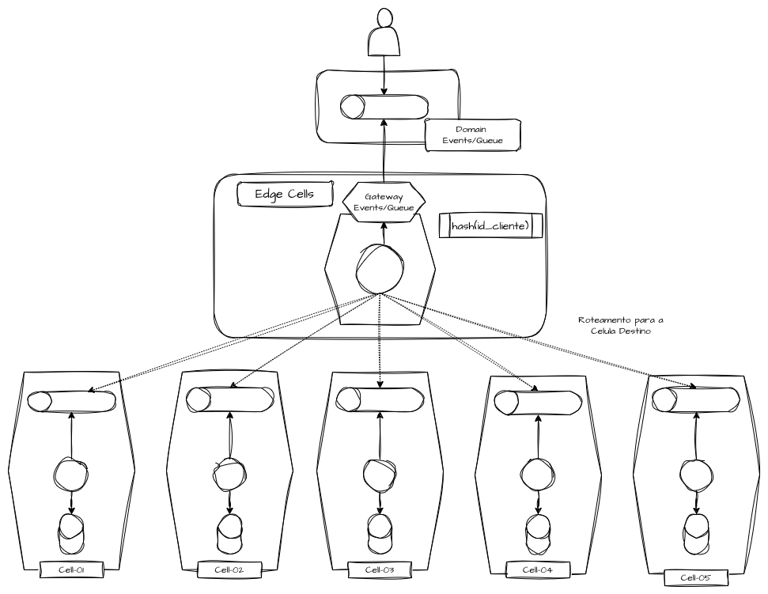
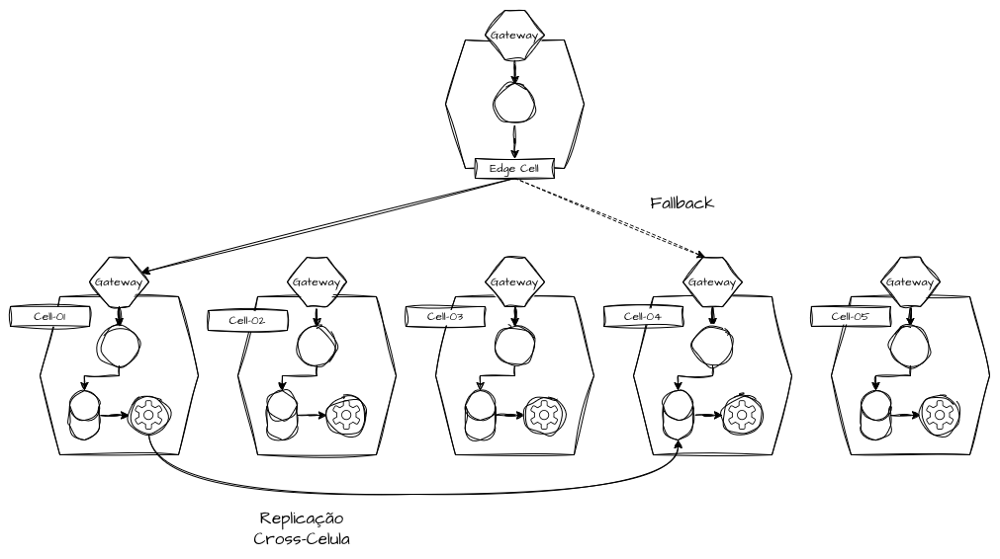
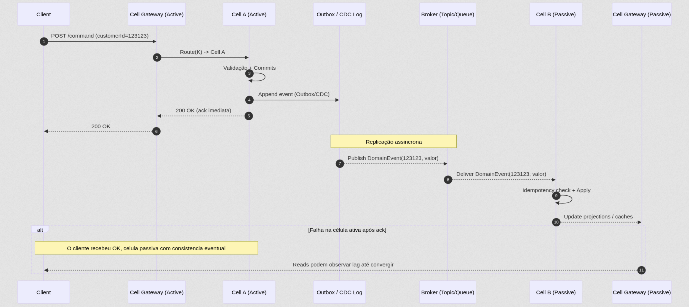
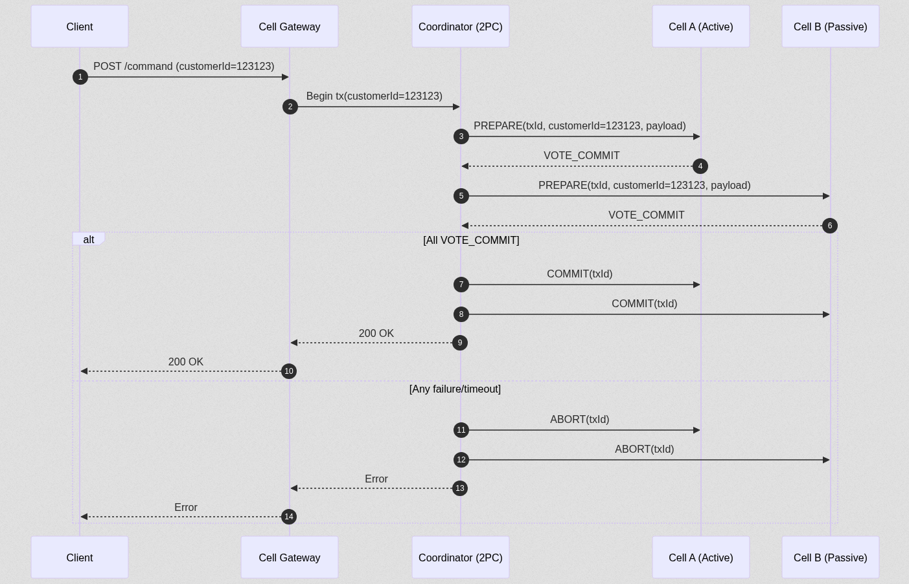
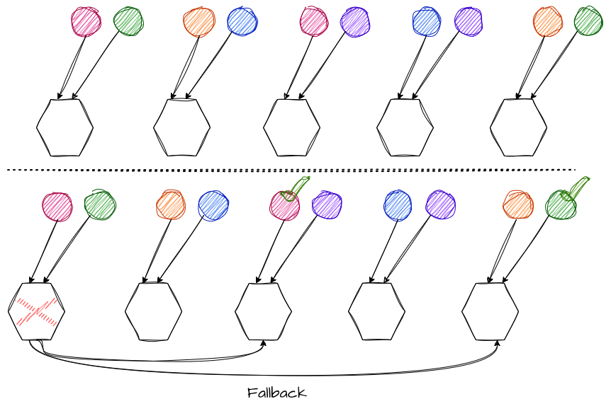

# System Design - Cell-Based Architecture

- [System Design - Cell-Based Architecture](#system-design---cell-based-architecture)
- [Definindo a Cell-Based Architecture](#definindo-a-cell-based-architecture)
  - [Unidades Celulares](#unidades-celulares)
  - [Dimensão Estrutural](#dimensão-estrutural)
  - [Isolamento de Estado](#isolamento-de-estado)
- [Estratégias de Roteamento e Direcionamento](#estratégias-de-roteamento-e-direcionamento)
  - [Edge Cells](#edge-cells)
  - [Segmentação de Carga](#segmentação-de-carga)
  - [Células Síncronas](#células-síncronas)
  - [Células Assíncronas](#células-assíncronas)
- [Replicação Celular](#replicação-celular)
  - [Replicação Assíncrona Entre Células](#replicação-assíncrona-entre-células)
  - [Replicação Consistente Entre Células](#replicação-consistente-entre-células)
  - [Replicação e Shuffle Sharding](#replicação-e-shuffle-sharding)
  - [Replicação e Blast Radius](#replicação-e-blast-radius)
- [Referências](#referências)

> **Nota:** Este documento é um material de estudo baseado no artigo original
> **"Cell-Based Architecture"**, de **Matheus Fidelis**, publicado em
> [fidelissauro.dev/cell-based](https://fidelissauro.dev/cell-based/).
> As ilustrações abaixo pertencem ao autor original. Recomenda-se a leitura do
> artigo completo na fonte.

---

# Definindo a Cell-Based Architecture

A **Cell-Based Architecture** representa um modelo descentralizado no qual as
capacidades de um sistema são estruturadas em uma **rede de células
independentes e autocontidas**. O padrão avança sobre o **Bulkhead Pattern**,
estabelecendo fronteiras de **domínios de falha** mais sofisticadas e bem
delimitadas.

O princípio central conecta os bulkheads ao modelo celular: criar **fronteiras
de isolamento** que garantem que o impacto de um erro permaneça restrito a um
conjunto limitado de componentes — uma célula — em vez de se propagar por todo
o sistema.

## Unidades Celulares



Uma **célula** é composta por múltiplos componentes (microsserviços, bancos de
dados, gateways) agrupados desde o desenho até o deploy. Cada célula opera como
uma **unidade de execução autônoma**, com segmentação em várias dimensões:

- **Segmentação de execução** — capacidade computacional isolada.
- **Segmentação de persistência** — bancos de dados independentes.
- **Segmentação de observabilidade** — métricas, logs e traces isolados.
- **Segmentação de deploy** — pipelines independentes.
- **Segmentação de falha** — blast radius mensurável e previsível.

Componentes globais compartilhados — como filas, caches ou bancos de dados
únicos — **invalidam esse isolamento** e devem ser mediados por componentes de
borda (edge) da célula. Se duas células compartilham o mesmo recurso global, a
falha desse recurso anula a proposta de contenção do modelo.

## Dimensão Estrutural

As células possuem **comunicação contínua intra-celular**, enquanto as
**dependências externas são mediadas pelo gateway da célula**. Componentes
internos não se comunicam diretamente com células externas — **toda
comunicação externa flui através dos gateways**, preservando a fronteira de
isolamento.

## Isolamento de Estado

As células mantêm **estado independente**, sem compartilhamento primário,
replicando dados apenas de forma passiva. Cada célula possui seus próprios
microsserviços, bancos de dados, caches e consumidores de eventos, operando
como **unidades autocontidas e independentes**.

Esse modelo habilita **estratégias diferenciadas por célula**, como testes
isolados, clientes piloto (canary) e rollout experimental de features em
subconjuntos controlados de clientes.

---

# Estratégias de Roteamento e Direcionamento

O princípio fundamental é rotear **todas as requisições para uma célula
específica com base em uma chave estável**, como `customerId`, `accountId` ou
`tenantId`.

Os algoritmos de roteamento devem ser **determinísticos**, garantindo que
requisições relacionadas sempre alcancem a mesma célula ativa. Durante um
failover, os roteadores redirecionam de forma transparente para células
passivas, sem que o cliente perceba a troca.

## Edge Cells



As **Edge Cells** formam uma camada de roteamento inteligente que intercepta as
comunicações e as redireciona corretamente para a célula disponível responsável
por tratar cada requisição. Essa camada deve permanecer **o mais stateless
possível**, ao mesmo tempo em que gerencia a capacidade global.

Elas vão além de proxies básicos (Nginx, Envoy, HAProxy): funcionam como
**aplicações inteligentes e agnósticas**, capazes de absorver alto tráfego sem
se tornarem um ponto único de falha (SPOF).

## Segmentação de Carga

A segmentação de carga celular difere fundamentalmente do **load balancing
tradicional**. Em vez de uma distribuição estatística, a segmentação é
**determinística e atrelada a uma chave de negócio estável**, permitindo o
mapeamento intencional ou a distribuição estatística através de algoritmos de
hashing.

Os mesmos clientes sempre alcançam a mesma célula — a distribuição **não varia
dinamicamente** com a pressão momentânea do sistema, como ocorreria em um
balanceador de carga convencional.

## Células Síncronas



O roteamento síncrono ocorre **no caminho crítico das requisições**. Protocolos
como HTTP, gRPC ou proprietários roteiam para uma célula específica antes da
execução transacional. O gateway de borda **identifica deterministicamente** a
célula correta através de chaves conhecidas (customer ids, tenants, users) e a
direciona para a célula correspondente.

Em cenários síncronos, **a latência da célula é diretamente percebida pelo
usuário**. Por isso, cada célula exige dimensionamento de performance autônomo,
com CPU, memória, conexões de banco, thread pools e configurações de rate
limiting isolados.

## Células Assíncronas



Em contextos assíncronos, a arquitetura celular assume uma estratégia ainda
maior de **capacidade e desacoplamento estrutural**. Cada célula consome
apenas as mensagens e eventos relevantes ao seu contexto.

Um **edge consumer** pode consumir uma fila ou tópico de domínio e republicar
mensagens/eventos para tópicos e filas segmentados de cada célula. Isso
elimina o **acoplamento temporal entre as células**, permitindo processamento
independente sem que o backpressure de uma célula impacte as demais.

---

# Replicação Celular



A replicação cria **células passivas** que funcionam como **espelhos das
células ativas** em termos de dados. As células ativas geram dados; as passivas
recebem atualizações por **consistência eventual** (replicação assíncrona) ou
por **consistência forte** (via Two-Phase Commit).

A replicação foca em **conter falhas**: bugs, erros de deploy ou requisições do
tipo *poison pill* permanecem contidos dentro das fronteiras da célula afetada,
enquanto os clientes são redirecionados de forma transparente para células
passivas.

Isso transforma a modelagem de risco. Em vez de perguntar *"qual o impacto da
falha de um shard?"*, passamos a perguntar *"qual a probabilidade de alocar um
cliente exatamente nas células que falharam simultaneamente?"*.

## Replicação Assíncrona Entre Células



Este é o modelo mais comum, adequado a cenários de **alta disponibilidade** que
toleram consistência eventual. As células ativas são as fontes primárias de
escrita, enquanto as passivas recebem atualizações de estado via *event
streams* ou filas assíncronas.

O custo é aceitar a **consistência eventual**, em troca de operações que
continuam com baixa latência mesmo sob carga elevada. Na falha de uma célula
ativa, a passiva assume a operação com um atraso mínimo de estado.

## Replicação Consistente Entre Células



Quando o domínio de negócio **não tolera divergência temporária de estado**, a
arquitetura precisa incorporar mecanismos de **coordenação distribuída**, como
**Two-Phase Commit** ou variações modernas de consenso. Isso assume maior
complexidade e mais riscos, já que múltiplas células participam de transações
distribuídas.

Embora **conceitualmente elegante**, o modelo introduz **acoplamento temporal
entre células**, aumenta a latência e reduz a capacidade absoluta de isolamento
de falhas. Sua aplicação deve ser **extremamente criteriosa**, restrita apenas
a fluxos verdadeiramente críticos.

## Replicação e Shuffle Sharding



Combinar a arquitetura celular com **shuffle sharding** é uma das estratégias
mais eficientes para reduzir o impacto sistêmico em escala.

Em vez de associar cada entidade a uma única célula, o **shuffle sharding mapeia
cada entidade a um subconjunto estável de células**, calculado por hashing
consistente. Os clientes interagem com pequenos grupos de células, assumindo
que os dados se replicam de forma consistente entre elas.

Quando uma célula falha, **apenas os clientes cujo subconjunto inclui aquela
célula são afetados**. A redução do blast radius torna-se dramática, mesmo em
sistemas com milhões de clientes.

## Replicação e Blast Radius

A arquitetura celular com replicação oferece **previsibilidade do impacto de
falhas**. Com a carga distribuída uniformemente entre N células, cada uma
absorve aproximadamente **1/N da carga total**, permitindo modelar o blast
radius como função direta da cardinalidade.

| Bulkheads / Células | Blast Radius | Disponibilidade |
|---------------------|--------------|-----------------|
| 1                   | 100%         | 0%              |
| 10                  | 10%          | 90%             |
| 50                  | 2%           | 98%             |
| 100                 | 1%           | 99%             |

A probabilidade de impacto com shuffle sharding pode ser estimada pela fórmula:

```
P(impacto) ≈ (f / N)^k
```

Onde:

- `f` = número de células em estado de falha;
- `N` = número total de células;
- `k` = fator de réplicas do shuffle sharding.

**Exemplo:** com **20 células**, fator de réplica **2** e **2 células
indisponíveis**, a probabilidade de impacto é de aproximadamente **1%**.
Comparado a bulkheads, que precisariam de **100 shards** para atingir o mesmo
1% de impacto, **20 células com fator de replicação 2 alcançam o mesmo
resultado** — evidenciando a eficiência da combinação entre células e shuffle
sharding.

---

# Referências

- **Artigo original:** Matheus Fidelis — *Cell-Based Architecture* —
  [https://fidelissauro.dev/cell-based/](https://fidelissauro.dev/cell-based/)
- AWS re:Invent 2022 — *Reliability and Cell-Based Architectures*
- AWS Well-Architected Framework — *Use cell-based architecture to reduce scope of impact*
- AWS Architecture Blog — *Reducing the Scope of Impact with Cell-Based Architecture*
- WSO2 Reference Architecture for Cell-Based Architecture
- ByteByteGo — *Cell-Based Architecture*
- Martin Fowler — *Patterns of Distributed Systems*
