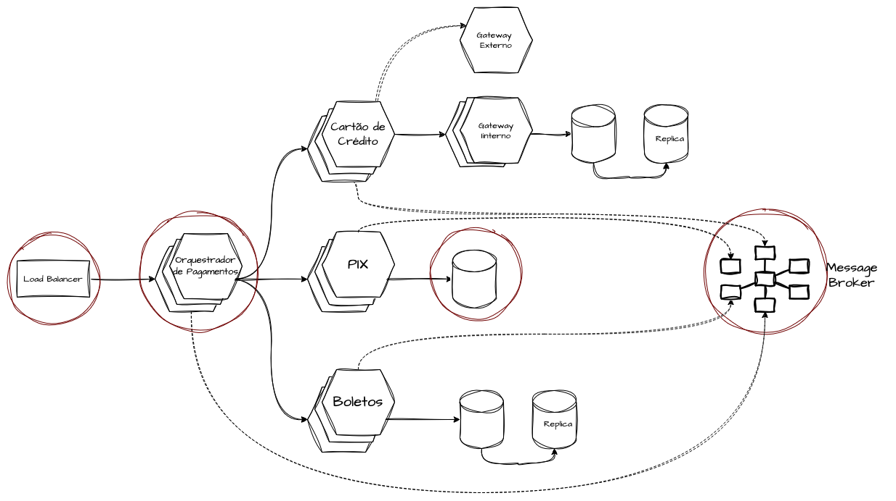
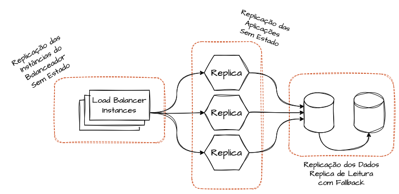
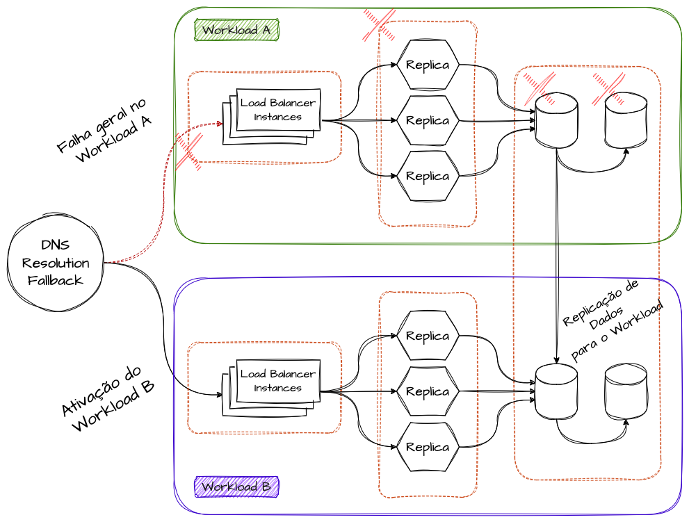
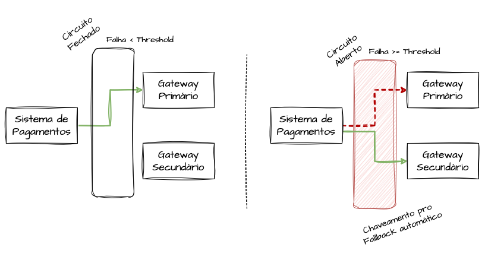
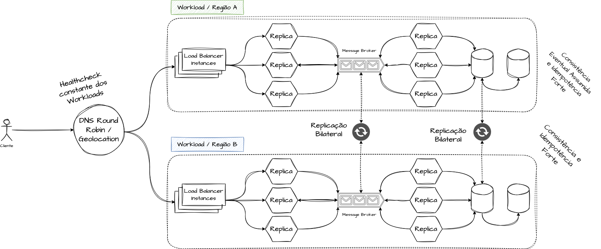
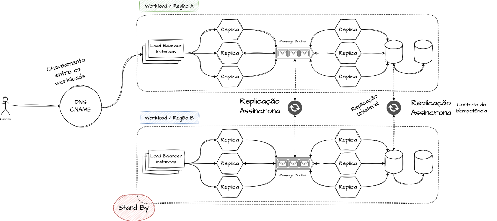
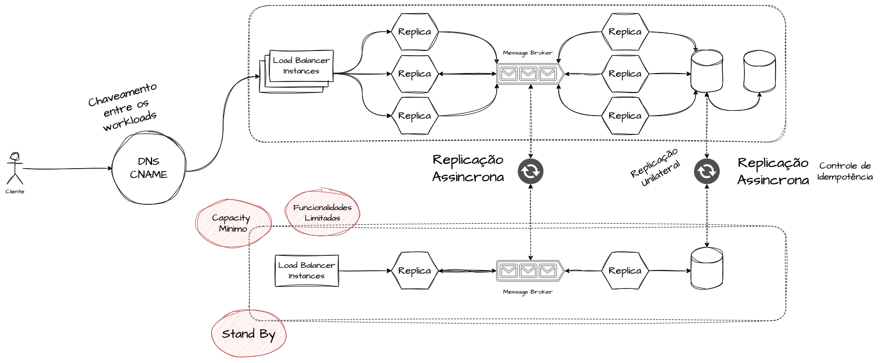

# System Design - Single Point of Failure, Disaster Recovery e Continuidade Operacional

- [System Design - Single Point of Failure, Disaster Recovery e Continuidade Operacional](#system-design---single-point-of-failure-disaster-recovery-e-continuidade-operacional)
- [Definindo um Single Point of Failure](#definindo-um-single-point-of-failure)
- [Identificando Single Points of Failure](#identificando-single-points-of-failure)
- [Lidando com Single Points of Failure](#lidando-com-single-points-of-failure)
  - [Design Stateless de Aplicação](#design-stateless-de-aplicação)
  - [Redundância e Replicação Ativa](#redundância-e-replicação-ativa)
  - [Redundância e Replicação Passiva](#redundância-e-replicação-passiva)
  - [Failover Automático](#failover-automático)
- [Disaster Recovery](#disaster-recovery)
  - [Ativo-Ativo](#ativo-ativo)
  - [Ativo-Passivo](#ativo-passivo)
  - [Pilot Light (Luz Piloto)](#pilot-light-luz-piloto)
- [Métricas e KPIs de Recuperação](#métricas-e-kpis-de-recuperação)
  - [MTTD - Mean Time to Detect](#mttd---mean-time-to-detect)
  - [MTTR - Mean Time to Repair](#mttr---mean-time-to-repair)
  - [MTBF - Mean Time Between Failures](#mtbf---mean-time-between-failures)
  - [RTO - Recovery Time Objective](#rto---recovery-time-objective)
  - [RPO - Recovery Point Objective](#rpo---recovery-point-objective)
- [Referências](#referências)

> **Nota:** Este documento é um material de estudo baseado no artigo original
> **"Single Point of Failure, Disaster Recovery e Continuidade Operacional"**,
> de **Matheus Fidelis**, publicado em
> [fidelissauro.dev/single-point-of-failure](https://fidelissauro.dev/single-point-of-failure/).
> As ilustrações abaixo pertencem ao autor original. Recomenda-se a leitura do
> artigo completo na fonte.

---

# Definindo um Single Point of Failure

Um **Single Point of Failure (SPOF)** é um componente cuja falha provoca a
**indisponibilidade total ou parcial** de um ou mais sistemas. É um ponto único
do qual o funcionamento de todo o resto depende, sem qualquer alternativa ou
redundância que absorva o seu colapso.

A analogia de uma **cidade com uma única ponte** ilustra bem o conceito: enquanto
a ponte funciona, tudo flui normalmente; quando ela cai, toda a cidade fica
isolada. Dependências concentradas criam riscos catastróficos — a saúde do
sistema inteiro fica refém de um único elo.

# Identificando Single Points of Failure

Identificar SPOFs exige **mapear as funcionalidades críticas** do sistema e
documentar todos os serviços, dependências e caminhos alternativos. É preciso
entender o fluxo ponta a ponta para descobrir onde existe um componente sem
réplica, sem failover ou sem rota alternativa.

Esse é um trabalho **contínuo de revisão arquitetural**, e não pontual. Exige
esforço corporativo para localizar componentes não replicados ou não resilientes
— sejam eles bancos de dados, balanceadores, gateways, filas, serviços de
autenticação ou até dependências externas de terceiros.

# Lidando com Single Points of Failure

As principais estratégias para mitigar SPOFs incluem **design stateless de
aplicação**, **redundância ativa**, **replicação passiva** e **failover
automático**. É importante entender que a **eliminação completa de SPOFs é
impossível** — sempre haverá algum nível de dependência crítica.

O foco, portanto, não é eliminar 100% dos pontos únicos, mas **reduzir o escopo
de impacto (blast radius)** e o **tempo de recuperação** quando a falha
inevitavelmente acontecer.

## Design Stateless de Aplicação

Ao **externalizar o estado** para camadas distribuídas (caches, bancos, object
storage), qualquer instância passa a ser capaz de atender qualquer requisição
sem depender de dados locais. Isso facilita a recuperação rápida de falhas,
pois uma instância pode ser substituída por outra sem perda de contexto.

A contrapartida é que a **responsabilidade pela resiliência se desloca para as
camadas de persistência** — que precisam, elas próprias, ser altamente
disponíveis e replicadas, sob risco de se tornarem o novo SPOF.

## Redundância e Replicação Ativa

Na **redundância ativa (ativo-ativo)**, múltiplas instâncias processam carga
**simultaneamente**, atrás de um load balancer ou consumindo de um sistema de
mensageria. A falha de uma réplica é diluída entre as demais, que continuam
operando.

O custo dessa estratégia é a necessidade de **mecanismos consistentes de
sincronização de dados** entre as réplicas, garantindo que todas operem sobre
um estado coerente.

## Redundância e Replicação Passiva

Na **redundância passiva (ativo-passivo)**, uma instância primária opera enquanto
instâncias *standby* aguardam para serem ativadas em caso de failover. É um
modelo **mais simples** que o ativo-ativo.

Sua eficácia depende fortemente da **velocidade de detecção da falha** e dos
**mecanismos de promoção** da instância passiva a primária. Quanto mais lenta a
detecção e a promoção, maior o tempo de indisponibilidade.

## Failover Automático

Mecanismos como **circuit breakers** e **feature toggles** detectam padrões de
falha e **redirecionam o tráfego** automaticamente para fluxos alternativos,
sistemas secundários ou modos de operação degradados com capacidade reduzida.

O objetivo é evitar que falhas em cascata derrubem o sistema inteiro: ao abrir
o circuito, isola-se o componente problemático e preserva-se o restante da
operação, ainda que com funcionalidade parcial.

# Disaster Recovery

O **Disaster Recovery (DR)** abrange as **estratégias, processos, arquiteturas e
automações** projetadas para restaurar sistemas após eventos de grande impacto —
como a perda de uma região inteira de datacenter.

Diferente da mitigação de SPOFs, que atua em **nível de componente**, o Disaster
Recovery opera em **nível de produto e entre regiões geográficas**. Os modelos
mais comuns são **ativo-ativo**, **ativo-passivo** e **pilot light**, que
trocam custo por tempo de recuperação.

## Ativo-Ativo

No modelo **ativo-ativo**, múltiplas regiões recebem tráfego **simultaneamente**,
maximizando a disponibilidade. Se uma região cai, as demais absorvem a carga sem
interrupção perceptível.

O preço dessa disponibilidade é a **complexidade de consistência distribuída**:
manter dados coerentes entre regiões exige estratégias sofisticadas, como
**CRDTs** (Conflict-free Replicated Data Types) para resolução de conflitos.

## Ativo-Passivo

No modelo **ativo-passivo**, uma região primária processa todo o tráfego
enquanto outra permanece **sincronizada e pronta para assumir** (takeover) em
caso de desastre.

Esse modelo equilibra **simplicidade e resiliência regional**: é menos complexo
que o ativo-ativo, mas implica um tempo de failover maior, já que a região
passiva precisa ser promovida antes de receber tráfego.

## Pilot Light (Luz Piloto)

No modelo **Pilot Light**, apenas os **componentes mais críticos** (como bancos
de dados e suas replicações) permanecem ativos na região secundária. Os demais
recursos são provisionados **sob demanda** durante a recuperação do desastre.

A vantagem é a **redução significativa de custos operacionais**, já que a maior
parte da infraestrutura fica desligada. Em troca, o **tempo de recuperação é
maior**, pois é preciso subir os componentes restantes no momento do incidente.

# Métricas e KPIs de Recuperação

Quantificar a eficácia da resiliência exige **medições padronizadas**: tempo de
detecção, duração do reparo, intervalo entre falhas e limites aceitáveis de
indisponibilidade e perda de dados. As principais métricas são MTTD, MTTR,
MTBF, RTO e RPO.

## MTTD - Mean Time to Detect

O **MTTD (Tempo Médio de Detecção)** mede a duração média entre o início de uma
falha e o momento em que ela é **detectada** pelos sistemas ou pela equipe de
operações. Depende diretamente do **investimento em observabilidade** — logs,
métricas, traces e alertas. Quanto melhor a observabilidade, menor o MTTD.

## MTTR - Mean Time to Repair

O **MTTR (Tempo Médio de Reparo)** mede o tempo médio entre a **detecção** e a
**restauração completa** da operação. Reflete a eficiência operacional, a
qualidade da documentação, a maturidade da automação e a robustez dos processos
de resposta a incidentes.

## MTBF - Mean Time Between Failures

O **MTBF (Tempo Médio Entre Falhas)** é o intervalo médio entre falhas
consecutivas, indicando a **estabilidade e confiabilidade** do sistema. Orienta
o planejamento de manutenção e a avaliação da qualidade da infraestrutura: um
MTBF alto significa um sistema que falha com pouca frequência.

## RTO - Recovery Time Objective

O **RTO (Objetivo de Tempo de Recuperação)** é o **tempo máximo aceitável de
indisponibilidade** após a detecção de um desastre — frequentemente um
compromisso contratual (SLA). Ele determina o nível de investimento e a
complexidade arquitetural necessários: um RTO baixo exige arquiteturas mais
caras e redundantes.

## RPO - Recovery Point Objective

O **RPO (Objetivo de Ponto de Recuperação)** define a **quantidade máxima
aceitável de perda de dados** após um desastre, tipicamente determinada pela
**frequência de backups** e pelo *lag* de replicação. Orienta o investimento em
estratégias de backup e replicação: um RPO próximo de zero exige replicação
contínua e síncrona.

# Referências

- **Artigo original:** Matheus Fidelis — *Single Point of Failure, Disaster Recovery e Continuidade Operacional* —
  [https://fidelissauro.dev/single-point-of-failure/](https://fidelissauro.dev/single-point-of-failure/)
- *Single Point of Failure (SPOF) in System Design* — levelup.gitconnected.com
- *Single point of failure* — en.wikipedia.org
- *What is a single point of failure?* — ibm.com
- *Why a Single Point of Failure (SPOF) is Scary* — anomali.com
- *Understanding Single Point Failures: A Guide to System Resilience* — bryghtpath.com
- *Qual a diferença entre MTTR, MTBF, MTTD e MTTF?* — logicmonitor.com
- *What Is MTTD? The Mean Time to Detect Metric, Explained* — splunk.com
- *What Is MTTD (Mean Time to Detect)? A Detailed Explanation* — sentinelone.com
