# System Design - Observabilidade e Monitoramento

- [System Design - Observabilidade e Monitoramento](#system-design---observabilidade-e-monitoramento)
- [Definindo Confiabilidade](#definindo-confiabilidade)
- [Observabilidade](#observabilidade)
  - [Monitoramento e Observabilidade](#monitoramento-e-observabilidade)
    - [Monitoramento como Detecção de Sintomas](#monitoramento-como-detecção-de-sintomas)
    - [Observabilidade como Comportamento](#observabilidade-como-comportamento)
- [Três Pilares da Observabilidade](#três-pilares-da-observabilidade)
  - [Métricas](#métricas)
    - [Contadores](#contadores)
    - [Gauges](#gauges)
    - [Histogramas](#histogramas)
  - [Traces](#traces)
  - [Logs](#logs)
    - [Níveis de Severidade](#níveis-de-severidade)
    - [Correlação de Logs](#correlação-de-logs)
    - [Estruturação e Indexação de Logs](#estruturação-e-indexação-de-logs)
  - [Agregados dos Pilares](#agregados-dos-pilares)
    - [Alerting](#alerting)
    - [APM](#apm)
- [Service Levels](#service-levels)
  - [SLI - Service Level Indicator](#sli---service-level-indicator)
  - [SLA - Service Level Agreement](#sla---service-level-agreement)
  - [SLO - Service Level Objective](#slo---service-level-objective)
  - [Error Budget](#error-budget)
- [Frameworks de Mercado](#frameworks-de-mercado)
  - [USE Method](#use-method)
    - [Utilization (Utilização)](#utilization-utilização)
    - [Saturation (Saturação)](#saturation-saturação)
    - [Errors (Erros)](#errors-erros)
  - [RED Method](#red-method)
    - [Rate (Request Rate / Throughput)](#rate-request-rate--throughput)
    - [Errors (Error Rate)](#errors-error-rate)
    - [Duration (Request Duration / Latency)](#duration-request-duration--latency)
  - [Four Golden Signals](#four-golden-signals)
    - [Latency](#latency)
    - [Traffic](#traffic)
    - [Errors](#errors)
    - [Saturation](#saturation)
- [Referências](#referências)

> **Nota:** Este documento é um material de estudo baseado no artigo original
> **"Observabilidade e Monitoramento"**, de **Matheus Fidelis**, publicado em
> [fidelissauro.dev/observabilidade](https://fidelissauro.dev/observabilidade/).
> As ilustrações abaixo pertencem ao autor original. Recomenda-se a leitura do
> artigo completo na fonte.

---

# Definindo Confiabilidade

**Confiabilidade** é a propriedade de um sistema entregar **comportamento correto
ao longo do tempo**, tanto sob condições esperadas quanto adversas. É um conceito
que não se confunde com **alta disponibilidade**: um sistema pode estar "no ar" e,
ainda assim, ser pouco confiável se retorna dados incorretos, degrada de forma
caótica ou apresenta latência imprevisível.

A confiabilidade combina três dimensões: **continuidade do serviço**, **integridade
dos dados** e **previsibilidade operacional**. Em vez de um atributo opcional, ela
deve ser tratada como uma **restrição arquitetural** e um **contrato operacional**.

Na prática, confiabilidade é resultado de disciplinas que **reduzem a probabilidade
e o impacto das falhas**, **aceleram a detecção e a recuperação** e **limitam efeitos
em cascata**. A observabilidade é justamente a base que torna esse trabalho possível,
pois sem visibilidade não há como medir, detectar ou corrigir comportamentos
indesejados.

# Observabilidade

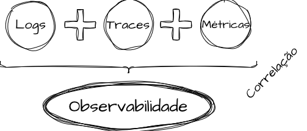

O conceito de **observabilidade** tem origem na **Teoria de Controle**, formalizada
por **Rudolf Kalman** em 1960, e descreve a **capacidade de inferir o estado interno
de um sistema a partir de suas saídas externas**. Trazido para o software, isso
significa compreender o comportamento de um sistema observando seus **logs, métricas
e traces**.

O ponto central é que observabilidade é uma **propriedade estrutural do sistema**, e
não um conjunto de ferramentas. Ela habilita a **análise exploratória**: correlacionar
eventos para investigar comportamentos que não foram previstos de antemão. Enquanto o
monitoramento responde ao já conhecido, a observabilidade permite **fazer perguntas
novas** sobre fenômenos ainda desconhecidos.

## Monitoramento e Observabilidade

**Monitoramento** e **observabilidade** são conceitos complementares, não sinônimos.
O monitoramento detecta **sintomas conhecidos e pré-definidos** — um aumento de erros,
a saturação de CPU, uma latência fora do esperado. A observabilidade investiga
**fenômenos desconhecidos**, explorando dados contextuais amplos para entender a causa.

A síntese é direta: o **monitoramento pergunta "algo saiu do normal?"**, enquanto a
**observabilidade pergunta "por quê?"**. O primeiro trabalha com *thresholds*; a segunda,
com a correlação de múltiplos sinais. Em sistemas distribuídos, uma degradação pode
nascer em um ponto e se manifestar em outro completamente diferente — e é a
observabilidade que permite cruzar logs, métricas e traces entre serviços para
encontrar a origem.

### Monitoramento como Detecção de Sintomas

O monitoramento modela **sintomas conhecidos**: taxa de erro alta, latência elevada,
CPU ou memória saturadas. Ele detecta **desvios de um padrão previamente definido**,
mas nem sempre explica a causa por trás do desvio.

É também uma prática **evolutiva**: amadurece junto com o sistema, incorporando o
aprendizado histórico do time a cada incidente. Quanto mais o time conhece os modos
de falha do seu sistema, melhores e mais precisos se tornam os alarmes de monitoramento.

### Observabilidade como Comportamento

A observabilidade se interessa por **como o sistema reage ao longo do tempo** sob
condições variadas. Em vez de apenas verificar se um valor cruzou um limite, ela busca
entender o **comportamento** do sistema como um todo.

Esse olhar é o que permite **correlacionar logs, métricas e traces entre múltiplos
serviços** em uma transação distribuída, reconstruindo o caminho percorrido por uma
requisição e localizando a origem real de comportamentos desviantes.

# Três Pilares da Observabilidade

A observabilidade se apoia em **três pilares fundamentais**: **métricas**, **traces** e
**logs**. Cada um responde a um tipo diferente de pergunta, e o valor real surge quando
eles são **combinados e correlacionados** para contar a história completa de uma
transação ou de um comportamento sistêmico.

## Métricas

**Métricas** são aspectos **quantitativos** que medem comportamento, desempenho e
estados ao longo do tempo. Elas operam tanto em níveis **técnicos** (latência, taxa de
erros, uso de recursos) quanto em níveis de **negócio** (vendas, transações aprovadas,
cadastros). Existem três tipos principais: contadores, gauges e histogramas.

### Contadores

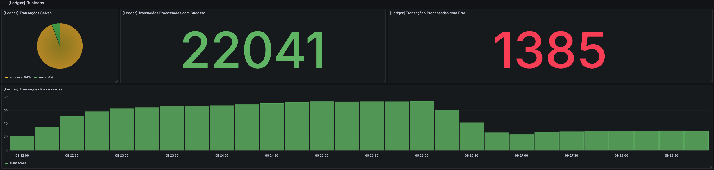

**Contadores (counters)** são valores que **apenas aumentam** ou são **reiniciados para
zero**. São ideais para medir grandezas acumulativas, como o **total de requisições
recebidas**, o **número de erros** ou a **quantidade de itens processados**.

Por crescerem monotonicamente, contadores costumam ser analisados pela sua **taxa de
variação** (a derivada ao longo do tempo) — por exemplo, "requisições por segundo"
calculadas a partir do contador total.

### Gauges

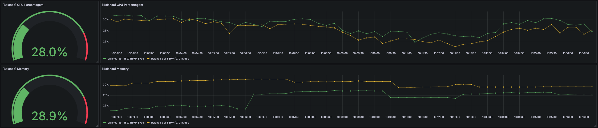

**Gauges** são valores que podem **aumentar e diminuir** livremente, representando um
estado instantâneo. São apropriados para grandezas como **uso de CPU**, **memória
ocupada**, **conexões ativas** ou **tamanho de uma fila** em um dado momento.

Diferente dos contadores, o gauge representa uma "fotografia" do valor atual, e não um
acúmulo histórico.

### Histogramas

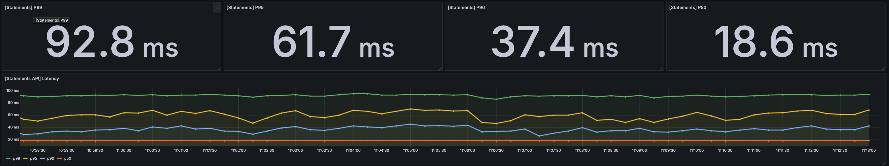

**Histogramas** agregam observações em **baldes (buckets)**, permitindo calcular
**quantis e percentis** — como o **p99 da latência**. Em vez de guardar cada medição
individual, o histograma distribui as observações em faixas de valor.

Essa estrutura é essencial para entender **distribuições de cauda longa**, nas quais a
média esconde os outliers que realmente importam. Percentis como p95 e p99 revelam a
experiência dos usuários mais penalizados pela degradação.

## Traces

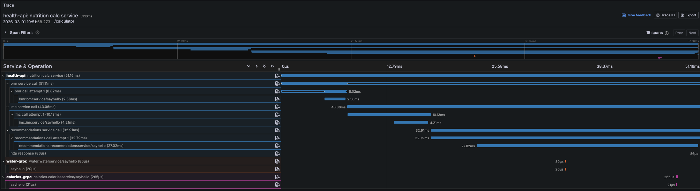

Em arquiteturas de **microsserviços**, os **traces** capturam a amostra de uma
requisição **ponta a ponta**, atravessando múltiplos componentes. Eles revelam o
**caminho da transação**, os **tempos de processamento** em cada etapa, a **latência
entre serviços** e os **erros** ocorridos ao longo do percurso.

O grande diferencial do trace é **conectar eventos em uma narrativa coesa**, expondo as
interações sistêmicas. Ele ajuda a responder o **"por quê"** em contextos complexos,
detalhando a execução em nível de funções, métodos, queries de banco e chamadas HTTP.

## Logs

**Logs** são **registros textuais de eventos** ocorridos em um momento específico. Cada
log carrega um **timestamp** e **metadados** que permitem ordená-los historicamente,
funcionando como um **"diário detalhado"** do sistema.

A característica que distingue os logs dos traces é o foco em **troubleshooting
funcional** — afinal, nem todo problema é um erro. Logs respondem a perguntas do tipo
*"o que aconteceu com a transação X?"* ou *"qual foi exatamente o erro retornado?"*.

### Níveis de Severidade

Os logs são classificados por **níveis de severidade**, que expressam a **criticidade
semântica** de cada registro. A escolha correta do nível é o que mantém o volume de
logs útil e navegável.

| Nível | Intenção |
|-------|----------|
| **TRACE** | Microscopia — passos muito finos, para investigação pontual |
| **DEBUG** | Diagnóstico — explicar decisões, variáveis e troubleshooting |
| **INFO** | Narrativa — registrar eventos relevantes do fluxo e do domínio |
| **WARN** | Desvio recuperável — degradação, mas o sistema continua operando |
| **ERROR** | Falha operacional — a requisição falhou ou um critério foi violado |
| **FATAL / CRITICAL** | Falha terminal — o runtime não consegue prosseguir |

- **TRACE:** o nível mais verboso, usado para rastrear branches condicionais, parâmetros
  intermediários, serialização/deserialização e detalhes de protocolo.
- **DEBUG:** explica **por que** uma decisão foi tomada — fallbacks acionados, validações
  executadas e parâmetros que levaram a determinada regra de negócio.
- **INFO:** conta a **narrativa da transação** — quando a requisição entra, qual entidade
  está envolvida, se a operação foi aceita, mudanças de estado, início/fim de jobs e
  publicação de eventos de domínio.
- **WARN:** sinaliza um **desvio com continuidade** — uma dependência lenta que exigiu
  retry, um fallback acionado, um circuito que abriu, um timeout que quase estourou ou uma
  fila crescendo. Deve ser **acionável** e carregar contexto.
- **ERROR:** indica a **falha de uma operação** — requisição com erro, critério de domínio
  violado, dependência indisponível, transação abortada ou estado inconsistente. Precisa
  dizer **o quê** falhou, **por quê**, **onde** e **como correlacionar**.
- **FATAL:** representa a **falha terminal** — o processo cai, o serviço não inicia, há
  configuração inválida ou um recurso crítico inacessível.

### Correlação de Logs

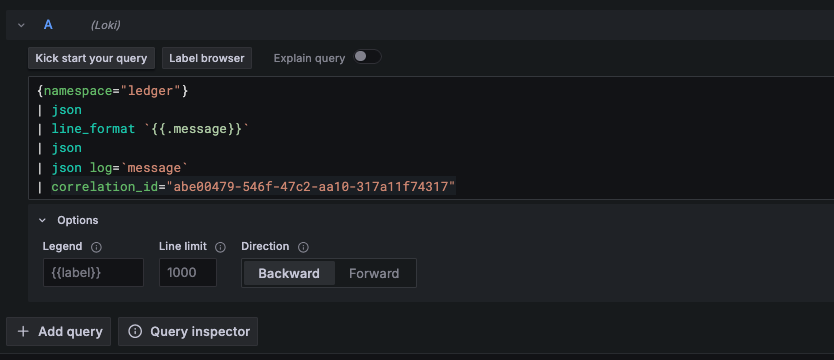

Os logs ganham valor real quando **contam uma história**. Eles devem ser tratados como um
**agregado**: a transação é o agregado, e cada linha de log é um item dessa história.

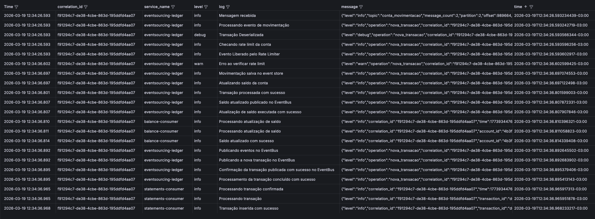

Campos repetidos entre serviços — como **`trace_id`**, **`correlation_id`** ou
**`order_id`** — permitem **correlacionar logs de diversas fontes** e reconstruir a
sequência completa de uma transação, gerando uma espécie de "extrato" do que aconteceu.
É justamente esse poder de correlação que **justifica os altos custos** de ingestão e
retenção de logs.

### Estruturação e Indexação de Logs

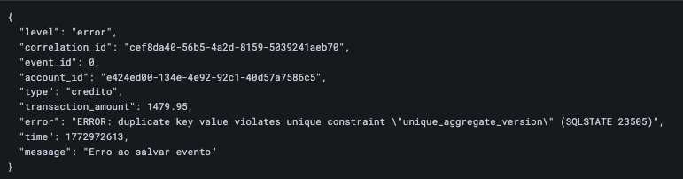

Aplicações em escala geram **gigabytes ou terabytes de logs diariamente**, e logs em
**texto puro** se tornam difíceis de analisar nesse volume. A solução é estruturar os
logs em formatos como **JSON**, permitindo a **indexação por campos específicos** que são
frequentemente buscados.

Logs estruturados reduzem o **custo computacional e financeiro** das buscas e tornam o
pilar significativamente mais eficiente. Padronizar os campos em ambientes grandes é um
desafio, mas o ganho de eficiência compensa o esforço.

## Agregados dos Pilares

Sobre os três pilares constroem-se capacidades agregadas que transformam dados brutos em
ação. Duas das mais importantes são o **alerting** e o **APM**.

### Alerting

O **alerting** transforma **números e dimensões conhecidas de degradação** em **sinais
para intervenção humana**. Ele observa os sinais disponíveis e decide **quando** um
comportamento saiu do padrão a ponto de merecer reação.

Do ponto de vista da confiabilidade, o maior valor do alerting está em **acelerar os
feedback loops**: ele **reduz o MTTD** (Mean Time To Detect), **protege o error budget**,
**orienta war rooms** e **cria senso de prioridade operacional**.

### APM

O **APM (Application Performance Monitoring)** é a observabilidade voltada a compreender o
**comportamento da aplicação durante a execução de trabalho útil**, com foco na
**experiência do cliente**.

Enquanto as métricas de infraestrutura mostram o estado dos recursos, o APM organiza os
sinais **ao redor da experiência da aplicação**: operações, endpoints, dependências,
tempos de resposta, throughput e taxas de erro. Ele responde a perguntas como *"quais
operações estão mais lentas?"*, *"quais dependências consomem mais tempo?"* e *"onde estão
os gargalos de latência?"*.

# Service Levels

Os **Service Levels** formam um framework de mercado, originário do **Google**, voltado à
engenharia de confiabilidade. Sua proposta é **traduzir métricas técnicas em
direcionadores de produto** compreensíveis em múltiplos níveis da organização.

Eles criam uma **interface comum entre engenharia e negócio**, com um acordo explícito
sobre a **experiência mínima aceitável**, as **tolerâncias operacionais** e o **custo de
sustentar** cada patamar de qualidade. Os principais elementos são SLI, SLA, SLO e o
Error Budget.

## SLI - Service Level Indicator

O **SLI (Service Level Indicator)** é o **indicador mensurável** que materializa o SLA e o
SLO. É o **dado observado** — como **disponibilidade/uptime**, **latência**, **throughput**,
**error rate**, **saturação** ou **tempo de recuperação**.

Os SLIs também podem ser métricas de **negócio**, como acurácia de um modelo, taxa de
aprovação transacional ou redução de fraudes. A escolha de quais indicadores adotar deve
ser **criteriosa e evolutiva**, acompanhando o amadurecimento do sistema.

## SLA - Service Level Agreement

O **SLA (Service Level Agreement)** é o **compromisso contratual** de nível de serviço,
formalizado com clientes, áreas internas ou parceiros. É a esfera **contratual**, com
possíveis **consequências jurídicas** caso seja quebrado.

Por isso, o SLA não é o lugar para "fidelidade técnica", e sim para **accountability**. Ele
tende a ser **mais conservador e menos granular**, mas precisa ser **mensurável e
auditável**. Um SLA **nunca deve ser 100%**, pois qualquer variação comprometeria o
contrato. Exemplos: *"99.99% de uptime"*, *"responder transações em menos de 600ms"*, *"RPO
máximo de 2h"* ou *"tempo de recuperação inferior a 1h"*.

## SLO - Service Level Objective

O **SLO (Service Level Objective)** é o **"contrato interno"** de confiabilidade do time
técnico — o critério que a engenharia usa para **operar e assumir riscos**. Exemplos:
*"responder em menos de 600ms no p99 e 500ms no p95"*, *"manter replicação com fator 3"* ou
*"error rate diário abaixo de 1%"*.

Quando os SLIs do SLO são os mesmos do SLA, o SLO deve ser **mais restritivo**, funcionando
como uma **blindagem técnica** para o contrato. A lógica de longo prazo é que o SLO acaba
**virando o SLA**, enquanto o time continua elevando internamente o nível de exigência.

## Error Budget

O **Error Budget (orçamento de erros)** está associado ao contrato de confiabilidade. Se o
SLO define **"quanto erro é aceitável"**, o Error Budget define **"quanto erro ainda pode
ser consumido"** antes de o serviço entrar em risco. Exemplo: com um SLO de 99.95% e SLIs
apontando 99.98%, há uma **margem de 0,03%** para gastar.

Ele funciona como um **indicador de feedback loop para releases**:

- **Budget saudável:** o time pode **acelerar mudanças** e correr mais riscos.
- **Budget sendo consumido:** convém **desacelerar** e priorizar correções.
- **Budget estourado:** **congelam-se os releases** não essenciais até a recuperação.

# Frameworks de Mercado

Os **frameworks de mercado** fornecem **"estrelas-guia"** simplificadas para times de
engenharia e produto. Eles resolvem dois problemas opostos: o time que **se afoga em
centenas de métricas desconexas** e o time que **se apega a uma ou duas métricas fáceis** e
acaba tomando decisões erradas.

A proposta é oferecer **métricas simples e compreensíveis** que funcionem como **bússolas
de navegação**. Vale destacar que usar um framework **não elimina** a necessidade de
observar as dimensões detalhadas — ele apenas organiza o ponto de partida. Os três
frameworks mais difundidos são **USE**, **RED** e os **Four Golden Signals**.

## USE Method

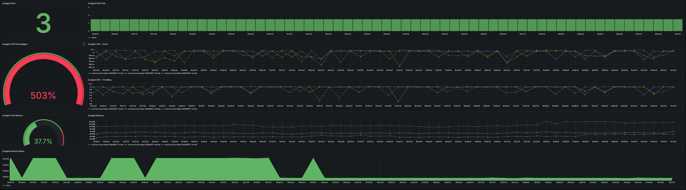

O **USE Method**, formalizado por **Brendan Gregg**, é uma estratégia de **checagem
sistemática da saúde de recursos físicos** alocados. Para cada recurso — CPU, memória,
disco, rede, filas, pools — observam-se **três dimensões**: **Utilization** (utilização),
**Saturation** (saturação) e **Errors** (erros).

Seu propósito é **iniciar a investigação de uma queda de performance** de forma simples e
rápida, varrendo os recursos um a um.

### Utilization (Utilização)

A **utilização** mede **quanto de um recurso está consumido** em um intervalo de tempo.
Para CPU, é o percentual de tempo em execução; para memória, o uso em relação ao
provisionado; para disco, o *busy time* ou throughput em relação ao limite de IOPS; para
rede, a banda consumida frente ao total; para pools, as conexões em uso frente ao limite.

É um bom indicador de **carga e tendência**, útil para **capacity planning** e para detectar
regressões de desempenho.

### Saturation (Saturação)

A **saturação** é o estado de **superalocação** de um recurso computacional. Em vez de olhar
apenas o percentual de uso, ela mede a **ocupação ou pressão** — quanto trabalho está
**aguardando** porque o recurso não dá conta.

Exemplos: **quantos processos aguardam CPU** (run queue) ou **quantas requisições estão
enfileiradas** esperando processamento. Sinais típicos incluem **load average** (CPU),
**swapping e GC excessivo** (memória), **filas de I/O e iowait** (disco) e **drops e
retransmissões** (rede).

### Errors (Erros)

Os **erros** são as **falhas associadas ao recurso** monitorado. Para CPU, *starvation* e
erros de scheduling; para memória, **OOMKills** e *allocation failures*; para disco, erros
de I/O, timeouts e corrupções; para rede, *connection resets*, falhas de TLS handshake,
packet loss e falhas de DNS; para pools, mensagens como *"too many connections"*, *"thread
pool exhausted"*, *"queue full"* ou *"rate limit exceeded"*.

Quando erros desse tipo aparecem, eles sinalizam que o **recurso provisionado não é
suficiente** para o trabalho exigido.

## RED Method

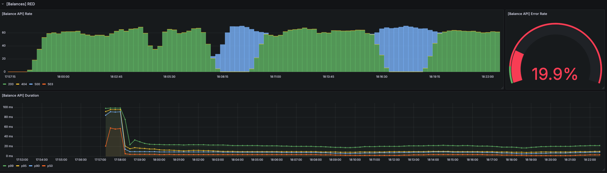

O **RED Method**, associado a **Tom Wilkie** e à **Grafana**, nasceu para **microsserviços**
— enquanto o USE foca em recursos e infraestrutura, o RED foca na **aplicação**. Ele
simplifica os sinais vitais de qualquer aplicação web em três dimensões: **Rate**, **Errors**
e **Duration**.

### Rate (Request Rate / Throughput)

O **Rate** mede a **pressão de demanda** sobre o serviço e a **capacidade efetiva de
processá-la** — quantas transações chegam por intervalo de tempo (*"transações/segundo"*,
*"requisições/minuto"*). Pode ser observado globalmente ou de forma granular: por endpoint,
operação (GET/POST), tenant, região ou versão.

Costuma ser a **primeira métrica monitorada**, pois um aumento de rate pode acarretar
**saturação** e um crescimento proporcional de **erros e filas**. Ajuda a identificar picos,
tendências e a gerar insights para **capacity planning** e **autoscaling**.

### Errors (Error Rate)

O **Errors** é a **porcentagem de requisições que chegam e falham**, e deve ser definido de
forma **semântica**. É insuficiente considerar apenas os **5xx** — os **4xx** também
representam degradação (autenticação falhando por *clock skew*, validações quebradas, **429**
por excesso de rate limit).

Erro é **tudo o que viola a expectativa de sucesso**: falha de autorização indevida, timeout,
resposta inválida, inconsistência, idempotência quebrada, duplicidade — até um sucesso que
chegou tarde demais. Todos os códigos **4xx e 5xx** devem ser **monitorados**, ainda que nem
todos sejam tratados como SLOs.

### Duration (Request Duration / Latency)

A **Duration** é o **tempo para completar uma operação** do ponto de vista do consumidor. É
**fácil de medir** — e igualmente **fácil de medir errado**. O principal erro é usar
**exclusivamente a média**, que se distorce em **distribuições de cauda longa**, justamente
onde mora a degradação real.

Por isso, a Duration exige **percentis** (p50, p95, p99) e, idealmente, **histogramas**.
Quando aplicada de forma granular por métodos e endpoints, ela revela **quais
funcionalidades** apresentam desvios de latência.

## Four Golden Signals

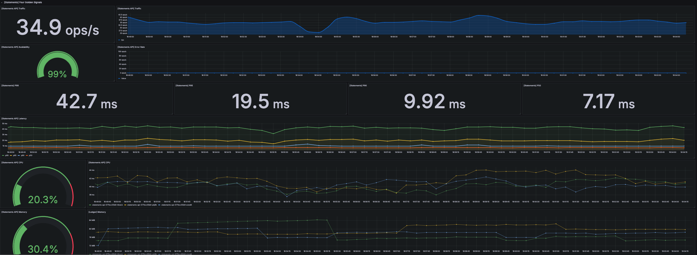

Os **Four Golden Signals** são a forma do **Google SRE** de descrever a **saúde operacional**
de um sistema *user-facing*, evitando o caos de métricas infinitas. A ideia é recomendar
**quatro métricas principais** — **Latency**, **Traffic**, **Errors** e **Saturation** — que
orientam a definição de SLOs.

Esse framework padroniza as métricas em escopos pequenos, médios ou grandes e combate o
**"monitoramento por acúmulo"**, no qual o time coleciona métricas sem um modelo mental
coeso. Ele responde a duas perguntas: *"o sistema está saudável do ponto de vista do
usuário?"* e *"quais sistemas estão degradados?"*.

### Latency

A **Latency** é o **tempo que o sistema, transação ou funcionalidade leva para responder**.
Deve incluir tanto as **respostas bem-sucedidas** quanto as **respostas com erro** — ambas
são observáveis e relevantes. *"Rápido e errado"* importa tanto quanto *"lento e correto"*.

Como nos demais casos, não se deve olhar apenas a média: os **percentis** (p99, p95, p90,
p50) é que dão visibilidade aos **outliers**.

### Traffic

O **Traffic** (tráfego ou throughput) é a **quantidade de solicitações recebidas** em um
intervalo de tempo — requisições/segundo, transações/segundo, queries/segundo, bytes ou
mensagens. Representa **"quanto de trabalho"** chega ao sistema.

Um cuidado importante é **separar o crescimento legítimo** de uma **amplificação causada por
mecanismos internos**, como retries, fan-out, reprocessamentos, loops, *cache miss* em massa
ou abuso.

### Errors

Os **Errors** representam a **taxa de falhas percebidas em relação ao Traffic**. Podem
aparecer como **códigos internos** (5xx), **falhas de protocolo** ou **falhas semânticas** no
resultado.

Também é importante **monitorar os erros de cliente (4xx)**, pois eles ajudam a entender
comportamentos e desvios — mesmo que não sejam necessariamente tratados como violações de
SLO.

### Saturation

A **Saturation** indica a **proximidade do esgotamento dos recursos provisionados** — quanto
o sistema está **"no limite"** de um recurso crítico e quanto trabalho se acumula porque esse
recurso não acompanha a demanda.

Exemplos: quanto do tráfego está **próximo do rate limit** estabelecido, ou quanto do uso de
CPU está **próximo do limite de risco**.

# Referências

- **Artigo original:** Matheus Fidelis — *Observabilidade e Monitoramento* —
  [https://fidelissauro.dev/observabilidade/](https://fidelissauro.dev/observabilidade/)
- *Time, Clocks, and the Ordering of Events in a Distributed System* — Leslie Lamport
- *The USE Method* — Brendan Gregg
- *The RED Method: How To Instrument Your Services* — Grafana / Tom Wilkie
- *Four Golden Signals* — Google SRE Book
- *Service Level Objectives (SLOs)* — Google SRE Book
- *What is Observability?* — Red Hat, New Relic, Elastic
- *Monitoring Distributed Systems* — Google SRE
- *OpenTelemetry* — documentação oficial
- *Feedback Loops e Error Budgets* — Grafana / Splunk
- *SRE Brasil (Nanoshots)* — comunidade de Confiabilidade
